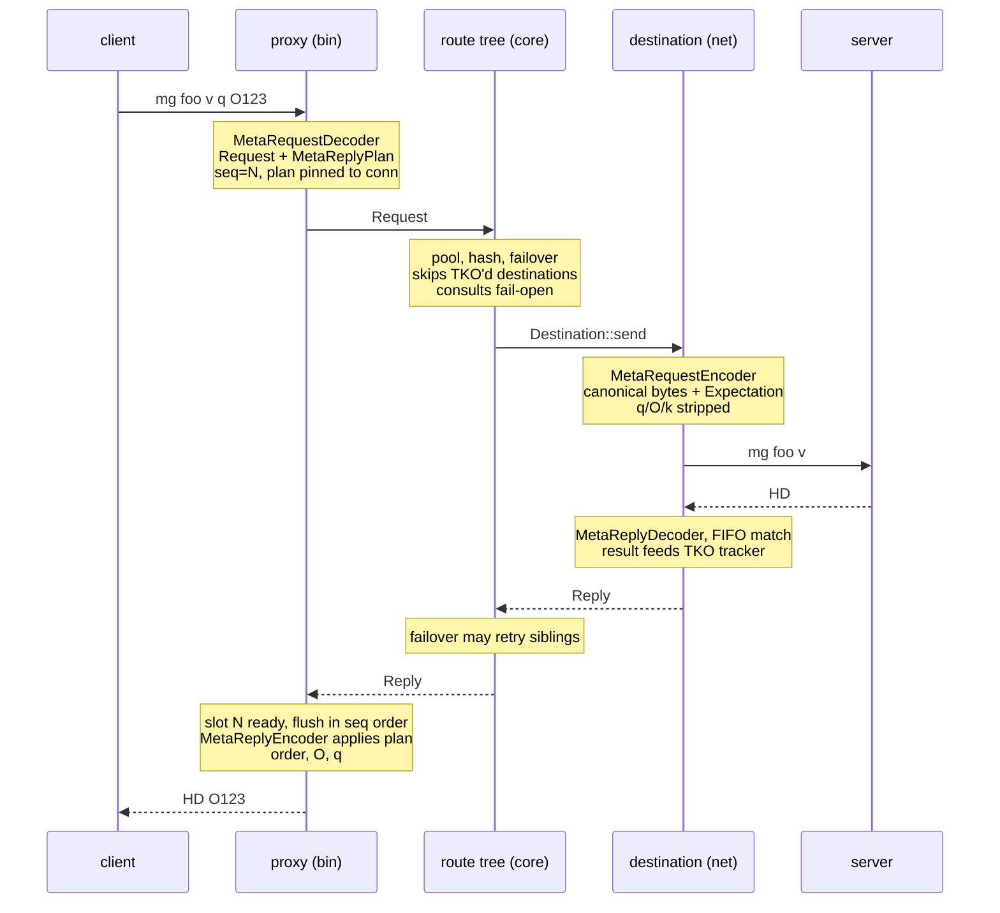

# architecture overview
rusty-mcrouter is a memcached routing proxy. clients reach it via the **meta protocol**, and rusty-mcrouter routes each request thru a tree of route handles to a destination server, tracking server health and failing over along the way

## crates
there are five crates layered bottom up 
- **`rusty-mcrouter-protocol`** - the meta protocol codec, request and reply types, the encoders and decoders for both requests and replies and key parsing
- **`rusty-mcrouter-net`** - everything that touches a backend socket. a connection actor that does pipelining and FIFO reply matching. a destination layer that creates one `Destination` per server and timeout pair, own connections and probes in the case of TKOs. a TKO tracker that tracks health per destination, per pool, and for the entire proxy
- **`rusty-mcrouter-config`** - config file parsing into pools, routes and policies
- **`rusty-mcrouter-core`** - the routing graph, where a config file is transformed into a tree of route handles
- **`rusty-mcrouter`** - the binary, where all the previous crates come together to create proxy threads and workers, client connection handling and cross thread dispatch

## request lifecycle

the identity of a request is split into three distinct components

| piece                  | what it does                                                                        | lives where                                   |
|------------------------|-------------------------------------------------------------------------------------|-----------------------------------------------|
| `Request`              | the request, stripped down to just the command, key and typed flags                 | crosses the routing graph                     |
| `MetaReplyPlan`        | how to present the reply to the client (quiet policy, opaque echo, token ordering) | pinned to the client connection, never routed |
| `MetaReplyExpectation` | the expected reply shape from a backend                                             | pinned to the backend connection's FIFO       |

three consequences of this design are:
1. **the backend never sees the client's spelling of the request** - rusty-mcrouter re-encodes from the parsed `Request`, not the client's original bytes. this means that the routing prefix is stripped from the original key, presentation flags (q,O,k) are removed, and the flag order is normalized. removed flags are stored in `MetaReplyPlan` and reapplied when encoding the reply back to the client
2. **reply matching is positional** - no opaque tokens are sent to the backend. the connection actor matches replies on a FIFO of `MetaReplyExpectation`s, with tombstones keeping alignment across per-request timeouts
3. **clients see strict request order** - replies may complete out of order (thru fanout or failovers), but the frontend reserializes thru sequence-numbered slots before writing

## divergences from mcrouter

| area          | mcrouter                                  | rusty-mcrouter                              |
|---------------|-------------------------------------------|---------------------------------------------|
| protocol      | ascii + binary + meta                     | meta only, on both legs                     |
| runtime       | libevent + folly fibers                   | tokio, thread-per-worker, thread-local `Rc` |
| route types   | full zoo: shadow, prefix, AllSync, WarmUp | pool, hash, failover, selection so far      |
