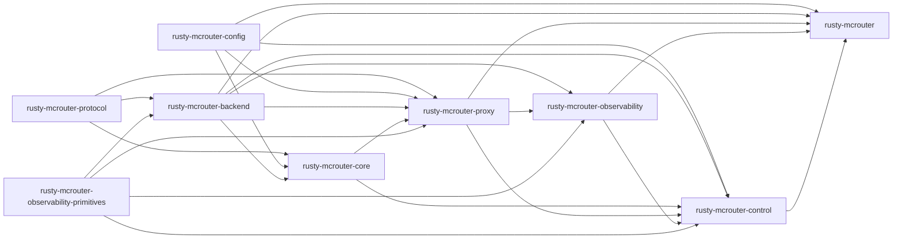
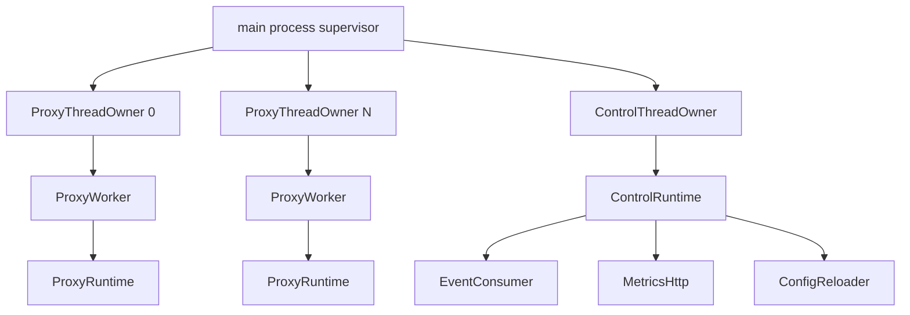
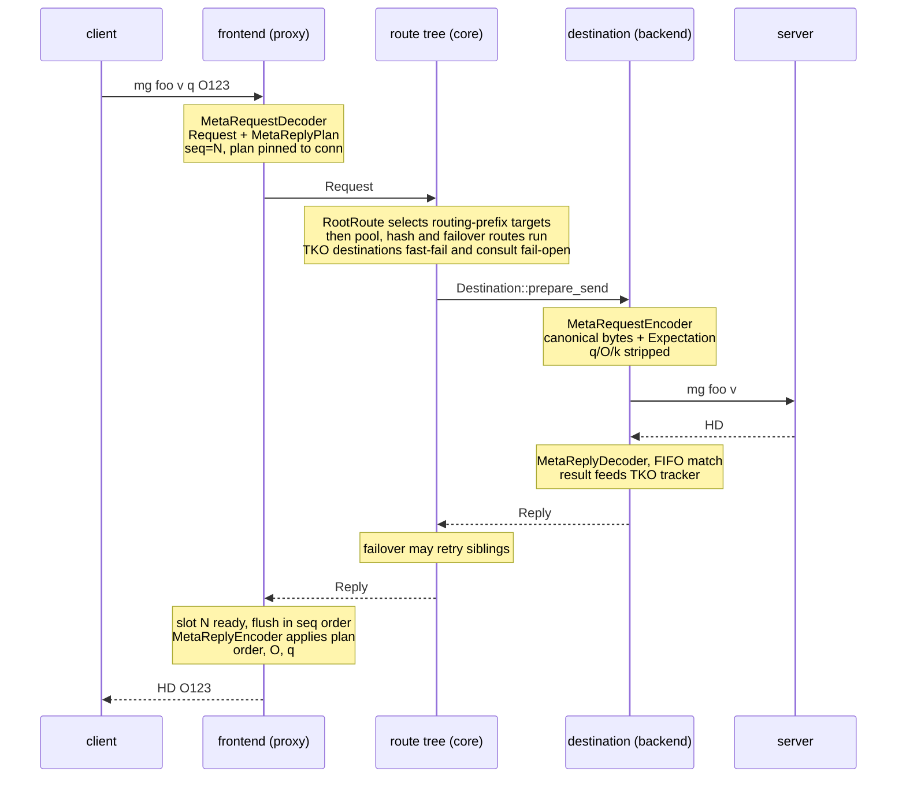

# architecture overview
rusty-mcrouter is a memcached routing proxy. clients reach it via the **meta protocol**, and rusty-mcrouter routes each request thru a tree of route handles to a destination server, tracking server health and failing over along the way

## crates
the root Cargo workspace has nine packages: the executable in `bin/rusty-mcrouter/`
and eight libraries in `crates/`. internal dependency paths are declared in the
root manifest and inherited by each package. `bench/` is a separate workspace
with its own lockfile and pinned load-generator dependencies.

dependencies point from lower-level primitives and fact owners toward
composition and presentation (`A --> B` means B depends on A):

- **[`rusty-mcrouter-protocol`](../../crates/protocol/)** - the meta protocol codec, request and reply types, the encoders and decoders for both requests and replies and key parsing
- **[`rusty-mcrouter-config`](../../crates/config/)** - config file parsing into pools, routes and policies
- **[`rusty-mcrouter-observability-primitives`](../../crates/observability-primitives/)** - std-only metric cells and event sink mechanics shared by fact-owning crates; no domain records or presentation logic
- **[`rusty-mcrouter-backend`](../../crates/backend/)** - the memcached-facing leg. a connection actor that does pipelining and FIFO reply matching, destinations that own connections and probes, and TKO tracking per destination, pool and router
- **[`rusty-mcrouter-core`](../../crates/core/)** - the routing graph, where a config file is transformed into a tree of route handles
- **[`rusty-mcrouter-proxy`](../../crates/proxy/)** - the client-facing leg and orchestration: proxy runtimes, frontend protocol handling, connections and cross-thread dispatch
- **[`rusty-mcrouter-observability`](../../crates/observability/)** - event and metric components, Hyper-based `/metrics` handling and presentation
- **[`rusty-mcrouter-control`](../../crates/control/)** - control runtime, commands, configuration reload coordination and its fact-owned metric data and projection
- **[`rusty-mcrouter`](../../bin/rusty-mcrouter/)** - the binary composition layer: cli, executor/thread ownership, process signals and supervision

```mermaid
flowchart LR
    P[rusty-mcrouter-protocol]
    K[rusty-mcrouter-config]
    Q[rusty-mcrouter-observability-primitives]
    B[rusty-mcrouter-backend]
    C[rusty-mcrouter-core]
    X[rusty-mcrouter-proxy]
    O[rusty-mcrouter-observability]
    T[rusty-mcrouter-control]
    R[rusty-mcrouter]

    P --> B
    P --> C
    P --> X
    K --> C
    K --> X
    B --> C
    B --> X
    C --> X
    B --> O
    X --> O
    K --> R
    B --> R
    X --> R
    O --> R
    K --> T
    B --> T
    C --> T
    X --> T
    O --> T
    Q --> T
    T --> R
    Q --> B
    Q --> X
    Q --> O
```

## runtime ownership

the app owns process lifecycle: composition, startup, signals, supervision and
ordered shutdown. control owns application coordination: configuration reloads,
proxy commands, event presentation and metrics services.

the executable's [`main.rs`](../../bin/rusty-mcrouter/src/main.rs) declares the
binary modules and calls synchronous `app::run`.
[`app.rs`](../../bin/rusty-mcrouter/src/app.rs) parses CLI options, initializes
logging and observability state, and allocates each worker's handle, inbox and
metric shards. it loads the startup config, wires shared state, starts the
control thread before the proxy fleet, then waits for Ctrl-C or a thread exit
and joins them. the scrape registry and workers share the app-allocated metric
shards; the reloader receives the app-allocated proxy handles.
[`proxy_fleet.rs`](../../bin/rusty-mcrouter/src/proxy_fleet.rs) owns launching
and joining proxy threads. both proxy and control executors are created by the
binary's thread wrappers. [`ProxyWorker`](../../crates/proxy/src/worker.rs)
builds thread-local proxy state and runs the frontend runtime;
[`ControlRuntime`](../../crates/control/src/runtime.rs) builds and runs control
services in the control crate. the app registers Ctrl-C before starting threads
and announcing readiness. its current-thread executor selects between the
signal and asynchronous thread-exit notifications; blocking startup and
stop/join operations run outside that executor.

[`config.rs`](../../bin/rusty-mcrouter/src/config.rs) loads the startup config.
[`control/reload.rs`](../../crates/control/src/reload.rs) owns watching for changes,
parsing, validating and applying them to running proxies, and reporting reload
metrics and logs.

```mermaid
flowchart TB
    M[main process supervisor]
    M --> PT0[ProxyThreadOwner 0]
    M --> PTN[ProxyThreadOwner N]
    M --> CT[ControlThreadOwner]
    PT0 --> PW0[ProxyWorker]
    PTN --> PWN[ProxyWorker]
    PW0 --> PR0[ProxyRuntime]
    PWN --> PRN[ProxyRuntime]
    CT --> CR[ControlRuntime]
    CR --> EC[EventConsumer]
    CR --> MH[MetricsHttp]
    CR --> RL[ConfigReloader]
```

`Handle` means a cloneable mailbox. `Thread` means unique OS-thread ownership
plus joining. `Runtime` means the actor and task state that lives on that
thread's current-thread Tokio runtime.

`ProxyThreadOwner` and `ControlThreadOwner` are external to their runtimes:
each retains a command handle solely to stop and join its child, including on
drop. ownership is established before the readiness wait so failed startup is
guarded too. normal dispatch uses caller-held handles; the app retains its
`ControlHandle` and sends `ProxiesReady` through it explicitly.

| path | delivery contract |
|---|---|
| proxy request channel | reliable and backpressured |
| proxy command channel | reliable and prioritized ahead of requests |
| control command channel | reliable and prioritized |
| event sender | best effort; bounded queue may shed |

`ProxyRuntime` owns routed-request tasks, client connections, listener and
destination-sweep tasks, and the current route graph generation.
`ControlRuntime` owns event presentation, the metrics listener, at most 32
concurrent metrics connection tasks, and the config reloader, which sends new
configs to proxies over their command channels. No OS thread or
long-lived runtime task is intentionally detached. Wildcard routing is the
exception for short-lived work: non-primary fanout targets run in detached
local tasks and may be cancelled when their proxy thread stops.

Startup first binds the control thread's metrics listener, so it can serve
scrapes and consume events while proxies start. the control thread owns the
reloader from startup, but polling waits for main's `ProxiesReady` command after
every proxy acknowledges readiness. main then marks config generation 1 as
applied and enables reloads before printing `READY` and `METRICS`. failed
startup threads are joined, and a proxy startup failure stops control after
the started proxies have been joined and their events can be drained.
the app observes Ctrl-C independently of control's inline config apply, even
while control awaits proxy acknowledgements. main stops and joins proxy threads
first, allowing their worker-stop events to reach the control runtime, then
drains and joins the control thread.

## construction and dependency ownership

- `Config` and `Options` describe behavior; `Setup` carries constructor inputs;
  `Resources` groups allocated dependencies such as handles, inboxes and shards.
- `new` assembles supplied dependencies and component-owned working state.
  mailbox allocation and task activation are explicit `allocate` and `spawn`
  operations; actors execute through `run`.
- backend `Connection` receives a `ConnectionSetup`. `DestinationAssembler`
  wires its weak event callback, spawns the connection, and supplies a
  `DestinationSetup`. the destination owns and aborts the connection and probe
  tasks when its last reference drops.
- each worker's destination map receives its assembler. the app owns one shared
  destination-token allocator, and supplies the event bus and metric registries.
  probe seeds are reproducibly mixed from allocated tokens.
- `GenerationBuilder` receives `GenerationSetup` and creates a fresh
  `DestinationFactory` for each graph, preserving generation-local gate caches
  while the map reuses live destinations across reloads.
- frontend sessions receive their socket, proxy context and connection options.
  sessions own their request tasks, buffers, codecs and pipeline bookkeeping.
  frontend servers and metrics HTTP receive already-bound listeners; binding is
  performed during worker preparation.
- proxy listener and idle-sweep tasks begin in `ProxyWorker::run`. background
  task owners abort on drop, and thread owners stop and join on drop. explicit
  shutdown still reports errors, and stops proxies before control.
- the binary captures process metadata and the initial config timestamp;
  the control reloader captures successful reload timestamps alongside its own
  logging and counters. metric data and projections do not read the wall clock.
  control inboxes are app-allocated, just like proxy inboxes.
- control owns `ConfigMetrics`, `ReloadStage` and `ConfigSource`; the app registers
  its projection through observability's `MetricsSource` interface using
  `ScrapeInputs.additional_sources`. observability stays independent of control,
  allowing the control runtime to consume its event and HTTP services.

shared resources use `Arc`; route graphs, destinations and their connection
callbacks remain worker-local with `Rc`. the existing `Backend` and
`BackendFactory` traits support production, mock and validation implementations.
TCP and filesystem operations remain concrete.

## request lifecycle

```mermaid
sequenceDiagram
    participant C as client
    participant P as frontend (proxy)
    participant R as route tree (core)
    participant D as destination (backend)
    participant S as server

    C->>P: mg foo v q O123
    Note over P: MetaRequestDecoder<br/>Request + MetaReplyPlan<br/>seq=N, plan pinned to conn
    P->>R: Request
    Note over R: RootRoute selects routing-prefix targets<br/>then pool, hash and failover routes run<br/>TKO destinations fast-fail and consult fail-open
    R->>D: Destination::prepare_send
    Note over D: MetaRequestEncoder<br/>canonical bytes + Expectation<br/>q/O/k stripped
    D->>S: mg foo v
    S-->>D: HD
    Note over D: MetaReplyDecoder, FIFO match<br/>result feeds TKO tracker
    D-->>R: Reply
    Note over R: failover may retry siblings
    R-->>P: Reply
    Note over P: slot N ready, flush in seq order<br/>MetaReplyEncoder applies plan<br/>order, O, q
    P-->>C: HD O123
```

the identity of a request is split into three distinct components

| piece                  | what it does                                                                        | lives where                                   |
|------------------------|-------------------------------------------------------------------------------------|-----------------------------------------------|
| `Request`              | the request, stripped down to just the command, key and typed flags                 | crosses the routing graph                     |
| `MetaReplyPlan`        | how to present the reply to the client (quiet policy, opaque echo, token ordering) | pinned to the client connection, never routed |
| `MetaReplyExpectation` | the expected reply shape from a backend                                             | pinned to the backend connection's FIFO       |

three consequences of this design are:
1. **the backend never sees the client's spelling of the request** - rusty-mcrouter re-encodes from the parsed `Request`, not the client's original bytes. this means that the routing prefix is stripped from the original key, presentation flags (q,O,k) are removed, and the flag order is normalized. removed flags are stored in `MetaReplyPlan` and reapplied when encoding the reply back to the client
2. **reply matching is positional** - no opaque tokens are sent to the backend. the connection actor matches replies on a FIFO of `MetaReplyExpectation`s, with tombstones keeping alignment across per-request timeouts
3. **clients see strict request order** - primary replies may complete out of order, but the frontend reserializes thru sequence-numbered slots before writing. wildcard secondaries have no client reply slot; their replies are discarded

see [routing prefixes](routing-prefixes.md) for exact routing, key-prefix
policies, fallback and wildcard fanout behavior, and
[config reload](config-reload.md) for how config changes reach running proxies.

## divergences from mcrouter

| area          | mcrouter                                  | rusty-mcrouter                              |
|---------------|-------------------------------------------|---------------------------------------------|
| protocol      | ascii + binary + meta                     | meta only, on both legs                     |
| runtime       | libevent + folly fibers                   | tokio, thread-per-worker, thread-local `Rc` |
| route types   | full zoo: shadow, prefix, AllSync, WarmUp | root/prefix, pool, hash, failover, null and error |
