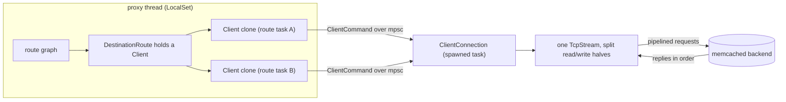
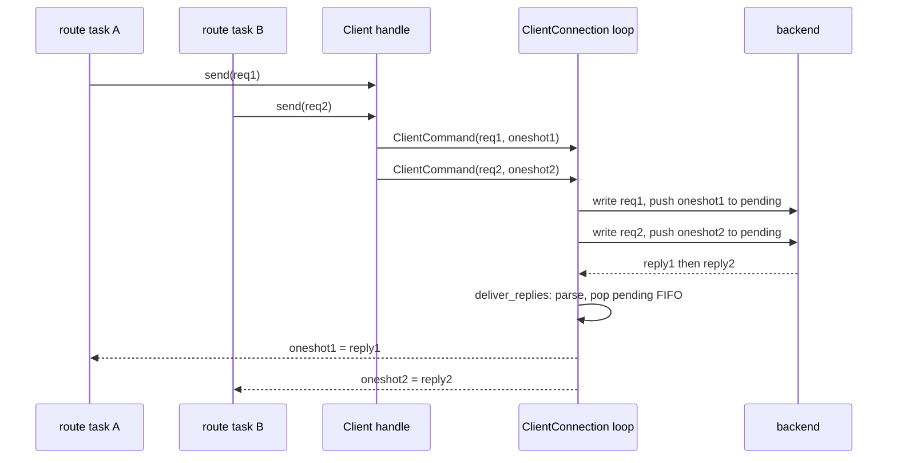

# rusty-mcrouter backend client (architecture)

how rusty-mcrouter talks to a backing memcached host today: one connection per
destination, requests pipelined over it, replies matched back FIFO. This is the
as-built description of the current tree.

> As-built — describes what the code does now, not a plan.
> Mirrors [`../mcrouter/backend-client.md`](../mcrouter/backend-client.md) (the
> model we track; the "why" and the mcrouter targets live there).
> Related: [`../design/threading-model.md`](../design/threading-model.md) — the
> proxy layer that *calls* this client.
> Citations are by file + symbol, relative to the repo root.

---

## tl;dr

- The client is split into a cheap, cloneable **`Client` handle** and a
  socket-owning **`ClientConnection` actor** — the textbook Tokio actor pattern.
- One `ClientConnection` owns **one TCP connection to one backend** and
  **pipelines**: multiple requests can be in flight before the first reply.
- `Client::send(&self, req)` is non-exclusive (`&self`), so a `DestinationRoute`
  holds a bare `Client` with **no mutex** and many route tasks can call it
  concurrently.
- Replies are matched **FIFO** via a `pending: VecDeque<oneshot::Sender<...>>`.
- On EOF / IO error / protocol error the connection **fails all pending waiters
  and exits** — no waiter hangs.
- Implemented: handle + actor, pipelining, FIFO matching, fail-all. **Not yet:**
  reconnect, timeouts, `maxInflight`, write batching (see
  [not-yet-parity](#what-we-dont-do-yet-vs-mcrouter)).

---

## the shape: `Client` handle + `ClientConnection` actor



`Client` is just a sender (`rusty-mcrouter-net/src/client/handle.rs`):

```rust
#[derive(Clone)]
pub struct Client {
    tx: mpsc::Sender<ClientCommand>,
}

impl Client {
    pub async fn connect_with_config(addr: impl ToSocketAddrs, cfg: ClientConfig) -> Result<Self> {
        let stream = TcpStream::connect(addr).await?;
        let (tx, rx) = mpsc::channel(cfg.max_pending);

        let connection = ClientConnection::new(stream, rx, &cfg);
        tokio::spawn(connection.run());           // actor owns the socket from here

        Ok(Self { tx })
    }

    pub async fn send(&self, request: Request) -> Result<Reply> {
        let (reply_tx, reply_rx) = oneshot::channel();
        self.tx
            .send(ClientCommand { request, reply_tx })
            .await
            .map_err(|_| NetError::ClientClosed)?;
        match reply_rx.await {
            Ok(result) => result,
            Err(_) => Err(NetError::ClientClosed),  // connection dropped the sender
        }
    }
}
```

The command is a request plus its reply channel
(`rusty-mcrouter-net/src/client/command.rs`):

```rust
// todo - consolidate to enum when we add shutdown or throttle commands
pub(crate) struct ClientCommand {
    pub request: Request,
    pub reply_tx: oneshot::Sender<Result<Reply>>,
}
```

This is the exact mirror of the proxy actor in
[`../design/threading-model.md`](../design/threading-model.md): `Client` is to
`ClientConnection` what `ProxyHandle` is to `Proxy`.

---

## one connection, many in flight

`ClientConnection` owns the split socket, a read buffer, a reusable write
buffer, and the FIFO of waiters (`rusty-mcrouter-net/src/client/connection.rs`):

```rust
pub(crate) struct ClientConnection {
    reader: OwnedReadHalf,
    writer: OwnedWriteHalf,
    rx: mpsc::Receiver<ClientCommand>,
    pending: VecDeque<oneshot::Sender<Result<Reply>>>,
    read_buf: BytesMut,
    write_buf: BytesMut,
}
```

The whole thing is one `select!` loop in `run(mut self)` — taken by value, so the
task owns its state for life:

```rust
pub(crate) async fn run(mut self) {
    loop {
        tokio::select! {
            maybe_cmd = self.rx.recv() => {
                match maybe_cmd {
                    Some(cmd) => {
                        if let Err(err) = self.write_one(cmd).await {
                            self.fail_all_pending(err);
                            return;
                        }
                    }
                    None => return,                 // all Client handles dropped
                }
            }
            res = self.reader.read_buf(&mut self.read_buf), if !self.pending.is_empty() => {
                let n = match res {
                    Ok(n) => n,
                    Err(e) => { self.fail_all_pending(NetError::Io(e)); return; }
                };
                if n == 0 { /* EOF */ self.fail_all_pending(/* UnexpectedEof */); return; }
                if let Err(err) = self.deliver_replies() {
                    self.fail_all_pending(err);
                    return;
                }
            }
        }
    }
}
```

Two things make it pipeline:

- The **write side just queues a waiter**, it does not wait for the reply
  (`write_one`): serialize into the reused `write_buf`, `write_all`, then
  `pending.push_back(reply_tx)`. The next command can be written immediately.
- The **read branch is guarded** `if !self.pending.is_empty()` — only poll the
  socket for replies when at least one request is outstanding.

```rust
async fn write_one(&mut self, cmd: ClientCommand) -> Result<()> {
    self.write_buf.clear();
    cmd.request.serialize_into(&mut self.write_buf);
    self.writer.write_all(&self.write_buf).await?;
    self.pending.push_back(cmd.reply_tx);   // <- enqueue waiter, don't block on reply
    Ok(())
}
```



The `pipelining_mock_backend` test helper
(`rusty-mcrouter-net/src/testing.rs`) proves this: it reads N requests *before*
writing any reply, so a non-pipelining client would deadlock against it.
`destination_route::tests::serves_concurrent_requests_without_locking` exercises
it through the route layer.

---

## reply matching: FIFO

memcached ASCII replies carry no request id and arrive in request order, so
matching is positional — pop the oldest waiter per parsed reply
(`deliver_replies`):

```rust
fn deliver_replies(&mut self) -> Result<()> {
    while let Some(reply) = parse_reply(&mut self.read_buf)? {
        match self.pending.pop_front() {
            Some(tx) => { let _ = tx.send(Ok(reply)); }
            None => {
                return Err(NetError::Protocol(ProtocolError::Malformed(
                    "unexpected reply with no pending request",
                )));
            }
        }
    }
    Ok(())
}
```

A reply with no waiting request is treated as a protocol violation and tears the
connection down. This is the ASCII/in-order analogue of mcrouter's FIFO matching
(mcrouter additionally supports out-of-order matching by `reqId` for Caret; we
do not — see the [mapping](#how-it-maps-to-mcrouter)).

---

## failure handling

Any terminal condition routes through one method, so **no `send` future ever
hangs**:

```rust
fn fail_all_pending(&mut self, err: NetError) {
    for tx in self.pending.drain(..) {
        let _ = tx.send(Err(err.clone()));
    }
}
```

| Trigger | Handling |
|---|---|
| all `Client` handles dropped (`rx.recv()` is `None`) | loop returns; nothing pending |
| write error | `fail_all_pending(Io)`, return |
| read error | `fail_all_pending(Io)`, return |
| EOF (`read` returns 0) | `fail_all_pending(UnexpectedEof)`, return |
| reply with no pending waiter / parse error | `fail_all_pending(Protocol)`, return |

`NetError` carries a hand-written `Clone` (`rusty-mcrouter-net/src/lib.rs`)
precisely so one error can be fanned out to every waiter — `std::io::Error` isn't
`Clone`, so the `Io` variant is reconstructed from kind + message.

When `run` returns, the spawned task ends and the `mpsc::Receiver` drops; any
later `Client::send` then fails fast with `ClientClosed`. **The client does not
reconnect** (see below).

---

## configuration

`ClientConfig` (`rusty-mcrouter-net/src/client/config.rs`) has two knobs today:

```rust
pub struct ClientConfig {
    pub max_pending: usize,            // bounds the command mpsc (default 1024)
    pub read_buf_initial_capacity: usize, // default 4096
}
```

`max_pending` is the channel capacity, so it doubles as backpressure: when the
queue is full, `Client::send` awaits on `tx.send` until the connection drains a
slot.

---

## how routes use it

`DestinationRoute` (`rusty-mcrouter-core/src/destination_route.rs`) holds a bare
`Client` — **no `Mutex`** — and just forwards:

```rust
pub struct DestinationRoute {
    client: Client,
}

impl Route for DestinationRoute {
    async fn route(&self, req: Request) -> Result<Reply> {
        self.client.send(req).await.map_err(RouteError::from)
    }
}
```

Because `send` takes `&self` and the synchronization lives inside the connection
actor, many route tasks can hit the same `DestinationRoute` concurrently and
their requests pipeline onto the one backend socket. (A `PoolRoute` holds several
`DestinationRoute`s and currently picks one at random per request.)

---

## how it maps to mcrouter

| mcrouter | rusty |
|---|---|
| `AsyncMcClient` (public handle) | `Client` (cloneable handle) |
| `AsyncMcClientImpl` (socket owner) | `ClientConnection` (`run(self)` actor) |
| `McClientRequestContext` + baton | `ClientCommand` + `oneshot` reply |
| pending/reply queues | single `pending: VecDeque<oneshot::Sender>` |
| ASCII FIFO matching | `pending.pop_front()` per parsed reply |
| fail sent/pending on error | `fail_all_pending` |
| `maxPending` | `ClientConfig::max_pending` (mpsc capacity) |

## what we don't do yet (vs mcrouter)

Honest gaps against [`../mcrouter/backend-client.md`](../mcrouter/backend-client.md);
all deferred on purpose for now:

- **No reconnect.** A terminal error ends the actor and the `Client` is closed
  for the process's life. mcrouter reconnects while requests remain pending.
- **No timeouts.** No connect timeout, no per-request reply timeout. A backend
  that accepts but never replies leaves `send` awaiting indefinitely (the read
  branch only fires on data, and nothing arms a deadline). mcrouter has both,
  plus tombstones to keep ASCII FIFO aligned after a timeout.
- **No `maxInflight`.** Only `max_pending` (queued, not-yet-written) is bounded;
  there is no cap on written-and-awaiting-reply. mcrouter throttles both.
- **No write batching / `writev`.** `write_one` issues one `write_all` per
  request (there's a `// todo - writev` marker). mcrouter coalesces a turn's
  worth of requests into one scatter-gather write.
- **Write-path head-of-line risk.** `write_one().await` holds the `select!`
  branch, so while a `write_all` is blocked on TCP backpressure the read branch
  can't drain replies — a possible deadlock window under large bidirectional
  load. mcrouter schedules writes on a separate loop callback.
- **`read_buf` never shrinks** after a large reply (minor; matters for
  long-lived connections).

---

## source map

| Concept | Symbol | File |
|---|---|---|
| Handle | `Client`, `Client::send` | `rusty-mcrouter-net/src/client/handle.rs` |
| Actor | `ClientConnection::run`, `write_one`, `deliver_replies`, `fail_all_pending` | `rusty-mcrouter-net/src/client/connection.rs` |
| Command | `ClientCommand` | `rusty-mcrouter-net/src/client/command.rs` |
| Config | `ClientConfig` | `rusty-mcrouter-net/src/client/config.rs` |
| Error + Clone | `NetError` | `rusty-mcrouter-net/src/lib.rs` |
| Route usage | `DestinationRoute` | `rusty-mcrouter-core/src/destination_route.rs` |
| Pipelining test | `pipelining_mock_backend` | `rusty-mcrouter-net/src/testing.rs` |
