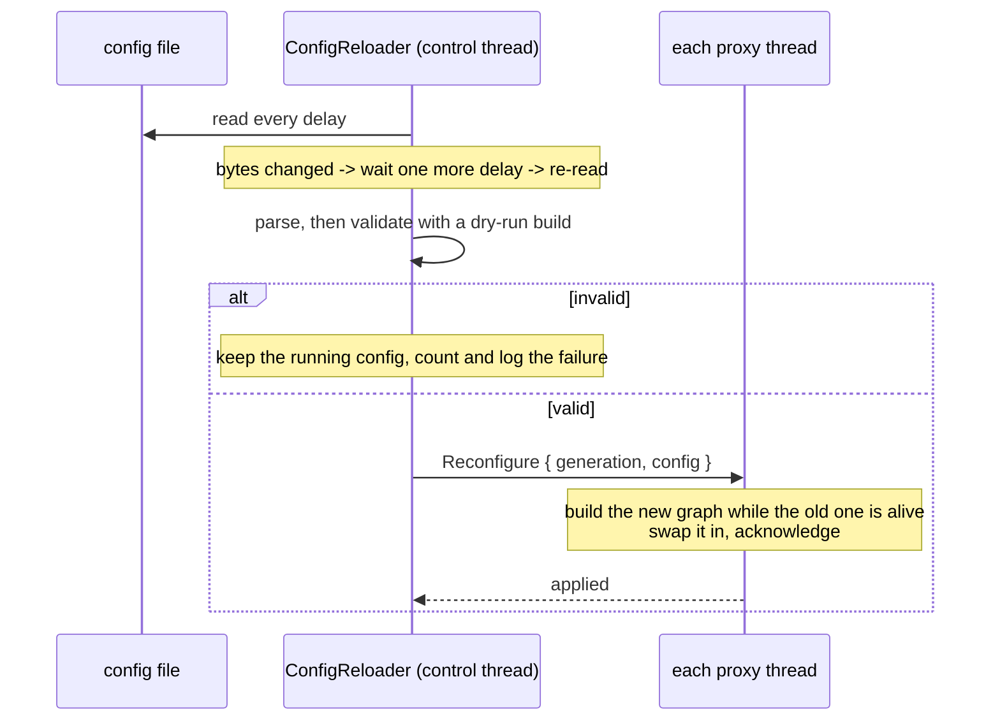

# config reload

rusty-mcrouter watches its config file and applies changes without a
restart. client connections stay open, and servers that remain in the config
keep their connections, TKO state and metrics.

## usage

```bash
rusty-mcrouter --config config.json                    # reloads on change
rusty-mcrouter --config config.json --reconfiguration-delay-ms 250
rusty-mcrouter --config config.json --disable-reload-configs
```

| flag | default | meaning |
|---|---|---|
| `--reconfiguration-delay-ms` | 1000 | how often the file is checked, and how long a change settles before it is applied |
| `--disable-reload-configs` | off | never reload; the startup config runs for the life of the process |

the reloader is constructed with the control thread, which starts before the
proxy fleet. polling begins only after every proxy is ready, keeping metrics
and event handling available throughout worker startup.

the app supplies the control inbox and proxy handles through setup values.
worker threads construct their own route graphs using a `GenerationSetup`;
each build gets a fresh backend factory over the worker's persistent destination
map. config-application timestamps are supplied to metrics by the binary.

only pools and routes reload. every CLI option, including `--route-prefix`
and the timeouts, is fixed at startup. to deploy a config, write it to a
temporary file and rename it over the watched path, so the router never reads
a half-written file.

## what happens on a change



1. **detect.** the reloader compares the file's bytes with what it last read.
   a change is applied one tick after it is first seen, so partial writes and
   editor shuffles settle first.
2. **validate.** the new config is parsed, then built with inert backends
   that open no connections and touch no shared state. a config that fails
   either step never reaches a proxy.
3. **apply.** every proxy receives the new config on its command channel,
   which is prioritized ahead of requests. each builds its own route graph,
   because graphs are thread-local, then swaps it in.
4. **finish.** a request in flight keeps the graph it started on. an open
   client connection picks up the new graph on its next request. the old
   graph is dropped when its last request finishes.

a change that leaves the parsed config identical, such as a comment or
whitespace edit, is recorded as in sync without a rebuild.

## what survives a reload

state lives outside the route graph and is keyed by identity. because the new
graph is built while the old one is alive, it picks up the live state:

| state | identity | on reload |
|---|---|---|
| destination, connections, probes | server address + reply timeout | reused |
| TKO marks | server address | preserved |
| pool fail-open gate | pool name | preserved |
| pool metric series | pool name | continuous, no counter reset |
| per-destination metrics | server address | continuous |
| failover policy counters | the route | reset |

a removed server's destination is dropped with the last graph that used it.
if it was responsible for a TKO it logs `tko'd destination removed from
config`. a removed pool's series leave `/metrics` at the same point.

## failures

| failure | effect | `stage` |
|---|---|---|
| file missing or unreadable | running config kept, reported once per state change | `read` |
| invalid JSON or schema | running config kept | `parse` |
| unbuildable, e.g. `--route-prefix` missing from `routes` | running config kept | `validate` |
| a proxy fails to build a validated config | that proxy keeps its old graph | `apply` |

a failed attempt is not sticky: the next change to the file is attempted
again. restoring the running config's content returns the router to in sync.
an invalid config at startup still exits the process.

## metrics

| metric | meaning |
|---|---|
| `rusty_mcrouter_config_generation` | 0 while starting, 1 once all proxies are ready, +1 per applied reload |
| `rusty_mcrouter_config_reload_attempts_total` | settled changes attempted |
| `rusty_mcrouter_config_reload_failures_total{stage}` | rejected attempts by stage |
| `rusty_mcrouter_config_last_reload_successful` | 1 when the file on disk is what is running |
| `rusty_mcrouter_config_last_success_timestamp_seconds` | last successful load; config age is `time() - this` |

```promql
# the file on disk is not what is running
rusty_mcrouter_config_last_reload_successful == 0
```

## limitations

- a reused destination keeps the non-key settings it was created with, such
  as `connect_timeout`. changing a pool's `server_timeout` changes the key and
  creates fresh destinations.
- a pool's `tko_tracker` thresholds apply when its gate is created, and do
  not change while the pool keeps its name.
- a server that is TKO'd while it moves to a different gated pool is unmarked
  against the wrong gate. upstream mcrouter behaves the same.
- proxies switch one after another, so for a moment they can run different
  generations.

design and upstream comparison:
[design 0002](../design/0002-config-reload.md),
[mcrouter reference](../reference/config-reload.md).
