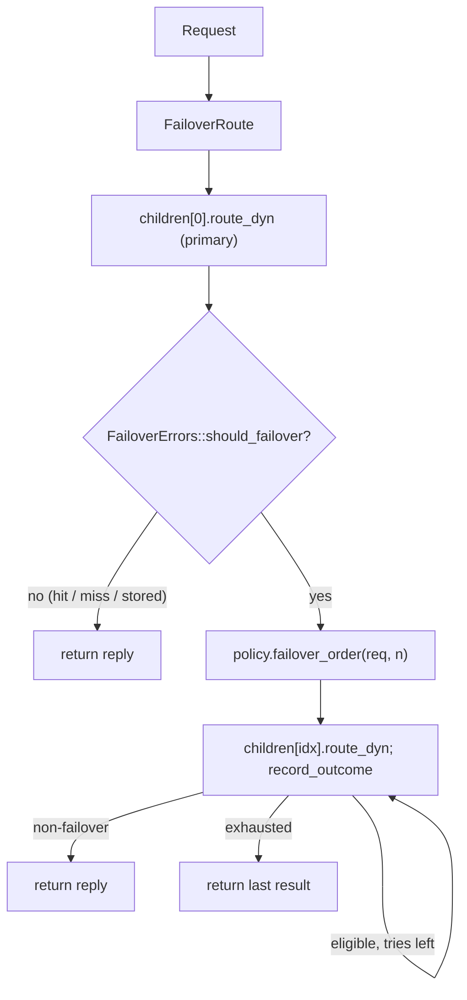

# rusty-mcrouter failover routes (architecture)

how failover works today: a `FailoverRoute` composes an ordered list of children, a
per-operation `FailoverErrors` classifier, and a pluggable `Box<dyn FailoverPolicy>`
(in-order or least-failures). It routes the primary child, and on a failover-eligible
result retries the backups in the policy's order until one answers. This is the
as-built description of the current tree.

> As-built — describes what the code does now, not a plan.
> Mirrors: [`../mcrouter/failover.md`](../mcrouter/failover.md) — the model we track (`FailoverRoute` + `FailoverErrorsSettings` + `FailoverPolicy`).
> Designed in: [`../design/failover.md`](../design/failover.md) — the plan; this records what shipped and where it diverged.
> Related: [`./timeouts.md`](./timeouts.md) — produces the `NetError::Timeout` failover consumes; [`./hash-routing.md`](./hash-routing.md) — the `PoolRoute` children a failover usually holds and the `Selector`/`build_selector` framework this mirrors; [`./testing.md`](./testing.md) — the `MockBackend` + mock-memcached harness these tests use.
> Citations are by file + symbol, relative to the repo root.

---

## tl;dr

- **`FailoverRoute` = `children` + `FailoverErrors` + `Box<dyn FailoverPolicy>`**
  (`rusty-mcrouter-core/src/routes/failover_route.rs`). It routes `children[0]` (the
  primary), and while `FailoverErrors::should_failover` says the result is
  failover-eligible it retries the backups in `policy.failover_order(..)`, returning
  the first non-failover result or the last one. One child is legal; zero is
  `BuildError::EmptyFailover`.
- **The classifier spans both failure surfaces** (`failover/errors.rs`):
  `classify(&Result<Reply>) -> Option<FailoverErrorKind>` maps a transport `Err`
  (`Timeout`/`Io`/`Protocol`/`ClientClosed`) **and** the backend-reported
  `Ok(Reply::ServerError)`; a miss, a `Reply::Error`/`ClientError`, and an internal
  `SelectorOutOfRange` are not eligible. `is_failover_error(r) == classify(r).is_some()`.
- **Two policies ship, behind one trait** (`failover/policy.rs`): `InOrderPolicy`
  (stateless) and `LeastFailuresPolicy` (`RefCell<Vec<u32>>` counters + `max_tries`,
  stable-sorted ascending, reset on success). New policies are additive — a trait impl
  + one `build_failover_policy` arm.
- **Per-op customization ships** (`FailoverErrors { gets, updates, deletes }`): each op
  class carries an optional list; `None` uses the default classifier, `Some([])` never
  fails over (the idempotency lever for writes).
- **Config is object-form only**, parsed into `RouteHandleConfig::FailoverRoute`
  (`rusty-mcrouter-config/src/route.rs`); the builder recurses to build children
  (`Box::pin(self.build_handle(child))`) and dispatches `FailoverErrorsConfig` /
  `FailoverPolicyConfig` via `build_failover_errors` / `build_failover_policy`.
- **Nine commits**, and ~40 new failover tests (config 13, core errors 6, core policy
  8, core route 8, core builder 4, e2e 1), all default-running. Workspace warnings are
  unchanged from baseline (the 4 pre-existing bin warnings).

---

## the layers (as-built)

- **`failover/errors.rs`** — `classify` (private, the single source of truth over both
  surfaces), `is_failover_error` (private, `classify(..).is_some()`), and
  `pub struct FailoverErrors` with `pub(crate)` `new`/`should_failover`. `should_failover`
  inlines the op-class dispatch (Get→`gets`, Set/Add/Replace/Append/Prepend→`updates`,
  Delete→`deletes`, Incr/Decr/Touch→default). `FailoverErrorKind` is imported from the
  config crate (see [divergences](#divergences-from-the-design)).
- **`failover/policy.rs`** — `pub trait FailoverPolicy: 'static`
  (`failover_order(&Request, n) -> Vec<usize>` + a default-no-op `record_outcome`),
  `InOrderPolicy` (`(1..n).collect()`), `LeastFailuresPolicy` (interior-mutable
  counters; sound because the route graph is single-threaded `Rc`-on-`LocalSet`).
- **`routes/failover_route.rs`** — `FailoverRoute` (re-exported from `lib.rs` like the
  other route types). The loop tries the primary, records the outcome, and iterates
  `policy.failover_order`, using a defensive `self.children.get(idx)` (a policy that
  yields an out-of-range index is skipped, not a panic — mirroring `SelectionRoute`).
- **`rusty-mcrouter-config/src/route.rs`** — `RouteHandleConfig::FailoverRoute
  { children, failover_errors, failover_policy }`, `FailoverErrorsConfig`
  (`Default`/`All`/`PerOp`), `FailoverPolicyConfig` (`InOrder`/`LeastFailures`), and the
  `parse_object_form` arm + helpers. `failover_errors` names parse via
  `FailoverErrorKind: FromStr` (alias-aware; unknowns rejected at parse time).
- **`route_builder.rs`** — the `RouteHandleConfig::FailoverRoute` arm recurses per child
  (boxed async), then `build_failover_errors` / `build_failover_policy` translate the
  config; `FailoverRoute::new(..).ok_or(BuildError::EmptyFailover)`. Children that name
  the same pool still share destinations through the existing `pool_cache`.

---

## how it maps to mcrouter (as-built)

| mcrouter | rusty (as-built) |
|---|---|
| `FailoverRoute::doRoute` | `FailoverRoute::route` (primary `children[0]`, then `policy.failover_order`) |
| `FailoverErrorsSettings` (per op) | `FailoverErrors { gets, updates, deletes }` + inlined op dispatch |
| `isFailoverErrorResult` | `classify` over `Err(Backend(..))` + `Ok(Reply::ServerError)` |
| `REMOTE_ERROR` | `Ok(Reply::ServerError)` (the Ok-surface case) |
| `NOTFOUND` (valid) | `Ok(Reply::NotFound)` / empty `Get` → not eligible |
| `FailoverInOrderPolicy` | `InOrderPolicy` |
| `FailoverLeastFailuresPolicy` (+ `max_tries`) | `LeastFailuresPolicy` (`RefCell<Vec<u32>>` + `max_tries`) |
| `failover_errors` array / object | `FailoverErrorsConfig::{All, PerOp}` (`Default` per missing key) |
| `"updates": []` (idempotency) | `updates: Some(vec![])` |
| children are arbitrary route handles | `Vec<Rc<dyn DynRoute>>`, recursive `build_handle` |
| unrecovered → `SERVER_ERROR` | last `Err` → `Reply::ServerError` at the proxy boundary |

---

## divergences from the design

The [design](../design/failover.md) is faithful overall; the deliberate or forced
differences:

1. **`FailoverErrorKind` lives in the config crate, not `core`.** The design placed it
   in `core/src/failover/errors.rs`, but it must double as the `failover_errors` config
   vocabulary, and `core → config` means the shared enum has to live in `config` (the
   same way `HashFunc` does). `core`'s `classify` returns
   `rusty_mcrouter_config::FailoverErrorKind`. This keeps the "one enum" decision and
   gives parse-time validation of error names.
2. **Config parsing and the builder arm landed in one commit** (`[7]`), not the design's
   separate config/builder steps. Adding the `RouteHandleConfig::FailoverRoute` variant
   makes `build_handle`'s exhaustive match non-exhaustive, so the variant and its
   builder arm must land together to keep the workspace compiling.
3. **The e2e proves failover *succeeds*, via a failing-mock mode, not `__rusty__.want_server_error`.**
   The design sketched a fault-key e2e, but fault keys are global-by-key (both pools
   would fault on the same key) and eager-connect rules out a dead primary — neither
   shows a healthy secondary serving. As-built adds
   `spawn_failing_mock_memcached` (a per-instance "always `SERVER_ERROR`" mock) so
   `failover_from_failing_primary_serves_from_secondary` proves the backup serves the
   value through the real binary.
4. **`is_failover_error` is defined as `classify(..).is_some()`** (one match, not the
   two the design showed simple-first) — the invariant the design stated, realized DRY.
5. **`FailoverErrors` is `pub` with `pub(crate)` methods**, so it can appear in
   `FailoverRoute::new`'s signature while staying crate-constructed — the same
   visibility shape as `Selector` in `PoolRoute::new`.

Deferred exactly as designed (each an additive seam, none touching the loop):
`FailoverWithExptimeRoute`, `FailoverRateLimiter`, the key-derived policies
(`DeterministicOrder`/`Rendezvous`), TKO, and lease pairing.

---

## testing

All default-running, socket-free except the e2e:

- **config** (`route.rs::tests`) — `FailoverErrorKind` name parsing (canonical, aliases,
  unknown rejected); `FailoverRoute` parse (children required/array/nested;
  `failover_errors` array/object/per-op-default/unknown-name; `failover_policy`
  in-order/least-failures/missing-`max_tries`/unknown-type).
- **config fixtures** (`rusty-mcrouter-config/tests/fixtures/`) — whole-document configs
  mirrored from real mcrouter (`// source:` headers): `failover_least_failures`
  (`FailoverRoute` + `LeastFailuresPolicy`), `failover_custom_errors` (per-op
  `failover_errors` with the `remote_error` alias), `failover_limit` (a nested inline
  `ErrorRoute` child + a tolerated/ignored `failover_limit`), and `failover_with_exptime`
  (`FailoverWithExptimeRoute` parsing as `Unknown`, the deferred boundary — same shape
  as `dev_null.json`'s `PrefixSelectorRoute`).
- **core errors** (`failover/errors.rs::tests`) — both surfaces fail over; miss /
  `Error` / `ClientError` / `SelectorOutOfRange` / `NoAddresses` / `WorkerClosed` do not;
  `classify` mapping; default and per-op (`updates: []`) behavior.
- **core policy** (`failover/policy.rs::tests`) — in-order order; least-failures starts
  in config order, prefers healthier backups after recorded failures, caps at
  `max_tries`, resets on success, never includes the primary.
- **core route** (`routes/failover_route.rs::tests`) — transport + `ServerError` fail
  over to a healthy backup; a miss does not; first success wins (later children
  untouched); all-fail returns the last result; one child has no backup; zero →
  `None`; per-op `updates: []` blocks a write failover through the route.
- **core builder** (`route_builder.rs::tests`) — builds a failover over pool children;
  nested failover builds; empty children → `EmptyFailover`; all-children-fail surfaces
  the last error; the `RouteTypeNotImplemented` regressions were repointed to a
  still-unknown type (`AllSyncRoute`).
- **e2e** (`rusty-mcrouter/tests/mock_e2e.rs`) —
  `failover_from_failing_primary_serves_from_secondary`: a failing primary mock + a
  healthy secondary mock behind a real router binary; `get` returns the secondary's
  value.

---

## source map

| concept | symbol / file |
|---|---|
| classifier (both surfaces) | `classify`, `is_failover_error` — `rusty-mcrouter-core/src/failover/errors.rs` |
| per-op eligibility | `FailoverErrors`, `should_failover` — `rusty-mcrouter-core/src/failover/errors.rs` |
| config vocabulary | `FailoverErrorKind` (`FromStr`) — `rusty-mcrouter-config/src/route.rs` |
| policy trait + impls | `FailoverPolicy`, `InOrderPolicy`, `LeastFailuresPolicy` — `rusty-mcrouter-core/src/failover/policy.rs` |
| route handle | `FailoverRoute` — `rusty-mcrouter-core/src/routes/failover_route.rs` |
| config types | `RouteHandleConfig::FailoverRoute`, `FailoverErrorsConfig`, `FailoverPolicyConfig` — `rusty-mcrouter-config/src/route.rs` |
| builder | `build_handle` (FailoverRoute arm), `build_failover_errors`, `build_failover_policy`, `BuildError::EmptyFailover` — `rusty-mcrouter-core/src/route_builder.rs` |
| e2e + failing mock | `failover_from_failing_primary_serves_from_secondary`, `spawn_failing_mock_memcached` — `rusty-mcrouter/tests/mock_e2e.rs`, `rusty-mcrouter-net/src/mock_memcached.rs` |
