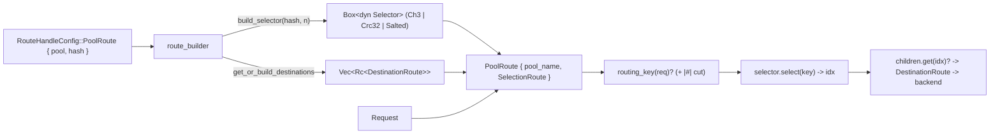

# rusty-mcrouter selection routing (architecture)

> As-built — describes what the code does now.
> Mirrors: [`../mcrouter/hash-routing.md`](../mcrouter/hash-routing.md) — the model we track
> Designed in: [`../design/hash-routing.md`](../design/hash-routing.md) — the plan; this records what we actually built and where it diverged.
> Related: [`./threading-model.md`](./threading-model.md) — the route graph is a per-thread `Rc<dyn DynRoute>`; and [`./backend-client.md`](./backend-client.md) — `DestinationRoute` wraps the pipelining `Client`.
> Citations are by file + symbol, relative to the repo root.

---

## tl;dr

- A key deterministically selects one backend in a pool. `PoolRoute` no longer
  picks at random — it wraps a `SelectionRoute` that asks a `Box<dyn Selector>`
  for a child index and forwards to `children[idx]`. `rand` is gone.
- **Two ship today:** `Ch3` (the default — a safe-Rust port of mcrouter's
  `furc_hash`, verified **byte-for-byte** against the C source by golden vectors)
  and `Crc32` (fast, non-consistent). `salt` is a `Salted` decorator over either.
- The selection framework is split into **two crate-internal layers plus a wiring
  layer** (this is the main shape difference from the design):
  - `selectors/` — the *policy*: the `Selector` trait, `Ch3`/`furc`, `Crc32`,
    `Salted`, `SelectorBuildError`. Config-agnostic, route-agnostic, pure.
  - `routes/` — the *handles*: the `Route`/`DynRoute`/`RouteError` trait family
    plus `SelectionRoute`, `PoolRoute`, `DestinationRoute`, `NullRoute`,
    `ErrorRoute`.
  - `route_builder.rs` — the *composition root*: turns config into a route graph,
    the only layer that knows about `rusty-mcrouter-config`.
- **Config-driven** via a `hash` field on `PoolRoute`
  (`{"type":"PoolRoute","pool":"A","hash":"Ch3"}` or
  `{"hash":{"hash_func":"Ch3","salt":"…"}}`), defaulting to `Ch3` — matching
  mcrouter. The pool cache stores **destinations** (shared connections), so two
  routes can reference one pool with different `hash`.
- Errors are typed (`thiserror`, no `anyhow` in the library): `SelectorBuildError`
  (build, selectors), `RouteError` (runtime), `BuildError` (build, route graph).



---

## module layout

The crate is organized into a clean dependency DAG: `route_builder → { routes,
selectors, config }`, `routes → selectors`, `selectors → (pure)`.

```
rusty-mcrouter-core/src/
  lib.rs              # re-export surface
  route_builder.rs    # composition root — the only config-aware layer
  selectors/
    mod.rs            # Selector trait, SelectorBuildError, pub(crate) Result alias
    furc.rs           # furc_hash + MurmurHash64A (byte-exact port) + golden vectors
    ch3.rs  crc32.rs  salted.rs
  routes/
    mod.rs            # Route, DynRoute, RouteError, RouteFuture, Result + handle re-exports
    selection_route.rs   pool_route.rs
    destination_route.rs  null_route.rs  error_route.rs
```

The load-bearing property: `selectors/` knows nothing about `Request`, `Route`,
or config — it maps `&[u8] -> usize`. `routes/` depends on `selectors/` (a
`SelectionRoute` holds a `Box<dyn Selector>`) but not on config. Only
`route_builder.rs` touches `rusty-mcrouter-config`, translating `HashConfig` into
domain objects. (The design proposed a single `select/` submodule; we split it
into `selectors/` + `routes/` instead — see *Divergences from the design*.)

---

## the selector layer (`selectors/`)

### `Selector` (`selectors/mod.rs`)

```rust
pub trait Selector: 'static {
    fn select(&self, routing_key: &[u8]) -> usize;
}
```

A pure, total function of the routing key: same key → same index, no interior
mutability, no awareness of backend health. Parameters (size, salt) are bound at
construction. `select` is infallible — a buggy implementation returning an
out-of-range index is caught defensively at the route layer, not here.

### `Ch3` + `furc_hash` (`selectors/ch3.rs`, `selectors/furc.rs`) — the default

`furc.rs` is a faithful port of mcrouter's `furc_hash` (`mcrouter/lib/fbi/hash.c`
@ `42aa391189c7`), **verified byte-for-byte** by `matches_mcrouter_golden_vectors`
(committed `(key, m) → furc_hash` vectors generated from the C source, covering
every `len & 7` tail case and `m ∈ {1,2,3,5,8,100,1024,2^23}`). The constants all
match the C source exactly:

| constant | value |
|---|---|
| `M` (Murmur multiplier) | `0xc6a4_a793_5bd1_e995` |
| `R` | `47` |
| `SEED` | `4_193_360_111` |
| `FURC_SHIFT` | `23` (max pool `1 << 23 = 8_388_608`) |
| `MAX_TRIES` | `32` |
| `FURC_CACHE_SIZE` | `1024` |

The bitstream cache `Bits` uses a fixed `[u64; FURC_CACHE_SIZE]` (mcrouter's
`uint64_t hash[FURC_CACHE_SIZE]`), filled lazily — word 0 is
`murmur_hash_64a(key, SEED)`, each later word `murmur_rehash_64a(prev)`.

```rust
pub struct Ch3 { n: u32 }
impl Ch3 {
    pub fn new(n: usize) -> Result<Self> {            // selectors::Result = SelectorBuildError
        if !(1..=FURC_MAX_POOL_SIZE).contains(&n) {   // 1..=2^23, mcrouter's constructor bound
            return Err(SelectorBuildError::Ch3PoolSizeOutOfRange { n });
        }
        Ok(Self { n: n as u32 })
    }
}
impl Selector for Ch3 {
    fn select(&self, key: &[u8]) -> usize { furc_hash(key, self.n) as usize }
}
```

`Ch3` is consistent: growing a pool from `N` to `N+1` re-homes only ~`1/(N+1)` of
keys (asserted by `consistency_grow_by_one_rehomes_few`), and it is
wire-compatible with a real-mcrouter pool over the same server list.

### `Crc32` (`selectors/crc32.rs`)

Inline table-driven CRC-32/ISO-HDLC (poly `0xEDB88320`, init `!0`, final XOR
`!0`), then `(crc32(key) & 0x7fffffff) % n`. This is **byte-identical to
mcrouter's `Crc32HashFunc`** — confirmed by reading `Crc32HashFunc.h` +
`crc32_hash` in the source (the `& 0x7fffffff` mask and the exact `crc32_hash`
match). It is **not consistent** — any change to `n` reshuffles essentially every
key — so `Ch3` stays the default. `Crc32::new(n)` is infallible (mcrouter's
constructor doesn't validate either; the `n == 0` case is rejected upstream by
the `EmptyPool` guard).

### `Salted` (`selectors/salted.rs`)

```rust
pub struct Salted { inner: Box<dyn Selector>, salt: Vec<u8> }
impl Selector for Salted {
    fn select(&self, key: &[u8]) -> usize {
        // hashes key ++ salt — matches mcrouter's hashWithSalt (memcpy key, then salt)
        let mut buf = Vec::with_capacity(key.len() + self.salt.len());
        buf.extend_from_slice(key);
        buf.extend_from_slice(&self.salt);
        self.inner.select(&buf)
    }
}
```

A decorator over any byte-hashing selector, so salt works for `Ch3` and `Crc32`
with zero per-selector code. The `key ++ salt` order was verified against
mcrouter's `hashWithSalt` source. Allocates a temporary key per request; only
salted pools pay this (a no-alloc incremental variant is a later option).

### `SelectorBuildError` (`selectors/mod.rs`)

```rust
#[derive(Debug, Error)]
pub enum SelectorBuildError {
    #[error("Ch3 pool size {n} is out of range (must be 1..=2^23)")]
    Ch3PoolSizeOutOfRange { n: usize },
}
pub(crate) type Result<T> = std::result::Result<T, SelectorBuildError>;
```

The selector layer's own build-error vocabulary, so it never depends on the
builder's `BuildError`. It's `pub` (re-exported at the crate root) because it's
`#[from]`-nested into the public `BuildError` — a nested public error exactly like
`NetError`.

---

## the route layer (`routes/`)

### `Route` / `DynRoute` / `RouteError` (`routes/mod.rs`)

`Route::route(&self, …)` takes `&self` (shared, single-threaded), so any future
stateful handle uses interior mutability. `DynRoute` is the object-safe form
(`route_dyn -> Pin<Box<dyn Future>>`), since `async fn` isn't dyn-safe.

```rust
#[derive(Debug, Error)]
pub enum RouteError {
    #[error("backend error: {0}")]                                   Backend(#[from] NetError),
    #[error("selector returned index {idx} but pool has {len} children")]
                                                                     SelectorOutOfRange { idx: usize, len: usize },
    #[error("cannot route an empty get (no keys)")]                  EmptyGet,
}
```

### `SelectionRoute` (`routes/selection_route.rs`) — the mechanism

```rust
pub struct SelectionRoute {
    children: Vec<Rc<dyn DynRoute>>,   // generic children, not just pool destinations
    selector: Box<dyn Selector>,
}
impl Route for SelectionRoute {
    async fn route(&self, req: Request) -> Result<Reply> {
        let idx = self.selector.select(routing_key(&req)?);
        // defensive bounds check — a buggy selector surfaces a route error, not a panic
        let child = self.children.get(idx).ok_or(RouteError::SelectorOutOfRange {
            idx, len: self.children.len(),
        })?;
        child.route_dyn(req).await
    }
}
```

`children` is `Vec<Rc<dyn DynRoute>>` (not `Rc<DestinationRoute>`) so a future
`HashRoute` (explicit sub-route children) reuses the same handle.

### `routing_key` + `hash_stop` (`routes/selection_route.rs`)

```rust
fn routing_key(req: &Request) -> Result<&[u8]> {
    let key = match req {
        Request::Set { key, .. } | Request::Delete { key } | … | Request::Touch { key, .. } => &key[..],
        // multiget is split upstream; until then hash the first key (interim).
        // an empty get has no routing key -> error, never a panic.
        Request::Get { keys } => keys.first().map(|k| &k[..]).ok_or(RouteError::EmptyGet)?,
    };
    Ok(hash_stop(key))   // exclude everything from `|#|` onward (matches mcrouter)
}
```

`hash_stop` cuts the key at the first `|#|` marker, so `user:1` and
`user:1|#|debuginfo` route to the same backend (the mcrouter "hash stop"). The
function is fallible: an empty `Get` yields `RouteError::EmptyGet` rather than
panicking; a multi-key `Get` arriving before the upstream split hashes its first
key. Routing-prefix (`/region/cluster/`) stripping is deferred until prefix
routing exists.

### `PoolRoute` (`routes/pool_route.rs`) — the named pool case

```rust
pub struct PoolRoute { pool_name: String, inner: SelectionRoute }
impl PoolRoute {
    pub fn new(pool_name: impl Into<String>,
               destinations: Vec<Rc<DestinationRoute>>,
               selector: Box<dyn Selector>) -> Self {
        let children = destinations.into_iter().map(|d| d as Rc<dyn DynRoute>).collect();
        Self { pool_name: pool_name.into(), inner: SelectionRoute::new(children, selector) }
    }
}
impl Route for PoolRoute {
    async fn route(&self, req: Request) -> Result<Reply> { self.inner.route(req).await }
}
```

A thin named wrapper that coerces a pool's shared destinations into generic
children and carries the pool name (`pool_name()`) for future diagnostics.
`SelectionRoute` stays the single place selection happens — no duplication.

---

## config (`rusty-mcrouter-config/src/route.rs`)

```rust
pub enum RouteHandleConfig { …, PoolRoute { pool: String, hash: HashConfig }, … }

#[derive(Default)] pub struct HashConfig { pub func: HashFunc, pub salt: Option<String> }
#[derive(Default)] pub enum HashFunc { #[default] Ch3, Crc32 }
```

A hand-rolled `Deserialize` dispatches a JSON string to `Reference`/`Shorthand`
and an object to `parse_object_form`. The parse rules (each test-covered):

| input | result |
|---|---|
| `"hash"` absent | `HashConfig { Ch3, salt: None }` |
| `"hash": "Ch3"` | that func, no salt |
| `"hash": { "hash_func": "Crc32", "salt": "x" }` | func + salt |
| `"hash": { "salt": "x" }` (func omitted) | `Ch3` + salt |
| unknown `hash_func` / non-string `hash`/`hash_func`/`salt` | config error |
| `"PoolRoute|P"` shorthand | pool `P`, default `Ch3` |

`HashFunc` is an enum so future variants (`WeightedCh3`, `Rendezvous`, the
strategy funcs `Latest`/`LoadBalancer`) coexist in one slot and the builder routes
each. The object-form parser keeps the `hash` sibling (it used to drop everything
but `pool`).

---

## wiring (`route_builder.rs`)

`build_route` walks the config; for a pool route it builds (or reuses) the pool's
destinations and constructs a fresh `PoolRoute`:

```rust
struct RouteBuilder<'a> {
    config: &'a ConfigDocument,
    pool_cache: BTreeMap<String, Vec<Rc<DestinationRoute>>>,   // destinations, not the handle
}
```

- **`get_or_build_destinations`** caches `Vec<Rc<DestinationRoute>>` by pool name
  and returns a clone (cheap `Rc` clones; the underlying `Client` connections stay
  shared). It rejects zero-server pools fail-fast:
  ```rust
  if pool_config.servers.is_empty() {
      return Err(BuildError::EmptyPool { name: pool_name.to_string() });
  }
  ```
  Caching destinations (not the handle) is what lets two routes reference one pool
  with **different** `hash` while sharing connections.
- **`build_pool_handle` → `build_selector`** turns the `HashConfig` into a
  `Box<dyn Selector>` and wraps the shared destinations in a `PoolRoute`:
  ```rust
  fn build_selector(hash: &HashConfig, n: usize) -> Result<Box<dyn Selector>> {
      let base: Box<dyn Selector> = match hash.func {
          HashFunc::Ch3   => Box::new(Ch3::new(n)?),     // validates 1..=2^23
          HashFunc::Crc32 => Box::new(Crc32::new(n)),
      };
      Ok(match &hash.salt {
          Some(salt) => Box::new(Salted::new(base, salt.clone().into_bytes())),
          None => base,
      })
  }
  ```

### error types (the whole library)

| error | layer | when | notable |
|---|---|---|---|
| `SelectorBuildError` | `selectors/` | building a selector | `Ch3PoolSizeOutOfRange`; `pub`, nested into `BuildError` |
| `RouteError` | `routes/` | per request | `Backend`, `SelectorOutOfRange`, `EmptyGet`; matchable + `→ Reply`-mappable |
| `BuildError` | `route_builder` | building the graph | `PoolNotFound`, `EmptyPool`, `ConnectFailed`, …, `Selector(#[from] SelectorBuildError)` |

All `thiserror`; no `anyhow` in the library (the binary wraps these at its
boundary). `Ch3::new(n)?` lifts `SelectorBuildError` into `BuildError` via the
`#[from]`.

---

## how this maps to mcrouter (as-built)

| mcrouter | rusty |
|---|---|
| `SelectionRoute<…, HashSelector<Func>>` | `routes::SelectionRoute` holding `Box<dyn Selector>` |
| `HashSelector::select → routingKey()` | `routing_key(&Request)` (+ `|#|` cut), owned by the route layer |
| `Ch3HashFunc(n)` / `furc_hash` | `selectors::Ch3 { n }` / `furc_hash` (byte-exact port) |
| `Crc32HashFunc` | `selectors::Crc32 { n }` ((res & 0x7fffffff) % n, wire-compatible) |
| `hashWithSalt(key, salt)` | `selectors::Salted` decorator (`key ++ salt`) |
| `createHashRoute` dispatch on `hash_func` | `build_pool_handle` + `build_selector` |
| `PoolRoute` ≡ `HashRoute` (config sugar) | `routes::PoolRoute` = thin named wrapper over `SelectionRoute`; `HashRoute` deferred |
| `furc_maximum_pool_size()` = `2^23` | `Ch3::new` size bound |
| default `Ch3` | `HashFunc::default() == Ch3` |
| multiget split (ASCII parser) | request-layer split — see [`../design/multiget.md`](../design/multiget.md), **not** any route handle |

---

## divergences from the design

The design ([`../design/hash-routing.md`](../design/hash-routing.md)) is faithful
overall; these are the deliberate (or forced) differences:

1. **Module layout.** Design proposed one `select/` submodule. As-built splits
   into `selectors/` (policy) + `routes/` (handles) + top-level `route_builder.rs`
   — a cleaner layering where selectors are config- and route-agnostic.
2. **`new() -> Self`, not `Option`.** `SelectionRoute::new`/`PoolRoute::new` don't
   return `Option`; the empty-pool check moved **up** to the builder
   (`get_or_build_destinations` → `BuildError::EmptyPool`), which is fail-fast
   (before connecting) and uniform across hash funcs.
3. **`build_selector` takes `n: usize`, not `servers: &[String]`.** The
   identity-selector seam (Rendezvous hashing server names) is therefore narrower
   than designed — adding `Rendezvous` will require threading `servers` through
   `build_pool_handle`/`build_selector` (a localized change, not pre-wired).
4. **The two-tier dispatch is conceptual, not stubbed.** `build_pool_handle`
   always builds a `PoolRoute`; there is no explicit `match`-fork for a stateful
   strategy tier yet, and no `NotASelector` guard (`build_selector`'s match over
   `HashFunc` is exhaustive). The type-level split (selectors vs route handles)
   is real and §11 of the design still describes how `Latest`/`LoadBalancer` slot
   in; the builder fork lands with the first such strategy.
5. **`Crc32` is wire-compatible** (verified against `Crc32HashFunc` source), where
   the design conservatively marked it non-compatible — but there are still no
   committed mcrouter `Crc32` golden vectors (only canonical CRC-32 check values).
6. **Salt order is `key ++ salt`**, verified against `hashWithSalt`; the design
   guessed `salt ++ key`.
7. **`SelectorBuildError` is `pub`** (forced by the `private_interfaces` lint,
   since it's nested into the public `BuildError`).

---

## testing

**Selector level** (`furc.rs`, `ch3.rs`, `crc32.rs`, `salted.rs`):
golden vectors (`matches_mcrouter_golden_vectors`), in-range, determinism,
distribution, `Ch3` consistency (~`1/N` re-homing), `Ch3::new` rejects `0` /
`> 2^23` (`rejects_pool_size_out_of_range`), CRC-32 canonical values + the
`0x7fffffff` mask, salt distribution.

**Route level** (`selection_route.rs`): `routing_key` extraction, the multi-get
first-key interim, `EmptyGet`, the `|#|` cut and its suffix-irrelevant invariant,
`hash_stop` marker edges.

**Builder level** (`route_builder.rs`): build + route to a mock backend for
shorthand/object forms, `PoolNotFound`, `EmptyPool`, connect failure, shorthand
arity, and `pool_referenced_twice_shares_destinations` (shared connections).

Whole suite: 57 tests, `cargo clippy` clean.

### gaps (known, not yet closed)

- **No end-to-end "key lands on the selector-predicted backend" test.** A prior
  `hash_routing_e2e.rs` covering this was removed and not reimplemented; selectors
  and `routing_key` are unit-tested, but the full selector→`children[idx]`→backend
  wiring is only exercised incidentally.
- **No "different `hash` → distinct handles over shared destinations" test** — the
  shared-destinations half is covered; the distinct-handle half is not.
- **No committed `Crc32` or `Salted` mcrouter golden vectors** — both are
  verified-correct by source inspection but not regression-pinned like `furc`.
- No `Crc32` consistency-contrast test (asserting it *does* reshuffle).

---

## source map

| concept | symbol | file |
|---|---|---|
| selection policy | `Selector` | `selectors/mod.rs` |
| consistent hash | `furc_hash`, `murmur_hash_64a`, `murmur_rehash_64a`, `Bits` | `selectors/furc.rs` |
| default selector | `Ch3` | `selectors/ch3.rs` |
| non-consistent selector | `Crc32` | `selectors/crc32.rs` |
| salt decorator | `Salted` | `selectors/salted.rs` |
| selector build error | `SelectorBuildError` | `selectors/mod.rs` |
| route trait family | `Route`, `DynRoute`, `RouteError`, `RouteFuture` | `routes/mod.rs` |
| selection mechanism | `SelectionRoute` | `routes/selection_route.rs` |
| routing key + hash-stop | `routing_key`, `hash_stop` | `routes/selection_route.rs` |
| named pool handle | `PoolRoute` | `routes/pool_route.rs` |
| backend leaf | `DestinationRoute` | `routes/destination_route.rs` |
| config types | `RouteHandleConfig`, `HashConfig`, `HashFunc` | `rusty-mcrouter-config/src/route.rs` |
| graph construction | `build_route`, `RouteBuilder`, `build_pool_handle`, `build_selector` | `route_builder.rs` |
| build error | `BuildError` | `route_builder.rs` |

---

## extending it

- **A new stateless selector** (`Rendezvous`, `WeightedCh3`, `ConstShard`): add a
  `HashFunc` variant, `impl Selector`, and one arm in `build_selector`. Identity-
  and weight-based selectors additionally need `servers`/`weights` threaded into
  `build_selector` (not pre-wired today — see divergence 3).
- **A stateful strategy** (`Latest`, `LoadBalancer`): a new `Route` handle in
  `routes/` holding state behind `RefCell`/atomics (since `route` is `&self`),
  plus the explicit strategy fork in `build_pool_handle` (divergence 4). It does
  not touch `Selector` or `SelectionRoute`.
- **Ranked failover** ([`FailoverRoute`](../design/failover.md)): a separate `RankedSelector` trait
  (`rank(&self, key) -> impl Iterator<Item = usize>`), not a widening of
  `Selector`.
