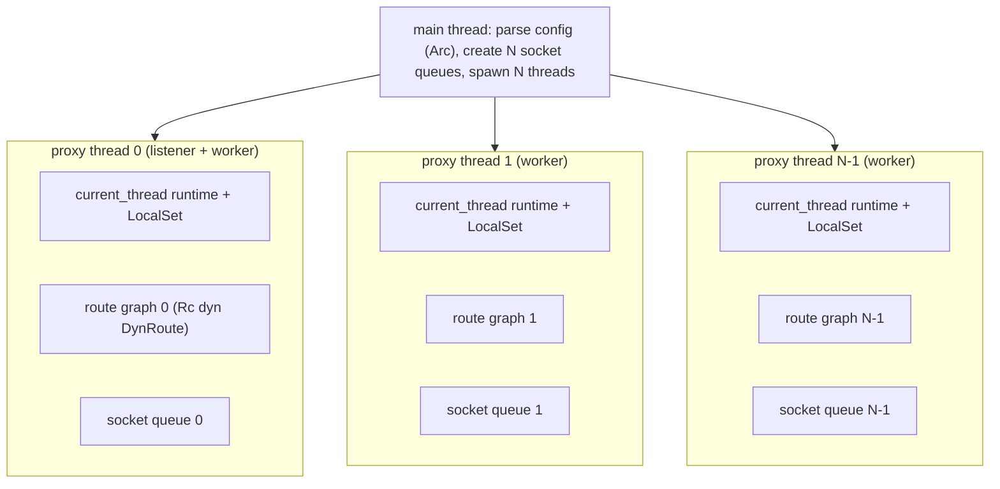
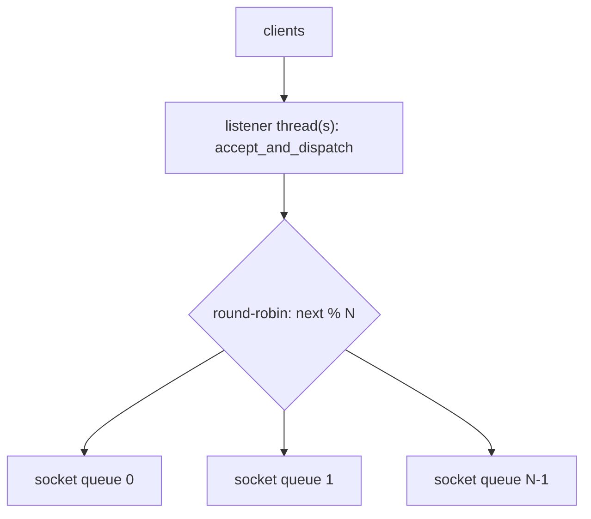
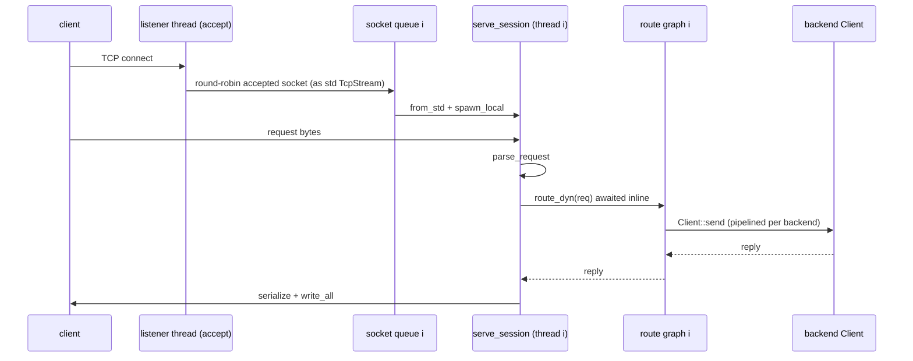

# rusty-mcrouter threading model (architecture)

how threading works in the current tree: `N` proxy OS threads, each a
single-threaded Tokio runtime with its own route graph, fed by round-robined
accepted sockets, routing every request inline on the connection task.

> As-built — describes what the code does now.
> Mirrors [`../mcrouter/threading-model.md`](../mcrouter/threading-model.md) (the
> model we track).
> Planned changes (proxy actor, thread modes, fiber-like concurrency):
> [`../design/threading-model.md`](../design/threading-model.md).
> Sibling: [`./backend-client.md`](./backend-client.md) — the backend client the
> route graph calls into.
> Citations are by file + symbol, relative to the repo root.

---

## tl;dr

- `main` spawns **`num_proxies` OS threads**, each running its own Tokio
  **current-thread runtime + `LocalSet`** and building its **own route graph**
  (`Rc<dyn DynRoute>`).
- The first **`num_listening_sockets`** threads also listen (`M = 1`: one plain
  listener; `M > 1`: `SO_REUSEPORT` listeners). Accepted sockets are
  **round-robined** across one **socket queue per thread**.
- Each thread drains its socket queue, spawns a task per connection, and
  **routes every request inline** — the connection task is the routing entry
  point.
- So today **the routing thread is always the connection thread**: no proxy
  message queue, no thread modes. That's the gap the
  [design doc](../design/threading-model.md) closes.

---

## topology

`main` (`rusty-mcrouter/src/main.rs`) is a plain synchronous `fn` that parses the
config into an `Arc<ConfigDocument>`, creates one socket queue per proxy
(`mpsc::channel::<std::net::TcpStream>`), and spawns the proxy threads:



Each thread (`proxy_thread::proxy_thread_main`) builds a current-thread runtime
(`enable_io` + `enable_time`), a `LocalSet`, and **its own route graph** via
`build_route(&config).await` — so the `Rc<dyn DynRoute>` is thread-local and
never shared across threads. The config is shared read-only as an `Arc`.

One consequence worth stating: because every thread builds its own graph, every
thread opens **its own backend connections**. With `N` proxy threads you get `N`
`Client`s (and `N` TCP connections) per backend — one per thread.

The outer shape already matches mcrouter (`N` event loops, one route config
each); what's missing is the per-proxy message queue that would let one thread
route on behalf of another.

## startup

Threads are spawned **sequentially with a readiness handshake**
(`std::sync::mpsc::sync_channel`): `main` starts a thread, then blocks on
`ready_rx.recv()` until that thread reports either its bound address or a startup
error, before starting the next. Only listener threads report an address; the
first one becomes the `READY <addr>` line printed on stdout (integration tests
parse this).

`main` also installs a global panic hook that does `process::exit(1)`. That means
**a panic on any proxy thread tears down the whole process** — fail-fast, but
also no isolation between connections.

## accept and socket dispatch

Listening is decided by `num_listening_sockets` (`M`, default `1`,
`<= num_proxies`):

- `M = 1` — one plain `Server::bind` on proxy 0.
- `M > 1` — `Server::bind_reuseport` on proxies `0..M-1`; the kernel load-balances
  accepts across them via `SO_REUSEPORT` (`use_reuseport = M > 1`).

A listener thread runs `Server::accept_and_dispatch`
(`rusty-mcrouter-net/src/server.rs`), which round-robins every accepted socket
across **all** thread queues:



The handoff converts the Tokio stream to a `std::net::TcpStream`
(`tokio_stream.into_std()`) before sending it down the `mpsc`, because a stream
can't be moved between runtimes while registered. The receiving worker
re-registers it on its own runtime with `TcpStream::from_std`.

A listener thread is also a worker: `proxy_thread_main` runs
`accept_and_dispatch` and `serve_worker` concurrently under `tokio::select!`, so
proxy 0 both accepts and serves.

## serving a connection (inline routing)

`serve_worker` drains the thread's socket queue and spawns one task per
connection onto the `LocalSet`:

```rust
// rusty-mcrouter-net/src/server.rs
let handler = Rc::new(handler);
while let Some(std_stream) = work_rx.recv().await {
    let tokio_stream = tokio::net::TcpStream::from_std(std_stream)?; // re-register
    let handler = Rc::clone(&handler);
    tokio::task::spawn_local(async move {
        let _ = serve_session(tokio_stream, handler).await;
    });
}
```

`serve_session` is where routing happens **inline** — it parses each complete
request and awaits the route before parsing the next:

```rust
loop {
    while let Some(req) = parse_request(&mut buf)? {
        let reply = (*handler)(req).await;   // route graph, awaited inline
        let mut out = BytesMut::new();
        reply.serialize_into(&mut out);
        stream.write_all(&out).await?;
    }
    let n = stream.read_buf(&mut buf).await?;
    if n == 0 { return Ok(()); }
}
```

The `handler` is just a closure over the thread's route graph
(`proxy_thread.rs`): `route.route_dyn(req).await`, mapping any error to a
`ServerError` reply.

This gives two different concurrency stories:

- **Across connections: concurrent.** Many `serve_session` tasks run cooperatively
  on one thread, so while one awaits a backend the others make progress. Their
  backend calls also pipeline, because `Client` is a shared pipelining handle
  (see [`./backend-client.md`](./backend-client.md)).
- **Within one connection: serial.** A single client that pipelines many requests
  on one socket has them routed one at a time — each route is awaited before the
  next request is parsed. That's the head-of-line block the design doc removes
  with per-request route tasks + ordered writes.

## request lifecycle (current)



## what isn't here yet

These are the deltas to the [design](../design/threading-model.md); the code
carries `// todo` markers at each seam:

- **No proxy message queue / actor boundary.** Requests are routed directly by the
  connection task, not submitted to a per-proxy mailbox.
- **Routing thread == connection thread, always.** No `ThreadMode`
  (`SameThread`/`FixedRemote`/`AffinitizedRemote`), so no per-request thread
  selection or affinity.
- **In-connection head-of-line blocking.** Inline awaits serialize a single
  connection's pipelined requests.
- **No graceful shutdown**, and a panic anywhere exits the process.

The outer topology (N current-thread runtimes + `LocalSet`, per-thread route
graph) is deliberately already in place, so those changes are additive rather
than a rewrite.

## source map

| Concept | Symbol | File |
|---|---|---|
| Spawn threads, socket queues, startup handshake | `main` | `rusty-mcrouter/src/main.rs` |
| Per-thread runtime + LocalSet + route graph | `proxy_thread_main` | `rusty-mcrouter/src/proxy_thread.rs` |
| Listener bind (plain / reuseport) | `Server::bind`, `Server::bind_reuseport` | `rusty-mcrouter-net/src/server.rs` |
| Accept + round-robin dispatch | `Server::accept_and_dispatch` | `rusty-mcrouter-net/src/server.rs` |
| Drain queue, spawn per connection | `serve_worker` | `rusty-mcrouter-net/src/server.rs` |
| Parse + inline route + write | `serve_session` | `rusty-mcrouter-net/src/server.rs` |
| Route graph construction | `build_route` | `rusty-mcrouter-core/src/route_builder.rs` |
