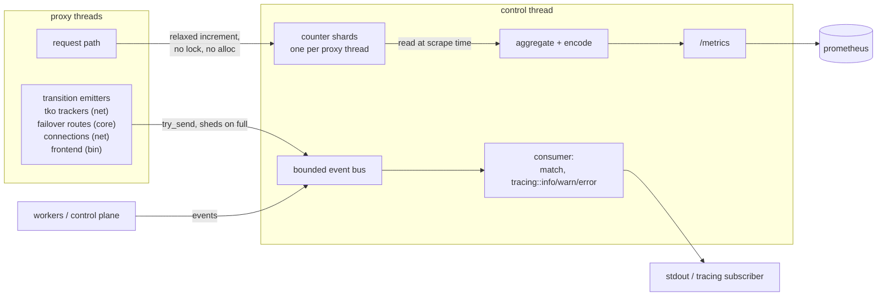
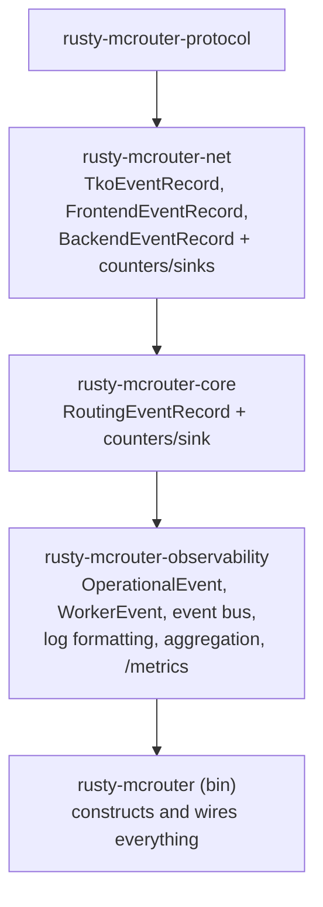
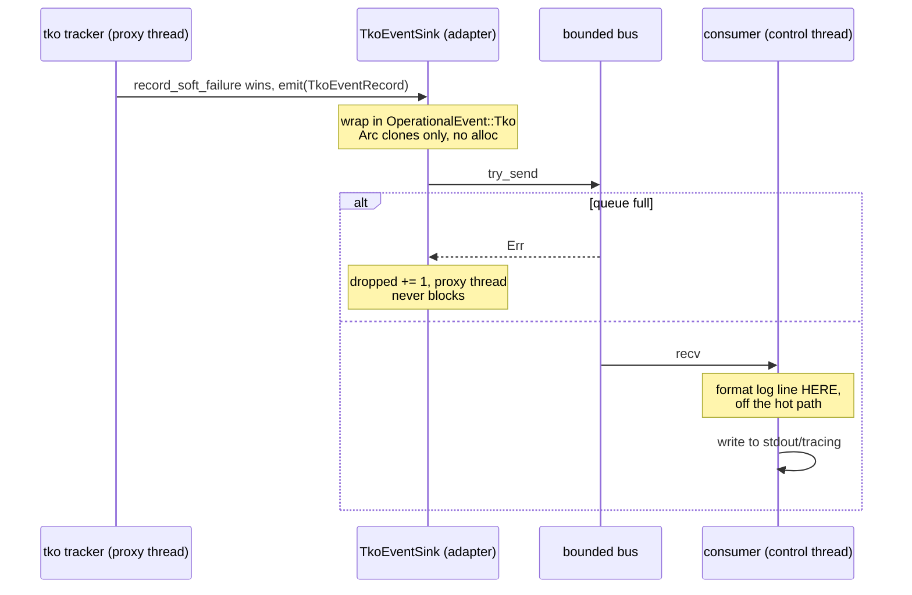

# 0001: observability — prometheus metrics + event logging

prometheus-based metrics and structured event logging for
rusty-mcrouter. faithful to upstream where it counts — **zero
allocation and zero locks on proxy threads** — while replacing the
fb-internal export machinery (ods JSON dumps) with a prometheus
scrape endpoint, per our OSS-alternatives philosophy.

## goals

- proxy threads record facts into preallocated, single-writer
  counters; nothing on the request path allocates, locks, or formats
- discrete transitions (tko marks, fail-open, worker lifecycle) become
  structured log events, delivered off-thread
- one `/metrics` endpoint carrying **every metric relevant to us**,
  including per-destination — there is no second observability surface
- no dependency cycles: leaf crates define facts, observability
  composes them, the binary wires it

## non-goals (this design)

- `stats [group]` / `stats servers` / `__mcrouter__.` protocol
  compatibility — **not planned, at all.** upstream's stats command
  was its only observability window; ours is /metrics, and everything
  relevant to us is exported there (including per-destination — see
  boundaries below). if a per-destination debugging view richer than
  /metrics is ever needed, the escape hatch is a JSON endpoint on the
  existing http listener, not memcached-protocol compat
- upstream's 240-bin rate windows — see "why no bins" below
- log files / json dumps

## the two paths

everything observable is either a **volume** (how many, how long) or a
**transition** (something changed state). they take different roads
and never mix:



every emitter goes through its own crate-local sink
(`TkoEventSink`, `RoutingEventSink`, ...) into the same bus. examples
of non-tko events: failover exhausted its targets for a request class
(`Routing`, warn), connect storms / repeated protocol desyncs
(`Backend`, warn), client connection limit hit (`Frontend`, warn),
worker started/stopped (`Worker`, info). the discipline stays the
same regardless of source: **transitions and rare anomalies only** —
a per-request fact (a single failover hop, a normal miss) is a
counter, never an event, or the bus becomes a firehose that sheds
exactly when you need it.

- **counters** answer "how is the system doing" — sampled by scrape,
  math done by the TSDB.
- **events** answer "what happened at 14:32:07" — the sub-scrape-
  interval forensics that metrics fundamentally can't provide.

**metrics do not travel through the event queue.** events are for
transitions; counters are for volume.

## why no bins (divergence from upstream, deliberate)

upstream keeps 240 one-second bins per rate stat, rotated by a
background tick that locks every proxy's stats mutex together
(reference doc §rate windows). that machinery exists because
upstream's consumers are stateless — a `stats` reply or JSON snapshot
is a single point-in-time read, so the *process* must carry the
history needed to compute a per-second rate.

prometheus inverts who holds the history:

```text
upstream:    process holds history (240 bins) ──► consumer reads one snapshot
prometheus:  process holds ONE monotonic counter
             ──► scraper samples every 15s ──► TSDB holds history
             ──► rate(x[1m]) subtracts at query time
```

so we count, forever, and never reset or rotate. consequences:

- **counters are monotonic, never zeroed by us.** process restart is
  the only reset; `rate()` detects the decrease and compensates.
- **the smoothing window becomes a query knob** (`rate(x[30s])` vs
  `rate(x[1h])`) instead of upstream's compile-time 4 minutes.
- **rule of thumb for queries/alerts: `rate()` window ≥ 4× scrape
  interval** (15s scrape → `rate(x[1m])` minimum).
- **what we lose: sub-scrape-interval maxima** (upstream's
  `max_stats`). a 1-second burst averages away at 15s scrapes.
  accepted — burst forensics is the event bus's job, with more
  context than a max gauge ever had. dropping max_stats also drops
  the only reason for upstream's locked-together rotation tick
  (reference doc, takeaway 4).
- **overflow is a non-concern by arithmetic**: u64 at 1M increments/s
  overflows in ~584,000 years; the earlier cliff is prometheus's f64
  samples losing integer precision at 2^53 ≈ 9×10^15 — still ~285
  years at 1M/s. wrap behavior if it ever happened: `fetch_add` wraps,
  `rate()` reads it as a reset, one bad sample.
- **the same rule kills upstream's latency EWMAs on this surface.**
  upstream pre-digests (bins, `ExponentialSmoothData`) because its
  export is a snapshot; we export raw monotonic sums
  (`latency_us_sum_total` + a request count) and the mean over any
  window is `rate(sum)/rate(count)` — cheaper to record (integer
  `fetch_add`, no float CAS), true mean instead of a recency-biased
  approximation, window chosen at query time.

## architecture

a new integration crate, `rusty-mcrouter-observability`:



**the dependency rule: leaf crates never import observability.**
observability imports and composes leaf types:

```text
leaf crates define facts.
observability composes and presents facts.
the binary wires the system together.
```

worker events live in the observability crate itself because proxy
workers are implemented in the binary — there is no lower crate to
own them.

## events (logging path)

each leaf crate keeps its own record + sink types (the existing
`TkoEventSink` pattern generalizes):

```rust
// leaf crate — knows nothing about the bus
pub type TkoEventSink = Box<dyn Fn(TkoEventRecord) + Send + Sync>;
```

records must be **owned and `'static`** — they cross a thread
boundary. no borrowed `&'a str`; identities are the `Arc<str>`s the
system already holds (cloning one is a refcount bump, not an
allocation):

```rust
pub struct TkoEventRecord {
    pub server: Arc<str>,
    pub pool: Option<Arc<str>>,
    pub transition: TkoTransition,
    // reason, consecutive_failures, global gauges — as today
}
```

> migration note: today's `TkoEventRecord<'a>` in `tko/events.rs`
> borrows `&'a str` and the module self-describes as temporary. this
> design replaces it: owned record, same fields, sink takes the record
> by value.

observability wraps sinks around one envelope + bounded queue:

```rust
pub enum OperationalEvent {
    Tko(TkoEventRecord),
    Frontend(FrontendEventRecord),
    Backend(BackendEventRecord),
    Routing(RoutingEventRecord),
    Worker(WorkerEventRecord),
}

impl EventSender {
    pub fn emit(&self, event: OperationalEvent) {
        if self.tx.try_send(event).is_err() {
            self.dropped.fetch_add(1, Ordering::Relaxed); // never block a proxy thread
        }
    }
    pub fn tko_sink(&self) -> TkoEventSink { /* clone sender, wrap */ }
}
```

`try_send` + a dropped-events counter is the load-shedding contract:
observability must never apply backpressure to request processing.
the consumer runs on the control thread and formats/writes log lines
there (tracing or plain writer — formatting cost lives off-thread).

### from record to log line

the consumer is a match that fans records out to `tracing` calls —
levels are per-transition, fields are structured (not preformatted
strings), and all of it runs on the control thread:

```rust
// observability/src/logging.rs
pub fn write(event: &OperationalEvent) {
    match event {
        OperationalEvent::Tko(r) => tko(r),
        OperationalEvent::Worker(r) => worker(r),
        // frontend / backend / routing analogous
    }
}

fn tko(r: &TkoEventRecord) {
    // tracing levels are const per callsite, so one arm per transition
    // rather than a computed level.
    let server = &*r.server;
    let pool = r.pool.as_deref();
    match r.transition {
        TkoTransition::MarkSoft => tracing::warn!(
            target: "mcrouter::tko",
            server, pool,
            reason = ?r.reason,
            consecutive_failures = r.consecutive_failures,
            soft = r.global_soft_tkos, hard = r.global_hard_tkos,
            "destination marked soft tko"
        ),
        TkoTransition::MarkHard => tracing::warn!(
            target: "mcrouter::tko",
            server, pool, reason = ?r.reason,
            "destination marked hard tko"
        ),
        TkoTransition::UnMark => tracing::info!(
            target: "mcrouter::tko",
            server, pool,
            "destination recovered"
        ),
        TkoTransition::RemoveFromConfig => tracing::info!(
            target: "mcrouter::tko",
            server, pool,
            "tko'd destination removed from config"
        ),
        TkoTransition::EnterFailOpen => tracing::error!(
            target: "mcrouter::tko",
            pool,
            "pool entered fail-open: all destinations tko'd"
        ),
        TkoTransition::ExitFailOpen => tracing::info!(
            target: "mcrouter::tko",
            pool,
            "pool exited fail-open"
        ),
    }
}
```

level policy, so it's a decision and not per-callsite vibes:

| level | meaning here | examples |
|-------|--------------|----------|
| error | losing capacity / degraded correctness envelope | EnterFailOpen |
| warn  | a destination-level state change an operator may act on | MarkSoftTko, MarkHardTko, event-queue drops |
| info  | recovery and lifecycle | UnMarkTko, ExitFailOpen, RemoveFromConfig, worker start/stop |
| debug+| not the bus's job — high-volume diagnostics stay out of the event system entirely |

two mechanical notes:

- `tracing` levels are compile-time per callsite (`tracing::event!`
  wants a const level), hence the one-arm-per-transition match rather
  than mapping transition → level as data.
- dropped events can't log themselves (they were dropped because
  logging was behind); the consumer emits a rate-limited
  `tracing::warn!` summarizing `dropped_total` when it notices the
  counter moved — the counter is the source of truth, the log line is
  a courtesy.

the subscriber (fmt layer, env-filter, stdout) is installed once by
`Observability::new` in the binary; leaf crates never touch
`tracing` directly — they only ever call their sink.

### scope: the bus is for the data plane, not the whole program

the sink → bus → consumer machinery exists for code that runs on (or
is emitted from) proxy threads and in awkward contexts (`Drop` impls,
sync callbacks) — places where blocking, allocating, or depending on
a global subscriber is unacceptable. it is **not** a house rule that
all logging must ride the bus:

- **startup, shutdown, config load/parse errors, cli validation, the
  control thread's own machinery** — plain `tracing::info!/error!` is
  correct here. these run before/off the data plane, blocking on
  stdout is fine, and startup errors especially must not depend on
  the event pipeline they precede (an early config error should print
  even if the bus was never constructed).
- **tests and dev tools** — use `tracing` freely.
- the rule of thumb: *if the code could run per-request or from a
  leaf crate, use the sink; if it runs once or on the control plane
  in the binary, just log.*

life of one event, end to end:



## metrics (counter path)

faithful to upstream's shape (reference doc §hot-path): fixed arrays,
single writer, aggregation deferred to scrape time.

```text
leaf crate:      owns + updates fixed counters (one shard per proxy thread)
observability:   reads shards, aggregates, encodes prometheus text
binary:          creates shards, hands them to both sides
```

```rust
// rusty-mcrouter-net — one per proxy thread (the shard). named
// ProxyCounters, not BackendCounters: in net's type namespace a
// "Backend" is one server (trait Backend = Rc<Destination>), and this
// struct is emphatically not per-server. the exported families keep
// the mcrouter_backend_* prefix, where backend-vs-frontend is the
// right operator-facing contrast.
pub struct ProxyCounters {
    // monotonic counters
    pub requests: [[AtomicU64; RESULT_CODE_COUNT]; COMMAND_KIND_COUNT],
    pub latency_us_sum: AtomicU64,
    pub connections_opened: AtomicU64,
    pub connections_closed: AtomicU64,   // incl. idle closes
    pub connect_retries: AtomicU64,
    pub connect_success_after_retry: AtomicU64,
    pub write_batches: AtomicU64,
    pub batched_requests: AtomicU64,     // batch size avg = promql quotient
    pub queue_full: AtomicU64,           // try_send shedding at the actor channel
    pub bytes_read: AtomicU64,
    pub bytes_written: AtomicU64,
    // gauges (single-writer add/sub, summed across shards at scrape)
    pub pending_reqs: AtomicI64,
    pub inflight_reqs: AtomicI64,
}
```

(the `leg` label from the metric table has no dimension here yet — it
needs a failover flag through `Backend::send` and is decided in the
routing-counters slice.)

frontend counters in the bin and per-pool counters in core follow the
same shard shape; gauges derived from existing state — tko counts,
server states, fail-open — aren't shards at all, they're read straight
from the live structures at scrape time. per-destination counters are
a third shape: `DestinationCounters`, an `Arc` block in a weak-dedup
registry keyed by server address (`Destination` itself is `Rc` —
thread-local, unreachable from the scrape thread). per-destination
counters have exactly one home: the shared `DestinationCounters` block
is both the destination's own bookkeeping and the scrape source. there
is no separate thread-local stats struct on `Destination` (there used
to be — it duplicated every write), and one should not be
reintroduced.

divergence from upstream, deliberate: upstream uses non-atomic
relaxed load+store (single-writer arrays). we use `AtomicU64` with
`Relaxed` ordering — same cost on x86/arm for uncontended
single-writer increments, and the scrape-side reads are sound without
`unsafe`. shards mean no cache-line contention between proxy threads;
pad/align per shard.

scrape-time aggregation (mirrors upstream's read-time `prepare_stats`
— the write path is allocation-free, the scrape path is allowed to
allocate):

```rust
// observability — scrape side. ProxyCounters shards → the
// mcrouter_backend_* families
struct BackendSource { shards: Vec<Arc<ProxyCounters>> }

impl BackendSource {
    fn encode(&self, out: &mut String) {
        let mut requests = [0u64; RESULT_CODE_COUNT];
        for shard in &self.shards {
            for (acc, c) in requests.iter_mut().zip(&shard.requests) {
                *acc += c.load(Ordering::Relaxed);
            }
        }
        // # TYPE mcrouter_backend_requests_total counter
        // mcrouter_backend_requests_total{result="timeout"} 1234
        ...
    }
}
```

metric inventory — the full "port now" set from the catalog (~20
families; names follow prometheus conventions, with the upstream
`stat_list.h` name in metric HELP text for cross-reference):

**frontend (bin)**

| metric | type | labels |
|--------|------|--------|
| `mcrouter_requests_total` | counter | `proxy`, `command` |
| `mcrouter_requests_failed_total` | counter | `pool` — client-visible errors (upstream `final_result_error`) |
| `mcrouter_client_connections` | gauge | — |
| `mcrouter_requests_processing` / `_waiting` | gauge | `proxy` — slot map depth |
| `mcrouter_dev_null_requests_total` | counter | — |

**backend (net, `ProxyCounters` shards)**

| metric | type | labels |
|--------|------|--------|
| `mcrouter_backend_requests_total` | counter | `result`, `leg` (normal/failover), `command` |
| `mcrouter_backend_connections_opened_total` / `_closed_total` | counter | — |
| `mcrouter_backend_connect_retries_total` / `_retry_successes_total` | counter | — |
| `mcrouter_backend_write_batches_total` / `_batched_requests_total` | counter | — (avg batch = promql) |
| `mcrouter_backend_queue_full_total` | counter | — actor channel shedding |
| `mcrouter_backend_bytes_{read,written}_total` | counter | — |
| `mcrouter_backend_pending_reqs` / `_inflight_reqs` | gauge | — summed over shards |

**tko / health (read from live structures at scrape)**

| metric | type | labels |
|--------|------|--------|
| `mcrouter_tko` | gauge | `kind` (soft/hard) — TkoCounters |
| `mcrouter_suspect_servers` | gauge | — sus_servers scan |
| `mcrouter_servers` | gauge | `state` (up/down/closed/new) |
| `mcrouter_pool_fail_open` | gauge | `pool` |
| `mcrouter_fail_open_entered_total` / `_exited_total` | counter | `pool` |

**routing (core)**

| metric | type | labels |
|--------|------|--------|
| `mcrouter_failover_total` | counter | `policy` (inorder/least_failures) |
| `mcrouter_failover_exhausted_total` | counter | `policy` |
| `mcrouter_failover_policy_errors_total` | counter | `class` (result/tko) |

**pool (core, config-bounded label cardinality)**

| metric | type | labels |
|--------|------|--------|
| `mcrouter_pool_requests_total` | counter | `pool` |
| `mcrouter_pool_connections` | gauge | `pool` |
| `mcrouter_pool_duration_us_sum_total` | counter | `pool` — mean via promql |

**per-destination (default on — non-multiplied except `result`)**

| metric | type | labels |
|--------|------|--------|
| `mcrouter_destination_up` | gauge | `destination` (0 = tko'd) |
| `mcrouter_destination_requests_total` | counter | `destination`, `result` |
| `mcrouter_destination_latency_us_sum_total` | counter | `destination` — mean via promql |
| `mcrouter_destination_inflight_reqs` | gauge | `destination` |

**latency / meta / self**

| metric | type | labels |
|--------|------|--------|
| `mcrouter_duration_us_sum_total` | counter | `op` (get/update) — mean = `rate(sum)/rate(requests)` |
| `mcrouter_build_info` | info gauge | `version` |
| `mcrouter_start_time_seconds` | gauge | — |
| `mcrouter_proxies` | gauge | — |
| `mcrouter_events_dropped_total` | counter | — the bus watching itself |

boundaries that keep this list honest:

- per-destination families are exported by default — realistic configs
  are double-digit destinations, so cardinality is a non-issue at our
  scale. the per-destination request counter carries the `result`
  label (`dests × ~9` series): per-server error *rates* are the main
  early-warning signal, before tko. the `command` dimension stays
  aggregate-only — command anomalies are keyspace questions, answered
  by the aggregate `{command, result}` family; adding `command` per
  destination is a one-line change if a real need shows up.
- `command` label = the meta five + mn, `result` = our ResultCode,
  `pool`/`proxy`/`destination` = config-bounded. no label sourced from
  keys.
- latency is exported as monotonic µs sums, never pre-digested
  averages (see "why no bins"). the per-destination latency EWMA that
  used to live in a thread-local `DestinationStats` is gone entirely —
  sum+count superseded it, and the struct itself was folded into
  `DestinationCounters`.
- process metrics (`process_*`) come from a stock collector, not
  hand-rolled.
- **a counter field may only exist if its emit site can be named in
  one sentence.** this rule already killed `socket_writes` /
  `socket_partial_writes` (upstream observes raw nonblocking write
  syscalls; our `write_all`-over-one-buffer path makes writes ≈
  batches and partials unobservable — see catalog).

the full upstream inventory (232 stats + 76 per-command names) with a
port/fold/defer/n-a decision for every entry lives in the companion
catalog: `0001-observability-catalog.md`. slice 3 may land this list
in two waves (backend + tko first, routing/pool second) — but the
target is the whole table.

## public api and wiring

```rust
pub struct Observability { events: EventSender, metrics: MetricsRegistry }

impl Observability {
    pub fn new(options: ObservabilityOptions) -> Self;
    pub fn events(&self) -> &EventSender;
    pub fn metrics(&self) -> &MetricsRegistry;
    pub async fn run(self, listener: TcpListener); // consumer + /metrics server
}
```

binary wiring:

```rust
let obs = Observability::new(opts);
let tko_map = TkoTrackerMap::with_sink(obs.events().tko_sink());
let route = build_route(&config, &factory, &defaults, obs.events().routing_sink())?;
// control thread: spawn consume_events and serve_prometheus as separate
// tasks (not one select! — neither should silently die with the other)
```

the /metrics server is a minimal hand-rolled http responder on the
control thread's runtime — no framework dependency for one endpoint.

## slices

1. **owned event records** — convert `TkoEventRecord<'a>` to owned
   `Arc<str>` form in net; sink signature change; tests keep their
   collecting sinks. workspace green.
2. **observability crate skeleton** — `OperationalEvent`, `EventSender`
   + bounded bus + dropped counter, consumer task, log formatting.
   unit tests: load-shedding, drop counting.
3. **counter shards** — `ProxyCounters` + `DestinationCounters` in net
   (fold the old destination stats in, wire into `Destination` and the
   connection actor), frontend counters in bin, `MetricsRegistry` +
   prometheus text encoding in observability.
4. **/metrics endpoint + binary wiring** — http responder, CLI
   options (`--metrics-port`), end-to-end test: run proxy + mock,
   scrape, assert counters move.
5. **new event sources** — `FrontendEventRecord`, `BackendEventRecord`,
   `RoutingEventRecord`, `WorkerEventRecord` as needed (each is small
   once the bus exists).

## test matrix

- bus: full queue sheds and counts, consumer drains in order, sender
  clone per thread
- counters: shard sums match known traffic through mock memcached;
  encode output parses as prometheus text format
- integration: tko mark/unmark produces `MarkSoftTko` log line and
  gauge transitions 0→1→0; fail-open event fires exactly once
- perf smoke: `.bench/` route throughput unchanged with observability
  wired vs no-op sinks

## open questions

- latency histograms: prometheus-native histograms want preallocated
  bucket arrays (fine for the no-alloc rule) but bucket boundaries
  need choosing. sum+count already gives means; histograms add
  percentiles, and a histogram is just sum+count+buckets — a natural
  extension of what ships here. defer to a follow-up?
- event bus channel: tokio mpsc vs crossbeam for the try_send path
  from non-async contexts (Drop impls emit events!) — needs a
  decision in slice 2. note `Destination::drop` fires
  `RemoveFromConfig` from a sync context today.
