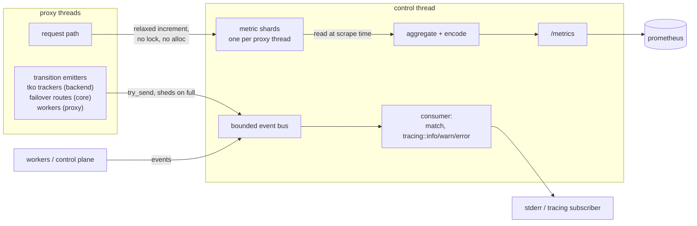
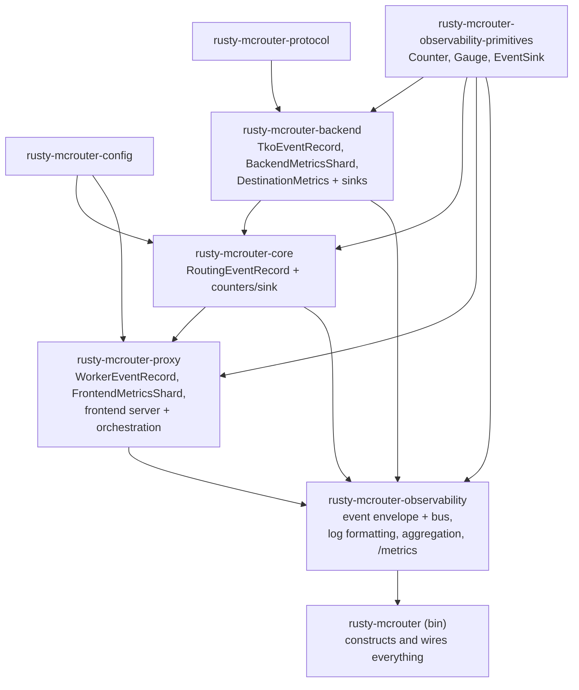

# 0001: observability — prometheus metrics + event logging

prometheus-based metrics and structured event logging for
rusty-mcrouter. faithful to upstream where it counts — **no allocation
or locks to record a metric** — while replacing the
fb-internal export machinery (ods JSON dumps) with a prometheus
scrape endpoint, per our OSS-alternatives philosophy.

## goals

- proxy threads record facts into preallocated, single-writer
  counters; nothing on the request path allocates, locks, or formats
- discrete transitions (tko marks, fail-open, failover exhaustion,
  worker lifecycle) become structured log events, delivered off-thread
- one `/metrics` endpoint carrying **every metric relevant to us**,
  including per-destination — there is no second observability surface
- no dependency cycles: leaf crates define facts, observability
  composes them, the binary wires it

## slice status

| slice | status |
|---|---|
| route graph | implemented |
| backend + destination | partial |
| frontend | partial |
| process + exposition metadata | deferred |
| remaining event domains | partial |

the remaining event domains include config lifecycle events. config is
currently loaded once at startup; hot reload and its attempt/success/failure
events are not implemented by the route-graph slice.

## route-graph slice contract

routing instrumentation uses an explicit `&RouteContext` argument on
every route call. there is no task-local or global routing state. each
top-level request creates one context containing:

- a borrowed per-proxy `RoutingState`;
- a `Cell<Option<usize>>` holding the first pool whose destination was
  sendable;
- the route start time.

the binary builds one immutable `RoutingMetricsLayout` from configured
pool names. every proxy shard shares that layout, and route construction
resolves pool names to bounded integer indexes once. the request path
does no pool-name lookup and creates no metric cells.

`Backend::prepare_send` performs the sole synchronous TKO gate and returns an
unboxed future only when the destination is sendable. `DestinationRoute`
claims the first pool after successful preparation and before awaiting that
future, matching mcrouter's `maySend` then `setPoolStatsIndex` ordering without
a second health check.

pool metrics deliberately separate attempts from final outcomes:

- `pool_requests_total` updates once per reached destination, including
  TKO fast-fails and failover attempts. `pool_duration_us_sum_total`
  records elapsed time only after the backend passes its sole TKO gate,
  so an already-TKO attempt contributes zero duration;
- the first sendable pool receives exactly one
  `pool_completed_requests_total` update at the local or queued-proxy
  execution boundary;
- later failover pools never overwrite that selection. the selected
  pool receives `pool_requests_failed_total` when the final
  route result is an error, and `pool_total_duration_us_sum_total`
  receives the whole route duration;
- a request whose reached destinations all fast-fail as already TKO has
  attempts but no final pool attribution.

failover counters follow route-policy decisions rather than backend hop
count:

- `failover_total` increments once when at least one policy-selected
  backup candidate exists;
- `failover_policy_errors_total` counts error/TKO outcomes presented to
  the policy while deciding whether or where to continue. this includes
  a failing primary even when no backup exists; the terminal selected
  target is not a policy error because no next decision follows it;
- `failover_exhausted_total` and its routing event fire when the final
  policy-selected target returns an error. stopping at a separate error
  budget is not target exhaustion;
- TKO fast-fails are free error-budget tries. least-failures
  `max_tries` limits policy candidates including the primary, and policy
  health records actual error outcomes rather than failover eligibility.

## non-goals (this design)

- `stats [group]` / `stats servers` / `__mcrouter__.` protocol
  compatibility — **not planned, at all.** upstream's stats command
  was its only observability window; ours is /metrics, and everything
  relevant to us is exported there (including per-destination — see
  boundaries below). if a per-destination debugging view richer than
  /metrics is ever needed, the escape hatch is a JSON endpoint on the
  existing http listener, not memcached-protocol compat
- upstream's 240-bin rate windows — see "why no bins" below
- log files / json dumps

## the two paths

everything observable is either a **volume** (how many, how long) or a
**transition** (something changed state). they take different roads
and never mix:



every emitter goes through its own crate-local sink
(`TkoEventSink`, `RoutingEventSink`, ...) into the same bus. the
implemented non-tko events are failover target exhaustion (`Routing`,
warn) and worker start/stop (`Worker`, info). the discipline stays the
same regardless of source: **transitions and rare anomalies only** —
a per-request fact (a single failover hop, a normal miss) is a
counter, never an event, or the bus becomes a firehose that sheds
exactly when you need it.

- **counters** answer "how is the system doing" — sampled by scrape,
  math done by the TSDB.
- **events** answer "what happened at 14:32:07" — the sub-scrape-
  interval forensics that metrics fundamentally can't provide.

**metrics do not travel through the event queue.** events are for
transitions; counters are for volume.

## why no bins (divergence from upstream, deliberate)

upstream keeps 240 one-second bins per rate stat, rotated by a
background tick that locks every proxy's stats mutex together
(reference doc §rate windows). that machinery exists because
upstream's consumers are stateless — a `stats` reply or JSON snapshot
is a single point-in-time read, so the *process* must carry the
history needed to compute a per-second rate.

prometheus inverts who holds the history:

```text
upstream:    process holds history (240 bins) ──► consumer reads one snapshot
prometheus:  process holds ONE monotonic counter
             ──► scraper samples every 15s ──► TSDB holds history
             ──► rate(x[1m]) subtracts at query time
```

so we count, forever, and never reset or rotate. consequences:

- **counters are monotonic, never zeroed by us.** process restart is
  the only reset; `rate()` detects the decrease and compensates.
- **the smoothing window becomes a query knob** (`rate(x[30s])` vs
  `rate(x[1h])`) instead of upstream's compile-time 4 minutes.
- **rule of thumb for queries/alerts: `rate()` window ≥ 4× scrape
  interval** (15s scrape → `rate(x[1m])` minimum).
- **what we lose: sub-scrape-interval maxima** (upstream's
  `max_stats`). a 1-second burst averages away at 15s scrapes.
  accepted — burst forensics is the event bus's job, with more
  context than a max gauge ever had. dropping max_stats also drops
  the only reason for upstream's locked-together rotation tick
  (reference doc, takeaway 4).
- **overflow is a non-concern by arithmetic**: u64 at 1M increments/s
  overflows in ~584,000 years; the earlier cliff is prometheus's f64
  samples losing integer precision at 2^53 ≈ 9×10^15 — still ~285
  years at 1M/s. wrap behavior if it ever happened: `fetch_add` wraps,
  `rate()` reads it as a reset, one bad sample.
- **the same rule kills upstream's latency EWMAs on this surface.**
  upstream pre-digests (bins, `ExponentialSmoothData`) because its
  export is a snapshot; we export raw monotonic sums
  (`latency_us_sum_total` + a request count) and the mean over any
  window is `rate(sum)/rate(count)` — cheaper to record (integer
  `fetch_add`, no float CAS), true mean instead of a recency-biased
  approximation, window chosen at query time.

## architecture

the integration crate, `rusty-mcrouter-observability`:



**the dependency rule: leaf crates never import observability.**
observability imports and composes leaf types:

```text
leaf crates define facts.
observability composes and presents facts.
the binary wires the system together.
```

## events (logging path)

each leaf crate keeps its own record + sink types (the existing
`TkoEventSink` pattern generalizes):

```rust
// leaf crate — knows nothing about the bus
pub type TkoEventSink = EventSink<TkoEventRecord>;
```

`EventSink<T>`, `Counter` and `Gauge` live in the std-only
`rusty-mcrouter-observability-primitives` crate. domain records remain
in their fact-owning crates.

records must be **owned and `'static`** — they cross a thread
boundary. no borrowed `&'a str`; identities are the `Arc<str>`s the
system already holds (cloning one is a refcount bump, not an
allocation):

```rust
pub struct TkoEventRecord {
    pub event: TkoEvent,
    pub server: Arc<str>,
    pub pool: Option<Arc<str>>,
    pub reason: ResultCode,
    pub consecutive_failures: u64,
    pub global_soft_tkos: i64,
    pub global_hard_tkos: i64,
}
```

observability wraps sinks around one envelope + bounded queue:

```rust
pub enum Event {
    Tko(TkoEventRecord),
    Routing(RoutingEventRecord),
    Worker(WorkerEventRecord),
}

impl From<TkoEventRecord> for Event {
    fn from(record: TkoEventRecord) -> Self {
        Self::Tko(record)
    }
}

impl EventSender {
    pub fn emit(&self, event: Event) {
        if self.tx.try_send(event).is_err() {
            self.dropped.inc(); // never block a proxy thread
        }
    }

    pub fn sink<T>(&self) -> EventSink<T>
    where
        T: Send + 'static,
        Event: From<T>,
    { /* clone sender, wrap record.into() */ }
}
```

`From<Record> for Event` is the compile-time link between
domain-owned records and the presentation envelope. adding an event source
does not require another source-specific adapter method.

`try_send` + a dropped-events counter is the load-shedding contract:
observability must never apply backpressure to request processing.
the consumer runs on the control thread and formats/writes log lines
there (tracing or plain writer — formatting cost lives off-thread).

### from record to log line

the consumer is a match that fans records out to `tracing` calls —
levels are per-transition, fields are structured (not preformatted
strings), and all of it runs on the control thread:

```rust
// observability/src/logging.rs
pub fn write(event: &Event) {
    match event {
        Event::Tko(r) => tko(r),
        Event::Routing(r) => routing(r),
        Event::Worker(r) => worker(r),
    }
}

fn tko(r: &TkoEventRecord) {
    // tracing levels are const per callsite, so one arm per transition
    // rather than a computed level.
    let server = &*r.server;
    let pool = r.pool.as_deref();
    match r.event {
        TkoEvent::MarkSoftTko => tracing::warn!(
            target: "rusty-mcrouter-observability::tko",
            server, pool,
            reason = ?r.reason,
            consecutive_failures = r.consecutive_failures,
            soft = r.global_soft_tkos, hard = r.global_hard_tkos,
            "destination marked soft tko"
        ),
        TkoEvent::MarkHardTko => tracing::warn!(
            target: "rusty-mcrouter-observability::tko",
            server, pool, reason = ?r.reason,
            "destination marked hard tko"
        ),
        TkoEvent::UnMarkTko => tracing::info!(
            target: "rusty-mcrouter-observability::tko",
            server, pool,
            "destination recovered"
        ),
        TkoEvent::RemoveFromConfig => tracing::info!(
            target: "rusty-mcrouter-observability::tko",
            server, pool,
            "tko'd destination removed from config"
        ),
        TkoEvent::EnterFailOpen => tracing::error!(
            target: "rusty-mcrouter-observability::tko",
            pool,
            "pool entered fail-open: all destinations tko'd"
        ),
        TkoEvent::ExitFailOpen => tracing::info!(
            target: "rusty-mcrouter-observability::tko",
            pool,
            "pool exited fail-open"
        ),
    }
}
```

level policy, so it's a decision and not per-callsite vibes:

| level | meaning here | examples |
|-------|--------------|----------|
| error | losing capacity / degraded correctness envelope | EnterFailOpen |
| warn  | a routing or destination state an operator may act on | MarkSoftTko, MarkHardTko, failover target exhaustion, event-queue drops |
| info  | recovery and lifecycle | UnMarkTko, ExitFailOpen, RemoveFromConfig, worker start/stop |
| debug+| not the bus's job — high-volume diagnostics stay out of the event system entirely |

two mechanical notes:

- `tracing` levels are compile-time per callsite (`tracing::event!`
  wants a const level), hence the one-arm-per-transition match rather
  than mapping transition → level as data.
- dropped events can't log themselves (they were dropped because
  logging was behind); the consumer emits a rate-limited
  `tracing::warn!` summarizing `dropped_total` when it notices the
  counter moved — the counter is the source of truth, the log line is
  a courtesy.

the subscriber (fmt layer, env-filter, stderr) is installed once by
`Observability::new` in the binary; leaf crates never touch
`tracing` directly — they only ever call their sink.

### scope: the bus is for the data plane, not the whole program

the sink → bus → consumer machinery exists for code that runs on (or
is emitted from) proxy threads and in awkward contexts (`Drop` impls,
sync callbacks) — places where blocking, allocating, or depending on
a global subscriber is unacceptable. it is **not** a house rule that
all logging must ride the bus:

- **startup, shutdown, config load/parse errors, cli validation, the
  control thread's own machinery** — plain `tracing::info!/error!` is
  correct here. these run before/off the data plane, blocking on
  stderr is fine, and startup errors especially must not depend on
  the event pipeline they precede (an early config error should print
  even if the bus was never constructed).
- **tests and dev tools** — use `tracing` freely.
- the rule of thumb: *if the code could run per-request or from a
  leaf crate, use the sink; if it runs once or on the control plane
  in the binary, just log.*

life of one event, end to end:


## metrics (counter path)

faithful to upstream's shape (reference doc §hot-path): fixed arrays,
single writer, aggregation deferred to scrape time.

```text
leaf crate:      owns + updates fixed metrics (one shard per proxy thread)
observability:   reads shards, aggregates, encodes prometheus text
binary:          creates shards, hands them to both sides
```

```rust
// rusty-mcrouter-backend - one per proxy thread. the name states both
// the measured leg and the storage shape; this is not per-destination.
pub struct BackendMetricsShard {
    // monotonic counters
    pub requests: [[Counter; RESULT_CODE_COUNT]; RequestKind::COUNT],
    pub latency_us_sum: Counter,
    pub connections_opened: Counter,
    pub connections_closed: Counter,   // incl. idle closes
    pub connect_retries: Counter,
    pub connect_success_after_retry: Counter,
    pub write_batches: Counter,
    pub batched_requests: Counter,     // batch size avg = promql quotient
    pub queue_full: Counter,           // try_send shedding at the actor channel
    pub bytes_read: Counter,
    pub bytes_written: Counter,
    // gauges (single-writer add/sub, summed across shards at scrape)
    pub pending_reqs: Gauge,
    pub inflight_reqs: Gauge,
}
```

backend request metrics intentionally do not carry a `leg` label.
normal and failover attempts are distinguished at the config-bounded
pool layer; adding a backend leg dimension would duplicate that signal
across the higher-cardinality command/result matrix.

frontend metrics in proxy (`FrontendMetricsShard`) and per-pool
counters in core follow the same shard shape; gauges derived from
existing state — tko counts, server states, fail-open — aren't shards
at all, they're read straight from the live structures at scrape time.
per-destination metrics are a third shape: `DestinationMetrics`, an
`Arc` block in a weak-dedup registry keyed by the canonical address in
`TkoTracker` (`Destination` itself is `Rc` — thread-local, unreachable
from the scrape thread). per-destination metrics have exactly one home:
the shared `DestinationMetrics` block is both the destination's own
bookkeeping and the scrape source. there
is no separate thread-local stats struct on `Destination` (there used
to be — it duplicated every write), and one should not be
reintroduced.

divergence from upstream, deliberate: upstream uses non-atomic relaxed
load+store under a single-writer invariant. our `Counter` and `Gauge`
use atomic read-modify-write operations with `Relaxed` ordering. this
pays the atomic instruction cost so scrape-thread reads are sound
without locks or `unsafe`; per-proxy cache-line-aligned shards keep the
operation uncontended.

scrape-time aggregation (mirrors upstream's read-time `prepare_stats`
— the write path is allocation-free, the scrape path is allowed to
allocate):

```rust
// observability — scrape side. BackendMetricsShard values → the
// rusty_mcrouter_backend_* families
struct BackendSource { shards: Vec<Arc<BackendMetricsShard>> }

impl BackendSource {
    fn encode(&self, out: &mut String) {
        let mut requests = [0u64; RESULT_CODE_COUNT];
        for shard in &self.shards {
            for (acc, c) in requests.iter_mut().zip(&shard.requests) {
                *acc += c.load();
            }
        }
        // # TYPE rusty_mcrouter_backend_requests_total counter
        // rusty_mcrouter_backend_requests_total{command="mg",result="timeout"} 1234
        ...
    }
}
```

implemented metric inventory (names and labels are API):

**frontend (proxy, `FrontendMetricsShard` shards)**

| metric | type | labels |
|--------|------|--------|
| `rusty_mcrouter_requests_total` | counter | `command` |
| `rusty_mcrouter_noops_total` | counter | — |
| `rusty_mcrouter_parse_errors_total` | counter | — |
| `rusty_mcrouter_requests_failed_total` | counter | —; client-visible errors (upstream `final_result_error`) |
| `rusty_mcrouter_client_connections` | gauge | — |
| `rusty_mcrouter_requests_processing` | gauge | —; slot map depth |

**backend (`rusty-mcrouter-backend`, `BackendMetricsShard` shards)**

| metric | type | labels |
|--------|------|--------|
| `rusty_mcrouter_backend_requests_total` | counter | `command`, `result` |
| `rusty_mcrouter_backend_latency_us_sum_total` | counter | — |
| `rusty_mcrouter_backend_connections_opened_total` / `_closed_total` | counter | — |
| `rusty_mcrouter_backend_connect_retries_total` / `_retry_successes_total` | counter | — |
| `rusty_mcrouter_backend_write_batches_total` / `_batched_requests_total` | counter | — (avg batch = promql) |
| `rusty_mcrouter_backend_queue_full_total` | counter | — actor channel shedding |
| `rusty_mcrouter_backend_bytes_{read,written}_total` | counter | — |
| `rusty_mcrouter_backend_pending_reqs` / `_inflight_reqs` | gauge | — summed over shards |

**tko / health (read from live structures at scrape)**

| metric | type | labels |
|--------|------|--------|
| `rusty_mcrouter_tko` | gauge | `kind` (soft/hard) — GlobalTkoMetrics |
| `rusty_mcrouter_suspect_servers` | gauge | — sus_servers scan |
| `rusty_mcrouter_pool_fail_open` | gauge | `pool` |
| `rusty_mcrouter_pool_destinations_tko` | gauge | `pool` |
| `rusty_mcrouter_fail_open_entered_total` / `_exited_total` | counter | `pool` |

**routing (core)**

| metric | type | labels |
|--------|------|--------|
| `rusty_mcrouter_failover_total` | counter | `policy` (inorder/least_failures) |
| `rusty_mcrouter_failover_exhausted_total` | counter | `policy` |
| `rusty_mcrouter_failover_policy_errors_total` | counter | `class` (result/tko) |
| `rusty_mcrouter_dev_null_requests_total` | counter | — |

**pool (core, config-bounded label cardinality)**

| metric | type | labels |
|--------|------|--------|
| `rusty_mcrouter_pool_requests_total` | counter | `pool` |
| `rusty_mcrouter_pool_duration_us_sum_total` | counter | `pool` — per-attempt duration; mean via PromQL with requests |
| `rusty_mcrouter_pool_completed_requests_total` | counter | `pool` — final attribution denominator |
| `rusty_mcrouter_pool_requests_failed_total` | counter | `pool` — final errors only |
| `rusty_mcrouter_pool_total_duration_us_sum_total` | counter | `pool` — whole-route duration; mean via PromQL with completed requests |

operator examples:

```promql
# Requests per second entering failover.
sum by (policy) (rate(rusty_mcrouter_failover_total[5m]))

# Raw pool-attempts / pool-attributed-completions ratio.
# All-TKO requests contribute attempts but no completion, by design.
sum(rate(rusty_mcrouter_pool_requests_total[5m]))
/
sum(rate(rusty_mcrouter_pool_completed_requests_total[5m]))

# Final failure ratio by first sendable pool.
rate(rusty_mcrouter_pool_requests_failed_total[5m])
/
rate(rusty_mcrouter_pool_completed_requests_total[5m])
```

**per-destination (default on — non-multiplied except `result`)**

| metric | type | labels |
|--------|------|--------|
| `rusty_mcrouter_destination_up` | gauge | `destination` (0 = tko'd) |
| `rusty_mcrouter_destination_requests_total` | counter | `destination`, `result` |
| `rusty_mcrouter_destination_latency_us_sum_total` | counter | `destination` — mean via promql |
| `rusty_mcrouter_destination_connects_total` | counter | `destination` |
| `rusty_mcrouter_destination_idle_closes_total` | counter | `destination` |
| `rusty_mcrouter_destination_probes_sent` | gauge | `destination` — current TKO episode |
| `rusty_mcrouter_destination_inflight_reqs` | gauge | `destination` |

**self**

| metric | type | labels |
|--------|------|--------|
| `rusty_mcrouter_build_info` | info gauge | `version` |
| `rusty_mcrouter_start_time_seconds` | gauge | — |
| `rusty_mcrouter_proxies` | gauge | — |
| `rusty_mcrouter_events_dropped_total` | counter | — the bus watching itself |

boundaries that keep this list honest:

- per-destination families are exported by default — realistic configs
  are double-digit destinations, so cardinality is a non-issue at our
  scale. the per-destination request counter carries the `result`
  label (`dests × ~9` series): per-server error *rates* are the main
  early-warning signal, before tko. the `command` dimension stays
  aggregate-only — command anomalies are keyspace questions, answered
  by the aggregate `{command, result}` family; adding `command` per
  destination is a one-line change if a real need shows up.
- `command` label = the five routed meta commands; `mn` has its own
  scalar counter. `result` = our `ResultCode`, while
  `pool`/`destination` are config-bounded. no label is sourced from
  keys.
- latency is exported as monotonic µs sums, never pre-digested
  averages (see "why no bins"). the per-destination latency EWMA that
  used to live in a thread-local `DestinationStats` is gone entirely —
  sum+count superseded it, and the struct itself was folded into
  `DestinationMetrics`.
- process metrics (`process_*`) remain deferred to a stock collector;
  they are not hand-rolled here.
- **a counter field may only exist if its emit site can be named in
  one sentence.** this rule already killed `socket_writes` /
  `socket_partial_writes` (upstream observes raw nonblocking write
  syscalls; our `write_all`-over-one-buffer path makes writes ≈
  batches and partials unobservable — see catalog).

the full upstream inventory (232 stats + 76 per-command names) with a
port/fold/defer/n/a decision for every entry lives in the companion
catalog: `0001-observability-catalog.md`.

## public api and wiring

```rust
impl Observability {
    pub fn new(bus_capacity: usize) -> Self;
    pub fn events(&self) -> &EventSender;
    pub fn register(&mut self, source: Box<dyn MetricsSource>);
    pub fn into_parts(self, metrics_addr: Option<SocketAddr>)
        -> io::Result<(Option<SocketAddr>, ObservabilityParts)>;
}
```

binary wiring:

```rust
let mut obs = Observability::new(event_bus_capacity);
let tko_map = TkoTrackerMap::with_sink(obs.events().sink());
let layout = RoutingMetricsLayout::new(config.pools.keys().cloned());
let metrics = RoutingMetricsShard::new(Arc::clone(&layout));
let state = RoutingState::with_event_sink(metrics, obs.events().sink());
let route = build_route(&config, &factory, &defaults, state.layout())?;
obs.register(Box::new(RoutingSource { shards }));
let (metrics_addr, parts) = obs.into_parts(metrics_addr)?;
let control = ControlThread::spawn(parts, process_events)?;
```

the control thread owns event consumption and a Hyper HTTP/1 metrics service.
the service disables keep-alive, applies a five-second connection timeout and
tracks at most 32 concurrent connection tasks. excess connections increment
`rusty_mcrouter_metrics_http_rejected_total` and are closed.

## implementation record

the shipped slices are: owned TKO, routing, and worker event records;
the bounded shedding bus; per-proxy frontend/backend/routing shards;
shared per-destination blocks; live TKO/fail-open sources; the Hyper
HTTP endpoint; and supervised binary construction/wiring. route instrumentation is
guarded by `rusty-mcrouter/tests/route_graph_observability.rs`, which
parses real config, builds a graph with mock backends, executes through
the proxy boundary, renders the real `RoutingSource`, and asserts
healthy and failover metrics.

## test matrix

- bus: full queue sheds and counts, consumer drains in order, sender
  clone per thread
- counters: shard sums and every indexed command/result cell are
  covered by unit tests
- routing: failover entry, policy error, exhaustion, TKO free tries,
  per-pool attempts, and final attribution are asserted independently
- integration: process-level mock tests scrape `/metrics`; route-graph
  tests cover healthy and primary-to-backup paths through the proxy

## deferred follow-ups

- latency histograms: prometheus-native histograms want preallocated
  bucket arrays (fine for the no-alloc rule) but bucket boundaries
  need choosing. sum+count already gives means; histograms add
  percentiles, and a histogram is just sum+count+buckets — a natural
  extension of what ships here.
- stock `process_*` collection remains deferred.
- additional frontend/backend event families should be added only for
  rare transitions with a concrete operational consumer.
- config reload commands, an admin HTTP API and graceful request draining are
  deferred; the current control command surface contains shutdown only.
