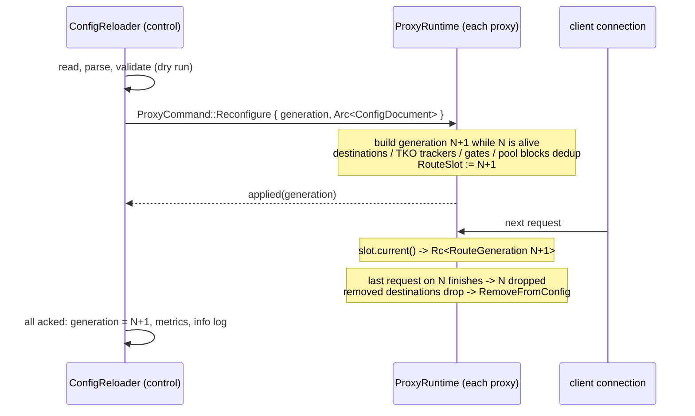

# 0002: hot config reload

today the config file is read once in `main` (`rusty-mcrouter/src/main.rs:28`)
and every proxy thread builds its route graph once
(`rusty-mcrouter-proxy/src/thread.rs:79-99`). this design adds hot reload:
when the config file changes, validate it, then move every proxy to the new
config. there is no restart, no dropped connections, and TKO state is
preserved.

## the contract

1. **a bad config never goes live.**
   - read, parse and validation failures keep the running config
   - the failure is counted, logged and visible on `/metrics`
2. **all or nothing.**
   - every expected build failure is caught on the coordinator before any
     proxy is touched
   - proxies are only sent a config that is known to build
3. **in-flight requests finish on the graph they started with.**
   - the old graph is dropped when its last request finishes
4. **existing client connections switch on their next request.**
   - neither they nor their pipelines are reset
5. **identity survives, state follows it.**
   - a server still in the new config keeps its destination, connections,
     TKO state and per-destination metrics
   - a pool still in the new config (same name) keeps its fail-open gate
     and its metric series; the counters do not reset
6. **options are not config.** CLI options are fixed for the life of the
   process, as upstream. only pools and routes reload.

## non-goals

- SIGHUP or HTTP `/-/reload` triggers. the coordinator is trigger-agnostic,
  so either is a small follow-up.
- `@import` / multi-file configs, backup configs (`config_dump_root`,
  `configs_from_disk`) and the upstream `__mcrouter__.config_*` admin reads.
- reloading CLI options: listen address, proxy count, `--route-prefix`,
  `--send-invalid-route-to-default`, timeouts and TKO knobs.
- partial or incremental reconfiguration: every reload rebuilds the whole
  graph.

## upstream vs us

| | upstream | rusty-mcrouter |
|---|---|---|
| detect | inotify + symlink chain, md5 fallback | poll: read the file and compare bytes |
| debounce | `reconfiguration_delay_ms` (1000) on every loop iteration | same option name and default |
| build | the config thread builds every proxy's `ProxyConfig` | route graphs are thread-local `Rc`, so **each proxy builds its own** |
| all-or-nothing | build all, then swap all | dry-run validate once on the coordinator, then broadcast |
| pin | `shared_ptr<ProxyConfig>` per request | `Rc<RouteGeneration>` per request |
| continuity | weak maps keyed by host:port, destination key, pool name | same idea; **pool identity must stop being `PoolId`** (below) |
| gate accounting | unmark hits whatever gate is attached now | same; a known limitation (below) |

## the hard part: `PoolId` is generation-relative

`PoolId` is an index into one `ConfigDocument`'s pool list. that list is
sorted by name (`rusty-mcrouter-config/src/document.rs:172-179`, `:251-257`),
so adding pool `aaa` renumbers every other pool. today, four long-lived
structures are keyed by `PoolId`:

| where | keyed by | what goes wrong across a reload |
|---|---|---|
| pool TKO gates: `TkoTrackerMap::pool_tracker_for(id, ...)` (`rusty-mcrouter-backend/src/backend.rs:111-112`, `tko/map.rs:52-70`) | `PoolId` | the new pool N dedups to the old pool N's gate. that is someone else's fail-open state; in debug builds it trips `debug_assert_eq!(existing.name(), pool_name)` (`tko/map.rs:60`) |
| per-thread gate cache: `DestinationFactory.pool_gates` (`backend.rs:92`, `:105-115`), one factory per thread (`thread.rs:85`) | `PoolId` | same mix-up as the gates, and it holds every gate it has ever seen alive for the life of the thread, so a removed pool's gate never dies |
| pool metrics: `RoutingMetricsShard::pool(id)` (`rusty-mcrouter-core/src/metrics.rs:122-160`), built once from one layout (`rusty-mcrouter/src/proxy.rs:82-89`) | `PoolId` index into a fixed `Vec` | a new layout means new shards. counters reset (breaking 0001's "never zeroed by us") and `RoutingSource` assumes all shards share one layout (`rusty-mcrouter-observability/src/sources.rs:188-197`) |
| request attribution: `RouteContext.selected_pool: Cell<Option<PoolId>>` (`rusty-mcrouter-core/src/context.rs:18-20`, `:55-59`) | `PoolId` | only safe if the index is resolved against the table of the context's own generation |

the rule this design adopts: **`PoolId` never outlives the generation that
produced it. anything that outlives a generation is keyed by pool name.**

## design

### 1. detect: `ConfigReloader` on the control runtime

a new `ConfigReloader` in the binary (`rusty-mcrouter/src/reload.rs`) is one
more arm of the `ControlRuntime` select loop
(`rusty-mcrouter/src/control.rs:153-184`).

- only a `tokio::time::Interval` tick races in the `select!`. `Interval::tick`
  is cancel-safe; a plain `sleep` would restart every time another arm fired,
  and a steady event stream could starve the poll.
- the reload itself runs to completion inside the arm body.

it owns:

- the config path, `reconfiguration_delay`, the `last_seen` file state and the
  running `Arc<ConfigDocument>` + generation
- a clone of every `ProxyHandle`
- the startup-only inputs validation needs: destination defaults and root
  route options

the loop:

```text
every reconfiguration_delay:
    state = read(path)                  # bytes, or the io::ErrorKind
    if state == last_seen: continue
    sleep(reconfiguration_delay); state = read(path)  # settle partial writes
    last_seen = state
    attempt(state)
```

- a read error is also a "state". a missing file is logged and counted once,
  not once per tick.
- identical content is never re-attempted. a failed attempt is not sticky:
  the next change to the file triggers a fresh attempt. this mirrors
  upstream, which retries on the next change.
- if the new content matches the running config's bytes, nothing is rebuilt.
  the failure gauge goes back to success.
- if the parsed document is `==` the running one (for example a comment-only
  edit; `ConfigDocument: PartialEq`, `document.rs:111`), record a success
  without broadcasting. this keeps failover state across cosmetic edits.
- the reloader runs on the control thread for these reasons:
  - it is control-plane code, so per 0001 §scope it logs with plain
    `tracing` and does not go through the event bus
  - it already has a runtime
  - it needs no new supervision

  file reads are a few KB, done inline. a reload takes milliseconds, so
  `/metrics` accepts pause briefly during one; that is acceptable.

### 2. validate: a side-effect-free dry run

`parse` already validates structure, references, cycles, pool sizes and
aliases (`document.rs:18-106`). the builder adds one real failure mode
(`rusty-mcrouter-core/src/route_builder.rs:26-33`):

- `DefaultRouteMissing`: a plural `routes` config lacks `--route-prefix`
  (`:118-123`). this is reachable by editing the config.
- `PoolMissingFromMetricsLayout` (`:261-265`) is an internal invariant. it
  disappears with name-keyed pool metrics (§4).

`rusty_mcrouter_core::validate(config, defaults, root_options)` runs the
**real builder** with an inert `BackendFactory`. inert backends never send
and never touch shared state. so validation equals the build, by
construction, with no second rulebook to keep in sync. it has none of a real
build's side effects: no destinations, no TKO trackers, no gate attachment
(`destination/map.rs:50-55` attaches gates to live trackers). a failed
validation leaves nothing behind.

### 3. apply: generations on each proxy



- **the command.** `ProxyCommand` gains
  `Reconfigure { generation, config: Arc<ConfigDocument>, applied: oneshot::Sender<Result<(), BuildError>> }`
  (`rusty-mcrouter-proxy/src/message.rs:4-6`). the command channel is
  reliable and prioritized ahead of requests
  (`rusty-mcrouter-proxy/src/runtime.rs:66-78`, capacity 16 at
  `handle.rs:17`).
- **the reloader** sends to every proxy first, then awaits every ack, so
  cutover is near-simultaneous. mixed generations exist briefly, exactly as
  upstream's sequential swap. a cross-proxy request uses the target proxy's
  current graph.
- **the generation.** today's `route: Rc<dyn DynRoute>` +
  `routing_state: Rc<RoutingState>` pair becomes
  `RouteGeneration { generation, route, state }`. it lives in a per-proxy
  `RouteSlot` (`RefCell<Rc<RouteGeneration>>`). startup and reload share one
  `GenerationBuilder`; the build code at `thread.rs:79-99` moves there.
  - the builder creates a fresh `DestinationFactory` per generation, so the
    factory's gate cache cannot outlive its config.
  - the per-proxy routing event sink is a `Box<dyn EventSink>`, so it is
    shared across generations through an `Rc`.
- **build before drop.** the new generation is built while the slot still
  holds the old one, so `destination::Map`'s `Weak` dedup
  (`destination/map.rs:44-77`) hands the new graph the live destinations. that
  is the entire connection-continuity mechanism, as upstream.
- **connections read the slot per request.**
  - today, a connection captures the graph once, at accept, and uses it
    forever (`connection.rs:33`, `:210-220`; `runtime.rs:118-129`). it would
    never see a reload.
  - it will hold `Rc<RouteSlot>` instead, and `route_target` will clone the
    current `Rc<RouteGeneration>` per request.
  - the borrow is taken only to clone and never across an `.await`; no
    locks, it is thread-local.
- **pinning.** each request (and each detached wildcard secondary) holds its
  generation `Rc`. `RouteContext` already holds `Rc<RoutingState>`
  (`context.rs:19`), so a context always resolves `PoolId`s against its own
  generation's table.
- **apply failure** is unreachable after validation: same builder, same
  inputs. if it happens anyway:
  - the proxy keeps its old generation and acks the error
  - the reloader logs which proxies failed and counts `stage="apply"`
  - there is no automatic rollback; the next successful reload converges
    the proxies
  - generation numbers are never reused, even after a failed apply, so a
    number always names exactly one config
- **shutdown race.** a send or ack failure because a proxy is exiting is
  logged at debug and not counted. the supervisor is already handling that
  exit (`control.rs:19-23`).

### 4. pool metrics keyed by name

- **`RoutingMetricsShard`** stays one per proxy for the life of the process.
  - it keeps the scalar routing counters: dev-null and failover
    (`metrics.rs:126-129`)
  - it gains a scrape-visible `Mutex<BTreeMap<Arc<str>, Weak<PoolMetrics>>>`
  - `ProxyShards::new` stops taking a layout (`proxy/src/config.rs:46-52`)
- **a per-generation `PoolMetricsTable`** (`Vec<Arc<PoolMetrics>>` indexed by
  that generation's `PoolId`) replaces `RoutingMetricsLayout`.
  - `GenerationBuilder::build` resolves it by name: it takes the shard's lock once
    per build, on the proxy thread, at control-plane frequency
  - it covers every configured pool, including unreferenced ones, as the
    layout does today
- **request path:** unchanged cost (an index plus one pointer), no lock, no
  allocation. every `shard.pool(id)` becomes `state.pools[id]`.
- **`RoutingSource`** sums by name across shards. the shared-layout
  `debug_assert` goes away.
- **series lifecycle,** consistent with per-destination blocks (0001):
  - a surviving pool continues its series monotonically. an in-flight
    request on the old generation writes the same block.
  - a removed pool leaves the scrape once the last generation referencing it
    is dropped.
  - a pool added back restarts at 0, which Prometheus treats as a counter
    reset.

### 5. pool gates keyed by name

- `pool_tracker_for(name, thresholds)` dedups by pool name, as upstream
  (`TkoTracker.cpp:281-298`), and `PoolId` leaves `PoolFailOpen`
  (`backend.rs:54-61`). `DestinationFactory` becomes per-generation, and its
  gate cache is keyed by name.
- since the new generation is built while the old one is alive, a surviving
  pool gets its live gate: fail-open state, counts and counters carry over.
- a gate's thresholds are fixed for its lifetime, as upstream.
- re-attaching a gate while a server is marked mis-accounts the mark. this is
  accepted, as upstream does; see known limitations. a comment on
  `TkoTracker::set_pool_tracker` records it.

### what survives a reload

| state | identity | on reload |
|---|---|---|
| destination + connections + probes | `DestinationKey{addr, reply_timeout}` (`destination/key.rs:4-6`) | reused if the key matches |
| per-destination metrics | the TKO tracker's canonical address | continuous |
| TKO tracker (soft/hard marks) | `host:port` | preserved; threshold fixed at creation |
| pool fail-open gate | pool name (after §5) | preserved; thresholds fixed at creation |
| pool metric series | pool name (after §4) | continuous |
| removed server | — | dropped when the last generation using it drops; emits `RemoveFromConfig` if it was responsible for a TKO (`destination/destination.rs:233-245`) |
| `LeastFailuresPolicy` counters (`core/src/failover/policy.rs:32`) | the route | reset, as upstream; skipped for no-op reloads |
| frontend/backend shards, `/metrics` registry | the proxy | untouched: nothing in them is config-shaped after §4 |

## failure semantics

| failure | running config | counted as | log |
|---|---|---|---|
| file unreadable or missing | kept | `stage="read"`, once per state change | error |
| invalid JSON or schema | kept | `stage="parse"` | error, with the `ConfigError` path |
| unbuildable (e.g. default route missing) | kept | `stage="validate"` | error |
| a proxy fails to build (bug) | that proxy keeps the old one | `stage="apply"` | error, naming the proxies |
| startup config invalid | process exits, as today | — | error |

## observability

owned by a `ConfigMetrics` block (next to `ControlMetrics`), rendered by a
new `ConfigSource`:

| metric | type | upstream |
|---|---|---|
| `rusty_mcrouter_config_generation` | gauge | — (1 at startup, +1 per applied reload) |
| `rusty_mcrouter_config_reload_attempts_total` | counter | `config_full_attempt` (reloads only; startup is generation 1) |
| `rusty_mcrouter_config_reload_failures_total` | counter, `stage` = read/parse/validate/apply | `config_failures` |
| `rusty_mcrouter_config_last_reload_successful` | gauge 0/1 | — (Prometheus convention: 1 iff the file on disk is what is running) |
| `rusty_mcrouter_config_last_success_timestamp_seconds` | gauge | `config_last_success`; `config_age` = `time() - ...` in PromQL |

- `config_last_attempt` folds into `attempts_total`.
- `configs_from_disk` and the `_sr` stats are n/a.
- implementation updates the catalog's config rows accordingly (0001 catalog
  §config).
- logging: an info log on apply (generation, pools, elapsed); an error log
  on reject (stage and error chain). `RemoveFromConfig` already flows
  through the TKO event path.

## CLI

| flag | default | notes |
|---|---|---|
| `--disable-reload-configs` | false | upstream name; the reloader is not constructed |
| `--reconfiguration-delay-ms` | 1000 | upstream name/default; poll period and settle delay. tests use ~20ms |

## known limitations (documented, not fixed)

- a reused destination keeps the non-key parameters it was created with:
  `connect_timeout`, probe delays, `failures_until_tko`
  (`destination/map.rs:50-55`). upstream behaves the same. changing
  `server_timeout` changes the key, so it does get fresh destinations.
- a pool's `tko_tracker` threshold change applies only once its gate is
  recreated: the pool is removed and re-added, or the process restarts.
- **a TKO'd server that moves to a different gated pool is unmarked against
  the wrong gate.**
  - why: `set_pool_tracker` replaces the attached gate
    (`tko/tracker.rs:65-67`), and an unmark decrements whichever gate is
    attached at that moment (`:108-117`). upstream behaves the same
    (`TkoTracker.cpp:69-70`, `:88-89`).
  - effect: the old gate keeps a leaked mark until restart, so its pool fails
    open early. the new gate's count is clamped at zero by `saturating_sub`
    (`tko/pool.rs:96`).
  - only this case is affected. removing a server, and a pool that keeps its
    name, are both accounted correctly.
- mixed generations exist for the duration of the broadcast.

## implementation slices

each slice leaves the tree green; reload is not reachable until slice 6.

1. `[backend]` key pool gates by name; comment the re-attachment limitation
2. `[core][observability]` name-keyed pool metric blocks, generation-scoped
   `PoolMetricsTable`, `RoutingSource` sums by name
3. `[core]` `validate()` via a dry-run build with an inert factory
4. `[proxy]` `RouteGeneration` + `RouteSlot`; connections read per request;
   `ProxyCommand::Reconfigure`; shared `GenerationBuilder` with a
   per-generation `DestinationFactory`
5. `[observability]` `ConfigMetrics` + `ConfigSource`; catalog rows
6. `[bin]` `ConfigReloader` in the control runtime; the two CLI flags;
   `ProxyFleet::handles()`
7. `[test]` end-to-end reload tests
8. `[docs]` as-built `architecture/config-reload.md`; mark 0002 implemented;
   update 0001 §slice status

## implementation record

| piece | lives in |
|---|---|
| name-keyed gates | `rusty-mcrouter-backend/src/tko/map.rs`, `backend.rs` |
| pool blocks and generation tables | `rusty-mcrouter-core/src/metrics.rs`, `context.rs` |
| dry-run validation | `rusty-mcrouter-core/src/route_builder/validate.rs` |
| generations, slot, builder | `rusty-mcrouter-proxy/src/generation.rs`, `runtime.rs`, `connection.rs` |
| config metrics | `rusty-mcrouter-observability/src/metrics.rs`, `sources.rs` |
| reloader | `rusty-mcrouter/src/reload.rs`, wired in `control.rs` and `main.rs` |

the end-to-end contract is guarded by
`config_reload_moves_existing_connections_and_rejects_bad_configs` and
`disabled_reloads_ignore_config_changes` in `rusty-mcrouter/tests/system_e2e.rs`.
the first holds one client connection across a valid reload, a broken one and
a restore, and asserts the pool series never resets.

## test matrix

- **backend:**
  - two builds with different `PoolId`s for the same name share one gate
  - a TKO'd removed destination emits `RemoveFromConfig` when the old graph
    drops
- **core:**
  - `validate` rejects a missing default route
  - `validate` creates no destinations or trackers
  - a surviving pool's counters are continuous across generations
  - a removed pool leaves the scrape after its generation drops
  - an old-generation in-flight request records into the right block
- **proxy:**
  - after `Reconfigure`, new connections and an **existing** connection's
    next request use the new graph
  - a request in flight across the swap completes on the old graph
  - the ack arrives after the slot swap
- **e2e** (`rusty-mcrouter/tests/system_e2e.rs`). `RouterProcess` needs a
  config-rewrite helper; today it owns the temp path privately
  (`tests/support/mod.rs:14`, `:18-23`). writes go to a temp file plus a
  rename.
  1. config A routes to mock server 1
  2. write config B, pointing to server 2; wait for
     `rusty_mcrouter_config_generation 2`; the same client connection's next
     `mg` hits server 2
  3. write invalid JSON: `failures_total{stage="parse"}` becomes 1,
     `last_reload_successful` 0, and traffic still flows to B
  4. restore B: `last_reload_successful` returns to 1, and the generation is
     unchanged
  5. a comment-only edit is a no-op success
