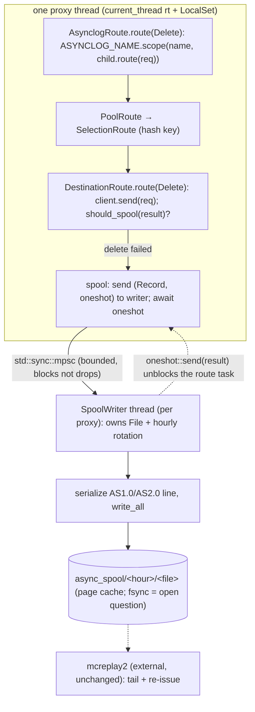

# rusty-mcrouter async delete log (design)

> Status: **Proposed (2026-06-12)**
> Mirrors: [`../mcrouter/async-delete-log.md`](../mcrouter/async-delete-log.md) — how mcrouter does it
> Implemented in: `../architecture/async-delete-log.md` (once built; **nothing exists yet** — see [`../architecture/overview.md`](../architecture/overview.md))
> Related: [`./observability.md`](./observability.md) (explicitly scoped this out as "durability, not observability"; its `tracing-appender` non-blocking writer is the same off-thread-writer pattern), [`../mcrouter/backend-client.md`](../mcrouter/backend-client.md) (the destination seam where a delete fails), [`./threading-model.md`](./threading-model.md) (the per-proxy `LocalSet` model the spool writer hangs off)

How we give rusty-mcrouter the one piece of durability that actually matters for
a cache router: **failed `delete`s must not be silently lost.** When a delete
can't reach its backend, we spool it to local disk in mcrouter's on-disk format
so the existing replay pipeline can re-issue it. Read the
[mcrouter reference](../mcrouter/async-delete-log.md) first; this doc assumes it
and only describes our side.

---

## the two questions up front

**"Why is this a separate feature from observability?"** Because it is the only
log in mcrouter whose loss is a *correctness* bug, not a *visibility* bug. A
dropped stats sample or trace span costs you a graph; a dropped delete spool
leaves stale data in cache until the next write to that key — which may be never.
[`./observability.md`](./observability.md) said it plainly: the asynclog is
"durability, not observability; separate design if we want it." This is that
design. The shared mechanism — *an off-thread writer so blocking disk I/O never
runs on a proxy* — is the same one observability uses for `tracing-appender`'s
non-blocking writer; the **policy** is the opposite: observability's log writer
**drops** under pressure, the spool writer **must not**.

**"Can we just reuse what's there?"** No — there is **nothing** to reuse. A
search of the tree turns up exactly one asynclog token, and it is a test
asserting the feature is *absent*: `object_form_pool_route_drops_extras_but_keeps_pool_and_hash`
(`rusty-mcrouter-config/src/route.rs:214-223`) proves the `asynclog` key on a
`PoolRoute` is parsed and **silently dropped**. No spool writer, no replay, no
file rotation, no `fsync` decision — greenfield. The good news is the two seams
we need already exist: the route-graph trait we hang an `AsynclogRoute` off, and
the per-proxy `LocalSet` model that maps cleanly onto mcrouter's per-proxy
`AsyncLog`.

---

## goal

Spool a `delete` to local disk, in mcrouter's AS1.0/AS2.0 line format, **when and
only when** the delete failed to reach a backend — without:

1. blocking a proxy thread's event loop on a `write()` syscall (the
   [reference](../mcrouter/async-delete-log.md) ships the write to a separate
   thread), while still
2. holding the client's reply until the record is on disk (the reference blocks
   the *request fiber* on a `Baton` — "don't ack the delete until it's logged"),
   and
3. losing a spool under load (unlike observability's log writer, the spool queue
   may **not** be lossy).

Produce a spool the existing `mcreplay2` tooling can consume unchanged — i.e.
byte-compatible records and directory layout.

## scope / non-goals

In scope:

- an **`AsynclogRoute`** route-handle wrapper (the tree node that names the spool)
  + wiring it into `route_builder` from the `PoolRoute` `asynclog` config key;
- a **per-proxy spool writer** (the `AsyncLog` analogue) that owns a file handle,
  rotates it hourly, and does the blocking write **off the proxy event loop** on
  a dedicated thread — the `AsyncWriter` analogue;
- the **spool decision** at the `DestinationRoute` leaf, *below* the
  `RouteError → Reply::ServerError` collapse, so the typed failure and the
  destination address are still in hand;
- the **AS1.0 / AS2.0 record format**, hourly directory layout, filename
  template, and 15-minute rotation — byte-for-byte;
- the **config surface**: `async_spool`, `asynclog_disable`,
  `use_asynclog_version2`, and the `PoolRoute` `asynclog` attribute;
- the **`await`-until-on-disk** semantic and a **non-lossy** handoff queue.

Out of scope here (deferred or tracked elsewhere):

- **a Rust replay tool.** We *produce* the spool in mcrouter's format; consuming
  it is `mcreplay2`'s job, exactly as in the reference. A native replayer is
  later work.
- **the Axon / `DistributionRoute` in-process successor.** rusty has no Axon
  layer; file spool is the only path. (mcrouter prefers Axon and falls back to
  file — we *are* the fallback.)
- **fsync / true durability.** The reference deliberately does **not** fsync;
  whether we match that or strengthen it is an open question below, not a
  commitment.
- **the stats counters** (`asynclog_requests`, …) — they belong on the per-proxy
  `ProxyStats` shard from [`./observability.md`](./observability.md), which isn't
  built yet. We emit `tracing` events meanwhile (see §6).

---

## starting point (current rusty)

Greenfield for durability, but the structural seams exist (full as-built detail
belongs in `../architecture/async-delete-log.md`; summarized here to frame the
change):

- **The route graph is a trait we can wrap.** `Route` and the object-safe
  `DynRoute` (`Rc<dyn DynRoute>`) live in
  `rusty-mcrouter-core/src/routes/mod.rs:29-57`; errors are
  `RouteError { Backend(NetError), SelectorOutOfRange }` (`mod.rs:18-25`). An
  `AsynclogRoute` is just another `Route` impl wrapping a child `Rc<dyn DynRoute>`.
- **A delete already flows to a leaf.** `Connection::drain_input` parses
  `Request::Delete` (`rusty-mcrouter/src/proxy/connection.rs:109-120`) and
  `submit_single` spawns the route task (`connection.rs:137-146`); the graph is
  `PoolRoute → SelectionRoute` (hashes the key, picks a child) `→ DestinationRoute`,
  whose `route` just forwards `client.send(req)` (`destination_route.rs:16-20`).
- **The builder is where we wrap.** `RouteBuilder::build_handle`
  (`rusty-mcrouter-core/src/route_builder.rs:70-108`) handles only
  Null/Error/Pool; the `PoolRoute` arm (`:78-81`) builds the pool and is the
  natural place to wrap with an `AsynclogRoute` when an `asynclog` name is
  present. `get_or_build_destinations` already iterates `pool_config.servers`
  (`:134-143`) and constructs each `DestinationRoute::new(client)` — so the
  **server address is in hand at build time** (it just isn't kept).
- **The failure detail is destroyed at two seams.** A `RouteError` is collapsed
  into `Reply::ServerError("backend unavailable")` in `route_one`
  (`connection.rs:209-213`) and again on the cross-thread path in
  `Proxy::spawn_request` (`proxy/proxy.rs:28-37`). After either, we no longer
  know it was a *delete*, which *destination*, or what *failed*. **Anything that
  needs to spool must act below these seams** — inside the route graph. (Same
  lesson as [`./observability.md` §2](./observability.md).)
- **Failure semantics are thin.** No timeout, no failover (`FailoverRoute` →
  `RouteTypeNotImplemented`, `route_builder.rs:99-106`), no TKO, no reconnect
  ([`../mcrouter/backend-client.md`](../mcrouter/backend-client.md) gap list). A
  delete "fails" today only as a hard `RouteError::Backend(NetError)` (backend
  EOF/IO → `fail_all_pending`, `rusty-mcrouter-net/src/client/connection.rs:119`)
  or a backend-returned `Reply::ServerError` / `Reply::Error`. There is **no
  `isFailoverErrorResult` equivalent** — we'll define a narrower predicate and
  widen it as failure handling lands.
- **Config drops the key.** `RouteHandleConfig::PoolRoute { pool, hash }`
  (`rusty-mcrouter-config/src/route.rs:11-14`) has no `asynclog` field; unknown
  PoolRoute keys are discarded (the `:214-223` test). `PoolConfig` keeps unknown
  keys in `extra` (`pool.rs:4-11`) but nothing reads them.
- **The runtime maps onto mcrouter's per-proxy model.** One OS thread per proxy,
  each a `current_thread` Tokio runtime + `LocalSet` ("our FiberManager
  analogue", `proxy/thread.rs:15-21`), building its own thread-local
  `Rc<dyn DynRoute>` graph. So a **per-proxy** `AsyncLog` (file owner) is the
  natural unit, exactly like `ProxyBase::asyncLog_`. The one already-`Send` task
  in the tree is `Client::connect`'s `tokio::spawn`; a spool writer thread is the
  second place we step outside the `!Send` proxy world.

---

## target design

Three pieces, mapped straight onto the [reference](../mcrouter/async-delete-log.md):
**`AsynclogRoute`** (names the spool), the **`DestinationRoute` leaf** (decides to
spool, below the collapse), and a **per-proxy `SpoolWriter`** (formats + writes
off-thread, the `AsyncLog` + `AsyncWriter` pair fused).



### 1. `AsynclogRoute` — name the spool via a task-local

Mirror the wrapper directly, but use a `tokio::task_local!` where mcrouter uses a
fiber-local — the routing of one request runs as a single `spawn_local` task
(`connection.rs:141`), so a task-local set at the wrapper is visible at the leaf
within the same task:

```rust
tokio::task_local! {
    // the fiber_local::setAsynclogName analogue
    pub static ASYNCLOG_NAME: Rc<str>;
}

pub struct AsynclogRoute {
    child: Rc<dyn DynRoute>,
    name: Rc<str>,            // == AsynclogRoute::asynclogName_
}

impl Route for AsynclogRoute {
    async fn route(&self, req: Request) -> Result<Reply> {
        // only deletes carry the spool name down; everything else is pass-through
        if matches!(req, Request::Delete { .. }) {
            ASYNCLOG_NAME
                .scope(Rc::clone(&self.name), self.child.route_dyn(req))
                .await
        } else {
            self.child.route_dyn(req).await
        }
    }
}
```

Why a task-local and not just "have the wrapper inspect the reply"? Because the
wrapper sits *above* selection and **does not know which destination was
chosen** — but the spool record needs the host/port. The task-local lets the
wrapper contribute the *name* while the leaf contributes the *address*, exactly
the mcrouter split (`setAsynclogName` up top, `ap` at the leaf). It also keeps
working when a `FailoverRoute` is later inserted between wrapper and leaf.

`routeName()` analogue (for a future `route_handles` admin walk): `"asynclog:{name}"`.

### 2. `DestinationRoute` — decide to spool, below the collapse

The leaf is the only node that both talked to a real backend and knows its
address. Give it the address it currently throws away, and let it spool:

```rust
pub struct DestinationRoute {
    client: Client,
    server: Rc<str>,          // NEW: kept from route_builder's pool_config.servers
    spool: Option<SpoolHandle>, // NEW: Some(..) only under an AsynclogRoute path
}

impl Route for DestinationRoute {
    async fn route(&self, req: Request) -> Result<Reply> {
        // deletes need the original key for the spool record; clone cheaply (Bytes)
        let delete_key = match &req {
            Request::Delete { key } if self.spool.is_some() => Some(key.clone()),
            _ => None,
        };

        let result = self.client.send(req).await.map_err(RouteError::from);

        if let (Some(key), Some(spool)) = (delete_key, &self.spool) {
            if should_spool(&result) {
                if let Some(name) = ASYNCLOG_NAME.try_with(|n| Rc::clone(n)).ok() {
                    // AWAIT until on disk — the Baton analogue (§3)
                    spool.write_delete(&self.server, &key, &name).await;
                }
            }
        }
        result
    }
}
```

- **`should_spool`** is our `isFailoverErrorResult` analogue. Today, narrowly:
  `Err(RouteError::Backend(_))`, or `Ok(Reply::ServerError(_) | Reply::Error(_))`.
  It widens as timeouts/failover/TKO arrive — that's the whole point of keeping
  the predicate in one place.
- **This runs below the collapse seams.** Because the leaf spools *before*
  returning, the `RouteError → ServerError` flattening in `route_one`/`spawn_request`
  hasn't happened yet — we still have the typed error, the key, and the address.
- **The client still gets the (failed) reply.** We don't change the reply; we
  just make sure the record is durable first. `Request::Delete` carries only a
  key (`rusty-mcrouter-protocol/src/request.rs`), and the parser rejects
  `noreply` (`parser/delete.rs:99`), so there's no fire-and-forget delete to
  special-case.

### 3. `SpoolWriter` — off the event loop, but awaited (the `AsyncLog` + `AsyncWriter` fusion)

One `SpoolWriter` per proxy thread (the `ProxyBase::asyncLog_` unit), owning the
`std::fs::File` and the rotation clock. The proxy-side `SpoolHandle` ships a
record to a **dedicated OS thread** that does the blocking write, and **awaits a
`oneshot`** for completion:

```rust
struct SpoolRecord {
    server: Box<str>, key: Bytes, name: Box<str>, done: oneshot::Sender<bool>,
}

#[derive(Clone)]
pub struct SpoolHandle { tx: std::sync::mpsc::SyncSender<SpoolRecord> } // bounded, BLOCKS when full

impl SpoolHandle {
    async fn write_delete(&self, server: &str, key: &Bytes, name: &str) -> bool {
        let (done, rx) = oneshot::channel();
        // hand off to the writer thread; never drop a delete:
        if self.tx.try_send(/* record */).is_err() { /* backpressure: see open Qs */ }
        rx.await.unwrap_or(false)        // <- the request task suspends here == Baton::wait()
    }
}

// on the dedicated writer thread: own the File, rotate hourly, write one line.
fn writer_loop(rx: std::sync::mpsc::Receiver<SpoolRecord>, opts: SpoolOptions) {
    let mut log = AsyncLog::new(opts);          // owns Option<File> + spool_time
    for rec in rx {                              // blocking recv; serializes all writes
        let ok = log.write_delete(&rec.server, &rec.key, &rec.name); // open_file + write_all
        let _ = rec.done.send(ok);               // wake the awaiting route task
    }
}
```

Key faithfulness points and the one deliberate divergence:

- **Off the event loop.** The `write()` runs on the writer thread; the proxy's
  Tokio loop is free to keep serving other connections. This is mcrouter's
  `AsyncWriter`.
- **Awaited, not dropped.** The route task `.await`s the `oneshot` — the `Baton`
  analogue — so the client isn't acked until the record is written. And the
  handoff queue is **bounded-and-blocking, not drop-on-full**: a lost delete is a
  correctness bug. This is the explicit inversion of
  [`./observability.md` §5](./observability.md), whose log writer is
  intentionally lossy.
- **Per-proxy, not shared.** mcrouter has *one* `AsyncWriter` thread serializing
  all proxies' writes but per-proxy `AsyncLog` files. Thread-per-core makes a
  **per-proxy writer thread** simpler (no cross-proxy `Send` of the file, each
  proxy's records are already isolated) at the cost of N writer threads instead
  of 1. A single shared writer is the literal mapping; see open questions.
- **`spawn_blocking` is the MVP shortcut.** Tokio's `spawn_blocking` works on a
  `current_thread` runtime and gives await-completion + backpressure for free —
  but each call is independent, so file-handle reuse and hourly rotation get
  awkward. The dedicated writer owning the `File` is worth it for faithful
  rotation; start with `spawn_blocking` only if we want a one-day spike.

### 4. the on-disk format — byte-compatible with mcrouter

`AsyncLog` (the struct on the writer thread) replicates
[the reference §4](../mcrouter/async-delete-log.md) exactly, so `mcreplay2` reads
our files with no changes:

- **rotation:** reuse the open file until `now - spool_time > 15min`
  (`DEFAULT_ASYNCLOG_LIFETIME`), then open a new one. **Keep the 15-minute
  constant** — it's a contract with `mcreplay2`'s `kLogLifetime`.
- **hour dir:** `{async_spool}/{YYYYMMDD}T{HH}-{hour_epoch}`, `hour_epoch =
  now - now%3600`, created `0777` (tolerate `EEXIST`).
- **file:** `{hourdir}/{YYYYMMDD}T{HHMMSS}-{epoch}-{service}-{router}-t{tid}-{uniq}`
  opened append-or-create at `0666`. The `tid`+unique suffix keeps two proxies'
  writers from colliding.
- **record (recommend AS2.0 default):** one JSON line,
  `["AS2.0", unix_seconds_f64, "C", {"s","f","r","h":"[host]:port","p":name,"k":key,"a":{"al":1}}]`;
  keep AS1.0 (`["AS1.0", ts, "C", ["host", port, "delete k\r\n"]]`) behind
  `use_asynclog_version2=false` for parity with deployments that still read v1.
  Always inject the `"al":1` marker.

We'll need `serde_json` (already a dep via `rusty-mcrouter-config`) for the line,
and the proxy's service/router/region/flavor identity threaded into
`SpoolOptions`.

### 5. config surface

```jsonc
// PoolRoute gains an optional asynclog name (today: parsed then dropped)
{ "type": "PoolRoute", "pool": "foo", "asynclog": "foo" }
```

- **`RouteHandleConfig::PoolRoute { pool, hash, asynclog: Option<String> }`**
  (`rusty-mcrouter-config/src/route.rs`): read the `asynclog` key in
  `parse_object_form`; the `:214-223` test flips from "drops" to "keeps".
- **`route_builder`**: when `asynclog: Some(name)`, wrap the built pool route in
  `AsynclogRoute::new(child, name)` and thread a `SpoolHandle` into each
  `DestinationRoute` of that pool.
- **process options** (CLI/env, alongside the existing flags in
  `rusty-mcrouter/src/main.rs`): `async_spool` (default `/var/spool/mcrouter`),
  `asynclog_disable` (skip all wrapping), `use_asynclog_version2`. `async_spool`
  + the proxy identity feed `SpoolOptions`.

### 6. stats / observability (depends on `ProxyStats`)

The three counters belong on the per-proxy `ProxyStats` shard proposed in
[`./observability.md` §3](./observability.md), which doesn't exist yet:
`asynclog_requests`, `asynclog_spool_success`, `asynclog_duration_us`. Until that
lands, emit `tracing` events at the spool seam (`warn!(target: "asynclog", pool,
server, "spooled failed delete")` and an `error!` if the write itself fails) —
cheap, and it slots into the observability layer when it arrives. Don't block the
spool feature on the stats shard.

---

## how this maps to mcrouter

| mcrouter | rusty |
|---|---|
| `AsynclogRoute` (tree wrapper, names the spool) | `AsynclogRoute: Route` wrapping `Rc<dyn DynRoute>` |
| `fiber_local::setAsynclogName` / `getAsynclogName` | `tokio::task_local! ASYNCLOG_NAME` set via `.scope()` |
| deletes special-cased, others pass-through | `matches!(req, Request::Delete)` branch, else forward |
| `DestinationRoute::route(McDeleteRequest)` decides | `DestinationRoute::route` inspects the delete result |
| `isFailoverErrorResult(result)` | `should_spool(&Result<Reply>)` (narrow today; widens with failover/TKO) |
| leaf knows its `AccessPoint` | `DestinationRoute.server: Rc<str>` kept from `pool_config.servers` |
| `spool()` → Axon then `spoolAsynclog` | file spool only (no Axon in rusty) |
| `spoolAsynclog`: `asyncWriter()->run(closure)` | `SpoolHandle::write_delete` → `SyncSender` to the writer thread |
| `folly::fibers::Baton::wait()` (ack after on disk) | `.await` a `oneshot` from the writer thread |
| `AsyncLog` (per proxy, owns `file_`) | per-proxy `SpoolWriter` owning a `std::fs::File` |
| `AsyncWriter` (1 shared, off-loop thread) | per-proxy writer thread (or 1 shared — open Q) |
| **drop-on-full is fine for stats, never for asynclog** | bounded-**blocking** `SyncSender`, not drop-on-full |
| `openFile` hourly dir + filename template, 15-min reuse | identical layout + constant (mcreplay contract) |
| AS1.0 / AS2.0 line, `"al":1` marker | identical via `serde_json`, AS2.0 default |
| `async_spool`, `asynclog_disable`, `use_asynclog_version2` | same options (CLI/env in `main.rs`) |
| PoolRoute `asynclog` attribute | `RouteHandleConfig::PoolRoute.asynclog: Option<String>` |
| no `fsync` (page-cache durability) | match by default (open Q to strengthen) |
| `mcreplay2` external replay | unchanged — we only produce the format |
| Axon / `DistributionRoute` replay successor | out of scope (no Axon) |
| `asynclog_requests/spool_success/duration_us` stats | same, on the future `ProxyStats` shard; `tracing` until then |

---

## the failed-delete lifecycle (target)

```mermaid
sequenceDiagram
  participant C as client
  participant CN as Connection (proxy thread)
  participant AR as AsynclogRoute
  participant DR as DestinationRoute (leaf)
  participant BK as backend (Client)
  participant SW as SpoolWriter thread

  C->>CN: delete foo
  CN->>AR: route(Delete) on a spawn_local task
  Note over AR: ASYNCLOG_NAME.scope(name, ...)
  AR->>DR: child.route(Delete)
  DR->>BK: client.send(Delete)
  BK-->>DR: Err(NetError) or ServerError (delete failed)
  Note over DR: should_spool(result); read ASYNCLOG_NAME + self.server
  DR->>SW: SpoolRecord (server, key, name, oneshot)
  Note over SW: open_file/rotate, write AS2.0 line, write_all
  SW-->>DR: oneshot = true (on disk, in page cache)
  Note over DR: only now return the reply
  DR-->>CN: Reply::ServerError (unchanged)
  CN->>C: SERVER_ERROR ... (record already durable)
```

---

## implementation order

1. **`SpoolWriter` + format, in isolation.** Build the writer thread, `AsyncLog`
   file/dir layout, AS1.0/AS2.0 serialization, and 15-minute rotation as a
   standalone unit with its own tests (golden-file the exact bytes; assert the
   filename/dir template and the `"al":1` marker). No routing yet. Highest-risk,
   most-testable-in-isolation piece.
2. **Config plumbing.** Add `asynclog: Option<String>` to `PoolRoute` and the
   `async_spool`/`asynclog_disable`/`use_asynclog_version2` options; flip the
   `route.rs:214-223` test from drops→keeps.
3. **`AsynclogRoute` + task-local + builder wiring.** Wrap the pool route when
   `asynclog` is set; thread the `SpoolHandle` into the pool's `DestinationRoute`s;
   give `DestinationRoute` its `server` address.
4. **The spool decision at the leaf.** `should_spool` + the `await`-until-on-disk
   handoff, *below* the collapse seams. Test: a delete to a dead backend produces
   exactly one spool file containing the pool name (port mcrouter's
   `test_async_files.py`), and the client still gets its error reply.
5. **`tracing` events** at the seam (cheap, immediate visibility).
6. **Later / dependent.** The `ProxyStats` counters (after
   [`./observability.md`](./observability.md) lands); a native replay tool;
   revisit `should_spool` when timeouts/failover/TKO exist.

---

## open questions / decisions

- **fsync or not?** mcrouter does **not** fsync — the record lives in the OS page
  cache and a power loss can lose it. Matching that is fastest and parity-correct
  (replay is best-effort anyway). Decide whether rusty should match (recommend:
  match, with an optional `--asynclog-fsync` for the paranoid) or fsync per
  record / per batch (a disk flush on every failed invalidation — expensive).
- **One writer thread or one per proxy?** Per-proxy (recommended) is simpler under
  thread-per-core and isolates files; a single shared writer is the literal
  mcrouter mapping and uses one fewer-per-N threads but needs `Send` records and a
  shared queue. Confirm before step 1 — it shapes `SpoolWriter`'s ownership.
- **Backpressure when the spool queue is full.** Bounded-blocking means a slow
  disk back-pressures the *proxy task* (it `.await`s longer), not drops. Is that
  acceptable, or do we want an unbounded queue (match mcrouter's "effectively
  unbounded" asynclog writer, risking memory growth) — pick the failure mode:
  latency vs memory. **Never** drop.
- **When is a delete "failed"?** `should_spool` is narrow today (hard
  `NetError`/`ServerError`) because there's no timeout/failover/TKO. A delete to a
  backend that accepts-but-never-replies hangs forever
  ([backend-client gap](../mcrouter/backend-client.md)) and never spools. Does the
  asynclog feature also pull in a minimal per-delete timeout, or do we ship
  spool-on-hard-failure first and revisit? (Recommend: ship first, widen later.)
- **Spooling the cross-thread path.** The spool lives inside the route graph
  (leaf), so it works for both same-thread (`route_one`) and cross-thread
  (`Proxy::spawn_request`) dispatch — both run the same `route_dyn`. Confirm the
  task-local survives the `spawn_local` in `submit_single` (it's set *inside*
  `AsynclogRoute::route`, which runs *within* that task, so it does) — but verify
  there's no intervening `spawn` between wrapper and leaf.
- **Service/router/region/flavor identity.** AS2.0 records embed
  `s/f/r`. rusty needs these values threaded into `SpoolOptions`; today there's no
  flavor/region concept. Decide sensible defaults (e.g. `service="rusty-mcrouter"`,
  region from an option) so AS2.0 records are well-formed.

---

## done when

- A delete that fails to reach its backend produces exactly one spool file under
  `async_spool`, in a valid hourly subdir, whose record is byte-compatible with
  mcrouter (AS2.0 default, `"al":1` present) — verified by a test mirroring
  `mcrouter/test/test_async_files.py` + `test_async_files_attr.py`.
- The spool **write never runs on a proxy event loop** (it's on the `SpoolWriter`
  thread), **and** the client reply is withheld until the record is on disk (the
  route task `.await`s the writer's `oneshot`) — both asserted.
- The handoff queue is **non-lossy** (bounded-blocking or unbounded — not
  drop-on-full); a stress test of many concurrent failed deletes loses none.
- `PoolRoute`'s `asynclog` key is honored (the `route.rs:214-223` test now asserts
  it's *kept*), and `asynclog_disable` fully suppresses wrapping.
- The spool decision sits **below** the `RouteError → Reply::ServerError` collapse
  (`connection.rs:209-213`, `proxy.rs:28-37`): a grep confirms no spool logic at
  the connection seam, and the typed error + destination address are available
  where we spool.
- File rotation reuses a file for 15 minutes then rolls (matching
  `DEFAULT_ASYNCLOG_LIFETIME` / `mcreplay2` `kLogLifetime`); dir `0777`, file
  `0666`.
- `lsp_diagnostics` / `clippy` clean; the fsync and writer-topology decisions
  above are recorded in `../architecture/async-delete-log.md` once built.
