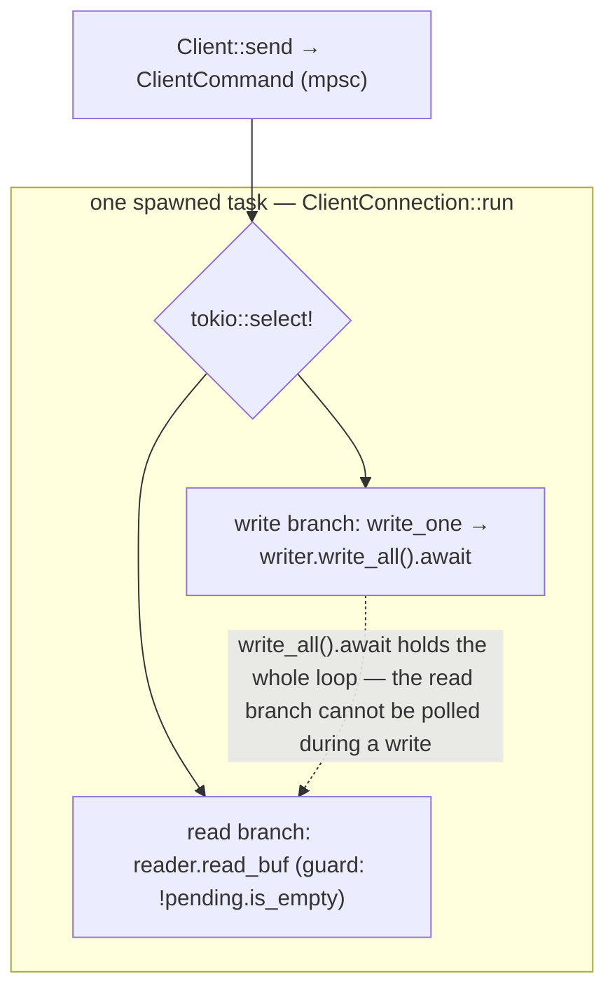
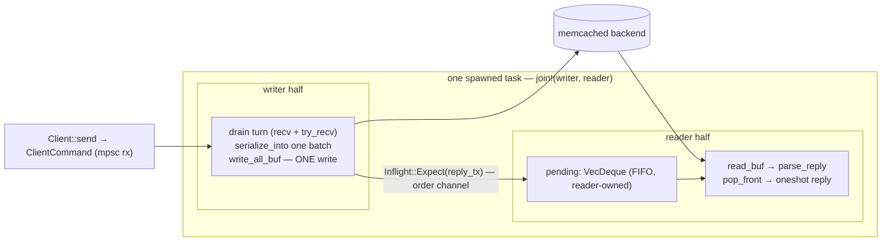
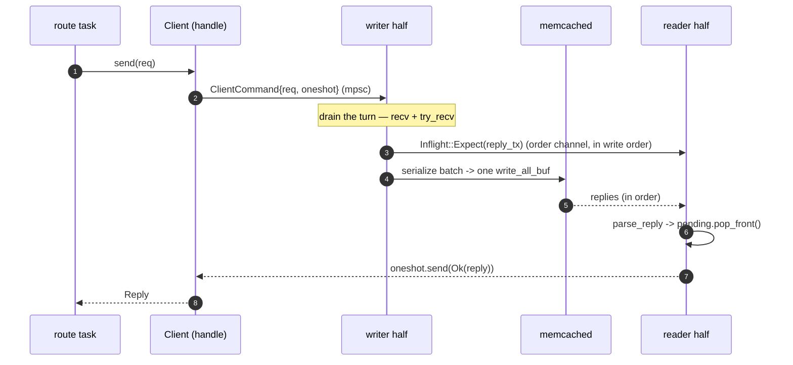

# rusty-mcrouter backend client read/write parallelism (design)

> Status: **Planned**
> Mirrors: [`../mcrouter/backend-client.md`](../mcrouter/backend-client.md) — how mcrouter's `AsyncMcClient` overlaps reads and writes
> Implemented in: [`../architecture/backend-client.md`](../architecture/backend-client.md) — the current as-built (single-loop) client this changes
> Related: [`./threading-model.md`](./threading-model.md) — the proxy layer (`Proxy` + route graph) that calls this client

One focused change to the backend memcache client: make a connection **read and write
concurrently** so a slow/backpressured write never delays reply delivery, and so a turn's
worth of queued requests goes out in one write. Read the
[mcrouter reference](../mcrouter/backend-client.md) and the
[as-built](../architecture/backend-client.md) first — this doc assumes them and only
describes this delta. Citations are by file + symbol (line numbers drift, symbols don't).

---

## goal

Make the backend connection **overlap reads and writes**. Today `ClientConnection::run`
(`rusty-mcrouter-net/src/client/connection.rs`) is a single `tokio::select!` loop whose
write branch awaits `writer.write_all(...)` inline — so while a write is parked on TCP
backpressure the read branch cannot be polled and replies for already-sent requests are
not drained. We want reply delivery that is **never delayed by an in-flight write**, plus
batching of a turn's queued requests into one write.

This is the "write-path head-of-line risk" already named in
[`../architecture/backend-client.md`](../architecture/backend-client.md); mcrouter avoids
it by scheduling writes on a separate event-loop callback. This doc is our equivalent.

---

## scope / non-goals

In scope:

- **decouple the read and write halves** so a blocked write never starves reply draining
- **batch** a turn's queued requests into a single contiguous write
- preserve today's **FIFO reply matching** and **fail-all-on-error** semantics (no `send` ever hangs)

Out of scope here — each is a separate concern with its own future design, listed in the
architecture doc's "what we don't do yet":

- **zero-copy `writev`** — this design uses *contiguous* batching (`serialize_into` →
  one `write_all_buf`). Referencing value `Bytes` via scatter-gather `writev` (a
  `Request::to_iovecs` path) is a later optimization that earns its keep only for large
  values; it deserves its own design doc.
- **`maxInflight` throttle** — today only `max_pending` (the command mpsc capacity) bounds
  the queued-not-written stage; bounding written-but-unreplied is separate.
- **reconnect** — a terminal error still ends the connection for the process's life.
- **per-request timeouts / tombstones**.
- `read_buf` shrinking after a large reply.

---

## starting point (current rusty)

`Client` is a cloneable handle over a bounded `mpsc<ClientCommand>`; one spawned
`ClientConnection` actor owns the split socket and a FIFO `pending` queue
(`rusty-mcrouter-net/src/client/{handle.rs,connection.rs,command.rs}`). The whole thing is
one `select!` in `ClientConnection::run`:



The coupling is `write_one` (`connection.rs`): it `serialize_into`s the request,
`writer.write_all(&self.write_buf).await`, then `pending.push_back(reply_tx)`. Because that
`.await` is inside a `select!` arm, the read branch (`reader.read_buf`, guarded by
`!self.pending.is_empty()`) is starved for the duration of the write. `deliver_replies`
(`parse_reply` → `pending.pop_front()` → `oneshot.send`) and `fail_all_pending` (drain
`pending`, send a cloned `NetError`) are otherwise correct and carry over unchanged.

The limitation: under bidirectional load (a large/slow write while replies arrive) reply
delivery stalls behind the write, and every request costs its own `write_all` syscall (the
`// todo - writev` marker on `write_one`).

---

## target design

Split the connection into a **writer half** and a **reader half** that run concurrently on
the one spawned task, handing reply resolvers writer→reader over an in-order channel. While
the writer is parked on `write_all_buf`, `join!` polls the reader, so replies keep draining.



The `Client` handle, `ClientCommand`, and `Client::send` are unchanged; only
`ClientConnection` is rewritten, still as one `tokio::spawn`.

### 1. split: writer half + reader half

```rust
// in-order handoff from writer to reader
enum Inflight {
    Expect(oneshot::Sender<Result<Reply>>), // a written request awaiting its reply
    Fail(NetError),                          // writer hit a fatal error — fail everything
}

impl ClientConnection {
    pub(crate) async fn run(self) {
        let (read_half, write_half) = self.stream.into_split();
        let (order_tx, order_rx) = mpsc::unbounded_channel::<Inflight>();

        let writer = Writer { writer: write_half, rx: self.rx, order_tx, batch: BytesMut::new() };
        let reader = Reader {
            reader: read_half,
            order_rx,
            pending: VecDeque::new(),
            read_buf: BytesMut::with_capacity(self.read_buf_cap),
        };

        // both run concurrently on this one task: while writer.write_all_buf is Pending,
        // join! polls reader, so writes no longer starve reply delivery.
        tokio::join!(writer.run(), reader.run());
    }
}
```

### 2. the writer: batch a turn, one write

```rust
struct Writer {
    writer: OwnedWriteHalf,
    rx: mpsc::Receiver<ClientCommand>,
    order_tx: mpsc::UnboundedSender<Inflight>,
    batch: BytesMut,
}

impl Writer {
    async fn run(mut self) {
        while let Some(first) = self.rx.recv().await {
            self.batch.clear();
            self.enqueue(first);
            while let Ok(cmd) = self.rx.try_recv() {   // drain a turn's worth
                self.enqueue(cmd);
            }
            if let Err(e) = self.writer.write_all_buf(&mut self.batch).await {
                let _ = self.order_tx.send(Inflight::Fail(NetError::Io(e)));
                return;
            }
        }
        // all Client handles dropped -> order_tx drops -> reader finishes in-flight & exits
    }

    fn enqueue(&mut self, cmd: ClientCommand) {
        cmd.request.serialize_into(&mut self.batch);
        // the resolver reaches the reader BEFORE the write flushes, so it is always
        // in `pending` before the matching reply can arrive
        let _ = self.order_tx.send(Inflight::Expect(cmd.reply_tx));
    }
}
```

### 3. the reader: own the FIFO, never block on writes

```rust
struct Reader {
    reader: OwnedReadHalf,
    order_rx: mpsc::UnboundedReceiver<Inflight>,
    pending: VecDeque<oneshot::Sender<Result<Reply>>>,
    read_buf: BytesMut,
}

impl Reader {
    async fn run(mut self) {
        let mut writer_done = false;
        loop {
            if writer_done && self.pending.is_empty() {
                return; // writer gone, nothing outstanding -> clean exit
            }
            tokio::select! {
                slot = self.order_rx.recv(), if !writer_done => match slot {
                    Some(Inflight::Expect(tx)) => self.pending.push_back(tx),
                    Some(Inflight::Fail(e))    => { self.fail_all(e); return; }
                    None                       => writer_done = true,
                },
                res = self.reader.read_buf(&mut self.read_buf), if !self.pending.is_empty() => {
                    match res {
                        Ok(0)  => { self.fail_all(unexpected_eof()); return; }
                        Ok(_)  => if let Err(e) = self.deliver() { self.fail_all(e); return; }
                        Err(e) => { self.fail_all(NetError::Io(e)); return; }
                    }
                }
            }
        }
    }
    // deliver() and fail_all() carry over unchanged from today:
    //   deliver:  while parse_reply(&mut read_buf)? { pending.pop_front()?.send(Ok(reply)) }
    //   fail_all: for tx in pending.drain(..) { tx.send(Err(e.clone())) }
}
```

### the key invariants

- **Ordering.** `enqueue` sends `Inflight::Expect` *before* the batch flushes, and the
  reader drains the order channel in the same `select!` it reads from — so a resolver is
  always in `pending` before its reply can land. FIFO holds because both the order channel
  and the socket carry requests in write order (the same argument as `tokio-postgres`'s
  single-mailbox + local response queue).
- **Fail-all.** Writer→reader failures travel as `Inflight::Fail`; reader-side errors fail
  the reader's own `pending` with the specific cloned `NetError`. Anything still queued when
  a half drops (commands in `rx`, slots in the order channel) drops its `oneshot`, so those
  callers get `ClientClosed` — same as today. `NetError`'s hand-rolled `Clone`
  (`net/src/lib.rs`) is what lets one error fan out to every waiter.
- **Prompt teardown (hardening).** With `join!`, a *read*-side failure does not stop the
  writer until its next failed write. To make teardown prompt and preserve the specific
  error on both sides, add a `tokio_util::sync::CancellationToken` (or a small shared flag)
  both halves select on. This is the one production hardening beyond the core.

### how this maps to mcrouter

| mcrouter | rusty (this design) |
|---|---|
| writer is a separate `runInLoop` callback (`scheduleNextWriterLoop`) | `writer` half driven concurrently by `tokio::join!` |
| `pushMessages` coalesces a turn into one write | `try_recv` drain → one `write_all_buf` (contiguous; `writev` deferred) |
| ASCII FIFO reply matching | reader-owned `pending: VecDeque` + `pop_front` |
| `failAllSent` / `failAllPending` | `fail_all` + `Inflight::Fail` + dropped-`oneshot` → `ClientClosed` |
| request context lives until the async **write-completion callback** | frames live across `write_all_buf().await`; completion *is* the await — **no `REPLIED_QUEUE`** |

The await-based write is why we keep a single `pending` queue rather than mcrouter's
four-queue state machine: there is no window between "reply arrived" and "write confirmed,"
because the write is confirmed when `write_all_buf` returns. (mcrouter's extra queues exist
for zero-copy `writev`, `maxInflight`, reconnect, and timeouts — all out of scope here.)

---

## full request lifecycle (target)



---

## implementation order

1. **Add `Inflight` + the order channel; split `run` into `Writer`/`Reader`.**
   Behavior-preserving first step: keep one request per turn (no batching), prove the
   `join!` decoupling and FIFO are correct.
2. **Batch the writer** — `try_recv` drain into one `write_all_buf` per turn.
3. **Fail-all coordination** — `Inflight::Fail` + the `CancellationToken` for prompt,
   specific-error teardown when either half dies.

(Zero-copy `writev`, `maxInflight`, reconnect, and timeouts are separate follow-ups — see
out of scope.)

---

## open questions / decisions

- **Order channel: unbounded vs bounded.** Unbounded avoids writer→reader backpressure
  deadlock and is implicitly bounded by `max_pending` in-flight; a bounded channel adds a
  second backpressure point. Lean unbounded.
- **Teardown: `CancellationToken` vs drop-based.** Drop-based is simpler but downgrades
  every in-flight error to `ClientClosed`; the token preserves the specific `NetError`.
- **Batch cap.** Whether to cap the `try_recv` drain by accumulated bytes (mcrouter flushes
  at 24KB) or let it drain the whole turn.

---

## done when

- A slow/blocked write no longer delays reply delivery (test: `pipelining_mock_backend` with
  a stalled write while replies are pending).
- N pipelined requests on one connection go out in one `write_all_buf`.
- FIFO matching and fail-all are preserved; no `send` future ever hangs.
- `lsp_diagnostics` / `clippy` clean, with tests for concurrent read/write and
  fail-all-on-error.
