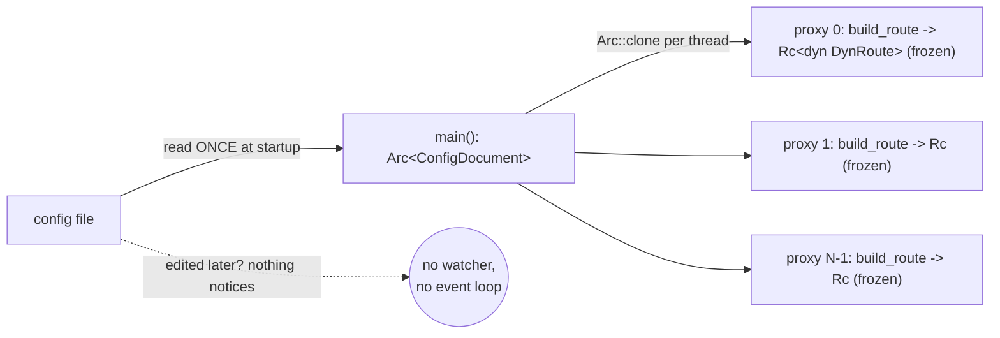
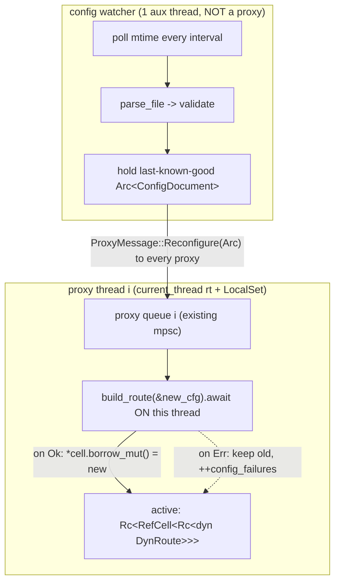

# rusty-mcrouter config reload (design)

> Status: **Proposed (2026-06-12)**
> Mirrors: [`../mcrouter/config-reload.md`](../mcrouter/config-reload.md) — how mcrouter does it (`ConfigApi`, `configThreadRun`, `OLD_CONFIG` swap)
> Implemented in: `../architecture/config-reload.md` (once built; **nothing exists yet** — see [`../architecture/overview.md`](../architecture/overview.md))
> Related: [`./threading-model.md`](./threading-model.md) (the per-thread route graph + the proxy actor/queue this swap rides on), [`./observability.md`](./observability.md) (the `config_age`/`config_failures` counters this produces), and the **eager-connect** `// todo` in `route_builder.rs:135` (which reload turns from a nuisance into a correctness problem — see §6).

Give rusty-mcrouter the ability to **reload its routing config without a
restart**: watch the config file, parse + validate a change off the hot path,
rebuild each proxy thread's route graph, and **swap it under live traffic** —
keeping existing connections and in-flight requests intact, and keeping the old
config serving if the new one is bad. Read the
[mcrouter reference](../mcrouter/config-reload.md) first; this doc assumes it and
only describes our side.

---

## tl;dr

- Today the config is read **exactly once**, at startup:
  `Arc::new(parse_file(&args.config)?)` (`main.rs:84`). After that it is
  immutable for the life of the process; there is no watcher, no event loop on
  the main thread (it just `join`s the proxy threads, `main.rs:177`), and
  `ProxyMessage` has only `Request`/`Shutdown` (`message.rs:4`) — **no reload
  path at all**. Changing config means a full restart (and a dropped listener).
- The hard part is **not** noticing the file changed; it's the swap. The route
  graph is a **thread-local `Rc<dyn DynRoute>`** (`!Send`), built **per proxy
  thread** (`thread.rs:70`) and owned *by value* in both `Proxy` (`proxy.rs:12`)
  and `ConnectionWorker` (`worker.rs:14`). It cannot be built once and shared, and
  it cannot be swapped from another thread.
- So reload is a **per-thread rebuild**, mirroring mcrouter: an auxiliary
  **config watcher thread** detects the change, parses + validates once, and
  broadcasts the new `Arc<ConfigDocument>` to every proxy via a new
  `ProxyMessage::Reconfigure`. Each proxy runs `build_route` **on its own thread**
  and swaps its graph behind an `Rc<RefCell<Rc<dyn DynRoute>>>` cell shared by its
  `Proxy` + `ConnectionWorker` + live `Connection`s.
- **No dropped traffic.** In-flight requests already hold an `Rc` clone of the old
  graph and finish on it; the old graph (and its backend `Client`s) is freed the
  instant the last in-flight request drops its clone — Rust's `Rc` refcount *is*
  mcrouter's `OLD_CONFIG` "free the old config on the proxy thread," for free.
- **No bad config takes down a good one.** The watcher keeps the last config that
  parsed; a malformed file is logged and ignored, traffic continues on the live
  graph (mcrouter's last-known-good).
- **One honest entanglement.** `build_route` *eagerly connects every backend*
  (`route_builder.rs:135` `// todo - eager connect ... should become lazy`), so a
  rebuild reconnects all destinations and can fail at connect time. That makes
  "validate before swap" and "swap is instant" both depend on the lazy-connect
  refactor (§6). We ship reload on top of eager-connect first, then make it clean.

---

## goal

`kill -0` stays unnecessary: an operator edits the config file on disk and, within
a poll interval, every proxy thread is routing on the new graph — listener never
closed, open connections never dropped, in-flight requests never lost. A config
that fails to parse (or fails to build) leaves the running config untouched and is
surfaced as a failure count, not a crash.

## scope / non-goals

In scope:

- a **config watcher** (auxiliary, non-proxy thread): file-mtime polling, parse,
  last-known-good retention, broadcast on change;
- `ProxyMessage::Reconfigure(Arc<ConfigDocument>)` + the per-proxy handler that
  rebuilds and swaps;
- the **swap seam**: route graph behind a shared `Rc<RefCell<…>>` cell, read
  *current* per request so live connections adopt the new graph;
- graceful old-graph teardown via `Rc` refcount (no explicit free message needed);
- `config_age` / `config_last_success` / `config_failures` counters (lands with
  [`./observability.md`](./observability.md)).

Out of scope here (deferred; the design leaves a seam for each):

- **inotify/`notify`-based watching** — mtime polling first (no new dep, matches
  mcrouter's fallback path); event-driven watch is a later swap-in behind the same
  watcher interface (mcrouter prefers inotify, §[ref 2](../mcrouter/config-reload.md)).
- **`@import` / preprocessing / macros** — rusty config is a single JSONC file
  (`config/lib.rs:29`); no import graph to track. (mcrouter's `ConfigPreprocessor`.)
- **on-disk last-known-good dump for cold start** (`config_dump_root`,
  `max_dumped_config_age`) — we keep LKG *in memory* only; crash-recovery dump is
  a later add.
- **SIGHUP / an admin `reload` command** — there is no admin surface yet (the
  parser rejects unknown commands); wire reload to the file first, add triggers
  with the admin work.
- **inline `--config-str`** — reload is meaningful only for a file source; an
  inline config has nothing to watch (mcrouter treats it the same).
- **multi-source / remote config backends** (mcrouter's `ConfigApiIf`
  abstraction) — rusty has exactly one source: a local file.

---

## starting point (current rusty)

Full as-built detail belongs in `../architecture/config-reload.md`; summarized
here only to frame the change. **There is no reload today** — the config is a
write-once `Arc`:

```rust
// main.rs:84 — parsed once, in synchronous main(), before any thread spawns
let config = Arc::new(parse_file(&args.config)?);
// ... main.rs:123 — each proxy thread gets a read-only clone of the same Arc
let cfg = ProxyThreadConfig { proxy_id, config: Arc::clone(&config), /* ... */ };
// ... main.rs:177 — then main just blocks forever joining the threads
for handle in handles { let _ = handle.join(); }
```

The facts that shape the design:

- **`--config` is a file path** (`PathBuf`, `main.rs:27`) — good, a file is
  watchable. There is no inline-config flag.
- **`main` is synchronous and has no event loop** (`main.rs:56`); after the
  startup handshake it does nothing but `join`. So there is **no home today for a
  watcher** — we have to add one (an auxiliary thread, as mcrouter does).
- **Each proxy thread builds its own graph** (`thread.rs:70`):
  ```rust
  let route = build_route(&config).await?;   // Rc<dyn DynRoute>, !Send, thread-local
  ```
  and then hands an `Rc::clone` to two long-lived owners on that thread:
  ```rust
  let proxy = Proxy { id: proxy_id, route: Rc::clone(&route), rx: proxy_rx }; // proxy.rs:12
  let worker = ConnectionWorker::new(proxy_id, route, proxies, mode, work_rx); // worker.rs:14
  ```
- **A connection captures the graph at accept time** (`worker.rs:51`):
  ```rust
  let connection = Connection::new(stream, self.current_id,
      Rc::clone(&self.local_route), /* ... */);   // snapshot for the connection's life
  ```
  So even if we swapped `ConnectionWorker.local_route`, **already-open connections
  would keep routing on the graph they captured.** Reaching live connections is a
  real requirement, not a freebie (§target design #4).
- **`ProxyMessage` has no control verb for this** (`message.rs:4`):
  ```rust
  pub enum ProxyMessage { Request(ProxyRequest), Shutdown }
  ```
  The proxy actor already drains this queue (`proxy.rs:18`) and `ProxyHandle`
  already sends control messages (`handle.rs:40`, `Shutdown`) — so the queue is
  the natural carrier for a reconfigure, exactly as mcrouter posts control
  messages (`OLD_CONFIG`, `SHUTDOWN`) on the same proxy queue as requests.
- **`build_route` is `async` and eagerly connects** (`route_builder.rs:47`,
  `:135`):
  ```rust
  // todo - this is an eager connect and will fail if any backend is down, this should become lazy
  let client = Client::connect(server.as_str()).await?;
  ```
  and its `pool_cache` is **per-build** (`route_builder.rs:59`), so a rebuild
  shares nothing with the previous graph — every reload reconnects every backend,
  on every thread. This is the entanglement called out in the tl;dr (§6).



---

## target design

Three pieces, each mapped onto mcrouter: a **watcher** (`ConfigApi` +
`configThreadRun`), a **broadcast** (`subscribeToConfigUpdate` → per-proxy
message), and a **per-thread swap** (`proxy_config_swap` + `OLD_CONFIG`).



### 1. the config watcher (the `ConfigApi` + config-thread analogue)

A dedicated **non-proxy** OS thread, spawned by `main` after the proxy threads
report ready (so it never races startup, and the `READY {addr}` contract at
`main.rs:167` is untouched). It owns the file path, the last-known-good config,
and the set of `ProxyHandle`s to broadcast to:

```rust
// new: rusty-mcrouter/src/config_watcher.rs
struct ConfigWatcher {
    path: PathBuf,
    proxies: ProxySet,                 // broadcast target (clone of main's)
    current: Arc<ConfigDocument>,      // last-known-good
    last_mtime: SystemTime,
    interval: Duration,                // --reconfiguration-interval-ms
}

impl ConfigWatcher {
    fn run(mut self) {
        loop {
            std::thread::sleep(self.interval);
            let Some(mtime) = changed(&self.path, self.last_mtime) else { continue };
            match parse_file(&self.path) {
                Ok(doc) => {
                    self.last_mtime = mtime;
                    self.current = Arc::new(doc);            // promote to last-known-good
                    self.proxies.broadcast_reconfigure(Arc::clone(&self.current));
                    // stat: config_last_success = now
                }
                Err(e) => {
                    self.last_mtime = mtime;                 // don't re-attempt the same bad file
                    // warn!(target: "config", error = %e, "reload rejected; keeping live config");
                    // stat: config_failures += 1
                }
            }
        }
    }
}
```

mtime polling (not inotify) is the deliberate first cut: zero new dependencies,
and it's exactly mcrouter's *fallback* path when inotify is unavailable
([ref §2](../mcrouter/config-reload.md)). A `notify`-backed watcher can replace
the poll behind this same interface later.

### 2. `ProxyMessage::Reconfigure` — the broadcast (our `OLD_CONFIG` cousin)

Add one control verb to the existing per-proxy queue — no new channel, no new
plumbing on the proxy side:

```rust
// message.rs
pub enum ProxyMessage {
    Request(ProxyRequest),
    Reconfigure(Arc<ConfigDocument>),   // NEW
    Shutdown,
}
```

```rust
// handle.rs — broadcast helper on ProxySet
impl ProxySet {
    pub async fn broadcast_reconfigure(&self, cfg: Arc<ConfigDocument>) {
        for p in &self.proxies {
            let _ = p.tx.send(ProxyMessage::Reconfigure(Arc::clone(&cfg))).await;
        }
    }
}
```

`Arc<ConfigDocument>` is `Send` (it's `Arc` over plain data), so it crosses the
thread boundary cleanly — same property that lets `Request` cross today. The
**route graph never crosses**; only the *config* does, and each thread builds its
own graph from it — identical to mcrouter, where the request/config travels and
the per-proxy route tree is rebuilt locally.

### 3. the swap seam: `Rc<RefCell<Rc<dyn DynRoute>>>`

The graph must become swappable by the thread that owns it. Today `Proxy` and
`ConnectionWorker` each hold an `Rc<dyn DynRoute>` *by value*; instead they share
**one cell**:

```rust
// thread.rs — build once, wrap in a shared, swappable cell
type ActiveRoute = Rc<RefCell<Rc<dyn DynRoute>>>;
let active: ActiveRoute = Rc::new(RefCell::new(build_route(&config).await?));

let proxy  = Proxy { id: proxy_id, active: Rc::clone(&active), rx: proxy_rx };
let worker = ConnectionWorker::new(proxy_id, Rc::clone(&active), proxies, mode, work_rx);
```

The proxy actor owns the reconfigure handler (it already drains `proxy_rx`):

```rust
// proxy.rs — Proxy::run, new arm
ProxyMessage::Reconfigure(cfg) => {
    match build_route(&cfg).await {                 // rebuild ON this proxy thread
        Ok(new_route) => {
            *self.active.borrow_mut() = new_route;  // swap: a single Rc pointer store
            // info!(target: "config", proxy = self.id, "reconfigured");
        }
        Err(e) => {
            // warn!(...): keep the old graph; this thread stays on last-good
            // stat: config_failures += 1
        }
    }
}
```

No lock, no atomic: the cell is touched only by its owning thread (the swap, and
every per-request read), so `RefCell` is exactly right and `Rc` is exactly right.
This is the single-threaded analogue of mcrouter's `Proxy::swapConfig()` under
`configLock_` — we get the lock for free because there's only one writer.

### 4. read *current* per request (so live connections adopt the new graph)

The one behavioral change that costs anything: a `Connection` must stop holding a
frozen `Rc` snapshot and instead read the cell **when it routes each request**.

```rust
// connection.rs / worker.rs — Connection holds the cell, not a snapshot
// at the point a request is dispatched (the same-thread route path):
let route = self.active.borrow().clone();   // cheap Rc clone of the CURRENT graph
// ... route.route_dyn(req).await
```

A request started just before a swap clones the old graph and finishes on it; the
very next request on the same connection clones the new graph. Per-request
independence makes this safe, and reply ordering is unaffected — `flush_ready`'s
`seq` reorder buffer (see [`./threading-model.md`](./threading-model.md)) doesn't
care which graph produced a given reply. This mirrors mcrouter pinning a
`shared_ptr<const ProxyConfig>` per request: old requests keep the old config,
new requests get the new one.

> **Decision: read-current-per-request, not capture-at-accept.** Capturing at
> accept (today's `worker.rs:51`) is simpler but means a long-lived connection
> never sees a new config until it reconnects — unacceptable for a router whose
> clients hold persistent connections. The cost is one `Rc` clone (a refcount
> bump) per request; negligible against a backend round-trip.

### 5. old graph teardown = `Rc` refcount (the `OLD_CONFIG` analogue, for free)

When `*active.borrow_mut() = new_route` runs, the cell drops its reference to the
old graph. But every in-flight request that already did `borrow().clone()` still
holds one. The old `Rc<dyn DynRoute>` — and the `DestinationRoute`s and backend
`Client`s inside it — is freed **exactly when the last in-flight request
completes** and drops its clone. When the old `Client`s drop, their
`ClientConnection` actors see the command channel close and exit after draining
(see [`../architecture/backend-client.md`](../architecture/backend-client.md)).

That is precisely mcrouter's `OLD_CONFIG` guarantee — "free the old config on the
proxy thread, after in-flight work finishes" — except we don't need a message for
it: it's single-threaded `Rc` drop semantics. No `OLD_CONFIG` verb required.

```mermaid
sequenceDiagram
  participant W as config watcher
  participant Pi as proxy i actor
  participant C as live connection (thread i)
  participant Gold as graph v1 (Rc)
  participant Gnew as graph v2 (Rc)
  W->>Pi: Reconfigure(Arc<ConfigDocument v2>)
  Pi->>Pi: build_route(v2).await -> Gnew
  Note over C,Gold: a request already cloned Gold; still routing on it
  Pi->>Pi: *active.borrow_mut() = Gnew
  C->>Gnew: next request clones CURRENT -> v2
  Gold-->>Gold: last in-flight req drops its Rc -> v1 freed (clients close)
```

### 6. validation + last-known-good (and the eager-connect entanglement)

Two layers of "don't serve garbage":

- **Parse-level validation, in the watcher (now).** `parse_file` already rejects
  malformed JSONC and structural errors (`ConfigError::{MissingRoute,
  BothRouteAndRoutes}`, `lib.rs:20-24`). A file that fails to parse never becomes
  last-known-good and is never broadcast — traffic continues on the live config.
- **Build-level validation, per proxy (now, imperfect).** A broadcast config can
  still fail `build_route` on a given thread — most likely because
  **`build_route` eagerly connects every backend** (`route_builder.rs:135`). If a
  backend is down at reload time, that thread's rebuild fails; we **keep its old
  graph** and bump `config_failures`. The hazard: threads can disagree (some
  swapped, some kept old) if a backend is flaky during the reload window. We
  accept this *and surface it* (per-proxy `config_failures`) for the first cut.

> **The clean fix is the lazy-connect refactor** already flagged at
> `route_builder.rs:135`. Split `build_route` into a **structural build** (no I/O,
> can't fail on a down backend) plus **lazy/background connect**. Then: the
> watcher can fully validate structurally before broadcasting; the per-thread swap
> becomes connect-free and effectively instant; and a reload can't half-adopt. The
> eager connect is tolerable without reload; **with** reload it becomes the thing
> worth fixing next. (It also removes the "every reload reconnects N_threads ×
> servers backends" cost — see [`./threading-model.md`](./threading-model.md)'s
> shared-nothing note: each thread opens its own connections.)

---

## how this maps to mcrouter

| mcrouter | rusty |
|---|---|
| `ConfigApiIf` (multi-source abstraction) | a single file source (no abstraction yet) |
| `ConfigApi::configThread_` / `configThreadRun` | the `ConfigWatcher` OS thread (auxiliary, non-proxy) |
| `FileDataProvider::hasUpdate` (inotify) + MD5 fallback | mtime poll now; `notify` (inotify/FSEvents) later behind the same seam |
| `reconfiguration_delay_ms` | `--reconfiguration-interval-ms` (poll period) |
| `subscribeToConfigUpdate` → `reconfigure` → `configure` | watcher → `broadcast_reconfigure` → per-proxy `Reconfigure` handler |
| `ProxyConfigBuilder` → `ProxyConfig<RouterInfo>` | `build_route(&ConfigDocument)` → `Rc<dyn DynRoute>` |
| build **all** new configs, then swap | each proxy builds its own graph on receiving `Reconfigure`, then swaps |
| `Proxy::swapConfig` under `configLock_` | `*active.borrow_mut() = new` (single-thread; no lock needed) |
| in-flight pin: `shared_ptr<const ProxyConfig>` | in-flight pin: `Rc<dyn DynRoute>` clone per request |
| `ProxyMessage::Type::OLD_CONFIG` (free old on the proxy thread) | old `Rc` dropped when the last in-flight request finishes (automatic) |
| `--validate-config` (dry-run gate) | parse-validate in the watcher; per-proxy build keeps old on failure |
| last-known-good + `config_dump_root` on disk | in-memory last-known-good (disk dump deferred) |
| `ConfigPreprocessor` / `@import` | none (single JSONC file) |
| `config_age` / `config_last_success` / `config_failures` | same counters (with [`./observability.md`](./observability.md)) |
| reload triggers: file watch / SIGHUP / admin | file watch now; SIGHUP + admin deferred |

---

## implementation order

1. **The swap seam, behavior-preserving.** Introduce
   `ActiveRoute = Rc<RefCell<Rc<dyn DynRoute>>>`; build it once in `thread.rs`,
   share it with `Proxy` + `ConnectionWorker`, and make `Connection` read the cell
   per request (§4) instead of capturing at accept. No reload yet. Test: a manual
   swap of the cell changes routing for an already-open connection.
2. **`ProxyMessage::Reconfigure` + the handler.** Add the verb (`message.rs`) and
   the `Proxy::run` arm that rebuilds on its own thread and swaps on success /
   keeps-old on failure (§2, §3). Drive it from a test (no watcher yet): send
   `Reconfigure` with a config that routes differently and assert the swap.
3. **The watcher thread.** Add `config_watcher.rs`: mtime poll, `parse_file`,
   last-known-good, `broadcast_reconfigure`; spawn it from `main` after the
   readiness handshake; add `--reconfiguration-interval-ms`. Test end-to-end:
   rewrite a temp config file, assert routing changes; write a broken file, assert
   it's ignored and the old routing persists.
4. **Counters + logging.** `config_age` / `config_last_success` /
   `config_failures` and structured reload events (rides on
   [`./observability.md`](./observability.md)).
5. **(Enabler) lazy-connect refactor of `build_route`** (`route_builder.rs:135`)
   so reload validates structurally without reconnecting and can't half-adopt
   (§6). Tracked as its own change; this design works without it but is cleaner
   with it.
6. **Docs.** Write `../architecture/config-reload.md` (as-built) and flip this
   doc's status to Implemented.

Steps 1–2 are local, testable, and reload-free; step 3 turns it on; 5 is the
quality upgrade. The watcher (3) and the swap (1–2) are independent enough to land
in either order.

---

## open questions / decisions

- **mtime poll vs `notify` (decided: poll first).** No new dependency, portable,
  and it *is* mcrouter's fallback. Revisit if poll latency or wakeup cost matters;
  `notify` slots in behind the watcher interface.
- **Read-current-per-request vs capture-at-accept (decided: per-request).** Live
  connections must adopt new config; the cost is one `Rc` clone per request (§4).
- **Per-thread build failure / partial adoption (accepted, surfaced).** With eager
  connect, one thread can keep old while others swap if a backend is flaky during
  the reload. Acceptable for the first cut **iff** `config_failures` makes it
  visible; the lazy-connect refactor (§6) removes the failure mode.
- **Reconfigure shares the bounded `proxy_rx` with requests.** A saturated queue
  could delay a reload behind 1024 queued requests (`PROXY_CHANNEL_CAPACITY`,
  `main.rs:18`). Reload is rare, so acceptable; a dedicated control channel is the
  alternative if reload latency ever matters.
- **No global atomicity across threads (decided: per-thread eventual).** Threads
  swap independently as they drain their queues, so for a brief window different
  proxies route on different configs. mcrouter is also per-proxy; accepted.
- **Old-graph lifetime vs a stuck request (noted).** With no per-request timeout
  yet (the Tier-1 reliability gap), a hung in-flight request keeps the *old* graph
  (and its backend connections) alive indefinitely. Reload makes the missing
  timeout more visible; tracked with the backend-client work.
- **`--config-str` inline configs (decided: no reload).** Nothing to watch; reload
  is a file-source feature, as in mcrouter.
- **Trigger surface (deferred).** SIGHUP and an admin `reload`/`config_age`
  command wait for the admin surface (the parser rejects unknown commands today).

---

## done when

- Editing the config file on disk causes **every** proxy thread to rebuild and
  swap its route graph within one poll interval — the listener is never closed and
  open connections are never dropped.
- A request **in flight across a swap** completes on the graph it started on, and
  the next request on that connection uses the new graph (read-current-per-request
  verified by test).
- A malformed or unbuildable config is **rejected**: the watcher logs it, keeps
  the last-known-good, `config_failures` increments, and traffic continues on the
  live graph — no crash, no partial teardown of a working proxy.
- The old route graph (and its backend `Client`s/connections) is freed **only
  after** the in-flight requests that captured it finish (`Rc` drop), with no
  explicit free message.
- The watcher is a dedicated **non-proxy** thread; `main`'s startup handshake and
  the `READY {addr}` stdout contract (`main.rs:167`) are unchanged.
- `lsp_diagnostics` / clippy clean; tests cover swap-visible-to-a-live-connection,
  reject-bad-config-keeps-old, and reconfigure-reaches-all-proxies;
  `../architecture/config-reload.md` is written and this doc is flipped to
  Implemented.
