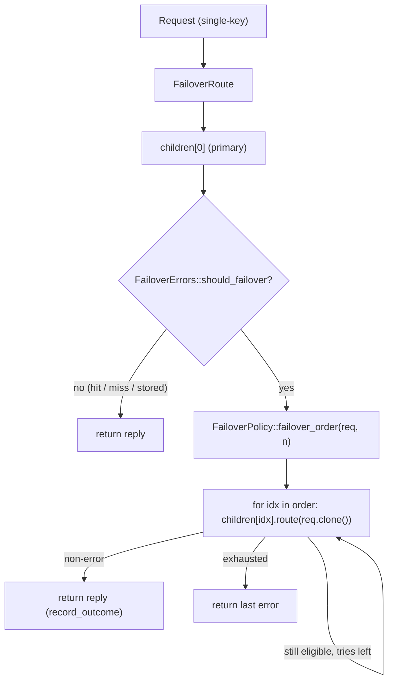
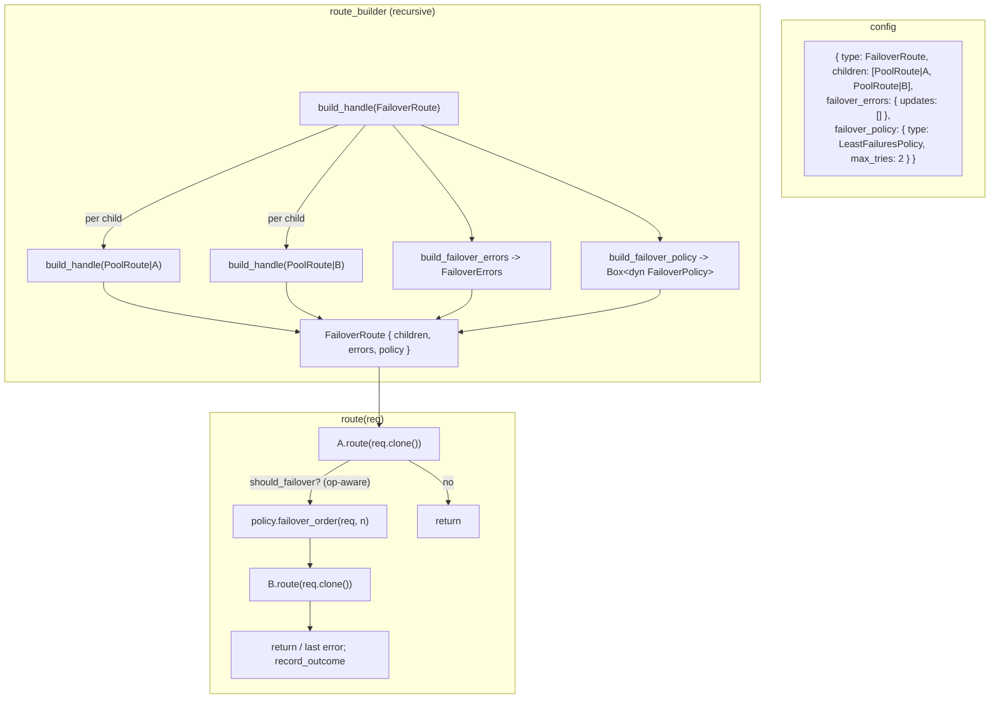

# rusty-mcrouter failover routes (design)

> Status: **Draft**
> Mirrors: [`../mcrouter/failover.md`](../mcrouter/failover.md) — how mcrouter does it (`FailoverRoute` tries children in a `FailoverPolicy` order on a *failover-eligible* result decided by `FailoverErrorsSettings`; `FailoverWithExptimeRoute` caps the backup TTL; `FailoverRateLimiter` caps the spill)
> Implemented in: `../architecture/failover.md` — the as-built record (written when this ships; does not exist yet)
> Builds on: [`./timeouts.md`](./timeouts.md) — **the prerequisite.** Failover *consumes* the classified error that timeouts *produce*: `NetError::Timeout { phase }` already rides `RouteError::Backend` to the route tree ([`../architecture/timeouts.md`](../architecture/timeouts.md) "the failover seam"). Also [`./hash-routing.md`](./hash-routing.md) — this doc **reuses its framework playbook** (`Selector` trait + `build_selector` dispatch → `FailoverPolicy` trait + `build_failover_policy` dispatch), a `FailoverRoute`'s children are usually `PoolRoute`s, and its [§11 "future seam"](./hash-routing.md#11-the-future-seam-how-new-strategies-slot-in) *anticipated* this route's key-derived policies (the deferred `RankedSelector`). And [`./multiget.md`](./multiget.md) — the routed `Request` is single-key, so failover re-sends one key at a time.
> Unblocks: **`FailoverWithExptimeRoute` / key-derived policies / rate limiting / TKO** — each an additive impl behind the two traits/config this doc lands (see [§10](#10-the-future-seams)).

Give the route tree a **second chance** — but build the *framework*, not a hardcoded
retry. A `FailoverRoute` composes three orthogonal pieces, exactly as mcrouter
separates them: an ordered list of **children**, a **`FailoverPolicy`** that decides
*which* backups to try and in *what order*, and a **`FailoverErrors`** classifier
that decides *which* replies are worth retrying — **customizable per operation
type**. The loop itself is ~15 lines; the deliverable is the two pluggable
abstractions, so dropping in a new ordering policy (least-failures, deterministic,
rendezvous) or a new per-op error rule is an additive impl, not a rewrite — the same
lesson [`./hash-routing.md`](./hash-routing.md) learned with `Selector`. The
rusty-specific subtlety: mcrouter classifies on one `carbon::Result` code, but rusty
splits failures across **two** surfaces — transport failures are `Err(RouteError)`,
a backend that answered `SERVER_ERROR` is `Ok(Reply::ServerError)` — so the
classifier spans **both** arms of `Result<Reply>`. Read the
[mcrouter reference](../mcrouter/failover.md) first; this doc assumes it.

---

## tl;dr

- **Today `FailoverRoute` is unbuildable.** Both config forms resolve to
  `BuildError::RouteTypeNotImplemented { kind: "FailoverRoute" }`
  (`rusty-mcrouter-core/src/route_builder.rs`): the object form parses to
  `RouteHandleConfig::Unknown` and the builder rejects it; the shorthand likewise.
  Two tests lock this (`errors_on_unknown_object_route_type`,
  `errors_on_unknown_shorthand_kind`). This design flips the object form on.
- **The deliverable is a framework, not a loop** — mirroring
  [`./hash-routing.md`](./hash-routing.md)'s "the abstraction, not just the first
  hash, is the deliverable." A `FailoverRoute` holds
  `children: Vec<Rc<dyn DynRoute>>` + `errors: FailoverErrors` +
  `policy: Box<dyn FailoverPolicy>`. Two seams, both pluggable from config.
- **`FailoverPolicy` is a trait** (`Box<dyn FailoverPolicy>`, the direct analogue of
  `Box<dyn Selector>`): `failover_order(&self, &Request, n) -> Vec<usize>` yields the
  backup order, `record_outcome(&self, child, failed)` lets **stateful** policies
  adapt. Two impls ship now — **`InOrderPolicy`** (stateless, config order) and
  **`LeastFailuresPolicy`** (stateful, `RefCell<Vec<u32>>` failure counters + a
  `max_tries` budget) — precisely to prove the trait carries a stateful policy, the
  way `Crc32` alongside `Ch3` proved the `Selector` framework. `DeterministicOrder` /
  `Rendezvous` are future impls that slot in with **zero** changes to the route.
- **`failover_errors` customization is in scope, not deferred.** A `FailoverErrors`
  value classifies **per operation class** (`gets` / `updates` / `deletes`), array or
  object config, each list defaulting to the built-in classifier when omitted —
  mcrouter's `FailoverErrorsSettings`. This is the **idempotency lever**:
  `"updates": []` stops non-idempotent writes from double-applying on failover.
- **Classification is one boolean over two surfaces (the rusty-specific core).**
  `is_failover_error(&Result<Reply>) -> bool`: a transport `Err`
  (`Timeout`/`Io`/`Protocol`/`ClientClosed`) or the backend-reported
  `Ok(Reply::ServerError)` fails over; a **miss** (`Ok(Reply::NotFound)` / empty `Get`),
  a client error (`Reply::Error`/`ClientError`), and an internal `SelectorOutOfRange`
  bug do **not** — exactly as mcrouter treats `NOTFOUND` as a valid reply. Per-op
  `failover_errors` customization layers on top by *naming* the conditions (one
  `FailoverErrorKind` enum); the default path is just this boolean.
- **`FailoverRoute` is the first route with route-handle children**, so `build_handle`
  **recurses** to build each child (async recursion → box the call), and a
  `build_failover_policy` / `build_failover_errors` pair dispatches the config, the
  twin of `build_selector`. Object form only (a children list can't be pipe-encoded).
- **Deferred, each behind these seams** ([§10](#10-the-future-seams)):
  `FailoverWithExptimeRoute` (needs a `ModifyExptimeRoute`), the key-derived policies
  (`DeterministicOrder`/`Rendezvous` — the concrete home of hash-routing's [`RankedSelector`](./hash-routing.md#11-the-future-seam-how-new-strategies-slot-in)),
  `FailoverRateLimiter`, TKO, and lease pairing. None touch the core loop.

---

## goal

A request routed to a `FailoverRoute` returns the primary child's reply unless it's a
failover error, in which case the **same request** is retried against the backups in
the **policy's** order — bounded by the policy's try budget — returning the first
non-error reply or the last error. Both variation axes are **pluggable and
config-driven**: adding an ordering policy is a new `FailoverPolicy` impl + one
builder arm (no change to the route, the classifier, or any call site), and adding or
restricting the failover-eligible errors is a config value, per operation class.
Placement is compiler-safe (children are `Rc<dyn DynRoute>` built by recursing the
existing builder), and the deferred family (exptime cap, rate limit, key-derived
policies, TKO) is additive by construction.

## scope / non-goals

In scope — the framework and enough concrete impls to prove it:

- the `FailoverRoute` handle (`children` + `FailoverErrors` + `Box<dyn FailoverPolicy>`)
  and its compose-both-abstractions loop;
- the **`FailoverPolicy` trait** + **`InOrderPolicy`** (stateless) + **`LeastFailuresPolicy`**
  (stateful, interior-mutable counters, `max_tries`);
- **`FailoverErrors`** — the default two-surface classifier (`is_failover_error`) plus
  optional per-op `failover_errors` customization (one `FailoverErrorKind` enum);
- config: `RouteHandleConfig::FailoverRoute { children, failover_errors, failover_policy }`
  — recursive `children` (object form only), `failover_errors` array/object,
  `failover_policy` `{ type, max_tries }`, defaults matching mcrouter;
- **recursive** `build_handle` + `build_failover_policy` / `build_failover_errors`
  dispatch (the `build_selector` twin), plus an empty-children build guard;
- updating the two tests that lock `RouteTypeNotImplemented { kind: "FailoverRoute" }`;
- socket-free routing tests (both surfaces trigger failover; miss does not; policy
  ordering; least-failures adapts across requests; per-op `failover_errors`) + an
  end-to-end failover via the mock memcached fault key.

Out of scope / deferred — each an impl behind a seam this doc lands ([§10](#10-the-future-seams)):

- **`DeterministicOrderPolicy` / `RendezvousPolicy`** — key-derived orderings; they
  need the routing key (reuse `routing_key` from `selection_route.rs`) and are the
  concrete home of hash-routing's anticipated [`RankedSelector`](./hash-routing.md#11-the-future-seam-how-new-strategies-slot-in).
  The `FailoverPolicy` trait already accepts `&Request`, so they're pure additions.
- **`FailoverWithExptimeRoute`** (`normal`+`failover`+`failover_exptime`) — needs a
  `ModifyExptimeRoute` wrapper that rewrites `Request::{Set,…,Touch}.exptime` to
  `min(orig, failover_exptime)`; then it's a two-child `FailoverRoute`. Stays
  `RouteTypeNotImplemented` until that wrapper lands.
- **`FailoverRateLimiter`** (`failover_limit`) — a token bucket; a `RefCell<TokenBucket>`
  field on the route + a gate before each backup attempt.
- **TKO / dead-server detection** — the `TKO` "free failover" needs cross-`Client`
  failure state that doesn't exist yet ([`./timeouts.md`](./timeouts.md) defers it).
- **lease pairing** (`enable_lease_pairing`) — rusty has no lease ops.

---

## starting point (current rusty)

Five facts decide this design; the first four are the seams, the fifth is the
playbook.

**1. `FailoverRoute` is recognized but unbuildable.** Any object `type` that isn't
`NullRoute`/`ErrorRoute`/`PoolRoute` falls through to `RouteHandleConfig::Unknown`
(`rusty-mcrouter-config/src/route.rs`), and the builder rejects it
(`rusty-mcrouter-core/src/route_builder.rs`):

```rust
RouteHandleConfig::Unknown { kind, .. } =>
    Err(BuildError::RouteTypeNotImplemented { kind: kind.clone() }),
```

Two tests pin it (`route_builder.rs`): `errors_on_unknown_object_route_type`
(`{"type":"FailoverRoute","children":[]}`) and `errors_on_unknown_shorthand_kind`
(`"FailoverRoute|x"`), both asserting `RouteTypeNotImplemented { kind == "FailoverRoute" }`.

**2. The route trait is shared-`&self`, requests clone, and the graph is
single-threaded.** `Route` (`routes/mod.rs`) is
`fn route(&self, req: Request) -> impl Future<Output = Result<Reply>>` — **`&self`**,
and the graph is `Rc<dyn DynRoute>` on a `LocalSet` (`DestinationRoute`/`PoolRoute`
already lean on `Rc`, non-`Send`). So a **stateful** policy (least-failures) uses
**interior mutability** (`RefCell`) with no locking — safe precisely because the graph
is single-threaded. `Request` derives `Clone` (`request.rs`), so re-sending the same
request to child after child is a plain `req.clone()`.

```rust
// routes/mod.rs
pub trait Route: 'static {
    fn route(&self, req: Request) -> impl Future<Output = Result<Reply>>;
    fn into_dyn(self) -> Rc<dyn DynRoute> where Self: Sized { Rc::new(self) }
}
pub trait DynRoute: 'static { fn route_dyn<'a>(&'a self, req: Request) -> RouteFuture<'a>; }
```

**3. Failures live on two surfaces — the classifier's whole problem.** `RouteError`
(`routes/mod.rs`) has two variants, and `DestinationRoute::route` maps a backend
`NetError` into `RouteError::Backend`:

```rust
pub enum RouteError {
    Backend(#[from] NetError),                       // transport failures (the Err surface)
    SelectorOutOfRange { idx: usize, len: usize },   // internal selector bug
}
```

`NetError` (`rusty-mcrouter-net/src/lib.rs`) carries the timeout failover consumes:
`Timeout { phase: TimeoutPhase }` (`Connect`/`Write`/`Reply`), plus `Io`, `Protocol`,
`NoAddresses`, `WorkerClosed`, `ClientClosed`. **But** `Reply` (`reply.rs`) models
backend-*reported* failures as first-class **replies**, not errors — by design:

```rust
// reply.rs
// ERROR / CLIENT_ERROR / SERVER_ERROR are modeled as first-class replies
// (not parser errors) so routes can propagate backend failures
// semantically instead of dropping the connection on every hiccup.
Error,
ClientError(Bytes),
ServerError(Bytes),
```

So mcrouter's single `isFailoverErrorResult(result)` splits, for us, across the `Err`
arm (`Timeout`/`Io`/…) **and** the `Ok` arm (`Reply::ServerError` == mcrouter's
`REMOTE_ERROR`). A classifier that only matched `Err` would be blind to the
"backend up but unhealthy" case.

**4. An unrecovered failure already becomes `SERVER_ERROR` at the boundary.**
`Proxy::spawn_request` (`rusty-mcrouter/src/proxy/proxy.rs`) maps a leaked
`Err(RouteError)` to `Reply::ServerError(b"backend unavailable")`. So a fully-failed
failover that ends on an `Err` surfaces as `SERVER_ERROR` — mcrouter's terminal
behavior — with no extra plumbing.

**5. The framework playbook already exists — `Selector`.**
[`./hash-routing.md`](./hash-routing.md) faced the identical shape ("several
strategies chosen from JSON, some stateless, extensible later") and answered with a
`Selector` trait behind `Box<dyn Selector>`, a `build_selector` dispatch, and two
shipped impls (`Ch3`, `Crc32`) plus a `Salted` decorator
(`rusty-mcrouter-core/src/selectors/`):

```rust
// selectors/mod.rs
pub trait Selector: 'static { fn select(&self, routing_key: &[u8]) -> usize; }
// route_builder.rs
fn build_selector(hash: &HashConfig, n: usize) -> Result<Box<dyn Selector>> { /* dispatch */ }
```

`FailoverPolicy` is the same move for ordering, and `FailoverErrors` is the same move
`HashConfig` is for hashing. Where hash-routing needed **two tiers** (stateless
`Selector`s vs stateful `Route` strategies, because `Latest`/`LoadBalancer` own the
*request lifecycle*), failover needs **one** trait: the `FailoverRoute` already owns
the retry loop, so even a stateful policy is just "order + observe outcomes," not a
separate route ([§3](#3-the-failoverpolicy-trait), [open questions](#open-questions--decisions)).

Two more facts we lean on: the routed `Request::Get` is **single-key**
([`./multiget.md`](./multiget.md)), so failover re-sends one key at a time; and the
builder caches **destinations** per pool (`pool_cache: BTreeMap<String, Vec<Rc<DestinationRoute<..>>>>`),
so two failover children that name the same pool still share connections.

---

## target design

### the key insight

The failover *loop* is trivial — "try the primary; while the reply is a failover
error, try the next backup." All the value is in the two orthogonal knobs mcrouter
also separates, built as **drop-in seams**:

- **ordering** — `FailoverPolicy`: which backups, in what order, how many. Pluggable
  (`Box<dyn FailoverPolicy>`), stateless *or* stateful.
- **eligibility** — `FailoverErrors`: which replies are worth retrying, **per op
  class**, over rusty's two failure surfaces.

Keep them orthogonal (mcrouter does: `FailoverPolicy` ≠ `FailoverErrorsSettings`) and
each becomes an additive axis. The route just composes them.



### 1. the `FailoverRoute` handle

```rust
// rusty-mcrouter-core/src/routes/failover_route.rs
use std::rc::Rc;
use rusty_mcrouter_protocol::{Reply, Request};
use super::{DynRoute, Result, Route};
use crate::failover::{FailoverErrors, FailoverPolicy};

pub struct FailoverRoute {
    children: Vec<Rc<dyn DynRoute>>,   // children[0] is the primary / "normal" route
    errors: FailoverErrors,            // which replies are failover-eligible (per op)
    policy: Box<dyn FailoverPolicy>,   // which backups to try, in what order
}

impl FailoverRoute {
    pub fn new(
        children: Vec<Rc<dyn DynRoute>>,
        errors: FailoverErrors,
        policy: Box<dyn FailoverPolicy>,
    ) -> Option<Self> {
        if children.is_empty() {
            return None;               // meaningless; the builder turns this into EmptyFailover
        }
        Some(Self { children, errors, policy })
    }
}

impl Route for FailoverRoute {
    async fn route(&self, req: Request) -> Result<Reply> {
        // primary: always children[0]
        let primary = self.children[0].route_dyn(req.clone()).await;
        let failed = self.errors.should_failover(&req, &primary);
        self.policy.record_outcome(0, failed);
        if !failed {
            return primary;            // hit / miss / stored / non-eligible error
        }

        // backups: the policy's order over children[1..], already budget-bounded
        let mut last = primary;
        for idx in self.policy.failover_order(&req, self.children.len()) {
            let result = self.children[idx].route_dyn(req.clone()).await;
            let failed = self.errors.should_failover(&req, &result);
            self.policy.record_outcome(idx, failed);
            if !failed {
                return result;         // first success wins
            }
            last = result;
        }
        last                           // all backups failed -> the last reply/error
    }
}
```

`&self`, shareable as `Rc<dyn DynRoute>` like every handle; the only mutable state is
inside the *policy* (behind `RefCell`, [§5](#5-leastfailurespolicy-stateful)). A
one-child failover is legal (just the primary); `new` rejects only **zero** children.
Sequential, one round-trip per attempt, no fan-out — matching mcrouter.

### 2. `FailoverErrors`: which replies deserve a retry

#### 2a. the default classifier — the whole rusty-specific core

An unconfigured failover — the overwhelmingly common case — asks **one boolean** of a
`Result<Reply>`, over rusty's two failure surfaces:

```rust
// rusty-mcrouter-core/src/failover/errors.rs
use rusty_mcrouter_net::NetError;
use rusty_mcrouter_protocol::{Reply, Request};
use crate::routes::{Result, RouteError};

/// Does this result mean "the backend failed in a way another backend might not"?
/// The two surfaces: a transport `Err`, or the backend-reported `Ok(ServerError)`.
pub fn is_failover_error(result: &Result<Reply>) -> bool {
    matches!(
        result,
        Err(RouteError::Backend(
            NetError::Timeout { .. } | NetError::Io(_) | NetError::Protocol(_) | NetError::ClientClosed,
        )) | Ok(Reply::ServerError(_)),
    )
    // Everything else falls through to `false`:
    //   Ok(_)                          a hit, a MISS/NotFound, Stored, Numeric, Touched, …
    //   Ok(Reply::Error | ClientError) a command error — fails identically on every child
    //   Err(Backend(NoAddresses | WorkerClosed))  router-internal, pre-send
    //   Err(SelectorOutOfRange)        an internal bug — surface it, never retry
}
```

That `matches!` is the entire essential mechanism, and the two calls it makes are the
only ones that carry weight:

- **`Ok(Reply::ServerError)` fails over; a miss does not.** A miss
  (`Ok(Reply::NotFound)` / `Ok(Reply::Get{hits:[]})`) is a legitimate answer — failing
  over on it would double every miss into the backup and defeat the cache (mcrouter
  treats `NOTFOUND` the same way). `SERVER_ERROR` (mcrouter's `REMOTE_ERROR`) is the
  backend saying it's broken, so it's worth another backend.
- **Client errors and internal bugs never fail over.** `Reply::Error`/`ClientError`
  fail identically on every child; `SelectorOutOfRange` is a bug that must surface, not
  trigger a retry storm.

Most `FailoverRoute`s need nothing past this.

#### 2b. optional: per-op `failover_errors` customization

The only reason for more is the operator lever mcrouter exposes — include or exclude
specific conditions **per operation class**, most importantly `"updates": []` to keep
non-idempotent writes from failing over. To name a condition in config you need a name
for it, so the same match gets named arms — **one enum**, which also *is* the config
vocabulary (§6), so there's no second parallel type:

```rust
/// The failover-eligible conditions rusty can observe (Err surface + Ok surface), and
/// the config vocabulary (§6). NOT mcrouter's full result space — no BUSY/TKO/SHUTDOWN
/// yet; those arrive with their seams, as new arms here.
#[derive(Clone, Copy, Debug, PartialEq, Eq)]
pub enum FailoverErrorKind { Timeout, Io, Protocol, ClientClosed, ServerError }

/// `is_failover_error` that also reports *which* kind, so custom lists can match on it.
/// By construction `is_failover_error(r) == classify(r).is_some()` — the same match.
fn classify(result: &Result<Reply>) -> Option<FailoverErrorKind> {
    use FailoverErrorKind::*;
    match result {
        Err(RouteError::Backend(NetError::Timeout { .. })) => Some(Timeout),
        Err(RouteError::Backend(NetError::Io(_)))          => Some(Io),
        Err(RouteError::Backend(NetError::Protocol(_)))    => Some(Protocol),
        Err(RouteError::Backend(NetError::ClientClosed))   => Some(ClientClosed),
        Ok(Reply::ServerError(_))                          => Some(ServerError),
        _ => None,   // valid replies, command errors, internal conditions (see §2a)
    }
}
```

The customization is then just an **optional list per op class** — `None` = "use the
default (any kind)", `Some(list)` = "only these", `Some(&[])` = "never":

```rust
pub struct FailoverErrors {
    gets:    Option<Vec<FailoverErrorKind>>,   // None -> default (== is_failover_error)
    updates: Option<Vec<FailoverErrorKind>>,   // Some([]) -> never fail over (the idempotency lever)
    deletes: Option<Vec<FailoverErrorKind>>,   // Some([Timeout, ..]) -> only these
}

impl FailoverErrors {
    pub fn should_failover(&self, req: &Request, result: &Result<Reply>) -> bool {
        let custom = match req {
            Request::Get { .. } => self.gets.as_deref(),
            Request::Set { .. } | Request::Add { .. } | Request::Replace { .. }
            | Request::Append { .. } | Request::Prepend { .. } => self.updates.as_deref(),
            Request::Delete { .. } => self.deletes.as_deref(),
            // incr/decr/touch: always the default set (mcrouter's "everything else")
            _ => None,
        };
        match custom {
            None        => is_failover_error(result),                        // the §2a core
            Some(kinds) => classify(result).is_some_and(|k| kinds.contains(&k)),
        }
    }
}
```

No bitset, no `OpClass` type, no `Default`/`Only` enum: the `Option<Vec<..>>` per op
*is* the "default vs restricted" distinction, and the op dispatch is a bare `match`.
When all three lists are `None` (an unconfigured failover), `should_failover` **is**
`is_failover_error` — so the common case pays none of §2b. The **idempotency lever**:
`updates: Some(vec![])` (an empty list) stops `set`/`add`/`append`/… from failing
over, so a write whose primary actually committed but replied late/erroring can't
double-apply on the backup.

### 3. the `FailoverPolicy` trait

The ordering knob — `Box<dyn FailoverPolicy>`, the exact analogue of
`Box<dyn Selector>`:

```rust
// rusty-mcrouter-core/src/failover/policy.rs
use rusty_mcrouter_protocol::Request;

/// Decides which BACKUP children to try, in what order, and how many. `children[0]`
/// is the primary and is always tried first by the route, so this yields a
/// (possibly reordered, possibly truncated) subsequence of `1..n`.
///
/// Object-safe on purpose (`Box<dyn FailoverPolicy>`, chosen from JSON at build
/// time). Takes `&Request` so key-derived policies (Deterministic/Rendezvous, §10)
/// can hash the routing key; the order-independent policies ignore it.
pub trait FailoverPolicy: 'static {
    /// Backup order for this request. `n` is the child count. Must yield valid
    /// indices in `1..n`; may be shorter than `n-1` (a try budget).
    fn failover_order(&self, req: &Request, n: usize) -> Vec<usize>;

    /// Observe the outcome of an attempt so STATEFUL policies adapt future orderings.
    /// Called once per attempted child (including the primary, index 0). Stateless
    /// policies ignore it — hence the default no-op.
    fn record_outcome(&self, child: usize, failed: bool) {
        let _ = (child, failed);
    }
}
```

Why a trait object, not a generic or an enum (same reasoning as `Selector`): the
policy is chosen from config at build time, so it's inherently runtime-polymorphic;
one virtual call per *failover* (rare, and already behind a network round-trip) is
noise. An enum would work too, but the trait keeps each policy self-contained and
new ones purely additive — the property the user is asking for.

> `failover_order` returns a `Vec<usize>` (allocates per *failover*, not per request —
> only when the primary already failed, and `n` is tiny: 2–4 children). A `SmallVec`
> or a reusable buffer is an easy later optimization; object-safety rules out
> returning `impl Iterator` from a `dyn` trait ([open questions](#open-questions--decisions)).

### 4. `InOrderPolicy` (stateless, default)

```rust
pub struct InOrderPolicy;

impl FailoverPolicy for InOrderPolicy {
    fn failover_order(&self, _req: &Request, n: usize) -> Vec<usize> {
        (1..n).collect()   // backups in config order; primary (0) already tried
    }
    // record_outcome: default no-op — nothing to remember
}
```

The mental model most operators have: try `children[0]`, then `[1]`, `[2]`, … in the
order written. Zero state.

### 5. `LeastFailuresPolicy` (stateful)

The proof the trait carries state — the `Crc32`-alongside-`Ch3` of this framework.
Per-child recent-failure counters, backups sorted by ascending failures, bounded by
`max_tries`:

```rust
use std::cell::RefCell;

pub struct LeastFailuresPolicy {
    max_tries: usize,               // total attempts incl. primary (mcrouter's max_tries)
    failures: RefCell<Vec<u32>>,    // per-child recent failure count, len n; RefCell OK — single-threaded graph
}

impl LeastFailuresPolicy {
    pub fn new(n: usize, max_tries: usize) -> Self {
        Self { max_tries: max_tries.max(1), failures: RefCell::new(vec![0; n]) }
    }
}

impl FailoverPolicy for LeastFailuresPolicy {
    fn failover_order(&self, _req: &Request, n: usize) -> Vec<usize> {
        let failures = self.failures.borrow();
        let mut backups: Vec<usize> = (1..n).collect();
        backups.sort_by_key(|&i| failures[i]);           // stable, ascending failures
        backups.truncate(self.max_tries.saturating_sub(1)); // primary counts as one try
        backups
    }

    fn record_outcome(&self, child: usize, failed: bool) {
        if let Some(slot) = self.failures.borrow_mut().get_mut(child) {
            *slot = if failed { slot.saturating_add(1) } else { 0 }; // reset on success
        }
    }
}
```

Faithful to mcrouter: child 0 is always first (it's the primary, outside the policy's
purview), the remaining children are stably sorted by ascending recent-error count,
each child's counter **increments on failure and resets to 0 on success**, and
`max_tries` caps how many children are attempted. `RefCell` is sound here because the
route graph is single-threaded `Rc`-on-`LocalSet` ([starting point §2](#starting-point-current-rusty)).

### 6. config: `FailoverRoute { children, failover_errors, failover_policy }`

Add one variant + two config types to `rusty-mcrouter-config/src/route.rs`, mirroring
`HashConfig`/`HashFunc`:

```rust
pub enum RouteHandleConfig {
    // … Reference, Shorthand, PoolRoute, NullRoute, ErrorRoute, Unknown …
    FailoverRoute {                              // NEW
        children: Vec<RouteHandleConfig>,        // recursive; serde reuses RouteHandleConfig's Deserialize
        failover_errors: FailoverErrorsConfig,
        failover_policy: FailoverPolicyConfig,
    },
}

#[derive(Clone, Debug, PartialEq, Default)]
pub enum FailoverErrorsConfig {
    #[default] Default,                            // "failover_errors" absent -> all classifiable errors
    All(Vec<FailoverErrorKind>),                   // array form: same list for gets/updates/deletes
    PerOp { gets: Option<Vec<FailoverErrorKind>>,  // object form: missing key -> Default for that op
            updates: Option<Vec<FailoverErrorKind>>,
            deletes: Option<Vec<FailoverErrorKind>> },
}

#[derive(Clone, Debug, PartialEq, Default)]
pub enum FailoverPolicyConfig {
    #[default] InOrder,                          // "failover_policy" absent -> in-order
    LeastFailures { max_tries: usize },          // requires max_tries (mcrouter does too)
    // future: DeterministicOrder { .. }, Rendezvous { .. }
}
```

`FailoverErrorKind` (§2b) does double duty as the config vocabulary — parsed from
these names (alias-aware) and validated at config time (unknown names rejected, like
`hash_func`), so there's no separate config-name type:

| config name(s) | `FailoverErrorKind` | mcrouter analogue |
|---|---|---|
| `"timeout"` | `Timeout` | `timeout` / `connect_timeout` (phase folds in for now) |
| `"connect_error"` / `"io_error"` | `Io` | `connect_error` / `remote_error` (conn) |
| `"protocol_error"` | `Protocol` | `local_error` |
| `"client_closed"` | `ClientClosed` | ~ `tko` (until real TKO) |
| `"server_error"` / `"remote_error"` | `ServerError` | `remote_error` |

Parsing rules (each a test), matching mcrouter + the `HashConfig` precedent:

- `children` **missing** → config error; present but **not a list** → config error;
  nested `FailoverRoute` in `children` parses (structural recursion).
- `failover_errors` **absent** → `Default`; **array** → `All`; **object** →
  `PerOp` (a missing `gets`/`updates`/`deletes` key → `Default` for that op).
- unknown `failover_errors` name → config error (don't silently drop).
- `failover_policy` **absent** → `InOrder`; `{"type":"LeastFailuresPolicy","max_tries":N}`
  → `LeastFailures`; `LeastFailuresPolicy` **without** `max_tries` → config error;
  unknown `type` → config error.
- **No shorthand.** `"FailoverRoute|..."` can't encode a children list, so it stays a
  build error — matching mcrouter (there is no pipe form for failover).

> `FailoverWithExptimeRoute` (`normal`+`failover`) is **not** added here — it keeps
> falling through to `Unknown`/`RouteTypeNotImplemented` until its `ModifyExptimeRoute`
> seam ([§10](#10-the-future-seams)) lands.

### 7. wiring: recursive `build_handle` + policy/errors dispatch

`FailoverRoute` is the first handle whose children are **route handles**, so the
builder recurses. Add an arm to `build_handle` and two dispatchers next to
`build_selector` (`rusty-mcrouter-core/src/route_builder.rs`):

```rust
RouteHandleConfig::FailoverRoute { children, failover_errors, failover_policy } => {
    let mut built = Vec::with_capacity(children.len());
    for child in children {
        built.push(self.build_handle_boxed(child).await?);   // RECURSE per child
    }
    let errors = build_failover_errors(failover_errors)?;    // config -> FailoverErrors
    let policy = build_failover_policy(failover_policy, built.len()); // config -> Box<dyn FailoverPolicy>
    FailoverRoute::new(built, errors, policy)
        .ok_or(BuildError::EmptyFailover)                    // NEW variant
        .map(Route::into_dyn)
}
```

```rust
fn build_failover_policy(cfg: &FailoverPolicyConfig, n: usize) -> Box<dyn FailoverPolicy> {
    match cfg {
        FailoverPolicyConfig::InOrder => Box::new(InOrderPolicy),
        FailoverPolicyConfig::LeastFailures { max_tries } =>
            Box::new(LeastFailuresPolicy::new(n, *max_tries)),
        // future key-derived arms slot in here; the route is untouched
    }
}
```

The one mechanical wrinkle, same as any recursive `async fn`: `build_handle` is an
`async fn` on `&mut self` (mutates `pool_cache`), so a recursive call is infinitely
sized — break it with a boxed future (`build_handle_boxed(&mut self, ..) -> Pin<Box<dyn Future<..> + '_>>`
wrapping `Box::pin(self.build_handle(..))`). This is the only structural change to the
builder; children still erase to `Rc<dyn DynRoute>`, so `F::Backend` and pool caching
are untouched and shared across children that name the same pool. Add the guard:

```rust
#[error("FailoverRoute has zero children; refusing to construct an empty failover")]
EmptyFailover,
```

`build_failover_errors` maps the config lists to `FailoverErrors` (name → `FailoverErrorKind`);
`build_failover_policy` is the `build_selector` twin. Both live beside it so the
"config → boxed strategy" pattern is uniform across the builder.

### 8. what a fully-failed failover returns

The loop returns the **last** attempt's `Result<Reply>` verbatim (mcrouter's "last
reply"): a trailing `Ok(Reply::ServerError(msg))` reaches the client as that
`SERVER_ERROR`; a trailing `Err(RouteError::Backend(..))` propagates and
`Proxy::spawn_request` maps it to `Reply::ServerError(b"backend unavailable")`
(`proxy.rs`). No synthetic reply, no new `RouteError` variant.

### 9. how it composes



### 10. the future seams

Each deferred piece is an additive impl behind the two traits/config landed here —
**none touches the loop**:

| Deferred | Where it plugs in | Touches |
|---|---|---|
| `DeterministicOrderPolicy` / `RendezvousPolicy` | new `FailoverPolicy` impls (use `&Request` → `routing_key`); one `build_failover_policy` arm + `FailoverPolicyConfig` variant. The concrete home of hash-routing's [`RankedSelector`](./hash-routing.md#11-the-future-seam-how-new-strategies-slot-in). | `failover/policy.rs`, `route.rs`, builder |
| `FailoverWithExptimeRoute` | a `ModifyExptimeRoute` wrapper (`min(exptime, failover_exptime)`, no-op for get/delete) + a `normal`/`failover` front-end that reuses `FailoverRoute` | new `modify_exptime_route.rs`, builder arm |
| `FailoverRateLimiter` (`failover_limit`) | a `RefCell<TokenBucket>` field on `FailoverRoute` + a gate before each backup attempt (interior mutability, like `LeastFailuresPolicy`) | `failover_route.rs`, `route.rs` |
| TKO ("free" failover) | a new `FailoverErrorKind` (or phase on `Timeout`) + cross-`Client` state; `classify` gains an arm | net + `failover/errors.rs` ([`./timeouts.md`](./timeouts.md)) |
| lease pairing | needs lease request/reply types first (rusty has none) | protocol + route |

The key-derived policies are worth calling out: hash-routing.md §11 explicitly
*declined* to widen `Selector` for "hash to a primary, then try the others in a
deterministic key-derived order," parking it as a future `RankedSelector` **for a
failover route**. `FailoverPolicy::failover_order(&Request, n)` **is** that consumer —
so when `DeterministicOrderPolicy` lands it either grows a `RankedSelector` or hashes
inline, but either way it's a `FailoverPolicy` impl, not a change here.

---

## how this maps to mcrouter

| mcrouter | rusty |
|---|---|
| `FailoverRoute::doRoute` (primary, then policy order) | `FailoverRoute::route` (primary child 0, then `policy.failover_order`) |
| `FailoverErrorsSettings` (per-op `gets`/`updates`/`deletes`) | `FailoverErrors { gets, updates, deletes }` (op dispatch inlined in `should_failover`) |
| `FailoverErrorsSettings::shouldFailover` → `isFailoverErrorResult` | `FailoverErrors::should_failover` → `classify` over both surfaces |
| `carbon::Result::TIMEOUT` / `CONNECT_TIMEOUT` | `Err(Backend(NetError::Timeout { phase }))` → `Timeout` |
| `carbon::Result::CONNECT_ERROR` (conn died) | `Err(Backend(NetError::Io(_)))` → `Io` |
| `carbon::Result::LOCAL_ERROR` | `Err(Backend(NetError::Protocol(_) / ClientClosed))` → `Protocol`/`ClientClosed` |
| `carbon::Result::REMOTE_ERROR` (backend said SERVER_ERROR) | `Ok(Reply::ServerError(_))` → `ServerError` — the **Ok**-surface case |
| `carbon::Result::NOTFOUND` (valid, not an error) | `Ok(Reply::NotFound)` / `Ok(Reply::Get{hits:[]})` → `None` (no failover) |
| `CLIENT_ERROR` (not in default set) | `Ok(Reply::Error)` / `Ok(Reply::ClientError(_))` → `None` |
| `BUSY` / `SHUTDOWN` / `TKO` / `RES_TRY_AGAIN` | not represented yet — future (`classify` arm + TKO seam) |
| `failover_errors` array / object | `FailoverErrorsConfig::{All, PerOp}` (`Default` when a key is omitted) |
| default = "all errors" | a `None` per-op list == `is_failover_error` |
| `"updates": []` (idempotency) | `updates: Some(vec![])` (empty list) → never fails over |
| `FailoverPolicy` (getFailoverIterator) | `FailoverPolicy` trait (`failover_order` + `record_outcome`) |
| `FailoverInOrderPolicy` (default) | `InOrderPolicy` (stateless) |
| `FailoverLeastFailuresPolicy` (+ `max_tries`) | `LeastFailuresPolicy` (`RefCell<Vec<u32>>` + `max_tries`) |
| `FailoverDeterministicOrderPolicy` / `RendezvousPolicy` | deferred `FailoverPolicy` impls (§10; hash-routing's `RankedSelector`) |
| child 0 always the normal route | `children[0]` always tried first; policy orders `1..n` |
| first non-error wins; else last reply | first non-`should_failover` result wins; else last |
| same request re-sent to each child | `req.clone()` per child (`Request: Clone`) |
| `FailoverWithExptimeRoute` / `FailoverRateLimiter` | deferred (§10) |
| unrecovered failover → terminal `SERVER_ERROR` | last `Err` → `Reply::ServerError(b"backend unavailable")` at `proxy.rs` |
| children are arbitrary route handles | `Vec<Rc<dyn DynRoute>>`, built by recursing `build_handle` |

---

## testing

Socket-free routing tests via `MockBackend` ([`../architecture/testing.md`](../architecture/testing.md)),
one axis at a time.

**Classification / `FailoverErrors`:**

1. **Both surfaces trigger failover.** `[A(err), B(hit)]` → reply is `B`'s hit and
   both received the request, for `err ∈ { Timeout{Reply}, Timeout{Connect}, Io,
   Protocol, ClientClosed }` **and** `A = replying(Reply::ServerError(..))` (the
   Ok-surface case). The table that proves `classify` spans both arms.
2. **A miss / valid reply does not fail over.** `A = miss()` (or `NotFound`), `B`
   recording → reply is the miss, **`B` never received**. Same for `A =
   Reply::Error` / `Reply::ClientError` (command errors) and a child returning
   `SelectorOutOfRange` (bug surfaces, no retry).
3. **Per-op customization.** `failover_errors = { updates: [] }`: an `A` that
   `Timeout`s on a **`Set`** is returned as the error (no failover — the idempotency
   lever), while the same `A` `Timeout`ing on a **`Get`** *does* fail over to `B`.
   Array form applies one list to all ops; a missing per-op key uses `Default`.

**`FailoverPolicy`:**

4. **In-order.** `[A(err), B(err), C(hit)]` with `InOrderPolicy` → tries A, B, C in
   order, returns `C`'s hit; a healthy `[A(hit), B, C]` never touches B/C.
5. **Least-failures adapts across requests.** With `LeastFailuresPolicy{max_tries:3}`
   and backends whose failure history differs, assert the backup **order** on request
   *k+1* reflects `record_outcome` from request *k* (the historically-healthier backup
   is tried first); assert `max_tries` caps the number of children attempted.
6. **First success wins; all-fail returns last.** `[A(Timeout), B(ServerError("x"))]`
   → `Ok(ServerError("x"))`; `[A(Timeout), B(Timeout)]` → `Err(Backend(Timeout))`.
7. **One child legal, zero is a build error.** `new([A],..)` routes only to A;
   `new([],..)` is `None` → `BuildError::EmptyFailover`.

**Builder + config:**

8. **Recursive build** over `MockBackendFactory`: `children:["PoolRoute|A","PoolRoute|B"]`
   builds a `FailoverRoute` whose children share destinations for a re-referenced pool
   (the `pool_cache` sharing survives the recursion); **nested** failover builds.
9. **Config parse** (`route.rs`): children list / missing / non-list; `failover_errors`
   array / object / missing-key-default / unknown-name-error; `failover_policy`
   in-order default / least-failures / missing-`max_tries`-error / unknown-type-error.

**End-to-end (mock memcached):** the mock honors `__rusty__.want_server_error`
(`rusty-mcrouter-net/src/mock_memcached.rs`) → `Reply::ServerError`, so a
`FailoverRoute` over two mock backends fails over from primary to secondary on a
`get __rusty__.want_server_error`. (`__rusty__.want_timeout` isn't built yet —
deferred in [`../architecture/timeouts.md`](../architecture/timeouts.md); the
`MockBackend::failing(Timeout)` route tests cover the timeout path until then.)

---

## implementation order

Risk-first; each step compiles and tests independently:

1. **`failover/errors.rs`: `is_failover_error` (the §2a core) + `FailoverErrorKind` /
   `classify` + `FailoverErrors` (the per-op wrapper).** Pure, table-tested (steps 1–3
   above), no route yet — the two-surface correctness lives here, get it green first.
2. **`failover/policy.rs`: the `FailoverPolicy` trait + `InOrderPolicy`.** Trivial;
   unblocks the route.
3. **`routes/failover_route.rs`: the `FailoverRoute` handle** composing errors +
   policy; `mod`/`pub use` in `routes/mod.rs` and the `lib.rs` re-export. Tested with
   `MockBackend` (steps 4, 6, 7) using `InOrderPolicy`.
4. **`LeastFailuresPolicy`** (`RefCell` counters + `max_tries`) + its adapt-across-
   requests test (step 5). Proves the trait carries state.
5. **Config** (`rusty-mcrouter-config/src/route.rs`): `RouteHandleConfig::FailoverRoute`
   + `FailoverErrorsConfig` + `FailoverPolicyConfig`, the `parse_object_form` arm, and
   parse tests (step 9). Reject unknown failover-error names and policy types.
6. **`BuildError::EmptyFailover` + recursive `build_handle` + `build_failover_policy` /
   `build_failover_errors`** (`route_builder.rs`), boxing the recursive async call.
   Repoint `errors_on_unknown_object_route_type`; keep a `RouteTypeNotImplemented`
   regression on a still-unknown type (e.g. `AllSyncRoute`). Builder tests (step 8).
7. **End-to-end** `__rusty__.want_server_error` failover through the real router
   (`rusty-mcrouter/tests/mock_e2e.rs` style).
8. **Docs**: write `../architecture/failover.md` (as-built), flip this to Implemented.

`DeterministicOrder`/`Rendezvous` policies, `FailoverWithExptimeRoute`,
`FailoverRateLimiter`, and TKO are **follow-ons enabled by these seams** (§10).

---

## open questions / decisions

- **`FailoverPolicy` is a trait, not an enum (decided).** Matches the `Selector`
  precedent (`Box<dyn>`, `build_*` dispatch), keeps each policy self-contained, makes
  a new ordering a pure addition. An enum would compile but centralizes every policy's
  guts in one match — the opposite of "easy to drop in."
- **One trait, not hash-routing's two tiers (decided).** hash-routing split stateless
  `Selector`s from stateful `Route` strategies because `Latest`/`LoadBalancer` own the
  *request lifecycle and retry*. A failover policy doesn't — the `FailoverRoute` owns
  the loop — so a stateful policy is just "order + `record_outcome`" behind `RefCell`,
  and one `FailoverPolicy` trait (with a no-op `record_outcome` default) covers both
  stateless and stateful. Revisit only if a policy needs to see the *reply body*, not
  just pass/fail.
- **`failover_errors` customization is in scope (decided — reverses the earlier
  bare-bones draft).** Per-op `gets`/`updates`/`deletes` classification ships now
  (array + object), because it's the idempotency lever for writes and because the
  two-surface `classify` is the load-bearing piece regardless — customization is a
  thin wrapper over it, not a separate effort.
- **Classifier spans both surfaces (decided).** Forced by rusty modeling `SERVER_ERROR`
  as a `Reply`, not an `Err` ([starting point §3](#starting-point-current-rusty)).
  `is_failover_error`/`classify` is the single source of truth; both the default path
  and the per-op custom lists route through it.
- **`FailoverErrorKind` reflects rusty's observable conditions, not mcrouter's full
  result space (decided).** No `BUSY`/`TKO`/`SHUTDOWN`/`RES_TRY_AGAIN` yet — they don't
  exist in rusty; they arrive as `classify` arms with their seams. Config names for
  them are **rejected** now (like an unknown `hash_func`), rather than silently
  accepted-and-never-matched — revisit if mcrouter-config portability wants tolerance.
- **`failover_order` returns `Vec<usize>` (decided, with a noted opt).** Object-safety
  rules out `impl Iterator` from a `dyn` trait; the alloc is per-*failover* (rare) over
  tiny `n`. `SmallVec`/reusable-buffer is a later optimization.
- **Op-class mapping (decided; one confirm).** Get→gets, Set/Add/Replace/Append/Prepend
  →updates, Delete→deletes, and **Incr/Decr/Touch→Other** (the default classifier,
  matching mcrouter's "everything else"). `Touch`'s exact mcrouter routing group is a
  detail to confirm, but `Other` (conservative default) is right either way.
- **`children[0]` is always the primary (decided).** The route tries it
  unconditionally; the policy orders only `1..n`. This makes least-failures' "child 0
  first" fall out for free and keeps the future rate-limit gate cleanly "after the
  normal route."
- **Non-idempotent double-apply (addressed, not just flagged).** Unlike the earlier
  draft, the `failover_errors` object form (`"updates": []`) is the shipped mitigation;
  the *default* remains mcrouter's availability-first "fail over everything," documented.
- **Return the last error, don't synthesize (decided).** Matches mcrouter; the boundary
  already turns a trailing `Err` into `SERVER_ERROR`, so no new `RouteError` variant.

---

## done when

- `FailoverRoute` composes `children` + `FailoverErrors` + `Box<dyn FailoverPolicy>`:
  it tries the primary, and on a failover error retries backups in the policy's order
  (budget-bounded), returning the first success or the last error; one child is legal,
  zero is `BuildError::EmptyFailover`.
- The `FailoverPolicy` trait ships with **`InOrderPolicy`** and **`LeastFailuresPolicy`**
  (the latter adapting across requests via `record_outcome`, capped by `max_tries`);
  adding `DeterministicOrder`/`Rendezvous` is an impl + one builder arm, proven by the
  dispatch seam.
- `FailoverErrors` classifies **per op class** over **both** surfaces: fails over on
  `Err(Backend(Timeout|Io|Protocol|ClientClosed))` **and** `Ok(Reply::ServerError)`,
  never on a miss / `Reply::Error`/`ClientError` / `SelectorOutOfRange`; `failover_errors`
  parses array + object with per-op defaults, and `"updates": []` demonstrably stops
  write failover.
- `{"type":"FailoverRoute","children":[...],"failover_errors":…,"failover_policy":…}`
  parses (recursively, object form only) and builds via a **recursive** `build_handle`
  + `build_failover_policy`/`build_failover_errors`; the two `RouteTypeNotImplemented {
  kind:"FailoverRoute" }` tests are updated with a regression kept on another unknown
  type; children that name the same pool still share destinations.
- An end-to-end `__rusty__.want_server_error` request fails over primary→secondary
  through the real router.
- The deferred family (`DeterministicOrder`/`Rendezvous`, `FailoverWithExptimeRoute`,
  `FailoverRateLimiter`, TKO, lease pairing) each has a named seam and needs no change
  to the core loop, the `FailoverPolicy` trait, or `classify`.
- `lsp_diagnostics` / clippy clean; `../architecture/failover.md` written and this doc
  flipped to Implemented.
