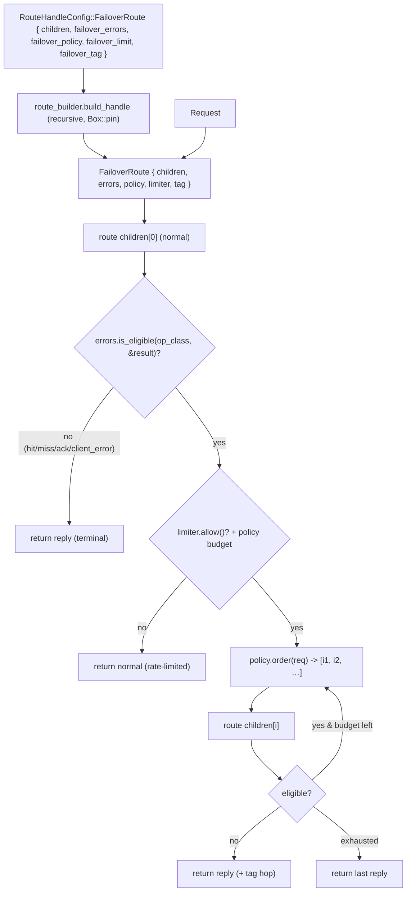

# rusty-mcrouter failover routing (design)

> Status: **Planned**
> Mirrors: [`../mcrouter/failover.md`](../mcrouter/failover.md) — how mcrouter does it (`FailoverRoute` + `FailoverErrorsSettings` + `FailoverPolicy` + `FailoverRateLimiter`)
> Implemented in: `../architecture/failover.md` (once built)
> Related: [`./hash-routing.md`](./hash-routing.md) — the `Selector` framework is the template for the `FailoverPolicy` framework here, and its `RankedSelector` §11 seam is exactly what the ordered policies need; [`./multiget.md`](./multiget.md) — `FailoverRoute` forwards a single-key `Request::Get`; [`./threading-model.md`](./threading-model.md) — per-thread `Rc<dyn DynRoute>`, `Route::route` is `&self` (so stateful policies/limiter use interior mutability).

Add a **`FailoverRoute`** handle: an ordered list of child routes where
`children[0]` is the **normal** target and `children[1..]` are **failover**
targets. Route the normal child; if its reply is a *failover-eligible* failure
(per a configurable `FailoverErrors`), retry the failover children — in an order
chosen by a pluggable `FailoverPolicy`, subject to a `FailoverRateLimiter` budget —
until one returns a non-failure reply, or return the last failure. Read the
[mcrouter reference](../mcrouter/failover.md) first; this doc designs **the whole
framework** (mirroring how [hash-routing](./hash-routing.md) designed the `Selector`
framework) and then **phases the implementation**.

---

## tl;dr

- Four orthogonal concerns, designed up-front so the handle never gets rewritten —
  the same two-tier discipline as the `Selector` framework:
  1. **the handle** — `FailoverRoute { children, errors, policy, limiter, tag }`,
     tries children, owns the request lifecycle.
  2. **`FailoverErrors` (whether)** — classifies a child's `Result<Reply>` as
     *failover-eligible* or *terminal*, configurable **per operation class**
     (gets / updates / deletes / other), defaulting to mcrouter's set.
  3. **`FailoverPolicy` (which / how many)** — a trait yielding the order to try
     failover targets and the try budget. `InOrder` (default, stateless),
     `LeastFailures` (stateful), `DeterministicOrder` (reuses our existing `Ch3`),
     `Rendezvous` (needs a Rendezvous hash — gated).
  4. **`FailoverRateLimiter` (limit)** — an optional token bucket capping the
     *fraction* of requests allowed to fail over, so a broad outage can't double
     all traffic onto the failover pool.
  - plus **`failover_tag`** — optional observability (which hop served the reply).
- **The classification is the load-bearing piece.** `FailoverRoute` sits *below*
  the connection edge that collapses errors, so it sees the full `Result<Reply>`.
  Default eligibility: **`Err(RouteError)` and `Ok(Reply::ServerError)`**;
  everything else terminal — and crucially **a miss never fails over** (mirrors
  mcrouter's `isFailoverErrorResult`, which excludes `NOTFOUND`).
- **Interior mutability** appears only where state lives: `LeastFailures`
  (per-child error counts) and `FailoverRateLimiter` (the bucket) use `Cell`/`RefCell`
  (single-threaded per proxy thread — no `Mutex`). `InOrder` failover is stateless.
- **No TKO prerequisite.** Failover reacts to replies; it never probes health. The
  one place TKO matters (mcrouter lets a TKO bypass the rate limiter/budget) is a
  noted refinement for when a TKO signal exists.
- **Two pieces of new build infrastructure**: a typed recursive config variant
  `RouteHandleConfig::FailoverRoute { children, … }`, and **recursive handle
  building** in `route_builder` (which, because `build_handle` is `async fn`,
  needs `Box::pin`).
- **Phased rollout** — full framework, incremental shipping: **P0** handle +
  default classification + in-order + config + builder; **P1** configurable
  `failover_errors` + rate limiter; **P2** `LeastFailures` + `DeterministicOrder`
  policies; **P3** prerequisite-gated (`failover_tag`, `Rendezvous`,
  `FailoverWithExptime`, lease pairing, failure domains).



---

## goal

A `FailoverRoute` routes each request to `children[0]`; on a failover-eligible
failure it transparently retries the failover children — in the policy's order,
within the rate-limiter/try budget — and returns the first non-failure reply, or
the last failure. The behavior is **config-driven and pluggable**: which results
count as failures (`failover_errors`, per op class), which child to try next
(`failover_policy`), and how aggressively (`failover_limit`) are all chosen from
config, and adding a new policy is additive (a trait impl + one builder arm), not
a rewrite — the same extensibility guarantee the `Selector` framework gives.
Children are arbitrary sub-routes, so failover composes on top of the existing
tree. It is the first **multi-child, behavior-bearing** handle and the first whose
children are built **recursively from config**.

Failover is *the* core mcrouter feature — a router that can't route around a sick
backend isn't doing the one job a router exists for.

## the architecture: four concerns, one handle

mcrouter keeps *whether* (`FailoverErrorsSettings`), *which/how-many*
(`FailoverPolicy`), and *limit* (`FailoverRateLimiter`) as separate objects on the
`FailoverRoute`, and that separation **is** the design — it's why each is
independently configurable and testable. rusty mirrors it:

```rust
pub struct FailoverRoute {
    children: Vec<Rc<dyn DynRoute>>,      // [0] = normal, [1..] = failover targets
    errors: FailoverErrors,               // WHETHER a reply fails over (per op class)
    policy: Box<dyn FailoverPolicy>,      // WHICH failover target next, and the try budget
    limiter: Option<FailoverRateLimiter>, // optional LIMIT on the failover fraction
    tag: bool,                            // optional observability (hop stamping)
}
```

This is the `Selector`-framework discipline applied to failover: a thin handle
that owns the request lifecycle, delegating each decision to a small,
independently-testable piece. §1–§5 design each; §6–§7 cover config + building; §8
covers state/threading.

---

## scope

The full framework is **designed** here; the **implementation is phased** (P0–P3,
see [implementation order](#implementation-order)) so each phase ships something
useful. Designed and shipping across phases:

- the `FailoverRoute` handle (children + the four concerns) — **P0**
- the failure classification `FailoverErrors`: the default set (**P0**) and the
  configurable per-op-class form (**P1**)
- the `FailoverPolicy` trait + `InOrder` (**P0**), `LeastFailures` +
  `DeterministicOrder` (**P2**)
- `FailoverRateLimiter` (`failover_limit`) — **P1**
- the typed recursive `RouteHandleConfig::FailoverRoute { … }` + recursive
  `build_handle` (`Box::pin`) — **P0**
- rewriting the two tests that assert `FailoverRoute` is unimplemented — **P0**

**Prerequisite-gated** (designed as seams; built when the prerequisite lands, not
silently dropped):

- **`failover_tag`** — needs a metadata slot on `Reply` (there is none today) or a
  stats-only treatment (§5). **P3.**
- **`Rendezvous` policy** — needs a Rendezvous/HRW hash (the order-independent
  selector flagged as future work in [`./hash-routing.md`](./hash-routing.md)). **P3.**
- **`FailoverWithExptimeRoute`** — the TTL-shortening sugar; needs a
  `ModifyExptimeRoute` first. **P3.**
- **lease pairing** (`enable_lease_pairing`) — needs lease ops (`McLeaseGet/Set`),
  which rusty doesn't have. Gated.
- **failure domains** — needs failure-domain metadata on destinations. Gated.
- **TKO bypass** of the rate-limiter/budget — needs a backend-client TKO signal. Gated.

Not this route: **`MissFailoverRoute`** (fail over *on a miss*) is a different
handle entirely.

---

## starting point (current rusty)

- The route layer (`rusty-mcrouter-core/src/routes/`) is type-erased behind
  `Rc<dyn DynRoute>`; `Route::route(&self, req) -> Result<Reply>` is `&self`,
  single-threaded per proxy thread (so any state needs `Cell`/`RefCell`).

  ```rust
  // routes/mod.rs
  pub trait Route: 'static {
      fn route(&self, req: Request) -> impl Future<Output = Result<Reply>>;
      fn into_dyn(self) -> Rc<dyn DynRoute> where Self: Sized { Rc::new(self) }
  }
  #[derive(Debug, Error)]
  pub enum RouteError {
      Backend(#[from] NetError),                         // transport/protocol
      SelectorOutOfRange { idx: usize, len: usize },
  }
  ```

- **`SelectionRoute` is the multi-child precedent** (`children: Vec<Rc<dyn DynRoute>>`,
  forwards via `child.route_dyn(req).await`). FailoverRoute reuses the storage but
  *iterates*.
- **`RouteError` is a matchable typed enum** — failover classifies by matching on
  it. It must stay typed.
- **The error→`Reply` collapse is *above* FailoverRoute** (`connection.rs` `route_one`,
  `proxy.rs` `spawn_request` turn any `Err` into `Reply::ServerError`). FailoverRoute
  calls `child.route_dyn(req).await` directly, so it sees the **full `Result<Reply>`**
  — it can tell `Err(Backend)` from `Ok(Reply::ServerError)` from a hit/miss. The
  collapse only applies to what FailoverRoute *returns*.
- A backend `SERVER_ERROR` is `Ok(Reply::ServerError(_))`, not `Err`; only
  transport/protocol failures are `Err(RouteError::Backend(NetError))`.
- **`Ch3` already exists** (`selectors/furc.rs`, a byte-exact `furc_hash`) — the
  `DeterministicOrder` policy reuses it directly (a cheap P2 win, no new hash).
- **`build_handle` is `async fn(&mut self)` and flat** today; the config layer has
  **no nested-handle variant** (children-bearing routes fall into `Unknown`).
- **`Reply` has no metadata slot** (it's `Get { hits } | Stored | … | ServerError(Bytes)`)
  — the reason `failover_tag` is gated (§5).
- Two tests assert `FailoverRoute` is `RouteTypeNotImplemented` (`route_builder.rs`)
  — to be rewritten.

---

## target design

### 1. the handle — try children, delegate every decision

```rust
// rusty-mcrouter-core/src/routes/failover_route.rs
impl Route for FailoverRoute {
    async fn route(&self, req: Request) -> Result<Reply> {
        let class = OpClass::of(&req);

        // 1) normal target.
        let normal = self.children[0].route_dyn(req.clone()).await;
        if !self.errors.is_eligible(class, &normal) {
            return normal;                              // hit / miss / ack / client_error / …
        }

        // 2) gated: rate limiter + policy try budget. (A future TKO reply would
        //    bypass this; no TKO signal in rusty yet, so all eligible failures gate.)
        if let Some(limiter) = &self.limiter {
            if !limiter.allow() {
                return normal;                          // failover rate-limited
            }
        }

        // 3) failover targets in policy order, within budget.
        let mut last = normal;
        for idx in self.policy.order(&req) {            // indices into children[1..]
            let result = self.children[idx].route_dyn(req.clone()).await;
            self.policy.record(idx, self.errors.is_eligible(class, &result));
            if !self.errors.is_eligible(class, &result) {
                return self.tagged(result, idx);        // success / terminal on a failover
            }
            last = result;
        }
        last                                            // all exhausted → last failure
    }
}
```

`req` is cloned per attempt (`Request` is refcounted `Bytes` — cheap; `route_dyn`
consumes it). `policy.record(...)` is a no-op for stateless policies and updates
counts for `LeastFailures`. `tagged(...)` is identity unless `failover_tag` is on
(§5). The builder guarantees non-empty `children`, so `children[0]` can't panic
(an empty failover is a build-time `FailoverRequiresChildren` error, §7).

### 2. `FailoverErrors` — *whether* a reply fails over (configurable, per op class)

The load-bearing piece. mcrouter classifies per operation class
(`FailoverErrorsSettings`); rusty does the same by matching the **request's op
class** (the route holds `req`) against the **child's `Result<Reply>`**.

```rust
#[derive(Clone, Copy)]
enum OpClass { Get, Update, Delete, Other }   // derived from the Request variant

impl OpClass {
    fn of(req: &Request) -> OpClass {
        match req {
            Request::Get { .. } => OpClass::Get,
            Request::Set { .. } | Request::Add { .. } | Request::Replace { .. }
            | Request::Append { .. } | Request::Prepend { .. } => OpClass::Update,
            Request::Delete { .. } => OpClass::Delete,
            Request::Incr { .. } | Request::Decr { .. } | Request::Touch { .. } => OpClass::Other,
        }
    }
}

pub struct FailoverErrors { gets: ErrorSet, updates: ErrorSet, deletes: ErrorSet, other: ErrorSet }
impl FailoverErrors {
    fn is_eligible(&self, class: OpClass, result: &Result<Reply>) -> bool {
        self.set(class).matches(result)
    }
}
```

`ErrorSet` is the configurable predicate over rusty's (coarser-than-mcrouter)
failure vocabulary:

```rust
#[derive(Clone, Copy)]
pub struct ErrorSet { backend: bool, server_error: bool, client_error: bool, bare_error: bool }
impl ErrorSet {
    // mirrors mcrouter's default isFailoverErrorResult: transport + remote_error
    const DEFAULT: ErrorSet = ErrorSet { backend: true, server_error: true, client_error: false, bare_error: false };
    fn matches(&self, r: &Result<Reply>) -> bool {
        match r {
            Err(_)                    => self.backend,       // any RouteError (incl. SelectorOutOfRange)
            Ok(Reply::ServerError(_)) => self.server_error,
            Ok(Reply::ClientError(_)) => self.client_error,
            Ok(Reply::Error)          => self.bare_error,
            _                         => false,              // hit, MISS, NotFound, Stored, Numeric, … → terminal
        }
    }
}
```

| child outcome | rusty value | default eligible? | mcrouter analogue |
|---|---|---|---|
| transport/protocol failure | `Err(RouteError::Backend(_))` | **yes** | `connect_error`/`timeout`/`local_error` |
| backend `SERVER_ERROR` | `Ok(Reply::ServerError(_))` | **yes** | `remote_error` |
| **miss** | `Ok(Reply::Get{hits:[]})`, `Ok(Reply::NotFound)` | **no** | `NOTFOUND` — not even an error |
| hit / store-ack / numeric | `Ok(Reply::Get{..}/Stored/…/Numeric)` | no | success |
| client error | `Ok(Reply::ClientError(_))` | no (configurable on) | `CLIENT_ERROR` (terminal) |
| bare error | `Ok(Reply::Error)` | no (configurable on) | `ERROR` |

**The headline — a miss never fails over — falls out of the `_ => false` arm.** The
mcrouter↔rusty vocabulary mismatch (mcrouter has finer `mc_res_t` codes; rusty
lumps transport into `Err(Backend)`) is **pinned**: `failover_errors` config names
map to these four flags via a documented table (a `CONFIRM`-style fidelity note,
like hash-routing's murmur constants); faithful per-code parity isn't a goal. When
`failover_errors` is omitted, every class uses `ErrorSet::DEFAULT`. **P0** ships
`DEFAULT` only; **P1** wires the config.

### 3. `FailoverPolicy` — *which* target next, and the try budget

Designed as a trait, exactly like `Selector`, so policies are additive:

```rust
pub trait FailoverPolicy: 'static {
    /// Failover targets to try, in order, as indices into `children` (values in
    /// `1..children.len()`), truncated to the try budget (`max_tries`).
    fn order(&self, req: &Request) -> Vec<usize>;   // small Vec; failover is the slow path
    /// Feedback for stateful policies; default no-op.
    fn record(&self, _child_idx: usize, _was_eligible_failure: bool) {}
}
```

`Vec<usize>` (not `impl Iterator`) keeps it object-safe for `Box<dyn FailoverPolicy>`;
the per-failover allocation is noise against N round-trips, and failover is rare.

| policy | order | state | knobs | phase |
|---|---|---|---|---|
| **`InOrder`** (default) | `1, 2, …` truncated to `max_tries` | none | `max_tries?` | **P0** |
| **`LeastFailures`** | failover targets sorted by recent error count (fewest first) | `RefCell<Vec<u32>>` | `max_tries` | **P2** |
| **`DeterministicOrder`** | `Ch3`-derived order over failover targets | none | `max_tries`, `hash` | **P2** (reuses `Ch3`) |
| **`Rendezvous`** | HRW order | none | `tags` | **P3** (needs HRW hash) |

`InOrder` is `(1..children.len()).take(max_tries).collect()`. `DeterministicOrder`
reuses the existing `Ch3` (`selectors/furc.rs`) — no new hash. The ordered policies
are precisely the **`RankedSelector`** the hash-routing doc anticipated (§11): a
key → *ordered candidate list* rather than a single index. `FailoverPolicy` is that
abstraction, scoped to failover. The builder dispatch (`build_failover_policy`)
mirrors hash-routing's `build_selector` (match the kind → `Box<dyn FailoverPolicy>`;
unknown kind → error).

**Why not reuse the `Selector` trait?** `Selector::select(&[u8]) -> usize` returns
a *single* index and is contractually a *pure, stateless function of the key* (what
makes `Ch3` golden-vector-testable). Failover needs three things it can't give:
(1) an *ordered* candidate list, not one index — widening `Selector` to return a
list would tax every single-pick `SelectionRoute` for the rare failover case;
(2) *key-agnostic* and *stateful* policies — `InOrder` ignores the key,
`LeastFailures` reorders by observed failures — neither is a pure key function (and
`LeastFailures` is the "stateful tier" `Selector` deliberately excludes); (3) a
feedback hook (`record`) for the stateful ones. This is exactly the split
[`./hash-routing.md`](./hash-routing.md) §11 anticipated ("more than one index → a
separate ranked abstraction; do **not** widen `Selector`"). What we *do* reuse is
the hash **primitive**: `DeterministicOrder` calls the same `Ch3`/`furc_hash` (and
`Rendezvous` will share an HRW hash) — **reuse the math, not the trait**. A single
hash type can back both: one index for `SelectionRoute`, an order for `FailoverPolicy`.

### 4. `FailoverRateLimiter` — *limit* the failover fraction

mcrouter's `FailoverRateLimiter` is a token bucket (`{rate ∈ [0,1], burst}`)
capping the *fraction* of requests allowed to fail over, so a wide outage can't
convert all traffic into doubled (failover) load and take the failover pool down too.

```rust
pub struct FailoverRateLimiter {
    rate: f64,          // tokens added per request, in [0,1] (the allowed failover fraction)
    burst: f64,         // bucket capacity (mcrouter default 1000, min 1)
    tokens: Cell<f64>,  // interior mutability: route() is &self, single-threaded
}
impl FailoverRateLimiter {
    /// Refill by `rate` (capped at `burst`), then try to spend one token.
    /// (Exact refill cadence CONFIRMed against FailoverRateLimiter.cpp.)
    fn allow(&self) -> bool { /* token-bucket spend */ }
}
```

`Cell<f64>` suffices (single proxy thread). **P1.** A future TKO reply should
*bypass* the limiter (mcrouter does — a TKO destination already declined); noted
for when TKO exists.

### 5. `failover_tag` — observability (prerequisite-gated)

mcrouter's `failover_tag` stamps which failover hop served a reply (`FailoverContext`
+ `setIsFailoverIfPresent`), for debugging "did this come from a failover?".

**rusty prerequisite:** `Reply` has **no metadata slot** today (it's a flat enum of
wire shapes), so `failover_tag` needs either (a) an optional failover-hop field on
`Reply`/`Value`, or (b) a **stats-only** treatment (a per-route counter, no
per-reply stamp). The exact mcrouter wire effect is a **CONFIRM-against-source**
item. **P3**, behind the `Reply`-metadata decision; until then `tagged()` is
identity and `failover_tag` is parsed-and-ignored.

### 6. config schema (the full thing)

```rust
// rusty-mcrouter-config/src/route.rs
pub enum RouteHandleConfig {
    // …
    FailoverRoute {
        children: Vec<RouteHandleConfig>,          // recursive — arbitrary child handles
        failover_errors: Option<FailoverErrorsConfig>,
        failover_policy: Option<FailoverPolicyConfig>,
        failover_limit: Option<RateLimitConfig>,
        failover_tag: bool,
    },
}
pub enum FailoverErrorsConfig {
    Flat(Vec<String>),                                   // applies to all op classes
    PerClass { gets: Option<Vec<String>>, updates: Option<Vec<String>>, deletes: Option<Vec<String>> },
}
pub struct FailoverPolicyConfig { kind: String, /* max_tries, hash, tags, … */ }
pub struct RateLimitConfig { rate: f64, burst: Option<f64> }
```

`parse_object_form` gains a `"FailoverRoute"` arm: pull `children` (required JSON
**array**, each element recursed back through `RouteHandleConfig::deserialize`),
and the optional `failover_errors` / `failover_policy` / `failover_limit` /
`failover_tag`. A non-array `children`, or an unknown policy/error name, is a config
error (don't silently drop, as `Unknown` would). Shorthand `"FailoverRoute|…"` is
not supported — children are structural. Example:

```json
{
  "type": "FailoverRoute",
  "children": ["PoolRoute|A", "PoolRoute|B", "PoolRoute|C"],
  "failover_errors": { "gets": ["server_error"], "updates": ["backend_error"] },
  "failover_policy": { "type": "LeastFailures", "max_tries": 3 },
  "failover_limit": { "rate": 0.1, "burst": 100 }
}
```

### 7. builder — recursive child building + wiring the pieces

`build_handle` gains a `FailoverRoute` arm. Children are arbitrary handles, so it
**recurses** — and because `build_handle` is an `async fn`, the recursive call must
be `Box::pin`'d (a self-recursive `async fn` is otherwise infinitely sized):

```rust
RouteHandleConfig::FailoverRoute { children, failover_errors, failover_policy, failover_limit, failover_tag } => {
    if children.is_empty() {
        return Err(BuildError::FailoverRequiresChildren);      // fail-fast, mirrors EmptyPool
    }
    let mut built = Vec::with_capacity(children.len());
    for child in children {
        built.push(Box::pin(self.build_handle(child)).await?); // sequential: &mut self / pool_cache borrow
    }
    let errors  = FailoverErrors::from_config(failover_errors)?;        // default if None
    let policy  = build_failover_policy(failover_policy, built.len())?; // default InOrder if None
    let limiter = failover_limit.map(FailoverRateLimiter::from_config).transpose()?;
    Ok(FailoverRoute::new(built, errors, policy, limiter, *failover_tag).into_dyn())
}
```

- **Sequential**, not `join_all` — the `&mut self`/`pool_cache` borrow is held
  across each child build, which is desirable: recursing through one builder means
  child `PoolRoute`s **share the connection cache**.
- `build_failover_policy` mirrors hash-routing's `build_selector` (`match` kind →
  `Box<dyn FailoverPolicy>`), same "unknown kind → error" discipline.
- New `BuildError` variants: `FailoverRequiresChildren`, `UnknownFailoverPolicy`,
  `UnknownFailoverError`, `InvalidFailoverChildren`. The two existing
  "FailoverRoute → not implemented" tests are rewritten.

### 8. interior mutability + TKO

- **State lives only where it must.** `InOrder` failover and `FailoverErrors` are
  stateless. `LeastFailures` (`RefCell<Vec<u32>>` counts) and `FailoverRateLimiter`
  (`Cell<f64>` tokens) hold per-route mutable state — fine under `route(&self)`
  because each proxy thread is single-threaded (`current_thread` runtime): `Cell`/`RefCell`,
  never `Mutex`. This is the "stateful tier" the hash-routing doc carved out for
  `Latest`/`LoadBalancer`; failover's stateful policies live there too.
- **No TKO dependency.** Failover reacts to a child's `Result<Reply>`; it never
  probes backend health. The single TKO touch-point — mcrouter lets a TKO reply
  *bypass* the rate limiter and try budget — is a refinement for when a
  backend-client TKO signal exists; until then every eligible failure is gated
  uniformly. Failover is fully useful without TKO.

---

## how this maps to mcrouter

| mcrouter | rusty |
|---|---|
| `FailoverRoute` (`targets_`, normal-first) | `FailoverRoute { children, errors, policy, limiter, tag }` |
| `FailoverErrorsSettings::shouldFailover` (per op class) | `FailoverErrors::is_eligible(OpClass, &Result<Reply>)` |
| default `isFailoverErrorResult` set | `ErrorSet::DEFAULT` = `Err(RouteError)` + `Ok(ServerError)`; **miss terminal** |
| `failover_errors` array / `{gets,updates,deletes}` | `FailoverErrorsConfig::Flat` / `PerClass` |
| `FailoverInOrderPolicy` (default) | `InOrder` policy |
| `FailoverLeastFailuresPolicy` | `LeastFailures` (`RefCell` counts) — stateful tier |
| `FailoverDeterministicOrderPolicy` | `DeterministicOrder` — **reuses existing `Ch3`** |
| `FailoverRendezvousPolicy` | `Rendezvous` — needs an HRW hash (gated) |
| `FailoverPolicy` (template) | `trait FailoverPolicy { order, record }` (object-safe) |
| `FailoverRateLimiter` (`failover_limit`: rate/burst) | `FailoverRateLimiter { rate, burst, tokens: Cell }` |
| `failover_tag` + `FailoverContext` | `failover_tag` — needs a `Reply` metadata slot (gated) |
| `FailoverWithExptimeRoute` | gated — needs a `ModifyExptimeRoute` first |
| lease pairing / failure domains | gated — need lease ops / domain metadata |
| children built by `factory.createList` | recursive `build_handle` (`Box::pin`) |
| return last reply when budget exhausted | return the last child's `Result<Reply>` |
| TKO bypasses limiter/budget | refinement once a TKO signal exists |

---

## testing

- **`FailoverErrors` / `ErrorSet`** (unit): default eligibility (`Err`, `ServerError`
  → yes; miss, hit, `Stored`, `ClientError`, `Error` → no); per-op-class config
  (a `gets`-only `server_error` list doesn't affect `updates`); `OpClass::of`
  covers every `Request` variant.
- **`FailoverPolicy`** (unit, per policy): `InOrder` yields `1..n` truncated to
  `max_tries`; `LeastFailures` reorders by recorded counts (drive `record`);
  `DeterministicOrder` is deterministic for a key.
- **`FailoverRateLimiter`** (unit): allows ≈`rate` fraction over many requests;
  `burst` bounds the initial allowance; deterministic given a request sequence.
- **Handle** (`failover_route.rs`, mock children): normal succeeds → failovers
  untouched; **miss is terminal** (failover untouched — the headline); normal
  errors → failover served in policy order; all fail → last failure returned;
  limiter denies → returns normal; tag (when built) stamps the hop.
- **Builder** (`route_builder.rs`): build over mock pools; nested failover; child
  pools share the connection cache; `children: []` → `FailoverRequiresChildren`;
  unknown policy/error name → config error; rewrite the two "not implemented" tests.
- **Config** (`route.rs`): full schema parse (children recursed to typed handles;
  `failover_errors` flat + per-class; policy/limit/tag); error cases.

---

## implementation order

Full framework, phased shipping — the handle shape + the three traits/types land in
**P0** so later phases are additive (a new policy is a trait impl + one
`build_failover_policy` arm, never a handle rewrite):

- **P0 — a working failover route.** Config variant `FailoverRoute { children, .. }`
  (other fields default) + recursive `build_handle` (`Box::pin`) +
  `FailoverRequiresChildren` + the handle with `ErrorSet::DEFAULT` classification and
  the `FailoverPolicy` trait with `InOrder` (no config knobs yet). Rewrite the two
  negative tests. Ships the headline behavior (fail over on error, not on miss).
- **P1 — errors + limit config.** Parse/wire `failover_errors` (flat + per-op-class
  via `OpClass`) and `failover_limit` (`FailoverRateLimiter`, `Cell` bucket).
- **P2 — policies.** `failover_policy` dispatch + `LeastFailures` (`RefCell` counts)
  and `DeterministicOrder` (reuse `Ch3`).
- **P3 — prerequisite-gated.** `failover_tag` (after a `Reply` metadata decision),
  `Rendezvous` (after an HRW hash), `FailoverWithExptime` (after a
  `ModifyExptimeRoute`), lease pairing, failure domains, TKO bypass.
- **Docs.** `../architecture/failover.md` (as-built) and flip this to Implemented.

Each phase is independently shippable and testable.

---

## open questions / decisions

- **Default classification (decided): `Err` + `Ok(ServerError)`; miss terminal.**
  Matches mcrouter's default set. `ClientError`/`Error` are configurable-on,
  default-off. Open: should `Err(RouteError::SelectorOutOfRange)` (a config bug, not
  a backend fault) be terminal? It's the one place the `Err(_) => self.backend`
  lumping is debatable.
- **Vocabulary mismatch (pinned, CONFIRM):** rusty's failure classes are coarser
  than mcrouter's `mc_res_t`. `failover_errors` names map to the four `ErrorSet`
  flags via a documented table; 1:1 per-code parity with mcrouter is not a goal.
- **`FailoverPolicy::order -> Vec<usize>` (decided):** object-safe + simple; the
  per-failover alloc is noise vs round-trips.
- **Rate-limiter refill cadence (CONFIRM):** exact token-bucket math against
  `FailoverRateLimiter.cpp` before claiming `rate`/`burst` wire-parity.
- **`failover_tag` representation (open):** extend `Reply` with a metadata slot vs
  stats-only — drives per-reply vs per-route. Gated to P3.
- **TKO bypass (deferred):** the limiter/budget bypass for TKO replies waits for a
  backend-client TKO signal; failover is fully useful without it.
- **Empty / single children (decided):** reject empty (`FailoverRequiresChildren`);
  a single child is a degenerate passthrough (allowed).
- **`req` clone cost:** clone-per-attempt; `Request` is `Bytes` (refcount bumps). If
  a future request type carries owned buffers, revisit.

---

## done when

- `FailoverRoute { children, errors, policy, limiter, tag }` exists; tries children
  in policy order; returns the first non-eligible reply or the last failure;
  **never fails over on a miss** (asserted).
- `FailoverErrors` classifies per op class, configurable via `failover_errors`
  (flat + `{gets,updates,deletes}`), defaulting to `ErrorSet::DEFAULT`.
- `FailoverPolicy` is a trait with `InOrder` (default) shipping; `LeastFailures` and
  `DeterministicOrder` land additively (trait impl + one builder arm), proving
  extensibility.
- `FailoverRateLimiter` (`failover_limit`) caps the failover fraction via a `Cell`
  token bucket.
- `RouteHandleConfig::FailoverRoute { children, … }` parses (recursive typed
  children; errors/policy/limit/tag); `build_handle` builds children recursively
  (`Box::pin`, shared `pool_cache`); empty children → `FailoverRequiresChildren`;
  the two former "not implemented" tests are rewritten.
- Stateful pieces use `Cell`/`RefCell` (no `Mutex`); no TKO dependency.
- `failover_tag`, `Rendezvous`, `FailoverWithExptime`, lease pairing, and failure
  domains are documented seams with their prerequisites named.
- `lsp_diagnostics`/clippy clean; `../architecture/failover.md` written and this doc
  flipped to Implemented.
