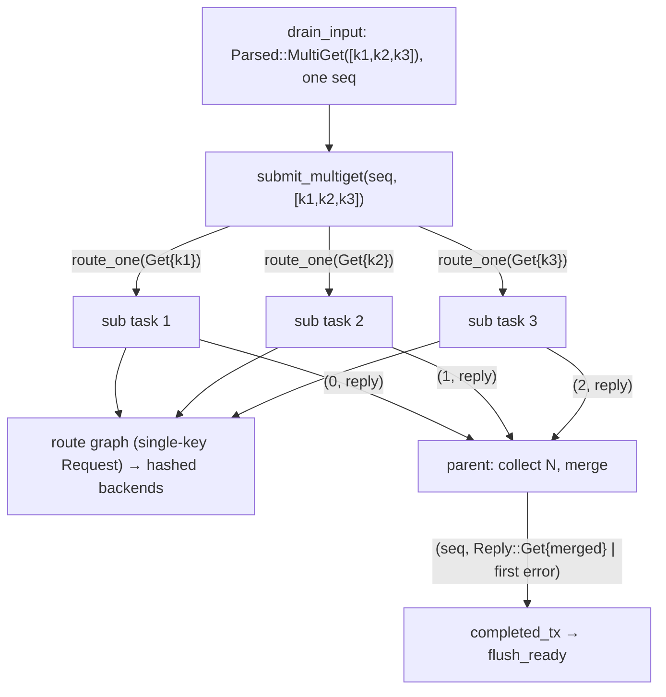

# rusty-mcrouter multiget (design)

> Status: **Planned**
> Mirrors: [`../mcrouter/multiget.md`](../mcrouter/multiget.md) — how mcrouter does it (parser split + `MultiOpParent`)
> Implemented in: `../architecture/multiget.md` (once built)
> Related: [`./hash-routing.md`](./hash-routing.md) — independent and complementary, **not** a dependency: making the routed `Request::Get` single-key is where `PoolRoute`'s per-key hash lands cleanly. Either can land first; this supersedes that doc's "multi-key get problem" section.

Make the **routed** get single-key *by type*, split a wire multi-key `get` into
independent single-key gets **before** routing, then reassemble the sub-replies
into one client reply. Read the [mcrouter reference](../mcrouter/multiget.md)
first — this doc assumes it and only describes our side.

---

## tl;dr

- A wire `get k1 k2 k3` must not route as one unit: `k1`,`k2`,`k3` may hash to
  different backends, so a single route yields false misses. mcrouter handles
  this by having **no multi-key request type at all** — its `McGetRequest` holds
  exactly one key (`Memcache.idl`), and the parser splits the wire command into
  single-key requests.
- We do the same at the **type level**: change the routed request to
  **`Request::Get { key: Bytes }`** (single-key). The route graph, route handles,
  and backend `Client` then *cannot represent* a multi-key get — the invariant is
  compiler-enforced, not a convention.
- The wire's multi-key-ness lives only at the **parse boundary**, in a small
  result type:

  ```rust
  enum Parsed {
      One(Request),          // common path incl. single-key get — no Vec, no state
      MultiGet(Vec<Bytes>),  // rare; the Vec is only built when 2+ keys are present
  }
  ```

- The **connection** turns a `Parsed::MultiGet` into one output `seq`, fans out
  **N single-key `Request::Get { key }`** through the normal per-request path (so
  hashing/failover/thread-modes apply per key), and **reassembles** the N replies
  into one `Reply::Get` (concatenated hits) or the **first error**.
- The parser stays **stateless**: a `get` is a single line, so it decides
  single-vs-multi in one call — no cross-call state and no multi-op sentinels in
  the protocol crate. (A future stateful parser is forward-compatible; see
  [below](#forward-compatibility-stateless-now-stateful-later).)
- **Efficiency bonus:** the common single-key get is `Parsed::One(Get{key})` with
  **zero `Vec`** — today's `Get { keys: Vec<Bytes> }` pays a heap allocation per
  get even for one key.

---

## goal

A pipelined multiget routes each key to the backend that key hashes to, and the
client receives exactly one well-formed reply (`VALUE` blocks for hits, in
request-key order, then `END`) — or the first error if a sub-get failed. The
routed request type is single-key, so no code below the connection layer can even
*express* a multi-key get, and the common single-key path allocates nothing extra.

## why, and how it relates to hash-routing

The split belongs **above routing**, not inside `PoolRoute`. An earlier
hash-routing draft put it there — the wrong layer: it only fires when a multiget
hits a `PoolRoute` directly, and it would have to be re-implemented in every
handle that forwards a `Get` (`NullRoute`, a future `FailoverRoute`, …). mcrouter
splits **once**, above all routing, because its request type is single-key; we
adopt that invariant (`Request::Get { key }`) and split once at the connection.

This is **independent of [hash-routing](./hash-routing.md)** — neither blocks the
other. They just meet cleanly: with the routed `Get` single-key, `PoolRoute`
hashes the one key with no special-casing. If hashing lands first, it hashes the
first key of `Get{keys}` as an interim (correct for the common single-key get),
and adapting it to the single-key type once this lands is trivial.

---

## scope / non-goals

In scope:

- making the routed `Request::Get` single-key (`key: Bytes`)
- a `Parsed` parse-boundary type (`One` / `MultiGet`) so the wire's multi-key get
  is expressed without a `Vec` on the common path
- a connection-layer "multiget parent" that fans out N single-key gets and merges
  the replies into one `Reply::Get` (or first error) for one `seq`
- preserving request-key order in the merged `VALUE`s
- keeping `in_flight`/`seq`/`flush_ready` accounting unchanged (a multiget = one
  output slot)

Out of scope / deferred:

- **a stateful parser** — not needed for any of this (a `get` is one line). It's a
  worthwhile *future* foundation for other reasons (large values, backpressure,
  the binary/meta protocol); deferred and forward-compatible. See
  [below](#forward-compatibility-stateless-now-stateful-later).
- **re-batching same-destination keys** into one backend multi-key get. mcrouter
  doesn't either (it pipelines single-key gets to the backend); it complicates
  FIFO reply matching in our `ClientConnection` for little gain. See
  [open questions](#open-questions--decisions).
- **`gat`/`gats`** multi-key splitting — same shape, but we don't have those
  commands yet; `Parsed`/the parent should be written so adding them is trivial.
- Caret/binary protocol — rusty is ASCII-only.

---

## starting point (current rusty)

Today the parser returns `Option<Request>` and `Request::Get` is multi-key
(`rusty-mcrouter-protocol/src/request.rs`):

```rust
pub enum Request {
    Get { keys: Vec<Bytes> },          // multi-key — every get allocates a Vec
    Set { key: Bytes, .. }, ..         // others already single-key
}
```

`get.rs` builds the keys with `rest.slice_ref(seg)` — the key *bytes* are
zero-copy views into the read buffer, so nothing copies key data; the waste is the
**`Vec` container itself**, allocated on *every* get including the common
single-key case.

The connection (`rusty-mcrouter/src/proxy/connection.rs`) drains and dispatches
one frame → one `seq` → one `Reply`:

```rust
fn drain_input(&mut self) -> Result<(), NetError> {
    while let Some(req) = parse_request(&mut self.buf)? {
        let seq = self.next_seq;
        self.next_seq = self.next_seq.wrapping_add(1);
        self.in_flight = self.in_flight.saturating_add(1);
        self.submit(seq, req);                 // one frame → one seq → one Reply
    }
    Ok(())
}
```

`flush_ready` reassembles client order from `pending: BTreeMap<seq, Reply>` keyed
by `next_write`. Relevant facts we build on:

- `Reply::Get { hits: Vec<Value> }` serializes as `VALUE …` per hit then a single
  `END` (`reply.rs`) — so a merged `Reply::Get` is byte-identical to what one
  backend would return for the whole multiget.
- One frame currently maps to one `seq`; `in_flight` counts frames, not keys. We
  keep that: a multiget is **one** output slot.

---

## the shape: single-key routed request + a `Parsed` boundary

mcrouter has no multi-key request type — `McGetRequest` is one key, and the parser
splits the wire command. We adopt the same invariant, but because a `get` is a
single line we don't need a stateful streaming parser to do it: the parser reads
the whole line, sees every key at once, and returns either a single-key request or
(rarely) the key list.

```rust
// protocol: the ROUTED request is single-key
pub enum Request {
    Get { key: Bytes },
    Set { key: Bytes, .. }, ..
}

// protocol: the wire's multi-key get is expressed only here, at the boundary
pub enum Parsed {
    One(Request),
    MultiGet(Vec<Bytes>),
}

pub fn parse_request(buf: &mut BytesMut) -> Result<Option<Parsed>>;
```

`get.rs` special-cases arity so the common path never builds a `Vec`:

- parse the first key; if **no** further key token follows → `Parsed::One(Request::Get { key })` (zero allocation, no state)
- only if a second key is present → collect all into `Parsed::MultiGet(keys)`
- **no keys at all** (`get\r\n`) → a `CLIENT_ERROR` from `parse_request`: the get
  grammar requires ≥1 key, so a keyless get is the client's error (not a `Parsed`
  value, not a routed request). `Parsed` deliberately has no zero-key case.

Everything that isn't a 2+-key get is `Parsed::One(...)`. The serializer simplifies
too: `Request::Get` now writes `get <key>\r\n` (one key). Because the routed `Get`
is single-key, **there is no "empty get" below the parser** — so
`RouteError::EmptyGet` (added as a guard for the multi-key interim) is **retired**
when this lands, along with `routing_key`'s empty-get branch and the
`routing_key_empty_get_is_error` test. Empty-get handling moves up to the parser
(the `CLIENT_ERROR` above).

> Why not the parser emit single-key gets directly (mcrouter-literal)? That needs
> the parser to return *multiple* values across calls — i.e. statefulness + a
> multi-op sentinel — pushing reply-grouping into the protocol crate. `Parsed`
> keeps the grouping explicit in **one** return value and the parser stateless.
> See [where the split lives](#where-the-split-lives).

The invariant this establishes: **a multi-key get is unrepresentable below the
connection.** Route handles take `Request::Get { key }`; there is no `Vec` to
mishandle. This replaces the "document-it-and-`debug_assert`" convention the
earlier draft proposed.

---

## where the split lives

mcrouter splits in the **ASCII parser** because its request type is single-key, so
the bytes→request boundary is the only place a wire multiget can become requests —
and it then needs `MultiOpParent` at the *session* to reassemble. The split point
and the reassembly point are different layers, bridged by a `multiOpEnd` sentinel.

rusty keeps the split and the reassembly **co-located at the connection**:

- the parser only *classifies* (`One` vs `MultiGet`) — it does not fan out;
- the connection *fans out* `MultiGet` into N single-key routes and *reassembles*
  — and it's the layer that owns the `seq`/reorder/`completed_tx` machinery
  reassembly needs anyway.

So grouping is never destroyed-then-rebuilt; it lives in one value (`MultiGet`)
and one layer (the connection). The protocol crate stays a pure, stateless
`bytes → Parsed`.

---

## target design

### 1. drain + dispatch on `Parsed`

```rust
fn drain_input(&mut self) -> Result<(), NetError> {
    while let Some(parsed) = parse_request(&mut self.buf)? {
        let seq = self.next_seq;
        self.next_seq = self.next_seq.wrapping_add(1);
        self.in_flight = self.in_flight.saturating_add(1);
        match parsed {
            Parsed::One(req)       => self.submit_single(seq, req),
            Parsed::MultiGet(keys) => self.submit_multiget(seq, keys),
        }
    }
    Ok(())
}
```

`submit_single` is today's `submit` body, refactored onto a `route_one` helper.
The common case (single-key get + every other command) takes this path with **no
parent and no `Vec`**.

### 2. `route_one`: the per-request routing path, reused

```rust
fn route_one(&self, req: Request) -> impl Future<Output = Reply> {
    let handle = self.proxies.choose(self.mode, self.current_id, &req);
    let same_thread = handle.id() == self.current_id;
    let route = Rc::clone(&self.local_route);
    async move {
        if same_thread {
            route.route_dyn(req).await
                .unwrap_or_else(|_| Reply::ServerError(Bytes::from_static(b"backend unavailable")))
        } else {
            handle.send_request(req).await
        }
    }
}
```

Each sub-key routes exactly like a normal single-key get, so consistent hashing,
future failover, and the thread modes apply per key for free.

### 3. the multiget parent: fan out, collect, merge

One output `seq`, N internal sub-routes, dependency-free collection via an
internal mpsc (mirroring the existing `completed_tx`/`completed_rx` pattern — no
new crate, works on the `!Send` `LocalSet`):

```rust
fn submit_multiget(&self, seq: usize, keys: Vec<Bytes>) {
    let n = keys.len();
    let (sub_tx, mut sub_rx) = mpsc::channel::<(usize, Reply)>(n);

    // fan out: one single-key route task per key, tagged with its position
    for (i, key) in keys.into_iter().enumerate() {
        let fut = self.route_one(Request::Get { key });   // single-key by type
        let sub_tx = sub_tx.clone();
        tokio::task::spawn_local(async move {
            let _ = sub_tx.send((i, fut.await)).await;
        });
    }
    drop(sub_tx);

    // parent: collect all N, latching the first error SEEN (completion order, like
    // mcrouter's MultiOpParent), then emit one reply for `seq`
    let completed_tx = self.completed_tx.clone();
    tokio::task::spawn_local(async move {
        let mut slots: Vec<Option<Reply>> = (0..n).map(|_| None).collect();
        let mut first_error: Option<Reply> = None;
        while let Some((i, reply)) = sub_rx.recv().await {
            if let Reply::Get { .. } = &reply {
                slots[i] = Some(reply);
            } else {
                first_error.get_or_insert(reply); // first error by arrival wins
            }
        }
        let merged = first_error.unwrap_or_else(|| merge_multiget(slots));
        let _ = completed_tx.send((seq, merged)).await;
    });
}
```

`in_flight` still counts the multiget as **one** (incremented once in
`drain_input`), and `flush_ready` sees one `(seq, merged)` — so the reorder buffer
and ordered writeback are completely unchanged.



### 4. merge: concatenate hits in key order; first error *seen* wins

The parent (§3) latches the first non-`Get` reply by **arrival order** — matching
mcrouter's `MultiOpParent`, which latches the first error seen and suppresses the
rest. When no sub-reply errored, `merge_multiget` concatenates the slots in
**request-key order** so the `VALUE` lines match mcrouter's order:

```rust
fn merge_multiget(slots: Vec<Option<Reply>>) -> Reply {
    let mut hits = Vec::new();
    for slot in slots {
        match slot {
            Some(Reply::Get { hits: h }) => hits.extend(h), // hit(s) or miss (empty)
            // a single-key get sub-reply is only ever Reply::Get here (errors were
            // latched in the parent); a dropped sub leaves None -> ServerError
            // rather than an `expect` panic (reply-drop safety, as elsewhere).
            Some(other) => return other,
            None => return Reply::ServerError(Bytes::from_static(b"multiget: lost subreply")),
        }
    }
    Reply::Get { hits }
}
```

- **Hits** concatenate in **request-key order** (`slots` indexed by position).
- **Misses** are `Reply::Get { hits: vec![] }` — absorbed, as mcrouter absorbs them.
- **First error** is whichever sub-route's error the parent saw first (completion
  order), matching `MultiOpParent`'s first-seen precedence — not key order.

### 5. concurrency

Sub-routes run **concurrently** (each `spawn_local`'d), matching mcrouter's
independent dispatch and exploiting the backend `Client`'s pipelining — N keys to
the same backend pipeline onto its one socket; keys to different backends proceed
in parallel. The parent waits for **all** N before replying (a multiget reply is
all-or-first-error), so there's no partial flush. A **serial** variant is simpler
but serializes N round-trips; not worth it given the infra already supports
concurrency.

---

## forward compatibility: stateless now, stateful later

This design keeps the parser stateless, but does **not** block making it stateful
later (the right foundation for large-value streaming, per-connection memory
backpressure, and the binary/meta protocol — its own future effort). When that
happens:

- `Request::Get { key }` (single-key, type-enforced) is **unchanged** — it's
  independent of how the parser is structured.
- Reassembly stays at the connection — mcrouter reassembles at the *session* even
  *with* its stateful parser, so this is the steady-state shape regardless.
- Only the parse→connection boundary changes: `Parsed::MultiGet(Vec)` becomes
  "emit N single-key gets incrementally + a group marker," an internal refactor
  that never touches the route tree or the merge logic.

So choosing stateless now is not a corner we have to back out of.

---

## how this maps to mcrouter

| mcrouter | rusty |
|---|---|
| `McGetRequest` holds one key (`Memcache.idl`) | `Request::Get { key: Bytes }` (single-key by type) |
| `McServerAsciiParser::consumeGetLike` emits per-key requests | parser returns `Parsed::One` / `Parsed::MultiGet`; connection fans out |
| `MultiOpParent` (+ block/end contexts) coordinates | the parent `spawn_local` task + internal `sub_rx` |
| each subreq routed independently | `route_one(Request::Get { key })` per key |
| per-subreq `VALUE`; parent suppresses sub-`END`, emits one `END` via the block/end gate | merge `hits` into one structured `Reply::Get` (atomic `VALUE* + END`) |
| first non-FOUND/NOT_FOUND reply wins (first-seen) | parent latches the first non-`Get` sub-reply by arrival; `merge_multiget` concatenates hits |
| reorder by request id in `McServerSession` | existing `pending`/`next_write` reorder buffer (unchanged) |
| split is ASCII-only | rusty is ASCII-only; same |

---

## testing

- **No `Vec` on the common path.** A single-key `get k` parses to
  `Parsed::One(Request::Get { key })` and takes `submit_single` — never builds a
  key `Vec` or a parent. (Guards the efficiency win and against a regression that
  routes 1-key gets through the multiget path.)
- **Spans backends.** With a 2+ backend pool and consistent hashing, `get k1 k2`
  where the keys hash to different backends returns both hits (no false miss).
  Counting mock backends (as in `pool_route.rs`) assert each backend saw only its
  key.
- **Order.** `VALUE` lines come back in request-key order regardless of which
  sub-route completes first (drive with a slow + fast mock backend).
- **Misses absorbed.** Mixed hit/miss → only the hits + single `END`; all-miss →
  just `END`.
- **First error wins.** If a key's backend errors, the whole reply is that error.
  When several error, the **first seen** wins (completion order, matching mcrouter)
  — so assert a single error deterministically; don't assert a fixed winner across
  simultaneous errors (and optionally drive a slow+fast erroring backend to confirm
  arrival-order latching).
- **Duplicates.** `get k k` → two sub-gets → two `VALUE`s on a hit (no dedupe,
  matching mcrouter).
- **Accounting.** `in_flight`/`seq` ordering holds when multigets and single
  requests pipeline together (a multiget occupies exactly one slot).

---

## implementation order

1. **Protocol: single-key `Request::Get` + `Parsed`.** Change `Request::Get` to
   `{ key: Bytes }`; add `enum Parsed { One(Request), MultiGet(Vec<Bytes>) }`;
   make `parse_request` return `Option<Parsed>`, with `get.rs` emitting
   `Parsed::One` for one key (no `Vec`), `Parsed::MultiGet` for 2+, and a
   `CLIENT_ERROR` for **zero** keys. Update the `Get` serializer and **retire
   `RouteError::EmptyGet`** (the single-key type makes it unreachable) along with
   `routing_key`'s empty-get branch and the `routing_key_empty_get_is_error` test.
   The change is **cross-crate** (protocol → net → core → bin): besides the
   parser/serializer, ~8 sites construct or match `Request::Get` — route handles
   (`null_route`, `selection_route`), the bin connection, and several test helpers
   (including `Get { keys: vec![] }` placeholders that must gain a key). Pure
   protocol+routing churn, no multiget behavior yet — `cargo`/clippy green.
2. **Connection: dispatch `Parsed` + the parent.** `drain_input` matches
   `One`/`MultiGet`; add `route_one` + `submit_single` (refactor) and
   `submit_multiget` + `merge_multiget`. Verifiable against `NullRoute` (every
   sub-get is a miss → single `END`) and a multi-backend mock pool.
3. **Relationship to hash-routing.** Independent — either can land first; they
   meet at `PoolRoute` (single-key get → hash one key).
   [`./hash-routing.md`](./hash-routing.md) defers the split to this doc.
4. **Docs.** Write `../architecture/multiget.md` (as-built) and flip this to
   Implemented.

---

## open questions / decisions

- **Re-batch same-destination keys? (decided: no — match mcrouter.)** Could group
  sub-keys by hashed backend and send one multi-key get per backend (fewer backend
  commands). mcrouter doesn't — it pipelines single-key gets — and re-batching
  complicates `ClientConnection`'s FIFO reply matching. Pipeline single-key gets;
  revisit only if profiling says so.
- **`Parsed` shape (decided: dedicated `enum Parsed { One, MultiGet }`).** Keeps
  `Request` uniformly single-key (the whole point) and the multi-key concept at the
  boundary only, rather than folding the rare multi case into `Request` itself.
- **Error precedence (decided: first error *seen* wins — match mcrouter).**
  mcrouter's `MultiOpParent` latches the first non-hit/non-miss reply by
  *completion* order and suppresses the rest. The parent latches `first_error` as
  sub-replies arrive (§3/§4); `VALUE`s for the all-hit case still concatenate in
  request-key order. (An earlier draft picked first-by-key for determinism; we
  match mcrouter instead.)
- **Zero-key get `get\r\n` (decided: `CLIENT_ERROR` at the parser).** The get
  grammar requires ≥1 key, so a keyless get is the client's error, surfaced from
  `parse_request` — not a `Parsed` value, not a routed request, not a `ServerError`.
  With the routed `Get` single-key, `RouteError::EmptyGet` (the multi-key interim
  guard) is retired here (see "the shape" + implementation order).
- **Bound on N / huge multigets.** `get k1 … k10000` spawns N tasks + an N-slot
  channel. Lean: fine for now (bounded by max request line length); a cap pairs
  naturally with connection backpressure later, and also caps the orphaned
  sub-tasks below.
- **Parent failure isolation + orphaned sub-tasks (G7).** Two related lifecycle
  points. (a) If a sub-route task panics/drops its `sub_tx`, the parent's `recv`
  loop ends with an unfilled slot — treat a dropped sub as a `ServerError` (the
  reply-drop-safety pattern used elsewhere) rather than letting `merge_multiget`
  panic (§4 already does this). (b) On an **abrupt** client disconnect (a write
  error in `flush_ready`), the `Connection` is dropped while a multiget is still in
  flight; its N+1 detached `spawn_local` tasks (subs + parent) are **not
  cancelled** — they run to completion (finishing now-pointless backend
  round-trips, holding `Rc<route>`), and the parent's `completed_tx.send` no-ops.
  This is the *same* orphaning the single-request path already has (the
  `let _ = completed_tx.send` reply-drop pattern), multiplied by N+1. It is **not a
  leak** (tasks complete and drop, nothing connection-scoped is held), and a
  **clean** close still drains the multiget (the `in_flight == 1` slot keeps `run`
  alive until the merged reply flushes). The cost is wasted backend work plus
  FIFO-slot occupancy on the shared backend `Client` until those round-trips drain
  (which can head-of-line-block live traffic — an existing pipelined-client
  property). Containment: **bound N** now; a per-request/backend **timeout** later
  caps orphan *lifetime* (and is the real lever for the FIFO occupancy, since the
  request is already on the wire). Structured cancellation (a `CancellationToken`
  or an owned `JoinHandle` the connection aborts on close) is the proper fix but
  more machinery than the first cut needs.
- **No per-request/backend timeout yet.** Both mcrouter and this design wait for
  *all* siblings before replying, so a single hung/slow sub-route stalls the whole
  multiget reply. Not multiget-specific, but multiget makes the missing timeout
  (and TKO) more visible. Tracked with the threading/backend-client work.

---

## done when

- The routed `Request::Get` is single-key (`key: Bytes`); a multi-key get is
  **unrepresentable** below the connection (compiler-enforced).
- `parse_request` returns `Parsed`; a single-key get is `Parsed::One` with **no
  `Vec` allocated**; only 2+-key gets build a `MultiGet` vector.
- A multi-key `get` routes each key to its hashed backend and returns one reply:
  `VALUE`s in request-key order then `END`, or the first error.
- `in_flight`/`seq`/`flush_ready` accounting is unchanged; multigets and single
  requests pipeline together correctly.
- Tests cover the no-`Vec` common path, spanning backends, ordering, miss
  absorption, first-error-wins, and duplicates.
- The parser is unchanged in statefulness (a future stateful parser is noted as
  forward-compatible).
- `lsp_diagnostics`/clippy clean; `hash-routing.md` relies on this;
  `../architecture/multiget.md` written and this doc flipped to Implemented.
