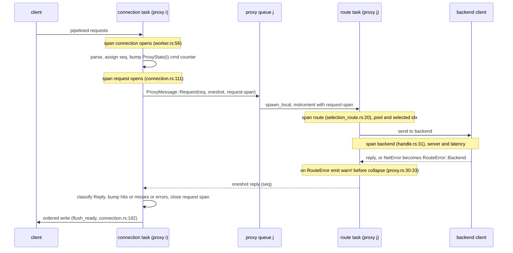

# rusty-mcrouter observability (design)

> Status: **Proposed (2026-06-11)**
> Mirrors: [`../mcrouter/observability.md`](../mcrouter/observability.md) — how mcrouter does it
> Implemented in: `../architecture/observability.md` (once built; **nothing exists yet** — see [`../architecture/overview.md`](../architecture/overview.md))
> Related: [`./threading-model.md`](./threading-model.md) (the per-proxy actor model these counters and spans hang off), [`../mcrouter/backend-client.md`](../mcrouter/backend-client.md) (the backend-latency seam)

How we add observability — structured logs, spans, and metrics — to rusty-mcrouter
in a way that is **cheap on the hot path** and **faithful to real mcrouter's
model**. Read the [mcrouter reference](../mcrouter/observability.md) first; this
doc assumes it and only describes our side.

---

## the two questions up front

**"Can we use tokio's `tracing` crate?"** Yes — and we should. `tracing` is
maintained by the tokio-rs org and is the idiomatic instrumentation layer for an
async Rust service. Critically for us, it is **pay-for-what-you-use**: a span or
event at a callsite nobody is subscribed to is a static-level check plus an
interest check, and the span/event is never constructed. That means we can
litter the hot path with instrumentation and compile/​filter most of it away in
production.

**"How do we stay faithful to mcrouter?"** mcrouter's whole observability design
is *per-proxy-thread state, mutated lock-free, aggregated off-thread or at read
time* (see the [reference](../mcrouter/observability.md)). rusty-mcrouter is
already **thread-per-core**: `main()` spawns one OS thread per proxy, each running
its own `current_thread` Tokio runtime + `LocalSet` (`proxy/thread.rs:15-21`).
That topology maps onto mcrouter's per-proxy model almost exactly, so the
faithful design is the natural one: **one counter shard per proxy thread, relaxed
atomics, aggregated when someone reads.**

### recommended stack

| Crate | Version | Role |
|---|---|---|
| `tracing` | `0.1` | spans + events; `#[instrument]`; the hot-path API |
| `tracing-subscriber` | `0.3` | `Registry` + layers: `fmt` (incl. `json`), `EnvFilter`, optional `reload` |
| `metrics` *or* hand-rolled `ProxyStats` | `0.24` | counters/gauges/histograms — see the decision in §3 |
| `metrics-exporter-prometheus` | `0.18` | optional Prometheus scrape endpoint |
| `tracing-opentelemetry` | `0.33` | optional distributed spans (the `FBTrace` analogue) |

Everything except `tracing` + `tracing-subscriber` is optional and lands later.

---

## goal

Turn the **three `// todo - logger` markers** (`proxy/worker.rs:42`,
`proxy/worker.rs:58`, `net/src/server.rs:55`) and the scattered `eprintln!`s into
a real, structured, level-filtered observability layer, and add the two things
mcrouter has that we have *nothing* of today:

1. **spans** over the request lifecycle (connection → request → route → backend),
   so a single request's path and timing is reconstructable, and
2. **counters** (request rate, per-command, per-result-class, latency) sharded
   per proxy thread the way mcrouter shards `ProxyStats`, readable via a `stats`
   surface.

…without adding a lock, an allocation, or a syscall to the per-request hot path
when observability is disabled.

## scope / non-goals

In scope:

- the `tracing` subscriber wiring (one global subscriber, set in `main` before
  threads spawn) and `EnvFilter`/`RUST_LOG` control
- connection / request / route / backend **spans** at the real seams
- **structured events** replacing the `todo - logger` sites, recording errors
  *before* they collapse into `Reply::ServerError`
- a **per-proxy `ProxyStats`** counter shard + an aggregate-on-read surface

Out of scope here (tracked elsewhere or deferred):

- **the asynclog spool** — that's a cache-invalidation *durability* feature, not
  observability; separate design if we want it. (The off-thread bounded-writer
  pattern from [the reference §8](../mcrouter/observability.md) is still the model
  if/when we add non-blocking log file output.)
- **the debug FIFO / mcpiper.** `tracing` + a runtime-reloadable `EnvFilter`
  covers most of "snoop a live process" without a bespoke pipe protocol. Revisit
  only if we need raw-byte capture.
- **distributed tracing** (`tracing-opentelemetry`) — wire the spans first; export
  them across services later.
- the **windowed 240×1 s rate bins.** We'll expose monotonic counters first and
  decide whether to replicate mcrouter's bin rotation (see open questions).

---

## starting point (current rusty)

There is **zero** observability today (full as-built detail belongs in
`../architecture/observability.md`; summarized here only to frame the change):

- no `tracing`, `log`, `metrics`, or `prometheus` as a direct dependency in any
  crate (the `tracing`/`log` entries in `Cargo.lock` are transitive via the
  `testcontainers` dev-dependency only — not compiled into the binary).
- all "logging" is 7 ad-hoc `eprintln!`/`println!` calls plus the three
  `// todo - logger` markers the author left at the obvious seams.
- **no counters, no `stats` command, no admin port.** The parser rejects unknown
  commands (`protocol/src/parser/mod.rs`), so `stats` isn't even accepted yet.
- one stdout line is **load-bearing and must not move**: `println!("READY {addr}")`
  (`main.rs:167`) is parsed by `tests/integration.rs` as a startup contract. It is
  *not* a log line — keep it on stdout, outside `tracing`.

The constraint that shapes everything: `main()` is synchronous (`main.rs:56`) and
spawns one OS thread per proxy (`main.rs:107-143`), each a `current_thread`
runtime + `LocalSet` (`thread.rs:15-21`). The per-request pipeline is entirely
thread-local (`Rc<dyn DynRoute>`, `spawn_local`, `!Send`). So:

- a **global** `tracing` subscriber (set once in `main` before the threads spawn)
  is correct and simplest — `tracing`'s dispatcher is global and thread-safe.
- counters must be a **shared, read-from-any-thread** structure even though writes
  are thread-local — i.e. atomics, exactly like mcrouter's `ProxyStats`.

---

## target design

Two pillars, mapped straight onto mcrouter: **`tracing` for spans/events/logs**
(the `ProxyRequestLogger` + `LOG_FAILURE` + `ServiceInfo` story) and **a per-proxy
`ProxyStats` counter shard** (the `stats`/`ProxyStats` story).

```mermaid
flowchart TB
  subgraph THREADS["N proxy threads (current_thread rt + LocalSet)"]
    direction LR
    subgraph PI["proxy i"]
      SP["spans: connection > request > route > backend"]
      EV["events: errors, retries, classified replies"]
      ST["ProxyStats[i] — relaxed-atomic counters"]
    end
  end
  SUB["global tracing subscriber (set in main, pre-spawn): EnvFilter + fmt(json)"]
  STATS["aggregate-on-read: sum ProxyStats[0..N]"]
  OUT1["non-blocking writer thread, off proxy: stderr/json"]
  OUT2["`stats` command  and/or  Prometheus /metrics"]
  SP --> SUB
  EV --> SUB
  SUB --> OUT1
  ST --> STATS --> OUT2
```

### 1. spans over the request lifecycle

Four nested spans, at the seams the current code already exposes (file:line
anchors below). The golden
rule (`tracing`'s own guidance): **never hold a `Span::enter()` guard across an
`.await`** — use `#[instrument]` on async fns or `.instrument(span)` on futures,
which re-enter on each poll and exit on yield.

| Span | Level | Open at | Key fields |
|---|---|---|---|
| `connection` | INFO | `proxy/worker.rs:56` (the `spawn_local(connection.run())`) | peer addr, connection id |
| `request` | DEBUG | `proxy/connection.rs:111` (seq assigned in `drain_input`) → closed after `flush_ready` `:182` | `seq`, command, key (low-cardinality: hashed or first-key) |
| `route` | TRACE | `core/.../selection_route.rs:20` (`SelectionRoute::route`) | `pool` (`pool_route.rs:33`), selected index |
| `backend` | TRACE | `net/src/client/handle.rs:31` (`Client::send`) / `destination_route.rs:16` | server addr, latency |

Because the connection task and the routing task can live on **different threads**
(the cross-thread `ProxyMessage` hop, `proxy/handle.rs` → `proxy/proxy.rs`), the
`request` span won't auto-propagate across the `oneshot`. We carry the span (or
just its id) in `ProxyMessage` and `.instrument()` the route task in
`Proxy::spawn_request` (`proxy.rs:29`) so the route/backend spans nest under the
originating request. (This is our analogue of mcrouter threading the
`RequestLoggerContext` through the fiber.)

`#[instrument]` usage is `skip_all` by default for us — request/connection structs
are large and we never want them `Debug`-formatted on the hot path; we add back
only the cheap, low-cardinality fields explicitly.

### 2. events: logs at the seams, errors *before they vanish*

The single most important faithfulness/correctness point. Per-request errors are
**collapsed into `Reply::ServerError` at two seams** and the typed `RouteError` is
gone after that:

- `route_one` — `proxy/connection.rs:209-216` (`unwrap_or_else(|_| Reply::ServerError(...))`)
- `Proxy::spawn_request` — `proxy/proxy.rs:30-33` (same collapse, cross-thread path)

So we emit a `tracing::warn!`/`error!` event **at those two points, before the
`unwrap_or_else`**, with the real `RouteError` (`Backend(NetError)` vs
`SelectorOutOfRange`). After the collapse the detail is unrecoverable.

A second subtlety from the reference: **semantic backend failures are not Rust
errors.** `Reply::Error` / `ClientError` / `ServerError` are first-class `Reply`
variants (`protocol/src/reply.rs:25-27`), so a faithful "result class" counter
(mcrouter's `result_*` families) must classify the **`Reply` value** in
`flush_ready`/`route_one`, not just `Result::Err`.

The three `// todo - logger` sites become real events:

| Site | Was | Becomes |
|---|---|---|
| `proxy/worker.rs:42` | `eprintln!` socket re-register failure | `warn!(target: "conn", error = %e, "failed to register accepted socket")` |
| `proxy/worker.rs:58` | `eprintln!` per-connection error sink | `warn!(target: "conn", error = %e, "connection ended with error")` |
| `net/src/server.rs:55` | `eprintln!` transient accept error | `warn!(target: "accept", error = %e, "transient accept error")` |

Failure categories map onto `tracing` `target` + `Level` (our `LOG_FAILURE`
analogue); the existing per-crate `thiserror` enums (`RouteError`, `NetError`,
`ProtocolError`, `ConfigError`, `BuildError`) are recorded with `error = %e` /
`error = ?e`. `NetError`'s manual `Clone` (`net/src/lib.rs`) means we can record it
without moving it if needed.

### 3. counters: a per-proxy `ProxyStats` shard

Mirror mcrouter's `ProxyStats` directly. Each proxy thread owns one shard; a
shared `Arc<[ProxyStats]>` lets a reader sum across shards. Writes are **relaxed**
atomics (the thread only touches its own shard); the cross-thread read on scrape
is the only contention, and it's rare.

```rust
// one shard per proxy thread; counters are AtomicU64, written only by the
// owning thread with Relaxed ordering (mcrouter's stat_incr), summed on read.
#[derive(Default)]
pub struct ProxyStats {
    pub cmd_get:    AtomicU64,
    pub cmd_set:    AtomicU64,
    pub cmd_delete: AtomicU64,
    pub hits:       AtomicU64,
    pub misses:     AtomicU64,
    pub errors:     AtomicU64,   // RouteError collapses (the seam in §2)
    pub backend_err: AtomicU64,
    // latency: a small histogram or an EWMA (mcrouter's ExponentialSmoothData)
}

impl ProxyStats {
    #[inline]
    pub fn incr(c: &AtomicU64) {                  // == mcrouter ProxyStats::increment
        c.store(c.load(Ordering::Relaxed) + 1, Ordering::Relaxed);
    }
}

#[derive(Clone)]
pub struct StatsHandle {
    shards: Arc<[ProxyStats]>,   // len == num_proxies
    id: usize,                   // this thread's shard index
}
```

Each proxy thread bumps `shards[id]` only — no contention, matching mcrouter's
"each proxy writes only its own array." The bump sites are the same hot-path
anchors: command counters in `drain_input` (`connection.rs:111`), result-class +
error counters where we classify the `Reply` (`route_one`/`flush_ready`), backend
errors at `ClientConnection::fail_all_pending` (`net/.../connection.rs:119`).

> **Decision (idiomatic vs faithful).** The `metrics` crate (`counter!`,
> `histogram!`) is the idiomatic Rust choice and its default storage is already
> sharded atomics — less code, a ready Prometheus exporter. The hand-rolled
> `ProxyStats` above is *more faithful* (explicit per-proxy shards, the
> `increment`/`incrementSafe` distinction, room for in-process peak capture if we
> ever need it) and has zero abstraction on the hot path. **Lean: hand-rolled `ProxyStats` for the core
> counters** (it's the whole point of "faithful to mcrouter"), with the `metrics`
> crate reserved for anything we'd rather not re-derive. Revisit if the shard
> bookkeeping outgrows its value.

### 4. exposing stats: aggregate **on read** — there is no aggregator thread

First, kill a misconception (the [reference](../mcrouter/observability.md) §2
spells it out): mcrouter's 1 Hz background thread does **not** sum the shards — it
only rotates each proxy's *windowed bins*. The cross-proxy **sum happens at read
time**. We don't keep the windowed bins (Prometheus stores the time series for us
— see the open questions), so **we need no background aggregator thread at all.**
"Aggregation" is just a loop over the shards that runs *when something reads*:

```rust
// runs on the reader, on demand — not on a clock, not on a dedicated thread
fn snapshot(shards: &[ProxyStats]) -> Totals {
    let mut t = Totals::default();
    for s in shards {                                 // num_proxies × num_counters
        t.cmd_get += s.cmd_get.load(Ordering::Relaxed); // ~hundreds of loads, ~every 15s
        // ...sum the rest...
    }
    t
}
```

So: proxy threads bump their own shard; whatever serves the read sums the shards
on the spot; Prometheus stores the series and computes `rate()` / `max_over_time()`
at query time. Summing `num_proxies × num_counters` once per scrape is noise.

**Where does the read surface live?** Three options, faithful → idiomatic:

1. **A dedicated admin task/thread serving `/metrics`** — *recommended*. A small
   **non-proxy** thread (or task) owns the shared `Arc<[ProxyStats]>`, runs a tiny
   HTTP listener, and renders Prometheus text on scrape. It never routes requests —
   which is exactly faithful to mcrouter, whose stats/logging and config-reload
   work also lives on **auxiliary** threads, not the proxies (see the reference's
   "threads that shape all of this"). Clean separation, no protocol change, gives
   Prometheus directly. **Build this one.**
2. **The `metrics-exporter-prometheus` built-in listener** — least code: the
   exporter installs a global recorder and spawns its own HTTP server. Caveat: the
   `metrics` crate's default storage is a *single shared atomic per counter*, so
   you lose the per-thread sharding (back to the contended increment from §3)
   unless you wire a custom recorder over our shards. Convenience vs. the whole
   point of sharding — usually not worth it here.
3. **A faithful memcache `stats` command** — no HTTP, no new dep: add a `stats`
   verb to the parser (`protocol/src/parser/mod.rs` rejects unknown verbs today)
   and a handler that sums the shards and writes `STAT <name> <value>\r\n … END\r\n`
   back over the existing client connection. Most faithful to real mcrouter;
   doesn't give Prometheus directly, but a textfile-exporter bridge can scrape it.

We don't have to copy mcrouter to the letter where its design is an artifact of
its era. Option 1 keeps the genuinely good idea — per-thread shards, read by an
**auxiliary non-proxy thread** — and drops the parts we don't need (the
bin-rotation thread, the self-contained pre-computed rates) because Prometheus
already does them. Option 3 stays on the table if we later want the literal
mcrouter surface; they can coexist (both just sum the same shards).

### 5. the subscriber + a non-blocking writer (the `AsyncWriter` analogue)

This is the part that answers "does anything *write* on a proxy thread?" — and by
default, **yes, it would.** `tracing_subscriber::fmt` writes **synchronously, on
the thread that emitted the event**, even to stderr. A bare `warn!()` on a proxy
thread is a formatting pass *plus a `write()` syscall, inline on the hot loop* —
exactly mcrouter's forbidden case (the [reference](../mcrouter/observability.md)
keeps all blocking writes off the proxies via `AsyncWriter`).

The fix is `tracing-appender`'s `non_blocking` writer, which is structurally the
same thing as mcrouter's `AsyncWriter`: a **dedicated background worker thread**
plus a **bounded, lock-free, drop-on-full queue**. The proxy thread hands off
bytes; the worker thread does the actual write. No log `write` syscall ever runs
on a proxy thread, and under pressure the queue **drops rather than blocks**
(configurable — but blocking would defeat the point, so we keep it lossy).

```rust
// main.rs, BEFORE the proxy threads spawn (around main.rs:56, ahead of :107).
use tracing_subscriber::{fmt, EnvFilter, prelude::*};

// dedicated worker thread + bounded drop-on-full queue  ≈  mcrouter AsyncWriter
let (writer, _guard) = tracing_appender::non_blocking(std::io::stderr());
// _guard MUST stay alive for the whole program (hold it in main), or buffered
// log lines are lost when it drops at shutdown.

let filter = EnvFilter::try_from_default_env()              // RUST_LOG
    .unwrap_or_else(|_| EnvFilter::new("info"));
tracing_subscriber::registry()
    .with(filter)
    .with(fmt::layer().json().with_writer(writer))          // structured + off-thread
    .init();
```

A single global subscriber is shared by every proxy thread (the dispatcher is
global). `EnvFilter`/`RUST_LOG` is our live verbosity knob — the analogue of
mcrouter's `verbosity` ServiceInfo command; add `tracing_subscriber::reload` if we
want to retune it without a restart.

**One honest difference from mcrouter.** `non_blocking` offloads the *write*, not
the *formatting* — the event is still formatted on the proxy thread before it's
queued. mcrouter offloads both, but only because its hot path does **zero**
formatting (it bumps counters; §3). Our equivalent discipline is the same: keep
the hot path to counter bumps and sparse events, and lean on level filtering (§6)
so per-request DEBUG/TRACE events are never even *constructed* in production. Net:
in prod only rare INFO/WARN/ERROR events are formatted on a proxy thread, and
their I/O is offloaded — the invariant holds.

And note what we **don't** need a writer thread for: **stats**. Because metrics are
**pull**-based (§4), there is no periodic stats-file dump like mcrouter's
`McrouterLogger` — Prometheus scrapes on demand. So this log writer is the *only*
off-thread writer in the whole design.

### 6. keeping the hot path cheap

- **Compile-time ceiling.** Set `tracing`'s `release_max_level_info` (cargo
  feature) so TRACE/DEBUG callsites — our `route`/`backend`/`request` spans —
  compile to nothing in release builds unless we deliberately rebuild with them on.
  Dev builds keep them.
- **Cheap-when-disabled.** With no interested subscriber, a span/event is a static
  level check + interest check; nothing is constructed. Counters are a single
  relaxed add. So the default (INFO) production config pays ~nothing for the TRACE
  spans.
- **No formatting on the hot path.** `#[instrument(skip_all)]` + explicit
  low-cardinality fields; never `Debug`-format a request/reply per call.
- **Cardinality discipline.** Span fields are bounded sets (command, pool,
  result-class). The cache *key* is high-cardinality — never a label; at most a
  hashed/truncated field on the DEBUG `request` span.
- **No blocking I/O on a proxy thread.** Log output goes through the
  `tracing-appender` non-blocking writer (§5) — the `AsyncWriter` analogue, so the
  `write` syscall runs on a dedicated worker thread, never inline on a proxy.

---

## how this maps to mcrouter

| mcrouter | rusty |
|---|---|
| per-proxy `ProxyStats` (relaxed atomics) | `Arc<[ProxyStats]>`, each thread writes its own shard with `Relaxed` |
| `ProxyStats::increment` vs `incrementSafe` | `Relaxed` store vs `fetch_add` (only if a non-owning thread writes) |
| 1 Hz `updateStats` thread (rotates each proxy's *own* bins) | **dropped** — no background aggregator thread; Prometheus stores the series |
| cross-proxy sum at read (`stats_aggregate_rate_value`) | sum the shards in the scrape handler, on demand |
| 240×1 s rate bins → pre-computed rates | monotonic counters + Prometheus `rate()`; bins only if we need sub-scrape peaks |
| `stats_reply` / `McrouterLogger` snapshot files | dedicated non-proxy `/metrics` admin task (§4 option 1), optional `stats` command |
| `McrouterLogger` periodic stats-file dump | **dropped** — metrics are pull (§4); no periodic stats writing at all |
| structured log output (glog / JSON sinks) | `tracing-subscriber` `fmt().json()` over the non-blocking writer (§5) |
| `ProxyRequestLogger` (hot-path counters + EWMA) | per-reply counter bumps + latency histogram in `route_one`/`flush_ready` |
| `AdditionalProxyRequestLogger` (heavy, sampled) | sampled DEBUG events / `tracing-opentelemetry` spans |
| `LOG_FAILURE` + `failure::Category` (rate-limited) | `tracing::warn!/error!` with `target` + `Level`; the typed `thiserror` as `error=%e` |
| `RequestLoggerContext` threaded through the fiber | the `request` span carried in `ProxyMessage`, `.instrument()`-ed on the route task |
| `ServiceInfo` `route` / `route_handles` | future: a `route_handles` admin command walking `DynRoute` (a `RouteHandleTraverser` analogue) |
| `FBTrace` distributed tracing + sampling | `tracing-opentelemetry` `OpenTelemetryLayer` (later) |
| debug FIFO + `mcpiper` | runtime-reloadable `EnvFilter` + per-connection DEBUG spans (no bespoke pipe) |
| `AsyncWriter` (dedicated thread, bounded drop-on-full queue) | `tracing-appender` `non_blocking` — dedicated worker thread, bounded drop-on-full queue (the direct analogue; §5) |
| asynclog spool | out of scope (durability, not observability) |

---

## instrumented request lifecycle (target)



---

## implementation order

1. **Subscriber + replace the eprintln/todo-logger sites.** Add `tracing` +
   `tracing-subscriber` to the workspace deps (`Cargo.toml`); install the global
   subscriber in `main` before the spawn loop; convert the three `todo - logger`
   sites and the `eprintln!`s to `tracing` events. **Leave `println!("READY …")`
   alone.** Lowest-risk, immediate value, no hot-path change.
2. **Connection + request spans.** `#[instrument(skip_all)]` the connection task;
   open the `request` span at the `seq` assignment; verify no span guard is held
   across an `.await`. Carry the span across the `ProxyMessage` hop and
   `.instrument()` the route task.
3. **`ProxyStats` shard + hot-path counters.** Add the `Arc<[ProxyStats]>`, thread
   one shard into each proxy thread, bump command counters in `drain_input` and
   result-class/error counters at the two collapse seams + `flush_ready`.
4. **Read surface (no aggregator thread).** Stand up a dedicated **non-proxy**
   admin task that owns the `Arc<[ProxyStats]>` and serves `/metrics`, summing the
   shards on scrape (§4 option 1). The faithful memcache `stats` command (option 3)
   is an optional later add-on.
5. **route + backend spans + latency histogram.** TRACE-level, compiled out in
   release by default; latency recorded at the `backend` span.
6. **Optional, later.** `reload` layer for live verbosity; `tracing-opentelemetry`
   for distributed spans; windowed rate bins if monotonic counters prove
   insufficient.

---

## open questions / decisions

- **Counters: `metrics` crate vs hand-rolled `ProxyStats`?** Lean hand-rolled for
  faithfulness and hot-path control (see §3). Decide before step 3 — it's hard to
  swap later.
- **Windowed rates/peaks? (resolved)** Export **monotonic** counters and let
  Prometheus compute `rate()` — *no* in-process bins, *no* aggregator thread (§4).
  The one thing Prometheus can't do is catch **sub-scrape peaks** (mcrouter's
  `max_stats`); if we ever need peak inflight/pending, add a histogram or a
  max-since-scrape gauge then — not the 240-bin ring.
- **Where does the read surface live? (leaning option 1)** A dedicated non-proxy
  admin task serving `/metrics` (§4 option 1) — faithful to mcrouter's auxiliary
  threads, gives Prometheus directly, no protocol change. The memcache `stats`
  command (option 3) stays available as a later add-on and can coexist. Confirm the
  admin port/bind is acceptable in this deployment.
- **Span propagation across the cross-thread hop.** Carrying the `request` span in
  `ProxyMessage` couples observability into the actor envelope (`proxy/message.rs`).
  Acceptable? The alternative is independent per-thread spans linked by a request
  id field (looser, cheaper).
- **Key cardinality.** Confirm we never emit raw cache keys as span fields/labels;
  at most a hashed or `hash_stop`-truncated form on a DEBUG span.
- **Subscriber init vs the `READY` contract.** The subscriber must be live before
  any thread logs, but stdout's `READY {addr}` line stays outside `tracing`. Keep
  them strictly separated so log formatting can never corrupt the test contract.

---

## done when

- A global `tracing` subscriber is installed once in `main` (pre-spawn) and is
  controllable via `RUST_LOG`/`EnvFilter`; `release_max_level_info` is set.
- The three `// todo - logger` sites and the `eprintln!`s are replaced with
  structured `tracing` events — **except** `println!("READY {addr}")`, which stays
  a stdout contract (and `tests/integration.rs` still passes).
- `connection` and `request` spans exist (with `route`/`backend` at TRACE), and a
  grep confirms **no `Span::enter()` guard is held across an `.await`**.
- Per-request errors are recorded **before** the `RouteError → Reply::ServerError`
  collapse (`connection.rs:209-216`, `proxy.rs:30-33`), and reply *outcomes* are
  classified from the `Reply` variant, not just `Result::Err`.
- A per-proxy `ProxyStats` shard exists; hot-path bumps are `Relaxed` writes to the
  owning thread's shard only (no cross-thread contention on increment).
- A read surface returns counters summed across shards **on demand** — a dedicated
  non-proxy admin task serving `/metrics`, with **no perpetual aggregator thread**.
- Log output goes through a non-blocking writer (`tracing-appender`, the
  `AsyncWriter` analogue): **no log `write` syscall runs on a proxy thread**, the
  queue drops rather than blocks under pressure, and the `WorkerGuard` is held in
  `main` for the program's lifetime.
- `lsp_diagnostics` / `clippy` clean, and there are tests for stats aggregation
  across shards (the suite has none today).
