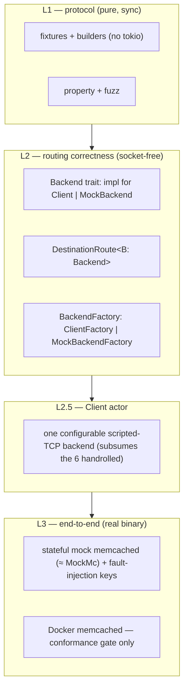

# rusty-mcrouter testing strategy (design)

> Status: **Proposed (2026-06-12)**
> Mirrors: real mcrouter's three-layer test design. There is **no** `../mcrouter/testing.md` (testing isn't a single mcrouter "concept" like multiget); this doc cites the mcrouter tree directly — `mcrouter/lib/test/RouteHandleTestUtil.h`, `mcrouter/lib/network/test/MockMc.*`, `mcrouter/test/MCProcess.py`. A `../mcrouter/testing.md` write-up could follow if we want the full mirror (see open questions).
> Implemented in: `../architecture/testing.md` (once built; **nothing exists yet**)
> Related: [`../architecture/backend-client.md`](../architecture/backend-client.md) — the concrete `Client` we put a trait over; [`./hash-routing.md`](./hash-routing.md) + [`../architecture/multiget.md`](../architecture/multiget.md) — the route/builder tests that go socket-free; [`./observability.md`](./observability.md) — shares the "faithful to mcrouter, cheap, in-process" framing.

Why our testing situation is bad today, and the layered fix: a `Backend` trait seam
to make routing tests socket-free, a stateful in-process mock memcached for
end-to-end, and a cleanup of the protocol suite. The design is modeled on how real
mcrouter tests — read the mcrouter citations inline; this doc assumes them and
describes our side.

---

## tl;dr

- The suite is **280 tests but structurally lopsided**: ~49% sit in the protocol
  parser (with ~15 genuinely redundant), the **routing layer is forced onto real
  TCP sockets**, and "integration" is two disconnected things — config-parse
  fixtures and one `#[ignore]`'d Docker suite — **neither of which tests routing
  behavior**.
- **Root cause: `net::Client` is a concrete struct with no trait seam**
  (`rusty-mcrouter-net/src/client/handle.rs`). `DestinationRoute` holds it directly
  (`destination_route.rs:6-8`), so any test that reaches a route must bind a real
  `TcpListener`. The same accept→read→reply idiom is **handrolled 6×**.
- **Config fixtures test config *parsing*, not routing.** `tests/fixtures/*.json`
  carry deliberately-fake addresses (`localhost:PORT`) and route types we can't even
  route (`PrefixSelectorRoute`, `AllSyncRoute` → `RouteHandleConfig::Unknown`). They
  are necessary but, by mcrouter's own design, **not sufficient**.
- **Fix = mirror mcrouter's three layers**:
  1. **protocol** — pure sync fixtures + property + fuzz; collapse the redundant
     parser tests; close real edge gaps.
  2. **routing correctness** — a `Backend` trait + concrete/mock impls, so
     `DestinationRoute` / `PoolRoute` / `build_route` tests run **socket-free**. This
     is mcrouter's `RecordingRoute`/`TestHandle` model.
  3. **end-to-end** — a **stateful in-process mock memcached** (mcrouter's `MockMc`),
     with the existing Docker memcached demoted to a **conformance gate**.
- **Convention decision (binds all new code): explicit generics, NO default type
  parameters.** It is `DestinationRoute<Client>` / `DestinationRoute<MockBackend>`
  and `build_route(cfg, &ClientFactory)` — never `DestinationRoute<B = Client>` and
  never a wrapper that hides the choice. Every call site names the backend it uses.

---

## goal

Make the cheap layers cheap and the right layer authoritative:

- a routing test can assert "key `k` reached backend 2, reply came back, pool shared
  one connection, multiget fanned out in key order" **without opening a socket**;
- the `Client` actor (pipelining / FIFO / EOF / partial reads) is actually covered;
- failure-path routing (timeout → failover, TKO, server error) is testable, which
  today it is not, because a healthy backend can't be told to misbehave;
- the protocol suite proves parser invariants (incremental consume, malformed
  rejection, round-trip) without 11 copies of the same assertion body;
- one stateful mock memcached is the e2e backend, and real memcached (Docker) stays
  as a drift check — not a per-test dependency.

## scope / non-goals

In scope:

- a `Backend` trait in `rusty-mcrouter-net` with `impl Backend for Client` and a
  recording `MockBackend`; `DestinationRoute<B: Backend>` (explicit generic);
- a `BackendFactory` seam in the route builder so `build_route` can construct a
  graph over mock backends with no `Client::connect`;
- protocol test fixtures (sync, plain `#[cfg(test)]`) and the within-crate dedup they enable;
- property + fuzz coverage for the parser; closing the named parser gaps;
- a scripted-TCP harness consolidating the 6 handrolled backends, for `Client` tests;
- a stateful in-process mock memcached for e2e; the Docker suite kept as a gate + CI.

Out of scope / deferred:

- a `run()` library entrypoint to drive the whole router in-process (nice for e2e
  speed; tracked separately — keep ≥1 subprocess smoke test regardless, see §L3);
- replicating mcrouter's fiber `pause()/wait()` latency-injection machinery beyond a
  simple per-reply delay knob on `MockBackend`;
- the binary/meta protocol; rusty is ASCII-only.

---

## starting point (current rusty)

Full as-built detail belongs in `../architecture/testing.md`; summarized here only
to frame the change. **280 test fns** (203 `#[test]` + 77 `#[tokio::test]`) across 32
files; 30 inline `#[cfg(test)]` modules vs only 2 `tests/` dirs. Distribution:
protocol 136 (~49%) ≫ core 54 > bin 45 > config 43 ≫ **net 2**.

### 1. no seam over the backend → handrolled sockets everywhere

`Client` is concrete (`net/src/client/handle.rs`):

```rust
#[derive(Clone)]
pub struct Client { tx: mpsc::Sender<ClientCommand> }   // no trait
```

and `DestinationRoute` holds it directly (`core/src/routes/destination_route.rs:6-8`):

```rust
pub struct DestinationRoute { client: Client }          // concrete leaf
```

So to exercise the route→`Client`→backend path a test **must** bind a real socket.
The `TcpListener::bind("127.0.0.1:0")` + accept + read + write-reply idiom is
handrolled **6 times** in live code:

| location | symbol | note |
|---|---|---|
| `net/src/testing.rs:10` | `mock_backend` | single-shot canned reply |
| `net/src/testing.rs:28` | `looping_mock_backend` | **dead — zero callers** |
| `net/src/testing.rs:56` | `pipelining_mock_backend` | reads N then replies N |
| `core/.../destination_route.rs:74-85` | inline recorder | records bytes + replies `STORED` — **despite the file importing `mock_backend`** |
| `bin/src/proxy/connection.rs:413` | `spawn_connection` | per-connection test rig (own listener) |
| `bin/src/proxy/connection.rs:602` | `keyed_echo_backend` | protocol-aware echo; re-implements `count_terminators` |

The recording pattern is duplicated 3× with three different container types
(`Arc<Mutex<Vec<u8>>>`, `Arc<Mutex<Vec<Bytes>>>`, `Rc<RefCell<Vec<Bytes>>>`). There
is already a trait-level double — `MockRoute` (`connection.rs:347-405`, impl `Route`)
— but it's private to the bin's test module and unshared.

### 2. duplicated helpers (13 clusters)

Headliners (each with exact anchors in the sweep): storage request builder
`fn set/add/append/replace/prepend(...)` **×5 byte-identical**
(`protocol/src/parser/{set,add,append,replace,prepend}.rs`); the
`*_round_trips_with_serializer` assertion body **×11 across 10 files**; `req_get`
**×2 exact** (`destination_route.rs:31`, `route_builder.rs:184`); a config test
`fn parse(json)` **shadowing the public `parse`** in 3 files; **135 inline
`Request{..Bytes::from_static}` constructions** across 22 files. There is exactly one
shared helper module today — `net/src/testing.rs` — and only `core` consumes it.

### 3. protocol: over-tested by duplication, under-tested at the edges

The parser is **whole-buffer, stateless** (`parser/mod.rs:22-25` TODO). ~15 tests are
storage-clone duplicates collapsible to matrices with zero coverage loss
(add/replace/append/prepend × {basic, extra_token, round_trip} all flow through the
same `parse_storage_header`). Meanwhile real gaps go untested:

- **error-consumption asymmetry** — the request path consumes the bad frame before
  erroring (`mod.rs:47`, `shared.rs:68,81`); the reply path never does
  (`reply.rs:32,95,112,126`). Latent today (the only consumer tears the connection
  down), but untested and a resync footgun.
- **unbounded-body memory-DoS** — `set k 0 0 999999999\r\n` is accepted and the
  parser returns `Ok(None)` until the buffer holds it; there is no size cap beyond
  `MAX_KEY_LEN = 250` on *keys* (`shared.rs:7,74-76`, `reply.rs:122-128`).
- **partial-read** coverage exists only for `set` + reply, not the other commands.
- **CAS-accepted-but-ignored** on `VALUE` lines (`reply.rs:110`) has zero tests.
- **no property tests, no fuzz** anywhere — for a byte-protocol parser.

### 4. "integration" is two things, neither testing routing

- `config/tests/fixtures/*.json` + `parse_fixtures.rs` assert the **parsed
  `ConfigDocument`** only. Tells: `basic_1_1_1.json` uses `"localhost:12345"`,
  `memcache_local_config.json` uses `"localhost:PORT"` — fake by design, never
  connected to; several parse into `RouteHandleConfig::Unknown` (`AllSyncRoute`,
  `PrefixSelectorRoute`) the builder can't route at all.
- `rusty-mcrouter/tests/integration.rs` (30 tests, **all `#[ignore]`**) is the only
  real end-to-end path: testcontainers + `memcached:1.6`, spawns the compiled binary,
  scrapes `READY {addr}` (`main.rs:167`). It works but **never runs** (no CI), and a
  dead `RUSTY_MCROUTER_BACKEND` env var is set but never read.

Net: **routing behavior is essentially untested end to end**, and the riskiest
production code — the actor-backed `Client` (pipelining, FIFO matching, EOF, partial
frames) — **has 2 tests**.

---

## what good looks like: how mcrouter splits it (three layers)

mcrouter deliberately separates testing into three layers and **states config
fixtures are not sufficient on their own**. The smoking gun is its own test comment
(`mcrouter/test/test_mcrouter_basic.py`, `TestBasicFailoverLeastFailures` ~line 681):

> "The main purpose of this test is to make sure **LeastFailures policy is parsed
> correctly from json config**. We rely on **cpp tests to stress correctness** of
> LeastFailures failover policy."

| layer | mcrouter | what it proves |
|---|---|---|
| **1. parse/validate** | `lib/config/test/config_preprocessor_test.cpp`, `cpp_unit_tests/pool_factory_test.cpp`, Python `--validate-config` | the JSON parses / is rejected. **(= our config fixtures.)** |
| **2. routing correctness** | ~40 `routes/test/*.cpp` using `RecordingRoute`/`TestHandle` mock leaves, run on an in-process fiber loop (`TestFiberManager`) — **no sockets** | the routing logic picks the right child and shapes the reply |
| **3. end-to-end** | Python `MCProcess.py` launches the real binary against a **stateful** `MockMc` (`lib/network/test/MockMc.cpp`), port-substitutes a JSON config, sends real commands | config → graph → backend works for real |

Two load-bearing facts from the mcrouter tree:

- **The mock leaf implements the *production* interface.** `RecordingRoute`
  (`lib/test/RouteHandleTestUtil.h:272-441`) is wrapped by the same
  `makeRouteHandle<…, RecordingRoute>` factory (`lib/config/RouteHandleBuilder.h:20-24`)
  as the real destination leaf — **not** a parallel mock type. Canned-reply data
  (`GetRouteTestData`) is separate from the recorder (`saw_keys`). Children are
  injected via `get_route_handles()` (`:443-452`).
- **The e2e backend is a stateful fake, not real memcached.** `MockMc` is hashmap-backed
  (`MockMc.h:174 std::unordered_map<std::string, CacheItem> citems_`) with real
  get/set/incr/cas/lease/exptime semantics, and `MockMcOnRequest.h` honors **fault-
  injection magic keys** (`__mockmc__.want_timeout(ms)`, `want_busy`,
  `trigger_server_error`). OSS mcrouter **never runs real memcached** — even the
  `"prodmc"` alias maps to `mock_mc_server` (`test/mcrouter_config.py`). The mock *is*
  the semantic authority, hand-maintained against Meta's fork.

---

## target design

### convention: explicit generics, no defaults

All new generic code uses **explicit type parameters with no defaults**. We do **not**
write `DestinationRoute<B = Client>`, and we do **not** add a convenience wrapper that
hides the backend choice. Every construction and every builder call names the backend:

```rust
DestinationRoute::<Client>::new(client)        // production, explicit
DestinationRoute::<MockBackend>::new(mock)     // test, explicit
build_route(&cfg, &ClientFactory)              // production passes the real factory
build_route(&cfg, &MockBackendFactory::new())  // test passes the mock factory
```

Rationale: a default (`= Client`) makes the *real* networked backend the silent
fallback, so a test that forgets a turbofish quietly compiles against real sockets —
exactly the failure mode we're removing. Explicit generics make every test's backend
visible at the call site and impossible to get by accident.

### the layered shape



### L1 — protocol: sync fixtures + property + fuzz

Add a plain `#[cfg(test)] mod fixtures` **in the protocol crate** — request/`Value`
builders, `serialize<T: SerializeInto>`, `parse_one`, and `assert_request_round_trips`
/ `assert_reply_round_trips`. **No feature flag**: the 5-copy storage builder, the
11-copy round-trip body, and the 2-copy `serialize` helper all live *inside* protocol,
so `#[cfg(test)]` reaches them. The cross-crate-looking duplication isn't — the 2-copy
`req_get` is both copies in `core` (a `#[cfg(test)]` helper there dedupes it), and the
135 inline constructions are each within their own crate. Nothing here crosses a crate
boundary, so nothing here needs a feature (see
[where shared test code lives](#where-shared-test-code-lives-crate-dag-aware) for the
one surface that does).

Then: collapse the 12 storage-clone tests into **one labeled verb→variant matrix**
(the failure output must name the verb), fold `decr`→`incr`. Add `proptest` for
`parse(serialize(x)) == x` over arbitrary keys/binary payloads — **but keep compact
golden tests** for canonical wire forms (property tests can't catch a parser+serializer
sharing the same wrong assumption). Add a `cargo-fuzz` target on `parse_request` /
`parse_reply`. Close the gaps from §3: a parametrized partial-read harness asserting
**both** "incomplete leaves the buffer untouched" **and** "complete consumes exactly
one frame"; a body-size cap + test; a test pinning the reply-parser error path; a
CAS-ignored test.

### L2 — routing correctness: the `Backend` trait + factory

**The trait lives in `net`** (alongside `Client`). It must, because `core` depends on
`net` — a trait in `core` could never be implemented by `net::Client` without a
dependency cycle.

```rust
// rusty-mcrouter-net — mirrors the existing `Route`/`DynRoute` `impl Future` style
pub trait Backend: 'static {
    fn send(&self, req: Request) -> impl Future<Output = Result<Reply>>;
}

impl Backend for Client {                      // the real one
    async fn send(&self, req: Request) -> Result<Reply> { Client::send(self, req).await }
}

// rusty-mcrouter-net/src/testing.rs (behind the existing `testing` feature)
pub struct MockBackend { /* scripted replies + RefCell<Vec<Request>> recorder */ }
impl Backend for MockBackend { /* records req, returns canned Reply/error/delay */ }
```

`DestinationRoute` becomes generic over `B: Backend` — **no default**:

```rust
// rusty-mcrouter-core
pub struct DestinationRoute<B: Backend> { backend: B }
impl<B: Backend> DestinationRoute<B> { pub fn new(backend: B) -> Self { Self { backend } } }
impl<B: Backend> Route for DestinationRoute<B> {
    async fn route(&self, req: Request) -> Result<Reply> {
        self.backend.send(req).await.map_err(RouteError::from)
    }
}
```

`MockBackend` is our `RecordingRoute`/`TestHandle`: same trait as the real leaf,
canned data separated from the recorder. Most route tests now drop TCP entirely.

**The builder needs a construction seam too**, or `build_route` still calls
`Client::connect` (`route_builder.rs:136`) and builder tests still bind sockets. Add a
`BackendFactory` (also in `net`):

```rust
// rusty-mcrouter-net
pub trait BackendFactory {
    type Backend: Backend;
    async fn connect(&self, addr: &str) -> Result<Self::Backend, NetError>;
}
pub struct ClientFactory;                                   // real
impl BackendFactory for ClientFactory {
    type Backend = Client;
    async fn connect(&self, addr: &str) -> Result<Client, NetError> { Client::connect(addr).await }
}
// net/src/testing.rs: MockBackendFactory → type Backend = MockBackend; never touches the network
```

`build_route` takes the factory **explicitly** (no default, no hidden wrapper):

```rust
pub async fn build_route<F: BackendFactory>(
    config: &ConfigDocument, factory: &F,
) -> Result<Rc<dyn DynRoute>> { /* RouteBuilder<'_, F>; get_or_build_destinations uses factory.connect */ }
```

The generic `F::Backend` threads through `RouteBuilder`, `get_or_build_destinations`,
`build_pool_handle`, and `PoolRoute::new<B: Backend>` — then **erases to
`Rc<dyn DynRoute>`** at `build_pool_handle` (the existing `d as Rc<dyn DynRoute>`
coercion, `pool_route.rs:24`). So `B`/`F` never escape the builder; `SelectionRoute`,
`NullRoute`, the route graph, and the proxy are untouched. The two production call
sites (`thread.rs:70`, the bin test at `connection.rs:654`) gain an explicit
`&ClientFactory` argument — consistent with the no-defaults rule.

Leave the bin's `MockRoute` (`connection.rs:347`) where it's used, under `#[cfg(test)]`
— don't promote it to `core` (that's the same cross-crate trap: a `#[cfg(test)]` copy
in `core` wouldn't be visible to `bin`'s tests, and a *second* `testing`-style feature
isn't worth it). If `core` ever needs an in-memory `Route` *child* (e.g. a future
`FailoverRoute`), it gets its own `#[cfg(test)]` double; its leaf tests already use
`DestinationRoute<MockBackend>`, and `NullRoute`/`ErrorRoute` are real routes it can
compose.

### L2.5 — the `Client` actor: one scripted-TCP harness

This is the real socket layer and the biggest coverage hole. Consolidate the 6
handrolled backends into **one configurable scripted-TCP backend** in `testing.rs`
(fixed reply, reply-per-frame, read-N-then-reply-N, chunked/partial writes,
protocol-aware echo, request recording) — subsuming `mock_backend`, the dead
`looping_mock_backend`, `pipelining_mock_backend`, `keyed_echo_backend`, the inline
recorder, and the historical `mock_backend_chunked`. Then write the missing `Client`
tests against it: pipelining, FIFO reply matching, EOF / `fail_all_pending`, partial
frames, malformed-reply teardown, backpressure.

### L3 — end-to-end: stateful mock memcached + Docker as a gate

Build a **stateful in-process mock memcached** (our `MockMc`): a `HashMap<String, Item>`
with `Item { value, flags, exptime, cas }`, implementing get/set/add/replace/append/
prepend/incr/decr/delete/touch with correct `STORED`/`NOT_STORED`/`NOT_FOUND`/
`DELETED` semantics and lazy exptime eviction, plus **fault-injection magic keys**
(`__rusty__.want_timeout(ms)`, `want_error`, …) mirroring `MockMcOnRequest.h`. This is
what makes failover/timeout/TKO routing testable — a healthy Docker memcached cannot
be told to hang. Expose it as an in-process server bound on `127.0.0.1:0` for Rust
tests (and, later, a spawnable binary for a Python-style harness).

**Keep the existing testcontainers Docker suite**, but reframe it as a small
**conformance gate**: run the *same* assertions against both the mock and real
memcached so the mock can't silently drift (mcrouter sidesteps drift by owning its
memcached fork; we don't, so this gate is our substitute). Wire a CI job that runs the
Docker suite. Remove the dead `RUSTY_MCROUTER_BACKEND` env var.

### where shared test code lives (crate-DAG-aware)

Principle: **`#[cfg(test)]` for any helper used within its own crate; a `testing`
feature only where a helper must cross a crate boundary.** `#[cfg(test)]` is *not*
active for a crate compiled as a dependency — when `core`'s tests build, `net` is an
ordinary dep with `cfg(test)` off — so a cross-crate helper gated by `#[cfg(test)]`
simply isn't visible. Exactly one surface here crosses a boundary.

| support code | home | gating | why |
|---|---|---|---|
| request/`Value` builders, round-trip + parse helpers | `protocol` | `#[cfg(test)]` | used only by protocol's own tests; the big within-protocol dedup |
| `Backend` + `BackendFactory` traits; `Client`/`ClientFactory` | `net` | none (normal `pub`) | production API; `Backend` must be in `net` (`core → net`, so a `core` trait can't be impl'd by `Client` — cycle) |
| `MockBackend` / `MockBackendFactory`; scripted-TCP harness; mock memcached | `net/src/testing.rs` | **`feature = "testing"`** | **the one cross-crate case**: `core`'s routing tests consume these, and `#[cfg(test)]` can't reach across the `core → net` edge. Already wired (`core` dev-deps `net` with `features=["testing"]`) |
| `MockRoute` in-memory `Route` double | `bin` (where it's used) | `#[cfg(test)]` | per-crate test helper; intentionally **not** shared — a `core` copy stays its own `#[cfg(test)]` if ever needed, rather than a second feature |

The lone feature is the one `net` already has. The only way to drop even that is a
dedicated `rusty-mcrouter-test-support` crate (a normal dev-dependency — no feature, no
`#[cfg(test)]` boundary problem), but that's a whole new crate for one seam; not worth
it. **Feature-leak mitigation:** resolver v2 is already on, so the dev-dep `testing`
feature doesn't reach release builds; keep it non-default and add a release-CI build
*without* it to prove it.

---

## how this maps to mcrouter

| mcrouter | rusty |
|---|---|
| `RecordingRoute` / `TestHandle` (mock leaf, real `RouteHandleIf`) | `MockBackend` (`impl Backend`, the real trait) |
| `makeRouteHandle<…, RecordingRoute>` wraps the mock as a real leaf | `DestinationRoute::<MockBackend>::new(mock)` — same `DestinationRoute`, explicit generic |
| `GetRouteTestData` (canned) separate from `saw_keys` (recorder) | `MockBackend { replies, recorded: RefCell<Vec<Request>> }` |
| `get_route_handles(vec)` child injection | building `Vec<Rc<DestinationRoute<MockBackend>>>` for `PoolRoute::new` |
| `TestFiberManager` + `SimpleLoopController` (in-process, no sockets) | current-thread runtime / `block_on` on a `LocalSet` |
| `MockMc` (stateful hashmap, real semantics) | stateful in-process mock memcached |
| `MockMcOnRequest` `__mockmc__.*` fault keys | `__rusty__.*` fault-injection keys |
| `MCProcess.py` port-substitution + real binary | testcontainers/Docker e2e (kept as conformance gate) + future in-process harness |
| config-as-fixture (Python) | `tests/integration.rs` (config written, ports substituted) |
| "parse correct in json; rely on cpp tests for correctness" split | L1 config fixtures vs L2 routing-correctness tests — same split |
| OSS uses mock, not real memcached (`prodmc` == `mockmc`) | mock memcached is primary; Docker memcached is the drift gate (we don't own a fork) |

---

## what we delete / merge

- **Delete:** dead `looping_mock_backend` (`testing.rs:28`); the 3 config `parse`
  shadows (`document.rs:162`, `pool.rs:17`, `route.rs:151`); the inline recorder
  (`destination_route.rs:74-85`).
- **Collapse:** 12 storage-clone parser tests → 1 labeled matrix; `decr`→`incr`; 11
  `*_round_trips_with_serializer` → 1 helper; 5 storage builders → 1; 2 `req_get` → 1;
  2 `Value` builders → 1; **6 handrolled TCP backends → 1** scripted harness; 7
  `connect+new` blocks → a `connected_route` helper.
- **Net:** ~28-30 redundant helper/test definitions collapse to ~10 shared ones.

---

## implementation order

Risk-first, not just easy-first (steps 1, 2, 4 are largely independent):

1. **Zero-risk cleanup (L1 fixtures).** Protocol fixtures + matrix collapse; delete
   dead code; drop config `parse` shadows. No production change. `cargo`/clippy green.
2. **`Client` coverage (L2.5).** The scripted-TCP harness + the missing `Client`
   actor tests. Highest risk-reduction; do it early.
3. **`Backend` trait + `BackendFactory` + `MockBackend` (L2).** Explicit generics, no
   defaults; thread `B`/`F` through the builder; flip route/builder tests socket-free.
4. **Protocol property + fuzz + gap closure (L1 depth).** proptest, cargo-fuzz, the
   partial-read harness, the body-size cap, the reply-asymmetry and CAS tests.
5. **Stateful mock memcached + Docker conformance gate + CI (L3).** Mock memcached
   with fault keys; same-assertion gate against real memcached; CI job; drop the dead
   env var.
6. **Docs.** Write `../architecture/testing.md` (as-built) and flip this to Implemented.

---

## open questions / decisions

- **Explicit generics, no default type params (decided — house rule).** No
  `<B = Client>`, no hidden wrapper; every call site names the backend (see the
  convention section). The one cost is an explicit `&ClientFactory` at the two
  production `build_route` call sites — accepted.
- **Stateful mock memcached vs Docker (decided: build the mock; keep Docker as a
  gate).** This **revises** an earlier lean toward "don't build a stateful mock, use
  Docker as the oracle." The mcrouter reference is decisive: it ships a stateful
  `MockMc` and never runs real memcached, and the mock is *required* to test
  timeout/failover/TKO (fault injection a healthy backend can't do). We add the
  conformance gate precisely because, unlike Meta, we don't own a memcached fork.
- **Generic `DestinationRoute<B>` vs `Rc<dyn Backend>` (decided: generic).** The
  route graph is already erased behind `Rc<dyn DynRoute>`, so genericizing only the
  leaf avoids a second dynamic-dispatch layer and a boxed future on the hot path. Add
  a `DynBackend` only if heterogeneous backend collections ever appear.
- **`#[cfg(test)]` vs feature flags (decided: `#[cfg(test)]` everywhere single-crate).**
  Plain `#[cfg(test)]` for all within-crate helpers; the only feature is the one `net`
  already carries, because its mocks back `core`'s tests and `#[cfg(test)]` can't cross
  a crate boundary. A dedicated `test-support` crate is the only way to drop even that
  one — not worth a new crate for a single seam.
- **Keep `Send` off the backend futures (decided: yes).** The runtime is
  current-thread + `LocalSet` + `Rc`; `Backend`/`BackendFactory` mirror `Route`'s
  non-`Send` `impl Future` style.
- **Write `../mcrouter/testing.md` and `../architecture/testing.md` mirrors? (open).**
  This doc cites the mcrouter tree directly; a full mcrouter write-up + the as-built
  architecture doc can follow the implementation.
- **A `run()` library entrypoint for in-process e2e? (open, deferred).** Would let e2e
  bind the router in-process and drop the subprocess + `READY`-scrape — but keep ≥1
  subprocess smoke test regardless (it's the only thing covering the real binary, CLI,
  config-file load, and panic hook).

---

## done when

- `net` exposes a `Backend` trait with `impl Backend for Client` and a recording
  `MockBackend`; `DestinationRoute<B: Backend>` has **no default type param**, and
  every call site names its backend explicitly.
- `build_route<F: BackendFactory>(config, factory)` takes the factory explicitly;
  `route_builder` / `pool_route` / `destination_route` tests build and route over
  `MockBackend` with **no `TcpListener`**.
- The 6 handrolled TCP backends are replaced by one configurable scripted-TCP harness,
  and the `Client` actor has real tests (pipelining, FIFO, EOF, partial frames).
- Protocol fixtures live in a plain `#[cfg(test)] mod fixtures` (no feature); the
  storage-clone tests are one labeled matrix; proptest + a cargo-fuzz target run; the
  partial-read, body-size-cap, reply-asymmetry, and CAS gaps are closed; golden wire
  tests retained.
- A stateful in-process mock memcached (with fault-injection keys) backs e2e/routing
  tests; the Docker memcached suite runs in CI as a conformance gate over the same
  assertions; the dead `RUSTY_MCROUTER_BACKEND` env var is gone.
- `lsp_diagnostics` / `clippy` clean; `../architecture/testing.md` written and this
  doc flipped to Implemented.
