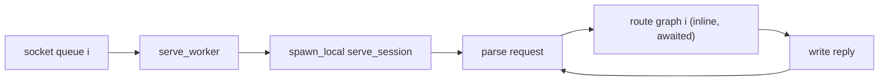
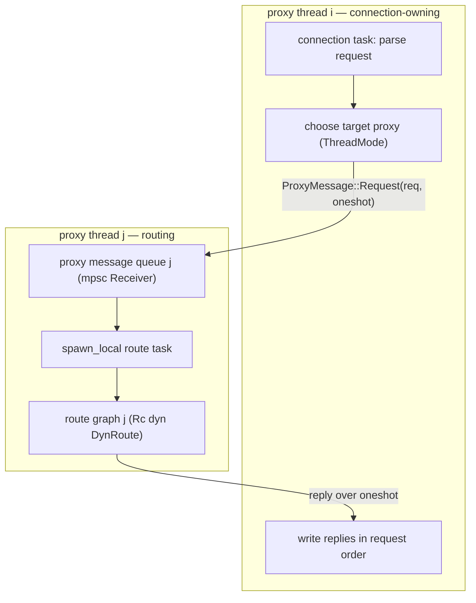
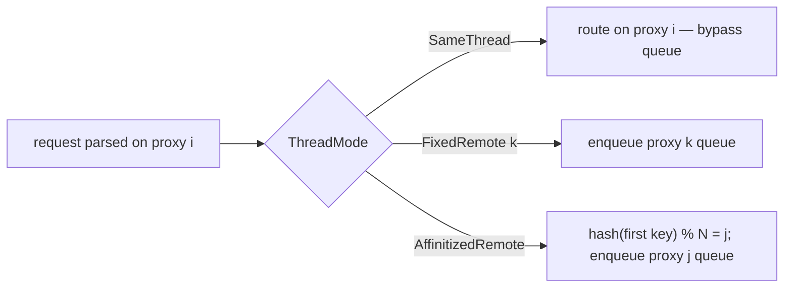
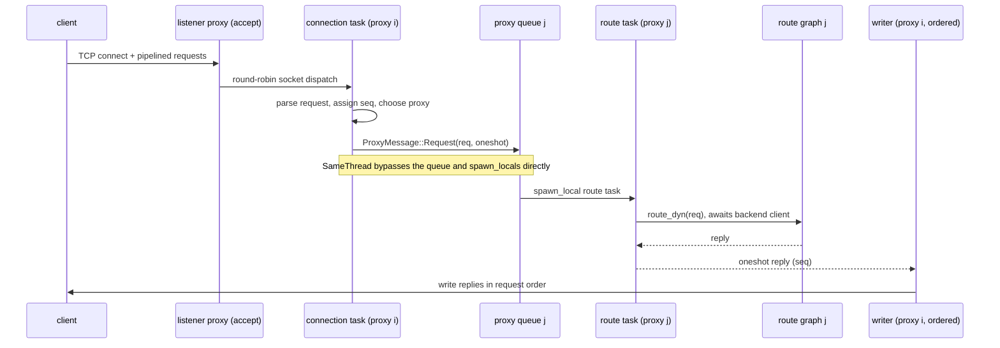

# rusty-mcrouter threading model (design)

> Status: **Done (2026-06-03)**
> Mirrors: [`../mcrouter/threading-model.md`](../mcrouter/threading-model.md) — how mcrouter does it
> Implemented in: `../architecture/threading-model.md` (once built; current state lives in [`../architecture/overview.md`](../architecture/overview.md) for now)
> Related: [`../mcrouter/backend-client.md`](../mcrouter/backend-client.md) (the backend client this sits above — already implemented), and the queue-backpressure design (currently [`../message-queue-backpressure.md`](../message-queue-backpressure.md), planned home `./message-queue.md`)
>
> Supersedes the root `docs/threading-model-plan.md`, which can be removed once this lands.

What we're going to change in rusty-mcrouter's proxy/server threading so it
behaves like mcrouter's actor model, and why. Read the
[mcrouter reference](../mcrouter/threading-model.md) first — this doc assumes it
and only describes our side.

---

## goal

Make the **proxy an actor**, the way mcrouter does. Today the connection task
*is* the routing entry point: it parses a request and calls the route graph
inline. We want requests to enter a **per-proxy message queue**, be **scheduled
as independent tasks** on that proxy's event loop, and reply back over a channel
— so the thread that owns a connection is no longer necessarily the thread that
routes the request.

That one change (connection I/O thread ≠ routing thread) is what unlocks
mcrouter-style thread modes and per-request routing concurrency.

## scope / non-goals

In scope:

- accepted-socket ownership and the actor boundary (proxy message queue)
- request-to-thread selection (`ThreadMode`)
- fiber-like per-request routing concurrency with ordered replies

Out of scope here (tracked elsewhere):

- **backend memcache client pipelining** — *already implemented*. Our `Client`
  is a cloneable mpsc handle over a socket-owning connection task with a FIFO
  pending queue; `DestinationRoute` holds a bare `Client` with no mutex. See
  [`../mcrouter/backend-client.md`](../mcrouter/backend-client.md). This design
  layers on top of that and does not touch it.
- **queue capacity / backpressure / overload policy** — see the message-queue
  design. This doc assumes a bounded `mpsc` exists but defers the exact
  fail-fast vs cooperative policy and in-flight limits to that doc.
- consistent-hash backend selection inside `PoolRoute` (currently random) — a
  routing-correctness issue, separate from thread placement.

---

## starting point (current rusty)

The outer topology is already right: `N` proxy OS threads, each a Tokio
**current-thread runtime + `LocalSet`**, each owning its own route graph as an
`Rc<dyn DynRoute>`. (Full as-built detail belongs in
`../architecture/threading-model.md`; summarized here only enough to frame the
change.)

- `rusty-mcrouter/src/main.rs` parses config into an `Arc<ConfigDocument>`,
  creates one `mpsc::channel::<std::net::TcpStream>` **socket queue** per proxy,
  and spawns named OS threads with a startup readiness handshake.
- `rusty-mcrouter-net/src/server.rs` — `accept_and_dispatch` round-robins
  accepted sockets across the socket queues; `serve_worker` `spawn_local`s a
  `serve_session` per connection.
- `serve_session` parses each request and **awaits the route inline**, then
  writes the reply, before parsing the next request.
- `rusty-mcrouter/src/proxy_thread.rs` builds the route graph per thread and
  wraps it in a closure the session calls directly.



The limitation: the connection task owns the routing decision, routes inline,
and head-of-line-blocks pipelined requests (each route is awaited before the
next request is parsed). mcrouter does not model it that way — see the
[reference](../mcrouter/threading-model.md).

---

## target design

Add a **proxy message queue** beside the existing socket queue. The connection
task parses a request, **chooses a target proxy**, and submits a
`ProxyMessage::Request` carrying a `oneshot` reply channel. The target proxy
drains its queue and `spawn_local`s the route task; the reply comes back over
the `oneshot` to the connection task, which writes it.



### 1. the actor: ProxyMessage / ProxyRequest / ProxyHandle

```rust
pub enum ProxyMessage {
    Request(ProxyRequest),
    Shutdown,
}

pub struct ProxyRequest {
    pub request: Request,
    pub reply_tx: tokio::sync::oneshot::Sender<Reply>,
}

#[derive(Clone)]
pub struct ProxyHandle {
    id: usize,
    tx: tokio::sync::mpsc::Sender<ProxyMessage>,
}

impl ProxyHandle {
    pub async fn send_request(&self, request: Request) -> Reply {
        let (reply_tx, reply_rx) = tokio::sync::oneshot::channel();

        if self
            .tx
            .send(ProxyMessage::Request(ProxyRequest { request, reply_tx }))
            .await
            .is_err()
        {
            return Reply::ServerError(Bytes::from_static(b"proxy unavailable"));
        }

        reply_rx.await.unwrap_or_else(|_| {
            Reply::ServerError(Bytes::from_static(b"proxy dropped request"))
        })
    }
}
```

Each proxy owns the receiver and schedules route work locally — this is our
`Proxy::messageReady` + `FiberManager::addTaskFinally`:

```rust
async fn run_proxy_queue(mut rx: mpsc::Receiver<ProxyMessage>, route: Rc<dyn DynRoute>) {
    while let Some(msg) = rx.recv().await {
        match msg {
            ProxyMessage::Request(req) => {
                let route = Rc::clone(&route);
                tokio::task::spawn_local(async move {
                    let reply = route.route_dyn(req.request).await.unwrap_or_else(|_| {
                        Reply::ServerError(Bytes::from_static(b"backend unavailable"))
                    });
                    let _ = req.reply_tx.send(reply);
                });
            }
            ProxyMessage::Shutdown => break,
        }
    }
}
```

Note the **reply-drop safety**: if a route task panics or is cancelled, its
`reply_tx` drops, `send_request`'s `reply_rx.await` errors, and the caller gets a
`ServerError` instead of the connection hanging forever. (This matters more than
in mcrouter because a dropped `oneshot` is our only signal.)

### 2. thread modes

```rust
#[derive(Clone, Copy)]
pub enum ThreadMode {
    SameThread,
    FixedRemote { proxy_id: usize },
    AffinitizedRemote,
}

pub struct ProxySet {
    proxies: Vec<ProxyHandle>,
}

impl ProxySet {
    pub fn choose(&self, mode: ThreadMode, current_id: usize, req: &Request) -> ProxyHandle {
        let idx = match mode {
            ThreadMode::SameThread => current_id,
            ThreadMode::FixedRemote { proxy_id } => proxy_id % self.proxies.len(),
            ThreadMode::AffinitizedRemote => hash_request(req) % self.proxies.len(),
        };
        self.proxies[idx].clone()
    }
}

fn hash_request(req: &Request) -> usize {
    use std::hash::{Hash, Hasher};
    let mut h = std::collections::hash_map::DefaultHasher::new();
    match req {
        Request::Get { keys } => { if let Some(k) = keys.first() { k.hash(&mut h); } }
        Request::Set { key, .. } => key.hash(&mut h),
        _ => std::mem::discriminant(req).hash(&mut h),
    }
    h.finish() as usize
}
```



**Same-thread bypass:** when the chosen proxy is the current one, do not pay the
queue cost — `spawn_local` the route task directly (mirrors mcrouter's
`sendSameThread`). Only `FixedRemote`/`AffinitizedRemote` cross into another
proxy's queue. (Exact bypass mechanics live in the message-queue design.)

### 3. fiber-like route concurrency with ordered replies

Today `serve_session` awaits each route before parsing the next request. To
behave like mcrouter fibers, parse and submit requests independently, then
restore client-visible ordering at the write boundary with sequence numbers:

```rust
// submit: don't await the route, just hand it to a proxy
while let Some(req) = parse_request(&mut buf)? {
    let seq = next_seq;
    next_seq += 1;
    let handle = proxies.choose(mode, current_id, &req);
    let completed = completed_tx.clone();
    tokio::task::spawn_local(async move {
        let reply = handle.send_request(req).await;
        let _ = completed.send((seq, reply));
    });
}

// write: reorder into request order before flushing
let mut next_write = 0usize;
let mut pending = BTreeMap::<usize, Reply>::new();
while let Some((seq, reply)) = completed_rx.recv().await {
    pending.insert(seq, reply);
    while let Some(reply) = pending.remove(&next_write) {
        let mut out = BytesMut::new();
        reply.serialize_into(&mut out);
        stream.write_all(&out).await?;
        next_write += 1;
    }
}
```

This is the same split mcrouter has: the connection task parses + submits +
serializes writes; the target proxy drains + schedules + completes reply
channels. memcached clients pipeline and expect replies in request order, so the
reorder buffer is required, not optional.

### thread-safety boundaries (the key constraint)

This is what the whole design hinges on, and what the current `Arc<dyn DynRoute>`
clippy warning is hinting at:

- The **route graph stays thread-local**: `Rc<dyn DynRoute>`, `!Send`, never
  crosses a thread. Each proxy routes only with *its own* graph.
- Only the **`ProxyMessage` crosses threads**, so it must be `Send`:
  `Request` is `Bytes`-based (`Send`), `Reply` is `Send`, and
  `oneshot::Sender<Reply>` is `Send`. Good.
- Therefore `AffinitizedRemote`/`FixedRemote` do **not** move the route graph;
  they move the *request* to the thread whose graph should handle it. That is
  exactly mcrouter's model (per-proxy route config; the request travels, not the
  config).

Practical fallout: keep `DynRoute` on `Rc` (fix the test that uses
`Arc<dyn DynRoute>` to `Rc`), and make sure `ProxyMessage` is `Send` (it will be,
but it's worth a compile-time assertion).

### how this maps to mcrouter

| mcrouter | rusty |
|---|---|
| `MessageQueue<ProxyMessage>` | bounded `tokio::sync::mpsc<ProxyMessage>` |
| `Proxy::messageReady` | `run_proxy_queue` recv loop |
| `ProxyRequestContext` + baton | `ProxyRequest` + `oneshot` reply |
| `FiberManager::addTaskFinally` | `tokio::task::spawn_local` route task |
| `EventBase` + `FiberManager` | Tokio current-thread runtime + `LocalSet` |
| `CarbonRouterClient::ThreadMode` | `ThreadMode` / `ProxySet::choose` |
| `findAffinitizedProxyIdx` | `hash_request` |
| `sendSameThread` (queue bypass) | same-thread `spawn_local` bypass |

---

## full request lifecycle (target)



---

## implementation order

1. **Add `ProxyMessage`, `ProxyRequest`, `ProxyHandle`, `run_proxy_queue`.**
   Keep accepted-socket distribution as-is. First behavior-preserving step:
   route every request through the *current* proxy's queue.
2. **Point `serve_session` at a `ProxyHandle`** instead of the route closure.
   `ThreadMode::SameThread` only — gets the actor boundary in place without
   changing request placement.
3. **Add `ThreadMode` + `ProxySet`.** Implement `SameThread`, then `FixedRemote`,
   then `AffinitizedRemote`, with the same-thread bypass.
4. **Make session routing concurrent but ordered.** Spawn per-request
   submissions; restore write order with sequence numbers.
5. **Backpressure** (bounded queue, fail-fast overload, batch drain, in-flight
   semaphore) — separate design doc; layer in after the actor boundary works.

Backend client pipelining is intentionally **absent** from this list — it is
already done.

---

## open questions / decisions

- **Affinity key vs pool hashing.** `AffinitizedRemote` chooses which *proxy
  thread* routes; `PoolRoute` chooses which *backend* serves. They're orthogonal
  and should stay separate. (Note `PoolRoute` currently picks a backend at
  random — fixing that is its own task.) Decide whether affinity hashes the
  first key only (mcrouter-ish) or something richer.
- **Ordering guarantee.** We preserve per-connection request order on the wire
  (reorder buffer). Confirm no command needs stronger/looser semantics before
  committing to strict ordering.
- **Queue policy.** Bounded `mpsc` capacity + fail-fast (`SERVER_ERROR`) vs
  cooperative `send().await` — deferred to the message-queue design; default
  lean is fail-fast so saturation is visible instead of hidden latency.
- **Shutdown.** `ProxyMessage::Shutdown` drains a proxy; graceful whole-router
  shutdown (drain in-flight, stop accepting) is out of scope for the first pass.
- **Observability.** With cross-thread `oneshot`s, a dropped reply currently maps
  to a generic `ServerError`. Decide what to log at the connection/proxy
  boundary (the codebase has no session-error logging today).

---

## done when

- Every request routes through a proxy message queue (the actor boundary),
  not inline in the connection task.
- `ThreadMode` is selectable; `SameThread` is the default and preserves today's
  placement and performance (queue bypass).
- Per-connection replies come back in request order under concurrent routing.
- `DynRoute` sharing is `Rc` everywhere (no `Arc<dyn DynRoute>`), and
  `ProxyMessage: Send` is asserted at compile time.
- `lsp_diagnostics` / `clippy` clean, and there are tests for concurrency and
  cross-thread routing (the suite has none today).
