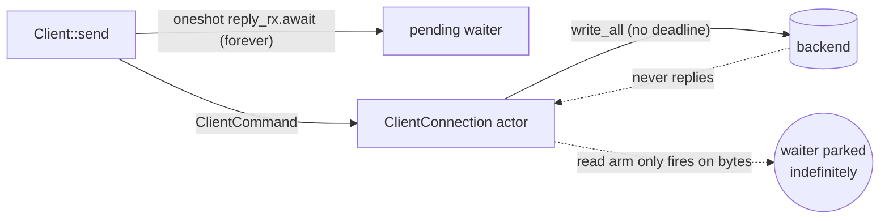

# rusty-mcrouter backend timeouts (design)

> Status: **Proposed (2026-06-12)**
> Mirrors: [`../mcrouter/timeouts.md`](../mcrouter/timeouts.md) — how mcrouter does it (reply timeout via `Baton::TimeoutHandler`, the ASCII tombstone, connect/write timeouts in `ConnectionOptions`)
> Implemented in: `../architecture/timeouts.md` (once built; **nothing exists yet** — see [`../architecture/overview.md`](../architecture/overview.md))
> Related: [`../architecture/backend-client.md`](../architecture/backend-client.md) + [`../mcrouter/backend-client.md`](../mcrouter/backend-client.md) (the `Client`/`ClientConnection` we arm deadlines on; "timeouts" is listed there as the #1 not-yet-done gap), [`./write-batching.md`](./write-batching.md) (shares the `write_batch` seam a write timeout wraps), and the **FailoverRoute / TKO** reliability work (timeouts are the *trigger* those consume — this doc ships the primitive).

Give the backend client **deadlines**: a per-request **reply timeout**, a
**connect timeout**, and a **write timeout** — so a slow or dead backend produces
a fast, classified error instead of a request (or a whole connection) hanging
forever. The subtle part is doing the reply timeout without breaking the
ASCII-FIFO reply matching. Read the
[mcrouter reference](../mcrouter/timeouts.md) first; this doc assumes it and only
describes our side.

---

## tl;dr

- The client has **no timeouts of any kind today**. `Client::connect` is a bare
  `TcpStream::connect(addr).await` (`handle.rs:22`); `Client::send` awaits its
  reply `oneshot` **forever** (`handle.rs:39`); and the `ClientConnection` actor's
  `select!` loop has exactly two arms — *receive command* and *read replies* —
  with **no timer arm** (`connection.rs:45-83`). A backend that accepts the
  connection and then never replies parks the caller indefinitely (the read arm
  only fires when bytes actually arrive). This is the single biggest reliability
  gap and the prerequisite for failover/TKO.
- **The crux is the reply timeout, because reply matching is positional.** Replies
  are matched to callers FIFO via `pending: VecDeque<oneshot::Sender<…>>`
  (`connection.rs:22`), popped in order in `deliver_replies` (`connection.rs:105`).
  memcached ASCII replies carry no request id, so **you cannot just remove a
  timed-out request's slot** — the next reply off the wire would be delivered to
  the wrong waiter and every reply after it would be shifted by one. mcrouter
  solves this with an explicit **tombstone** (the context stays reserved so the
  late reply is parsed and discarded in the right shape).
- **rusty gets that tombstone almost for free.** If the *caller* times out with
  `tokio::time::timeout(dur, reply_rx)` and drops `reply_rx`, the matching
  `oneshot::Sender` **stays in `pending`**. When the late reply finally arrives,
  `deliver_replies` pops it in order and `tx.send(..)` is a silent no-op (receiver
  gone) — **FIFO alignment is preserved** because the slot was consumed in order,
  not removed out of order. The dropped receiver *is* the tombstone.
- So the plan is layered: **(1) connect timeout** (wrap `TcpStream::connect`),
  **(2) write timeout** (wrap the `write_batch` `write_all`), **(3) per-request
  reply timeout** (caller-side `tokio::time::timeout` — the cheap, FIFO-correct
  first cut), and **(4) a connection-level idle/read deadline** in the actor's
  `select!` to reclaim a *dead* connection (which the per-request timeout alone
  does not — see §the dead-connection problem).
- Add `NetError::Timeout` (cloneable, fits the existing manual `Clone`) and map it
  to a reply at the route boundary; add `connect_timeout` / `write_timeout` /
  `reply_timeout` to `ClientConfig`. This is mcrouter's `connectTimeout` /
  `writeTimeout` (`ConnectionOptions`) + per-request `server_timeout_ms`.

---

## goal

A request to a slow backend fails in bounded time with a clear "timeout" result,
not a hang. A backend that is down (connect refused / SYN black-holed) fails the
connect in bounded time instead of blocking `build_route` on the OS default. A
backend that goes silent mid-stream has its connection torn down and its pending
waiters failed, rather than wedging the actor. None of this breaks FIFO reply
matching, and all of it is the substrate failover/TKO will later build on.

## scope / non-goals

In scope:

- `connect_timeout` on `Client::connect` (wrap `TcpStream::connect`);
- `write_timeout` on the backend write path (wrap `write_batch`'s `write_all`);
- a per-request **reply timeout** (caller-side `tokio::time::timeout`), relying on
  the implicit-tombstone property to keep FIFO alignment;
- a connection-level **idle/read deadline** in the actor to reclaim a silent
  connection (fail pending + exit);
- `NetError::Timeout` + a `Reply` mapping at the route leaf;
- `connect_timeout` / `write_timeout` / `reply_timeout` knobs on `ClientConfig`.

Out of scope here (deferred; seams left):

- **TKO / health probes / reconnect** — timeouts are the *input* to TKO; the
  tracker, soft/hard TKO, and probe-reconnect are their own design (the Tier-1
  reliability chunk). This doc only produces the timeout signal + classified
  error.
- **`maxInflight`** — a separate throttle (count of written-but-unanswered). It
  bounds the `pending` growth that an actor-side timeout otherwise has to reclaim;
  tracked with the backend-client throttle work.
- **per-request timeout *plumbed from config*** (`server_timeout_ms` per pool /
  route) — the first cut uses a single `ClientConfig::reply_timeout`; threading a
  per-request deadline from pool/route config is a follow-on (§open questions).
- **adaptive/dynamic timeouts** (mcrouter's load-aware variants) — fixed timeouts
  first.
- **connect retry/backoff** — a connect timeout returns an error; retry policy
  belongs with reconnect/TKO.

---

## starting point (current rusty)

Full as-built detail belongs in `../architecture/timeouts.md`; summarized here to
frame the change. **There are no deadlines anywhere in the client.**

```rust
// handle.rs:17 — connect has no deadline (OS default, can be minutes on a black hole)
pub async fn connect(addr: impl ToSocketAddrs) -> Result<Self> {
    let stream = TcpStream::connect(addr).await?;        // <- unbounded
    // ... spawn ClientConnection::run
}

// handle.rs:31 — send awaits the reply oneshot forever
pub async fn send(&self, request: Request) -> Result<Reply> {
    let (reply_tx, reply_rx) = oneshot::channel();
    self.tx.send(ClientCommand { request, reply_tx }).await?;
    match reply_rx.await { /* ... */ }                   // <- no timeout
}
```

The actor loop has **no timer** (`connection.rs:45`):

```rust
pub(crate) async fn run(mut self) {
    loop {
        tokio::select! {
            maybe_cmd = self.rx.recv() => { /* write_batch */ }
            res = self.reader.read_buf(&mut self.read_buf),
                if !self.pending.is_empty() => { /* deliver_replies */ }
            // <- no `_ = sleep(deadline)` arm: nothing ever fires on silence
        }
    }
}
```

And reply matching is **positional FIFO**, which is what makes the reply timeout
delicate (`connection.rs:22`, `:103`):

```rust
pending: VecDeque<oneshot::Sender<Result<Reply>>>,   // one slot per in-flight request

fn deliver_replies(&mut self) -> Result<()> {
    while let Some(reply) = parse_reply(&mut self.read_buf)? {
        match self.pending.pop_front() {                 // oldest waiter gets the next reply
            Some(tx) => { let _ = tx.send(Ok(reply)); }
            None => return Err(/* unexpected reply */),
        }
    }
    Ok(())
}
```

Supporting facts:

- `write_batch` (`connection.rs:88`) does one `self.writer.write_all(&self.write_buf).await`
  (`:99`) with no deadline; because it holds the `select!` arm, a stuck write also
  **starves the read arm** (the head-of-line risk noted in
  [`../architecture/backend-client.md`](../architecture/backend-client.md)).
- `ClientConfig` has only `max_pending` + `read_buf_initial_capacity`
  (`config.rs:1`) — **no timeout fields**. `max_pending` bounds the *command
  channel* (unwritten), **not** the `pending` VecDeque (written, awaiting reply),
  which is unbounded.
- `ClientCommand { request, reply_tx }` (`command.rs:6`) carries no deadline; the
  `// todo - consolidate to enum when we add … throttle commands` note is the seam
  if we ever go actor-side.
- `NetError` (`lib.rs:13`) has `Io | Protocol | NoAddresses | WorkerClosed |
  ClientClosed` — **no `Timeout`** — and a hand-written `Clone` (`lib.rs:32`) so
  any new variant must be cloneable (it's fanned out by `fail_all_pending`).



---

## the crux: a reply timeout must not break FIFO

memcached ASCII replies are positional — reply *k* belongs to the *k*-th
outstanding request. Our matcher encodes that as `pending.pop_front()`. So the one
thing a reply timeout **must not do** is remove a slot out of order:

```
pending = [A, B, C]           # three in flight, FIFO
B times out, we remove B  ->  pending = [A, C]
backend's reply for A arrives -> pop_front -> A     (ok)
backend's reply for B arrives -> pop_front -> C     (WRONG: B's reply handed to C)
```

mcrouter keeps the timed-out request as a **tombstone** so the late reply is still
consumed in the right position and discarded (see
[the mcrouter reference](../mcrouter/timeouts.md)). We need the same invariant.

### the implicit tombstone (why caller-side timeout is correct)

The cheapest correct design exploits a property we already have: **a timed-out
caller drops `reply_rx`, but the actor never removes the `oneshot::Sender` from
`pending` except via in-order `pop_front`.** So:

```
pending = [A, B, C]
B's caller times out, drops reply_rx_B  ->  pending = [A, B(dead), C]   # slot stays!
reply for A -> pop_front -> A.send(ok)
reply for B -> pop_front -> B(dead).send(ok)  -> Err(receiver gone), ignored
reply for C -> pop_front -> C.send(ok)                                  # still aligned
```

The dead `oneshot::Sender` **is** the tombstone. No queue surgery, no parallel
"timed out" bookkeeping, no protocol change — FIFO alignment holds because slots
are only ever consumed in order. This is strictly simpler than mcrouter's explicit
`REPLIED_QUEUE`/tombstone states, and falls out of using `oneshot` + `VecDeque`.

---

## target design

Four deadlines, smallest blast radius first.

### 1. connect timeout

Wrap the connect; surface a timeout distinctly so `build_route` fails fast instead
of blocking on the OS connect timeout (minutes on a black-holed host) — directly
relevant to the eager-connect path (`route_builder.rs:136`).

```rust
// handle.rs
pub async fn connect_with_config(addr, cfg: ClientConfig) -> Result<Self> {
    let stream = tokio::time::timeout(cfg.connect_timeout, TcpStream::connect(addr))
        .await
        .map_err(|_| NetError::Timeout { phase: TimeoutPhase::Connect })??;
    // ... spawn actor
}
```

### 2. write timeout

Bound the `write_all` in `write_batch`; a stuck write means the connection is bad,
so fail pending and exit (the actor's existing terminal-error discipline). This
also bounds the read-arm starvation noted above.

```rust
// connection.rs::write_batch
let write = self.writer.write_all(&self.write_buf);
tokio::time::timeout(self.write_timeout, write)
    .await
    .map_err(|_| NetError::Timeout { phase: TimeoutPhase::Write })??;
```

### 3. per-request reply timeout (caller-side — the first cut)

```rust
// handle.rs::send
match tokio::time::timeout(self.reply_timeout, reply_rx).await {
    Ok(Ok(result)) => result,                       // reply (or actor error)
    Ok(Err(_))     => Err(NetError::ClientClosed),  // actor dropped the sender
    Err(_elapsed)  => Err(NetError::Timeout { phase: TimeoutPhase::Reply }),
    // ^ dropping reply_rx here leaves the Sender in `pending` as the tombstone
}
```

This is correct for the **common** case — a single slow request inside otherwise
healthy traffic — and costs one timer per in-flight request. It does **not**, by
itself, handle a fully dead connection (§next).

### 4. connection idle/read deadline (the dead-connection reclaim)

Caller-side timeouts fail the *callers*, but if the backend never replies again the
`pending` slots (tombstones) are never consumed, so `pending` grows unbounded and
the socket is never reclaimed. Add a **third `select!` arm**: if `pending` is
non-empty and no bytes have arrived within `read_idle_timeout`, treat the
connection as dead — `fail_all_pending(Timeout)` and exit (the `Client` then
fails fast as closed, until reconnect lands).

```rust
// connection.rs::run — add an arm; reset the deadline whenever bytes arrive
_ = tokio::time::sleep_until(self.read_deadline), if !self.pending.is_empty() => {
    self.fail_all_pending(NetError::Timeout { phase: TimeoutPhase::Reply });
    return;
}
```

```mermaid
sequenceDiagram
  participant R as route task
  participant C as Client::send
  participant A as ClientConnection actor
  participant BK as backend
  R->>C: send(req)
  C->>A: ClientCommand (reply_tx)
  A->>BK: write_batch (bounded by write_timeout)
  Note over C: tokio::time::timeout(reply_timeout, reply_rx)
  alt reply in time
    BK-->>A: reply
    A->>C: pop_front -> reply_tx.send(ok)
  else reply times out
    C-->>R: NetError::Timeout (reply_rx dropped; Sender stays as tombstone)
    BK-->>A: late reply -> pop_front -> send to dead rx -> ignored (FIFO intact)
  else backend goes silent
    Note over A: read_idle_timeout fires -> fail_all_pending + exit
  end
```

### 5. the error + reply mapping

Add `NetError::Timeout { phase }` (cloneable — fits `lib.rs:32`):

```rust
pub enum TimeoutPhase { Connect, Write, Reply }
// NetError::Timeout { phase: TimeoutPhase }   // Clone arm: copy the phase
```

At the route leaf (`DestinationRoute`), `NetError::Timeout` becomes
`RouteError::Backend(..)` and then a client `Reply`. mcrouter returns
`carbon::Result::TIMEOUT`; rusty has no timeout `Reply` variant today, so the
first cut maps to `Reply::ServerError(b"timeout")`. (A dedicated reply/result
class is worth it once failover/TKO want to *classify* timeouts distinctly — noted
for that work.)

### 6. configuration

```rust
// config.rs
pub struct ClientConfig {
    pub max_pending: usize,
    pub read_buf_initial_capacity: usize,
    pub connect_timeout: Duration,     // NEW (e.g. 1s default)
    pub write_timeout: Duration,       // NEW (e.g. 1s default)
    pub reply_timeout: Duration,       // NEW (e.g. 1s default; mcrouter server_timeout_ms)
    pub read_idle_timeout: Duration,   // NEW (>= reply_timeout; dead-connection reclaim)
}
```

Per-request override (mcrouter passes `timeout` to each `sendSync`) is a follow-on:
thread a `Duration` through `Client::send` and `ClientCommand` so a pool/route can
set `server_timeout_ms`. The first cut uses the per-connection default.

---

## how this maps to mcrouter

| mcrouter | rusty |
|---|---|
| `sendSync(req, timeout)` arms `Baton::TimeoutHandler` | `tokio::time::timeout(reply_timeout, reply_rx)` in `Client::send` |
| timed-out request kept as a **tombstone** in the in-order queue | timed-out caller drops `reply_rx`; the `oneshot::Sender` stays in `pending` (implicit tombstone) |
| late reply parsed + discarded, FIFO preserved | late reply `pop_front`'d, `send` to dropped rx is a no-op, FIFO preserved |
| `carbon::Result::TIMEOUT` | `NetError::Timeout` → `Reply::ServerError(b"timeout")` (dedicated result later) |
| `ConnectionOptions::connectTimeout` | `ClientConfig::connect_timeout` wrapping `TcpStream::connect` |
| `ConnectionOptions::writeTimeout` | `ClientConfig::write_timeout` wrapping `write_batch`'s `write_all` |
| `updateTimeoutsIfShorter` (shrink-only) | not modeled (static `ClientConfig`); revisit if dynamic timeouts land |
| reply timeout feeds `TkoTracker` (`timeouts_until_tko`) | out of scope; this doc emits the `Timeout` signal TKO will consume |
| per-`sendSync` timeout from route/pool (`server_timeout_ms`) | deferred: per-request `Duration` through `send`/`ClientCommand` |
| EventBase keeps serving other fibers while one is parked | other route tasks/connections keep running; the timer is per-`send` future |

---

## implementation order

1. **`NetError::Timeout { phase }` + `ClientConfig` knobs.** Add the variant
   (with its `Clone` arm) and the four `Duration`s with defaults. No behavior
   change yet. `cargo`/clippy green.
2. **Connect timeout.** Wrap `TcpStream::connect` (`handle.rs:22`). Test: connect
   to a black-holed addr returns `Timeout` within the budget; verify the
   eager-connect path in `route_builder` now fails fast.
3. **Write timeout.** Wrap `write_all` in `write_batch` (`connection.rs:99`).
   Test with a backend that stops reading (fills the socket buffer) → write times
   out → `fail_all_pending` + exit.
4. **Reply timeout (caller-side) + the tombstone test.** Wrap `reply_rx`
   (`handle.rs:39`). The load-bearing test: pipeline A, B, C; time out B; deliver
   replies for A, B, C late; assert A and C get the **right** replies (FIFO intact)
   and B's caller saw `Timeout`.
5. **Connection idle/read deadline.** Add the third `select!` arm
   (`connection.rs`). Test: a backend that accepts then goes silent → the actor
   tears down within `read_idle_timeout` and all pending callers get `Timeout`.
6. **Route/reply mapping.** `NetError::Timeout` → `RouteError` → `Reply`.
7. **(Follow-on) per-request timeout from config**, then hand the `Timeout` signal
   to TKO/failover. Separate designs.
8. **Docs.** Write `../architecture/timeouts.md` (as-built) and flip this to
   Implemented.

Steps 2–5 are independent and individually testable; the reply-timeout tombstone
test (4) is the one that proves correctness.

---

## open questions / decisions

- **Caller-side vs actor-side reply timeout (decided: caller-side first).**
  Caller-side gets the tombstone for free and is minimal; actor-side gives the
  actor explicit knowledge of timeouts (needed to *count* them for TKO and to
  reclaim slots eagerly). Plan: caller-side now + a connection idle deadline (§4);
  move the per-request clock into the actor when TKO needs the count.
- **Unbounded `pending` under a dead backend (mitigated, not solved).** The idle
  deadline (§4) reclaims the *connection*; bounding *concurrent* in-flight is
  `maxInflight` (separate). Until then, a brief burst to a silent backend grows
  `pending` until the idle deadline fires.
- **Where the per-request timeout comes from (deferred).** First cut:
  `ClientConfig::reply_timeout` (per connection). mcrouter sets it per request from
  pool/route config (`server_timeout_ms`); thread a `Duration` through `send` when
  routes need per-pool timeouts.
- **Timeout as a distinct `Reply`/result class (deferred).** `ServerError(b"timeout")`
  now; a dedicated variant once failover/TKO classify timeouts vs other errors.
- **Clock source / granularity.** `tokio::time` (timer wheel) is fine at ms
  granularity; the current-thread runtime is built with `enable_time`
  (`thread.rs:17`), so timers already work on the proxy threads.
- **`read_idle_timeout` vs `reply_timeout` relationship.** Keep
  `read_idle_timeout >= reply_timeout` so callers see their own per-request
  timeout *before* the connection is torn down under them (cleaner error
  attribution).

---

## done when

- `Client::connect` fails with `NetError::Timeout` after `connect_timeout` against
  an unresponsive address (and `build_route`'s eager connect no longer blocks on
  the OS default).
- A single slow request times out at `reply_timeout` and returns a timeout reply,
  **while other pipelined requests on the same connection still get their correct
  replies** — the FIFO/tombstone test passes.
- A backend that goes silent mid-stream has its connection torn down within
  `read_idle_timeout`, failing all pending callers (no unbounded `pending`, no
  wedged actor).
- A stuck write is bounded by `write_timeout` and tears the connection down rather
  than starving the read arm.
- `NetError::Timeout` is cloneable, flows through `fail_all_pending`, and maps to a
  client reply at the route leaf.
- `lsp_diagnostics` / clippy clean; tests cover connect/write/reply/idle timeouts
  and the FIFO-preservation tombstone case; `../architecture/timeouts.md` is
  written and this doc is flipped to Implemented.
