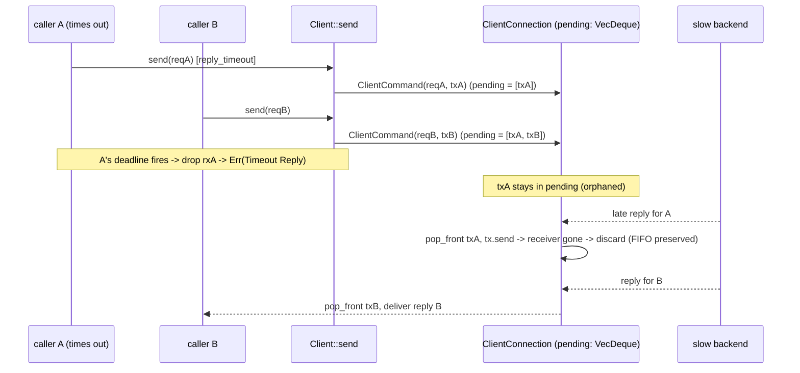
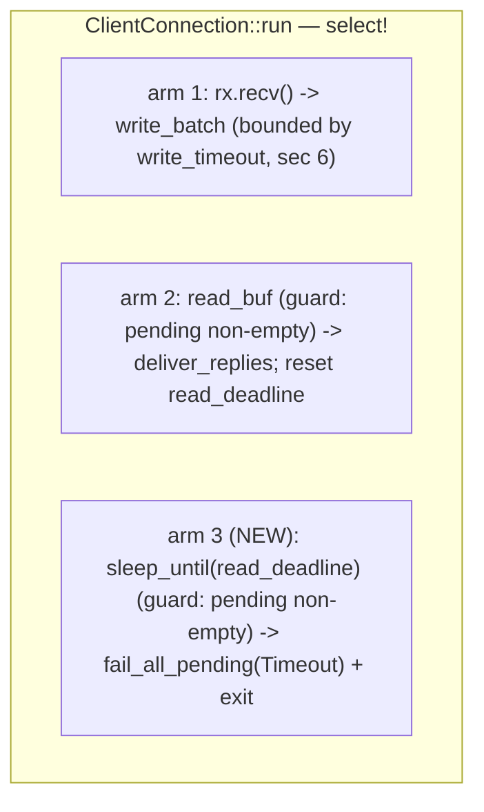

# rusty-mcrouter client timeouts (design)

> Status: **Implemented** (2026-06-30)
> Mirrors: [`../mcrouter/timeouts.md`](../mcrouter/timeouts.md) — how mcrouter does it (reply timeout via `sendSync(req, timeout)` + `Baton::TimeoutHandler`, connect/write timeouts in `ConnectionOptions`, `timedOutInitializers_` for ASCII alignment, TKO, failover-on-`TIMEOUT`)
> Implemented in: [`../architecture/timeouts.md`](../architecture/timeouts.md) — the as-built record (what shipped + where it diverged from this plan)
> Builds on: [`../architecture/backend-client.md`](../architecture/backend-client.md) — the `Client` handle + `ClientConnection` actor we're arming deadlines on; its [*"what we don't do yet"*](../architecture/backend-client.md) section names "No timeouts" as the #1 gap this closes. Also [`./write-batching.md`](./write-batching.md) — the `write_batch` seam the write timeout wraps.
> Unblocks: **`FailoverRoute` / TKO** — today `route_builder` returns `BuildError::RouteTypeNotImplemented { kind: "FailoverRoute" }`. A failover route can't be written until a slow/dead backend produces a *classifiable error*; that error is what this design manufactures.

Give the backend client **deadlines**: a per-request **reply timeout**, a
**connect timeout**, a **write timeout**, and a connection-level **read-idle
deadline** — so a slow backend, an unreachable one, a stuck write, or a silently
dead connection each produces a fast, classified `NetError::Timeout { phase }`
instead of a request (or the whole connection) hanging forever. The subtle part
is doing the reply timeout without breaking ASCII-FIFO reply matching. Read the
[mcrouter reference](../mcrouter/timeouts.md) first; this doc assumes it and only
describes our side.

---

## tl;dr

- **Today the client can hang forever.** The `select!` read arm is guarded
  `if !self.pending.is_empty()` and **nothing arms a deadline**
  (`rusty-mcrouter-net/src/client/connection.rs`). A backend that accepts the
  connection and never replies leaves `Client::send` awaiting indefinitely. The
  as-built doc flags this as the #1 gap.
- **Enforce the reply timeout at the handle, not the actor.** Wrap
  `Client::send`'s body in `tokio::time::timeout(reply_timeout, ...)`
  (`rusty-mcrouter-net/src/client/handle.rs`). On elapse, return
  `Err(NetError::Timeout { phase: Reply })`. ~15 lines, no per-request actor state.
- **The ASCII-FIFO alignment problem solves itself.** mcrouter needs a
  `timedOutInitializers_` queue to keep the in-order stream aligned after a
  timeout. We don't — because (a) our `parse_reply(buf)` is **stateless** (it
  never needs the request type, unlike mcrouter's `expectNext<Request>()`), and
  (b) a handle-side timeout **drops the `oneshot::Receiver`**, leaving its
  `Sender` parked in `pending` as a **self-cleaning tombstone**: the late wire
  reply is still popped FIFO and `tx.send` to a dropped receiver is a no-op. The
  mcrouter mechanism degenerates to "do nothing."
- **One small actor change reclaims a *dead* connection.** A caller-side reply
  timeout fails the *callers*, but a backend that goes silent never sends the
  late replies that drain those orphaned `Sender`s — so `pending` grows unbounded
  and the socket is never reclaimed. Add a **third `select!` arm**: a
  **read-idle deadline** (`sleep_until`, reset on bytes) that, on silence,
  `fail_all_pending` + exits ([§3](#3-dead-connection-reclaim-an-actor-side-read-deadline)).
- **Four deadlines, smallest blast radius first:** **(1)** reply timeout
  (caller-side), **(2)** connect timeout (wrap `TcpStream::connect`), **(3)** write
  timeout (wrap `write_batch`'s `write_all`), **(4)** read-idle deadline (the
  dead-connection reclaim). Write timeout also bounds the head-of-line read-arm
  starvation the as-built doc notes.
- **Surface timeouts as one phased `NetError` variant, not a `Reply`.** A timeout
  is a transport condition, not something the backend said. Add
  `NetError::Timeout { phase: TimeoutPhase }` with `phase ∈ {Connect, Write,
  Reply}`. It flows `Client` → `Err(..)` → `RouteError` (via the existing
  `map_err(RouteError::from)`) → at the proxy boundary an unrecovered route error
  already becomes `Reply::ServerError(...)` — matching mcrouter's terminal
  `SERVER_ERROR timeout`. The **phase** carries the operational meaning
  (unreachable / stuck / slow) *and* the future TKO severity (mcrouter:
  `CONNECT_TIMEOUT` → **hard**, `TIMEOUT` → **soft**) — so one variant covers all
  three kinds and stays extensible. One new variant + one `Clone` arm.
- **Config + one Cargo change.** Add `connect_timeout` / `write_timeout` /
  `reply_timeout` / `read_idle_timeout` to `ClientConfig` (default `Some(1000ms)`,
  mirroring `server_timeout_ms`; `None` = disabled, mirroring mcrouter's `0`). Add
  `"time"` to the **net** crate's tokio features (missing today; the bin crate has
  it). The proxy runtime already enables the time driver (`src/proxy/thread.rs`:
  `enable_time()`).
- **Explicitly out of scope (deferred, with a named home each):** TKO, the
  absolute `deadlineMs` budget, `maxInflight`, the **full** actor-side *per-request*
  timeout, and the `FailoverRoute` itself. This cut produces the *error*; failover
  *consumes* it.

---

## goal

`Client::send` and `Client::connect` must **always return** within a bounded time
when configured to, producing distinct, classifiable errors —
`Timeout { phase: Reply }` when a backend is too slow to answer,
`Timeout { phase: Connect }` when it can't be connected to, `Timeout { phase:
Write }` when a write can't drain — and a silently dead connection is torn down
rather than wedging the actor. None of this breaks the pipelining / FIFO
guarantees the client already has. The deliverable is the *error*, in the shape a
future `FailoverRoute` will classify exactly as mcrouter's `isFailoverErrorResult`
classifies `TIMEOUT`/`CONNECT_TIMEOUT`.

## scope / non-goals

In scope:

- a per-request **reply timeout** enforced in `Client::send` (caller-side);
- a **connect timeout** in `Client::connect_with_config`;
- a **write timeout** wrapping `write_batch`'s `write_all`;
- a connection-level **read-idle deadline** in the actor to reclaim a silent
  connection (fail pending + exit);
- `NetError::Timeout { phase: TimeoutPhase }` + its hand-written `Clone` arm, and
  the `Reply` mapping at the route leaf;
- `connect_timeout` / `write_timeout` / `reply_timeout` / `read_idle_timeout`
  knobs on `ClientConfig`; the `"time"` tokio feature;
- tests for connect/write/reply/idle timeouts and the **FIFO-preservation**
  (alignment) property.

Out of scope / deferred — each with a named seam:

- **`FailoverRoute`** itself — its own design doc. This cut only *produces* the
  timeout error it will consume. The seam is "`NetError::Timeout { phase }` →
  `RouteError`," classified by a future `is_failover_error`
  ([§8](#8-the-failover-seam-what-this-unblocks)).
- **TKO / dead-server detection / reconnect** — mcrouter soft-TKOs after
  `failures_until_tko` (default 3) consecutive `TIMEOUT`s and short-circuits.
  Deferred; needs cross-`Client` failure state. The **phase** is the input TKO
  will classify (Connect → hard, Reply → soft). See
  [`../mcrouter/timeouts.md`](../mcrouter/timeouts.md#6-tko-repeated-timeouts-knock-a-destination-out).
- **the full actor-side *per-request* timeout** — moving each request's clock into
  the `select!` loop (needs a per-request timer + an explicit `PendingEntry::Tombstone`).
  The caller-side timeout + read-idle deadline cover this cut; the full version is
  the home for `maxInflight` and TKO request-counting ([§3](#3-dead-connection-reclaim-an-actor-side-read-deadline)).
- **absolute `deadlineMs` propagation** — mcrouter's end-to-end budget that
  tightens across hops. Orthogonal to the per-hop timeout; deferred.
- **`maxInflight`** — a written-but-unanswered cap; bounds the `pending` growth the
  read-idle deadline otherwise reclaims. Tracked with the throttle work.
- **per-request timeout *plumbed from config*** (`server_timeout_ms` per pool /
  route) — first cut uses a single `ClientConfig::reply_timeout`; threading a
  per-request `Duration` through `send`/`ClientCommand` is a follow-on.
- **connect retry/backoff** (`connect_timeout_retries`) — a connect timeout returns
  an error; retry policy belongs with reconnect/TKO.

---

## starting point (current rusty)

The client is a cloneable `Client` handle over a socket-owning
`ClientConnection` actor (full detail in
[`../architecture/backend-client.md`](../architecture/backend-client.md)). Three
facts decide this design:

**1. Nothing arms a deadline.** `ClientConnection::run`'s `select!` has two arms,
and the read arm is guarded (`rusty-mcrouter-net/src/client/connection.rs`):

```rust
tokio::select! {
    maybe_cmd = self.rx.recv() => { /* Some -> write_batch; None -> return */ }
    res = self.reader.read_buf(&mut self.read_buf),
        if !self.pending.is_empty() =>          // read only while a request is outstanding
    { /* parse + deliver_replies, or fail_all_pending on EOF/err */ }
    // <- no timer arm: nothing fires on silence
}
```

Once a request is pending, the read arm waits for bytes that may never come, and
`write_batch().await` holds the command arm (a stuck write also starves reads —
the head-of-line window noted in the as-built doc). This is the hang the design
removes.

**2. Reply matching is positional and the parser is stateless.** `pending` is a
`VecDeque<oneshot::Sender<Result<Reply>>>`; each parsed reply pops the front
(`deliver_replies`), and `write_batch` pushes each `reply_tx` to the back in send
order:

```rust
fn deliver_replies(&mut self) -> Result<()> {
    while let Some(reply) = parse_reply(&mut self.read_buf)? {   // <- buf-only; no request type needed
        match self.pending.pop_front() {
            Some(tx) => { let _ = tx.send(Ok(reply)); }          // dropped receiver -> no-op
            None => return Err(NetError::Protocol(/* unexpected reply */)),
        }
    }
    Ok(())
}
```

The crucial difference from mcrouter: `parse_reply(&mut BytesMut) -> Result<Option<Reply>>`
takes **only the buffer**. It does not need to be told the next reply's type
(mcrouter's ASCII parser does — that's why mcrouter must store a per-request
`initializer_`). So **one wire reply consumes exactly one `pending` slot,
regardless of what that slot's waiter expected.** This is what makes the
self-cleaning tombstone in [§2](#2-why-the-handle-side-timeout-preserves-fifo-the-self-cleaning-tombstone)
work.

**3. There is no timeout knob, no `Timeout` error, and no `time` feature.**
- `ClientConfig` has exactly two fields (`rusty-mcrouter-net/src/client/config.rs`):
  ```rust
  pub struct ClientConfig { pub max_pending: usize, pub read_buf_initial_capacity: usize }
  // Default { max_pending: 1024, read_buf_initial_capacity: 4096 }
  ```
  `max_pending` bounds the *command channel* (unwritten), **not** the `pending`
  VecDeque (written, awaiting reply), which is unbounded.
- `NetError` (`rusty-mcrouter-net/src/lib.rs`) has `Io`, `Protocol`,
  `NoAddresses`, `WorkerClosed`, `ClientClosed` — **no `Timeout`** — plus a
  **hand-written `Clone`** (because `std::io::Error` isn't `Clone`) that
  `fail_all_pending` relies on (`tx.send(Err(err.clone()))`).
- `rusty-mcrouter-net/Cargo.toml` enables tokio
  `["net", "io-util", "rt", "sync", "macros"]` — **`"time"` is not enabled**
  (only transitively in dev-deps via `"full"`). `tokio::time::timeout` won't
  compile against the production client today.

And the consumer that motivates all of it (`rusty-mcrouter-core/src/route_builder.rs`):

```rust
// FailoverRoute is recognized in config but unbuildable; build_route yields:
BuildError::RouteTypeNotImplemented { kind }   // kind == "FailoverRoute" at runtime
// construction: route_builder.rs:112 (kind.clone()); locked by tests at :269, :279
```

`Request` is `Clone` (`rusty-mcrouter-protocol/src/request.rs`), so a future
failover route can re-send the same request to another child — no obstacle
there.

---

## target design

### the key insight

mcrouter spends real machinery (`timedOutInitializers_`, head-only removal
invariants) keeping the in-order ASCII stream aligned after a timeout, because
its parser is **stateful** — it must know the next reply's type. rusty's parser
is **stateless**. That single difference collapses the whole alignment problem:
if we enforce the per-request timeout at the *handle* (dropping the
`oneshot::Receiver`) rather than the *actor* (removing a `pending` entry), the
timed-out request's `Sender` simply stays in the FIFO and the orphaned reply is
parsed-and-discarded in order, for free. The actor only grows **one**
connection-level arm (the read-idle deadline) to reclaim a fully-dead socket.

### 1. reply timeout: enforce in `Client::send`

`Client` gains a `reply_timeout`, copied from config at connect time. `send`
wraps its existing body in `tokio::time::timeout`
(`rusty-mcrouter-net/src/client/handle.rs`):

```rust
#[derive(Clone)]
pub struct Client {
    tx: mpsc::Sender<ClientCommand>,
    reply_timeout: Option<Duration>,   // None = disabled (mcrouter's 0); Some = bounded
}

impl Client {
    pub async fn send(&self, request: Request) -> Result<Reply> {
        match self.reply_timeout {
            Some(dur) => match tokio::time::timeout(dur, self.send_inner(request)).await {
                Ok(result) => result,                                   // reply (or actor Err)
                Err(_elapsed) => Err(NetError::Timeout { phase: TimeoutPhase::Reply }),
            },
            None => self.send_inner(request).await,
        }
    }

    // the current body of send, unchanged
    async fn send_inner(&self, request: Request) -> Result<Reply> {
        let (reply_tx, reply_rx) = oneshot::channel();
        self.tx.send(ClientCommand { request, reply_tx })
            .await.map_err(|_| NetError::ClientClosed)?;
        match reply_rx.await {
            Ok(result) => result,
            Err(_) => Err(NetError::ClientClosed),
        }
    }
}
```

Wrapping the **whole** body (not just `reply_rx.await`) means one budget covers
both mcrouter cases under one number:

- If the deadline fires while still in `tx.send().await` (channel full — the
  `maxPending` backpressure case), the `ClientCommand` (holding `reply_tx`) is
  dropped *before* it's enqueued. No `pending` entry exists. This is mcrouter's
  `"Client queue timeout"` (`PENDING_QUEUE`) case — clean, nothing to align.
- If the deadline fires while in `reply_rx.await`, the command is already in
  `pending`; dropping `reply_rx` orphans its `Sender` — see [§2](#2-why-the-handle-side-timeout-preserves-fifo-the-self-cleaning-tombstone).
  This is mcrouter's `"Reply timeout"` (`PENDING_REPLY_QUEUE`) case.

> Semantic note vs mcrouter: mcrouter arms its reply deadline only at
> `writeSuccess` (so queue-wait isn't counted) but *also* times out queued
> requests with the same duration. We fold queue-wait + write + reply-wait into
> one budget. In practice the channel drains immediately and `write_batch` is a
> buffered `write_all`, so the budget ≈ reply wait. Documented, not a blocker; if
> we ever need the split, it moves to the actor ([§3](#3-dead-connection-reclaim-an-actor-side-read-deadline)).

### 2. why the handle-side timeout preserves FIFO (the self-cleaning tombstone)

This is the load-bearing correctness argument. When `tokio::time::timeout`
elapses it **drops the inner future**, which drops `reply_rx`. The matching
`reply_tx` is still sitting in the actor's `pending` deque. Nothing in the actor
changes. Later, when the backend's (late) reply arrives:

1. `deliver_replies` parses it (stateless — no request type needed) and
   `pending.pop_front()` returns the orphaned `Sender` **in order**;
2. `tx.send(Ok(reply))` returns `Err` because the receiver is gone; the existing
   `let _ =` discards it.

One wire reply consumed one `pending` slot, FIFO intact, reply discarded. The
orphaned `Sender` **is** the tombstone, and it cleans itself up the moment its
reply lands. No new types, no actor edits, no `timedOutInitializers_`.



Contrast with mcrouter ([`../mcrouter/timeouts.md`](../mcrouter/timeouts.md#3-keeping-the-ascii-stream-aligned-timedoutinitializers_-the-tombstone)):
it cannot just "forget" a timed-out request, because its ASCII parser must be
re-initialized with the *next* reply's type; so it stores the `initializer_` in
`timedOutInitializers_` and pops it when the orphan arrives. We get the same
alignment guarantee with zero machinery because our parser doesn't carry that
state.

**Bounding the orphans.** An orphaned `Sender` lives until its reply arrives or
the connection dies. For a slow-but-alive backend they drain naturally as replies
land. For a backend that accepts writes and *never* replies again, the orphans
would accumulate forever — which is exactly what the **read-idle deadline**
([§3](#3-dead-connection-reclaim-an-actor-side-read-deadline)) reclaims.

### 3. dead-connection reclaim: an actor-side read deadline

The caller-side reply timeout ([§1](#1-reply-timeout-enforce-in-clientsend)) fails
the *callers*, but it does **not** reclaim a fully-dead connection: if the backend
goes silent, the late replies that would consume the orphaned `Sender`s never
come, so `pending` grows unbounded and the socket is never closed. The fix is one
small, connection-level actor change — a **third `select!` arm** that fires on
read-silence:

```rust
// ClientConnection gains: read_idle_timeout: Option<Duration>, and a tracked deadline.
// Reset the deadline to `Instant::now() + read_idle_timeout` whenever bytes arrive
// (the read arm) or a new request is written; arm the arm only while work is pending.
_ = sleep_until(self.read_deadline), if self.read_idle_timeout.is_some()
                                     && !self.pending.is_empty() => {
    // backend went silent with requests outstanding -> treat the connection as dead
    self.fail_all_pending(NetError::Timeout { phase: TimeoutPhase::Reply });
    return;   // actor exits; the Client then fails fast as ClientClosed until reconnect lands
}
```

This is a **connection**-level deadline, not a per-request one — it bounds "how
long the whole connection may sit silent with work outstanding," which is why it
reclaims the dead-backend case the caller-side timeout can't. Keep
`read_idle_timeout >= reply_timeout` so each caller sees its **own** per-request
`Timeout { Reply }` *before* the connection is torn down under it (cleaner error
attribution; the teardown is the backstop).



**The full actor-side *per-request* timeout stays deferred.** Moving each request's
clock into the loop (a per-request timer + carrying a deadline on `ClientCommand`,
whose `// todo - consolidate to enum` already anticipates growth) would also force
`pending` to become `VecDeque<PendingEntry::{ Waiter(oneshot::Sender), Tombstone }>`
so a mid-queue removal can't break positional FIFO — *exactly* mcrouter's explicit
tombstone, minus the initializer. That complexity only earns its keep once
**`maxInflight`** needs eager slot reclamation or **TKO** needs to *count*
per-request timeouts. Until then: caller-side per-request timeout + this one
connection-level idle arm.

### 4. timeout representation: a `Timeout` variant with a phase

Surface timeouts as a **transport error** carrying a **phase**, not a `Reply`:

```rust
// rusty-mcrouter-net/src/lib.rs
#[derive(Clone, Copy, Debug, PartialEq, Eq)]
pub enum TimeoutPhase { Connect, Write, Reply }   // NEW

pub enum NetError {
    Io(std::io::Error),
    Protocol(ProtocolError),
    NoAddresses,
    WorkerClosed { worker: usize },
    ClientClosed,
    #[error("{phase:?} timed out")]
    Timeout { phase: TimeoutPhase },               // NEW — connect / write / reply
}

impl Clone for NetError {
    fn clone(&self) -> Self {
        match self {
            // ... existing arms ...
            NetError::Timeout { phase } => NetError::Timeout { phase: *phase },  // NEW (phase is Copy)
        }
    }
}
```

Why an `Err`, not a `Reply` variant:

- A timeout is "we gave up waiting," not anything the backend *said*. rusty
  already models transport conditions as `NetError` (`Io`, `Protocol`,
  `ClientClosed`); a timeout belongs there. `Reply` stays "things a backend
  actually returned."
- It composes with what exists. `DestinationRoute` already does
  `self.backend.send(req).await.map_err(RouteError::from)`
  (`rusty-mcrouter-core/src/routes/destination_route.rs:18`; the field is
  `backend: B`), so a `NetError` timeout becomes a `RouteError` with no new
  plumbing, and at the proxy boundary an unrecovered route error is already mapped
  to `Reply::ServerError(...)` — `Proxy::spawn_request`
  (`rusty-mcrouter/src/proxy/proxy.rs:33`, cross-thread path) and `route_one`
  (`rusty-mcrouter/src/proxy/connection.rs:212`, same-thread path) both do
  `.unwrap_or_else(|_| Reply::ServerError(..))`. End-to-end, an un-failed-over
  timeout reaches the client as `SERVER_ERROR ...` — matching mcrouter's terminal
  `SERVER_ERROR timeout`.
- The rejected alternatives: **`Reply::ServerError(b"timeout")`** conflates "the
  backend sent SERVER_ERROR" with "we timed out," muddying failover
  classification; a new **`Reply::Timeout`** variant touches the exhaustive
  `serialize_into` match, the parser, and every `Reply` match arm (it derives
  `Eq`/`PartialEq`, used widely in tests) for no benefit over an `Err`.

Why **one variant with a phase**, not separate `Timeout` / `ConnectTimeout` / … :

- **It covers all three kinds in one place and stays extensible.** Connect, write,
  and reply timeouts are the same *category* (a deadline elapsed) differing only in
  *where*; a `phase` field captures that without a variant per kind, and the match
  sites read naturally (`Timeout { phase: Connect }`).
- **The phase carries the operational meaning *and* the future TKO severity.**
  `Connect` = "unreachable" (mcrouter `CONNECT_TIMEOUT`, a **hard** TKO failure),
  `Reply` = "slow/overloaded" (mcrouter `TIMEOUT`, a **soft** failure — N in a
  row), `Write` = "stuck" (mcrouter tears the connection down → `REMOTE_ERROR`).
  When TKO lands it classifies on the phase — no error-type change required, so
  the distinction is **additive**, not a future breaking refactor of
  `fail_all_pending` + the hand-written `Clone`. See
  [`../mcrouter/timeouts.md`](../mcrouter/timeouts.md#6-tko-repeated-timeouts-knock-a-destination-out).
- **Cost is trivial.** One variant + a 3-value `Copy` enum; the `Clone` arm copies
  the phase. For *failover alone* the phase doesn't matter (all phases fail over);
  it pays off the moment TKO or observability want to tell them apart.

> One open thread for the failover doc, not this one: whether `RouteError`
> carries timeouts as `Backend(NetError::Timeout { .. })` — free today via the
> `#[from]` on `RouteError::Backend` (`rusty-mcrouter-core/src/routes/mod.rs:21`) —
> or lifts a dedicated `RouteError::Timeout { phase }`. Either works; the failover
> classifier just needs to recognize it ([§8](#8-the-failover-seam-what-this-unblocks)).

### 5. connect timeout

`connect_with_config` currently does a bare `TcpStream::connect(addr).await` — on a
black-holed host that can block for the OS default (minutes), wedging the eager
connect in `route_builder`. Wrap it (`rusty-mcrouter-net/src/client/handle.rs`):

```rust
pub async fn connect_with_config(addr: impl ToSocketAddrs, cfg: ClientConfig) -> Result<Self> {
    let stream = match cfg.connect_timeout {
        Some(dur) => match tokio::time::timeout(dur, TcpStream::connect(addr)).await {
            Ok(Ok(s))  => s,
            Ok(Err(e)) => return Err(NetError::Io(e)),
            Err(_)     => return Err(NetError::Timeout { phase: TimeoutPhase::Connect }),
        },
        None => TcpStream::connect(addr).await?,
    };
    let (tx, rx) = mpsc::channel(cfg.max_pending);
    tokio::spawn(ClientConnection::new(stream, rx, &cfg).run());
    Ok(Self { tx, reply_timeout: cfg.reply_timeout })
}
```

A stalled connect returns `Timeout { phase: Connect }` — distinct in phase from a
reply timeout, mirroring mcrouter's `CONNECT_TIMEOUT` vs `TIMEOUT`. What we *do*
skip for v1 is mcrouter's **silent connect retries** (`connect_timeout_retries`):
we fail the connect immediately rather than retrying the budget first. Adding a
retry count later is additive (note in [open questions](#open-questions--decisions)).

### 6. write timeout

mcrouter applies a socket-level send timeout (`setSendTimeout`); Tokio's analogue
is wrapping the `write_all` in `write_batch`. This is worth doing in this cut: it's
cheap, it bounds the **head-of-line read-arm starvation** (a stuck
`write_batch().await` holds the command arm so replies can't drain — noted in the
as-built doc), and it's the direct counterpart of mcrouter's write timeout. A
stuck write means the connection is bad, so it tears the connection down via the
actor's existing terminal-error discipline:

```rust
// connection.rs::write_batch — ClientConnection gains write_timeout: Option<Duration>
let write = self.writer.write_all(&self.write_buf);
match self.write_timeout {
    Some(dur) => tokio::time::timeout(dur, write).await
        .map_err(|_| NetError::Timeout { phase: TimeoutPhase::Write })??,  // outer: elapsed; inner: io::Error
    None => write.await?,
}
```

`write_batch` already returns `Result<()>`, and `run()` already does
`if let Err(err) = self.write_batch(cmd).await { self.fail_all_pending(err); return; }`
— so a `Timeout { Write }` flows through the **existing** fail-all-and-exit path
with no new control flow (mcrouter's write timeout → `processShutdown` →
`REMOTE_ERROR` is the same "a bad write kills the connection" shape).

### 7. config + the Cargo change

```rust
// rusty-mcrouter-net/src/client/config.rs
pub struct ClientConfig {
    pub max_pending: usize,
    pub read_buf_initial_capacity: usize,
    pub connect_timeout: Option<Duration>,    // NEW — wraps TcpStream::connect (§5)
    pub write_timeout: Option<Duration>,      // NEW — wraps write_batch's write_all (§6)
    pub reply_timeout: Option<Duration>,      // NEW — per-request, caller-side (§1); mcrouter server_timeout_ms
    pub read_idle_timeout: Option<Duration>,  // NEW — dead-connection reclaim (§3); keep >= reply_timeout
}

impl Default for ClientConfig {
    fn default() -> Self {
        Self {
            max_pending: 1024,
            read_buf_initial_capacity: 4096,
            connect_timeout: Some(Duration::from_millis(1000)),   // mirrors connect_timeout default
            write_timeout: Some(Duration::from_millis(1000)),
            reply_timeout: Some(Duration::from_millis(1000)),     // mirrors server_timeout_ms
            read_idle_timeout: Some(Duration::from_millis(2000)), // >= reply_timeout
        }
    }
}
```

Defaulting to `Some(…)` mirrors mcrouter's finite `server_timeout_ms` and is a
deliberate **behavior change** from today's infinite wait (the as-built doc treats
that as a gap). `None` = "disabled" mirrors mcrouter's `0`-means-infinite
convention. Per-request override (mcrouter passes `timeout` to each `sendSync` from
pool/route config) is a follow-on: thread a `Duration` through `send` /
`ClientCommand`.

One required Cargo change; the runtime prerequisite is already satisfied:

1. **`rusty-mcrouter-net/Cargo.toml`** — add `"time"` (it's missing *here*; only
   the bin crate lists it today):
   ```toml
   tokio = { workspace = true, features = ["net", "io-util", "rt", "sync", "macros", "time"] }
   ```
   `Client::send`/`connect_with_config`/`write_batch` live in the **net** crate, so
   it needs the feature even though `rusty-mcrouter/Cargo.toml` already has `"time"`.
2. **The timer driver is already enabled — no change needed.** Each proxy thread's
   runtime is `Builder::new_current_thread().enable_io().enable_time()`, driven via
   `LocalSet::block_on` (`rusty-mcrouter/src/proxy/thread.rs:15-23`), so
   `tokio::time::timeout` / `sleep_until` have the timer driver they need.
   (Verified by grep.)

### 8. the failover seam: what this unblocks

A `FailoverRoute` (future) sits above `DestinationRoute` and decides per child
"is this a failover error?" — exactly mcrouter's `processReply` →
`isFailoverErrorResult`. After this cut, the inputs it classifies exist:

```rust
// future FailoverRoute (sketch — its own design doc)
fn is_failover_error(err: &RouteError) -> bool {
    matches!(err,
        RouteError::Backend(NetError::Timeout { .. })  // any phase — produced by THIS design
        | RouteError::Backend(NetError::Io(_))         // connection died
        /* | RemoteError, ... as they gain variants */
    )
}

async fn route(&self, req: Request) -> Result<Reply> {
    for child in &self.children {                    // FailoverInOrderPolicy analogue
        match child.route(req.clone()).await {       // Request: Clone — already true
            Ok(reply) => return Ok(reply),
            Err(e) if is_failover_error(&e) => continue,
            Err(e) => return Err(e),
        }
    }
    Err(/* all children failed */)
}
```

This mirrors mcrouter's default failover set
([`../mcrouter/timeouts.md`](../mcrouter/timeouts.md#9-how-a-timeout-becomes-a-failover):
`TIMEOUT`, `CONNECT_TIMEOUT`, `CONNECT_ERROR`, `REMOTE_ERROR`, `TKO`, …) — failover
treats **every** `Timeout { phase }` identically (the phase's soft/hard split is a
*TKO* concern, not a *failover* one). The point of *this* doc is that without the
`Timeout` variant, `is_failover_error` has nothing to match on for the most common
failure modes — a slow backend (`Reply`) or an unreachable one (`Connect`) — so
failover would be untestable and half-blind. Timeouts land first.

### 9. what we deliberately don't build (and where it goes)

| Deferred | Why now-out-of-scope | Named home |
|---|---|---|
| `FailoverRoute` | consumes the error this cut produces; separate concern | its own `design/failover.md` |
| TKO / reconnect | needs cross-`Client` failure state + probes; classifies on the timeout **phase** | `../mcrouter/timeouts.md` §6 → future `design/tko.md` |
| full actor-side **per-request** timeout | needs a per-request timer + `PendingEntry::Tombstone`; only pays off with `maxInflight`/TKO counting | [§3](#3-dead-connection-reclaim-an-actor-side-read-deadline) |
| `deadlineMs` budget | orthogonal end-to-end mechanism that tightens across hops | `../mcrouter/timeouts.md` §7 |
| `maxInflight` | written-but-unanswered cap; bounds `pending` the idle deadline reclaims | throttle work |
| per-request timeout *from config* | first cut uses one `ClientConfig::reply_timeout`; thread a `Duration` through `send` | follow-on |
| connect retries (`connect_timeout_retries`) | additive; v1 fails the connect on first elapse | [open questions](#open-questions--decisions) |

---

## how this maps to mcrouter

| mcrouter | rusty |
|---|---|
| `sendSync(req, timeout)` + `Baton::TimeoutHandler` | `tokio::time::timeout(reply_timeout, send_inner)` in `Client::send` |
| deadline armed at `writeSuccess` (post-write only) | one combined budget over enqueue+write+reply (documented divergence) |
| `"Client queue timeout"` (`PENDING_QUEUE`) | elapse during `tx.send().await` (command dropped pre-enqueue) |
| `"Reply timeout"` (`PENDING_REPLY_QUEUE`) | elapse during `reply_rx.await` (Sender orphaned in `pending`) |
| `timedOutInitializers_` (ASCII alignment) | **nothing** — stateless `parse_reply` + dropped-receiver tombstone |
| out-of-order match by `reqId`, drop unknown late reply | n/a — rusty is ASCII/FIFO-only |
| `carbon::Result::TIMEOUT` (reply timeout) | `Err(NetError::Timeout { phase: Reply })` |
| `carbon::Result::CONNECT_TIMEOUT` (connect timeout) | `Err(NetError::Timeout { phase: Connect })` |
| write timeout → `writeErr` → `processShutdown` (`REMOTE_ERROR`) | `Timeout { phase: Write }` from `write_batch` → existing `fail_all_pending` + exit |
| terminal `SERVER_ERROR timeout` on the wire | `RouteError` → proxy maps to `Reply::ServerError(...)` |
| `ConnectionOptions.connectTimeout` → `socket connect(ms)` | `tokio::time::timeout` around `TcpStream::connect` |
| `ConnectionOptions.writeTimeout` → `setSendTimeout` | `tokio::time::timeout` around `write_batch`'s `write_all` |
| (no per-connection idle timer; TKO probes handle dead hosts) | **read-idle deadline** — 3rd `select!` arm reclaims a silent connection |
| `server_timeout_ms` default 1000 | `ClientConfig::reply_timeout` default `Some(1000ms)` |
| `0` = infinite | `None` = disabled |
| `isFailoverErrorResult` incl. `TIMEOUT` + `CONNECT_TIMEOUT` | future `is_failover_error` matches every `Timeout { phase }` (identically) |
| soft TKO = `TIMEOUT`; hard TKO = `CONNECT_TIMEOUT` | future: classify on `phase` — `Reply` → soft, `Connect` → hard |
| `updateTimeoutsIfShorter` (shrink-only across routes) | not modeled (static `ClientConfig`); revisit if dynamic/per-route timeouts land |
| TKO / probes | deferred (non-goal) |

---

## testing: prove it times out and stays aligned

Mirrors the failure-injection plan already in
[`./testing.md`](./testing.md) (which calls out timeout→failover/TKO as the
reason the stateful mock memcached needs fault keys), at two levels.

**Client level (`rusty-mcrouter-net`), socket-backed:**

1. **Hang → `Timeout { Reply }`.** A scripted-TCP backend that accepts the write
   and never replies; assert `Client::send` returns
   `Err(NetError::Timeout { phase: Reply })` within ~`reply_timeout` (the
   consolidated scripted-TCP backend from [`./testing.md`](./testing.md) gives us
   exactly this "read N, reply 0" knob).
2. **Late reply discarded in FIFO order (the alignment property).** The
   load-bearing test, rusty analogue of mcrouter's `asciiSentTimeouts`. Send A
   (short timeout) then B on the same connection; reply to A *after* A's deadline,
   then reply to B. Assert: A's caller got `Timeout { Reply }`, **B's caller got
   B's reply** (not A's). Proves the orphaned-`Sender` tombstone kept the deque
   aligned.
3. **Connect timeout.** Point `connect_with_config` at a non-accepting address (or
   one that delays accept past `connect_timeout`); assert
   `Err(NetError::Timeout { phase: Connect })` — and assert the phase is `Connect`,
   not `Reply` (locks in the distinction).
4. **Write timeout.** A backend that stops reading so the socket send buffer fills;
   assert the `write_all` is bounded by `write_timeout`, the actor
   `fail_all_pending`s with `Timeout { Write }` and exits.
5. **Read-idle reclaim.** A backend that accepts then goes silent with requests
   outstanding; assert the actor tears down within `read_idle_timeout` and all
   pending callers get a `Timeout` (no unbounded `pending`, no wedged actor).
6. **Disabled timeouts.** Each knob `None` ⇒ no timer / current behavior — a
   regression guard that `None` truly disables.

**End-to-end (mock memcached):** the planned `__rusty__.want_timeout(ms)`
fault-injection key ([`./testing.md`](./testing.md), mirroring
`__mockmc__.want_timeout`) makes a backend hang deterministically, so a routing
test can drive `DestinationRoute` → `Client` timeout without real sockets racing.
This is also the fixture a future `FailoverRoute` test reuses to prove failover
fires on a `Timeout`.

> Timer determinism: prefer `tokio::time::pause`/`advance` (the `time` feature)
> over wall-clock sleeps so these tests are fast and non-flaky.

---

## implementation order

Risk-first; each step independently compilable and testable:

1. **`TimeoutPhase` + `NetError::Timeout { phase }` + the `Clone` arm**
   (`rusty-mcrouter-net/src/lib.rs`). Trivial, unblocks everything;
   clippy/`lsp_diagnostics` green.
2. **Add `"time"` to the net crate's tokio features**
   (`rusty-mcrouter-net/Cargo.toml`). The proxy runtime already enables the time
   driver (`rusty-mcrouter/src/proxy/thread.rs`), so nothing else is needed here.
   Without the feature, the next steps won't compile.
3. **`ClientConfig` knobs + `Client.reply_timeout` + reply timeout** (`config.rs`,
   `handle.rs`). Wire `send` → `send_inner` with `tokio::time::timeout`.
4. **Connect timeout** (`connect_with_config`) + its test (black-holed addr →
   `Timeout { Connect }`; verify `build_route`'s eager connect now fails fast).
5. **Write timeout** (`write_batch`) + its test (backend stops reading → write
   times out → `fail_all_pending` + exit).
6. **Reply-timeout FIFO/tombstone test** — pipeline A, B, C; time out B; deliver
   replies late; assert A and C get the **right** replies and B saw
   `Timeout { Reply }`. This is the one that proves correctness.
7. **Read-idle deadline** — add the third `select!` arm (`connection.rs`); test a
   silent backend reclaims within `read_idle_timeout`.
8. **Route/reply mapping** — confirm `NetError::Timeout` → `RouteError` →
   `Reply::ServerError` end-to-end.
9. **Docs**: write `../architecture/timeouts.md` (as-built), strike "No timeouts"
   from `../architecture/backend-client.md`, and flip this doc to Implemented.

The full actor-side per-request timeout, TKO, `maxInflight`, and `FailoverRoute`
are **follow-ons enabled by this seam**, not part of this cut.

---

## open questions / decisions

- **Caller-side per-request timeout + one actor-side idle arm (decided).**
  Stateless `parse_reply` + dropped-receiver tombstone gives correct ASCII FIFO
  alignment with no per-request actor state; the single read-idle arm
  ([§3](#3-dead-connection-reclaim-an-actor-side-read-deadline)) reclaims a dead
  connection. The **full** actor-side per-request timeout (per-request timer +
  explicit `PendingEntry::Tombstone`) waits until `maxInflight`/TKO need it.
- **`NetError::Timeout` (Err) vs `Reply` variant (decided: Err).** Transport
  condition, composes with `map_err(RouteError::from)` and the proxy's
  error→`ServerError` mapping, keeps `Reply` pure, minimal blast radius
  ([§4](#4-timeout-representation-a-timeout-variant-with-a-phase)).
- **One `Timeout { phase }` vs separate variants (decided: phased).** Covers
  connect/write/reply in one extensible variant; the phase carries operational
  meaning and the future TKO severity (Connect → hard, Reply → soft), so the
  distinction is additive rather than a future error-type split.
- **One combined budget vs mcrouter's post-write arming (decided: combined, for
  v1).** Simpler; ≈ reply-wait in practice. Move to actor-side if we ever need
  mcrouter's separate "queue timeout" vs "reply timeout" arming.
- **Defaults `Some(1000ms)` vs `None` (decided: `Some`).** Mirrors
  `server_timeout_ms`; a finite default is safer for a router and removes the
  current infinite-hang footgun. `None` remains available to opt out.
- **`read_idle_timeout` vs `reply_timeout` relationship (decided: idle ≥ reply).**
  Keep the connection-level idle deadline no shorter than the per-request reply
  timeout, so a caller sees its own `Timeout { Reply }` before the connection is
  torn down under it (cleaner attribution; teardown is the backstop).
- **`RouteError` shape for timeouts (deferred to failover doc).** The free path
  exists: `RouteError::Backend(#[from] NetError)`
  (`rusty-mcrouter-core/src/routes/mod.rs:21`) auto-derives `From<NetError>`, so a
  timeout becomes `RouteError::Backend(NetError::Timeout { .. })` with zero
  plumbing. The only open part is whether `FailoverRoute` matches that or lifts a
  dedicated `RouteError::Timeout { phase }`.
- **Connect retries (deferred).** mcrouter retries connect timeouts
  `connect_timeout_retries` times before failing; v1 fails on first elapse. A
  retry budget is an additive follow-on with reconnect/TKO.

---

## done when

- `Client::send` returns `Err(NetError::Timeout { phase: Reply })` within
  ~`reply_timeout` against a backend that never replies; `reply_timeout: None`
  preserves the await-forever behavior.
- A late reply arriving after a timeout is consumed and discarded **in FIFO
  order**, and the *next* request still gets its own correct reply on the same
  connection (the alignment test passes) — with **no** per-request changes to
  `deliver_replies`.
- `connect_with_config` honors `connect_timeout`, returning
  `Err(NetError::Timeout { phase: Connect })` on a stalled connect (and
  `build_route`'s eager connect no longer blocks on the OS default).
- A stuck write is bounded by `write_timeout`, surfacing `Timeout { phase: Write }`
  that tears the connection down (no read-arm starvation).
- A backend that goes silent mid-stream has its connection reclaimed within
  `read_idle_timeout` (`fail_all_pending` + exit) — no unbounded `pending`, no
  wedged actor.
- `TimeoutPhase` + `NetError::Timeout { phase }` exist with the `Clone` arm;
  `ClientConfig` carries the four timeout knobs (defaults `Some(..)`); the **net**
  crate's tokio features include `"time"` (the proxy runtime already enables the
  time driver at `src/proxy/thread.rs`).
- The failover seam is real: every `NetError::Timeout { phase }` flows to
  `RouteError` and (when unrecovered) to `Reply::ServerError` at the proxy
  boundary, so a future `FailoverRoute` has timeouts to classify exactly as
  mcrouter classifies `TIMEOUT`/`CONNECT_TIMEOUT`.
- `lsp_diagnostics` / clippy clean; tests cover connect/write/reply/idle timeouts
  and the FIFO-preservation case; `../architecture/timeouts.md` written, the
  `../architecture/backend-client.md` "No timeouts" gap struck, and this doc
  flipped to Implemented.
