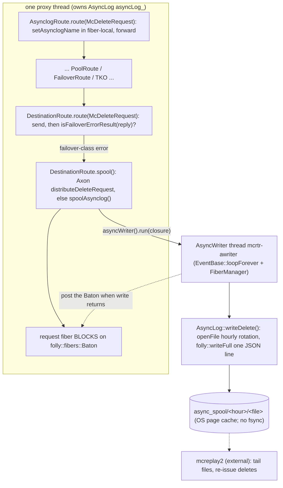

# mcrouter async delete log

how Meta's mcrouter keeps a cache invalidation from being silently lost: when a
`delete` can't be delivered to its destination, mcrouter spools it to a local
disk file so an out-of-band tool can replay it later. This is the durability
seam behind cache invalidation — the "asynclog" (async spool / failed-delete
log).

> Source pinned to `facebook/mcrouter` @ `42aa391189c7`. Citations are by symbol
> and file path (relative to the repo root); line numbers drift, symbols don't.
> Reference-only — no rusty-mcrouter content. See
> [`../design/async-delete-log.md`](../design/async-delete-log.md) for what we
> copy and `../architecture/async-delete-log.md` for what we end up building
> (**nothing exists yet** — see [`../architecture/overview.md`](../architecture/overview.md)).
> This is the durability feature [`observability.md` §8](./observability.md)
> deliberately summarized and pointed here; the off-thread writer it shares with
> stats is the `AsyncWriter` in [that doc](./observability.md). For the
> per-proxy threading these objects hang off, see
> [`threading-model.md`](./threading-model.md); for the destination seam that
> decides to spool, [`backend-client.md`](./backend-client.md).

---

## tl;dr

- **Only `delete`s are spooled, and only on failure.** Sets/gets are never
  spooled — losing a write or a read is recoverable on the next request; losing
  an *invalidation* leaves stale data in cache forever. The asynclog exists
  solely to make deletes eventually-durable.
- **Three objects, three jobs.** `AsynclogRoute` (a tree wrapper) only *names*
  the spool — it stamps the asynclog name into fiber-local and forwards.
  `DestinationRoute` (the leaf) *decides* to spool, when its delete comes back a
  failover-class error. `AsyncLog` (one per proxy) *formats and writes* the
  record. The write itself runs on a separate `AsyncWriter` thread.
- **The blocking write is pushed off the proxy — but the caller still waits for
  it.** `spoolAsynclog` hands the write to the `AsyncWriter` thread and then
  **blocks the request fiber on a `folly::fibers::Baton` until the `write()`
  returns**. The client is not acked until the delete is on disk. Off-thread for
  the *event loop*, synchronous for the *request*.
- **One JSON line per record, two formats.** Legacy `["AS1.0", ts, "C", ["host",
  port, "delete k\r\n"]]` or structured `["AS2.0", ts, "C", {s,f,r,h,p,k,a}]`
  (`use_asynclog_version2`). Files live under `async_spool` in **hourly
  subdirectories**, one file per `(timestamp, service, router, tid)`.
- **Durability is page-cache, not fsync.** There is **no** `fsync`/`fdatasync`/
  `O_SYNC` anywhere in the path — "durable" means `folly::writeFull` returned, so
  the bytes are in the OS page cache. A power loss between `write()` and
  writeback loses the record. Replay tolerates this.
- **Replay is someone else's job.** mcrouter only *writes* the spool. An external
  tool (`mcreplay2`) tails the files and re-issues the deletes; the file lifetime
  constant must be kept in sync with it. The modern in-process successor is
  Axon/`DistributionRoute` `replay` mode, not file replay.

---

## the shape of it

A delete walks the route tree like any request. Two extra things happen: an
`AsynclogRoute` near the top tags the fiber with a spool name on the way down,
and the `DestinationRoute` at the bottom — the one that actually talked to a
backend — spools the delete if the reply is a failover-class error on the way
back up. The spool write is the only blocking disk I/O on the request path, and
it is shipped to a dedicated thread.



---

## 1. `AsynclogRoute` — it only names the spool

`AsynclogRoute<RouterInfo>` (`mcrouter/routes/AsynclogRoute.h`), `routeName() =
"asynclog:" + asynclogName_`, is a thin wrapper around one child route handle.
It writes nothing. Its entire job is to stamp a name into fiber-local so that a
*downstream* route (the leaf `DestinationRoute`) knows which spool this delete
belongs to:

```cpp
McDeleteReply route(const McDeleteRequest& req) const {
  return fiber_local<RouterInfo>::runWithLocals([this, &req]() {
    fiber_local<RouterInfo>::setAsynclogName(asynclogName_);  // <- the whole point
    return rh_->route(req);
  });
}

template <class Request>
ReplyT<Request> route(const Request& req) const {
  return rh_->route(req);   // everything that isn't a delete: pure pass-through
}
```

Two consequences worth internalizing:

- **Deletes are special-cased by an overload.** Only `McDeleteRequest` gets the
  fiber-local stamp; every other request type hits the templated pass-through.
- **The name travels in fiber-local, not in the request.** The wrapper and the
  leaf can be many route hops apart (pool selection, failover, TKO, shadowing).
  Threading the name through `fiber_local::setAsynclogName` /
  `getAsynclogName` (`mcrouter/McrouterFiberContext.h`) avoids changing the
  request type just to carry a spool label. The `AxonContext`
  (`fallbackAsynclog`, …) rides the same fiber-local.

Where the wrapper gets attached: `McRouteHandleProvider::createAsynclogRoute`
(`mcrouter/routes/McRouteHandleProvider-inl.h`), gated on `asynclog_disable`. A
`PoolRoute`/`SRRoute` is wrapped with an `AsynclogRoute` whose name is the pool
name, so by default the spool name *is* the pool name.

---

## 2. `DestinationRoute` — it decides to spool

The decision lives at the leaf, because the leaf is the only route that knows it
actually tried a real backend and what came back. `DestinationRoute::route(const
McDeleteRequest&)` (`mcrouter/routes/DestinationRoute.h`) sends to the
destination and then inspects the reply:

```cpp
// sketch of DestinationRoute::route(McDeleteRequest) + spool()
auto reply = /* send delete to this->destination_ */;
if (isFailoverErrorResult(*reply.result_ref())) {   // mcrouter/lib/McResUtil.h
  spool(req, axonCtx, bucketId);                     // private, DestinationRoute.h
}
return reply;
```

- **`FailoverRoute` and `ProxyDestination` do not call the asynclog.**
  `FailoverRoute` just produces a failover-class *result*; the leaf
  `DestinationRoute` is what detects it via `isFailoverErrorResult`. So "spool on
  failure" is really "spool when this destination's delete result is in the
  failover-error class" — a connection error, a timeout that exhausted failover,
  a TKO, etc.
- **`spool()` prefers Axon, falls back to the file.** It first tries the
  distribution/Axon path (`distributeDeleteRequest`); it only calls
  `spoolAsynclog` (the on-disk path this doc is about) when Axon isn't enabled,
  isn't configured with a `fallbackAsynclog`, or the Axon write failed. On the
  bucketized Axon `allDelete` path it can spool unconditionally.

---

## 3. `spoolAsynclog` — off the loop, but the request waits

`spoolAsynclog` (`mcrouter/McDistributionUtils.cpp`) is the bridge between the
request fiber and the writer thread, and it is the **only** caller of
`AsyncLog::writeDelete`:

```cpp
// McDistributionUtils.cpp — shape of spoolAsynclog()
folly::fibers::Baton baton;
bool success = false;
auto* asyncWriter = proxy.router().asyncWriter();        // the mcrtr-awriter singleton
asyncWriter->run([&]() {                                  // runs ON the writer thread
  success = proxy.asyncLog().writeDelete(ap, key, asynclogName, attributes);
  if (success) {
    proxy.stats().increment(asynclog_spool_success_rate_stat);
  }
  baton.post();                                           // wake the request fiber
});
baton.wait();                                             // <- request fiber blocks here
proxy.stats().increment(asynclog_requests_rate_stat);
// duration fed into ProxyStats::asyncLogDurationUs() (ExponentialSmoothData<64>)
```

The comment in the source is the spec: *"Don't reply to the user until we safely
logged the request to disk."* So the model is **off-thread for the event loop,
synchronous for the request**:

- the **proxy event loop** is never blocked on a `write()` syscall — that runs on
  the `AsyncWriter` thread;
- but the **request fiber** is suspended on the `Baton` until that write returns,
  so the delete is on disk (in page cache; §5) before the client is acked.

This is why the asynclog `AsyncWriter` must not drop on a full queue the way the
stats writer does — a dropped spool would `post()` nothing / report failure, and
a failed spool is a lost invalidation.

---

## 4. `AsyncLog` — the formatter and writer

`AsyncLog` (`mcrouter/AsyncLog.{h,cpp}`) is owned **one per proxy**
(`ProxyBase::asyncLog_`, accessor `asyncLog()`), and runs entirely on the
`AsyncWriter` thread when invoked via `spoolAsynclog`. `writeDelete` builds one
JSON line and appends it.

### file + directory layout (`AsyncLog::openFile`)

Files rotate **lazily** — the open file is reused until it is older than
`DEFAULT_ASYNCLOG_LIFETIME` (15 min, `mcrouter/options.h`), then a new one is
opened:

```cpp
if (file_ && now - spoolTime_ <= DEFAULT_ASYNCLOG_LIFETIME) {
  return true;   // keep appending to the current file
}
```

Two levels of path, both built with `snprintf` (exact format strings):

| Level | Format string | Expands to |
|---|---|---|
| hour dir | `"%s/%04d%02d%02dT%02d-%lld"` | `{async_spool}/{YYYYMMDD}T{HH}-{hour_epoch}` where `hour_epoch = now - now%3600` |
| spool file | `"%s/%04d%02d%02dT%02d%02d%02d-%lld-%s-%s-t%d-%p"` | `{hourdir}/{YYYYMMDD}T{HHMMSS}-{epoch}-{service_name}-{router_name}-t{tid}-{this_ptr}` |

- The hour dir is `mkdir`'d `0777` under `umask(0)`; `EEXIST` is tolerated (two
  proxies racing to create the same hour bucket is expected).
- The file is `open`'d `O_WRONLY | O_CREAT` at mode `0666`, or `O_WRONLY |
  O_APPEND` if it already exists (so a restart appends rather than truncates). An
  `fstat` then asserts `S_ISREG` — if the path exists but isn't a regular file,
  it's a `kSystemError` and the spool fails.
- The trailing `tid` + `this` pointer in the filename guarantee that two proxy
  threads (each with its own `AsyncLog`) never write the same file.

### the record (`AsyncLog::writeDelete`)

The outer array is always `[magic, unix_seconds_as_double, "C", payload]` — the
`"C"` is the command tag, the timestamp is milliseconds since epoch scaled to
seconds. Only the payload shape differs by version:

```jsonc
// AS1.0 (default): payload is a positional array
["AS1.0", 1289416829.836, "C", ["10.0.0.1", 11302, "delete foo\r\n"]]

// AS2.0 (use_asynclog_version2): payload is a structured object
["AS2.0", 1289416829.836, "C",
  {"s":"service", "f":"flavor", "r":"region",
   "h":"[10.0.0.1]:11302", "p":"pool_name", "k":"foo", "a":{"al":1}}]
```

- `kAsyncLogMagic{"AS1.0"}` / `kAsyncLogMagic2{"AS2.0"}` (`AsyncLog.cpp`).
- **AS1.0** payload is `["host", port, "delete {key}\r\n"]` — the literal
  memcached command, ready to re-send.
- **AS2.0** keys: `s` = `service_name`, `f` = `flavor_name`, `r` =
  `default_route.getRegion()`, `h` = `fmt::format("[{}]:{}", host, port)`, `p` =
  pool/asynclog name, `k` = key, `a` = attributes. The marker
  `kAsyncLogMarker{"al"}` (`AsyncLog.h`) is always injected into `a` as `"al":1`;
  callers can add their own `uint64` attributes.
- **Port override:** the written port is `asynclog_port_override == 0 ?
  ap.getPort() : asynclog_port_override` — lets the spool target a different port
  than the live one (e.g. a replay endpoint).
- The line is `folly::toJson(...) + "\n"`, appended with
  `folly::writeFull(file_->fd(), …)`; a short write is logged `kSystemError` and
  `writeDelete` returns false.

---

## 5. durability: there is no fsync

This is the single most important behavioral fact for anyone porting or
operating the asynclog: **the path contains no `fsync`, `fdatasync`, or
`O_SYNC`** (verified by grep across `mcrouter/`). "Durable" here means exactly:

1. `folly::writeFull` looped until the `write()` syscall accepted every byte, and
2. the request fiber's `Baton` was posted afterward.

The bytes are in the **OS page cache**, not guaranteed on stable media. A process
crash is safe (the page cache survives it); a **kernel panic or power loss
between `write()` and writeback loses the record.** That's an accepted tradeoff:
fsync-per-delete would put a disk-flush on every failed invalidation, and the
replay pipeline is already best-effort. Permissions are loose by design (`0777`
dirs, `0666` files) so the separate replay process — running as a different
user — can read and unlink them.

---

## 6. the `AsyncWriter` thread (shared with stats)

The off-thread executor is `AsyncWriter` (`mcrouter/AsyncWriter.{h,cpp}`,
detailed in [`observability.md` §8](./observability.md)): a single `std::thread`
running `folly::EventBase::loopForever()` with an attached
`folly::fibers::FiberManager` (via `EventBaseLoopController`). `run(std::function)`
enqueues with `addTaskRemote` + `runInMainContext` and **returns false when its
bounded queue is full** — the generic drop-on-full backpressure.

There are two process-wide `folly::Singleton<AsyncWriter>` instances, created and
started in `CarbonRouterInstanceBase.cpp`:

| Singleton | Thread name | Queue | Used for |
|---|---|---|---|
| `asyncWriter()` | `mcrtr-awriter` | effectively unbounded | asynclog spooling — **must not drop** (a dropped delete = lost invalidation) |
| `statsLogWriter()` | `mcrtr-statsw` | bounded, low priority (`stats_async_queue_length`, default 50) | stats files & other blocking writes — safe to drop |

The asynclog uses the mission-critical writer precisely *because* the request
fiber is waiting on the result; the stats writer can drop because nobody is
blocked on a stats file. (`awriter_entry_t` / `awriter_callbacks_t` /
`awriter_queue()` in `AsyncWriterEntry.h` are the legacy C-style callback shim
underneath.)

---

## 7. replay: not mcrouter's job

mcrouter only *produces* the spool. Consuming it is a separate pipeline:

- **`mcreplay2`** (external; referenced only as a comment in
  `mcrouter/options.h`, not in this repo) tails the spool files and re-issues the
  deletes. The 15-minute `DEFAULT_ASYNCLOG_LIFETIME` is explicitly documented as
  *"must be kept in sync with `kLogLifetime` in `mcreplay2/EventReader.cpp`"* — the
  writer and the reader agree on file rotation cadence so a reader knows when a
  file is complete.
- **`ProxyConfig::getRouteHandleForAsyncLog(name)`** (`mcrouter/ProxyConfig-inl.h`)
  resolves a spooled pool/asynclog name back to its route handle — the hook a
  replayer uses to route a record from the file back into the live tree.
- **The modern successor is in-process.** `DistributionRoute`
  (`mcrouter/routes/DistributionRoute.{h,-inl.h}`) in `replay` mode writes
  invalidations into the Axon / warm-storage distribution layer instead of a
  local file — the strategic direction away from file-tail replay. The file
  asynclog remains the fallback when Axon isn't available.

---

## 8. what's observable (the tests)

Two integration tests pin the externally-visible behavior — the contract a
reimplementation should match:

- **`mcrouter/test/test_async_files.py`** — a failed delete produces exactly one
  spool file under the spool dir, and the pool name appears in it.
- **`mcrouter/test/test_async_files_attr.py`** — with `use_asynclog_version2`,
  the record's `record[3]["a"]["al"] == 1` (the `kAsyncLogMarker`), and any
  custom attributes are preserved in `a`.

---

## the threads that shape this

| Thread | Count | Job | Contention model |
|---|---|---|---|
| proxy threads | `num_proxies` | route the delete, decide to spool, block the request fiber on the `Baton` | each owns its own `AsyncLog asyncLog_` |
| `AsyncWriter` (`asyncWriter`) | 1 (shared) | run the spool closure: `AsyncLog::writeDelete` → `writeFull` | unbounded queue; one writer thread serializes all proxies' spool writes |
| `AsyncWriter` (`statsLogWriter`) | 1 (shared) | unrelated stats/file writes | bounded, drop-on-full |
| `mcreplay2` (external process) | — | tail + re-issue spooled deletes | reads/unlinks files; loose perms |

---

## the knobs that shape this

| Option (`mcrouter/mcrouter_options_list.h`) | Effect |
|---|---|
| `asynclog_disable` (`--asynclog-disable`, default false) | when true, `createAsynclogRoute` skips wrapping — no spooling at all. |
| `async_spool` (`--async-dir` / `-a`, default `/var/spool/mcrouter`) | spool root dir; hourly subdirs are created beneath it. |
| `use_asynclog_version2` (`--use-asynclog-version2`, default false) | AS2.0 structured-object record vs AS1.0 positional array. |
| `asynclog_port_override` (default 0) | port written into the record (`0` = use the destination's real port). |
| `enable_failure_logging` (`--disable-failure-logging`, default true) | general structured failure logging (the `MC_LOG_FAILURE` channel used when the spool itself errors). |
| `DEFAULT_ASYNCLOG_LIFETIME` (`mcrouter/options.h`, `15*60`s) | file reuse window before rotation; **must match** `mcreplay2`'s `kLogLifetime`. |
| `stats_async_queue_length` (default 50) | bound on the *stats* `AsyncWriter` (not the asynclog one). |

---

## stats

| Stat (`mcrouter/stat_list.h`) | Meaning |
|---|---|
| `asynclog_requests_rate` | deletes for which a spool was attempted (incremented in `spoolAsynclog` after the `Baton` wait). |
| `asynclog_spool_success_rate` | deletes spooled successfully (incremented inside the writer closure when `writeDelete` returns true). |
| `asynclog_duration_us` (`stat_double`) | avg time a spool took, fed from `ProxyStats::asyncLogDurationUs()` — an `ExponentialSmoothData<64>` (`mcrouter/ProxyStats.h`), exported in `stats.cpp`. |

(The names `asynclog_requests` / `num_async_writes` do **not** exist verbatim —
the live counters use the `_rate` suffix.)

---

## source map

| Concept | Symbol | File @ `42aa391189c7` |
|---|---|---|
| Tree wrapper that names the spool | `AsynclogRoute`, `makeAsynclogRoute`, `routeName "asynclog:<name>"` | `mcrouter/routes/AsynclogRoute.h` |
| Fiber-local spool name | `setAsynclogName`, `getAsynclogName`, `AxonContext` | `mcrouter/McrouterFiberContext.h` |
| Spool decision (leaf) | `DestinationRoute::route(McDeleteRequest)`, `DestinationRoute::spool` | `mcrouter/routes/DestinationRoute.h` |
| Failover-error classification | `isFailoverErrorResult` | `mcrouter/lib/McResUtil.h` |
| Bridge: enqueue + block | `spoolAsynclog` | `mcrouter/McDistributionUtils.cpp` |
| Formatter + writer | `AsyncLog::writeDelete`, `AsyncLog::openFile`, `kAsyncLogMagic`, `kAsyncLogMarker` | `mcrouter/AsyncLog.{h,cpp}` |
| Per-proxy ownership | `ProxyBase::asyncLog_`, `asyncLog()` | `mcrouter/ProxyBase.h` |
| Off-thread writer | `AsyncWriter::run`, `asyncWriter()`, `statsLogWriter()` | `mcrouter/AsyncWriter.{h,cpp}`, `mcrouter/CarbonRouterInstanceBase.cpp` |
| Route wiring / gating | `McRouteHandleProvider::createAsynclogRoute` | `mcrouter/routes/McRouteHandleProvider-inl.h` |
| Replay name lookup | `ProxyConfig::getRouteHandleForAsyncLog` | `mcrouter/ProxyConfig-inl.h` |
| In-process replay successor | `DistributionRoute` (`replay` mode) | `mcrouter/routes/DistributionRoute.{h,-inl.h}` |
| Lifetime constant | `DEFAULT_ASYNCLOG_LIFETIME` | `mcrouter/options.h` |
| Options | `asynclog_disable`, `async_spool`, `use_asynclog_version2`, `asynclog_port_override` | `mcrouter/mcrouter_options_list.h` |
| Stats | `asynclog_requests_rate`, `asynclog_spool_success_rate`, `asynclog_duration_us` | `mcrouter/stat_list.h`, `mcrouter/ProxyStats.h`, `mcrouter/stats.cpp` |
| Tests | `test_async_files.py`, `test_async_files_attr.py` | `mcrouter/test/` |
