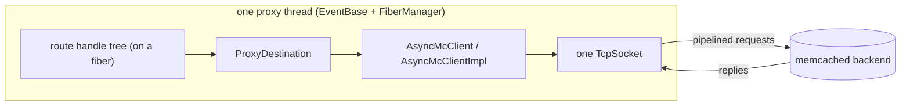
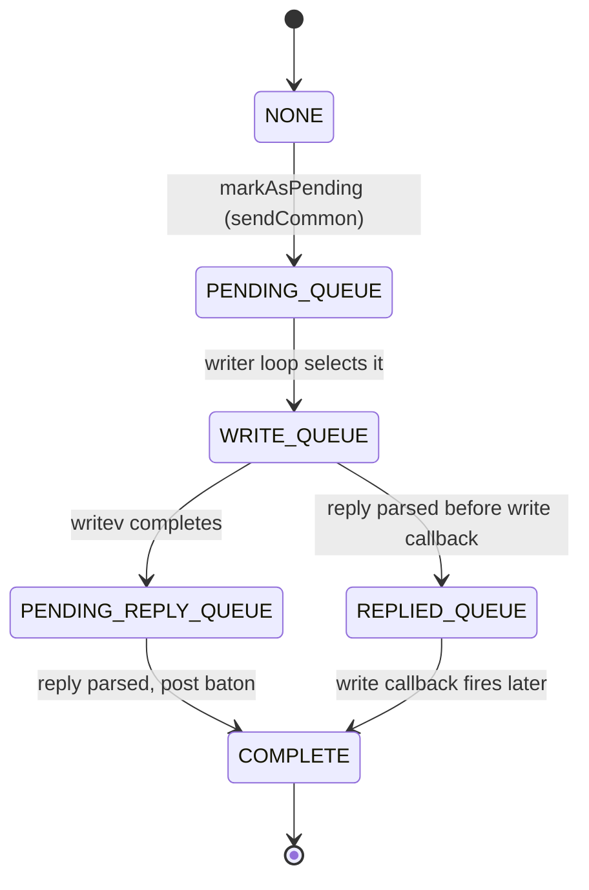
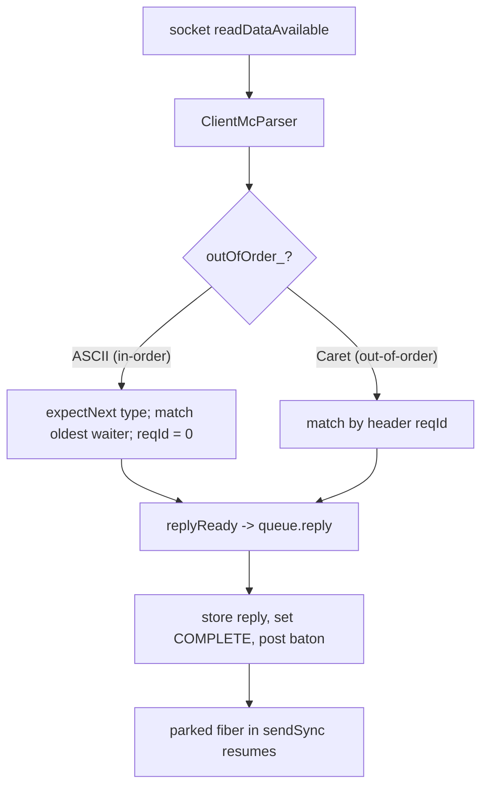

# mcrouter backend client (AsyncMcClient)

how mcrouter actually talks to a backing memcached host: one connection per
destination, many requests in flight at once, replies matched back to callers,
and the connection lifecycle around it. This is the piece a route handle reaches
when it forwards a request to a real server.

> Source pinned to `facebook/mcrouter` @ `42aa391189c7`. Citations are by symbol
> and file path (relative to the repo root). Reference-only — no rusty-mcrouter
> content. See `../design/backend-client.md` for what we copy and
> `../architecture/backend-client.md` for what we built. For the proxy/fiber
> machinery that *calls* this client, see [`threading-model.md`](./threading-model.md).

---

## tl;dr

- A `AsyncMcClient` owns **one TCP connection to one backend** and **pipelines**:
  many requests can be on the wire before the first reply comes back.
- It lives on a **proxy's `EventBase`** and is driven from **fibers**:
  `sendSync` blocks the calling fiber on a `Baton`, not the thread.
- Every outstanding request is a `McClientRequestContext` that moves through a
  small **state machine** across four internal queues.
- **Reply matching** is FIFO for the ASCII protocol (in-order) and by `reqId`
  for Caret (mcrouter's binary, out-of-order).
- Writes are **batched**: requests queued during one event-loop turn are flushed
  together with a single `writev` (scatter-gather, up to 24KB, `CORK` between
  batches).
- Two independent throttles: **`maxPending`** (queued, not yet written) and
  **`maxInflight`** (written, awaiting reply).
- On error/EOF the client **fails in-flight requests and reconnects** if
  requests are still pending.

---

## where it sits

`AsyncMcClient` is the leaf of the routing path. A route handle that targets a
server (through a `ProxyDestination`) calls into a client that is pinned to the
same proxy thread's event loop:



One client = one connection = one backend. The proxy may hold many clients (one
per destination), all on the same event loop. Because every client runs on the
proxy thread, its queues and connection state need no locks — the only
cross-thread hop already happened upstream, in the proxy message queue.

`AsyncMcClient` is one implementation of the `Transport` interface
(`mcrouter/lib/network/Transport.h`); there is also a Thrift transport. Route
handles are written against `Transport`, so the memcache client is swappable.

---

## public surface

`AsyncMcClient` is a thin, destruction-safe wrapper over a shared
`AsyncMcClientImpl` (`mcrouter/lib/network/AsyncMcClient.h`):

```cpp
/**
 * This class serves as a public interface and gateway to the client
 * implementation. It guarantees that all requests will be processed even after
 * this client was destroyed (i.e. the base client will be kept alive as long
 * as we have at least one request, but it will be impossible to send more
 * requests).
 */
class AsyncMcClient final : public Transport {
 public:
  template <class Request>
  ReplyT<Request> sendSync(
      const Request& request,
      std::chrono::milliseconds timeout,
      RpcStatsContext* rpcContext = nullptr);

  void setThrottle(size_t maxInflight, size_t maxPending) override final;
  RequestQueueStats getRequestQueueStats() const override final;
  void closeNow() override final;
  void updateTimeoutsIfShorter(
      std::chrono::milliseconds connectTimeout,
      std::chrono::milliseconds writeTimeout) override final;
  // ... status/request callbacks ...
 private:
  std::shared_ptr<AsyncMcClientImpl> base_;
};
```

`sendSync` is explicitly fiber-blocking, not thread-blocking — straight from the
header:

> Send request synchronously (i.e. blocking call). NOTE: it must be called only
> from fiber context. It will block the current stack and will send request only
> when we loop EventBase.

That single sentence is the whole trick: the *caller fiber* blocks, but the
*thread* keeps looping its `EventBase`, serving every other in-flight request on
every other fiber.

---

## the request context and its state machine

Each outstanding request is a `McClientRequestContext`. The base class holds the
fiber `Baton` it will be woken on and tracks a `ReqState`
(`mcrouter/lib/network/McClientRequestContext.h`):

```cpp
enum class ReqState {
  NONE,
  PENDING_QUEUE,        // accepted, not yet written
  WRITE_QUEUE,          // selected for the next writev
  PENDING_REPLY_QUEUE,  // written, waiting for the backend reply
  REPLIED_QUEUE,        // reply parsed before the write callback fired
  COMPLETE,
};
// ...
folly::fibers::Baton baton_;
McClientRequestContextQueue& queue_;
folly::fibers::Baton::TimeoutHandler batonTimeoutHandler_;
```

The `McClientRequestContextQueue` owns the contexts and exposes the counts the
rest of the client reasons about: `getPendingRequestCount()`,
`getInflightRequestCount()`, plus `markAsPending`, `failAllSent`,
`failAllPending`, and `reply(reqId, ...)`.



The `WRITE_QUEUE -> REPLIED_QUEUE` edge is the subtle one: a fast backend can
reply before the kernel's write-completion callback runs, so the context parks
in `REPLIED_QUEUE` until the write is confirmed, then completes. Keeping these as
distinct queues is what lets the client stay correct under that race.

---

## sending a request

`AsyncMcClientImpl::sendSync` is the core of the producer side
(`mcrouter/lib/network/AsyncMcClientImpl-inl.h`):

```cpp
template <class Request>
ReplyT<Request> AsyncMcClientImpl::sendSync(
    const Request& request,
    std::chrono::milliseconds timeout,
    RpcStatsContext* rpcContext) {
  assert(folly::fibers::onFiber());

  // Admission: maxPending is checked up front and fails fast.
  if (maxPending_ != 0 && queue_.getPendingRequestCount() >= maxPending_) {
    return createReply<Request>(ErrorReply, "Max pending requests (...) reached ...");
  }

  McClientRequestContext<Request> ctx(
      request,
      nextMsgId_,
      connectionOptions_.accessPoint->getProtocol(),
      queue_,
      [](ParserT& parser) { parser.expectNext<Request>(); }, // per-request parser init
      requestStatusCallbacks_.onStateChange,
      supportedCompressionCodecs_);
  sendCommon(ctx);

  auto reply = ctx.waitForReply(timeout);  // <-- fiber parks on the baton here
  // ...
  scheduleNextWriterLoop();                // unblock anything held back by maxInflight
  return reply;
}
```

`sendCommon` does not write to the socket directly. It marks the request
pending, schedules the writer loop, and kicks off a connection if the socket is
down (`mcrouter/lib/network/AsyncMcClientImpl.cpp`):

```cpp
void AsyncMcClientImpl::sendCommon(McClientRequestContextBase& req) {
  switch (req.reqContext.serializationResult()) {
    case McSerializedRequest::Result::OK:
      incMsgId(nextMsgId_);
      queue_.markAsPending(req);
      scheduleNextWriterLoop();
      if (connectionState_ == ConnectionState::Down) {
        attemptConnection();
      }
      return;
    case McSerializedRequest::Result::BAD_KEY:
      req.replyError(carbon::Result::BAD_KEY, "The key provided is invalid");
      return;
    case McSerializedRequest::Result::ERROR:
      req.replyError(carbon::Result::LOCAL_ERROR, "Error when serializing the request.");
      return;
  }
}
```

```mermaid
sequenceDiagram
  participant RH as route handle (fiber)
  participant CL as AsyncMcClientImpl
  participant Q as request context queue
  participant W as writer loop (EventBase)
  participant S as socket
  participant BK as memcached backend

  RH->>CL: sendSync(req, timeout)
  Note over CL: pending at maxPending limit, fail fast
  CL->>Q: markAsPending(ctx)
  CL->>W: scheduleNextWriterLoop (runInLoop)
  RH->>RH: ctx.waitForReply -> baton parks the fiber
  W->>Q: getNumToSend (respect maxInflight)
  W->>S: writev(batch; CORK between batches)
  S->>BK: pipelined requests
  BK-->>S: replies
  S-->>CL: readDataAvailable -> parser
  CL->>Q: replyReady -> queue.reply(reqId)
  Q-->>RH: post baton -> fiber resumes with reply
```

---

## the write path: deferred, batched, scatter-gather

mcrouter does **not** write each request as it arrives. The writer is a loop
callback scheduled with `eventBase_.runInLoop`, so all requests queued during one
event-loop turn flush together. How many go out respects `maxInflight`
(`mcrouter/lib/network/AsyncMcClientImpl.cpp`):

```cpp
size_t AsyncMcClientImpl::getNumToSend() const {
  size_t numToSend = queue_.getPendingRequestCount();
  if (maxInflight_ != 0) {
    if (maxInflight_ <= queue_.getInflightRequestCount()) {
      numToSend = 0;
    } else {
      numToSend = std::min(numToSend, maxInflight_ - queue_.getInflightRequestCount());
    }
  }
  return numToSend;
}

void AsyncMcClientImpl::scheduleNextWriterLoop() {
  if (connectionState_ == ConnectionState::Up &&
      !writer_.isLoopCallbackScheduled() &&
      (getNumToSend() > 0 || pendingGoAwayReply_)) {
    // flushList_ when batching across clients, else this event base
    eventBase_.runInLoop(&writer_);
  }
}
```

`pushMessages` then gathers each request's serialized `iovec`s into a fixed
stack array and writes them with one `writev`, corking all but the final batch.
The value bytes are never copied — the `iovec`s point straight into the
request's buffers:

```cpp
constexpr size_t kMaxBatchSize = 24576 /* 24KB */;

auto sendBatchFun = [this](McClientRequestContextBase* tailReq,
                           const struct iovec* iov, size_t iovCnt, bool last) {
  tailReq->isBatchTail = true;
  socket_->writev(
      this, iov, iovCnt,
      last ? folly::WriteFlags::NONE : folly::WriteFlags::CORK);
  return connectionState_ == ConnectionState::Up;
};

while (queue_.getPendingRequestCount() != 0 && numToSend > 0 &&
       connectionState_ == ConnectionState::Up) {
  auto& req = queue_.peekNextPending();
  auto iov = req.reqContext.getIovs();
  auto iovcnt = req.reqContext.getIovsCount();
  // flush when the stack iovec array fills or the 24KB batch cap is hit, CORK between
  // ...
}
```

Net effect: under load, N pipelined requests cost roughly one `writev` syscall
per event-loop turn instead of N writes, with zero value-byte copies.

---

## the reply path: parse, match, wake

Incoming bytes are fed to a `ClientMcParser`. The protocol decides the matching
strategy — set once at construction
(`mcrouter/lib/network/AsyncMcClientImpl.cpp`):

```cpp
outOfOrder_(options.accessPoint->getProtocol() != mc_ascii_protocol)
```

- **ASCII (in-order):** replies carry no id, so the parser must be told the
  expected reply type for the *next* reply. That is the
  `[](ParserT& parser){ parser.expectNext<Request>(); }` initializer attached to
  each context. `replyReady(..., reqId = 0)` then completes the oldest waiter
  (FIFO).
- **Caret (out-of-order):** the header carries a `reqId`; the parser looks up the
  matching context by id (`callback_.nextReplyAvailable(reqId)`), and id `0`
  (`kCaretConnectionControlReqId`) is reserved for connection-control messages
  like GoAway (`mcrouter/lib/network/ClientMcParser-inl.h`).

Either way, delivery funnels through one method
(`mcrouter/lib/network/AsyncMcClientImpl-inl.h`):

```cpp
template <class Reply>
void AsyncMcClientImpl::replyReady(Reply&& r, uint64_t reqId, RpcStatsContext stats) {
  assert(connectionState_ == ConnectionState::Up);
  queue_.reply(reqId, std::move(r), stats);  // find waiter (FIFO or by reqId), post its baton
}
```

`queue_.reply` stores the reply into the context, moves it to `COMPLETE`, and
posts its `Baton` — which resumes the parked fiber inside `sendSync`.



---

## throttling: maxPending vs maxInflight

These are two different limits and they guard two different stages
(`mcrouter/lib/network/AsyncMcClient.h`):

| Knob | Bounds | Enforced | On overflow |
|---|---|---|---|
| `maxPending` | requests **queued but not yet written** | up front in `sendSync` | request fails immediately with a local error |
| `maxInflight` | requests **written, awaiting reply** | in `getNumToSend` / writer loop | new sends stay pending until replies free up slots |

So `maxPending` is fail-fast backpressure (protects memory/queue depth), while
`maxInflight` is a flow-control window over the wire (don't pipeline more than N
at once). The header notes you cannot expect to send `maxPending + maxInflight`
at once.

---

## connection lifecycle and failures

The connection is lazy: it is established on the first pending request
(`sendCommon` -> `attemptConnection`). On any read/write error or EOF the client
funnels into `processShutdown`, which separates **sent** requests (already on the
wire) from **pending** ones (not yet written), and reconnects if work remains
(`mcrouter/lib/network/AsyncMcClientImpl.cpp`):

```cpp
void AsyncMcClientImpl::processShutdown(folly::StringPiece errorMessage) {
  switch (connectionState_) {
    case ConnectionState::Up:               // UP always transitions to ERROR
      cancelWriterCallback();
      connectionState_ = ConnectionState::Error;
      socket_->setReadCB(nullptr);
      socket_->close();
      [[fallthrough]];
    case ConnectionState::Error:
      queue_.failAllSent(/* ABORTED or REMOTE_ERROR */, errorMessage);
      if (queue_.getInflightRequestCount() == 0) {
        if (isAborting_) {
          queue_.failAllPending(carbon::Result::ABORTED, errorMessage);
        }
        // onDown callback, drop the socket, go DOWN
        connectionState_ = ConnectionState::Down;
        socket_.reset();
        // If requests are still pending, reconnect immediately.
        if (queue_.getPendingRequestCount() != 0) {
          attemptConnection();
        }
      }
      return;
    // ...
  }
}

void AsyncMcClientImpl::readEOF() noexcept {
  processShutdown("Connection closed by the server.");
}
```



```mermaid
stateDiagram-v2
  [*] --> Down
  Down --> Connecting: first pending request
  Connecting --> Up: connect success
  Connecting --> Down: connect error (fail pending if retries exhausted)
  Up --> Error: read/write error or EOF
  Error --> Down: failAllSent; when inflight reaches 0
  Down --> Connecting: requests still pending, reconnect
```

The key invariants: **sent (in-flight) requests are failed first**; pending
requests are only failed on abort, otherwise they ride the reconnect; and the
socket is fully reset before going `Down` so a clean reconnect can follow.

### timeouts

Two distinct timeouts, distinguished by where the request is when the clock
fires:

- **Reply timeout** — `sendSync(req, timeout)` arms a `Baton::TimeoutHandler`; if
  the reply doesn't arrive in time the fiber is woken with a timeout reply. For
  the in-order ASCII protocol the context must stay reserved as a tombstone so a
  late wire reply is still parsed and discarded in the right shape (FIFO
  alignment can't be broken).
- **Connect timeout / write timeout** — carried in `ConnectionOptions` and
  adjustable via `updateTimeoutsIfShorter(connectTimeout, writeTimeout)` (only
  shrinks, never grows).

---

## how it connects back to the proxy/fiber model

Putting it together with [`threading-model.md`](./threading-model.md): a request
drained from a proxy's message queue is scheduled on a fiber
(`fiberManager().addTaskFinally`), walks the route handle tree, and a leaf hands
it to `AsyncMcClient::sendSync`. The fiber parks on a `Baton`; the proxy
`EventBase` keeps serving every other fiber; the writer loop batches the request
onto the wire; the read callback parses the reply and posts the baton; the fiber
resumes and returns up the route handle tree to `sendReply`. One thread, one
socket per backend, many concurrent requests — no locks anywhere on the hot
path.

---

## the knobs that shape all of this

| Option | Effect |
|---|---|
| `maxInflight` (`setThrottle`) | Max requests written and awaiting reply; flow-control window. |
| `maxPending` (`setThrottle`) | Max requests queued before write; fail-fast backpressure. |
| connect / write timeout | `ConnectionOptions`; `updateTimeoutsIfShorter`. |
| per-request timeout | Passed to each `sendSync` call. |
| protocol (`AccessPoint`) | ASCII -> in-order FIFO matching; Caret -> out-of-order by `reqId`. |
| `kMaxBatchSize` (24KB) | Max bytes coalesced into one `writev`. |
| compression codecs | `supportedCompressionCodecs_`, negotiated per connection. |

---

## source map

| Concept | Symbol | File @ `42aa391189c7` |
|---|---|---|
| Public wrapper | `AsyncMcClient` | `mcrouter/lib/network/AsyncMcClient.h` |
| Implementation | `AsyncMcClientImpl` | `mcrouter/lib/network/AsyncMcClientImpl.h/.cpp` |
| Fiber-blocking send | `AsyncMcClientImpl::sendSync` | `mcrouter/lib/network/AsyncMcClientImpl-inl.h` |
| Enqueue + connect | `AsyncMcClientImpl::sendCommon` | `mcrouter/lib/network/AsyncMcClientImpl.cpp` |
| Write window | `AsyncMcClientImpl::getNumToSend`, `scheduleNextWriterLoop` | `mcrouter/lib/network/AsyncMcClientImpl.cpp` |
| Batched writev | `AsyncMcClientImpl::pushMessages` (`kMaxBatchSize`) | `mcrouter/lib/network/AsyncMcClientImpl.cpp` |
| Reply delivery | `AsyncMcClientImpl::replyReady` | `mcrouter/lib/network/AsyncMcClientImpl-inl.h` |
| Request states + queues | `McClientRequestContextBase::ReqState`, `McClientRequestContextQueue` | `mcrouter/lib/network/McClientRequestContext.h` |
| Reply matching | `ClientMcParser::expectNext`, `nextReplyAvailable` | `mcrouter/lib/network/ClientMcParser-inl.h` |
| Failure / reconnect | `AsyncMcClientImpl::processShutdown`, `readEOF` | `mcrouter/lib/network/AsyncMcClientImpl.cpp` |
| Transport interface | `Transport` | `mcrouter/lib/network/Transport.h` |
