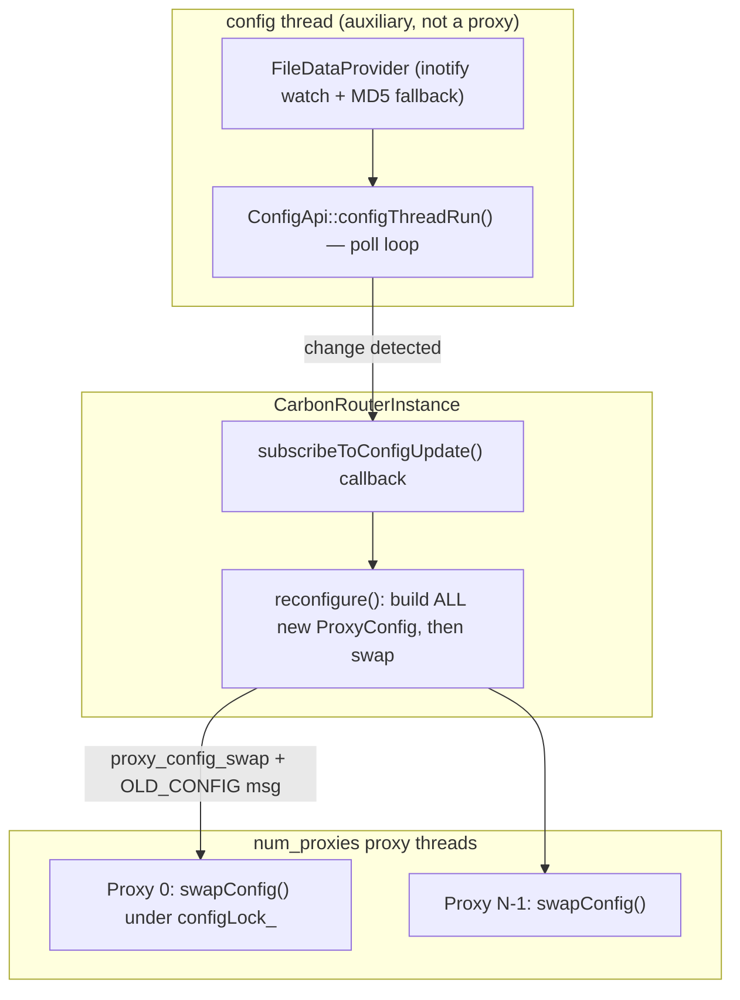
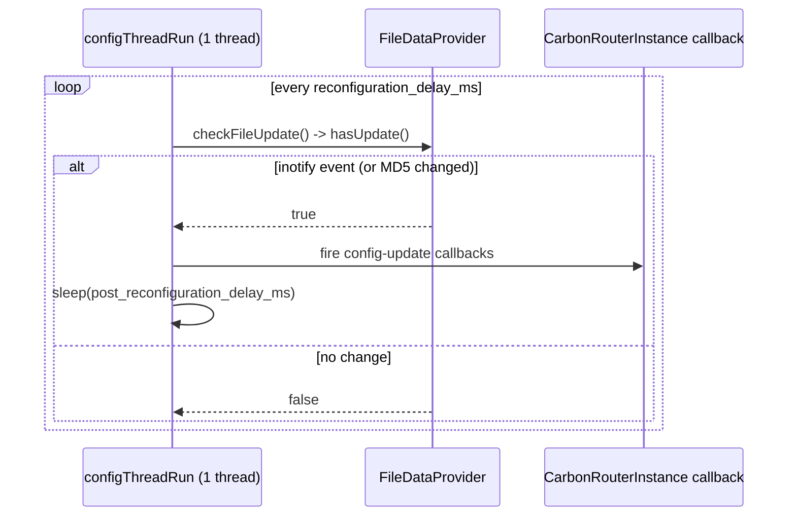
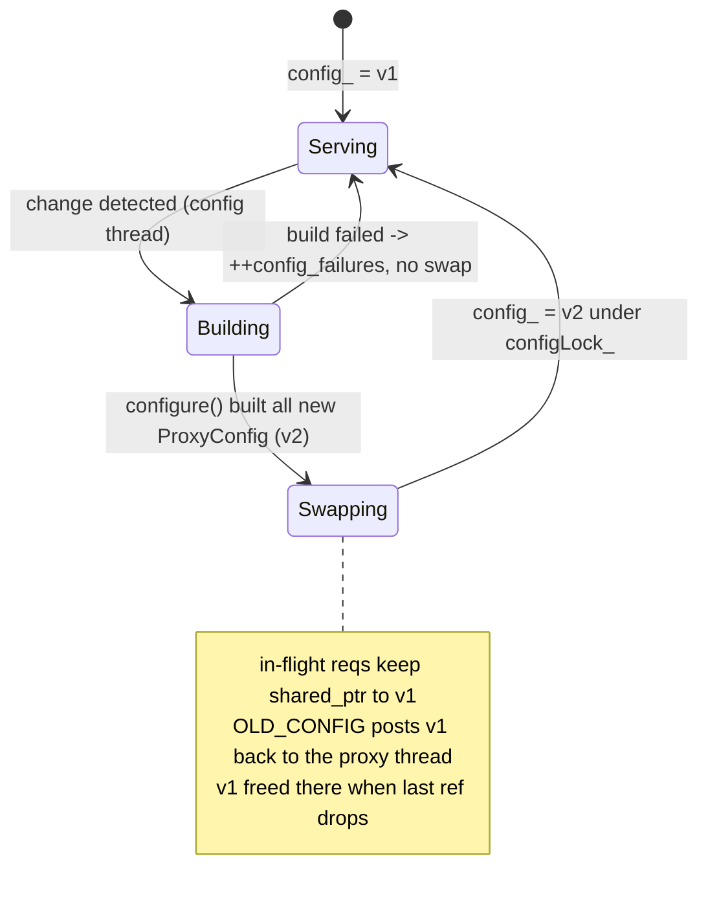

# mcrouter config loading + hot reload (ConfigApi)

how Meta's mcrouter loads its routing config at startup and then **hot-reloads**
it without dropping a connection or a request: where the config comes from, the
thread that watches it, how a new config is built and atomically swapped into
every running proxy, how a bad config is rejected so the live one keeps serving,
and the admin/stats surface that lets you see all of it.

> Source pinned to `facebook/mcrouter` @ `42aa391189c7`. Citations are by symbol
> and file path (relative to the repo root); line numbers drift, symbols don't.
> Reference-only — no rusty-mcrouter content. See
> [`../design/config-reload.md`](../design/config-reload.md) for what we copy and
> `../architecture/config-reload.md` for what we end up building. For the
> proxy/event-loop machinery the swap rides on, see
> [`threading-model.md`](./threading-model.md); for the `config_*` counters, see
> [`observability.md`](./observability.md).

---

## tl;dr

- **Config has three source types**, behind a `ConfigApiIf`:
  `enum class ConfigType { ConfigFile, ConfigImport, Pool }` (`ConfigApiIf.h`).
  The top-level config is chosen by precedence: `--config` (a `file:` path *or*
  raw JSON), else `--config-str`, else the deprecated `--config-file`.
- **One auxiliary thread watches for changes** — `ConfigApi::configThread_`,
  driven by `ConfigApi::configThreadRun()`. It is **not** a proxy thread. It is
  not even started if `--disable-reload-configs` is set.
- **Change detection is inotify, with an MD5 fallback.**
  `FileDataProvider::hasUpdate()` arms an inotify watch on the config file's
  symlink chain; if inotify can't be set up it falls back to re-hashing the file
  every 60 s (`kConfigReloadInterval`). `ConfigApi::checkFileUpdate()` is the poll
  entry point.
- **Reload builds first, swaps second.** On a change,
  `CarbonRouterInstance::reconfigure()` builds **all** new
  `ProxyConfig<RouterInfo>` objects, *then* swaps each proxy. A request in flight
  holds a `shared_ptr<const ProxyConfig>` and keeps using the old config; new
  requests pick up the new one. **No request is dropped.**
- **The old config is freed on its own proxy thread.** The swap posts a
  `ProxyMessage::Type::OLD_CONFIG` back to the proxy so the old `shared_ptr`'s
  last reference dies on the thread that owned it — never on the config thread.
- **A bad config can't take down a good one.** `--validate-config` is a separate
  dry-run mode; at runtime a failed reconfigure increments `config_failures`,
  abandons the tracked sources, and **does not swap** — the live config keeps
  serving. The last-known-good config is also dumped to disk
  (`config_dump_root`) for cold-start recovery.
- **It's all introspectable**: `get __mcrouter__.config_age` /
  `config_md5_digest` / `config_sources_info` / `preprocessed_config`, plus the
  `config_last_attempt` / `config_last_success` / `config_failures` stats.

---

## where it sits

Config loading is a **control-plane** concern that lives off to the side of the
`num_proxies` request-serving threads (see
[`threading-model.md`](./threading-model.md)). One auxiliary thread owns the
watch + reload loop; the actual swap is handed to each proxy's event loop so the
proxy-local route handle tree is only ever touched by its owning thread.



---

## 1. config sources: `ConfigApi` / `ConfigApiIf`

The router reads config through a `ConfigApiIf` (`mcrouter/ConfigApiIf.h`), which
abstracts *where* a piece of config comes from:

```cpp
enum class ConfigType {
  ConfigFile = 0,   // the top-level config (file or inline JSON)
  ConfigImport = 1, // a @import'd fragment, resolved relative to the config file
  Pool = 2,         // a pool definition pulled in by the PoolFactory
};
// get(ConfigType, id, ...) and getConfigFile(...) are the surface
```

`ConfigApi` (`mcrouter/ConfigApi.h`/`.cpp`) is the standalone implementation.
`ConfigApi::getConfigFile()` picks the top-level source by precedence:

1. `opts_.config` — either a `file:/path` reference **or** raw inline JSON,
2. else `opts_.config_str` (inline JSON),
3. else the deprecated `opts_.config_file`.

`ConfigApi::get()` then resolves the other types: a `ConfigImport` is loaded
relative to the config file's directory (`McImportResolver.cpp`), and `Pool`
config is only resolvable when the top-level source is a real `file:` path
(`PoolFactory.cpp`). The API also tracks which sources a given config *used* —
`trackConfigSources()` / `subscribeToTrackedSources()` /
`abandonTrackedSources()` / `getConfigSourcesInfo()` — so the watcher knows
exactly which files to watch for the *next* reload (imports included, not just
the root file).

---

## 2. the reload thread: `configThreadRun`

`ConfigApi::startObserving()` spawns `configThread_` — **unless**
`--disable-reload-configs` is set, in which case the config is loaded once and
never watched. The loop is `ConfigApi::configThreadRun()`:

```cpp
// ConfigApi.cpp — sketch of the loop
while (!finish_) {
  if (checkFileUpdate()) {          // did any tracked source change?
    // notify subscribers (CarbonRouterInstance::subscribeToConfigUpdate)
    callCallbacks();
    sleep(post_reconfiguration_delay_ms);
  }
  sleep(reconfiguration_delay_ms + jitter(reconfiguration_jitter_ms));
}
```

- **`checkFileUpdate()`** walks the tracked `FileDataProvider`s and asks each
  `hasUpdate()`.
- **`--constantly-reload-configs`** is a test knob that bypasses file watching
  entirely and just re-notifies every ~10 ms (used to stress the swap path).
- `reconfiguration_delay_ms` paces the poll; `reconfiguration_jitter_ms` spreads
  reload load across a fleet; `post_reconfiguration_delay_ms` is a cooldown after
  a successful reload.

### change detection: inotify, falling back to MD5

`FileDataProvider` (`mcrouter/FileDataProvider.cpp`) is the actual watch
primitive. Its `hasUpdate()`:

- arms an **inotify** watch on the config file *and every symlink in its chain*
  (so an atomic symlink-swap deploy is seen), re-arming after each update;
- if inotify can't be set up (or throws), `ConfigApi::checkFileUpdate()` catches
  it, resets the provider, and **falls back to re-reading + MD5-hashing** the
  file on a fixed interval (`kConfigReloadInterval = 60 s`).

So mcrouter prefers event-driven (inotify) but is robust to filesystems where
inotify doesn't work — it degrades to polling, never to "stops noticing."



---

## 3. the reconfigure path: build all, then swap

The instance subscribes to the config thread in
`CarbonRouterInstance::subscribeToConfigUpdate()`
(`mcrouter/CarbonRouterInstance-inl.h`). On a fired callback:

```
subscribeToConfigUpdate()  // callback fires on the config thread
  -> lock configReconfigLock_                       // serialize reconfigures
  -> createConfigBuilder()                          // read + preprocess + PoolFactory
       -> stat config_last_attempt = now
       -> ConfigApi::trackConfigSources()
       -> ProxyConfigBuilder(opts, configApi, json) // preprocessing happens here
  -> reconfigure(builder)
       -> configure(builder)                        // build ALL ProxyConfig first
       -> on success: stat config_last_success = now
       -> on failure : ++config_failures; abandonTrackedSources(); (no swap)
```

`CarbonRouterInstance::configure()` is the load-bearing ordering: it constructs a
fresh `ProxyConfig<RouterInfo>` (the whole route handle tree + destinations) for
**every** proxy *before* swapping any of them. Only once all new configs are
built does it call `proxy_config_swap()` per proxy.

`ProxyConfigBuilder` (`mcrouter/ProxyConfigBuilder.cpp`) is what turns JSON into
a routable tree: it runs the preprocessor (§6), builds the `PoolFactory`, and
hands the parsed structure to `ProxyConfig`'s constructor.

---

## 4. the hot swap: no dropped requests, old config freed on-thread

This is the part that makes it *hot*. The swap itself
(`proxy_config_swap()` / `Proxy::swapConfig()`, `mcrouter/Proxy-inl.h`):

```cpp
// Proxy::swapConfig — runs under the proxy's own configLock_
std::shared_ptr<ProxyConfig<RouterInfo>> old;
{
  std::lock_guard<...> lock(configLock_);
  old = std::move(config_);
  config_ = std::move(newConfig);     // atomic-ish pointer swap
}
// proxy_config_swap then: stat config_last_success, and post OLD_CONFIG back
messageQueue_->blockingWrite(ProxyMessage::Type::OLD_CONFIG, old.release());
```

Two invariants make this safe:

1. **In-flight requests pin the old config.** When a request starts,
   `ProxyRequestContextTyped::process()` takes a
   `std::shared_ptr<const ProxyConfig<RouterInfo>>` and routes against *that*
   for its whole lifetime. A swap that happens mid-request doesn't yank the tree
   out from under it — the request finishes on the config it started with, new
   requests get the new one. No reply is lost, no route is half-applied.
   On the proxy thread itself the fast read is `getConfigUnsafe()` (no lock,
   because only that thread writes `config_`); other threads use a locked
   accessor.

2. **The old config dies on the proxy thread.** Rather than letting the last
   `shared_ptr` reference drop on the config thread (which could run destructors
   for thread-local destination state off-thread), the swap **posts the old
   pointer back to the proxy** as a `ProxyMessage::Type::OLD_CONFIG`. The proxy's
   `messageReady` handler deletes it there (see
   [`threading-model.md`](./threading-model.md), where `OLD_CONFIG` is listed as
   "delete old config"). Teardown of connections/queues thus stays on the owning
   thread — the same shared-nothing discipline as the hot path.



---

## 5. validation, last-known-good, and on-disk backup

mcrouter goes to real lengths to never serve — or die on — a broken config.

- **`--validate-config`** is a standalone dry-run, handled in
  `StandaloneUtils::runStandaloneMcrouter()`. In `Exit` mode it initializes a
  router and `_exit(0)` if the config is valid (a CI / deploy gate); `Run` mode
  proceeds only if valid. `extraValidateOptions()` (`mcrouter_config.cpp`)
  enforces source precedence — `config` supersedes `config_file`/`config_str`,
  and exactly one source must be present.
- **Runtime reload failure keeps the live config.** A failed `reconfigure()`
  increments `config_failures`, calls `abandonTrackedSources()`, and returns
  *without swapping*. The proxies keep routing on the last good `ProxyConfig`.
- **Cold-start fallback to disk.** If the *initial* config fails to load,
  `createConfigBuilder()` can flip `ConfigApi` into backup mode
  (`enableReadingFromBackupFiles()`) and retry from the last dumped config.
- **The backup dump.** `ConfigApi::dumpConfigSourceToDisk()` writes each source
  under `config_dump_root/<service>/<router>/` (names derived from the source id,
  e.g. `file:-<escaped path>`), recording md5/version in `backupFiles_`.
  `readFromBackupFile()` refuses a backup older than `max_dumped_config_age`, so
  a stale dump can't silently resurrect ancient routing. The disk write runs on a
  dedicated executor, not the config thread.

---

## 6. preprocessing: macros and `@import`

Every build runs the config through `ConfigPreprocessor`
(`mcrouter/lib/config/ConfigPreprocessor.cpp`). `getConfigWithoutMacros()` is the
entry point; it installs built-in macros, the important one being **`@import`**
(`BuiltIns::importMacro()`), which pulls in another config fragment (resolved as
a `ConfigType::ConfigImport`), strips comments, re-expands macros, and caches per
path within a single run. Because `ProxyConfigBuilder` runs the preprocessor on
*every* build, a reload re-runs preprocessing and re-resolves imports — and those
imported files are tracked as sources, so editing an imported fragment also
triggers a reload.

---

## 7. admin + stats: seeing the config

Live introspection is via `ServiceInfo` (`mcrouter/ServiceInfo-inl.h`),
addressed with the magic-key admin protocol (`get __mcrouter__.<cmd>`):

| Command | Returns |
|---|---|
| `config_age` | seconds since the last successful reconfigure |
| `config_file` | the resolved config file path |
| `config_md5_digest` | md5 of the current (top-level) config |
| `config_sources_info` | per-source hash map: `mcrouter_config`, `config_file`, `config_import`, `pools` |
| `preprocessed_config` | the current config re-run through the preprocessor, on demand |

And the counters (declared in `stat_list.h`, populated in `stats.cpp`):

| Stat | Meaning |
|---|---|
| `config_last_attempt` | timestamp of the last reconfigure attempt |
| `config_last_success` | timestamp of the last successful swap |
| `config_failures` | count of failed reconfigures (the alerting signal) |
| `config_age` | derived: now − `config_last_success` |

`config_failures` climbing while `config_age` grows is the canonical "deploys are
landing but mcrouter is rejecting them" alarm.

---

## the knobs that shape all of this

| Option | Effect |
|---|---|
| `config` | top-level source: a `file:` path or inline JSON (supersedes the two below). |
| `config_str` | inline JSON config (no file ⇒ nothing to watch ⇒ effectively no reload). |
| `config_file` | deprecated file path. |
| `disable_reload_configs` | load once, never start `configThread_`. |
| `constantly_reload_configs` | test knob: re-notify ~every 10 ms, bypass file watch. |
| `reconfiguration_delay_ms` | poll/debounce interval of the config thread. |
| `reconfiguration_jitter_ms` | random spread added to the delay (fleet de-sync). |
| `post_reconfiguration_delay_ms` | cooldown after a successful reload. |
| `config_dump_root` | directory for last-known-good source dumps. |
| `max_dumped_config_age` | reject a disk backup older than this on cold start. |

(There is **no** `file_observe` config-reload knob in this commit;
`file_observer_poll_period_ms` / `file_observer_sleep_before_update_ms` exist but
drive *runtime-vars* file observation, a separate subsystem.)

---

## source map

| Concept | Symbol | File @ `42aa391189c7` |
|---|---|---|
| Source abstraction + types | `ConfigApiIf`, `ConfigType` | `mcrouter/ConfigApiIf.h` |
| Standalone config API | `ConfigApi`, `getConfigFile`, `get`, `trackConfigSources`, `getConfigSourcesInfo`, `checkFileUpdate` | `mcrouter/ConfigApi.h`, `mcrouter/ConfigApi.cpp` |
| Reload thread | `ConfigApi::startObserving`, `configThread_`, `configThreadRun` | `mcrouter/ConfigApi.cpp` |
| Change detection | `FileDataProvider::hasUpdate` (inotify), `kConfigReloadInterval` (MD5 fallback) | `mcrouter/FileDataProvider.cpp` |
| Import resolution | `McImportResolver` | `mcrouter/routes/McImportResolver.cpp` |
| Pool source | `PoolFactory` | `mcrouter/PoolFactory.cpp` |
| Subscribe + reconfigure | `subscribeToConfigUpdate`, `createConfigBuilder`, `reconfigure`, `configure`, `configReconfigLock_` | `mcrouter/CarbonRouterInstance-inl.h` |
| Build a routable config | `ProxyConfigBuilder` | `mcrouter/ProxyConfigBuilder.cpp` |
| The config object | `ProxyConfig<RouterInfo>` | `mcrouter/ProxyConfig.h` |
| The swap | `proxy_config_swap`, `Proxy::swapConfig`, `configLock_`, `getConfigUnsafe` | `mcrouter/Proxy.h`, `mcrouter/Proxy-inl.h` |
| Old-config free-on-thread | `ProxyMessage::Type::OLD_CONFIG` | `mcrouter/Proxy.h`, `mcrouter/Proxy-inl.h` |
| In-flight config pin | `ProxyRequestContextTyped::process` (`shared_ptr<const ProxyConfig>`) | `mcrouter/ProxyRequestContextTyped-inl.h` |
| Validate + LKG + backup | `--validate-config`, `extraValidateOptions`, `enableReadingFromBackupFiles`, `dumpConfigSourceToDisk`, `readFromBackupFile`, `max_dumped_config_age` | `mcrouter/StandaloneUtils.cpp`, `mcrouter/mcrouter_config.cpp`, `mcrouter/ConfigApi.cpp` |
| Preprocessing | `ConfigPreprocessor::getConfigWithoutMacros`, `BuiltIns::importMacro` (`@import`) | `mcrouter/lib/config/ConfigPreprocessor.h`, `.cpp` |
| Admin introspection | `ServiceInfo` (`config_age`, `config_md5_digest`, `config_sources_info`, `preprocessed_config`) | `mcrouter/ServiceInfo-inl.h` |
| Stats | `config_last_attempt`, `config_last_success`, `config_failures`, `config_age` | `mcrouter/stat_list.h`, `mcrouter/stats.cpp` |
| Startup knobs | `config`, `config_str`, `config_file`, `disable_reload_configs`, `constantly_reload_configs`, `reconfiguration_delay_ms`, `reconfiguration_jitter_ms`, `post_reconfiguration_delay_ms`, `config_dump_root`, `max_dumped_config_age` | `mcrouter/mcrouter_options_list.h` |
