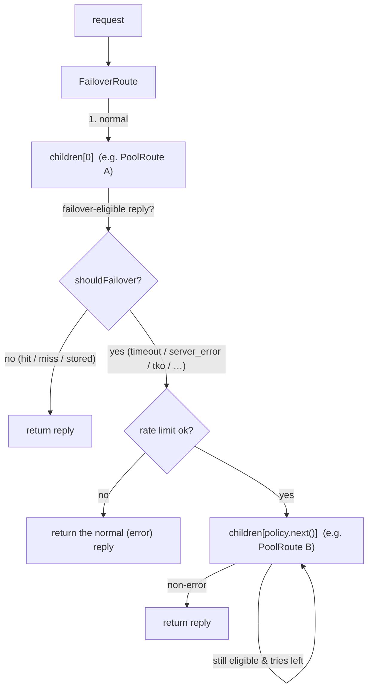
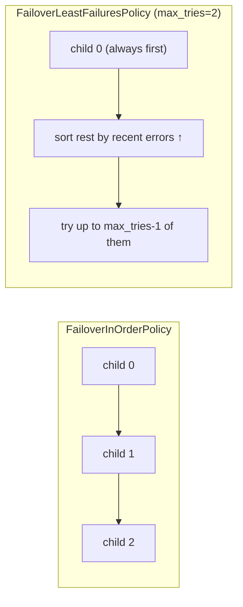

# mcrouter failover routes

how Meta's mcrouter keeps serving when a backend goes bad: the **`FailoverRoute`**
that tries a normal child and, on a *failover-eligible* reply, walks the remaining
children in a policy-chosen order until one answers; the **`FailoverErrorsSettings`**
that decides *which* result codes are eligible (per operation type); the
**`FailoverWithExptimeRoute`** that shortens the TTL of writes it diverts to a
backup; the **`FailoverRateLimiter`** that caps how much traffic may spill to the
backup; and the **`FailoverPolicy`** family (in-order vs least-failures) that
picks *which* backup and *how many* to try. This is the route handle that turns
the classified errors the leaf produces (timeouts, connect errors, `SERVER_ERROR`,
TKO) into a second chance on another destination.

> Source pinned to `facebook/mcrouter` @ `42aa391189c7`. Citations are by symbol
> and file path (relative to the repo root); line numbers drift, symbols don't.
> Wiki citations are pinned to `facebook/mcrouter.wiki` @ `855a79c9f528`.
> Reference-only — no rusty-mcrouter content. See [`../design/failover.md`](../design/failover.md)
> for what we copy and why, and [`./timeouts.md`](./timeouts.md) for the leaf-local
> mechanism that *produces* the failover-eligible result codes this route
> *consumes* (the prerequisite: a timeout must become a `TIMEOUT` result before
> failover can read it — see [`./timeouts.md` §9](./timeouts.md#9-how-a-timeout-becomes-a-failover)).
> For the pool/selection layer a `FailoverRoute` sits above, see
> [`./hash-routing.md`](./hash-routing.md).

---

## tl;dr

- **A `FailoverRoute` is a list of child route handles plus a policy.** It routes
  the request to the **first** child ("normal route"); if that reply is
  *failover-eligible* (and failover isn't disabled), it re-routes the *same
  request* to the next child the policy picks, stopping at the first non-error
  reply or when it runs out of tries. There is no fan-out — failover is strictly
  sequential, one child at a time.
- **Eligibility is decided by the reply's result code, nothing else.**
  `FailoverErrorsSettings::shouldFailover(reply, req)` classifies per operation
  type (`gets` / `updates` / `deletes`); with no `failover_errors` configured it
  falls back to `isFailoverErrorResult` — `BUSY`, `SHUTDOWN`, `TKO`,
  `RES_TRY_AGAIN`, `LOCAL_ERROR`, `CONNECT_ERROR`, `CONNECT_TIMEOUT`, `TIMEOUT`,
  `REMOTE_ERROR`, `DEADLINE_EXCEEDED`. **`NOTFOUND` is a valid reply, not an
  error** — a miss never fails over.
- **`FailoverWithExptimeRoute` is a two-child sugar** (`normal` + `failover`) that
  wraps the failover child in `ModifyExptimeRoute` so writes diverted to the backup
  get `min(original_exptime, failover_exptime)` (default `failover_exptime = 60`s).
  It caps how long a backup copy can live, so a stale failover write can't outlive
  the outage. Deletes and requests without an exptime pass through untouched.
- **`FailoverRateLimiter` (`failover_limit`) is a token bucket over *total*
  requests**, not over failover QPS: `rate ∈ [0,1]` is the fraction of traffic
  allowed to fail over, `burst` (default `1000`) is the bucket depth. Every normal
  request bumps the counter; each failover attempt spends a token. Exhausted →
  the normal (error) reply is returned instead of failing over.
- **Two ordering policies matter.** `FailoverInOrderPolicy` (default) tries
  children in config order. `FailoverLeastFailuresPolicy` tries child 0 first, then
  the remaining children sorted by ascending recent-error count (with a required
  `max_tries` cap). `DeterministicOrderPolicy` / `RendezvousPolicy` also exist in
  the same selector.
- **`TKO` is a "free" failover.** A destination that has been knocked out
  ([`./timeouts.md` §6](./timeouts.md#6-tko-repeated-timeouts-knock-a-destination-out))
  short-circuits to a `TKO` reply without a network round-trip; the failover loop
  treats that as a failover trigger that doesn't consume a rate-limit token or a
  bounded try, so an out-of-service box is skipped cheaply.

---

## where it sits: a route with children + a policy

Unlike `SelectionRoute` (which picks **one** child by hashing the key and never
looks back — [`./hash-routing.md`](./hash-routing.md)), a `FailoverRoute` owns an
**ordered list of children** and re-routes the *same* request across them until
one succeeds. Its children are arbitrary route handles — usually `PoolRoute`s
(one per region/replica), so failover is "try region A, then region B."



The route handle is `FailoverRoute<RouterInfo, FailoverPolicyT>`
(`mcrouter/routes/FailoverRoute.h`): a `std::vector` of child route handles, a
`FailoverErrorsSettings` (eligibility), an optional `FailoverRateLimiter`, and the
policy `FailoverPolicyT` that yields the failover order. `createFailoverRoute`
(`mcrouter/routes/FailoverRoute-inl.h`) is the factory that reads the JSON and
picks the policy type.

---

## 1. the failover loop

`FailoverRoute::doRoute` (`mcrouter/routes/FailoverRoute.h`) is the whole
algorithm. Structurally (condensed — the real loop threads the policy iterator,
the rate-limit gate, and the TKO check inline):

```cpp
// 1) normal route: always children_[0]
auto normalReply = children_[0]->route(req);

// 2) not eligible, or failover globally disabled -> we're done
if (!failoverErrors_.shouldFailover(normalReply, req) ||
    fiber_local<RouterInfo>::getFailoverDisabled()) {
  return normalReply;
}

// 3) walk the policy's order, bounded by the policy's try budget
auto policyCtx = failoverPolicy_.getFailoverIterator(...);
for (auto it = policyCtx.begin(); it != policyCtx.end(); ++it) {
  // rate-limit gate (skipped for a TKO "free" failover)
  if (rateLimiter_ && !isTko(reply) && !rateLimiter_->failoverAllowed()) {
    break;                               // out of tokens -> stop, return last reply
  }
  auto failoverReply = (*it)->route(req);        // SAME request, next child
  if (!failoverErrors_.shouldFailover(failoverReply, req)) {
    return failoverReply;                // first non-error wins
  }
  reply = std::move(failoverReply);      // remember the last (error) reply
}
return reply;                            // all failed -> the last reply
```

Four load-bearing facts:

- **The normal route is always child 0.** Failover is "child 0, then the policy's
  order over the rest." The policy decides ordering and how many of the remaining
  children to try (`getFailoverIterator` / `end()`), not *whether* child 0 runs.
- **The same request object is re-sent.** `req` is routed verbatim to each child;
  there is no per-child mutation in the base `FailoverRoute` (the exptime rewrite
  in `FailoverWithExptimeRoute` is done by *wrapping each failover child*, not by
  the loop — [§4](#4-failoverwithexptimeroute-shorter-ttl-on-the-backup)).
- **First non-failover reply wins**; if every attempt stays failover-eligible, the
  **last** reply is returned (so the client sees a real error, not a synthetic
  one).
- **Global disable short-circuits.** `fiber_local::getFailoverDisabled()` lets an
  upstream handle turn failover off for a request (e.g. a shadow/debug path);
  when set, only the normal child runs.

`shouldFailover` is called on **every** reply — the normal one and each failover
one — so the same eligibility rule gates entry into the loop and continuation
through it.

---

## 2. what counts as a failover error

Eligibility lives in `FailoverErrorsSettings` (`mcrouter/lib/FailoverErrorsSettings.h`,
base parsing in `mcrouter/lib/FailoverErrorsSettingsBase.cpp`). It dispatches by
**carbon routing group** so gets, updates, and deletes can have *different* rules:

```cpp
// FailoverErrorsSettings::shouldFailover (paraphrased: the real dispatch is
// compile-time trait selection, not the runtime `if`s shown here)
template <class Request>
bool shouldFailover(const ReplyT<Request>& reply, const Request&) const {
  if (GetLike<Request>::value)    return gets_.shouldFailover(*reply.result_ref());
  if (UpdateLike<Request>::value) return updates_.shouldFailover(*reply.result_ref());
  if (DeleteLike<Request>::value) return deletes_.shouldFailover(*reply.result_ref());
  return isFailoverErrorResult(*reply.result_ref());   // everything else: default set
}
```

Each of `gets_` / `updates_` / `deletes_` is a `FailoverErrorsSettings::List`. A
`List` built from an explicit config checks membership; a `List` with **no**
config delegates to the default classifier `isFailoverErrorResult`
(`mcrouter/lib/McResUtil.h`):

```cpp
inline bool isFailoverErrorResult(const carbon::Result result) {
  switch (result) {
    case carbon::Result::BUSY:              // server asked us to back off
    case carbon::Result::SHUTDOWN:          // server going down
    case carbon::Result::TKO:               // destination knocked out (see timeouts.md §6)
    case carbon::Result::RES_TRY_AGAIN:     // transient, retryable
    case carbon::Result::LOCAL_ERROR:       // mcrouter-side error (e.g. no connection)
    case carbon::Result::CONNECT_ERROR:     // couldn't connect
    case carbon::Result::CONNECT_TIMEOUT:   // connect timed out (hard)
    case carbon::Result::TIMEOUT:           // reply timed out (soft) -- the common case
    case carbon::Result::REMOTE_ERROR:      // backend returned SERVER_ERROR
    case carbon::Result::DEADLINE_EXCEEDED: // end-to-end budget blown
      return true;
    default:                                // FOUND, NOTFOUND, STORED, DELETED, ... -> NOT an error
      return false;
  }
}
```

The rules that matter for a cache router:

- **`NOTFOUND` is not a failover error.** A miss is a legitimate answer; failing
  over on a miss would double every miss into the backup and defeat the cache. The
  `default:` arm covers all the "success/valid" results (`FOUND`, `NOTFOUND`,
  `STORED`, `NOT_STORED`, `EXISTS`, `DELETED`, `TOUCHED`, …).
- **`REMOTE_ERROR` is** — that's the result code for a backend that answered with
  `SERVER_ERROR`. So a backend that is *up and talking* but *unhealthy* still fails
  over.
- **`DEADLINE_EXCEEDED` is included on purpose**: one destination blowing an
  end-to-end deadline ([`./timeouts.md` §7](./timeouts.md#7-request-deadline-the-separate-end-to-end-budget))
  does not mean every destination is too slow, so it's worth trying the next.
- **`CLIENT_ERROR` is *not* in the set.** A malformed request fails identically on
  every backend; failing over just wastes the backup.

`FailoverErrorsSettings::List` construction validates that each configured name is
a real *error* result — a non-error name (e.g. `"found"`) is rejected at parse
time (`FailoverErrorsSettingsBase.cpp`), so you can't accidentally configure
failover on a hit.

> Enum footnote: `FailoverErrorsSettings` also has a `FailoverType`
> (`NORMAL` / `NONE` / `CONDITIONAL`), but the shipped classifier only ever yields
> `NORMAL` or `NONE`; `CONDITIONAL` is defined but unused by this implementation.

### config: array vs object

`failover_errors` (`FailoverErrorsSettingsBase.cpp`) accepts two shapes:

```json
// array form: one list applied to gets, updates, AND deletes alike
"failover_errors": ["connect_timeout", "timeout", "connect_error", "tko"]
```

```json
// object form: a separate list per operation class; a missing key keeps the
// default (isFailoverErrorResult) for that class
"failover_errors": {
  "gets":    ["remote_error", "timeout"],
  "updates": [],                          // never fail over writes (avoid double-apply)
  "deletes": ["busy", "remote_error"]
}
```

The wiki states the operator-facing contract
(`facebook/mcrouter.wiki` @ `855a79c9f528`): `failover_errors` "(object or array,
optional, default: all errors)", customizable per operation (`gets` / `updates` /
`deletes`). Names are the bare result strings (`"timeout"`, `"remote_error"`,
`"tko"`, …) — not the `mc_res_`/`carbon::Result::` spellings.

The **object form is the idempotency lever**: mcrouter fails over *all* operation
types by default, including non-idempotent writes (`set`/`incr`/`append`), which
can double-apply if the "failed" primary actually committed. Setting
`"updates": []` (or a narrow list) is how operators trade availability for
at-most-once writes.

---

## 3. the policy: which child, and how many

Which children the loop visits, and in what order, is the `FailoverPolicy`
(`mcrouter/routes/FailoverPolicy.h`), selected by `failover_policy.type` in
`createFailoverRoute` (`mcrouter/routes/FailoverRoute-inl.h`):

| `failover_policy.type` | order | try budget | notes |
|---|---|---|---|
| **`FailoverInOrderPolicy`** (default) | children in config order | all children (optional `exclude_errors`) | the plain "A then B then C" |
| **`FailoverLeastFailuresPolicy`** | child 0, then remaining sorted by ascending recent-error count | **`max_tries`** (required) | avoids repeatedly hitting a flapping backup |
| `FailoverDeterministicOrderPolicy` | key-derived deterministic permutation | configured | spreads failover load deterministically |
| `RendezvousPolicy` | highest-random-weight order | configured | order-independent (HRW) |

**In-order** (`FailoverInOrderPolicy`) is the mental model most operators have:
try `children[0]`, `children[1]`, … in the order written. It optionally takes
`exclude_errors` (result codes that, while still *eligible*, don't count against
its try budget).

**Least-failures** (`FailoverLeastFailuresPolicy`) keeps a per-child recent-error
counter:

- child `0` is always attempted first (it's the normal route);
- the remaining children are stably sorted by **ascending** error count, so the
  historically-healthiest backups are tried first;
- a child's counter **increments on an error reply and resets to `0` on success**;
- it requires a `max_tries` cap (you try at most `max_tries` children, not the
  whole list).

The mcrouter test comment for least-failures is a useful reminder of the
test-layer split (`mcrouter/test/test_mcrouter_basic.py`,
`TestBasicFailoverLeastFailures`): *"The main purpose of this test is to make sure
LeastFailures policy is parsed correctly from json config. We rely on cpp tests to
stress correctness of LeastFailures failover policy."*



---

## 4. FailoverWithExptimeRoute: shorter TTL on the backup

`FailoverWithExptimeRoute` (`mcrouter/routes/FailoverWithExptimeRouteFactory.h`)
is **not a distinct route type** — it's a factory that builds a plain
`FailoverRoute` from a friendlier two-child config and, crucially, **wraps the
failover child in `ModifyExptimeRoute`** so anything written to the backup gets a
capped TTL:

```cpp
// createFailoverWithExptimeRoute (paraphrased)
normal   = factory.create(json["normal"]);
failover = factory.create(json["failover"]);
int32_t failoverExptime = json.get("failover_exptime", 60);        // default 60s
if (failoverExptime != 0) {
  failover = makeModifyExptimeRoute(failover, failoverExptime, ExptimeMode::Min);
}
return makeFailoverRoute({normal, failover}, failoverErrors, ...);  // a normal FailoverRoute
```

`ModifyExptimeRoute` (`mcrouter/routes/ModifyExptimeRoute.h`) in `Min` mode
rewrites the request's exptime to `min(original_exptime, failover_exptime)` before
forwarding:

```cpp
// ModifyExptimeRoute::route, Min mode (paraphrased)
if (HasExptimeTrait<Request>::value) {
  auto newReq = req;
  int32_t e = *req.exptime_ref();
  // 0 means "infinite"; Min treats it as "no cap from that side"
  int32_t capped = (e == 0) ? exptime_ : std::min(e, exptime_);
  newReq.exptime_ref() = capped;
  return child_->route(newReq);
}
return child_->route(req);   // no exptime field (gets, deletes) -> untouched
```

So:

- **Writes to the backup are short-lived.** A `set foo … 3600` that fails over
  becomes `set foo … min(3600, 60)` on the backup. When the primary recovers, the
  backup copy expires quickly instead of lingering as a stale second source of
  truth. (The code caps the TTL; it doesn't state a business rationale beyond that
  cap — but *"don't let a failover write outlive the outage"* is the effect.)
- **Reads and deletes are untouched** — `get` / `delete` have no exptime field, so
  `ModifyExptimeRoute` passes them straight through. Only exptime-bearing writes
  (`set`/`add`/`replace`/`append`/`prepend`/`touch`, lease-set) are capped.
- **`failover_exptime = 0` disables the cap** (0 = infinite), degenerating
  `FailoverWithExptimeRoute` into a plain two-child `FailoverRoute`.

Config shape (`normal` + `failover`, **not** `children`):

```json
{
  "type": "FailoverWithExptimeRoute",
  "normal": "PoolRoute|A.wildcard",
  "failover": "PoolRoute|A.gut",
  "failover_exptime": 3,
  "failover_errors": ["remote_error"]
}
```

---

## 5. FailoverRateLimiter: cap the spill to the backup

A failover storm can turn one bad primary into a *second* overloaded pool. The
optional `FailoverRateLimiter` (`mcrouter/routes/FailoverRateLimiter.{h,cpp}`,
config key `failover_limit`) bounds how much traffic may fail over. It is a **token
bucket keyed on total request volume**, not on failover rate:

```cpp
// FailoverRoute::doRoute, before each failover attempt
rateLimiter_->bumpTotalReqs();          // counts EVERY request through this route
...
if (!rateLimiter_->failoverAllowed()) break;   // spend a token or stop
```

```cpp
// FailoverRateLimiter (paraphrased)
FailoverRateLimiter(double rate, double burst)
  : rate_(clamp(rate, 0.0, 1.0)),       // fraction of traffic allowed to fail over
    burst_(std::max(1.0, burst)),       // bucket depth (config default 1000)
    tokens_(burst_),
    lastFillReq_(/* old timestamp so the full burst is available immediately */) {}

bool failoverAllowed() {
  // refill tokens proportional to (totalReqs_ - lastFillReq_) * rate_, cap at burst_
  // then, if tokens_ >= 1, consume one and allow; else deny.
}
```

- **`rate` is a fraction in `[0, 1]`** — the share of total requests that may
  spill. `rate: 0.2` ⇒ at steady state at most ~20% of requests can fail over.
- **`burst` (default `1000`)** is the bucket depth — how many failovers can happen
  back-to-back before the fill rate throttles them. The bucket starts *full*
  (initialized with an old timestamp), so a fresh route can absorb an initial
  burst.
- **Refill is driven by total request count, not wall-clock** — every request
  bumps `totalReqs_`, and tokens accrue at `rate` per request. A route with no
  traffic never refills (nothing to fail over anyway).
- **Denied ⇒ no failover**: the loop `break`s and returns the normal (error)
  reply, so the client sees the primary's failure rather than an unbounded pile-on
  of the backup.

```json
"failover_limit": { "rate": 0.2, "burst": 100 }
```

---

## 6. TKO is a "free" failover; lease pairing

**TKO short-circuit.** When a destination is TKO'd
([`./timeouts.md` §6](./timeouts.md#6-tko-repeated-timeouts-knock-a-destination-out)),
its leaf returns a `TKO` reply *without sending* — no round-trip, no wait. The
failover loop treats a `TKO` specially: it's failover-eligible (in the default
set), and it does **not** consume a rate-limit token (`!isTko(reply)` guards the
`failoverAllowed()` call), so skipping a dead box to its backup is cheap and
unthrottled. This is why "in case failover is set up, requests would be failed over
to a backup destination immediately" (wiki) — the TKO makes the primary attempt
instantaneous.

**Lease pairing** (`enable_lease_pairing`, `mcrouter/routes/FailoverRoute.h`) is a
separate concern layered onto the same route: with it enabled, a `LeaseGet` that
fails over and the subsequent `LeaseSet` are kept consistent via a
`LeaseTokenMap` — the returned lease token may be rewritten to a special token so a
later `LeaseSet` is routed back to the destination that issued the lease. It's
orthogonal to eligibility/ordering; it exists so lease-based cache-fill stays
correct across a failover boundary.

---

## 7. how the pieces fit on one request

```mermaid
sequenceDiagram
  participant RH as caller
  participant FR as FailoverRoute
  participant ES as FailoverErrorsSettings
  participant RL as FailoverRateLimiter
  participant P as FailoverPolicy
  participant C0 as child 0 (primary)
  participant CN as child k (backup)
  RH->>FR: route(req)
  FR->>C0: route(req)
  C0-->>FR: normalReply (result code)
  FR->>ES: shouldFailover(normalReply, req)?
  alt not eligible (hit / miss / stored) or failover disabled
    FR-->>RH: normalReply
  else eligible (timeout / server_error / tko / …)
    FR->>P: getFailoverIterator() -> ordered children
    loop until non-error or tries exhausted
      FR->>RL: failoverAllowed()?  (skipped if TKO)
      alt denied
        FR-->>RH: last (error) reply
      else allowed
        FR->>CN: route(req)  (same request; exptime-capped if FailoverWithExptime)
        CN-->>FR: failoverReply
        FR->>ES: shouldFailover(failoverReply, req)?
        alt not eligible
          FR-->>RH: failoverReply (first success wins)
        end
      end
    end
    FR-->>RH: last reply (all children failed)
  end
```

---

## the knobs that shape all of this

| Config key (on the route) | Default | Effect |
|---|---|---|
| `children` | (required, `FailoverRoute`) | Ordered child route handles; `children[0]` is the normal route. |
| `normal` / `failover` | (required, `FailoverWithExptimeRoute`) | The two children; `failover` is wrapped in `ModifyExptimeRoute`. |
| `failover_errors` | all errors (`isFailoverErrorResult`) | Which result codes are failover-eligible; array (all ops) or object (`gets`/`updates`/`deletes`). |
| `failover_exptime` | `60` (s) | TTL cap on writes diverted to the backup (`FailoverWithExptimeRoute`); `0` = no cap. |
| `failover_limit` | none (unlimited) | `{ "rate": [0,1], "burst": ≥1 (default 1000) }` token bucket over total requests. |
| `failover_policy.type` | `FailoverInOrderPolicy` | Ordering: in-order / least-failures / deterministic / rendezvous. |
| `failover_policy.max_tries` | (required for least-failures) | Cap on how many children least-failures will try. |
| `failover_policy.exclude_errors` | none | In-order: eligible results that don't count against the try budget. |
| `enable_lease_pairing` | `false` | Keep `LeaseGet`/`LeaseSet` consistent across a failover via `LeaseTokenMap`. |

Related startup options that *feed* failover (not on the route) — see
[`./timeouts.md`](./timeouts.md): `server_timeout_ms` (produces `TIMEOUT`),
`failures_until_tko` (produces `TKO`), `connect_timeout_retries`.

---

## source map

| Concept | Symbol | File @ `42aa391189c7` |
|---|---|---|
| Failover loop | `FailoverRoute::doRoute` | `mcrouter/routes/FailoverRoute.h` |
| Route + policy factory | `createFailoverRoute`, `makeFailoverRouteDefault` | `mcrouter/routes/FailoverRoute-inl.h` |
| Eligibility dispatch (per op) | `FailoverErrorsSettings::shouldFailover`, `FailoverErrorsSettings::List` | `mcrouter/lib/FailoverErrorsSettings.h` |
| Eligibility parsing (array/object) | `FailoverErrorsSettingsBase` | `mcrouter/lib/FailoverErrorsSettingsBase.cpp` |
| Default error classifier | `isFailoverErrorResult`, `isErrorResult` | `mcrouter/lib/McResUtil.h` |
| Ordering policies | `FailoverInOrderPolicy`, `FailoverLeastFailuresPolicy`, `FailoverDeterministicOrderPolicy`, `RendezvousPolicy` | `mcrouter/routes/FailoverPolicy.h` |
| Exptime wrapper | `FailoverWithExptimeRoute` factory | `mcrouter/routes/FailoverWithExptimeRouteFactory.h` |
| Exptime rewrite | `ModifyExptimeRoute`, `ExptimeMode::Min`, `HasExptimeTrait` | `mcrouter/routes/ModifyExptimeRoute.h` |
| Rate limiter | `FailoverRateLimiter::failoverAllowed`, `bumpTotalReqs` | `mcrouter/routes/FailoverRateLimiter.{h,cpp}` |
| Routing groups (GetLike/UpdateLike/DeleteLike) | `GetLike`, `UpdateLike`, `DeleteLike`, `McLeaseGet/SetRequest` | `mcrouter/lib/network/gen/MemcacheRoutingGroups.h` |
| Lease pairing | `enable_lease_pairing`, `LeaseTokenMap` | `mcrouter/routes/FailoverRoute.h` |
| TKO short-circuit (produces the `TKO` this consumes) | `DestinationRoute::checkAndRoute`, `TkoTracker` | `mcrouter/routes/DestinationRoute.h`, `mcrouter/TkoTracker.{h,cpp}` |
| Operator-facing config | `failover_errors`, `failover_policy`, `failover_limit` | `facebook/mcrouter.wiki` @ `855a79c9f528` (List of Route Handles) |
