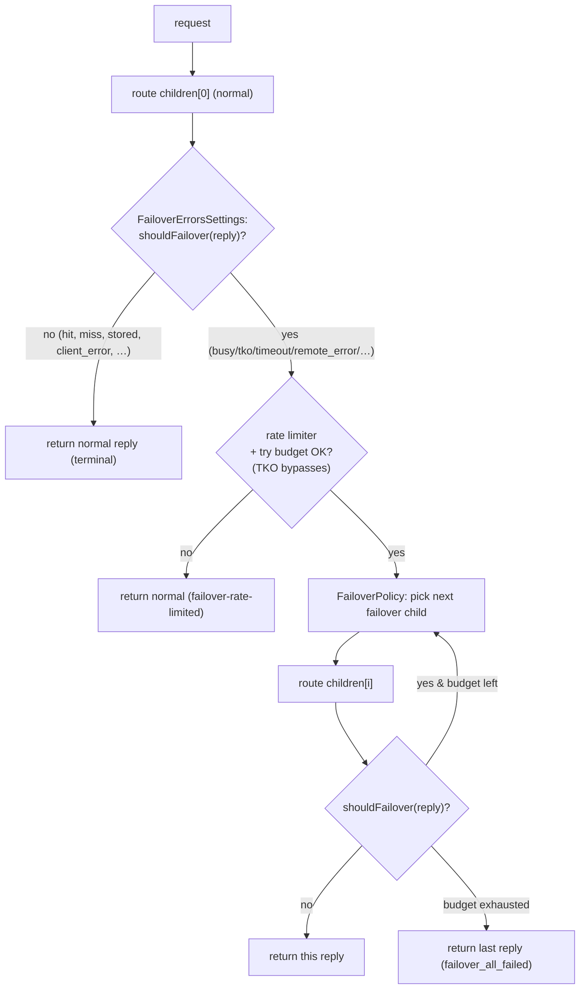

# mcrouter failover (FailoverRoute)

how Meta's mcrouter routes around a failing backend: a **`FailoverRoute`** route
handle holds an ordered list of child routes — `children[0]` is the **normal**
target, `children[1..]` are **failover** targets — and when the normal child
returns a *failover-eligible* error, it retries the failover children (in an order
chosen by a **`FailoverPolicy`**) until one succeeds or a retry/rate budget is
exhausted. A separate **`FailoverErrorsSettings`** decides *which* reply results
are eligible to fail over at all.

> Source pinned to `facebook/mcrouter` @ `42aa391189c7`. Citations are by symbol
> and file path (relative to the repo root); line numbers drift, symbols don't.
> Reference-only — no rusty-mcrouter content. See
> [`../design/failover.md`](../design/failover.md) for what we build, and
> [`./hash-routing.md`](./hash-routing.md) (selection routing) +
> [`./threading-model.md`](./threading-model.md) (the proxy/route layer) for
> adjacent layers.

---

## tl;dr

- A `FailoverRoute` is an **ordered list of child route handles**. `children[0]`
  (aka `targets_[0]`) is the **normal/primary** target; `children[1..]` are
  **failover** targets. The children are *arbitrary sub-routes* (pools, other
  failover routes, …), not just leaf destinations.
- **Two orthogonal knobs**, and keeping them separate is the key idea:
  - **`failover_errors` (`FailoverErrorsSettings`) decides _whether_ a reply is
    eligible to fail over.** It classifies a reply's result code as failover or
    terminal, per operation class (gets / updates / deletes / everything-else).
  - **`failover_policy` (`FailoverPolicy`) decides _which_ failover child to try
    next and _how many_ tries are allowed.** Default is in-order.
- **The default failover-eligible results are transport/backend errors**
  (`isFailoverErrorResult`): `busy, shutdown, tko, try_again, local_error,
  connect_error, connect_timeout, timeout, remote_error, deadline_exceeded`. A
  **cache miss (`NOTFOUND`) never fails over** — it isn't even an error result.
  **`CLIENT_ERROR` is terminal** by default.
- **Failover reacts to replies; it never proactively queries backend health.** A
  `TKO` reply *triggers* failover but is "free": it does not consume a retry try
  and does not hit the rate limiter.
- **`FailoverRateLimiter` (`failover_limit`)** is an optional token bucket that
  caps the *fraction* of requests allowed to fail over.
- **`FailoverWithExptimeRoute`** is a thin sugar wrapper over `FailoverRoute` that
  shortens the TTL of *writes* sent to failover targets (so stale failover writes
  expire quickly); it takes `normal` + `failover` keys instead of `children`.



---

## the handle: ordered children, normal-first

`FailoverRoute` (`mcrouter/routes/FailoverRoute.h`) is a template
(`FailoverRoute<RouterInfo, FailoverPolicyT, FailoverErrorsSettingsT>`) holding:

- `targets_` — the child route handles; `targets_[0]` is the normal target,
  `targets_[1..]` are failover targets.
- `failoverErrors_` — a `FailoverErrorsSettings` (the *whether* knob).
- `failoverPolicy_` — the `FailoverPolicy` (the *which/how-many* knob).
- `rateLimiter_` — an optional `FailoverRateLimiter`.
- `failoverTagging_`, `enableLeasePairing_`, `name_` — optional features.

`FailoverRoute::traverse` always visits `targets_[0]` first, then the
policy-selected failover targets. `FailoverRoute::doRoute` / `processReply`
implement the runtime flow:

1. Route the request through `targets_[0]` (normal).
2. Ask `failoverErrors_.shouldFailover(reply, req)` whether this reply is eligible
   (see next section). If not → **return the normal reply unchanged** (terminal).
3. If eligible, and it is **not** a TKO, consult the rate limiter
   (`rateLimiter_.failoverAllowed()`) and the policy's try budget; if either
   refuses → return the normal reply (counted as rate-limited).
4. Iterate failover targets in the order the `FailoverPolicy` yields, routing each
   and re-checking `shouldFailover` on its reply. Return the first reply that is
   *not* failover-eligible (success/terminal); if every try is exhausted, return
   the last reply.

A `TKO` reply (`isTkoResult`) is special: it triggers failover but **does not
consume a retry count and does not hit the rate limiter** — the destination
already declined to even send the request, so failing over off it is "free"
(`FailoverRoute::processReply`).

There is also an optional **lease-pairing** path
(`route(McLeaseSetRequest)` / `route(McLeaseGetRequest)`, gated on
`enable_lease_pairing` + `name`) that keeps a lease-get and its paired lease-set
on the same child; orthogonal to the core failover flow.

---

## `FailoverErrorsSettings`: *whether* a reply fails over

This is the single most important piece to port correctly.

### the default classification (`isFailoverErrorResult`)

`isFailoverErrorResult` (`mcrouter/lib/McResUtil.h`) returns `true` for exactly:

```
BUSY, SHUTDOWN, TKO, RES_TRY_AGAIN, LOCAL_ERROR, CONNECT_ERROR,
CONNECT_TIMEOUT, TIMEOUT, REMOTE_ERROR, DEADLINE_EXCEEDED
```

Everything else is terminal. Notable consequences:

- **A cache miss does not fail over.** `NOTFOUND` is not in the set — and per
  `isErrorResult` (`McResUtil.h`) it isn't even classified as an *error* (it sits
  below `OOO` in the result-severity ordering). You also cannot put it in a custom
  `failover_errors` list (the parser only accepts names where `isErrorResult` is
  true — `FailoverErrorsSettingsBase::List::init`, `mcrouter/lib/FailoverErrorsSettingsBase.cpp`).
- **`CLIENT_ERROR` is terminal by default** (a bad request won't get better on
  another backend). It *can* be added explicitly to a custom list.
- The set is dominated by **transport / connection / backend errors**, i.e. "this
  destination couldn't serve the request," not "this key isn't here."

Related TKO helpers (`McResUtil.h`) the route uses: `isTkoResult` (`== TKO`),
`isHardTkoErrorResult` (`CONNECT_ERROR, CONNECT_TIMEOUT, SHUTDOWN`),
`isSoftTkoErrorResult` (`TIMEOUT`).

### per-operation-class overrides

`FailoverErrorsSettings::shouldFailover` (`mcrouter/lib/FailoverErrorsSettings.h`)
dispatches on the request's operation class via tag types, returning
`FailoverType::NORMAL` (eligible) or `FailoverType::NONE` (terminal):

| operation class | list consulted |
|---|---|
| `GetLike` (get/gets/gat/…) | `gets_` |
| `UpdateLike` (set/add/replace/append/prepend/…) | `updates_` |
| `DeleteLike` (delete) | `deletes_` |
| everything else (e.g. arithmetic `incr`/`decr`) | the default `isFailoverErrorResult` |

> **Subtlety:** arithmetic (`McIncrRequest`/`McDecrRequest`) is *not* `UpdateLike`,
> so it falls through to the default classification, **not** the `updates` list
> (`mcrouter/lib/network/gen/MemcacheRoutingGroups.h`).

### config forms

`failover_errors` (parsed by `FailoverErrorsSettingsBase`,
`mcrouter/lib/FailoverErrorsSettingsBase.cpp`) is either:

- an **array** of error names → applied to gets, updates, *and* deletes; or
- an **object** `{ "gets": [...], "updates": [...], "deletes": [...] }` →
  per-class lists.

Any list that's omitted falls back to the built-in default classification above.
When `failover_errors` is absent entirely, all classes use the default.

---

## `FailoverPolicy`: *which* child next, and *how many* tries

`FailoverPolicy.h` (`mcrouter/routes/FailoverPolicy.h`) defines the policies; the
policy yields an iteration order over the failover targets and enforces a try
budget. When `failover_policy` is omitted, **`FailoverInOrderPolicy`** is used.

| policy | order | knobs | notes |
|---|---|---|---|
| **`FailoverInOrderPolicy`** (default) | sequential `1, 2, 3, …` | optional `max_tries`, optional `exclude_errors` | the simple one; no failure-domain logic |
| **`FailoverLeastFailuresPolicy`** | child 0 first, then remaining children **stably sorted by recent error count** (fewest first) | requires `max_tries` | dynamic reorder by observed failures |
| **`FailoverDeterministicOrderPolicy`** | hash of the request picks order | requires `max_tries` + `max_error_tries`; optional `hash` (`Ch3`/`WeightedCh3`), `enable_failure_domains`, `ignore_normal_reply_index` | can skip a failed *failure domain* |
| **`FailoverRendezvousPolicy`** | rendezvous (HRW) hashing of failover children | requires `tags` | order-independent; child 0 reserved as primary |

Only `FailoverDeterministicOrderPolicy` emits meaningful collision /
failure-domain stats; the others return zeroed `Stats`.

> The deterministic/rendezvous policies are the "ranked, key-derived order"
> variants — the same idea our hash-routing doc earmarks as a future
> `RankedSelector` (see [`./hash-routing.md`](./hash-routing.md)).

---

## `FailoverRateLimiter` (`failover_limit`)

`FailoverRateLimiter` (`mcrouter/routes/FailoverRateLimiter.{h,cpp}`) is a **token
bucket over total request count** (not wall-clock rate). Config:
`{ "rate": <0..1>, "burst": <int> }` — `rate` is the fraction of requests allowed
to fail over (clamped to `[0,1]`), `burst` the bucket size (default `1000`, min
`1`). `FailoverRoute` calls `bumpTotalReqs()` on every request and checks
`failoverAllowed()` before each *non-TKO* failover. Purpose: prevent a
wide-spread error from converting all traffic into doubled (failover) load and
overwhelming the failover pool.

---

## `FailoverWithExptimeRoute`: sugar that shortens failover-write TTLs

`FailoverWithExptimeRoute` (`mcrouter/routes/FailoverWithExptimeRouteFactory.h`)
is **not a separate handle** — it's a factory that builds a plain `FailoverRoute`
whose failover children are each wrapped in `ModifyExptimeRouteMin`
(`mcrouter/routes/ModifyExptimeRoute.h`). The effect: any *write* that lands on a
failover target gets `exptime = min(original, failover_exptime)` (default
`failover_exptime = 60s`); deletes pass through unchanged. Rationale: a value
written to a failover backend may go stale once the normal backend recovers, so
it should expire quickly.

Its config differs from plain `FailoverRoute` — it takes **`normal`** (one child)
and **`failover`** (one child or an array) instead of `children`:

```json
{
  "type": "FailoverWithExptimeRoute",
  "normal": "PoolRoute|A.wildcard",
  "failover": "PoolRoute|B.wildcard"
}
```

(from `mcrouter/test/test_basic_failover.json`.) Plain `FailoverRoute` is the
core primitive; `FailoverWithExptimeRoute` is the common sugar on top.

---

## config schema (plain `FailoverRoute`)

Built by `makeFailoverRoute` (`mcrouter/routes/FailoverRoute-inl.h`), dispatched
from the route factory (`McRouteHandleProvider`). Keys:

| key | required | meaning |
|---|---|---|
| `type` | yes | `"FailoverRoute"` |
| `children` | yes | array of child route handles; `children[0]` is normal. Built via `factory.createList`, so each child is any route the factory understands. |
| `failover_errors` | no | array or `{gets,updates,deletes}` (see above) |
| `failover_policy` | no | object selecting a policy; omitted ⇒ in-order |
| `failover_limit` | no | `{rate, burst}` rate limiter |
| `failover_tag` | no | stamp failover hop count onto replies |
| `name` | no | label (also used by lease pairing) |
| `enable_lease_pairing` | no | pair lease-get/lease-set onto one child |

Example (least-failures policy + rate limit), from
`mcrouter/test/test_basic_failover_least_failures.json`:

```json
{
  "type": "FailoverRoute",
  "children": ["PoolRoute|A.wildcard", "PoolRoute|B.wildcard"],
  "failover_errors": ["remote_error"],
  "failover_policy": { "type": "LeastFailuresPolicy", "max_tries": 3 },
  "failover_limit": { "rate": 0.2, "burst": 9.8 }
}
```

Children can be arbitrary nested routes — tests mix inline `Pool` objects,
`PoolRoute|…` strings, `ErrorRoute`, and even nested `FailoverRoute`s
(`mcrouter/test/test_rendezvous_failover.json`,
`mcrouter/test/test_lease_pairing_nested.json`).

---

## stats / observability

`FailoverRoute` logs a `FailoverContext` (`mcrouter/lib/FailoverContext.h`) per
failover attempt and sets `carbon::setIsFailoverIfPresent(...)` on failover
replies. Route-level counters (`mcrouter/stat_list.h`) include `failover_all`,
`failover_all_failed`, `failover_conditional`, `failover_rate_limited`,
`failover_same_failure_domain`, `failover_policy_result_error`,
`failover_policy_tko_error`, and the deterministic policy's
`failover_num_collisions` / `failover_num_failed_domain_collisions`. With
`failover_tag`, a hop-count is stamped on the reply.

---

## scope and subtleties

- **Failover keys off the reply's *result code*, not its payload.** The whole
  decision is `result ∈ failover-set?` per op class.
- **Miss ≠ failure.** `NOTFOUND` is terminal; failover is for "couldn't reach /
  serve," not "not cached here." (A "fail over on miss" behavior is a *different*
  route — `MissFailoverRoute`, `mcrouter/routes/MissFailoverRoute.h`.)
- **No proactive health probing in the route.** Backend health/TKO is decided in
  the destination/client layer; `FailoverRoute` only reads the resulting reply
  codes. TKO short-circuits the rate limiter and try budget.
- **Order can be static or dynamic** depending on the policy: in-order is static;
  least-failures / deterministic / rendezvous reorder.
- **`FailoverWithExptimeRoute` is the same machinery** plus a TTL modifier on
  failover writes.

---

## source map

| concept | symbol | file @ `42aa391189c7` |
|---|---|---|
| The handle (normal-first, iterate failovers) | `FailoverRoute`, `::doRoute`, `::processReply`, `::traverse` | `mcrouter/routes/FailoverRoute.h` |
| Builder / config parse | `makeFailoverRoute` | `mcrouter/routes/FailoverRoute-inl.h` |
| *Whether* a reply fails over (per op class) | `FailoverErrorsSettings::shouldFailover` | `mcrouter/lib/FailoverErrorsSettings.h` |
| Default failover result set | `isFailoverErrorResult` | `mcrouter/lib/McResUtil.h` |
| `failover_errors` parse (array / per-class) | `FailoverErrorsSettingsBase` | `mcrouter/lib/FailoverErrorsSettingsBase.{h,cpp}` |
| *Which* child next + try budget | `FailoverInOrderPolicy`, `FailoverLeastFailuresPolicy`, `FailoverDeterministicOrderPolicy`, `FailoverRendezvousPolicy` | `mcrouter/routes/FailoverPolicy.h` |
| Rate limiter (`failover_limit`) | `FailoverRateLimiter` | `mcrouter/routes/FailoverRateLimiter.{h,cpp}` |
| Exptime sugar wrapper | `FailoverWithExptimeRoute` factory + `ModifyExptimeRouteMin` | `mcrouter/routes/FailoverWithExptimeRouteFactory.h`, `mcrouter/routes/ModifyExptimeRoute.h` |
| Fail-over-on-miss (different route) | `MissFailoverRoute` | `mcrouter/routes/MissFailoverRoute.h` |
| Per-attempt context + stats | `FailoverContext`, `stat_list` | `mcrouter/lib/FailoverContext.h`, `mcrouter/stat_list.h` |
| TKO/result helpers | `isTkoResult`, `isHardTkoErrorResult`, `isErrorResult` | `mcrouter/lib/McResUtil.h` |
