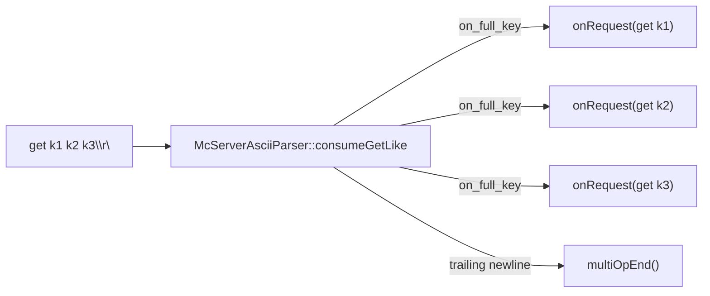
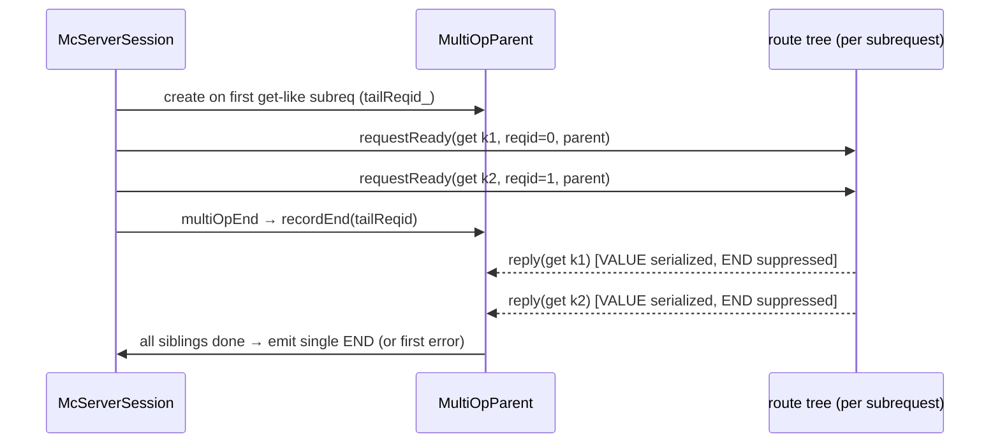

# mcrouter multiget (the multi-op split)

how Meta's mcrouter handles an ASCII multiget — `get k1 k2 k3\r\n` — when the
keys may live on different backends: it **splits the command into independent
single-key gets at the parser**, routes each one separately through the route
handle tree, and uses a `MultiOpParent` to coordinate completion, suppress the
per-subrequest terminators/errors, and emit one final `END` (or the first error).

> Source pinned to `facebook/mcrouter` @ `42aa391189c7`. Citations are by symbol
> and file path (relative to the repo root); line numbers drift, symbols don't.
> Reference-only — no rusty-mcrouter content. See
> [`../design/multiget.md`](../design/multiget.md) for what we build, and
> [`threading-model.md`](./threading-model.md) for the proxy/route layer the
> split feeds into.

---

## tl;dr

- A multiget is **never** routed as one multi-key request. The **ASCII server
  parser** (`McServerAsciiParser::consumeGetLike`) emits **one single-key
  request per key**, in order, then a `multiOpEnd`. So the route handle tree
  only ever sees single-key gets — hashing/failover/etc. apply per key with no
  multi-key awareness anywhere downstream.
- A **`MultiOpParent`** ties the sibling subrequests together. It is created
  lazily on the first get-like subrequest of the command; each subrequest's
  server context holds a shared pointer to it.
- The parent does **not** reassemble values. Each subrequest serializes its own
  `VALUE <key> ...` block on its normal reply path; the parent's job is to
  **suppress** each subrequest's individual `END`, track when **all** siblings
  have replied, and then emit a **single terminal `END`** — or, if any sibling
  errored, the **first error**.
- **Error precedence is first-error-wins**, not worst-result: the parent latches
  the first non-`FOUND`/non-`NOT_FOUND` reply and suppresses the rest.
- **Parsing is serial; dispatch is independent.** Each subrequest is forwarded
  to the router immediately with its own request id; they can complete out of
  order and are reordered back to request order by `McServerSession` using those
  ids. Subrequests are not awaited one-at-a-time.
- **Scope: ASCII only** (also `gat`/`gats`). The Caret/binary protocol carries
  one logical request per message, so there is no split there.

---

## where the split happens: the ASCII parser

The get-like grammar in `mcrouter/lib/network/McAsciiParser.rl`
(`McServerAsciiParser::consumeGetLike`) fires a callback **per key token**, then
closes the command on the trailing newline:

```ragel
req_body := ' '* key %on_full_key (' '+ key %on_full_key)* ' '* multi_op_end;
```

Each `%on_full_key` action runs `callback_->onRequest(std::move(message))` for
that single key; the final newline triggers `multiOpEnd()` / `finishReq()`. So
`get k1 k2\r\n` produces **two** `onRequest` callbacks followed by one
`multiOpEnd` — proven by `McServerAsciiParserTest::getLikeTest`, which asserts
exactly that sequence.



There is **no** explicit `multiOpStart`: the "start" is implicit — the session
creates the parent when the first get-like subrequest arrives (below).

---

## MultiOpParent: coordination, not reassembly

`McServerSession::asciiRequestReady` lazily creates the parent on the first
get-like subrequest and threads it into each sibling's context
(`mcrouter/lib/network/McServerSession-inl.h`):

```cpp
// first get-like subrequest of a command:
currentMultiop_ = std::make_shared<MultiOpParent>(*this, tailReqid_++);
// each subrequest's context carries the shared parent:
McServerRequestContext ctx(*this, reqid, /*noReply*/ false, currentMultiop_);
```

The context constructor records itself with the parent
(`McServerRequestContext.cpp` → `parent.recordRequest()`), and the parent tracks
outstanding siblings with a `waiting_` count plus `recordEnd(reqid)` for the
terminating sentinel (`mcrouter/lib/network/MultiOpParent.h`). When every
sibling has replied **and** the end sentinel has arrived, the parent finalizes.



### values come from the subrequests, not the parent

Each subrequest keeps its own key in its context (`ctx.asciiKey()`), so the
normal reply serializer prints that key's `VALUE` block. `END` is produced by a
special **empty-key end context**: `AsciiSerializedReply::prepareImpl` treats an
empty key as the END marker and writes `END\r\n`; a non-empty key writes one
`VALUE ...\r\n<data>\r\n` (`mcrouter/lib/network/AsciiSerialized.cpp`). The
parent creates that end context once, after the siblings
(`mcrouter/lib/network/MultiOpParent.cpp`).

Net wire output: **every hit's `VALUE` block in request order, then exactly one
`END`** — the same bytes a single backend would return for the whole multiget,
but assembled from independently-routed pieces.

### error precedence: first error wins

`MultiOpParent::reply()` latches the **first** reply that is neither `FOUND` nor
`NOT_FOUND` (i.e. the first error) and remembers it; subsequent sibling replies
observe `parent.error()` and **suppress** their own output
(`mcrouter/lib/network/McServerRequestContext-inl.h`). So:

- all hits/misses, no errors → `VALUE`s + single `END`;
- any error → the client sees that **first** error instead of `END`;
- a miss contributes nothing (no `VALUE`), it is simply absorbed.

This is *first*-error precedence, not a worst-result comparison — worth noting,
since it means ordering of completion can affect which error surfaces only up to
"first seen by the parent."

---

## serial vs concurrent

- **Parsing** is serial: the parser walks key tokens left to right.
- **Dispatch** is independent: `asciiRequestReady` forwards each subrequest to
  `onRequest_->requestReady(...)` immediately, each with its own request id and
  context. They route through the tree independently and can finish out of
  order.
- **Output order** is restored separately: `McServerSession::reply()` buffers and
  releases replies by request id (`mcrouter/lib/network/McServerSession.cpp`), so
  `VALUE` lines appear in request-key order regardless of completion order.

So the subrequests are *not* serialized end-to-end; they are split serially but
served concurrently and reordered on the way out.

---

## scope and subtleties

- **ASCII only.** The split lives entirely in the ASCII parser, and also covers
  `gat`/`gats`. The Caret/binary path (`ServerMcParser::caretMessageReady` →
  `McServerSession::caretRequestReady`) delivers one logical request per message,
  so no split is needed there.
- **noreply** is not part of the get-like grammar — it's a write-command
  modifier, never attached to `get k1 k2`.
- **Request-order `VALUE`s** follow from request ids being assigned in parse
  order plus the session's reorder-by-id on reply.
- **Duplicate keys** are not de-duplicated: `get k k` becomes two subrequests and
  (on a hit) two `VALUE` blocks.
- **Backend failure** depends on how the route layer surfaces it: normalized to
  `NOT_FOUND` → treated as a miss (absorbed); surfaced as an error → first error
  wins.

---

## source map

| Concept | Symbol | File @ `42aa391189c7` |
|---|---|---|
| Split into single-key subrequests | `McServerAsciiParser::consumeGetLike` (get-like grammar) | `mcrouter/lib/network/McAsciiParser.rl` |
| Split test (2 callbacks + multiOpEnd) | `McServerAsciiParserTest::getLikeTest` | `mcrouter/lib/network/test/McServerAsciiParserTest.cpp` |
| Parent creation + per-subreq context | `McServerSession::asciiRequestReady` | `mcrouter/lib/network/McServerSession-inl.h` |
| Sibling tracking / completion | `MultiOpParent` (`waiting_`, `recordRequest`, `recordEnd`) | `mcrouter/lib/network/MultiOpParent.h`, `.cpp` |
| Context back-pointer to parent | `McServerRequestContext` (ctor → `recordRequest`) | `mcrouter/lib/network/McServerRequestContext.cpp` |
| First-error precedence + suppression | `MultiOpParent::reply`, reply suppression | `mcrouter/lib/network/MultiOpParent.cpp`, `McServerRequestContext-inl.h` |
| `VALUE`/`END` serialization (empty-key = END) | `AsciiSerializedReply::prepareImpl` | `mcrouter/lib/network/AsciiSerialized.cpp` |
| Reply reordering by request id | `McServerSession::reply` | `mcrouter/lib/network/McServerSession.cpp` |
| Caret single-request path (no split) | `ServerMcParser::caretMessageReady`, `McServerSession::caretRequestReady` | `mcrouter/lib/network/ServerMcParser-inl.h`, `McServerSession.cpp` |
