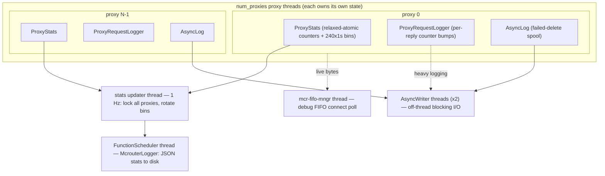
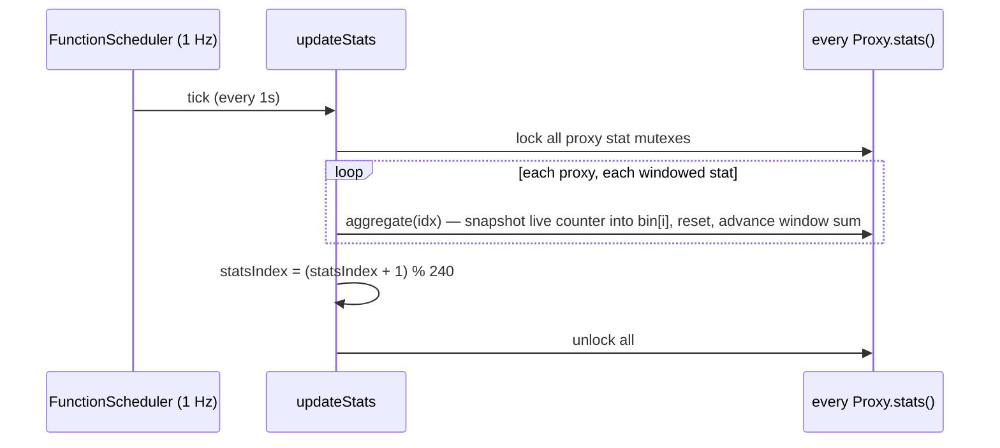
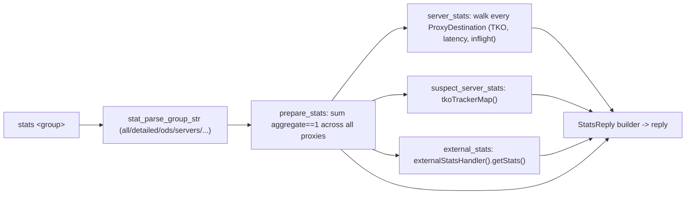
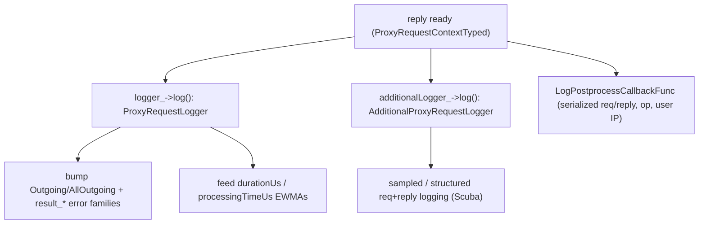
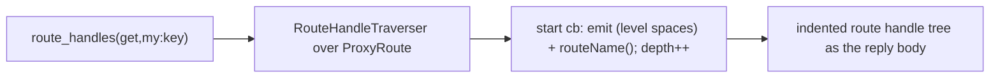
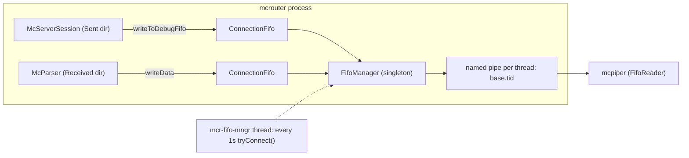

# mcrouter observability

how Meta's mcrouter sees itself in production: the per-proxy stats counters and
how they're kept lock-free, the windowed rate/max machinery, the `stats` command
and the JSON stats files, per-request logging on the hot path vs. heavy
out-of-band logging, structured failure logging, the live route-tracing commands
and distributed tracing, the debug FIFO that lets you snoop live traffic, and the
async spool for failed deletes.

> Source pinned to `facebook/mcrouter` @ `42aa391189c7`. Citations are by symbol
> and file path (relative to the repo root); line numbers drift, symbols don't.
> Reference-only — no rusty-mcrouter content. See
> [`../design/observability.md`](../design/observability.md) for what we copy and
> `../architecture/observability.md` for what we end up building. For the
> proxy/fiber machinery these counters and spans hang off, see
> [`threading-model.md`](./threading-model.md); for the backend latency seam see
> [`backend-client.md`](./backend-client.md).

---

## tl;dr

- **Stats are sharded per proxy thread.** Each `Proxy` owns a `ProxyStats`
  (`mcrouter/ProxyBase.h`). On the hot path a counter bump is a *relaxed* atomic
  read-modify-write on the proxy's own array (`stat_incr`) — no lock, no
  contention, because only that thread writes that array.
- **Every counter is declared once in an X-macro list** (`mcrouter/stat_list.h`)
  that is `#include`d several times with different macro definitions to generate
  the `stat_name_t` enum, the `stat_t` table, and `init_stats()`.
- **Two different "aggregations" — don't conflate them.** The 1 Hz background
  thread (`CarbonRouterInstanceBase::updateStats`) only **rotates each proxy's own
  windowed bins** (`ProxyStats::aggregate`); it does **not** sum across proxies.
  The **cross-proxy sum happens at read time** (`stats_aggregate_rate_value`), on
  whoever asked. The thread maintains *windowed history*; the total is *on demand*.
- **The same event is exposed twice.** A monotonic `count_stats` total
  (`request_sent_count`) *and* a windowed `rate_stats` rate (`request_sent`, reset
  to 0 each bin) for the same event — so a downstream TSDB can diff the raw count,
  *or* read mcrouter's pre-computed rate. The bins are **not** because "nothing
  downstream can compute a rate"; they exist for the one-shot `stats` snapshot and
  for sub-scrape peak detection (see §2).
- **Two read paths, both aggregate-on-demand.** The `stats` command
  (`stats_reply`) and the periodic JSON dump (`McrouterLogger`) both call
  `prepare_stats()`, which sums the `aggregate==1` stats across every proxy.
- **Per-request logging is deliberately cheap.** `ProxyRequestLogger` only bumps
  in-memory counters and feeds latency EWMAs at reply time; heavy structured
  logging is punted to `AdditionalProxyRequestLogger` / a post-process callback.
- **Disk I/O never runs on a proxy.** Stats files go out on a shared
  `FunctionScheduler` thread; failed-delete spooling and other blocking writes go
  to dedicated `AsyncWriter` threads with bounded, drop-on-full queues.
- **Live introspection is first-class.** `ServiceInfo` answers `route`/
  `route_handles`/`get_bucket` by walking the route handle tree with a
  `RouteHandleTraverser`; the debug FIFO (`FifoManager`/`ConnectionFifo`) streams
  live request/reply bytes to `mcpiper`; `FBTrace` does sampled distributed
  tracing.

---

## the shape of it

Observability in mcrouter is **per-proxy state mutated lock-free on the hot
path, aggregated off-thread or at read time**. Nothing on the request path takes
a lock to record a metric, and nothing on the request path does disk I/O.



---

## 1. stats are per-proxy and lock-free

Each `Proxy` embeds a `ProxyStats stats_` (`mcrouter/ProxyBase.h`). A `stat_t`
(`mcrouter/stats.h`) is a tagged record:

```cpp
struct stat_t {
  folly::StringPiece name;
  int             group;     // bitmask of stat_group_t
  stat_type_t     type;      // stat_string | stat_uint64 | stat_int64 | stat_double
  int             aggregate; // sum across proxies on export?
  union {
    char*    string;
    uint64_t uint64;
    int64_t  int64;
    double   dbl;
    void*    pointer;
  } data;
};
```

The hot-path mutators are free functions in `stats.h`. The common case is **not**
a locked `fetch_add` — it is a *relaxed* load/store, which is sound only because
each proxy thread mutates exclusively its own `stat_t` array:

```cpp
// same-thread bump: relaxed RMW, no lock, no contention
inline void stat_incr(stat_t* stats, stat_name_t name, int64_t amount) {
  auto ref = folly::make_atomic_ref(stats[name].data.uint64);
  ref.store(ref.load(std::memory_order_relaxed) + amount, std::memory_order_relaxed);
}

// the genuinely cross-thread-safe variant (used when another thread may race)
inline void stat_fetch_add(stat_t* stats, stat_name_t name, int64_t amount) {
  folly::make_atomic_ref(stats[name].data.uint64)
      .fetch_add(amount, std::memory_order_relaxed);
}
```

`ProxyStats` exposes the same split by method name — the convention is load-
bearing:

| Method | Backing op | When |
|---|---|---|
| `increment` / `decrement` / `setValue` | `stat_incr` (relaxed RMW) | the calling thread *is* the proxy thread (the hot path) |
| `incrementSafe` / `decrementSafe` | `stat_fetch_add` (atomic) | another thread might race the same counter |

That naming distinction (`increment` vs `incrementSafe`) is exactly the
faithfulness constraint a reimplementation has to preserve.

### every counter is declared once

`mcrouter/stat_list.h` is an X-macro list — it is `#include`d several times under
different macro definitions to generate (a) the `stat_name_t` enum in `stats.h`
(ending in `num_stats`), and (b) the `init_stats()` table fill in `stats.cpp`:

```cpp
// stat_list.h, sketched — each entry names a counter, its initial value, and
// whether it is summed across proxies on export. The enclosing #define GROUP /
// #undef GROUP blocks tag each counter with a stat_group_t bit.
STUI(cmd_get_count_stat,   0, /*aggregate=*/1)   // uint64
STUI(cmd_set_count_stat,   0, 1)
STSI(num_servers_up_stat,  0, 0)                  // int64
STSS(version_stat,        "",  0)                 // string
EXTERNAL_STAT(proxy_reqs_processing_stat)         // populated by an external hook
```

`stat_group_t` is a bitmask (`basic_stats`, `detailed_stats`, `rate_stats`,
`count_stats`, `max_stats`, `max_max_stats`, `server_stats`,
`suspect_server_stats`, `ods_stats`, `external_stats`, …). The group decides both
which `stats <group>` query returns a counter and how it is aggregated.

### optional per-mutation hook

If a `StatsApi*` is installed (`gMakeStatsApiHook`, wired through
`CarbonRouterInstanceBase`), every incr/set *also* calls `addSample`/`setValue`,
so an external system (ODS/Scuba) can observe each mutation without polling. When
no hook is installed this is a single null check.

---

## 2. rates and maxima are windowed bins

mcrouter reports most things as **per-second rates** and **windowed maxima**, not
just raw totals. The twist: a `rate_stat`'s live counter is **reset to 0 every
bin** (`ProxyStats::aggregate`) — it is not a monotonic counter at all, just the
current 1-second accumulator drained into the ring buffer. `ProxyStats` carries
the window state (`ProxyStats.h`):

```cpp
// window = 240 s, bin = 1 s   (MOVING_AVERAGE_WINDOW_SIZE_IN_SECOND / _BIN_SIZE_)
static constexpr size_t kBins = 240;
uint64_t statsBin_[num_stats][kBins];   // circular buffer of per-bin deltas
uint64_t statsNumWithinWindow_[num_stats];
size_t   numBinsUsed_;
```

A single background thread does the rotation. `CarbonRouterInstanceBase::
updateStats` (`CarbonRouterInstanceBase.cpp`) is registered on the **global**
`FunctionScheduler` at the 1 s bin interval by `registerForStatsUpdates()`. Each
tick it locks **all** proxy stat mutexes together (one consistent snapshot
moment), then per proxy calls `ProxyStats::aggregate(statId)`:

```cpp
// ProxyStats::aggregate(idx) — once per second, per stat
// rate_stats:  window_sum -= oldest_bin;  bin[i] = live_counter;
//              window_sum += live_counter; live_counter = 0;   // snapshot & reset
// max_stats:   bin[i] = live_counter;      live_counter = 0;   // snapshot & reset
```



**Crucially, that 1 Hz thread never sums across proxies.**
`ProxyStats::aggregate(statId)` only touches *one* proxy's own bins (snapshot its
live counter, reset to 0) — it is per-proxy windowed-history maintenance, nothing
more. The **cross-proxy sum happens at read time**, on whoever asked:
`stats_aggregate_rate_value` (`stats.cpp`) loops `for i in 0..num_proxies` and sums
the per-proxy window counts, then divides by `binsUsed × binSize`. So there are
two distinct "aggregations" hiding behind one word — the thread maintains each
proxy's *windowed history*; the reader computes the *cross-proxy total* on demand.
`stats_aggregate_max_value` sums per-bin across proxies then takes the max bin;
`stats_aggregate_max_max_value` takes the single global max bin. Durations are
per-proxy `ExponentialSmoothData<64>` EWMAs (`mcrouter/ExponentialSmoothData.h`),
summed then divided by `num_proxies`.

### the same event, exposed twice — and why bins exist at all

mcrouter keeps **both** forms of many counters: for the same event there is a
monotonic `count_stats` total *and* a windowed `rate_stats` rate.

| monotonic (`count_stats`, never reset) | windowed (`rate_stats`, reset each bin) |
|---|---|
| `request_sent_count` | `request_sent` |
| `request_error_count` | `request_error` |
| `request_success_count` | `request_success` |
| the `result_*_count` family | the `result_*` family |

(In `stat_list.h`, compare the `count_stats` block with the `rate_stats` block —
they list the same events twice.) So mcrouter is **not** forced to pre-compute
rates because "nothing downstream can" — the raw monotonic count is right there
for any time-series backend to diff. The windowed machinery earns its keep for two
*other* reasons:

1. **The `stats` command is a one-shot snapshot.** mcrouter speaks the memcached
   `stats` protocol command (and writes snapshot files); a single read returns
   *current values*. A lone monotonic number is meaningless without a prior reading
   to diff, so for that interface to report "12k gets/sec" the rate must be
   pre-computed in-process. This is a pull-*current-value* interface, and it
   predates pull-*time-series* systems like Prometheus.
2. **Windowed maxima can't be reconstructed by sampling.** `max_stats` /
   `max_max_stats` report the **peak 1-second value over the last 4 minutes**
   (`destination_max_inflight_reqs`, `max_num_tko`, …). An external collector
   scraping every 15–60 s aliases straight past sub-interval spikes — you cannot
   recover a 1-second peak from 60-second samples. Computing it in-process at 1 Hz
   is the only way to keep it.

The lesson for a reimplementation: the bins + the 1 Hz thread are tied to the
self-contained snapshot interface **plus** sub-scrape peak capture — *not* to
computing rates per se. If your telemetry backend stores a time series (and so
diffs monotonic counters itself), you keep the monotonic counts and can drop the
bins and the thread entirely. See [`../design/observability.md`](../design/observability.md)
for exactly that decision.

---

## 3. reading stats: the `stats` command and the JSON files

Both read paths funnel through `prepare_stats()`, which sums every
`aggregate==1` stat across `router.getProxyBase(i)->stats()` and folds in process
stats (`/proc/<pid>/stat`, `getrusage`), fiber-pool stats, config age, etc.

**The `stats` command** — `stats_reply(ProxyBase*, group)` (`stats.cpp`):



`server_stats` walks each `ProxyDestination` for per-host result histograms, TKO
state, latency and pending/inflight counts; `suspect_server_stats` comes from the
TKO tracker; `external_stats` from `ExternalStatsHandler`. The reply is built by
`StatsReply` (`mcrouter/lib/StatsReply.h`).

**The JSON stats files** — `McrouterLogger` (`mcrouter/McrouterLogger.cpp`) owns
no thread; it registers `log()` on the shared `FunctionScheduler` at
`stats_logging_interval` (default 10 000 ms; 0 disables). Each cycle it
`prepare_stats()` + `append_pool_stats()`, converts rate/max bins to absolute
values, and writes the `ods_stats`-grouped subset as sorted JSON under
`stats_root`:

- `<prefix>.stats`, `<prefix>.startup_options`, `<prefix>.config_sources_info`
- writes are atomic (`atomicallyWriteFileToDisk`), the directory is re-checked
  each cycle (`ensureDirExistsAndWritable` — if it vanishes it silently stops),
  and the files are `touch`ed to keep mtimes fresh as a liveness signal.
- `AdditionalLoggerIf` is a pluggable end-of-cycle hook (plus a backup stats path
  for Tupperware).

The point: **the proxy thread never serializes JSON or touches the disk** — it
only bumps counters; a different thread reads and writes them.

---

## 4. per-request logging: cheap by default, heavy out of band



- **`ProxyRequestLogger`** (`mcrouter/ProxyRequestLogger-inl.h`) is the hot-path
  logger and is intentionally trivial: on each reply it bumps the carbon
  `Outgoing`/`AllOutgoing` counters, runs the `REQUEST_CLASS_ERROR_STATS` macro
  (which increments `result_*` / `result_*_count` / `result_*_all` families based
  on `isErrorResult` / `isConnectTimeoutResult` / `isTkoResult` …), and feeds
  `durationUs` / `processingTimeUs` / `durationGet/UpdateUs` EWMA samples. No
  allocation, no I/O — just in-memory counters. It is a member of
  `ProxyRequestContextWithInfo` and fires from `ProxyRequestContextTyped.h`.
- **`AdditionalProxyRequestLogger`** (base `carbon::NoopAdditionalLogger`,
  declared in `mcrouter_config.h`) is the extension point for full,
  possibly-sampled request/reply logging, and runs right after the cheap logger.
- **`LogPostprocessCallbackFunc`** (`CarbonRouterInstanceBase.h`) is the generic
  router-level hook: serialized request dynamic, serialized reply dynamic, op
  name, user IP.

The payload everything reads is `RequestLoggerContext`
(`mcrouter/lib/RequestLoggerContext.h`): `poolName`, `ap` (AccessPoint),
`requestClass`, `startTimeUs`/`endTimeUs`/`networkTransportTimeUs`, `replyResult`,
`numFailovers`, `bucketId`, `poolIndex`, `replySourceBitMask`, and assorted flags.

---

## 5. structured failure logging

Operational errors don't go through the stats counters; they go through
`LOG_FAILURE` / `MC_LOG_FAILURE` (`mcrouter/lib/fbi/cpp/LogFailure.h`,
`mcrouter/McrouterLogFailure.h`):

```cpp
MC_LOG_FAILURE(opts, failure::Category::kInvalidConfig,
               "config {} failed to parse: {}", path, error);
```

- `failure::Category` is a fixed set: `kBadEnvironment`, `kInvalidConfig`,
  `kOutOfResources`, `kBrokenLogic`, `kSystemError`, `kOther`.
- Handlers are pluggable (`logToStdError`, `verboseLogToStdError`,
  `throwLogicError`) and **rate-limited by default**; the Luna variant
  (`MC_LOG_LUNA_FAILURE`) skips the rate limiter for must-see events.
- Under the hood it's glog: `LOG(ERROR)`, `LOG(FATAL)`, `VLOG(1)`,
  `PLOG(WARNING)`. TKO state transitions get their own structured event log,
  `TkoLog` (`mcrouter/TkoLog.cpp`).

So mcrouter has two distinct error channels: **counters** for "how many"
(`result_*` families, via `ProxyRequestLogger`) and **failure logs** for "what
went wrong and where" (`LOG_FAILURE`, categorized + rate-limited).

---

## 6. tracing a request: live route commands + distributed tracing

### live route introspection (no extra wire protocol)

`ServiceInfo<RouterInfo>` (`mcrouter/ServiceInfo-inl.h`) answers a set of
admin-style commands inline, by addressing a magic key. The tracing ones walk the
route handle tree with a `RouteHandleTraverser` (`mcrouter/lib/RouteHandleTraverser.h`):

- **`route_handles(<request>,<key>)`** — builds an indented text tree: the
  traverser's start callback appends `level` spaces + `rh.routeName()` and bumps
  depth. This is literally "show me the route handle DAG this request walks."
- **`route(<request>,<key>)`** — issues a *recording* route on a fiber
  (`ProxyRequestContext::createRecordingNotify`) whose client callback records
  each destination AccessPoint instead of sending, then returns the list of hosts
  the request *would* hit.
- **`get_bucket(<key>)`** — records `(key, bucketId, keyspace, tenantId)`.
- plus `version`, `config_age`, `config_md5_digest`, `preprocessed_config`,
  `pools`, `failure_domains`, and `verbosity` (live-adjusts glog `FLAGS_v`).



### distributed tracing + sampling

`FBTrace` (`mcrouter/lib/network/FBTrace.h`, `FBTrace-inl.h`) integrates Meta's
fbtrace: `traceRequestReceived(ctx, requestType)` returns `TracingData`,
`traceCheckRateLimit()` gates whether a given request is traced, `traceGetCount()`
returns the cumulative count. It is entirely compiled out under
`LIBMC_FBTRACE_DISABLE`. Per-request trace context rides in carbon's
`RequestCommon` (`mcrouter/lib/mc/mc_fbtrace_info.h`).

Sampling lives at logging boundaries rather than as one global request sampler:
`external_carbon_connection_log_sample_rate` ("1 in S samples logged"), a
per-hour connection-sample budget, and `logging_rtt_outlier_threshold_us` (only
log replies slower than a threshold).

---

## 7. the debug FIFO: snoop live traffic into mcpiper

Beyond counters, mcrouter can stream **actual request/reply bytes** off a running
process with near-zero overhead when nobody is listening.



- **`FifoManager`** (`mcrouter/lib/debug/FifoManager.cpp`) is a `folly::Singleton`
  holding a `Synchronized` map of path → `Fifo`. A dedicated `mcr-fifo-mngr`
  thread wakes every 1 s and `tryConnect()`s each fifo (opens the write end once a
  reader appears). `fetchThreadLocal(base)` returns `fetch("{base}.{tid}")`, so
  **each thread gets its own pipe file** — no cross-thread interleaving. SIGPIPE
  is ignored process-wide.
- **`Fifo`** (`Fifo.cpp`) is one POSIX named pipe opened `O_WRONLY | O_NONBLOCK`.
  Writes are best-effort: `EAGAIN` (slow reader / full pipe) → drop the message;
  `EPIPE` (reader gone) → disconnect. Nothing blocks the data path.
- **`ConnectionFifo`** wraps a `Fifo` for one connection:
  `startMessage(direction, typeId)` then `writeData(iov)`.
- **Wire format** (`ConnectionFifoProtocol.h`): a packed `MessageHeader` (magic
  `0xfaceb00c`, version `4`, peer address/port, connection id, direction
  `{Sent, Received}`, `timeUs`, router name), and because a FIFO only guarantees
  atomic writes up to `PIPE_BUF`, payloads are split into `PacketHeader`-prefixed
  packets each ≤ `PIPE_BUF - sizeof(PacketHeader)`.
- **Wiring**: Sent side is `McServerSession::writeToDebugFifo`, guarded by
  `FOLLY_UNLIKELY(debugFifo_.isConnected())` so it's a single predicted-false
  branch when unused; Received side is in `McParser`. Client connections
  (`AsyncMcClientImpl`) wire it the same way. Enabled by `debug_fifo_root`
  (empty = fully disabled).
- **Consumer**: `mcpiper` (`mcrouter/tools/mcpiper/FifoReader.cpp`) reads the
  pipes and reconstructs the stream.

---

## 8. asynclog: durable spool for failed deletes

Cache invalidations must not be silently lost. When a `delete` can't be
delivered, mcrouter spools it to local disk for later replay — and, crucially,
does the *blocking* write off the proxy thread.

- **`AsynclogRoute`** (`mcrouter/routes/AsynclogRoute.h`), `routeName() =
  "asynclog:<name>"`: for a `delete` it stashes the asynclog name in fiber-local
  (`fiber_local::setAsynclogName`) before routing; downstream failure handling
  consults it to decide whether to spool. Pass-through for non-deletes.
- **`AsyncLog`** (`mcrouter/AsyncLog.cpp`), one per proxy (`ProxyBase::asyncLog_`):
  `writeDelete(...)` appends one JSON line — legacy `["AS1.0", ts, "C", [...]]`
  or `["AS2.0", ts, "C", {s,f,r,h,p,k,a}]` (`use_asynclog_version2`). Spool layout
  = `async_spool` root (default `/var/spool/mcrouter`) → hourly subdir → one file
  per `(ts, service, router, tid)`.
- **`AsyncWriter`** (`mcrouter/AsyncWriter.cpp`) is the off-thread executor: its
  own `std::thread` running `EventBase::loopForever()` driving a `FiberManager`.
  `run(fn)` enqueues onto a **bounded** queue (atomic CAS on `queueSize_`) and
  **returns false when full** — backpressure by dropping, never blocking the
  caller. There are two global singletons reached via `CarbonRouterInstanceBase`:
  `asyncWriter()` (mission-critical, for asynclog) and `statsLogWriter()`
  (low-priority, for stats/file work; `stats_async_queue_length`, default 50).

The reusable lesson for a reimplementation: **a bounded off-thread writer with
drop-on-full semantics** is how mcrouter keeps durability work and other blocking
I/O off the request path.

---

## the threads that shape all of this

| Thread | Count | Job | Contention model |
|---|---|---|---|
| proxy threads | `num_proxies` | bump own `ProxyStats` (relaxed atomics), run `ProxyRequestLogger` per reply | none — each writes only its own array |
| stats updater (`updateStats`) | 1 | 1 Hz: lock all proxies, rotate the 240×1 s bins | brief all-proxy lock, once/sec |
| `FunctionScheduler` | 1 (shared) | `McrouterLogger` JSON dump every `stats_logging_interval` | reads under the proxy lock |
| `AsyncWriter` (`asyncWriter` + `statsLogWriter`) | 2 | off-thread blocking disk I/O (asynclog, files) | bounded queue, drop-on-full |
| `mcr-fifo-mngr` | 1 | 1 Hz: connect debug FIFOs to readers | best-effort, non-blocking writes |

---

## the knobs that shape all of this

| Option | Effect |
|---|---|
| `num_proxies` | number of per-proxy stat shards (and proxy threads). |
| `stats_logging_interval` | `McrouterLogger` JSON dump period (ms); `0` disables. |
| `stats_root` | directory for `<prefix>.stats` etc. |
| `async_spool` | asynclog spool root (default `/var/spool/mcrouter`). |
| `asynclog_disable` | turn off failed-delete spooling. |
| `use_asynclog_version2` | AS2.0 (structured) vs AS1.0 spool line format. |
| `stats_async_queue_length` | bound on the low-priority stats `AsyncWriter` queue (default 50; `0` = unlimited). |
| `debug_fifo_root` | enable debug FIFOs (empty = disabled). |
| `external_carbon_connection_log_sample_rate` | "1 in S" connection-log sampling. |
| `logging_rtt_outlier_threshold_us` | only log replies slower than this. |
| `verbosity` | glog `FLAGS_v`; live-adjustable via the `verbosity` ServiceInfo command. |

---

## source map

| Concept | Symbol | File @ `42aa391189c7` |
|---|---|---|
| Stat record + hot-path mutators | `stat_t`, `stat_incr`, `stat_fetch_add`, `StatsApi` | `mcrouter/stats.h` |
| Stat definitions (X-macros) | `STAT`/`STUI`/`STSI`/`STSS`/`EXTERNAL_STAT` | `mcrouter/stat_list.h` |
| Per-proxy stats + windows | `ProxyStats`, `statsBin_`, `aggregate` | `mcrouter/ProxyStats.h`, `ProxyStats.cpp` |
| Duration EWMAs | `ExponentialSmoothData` | `mcrouter/ExponentialSmoothData.h` |
| `stats` command + aggregation | `stats_reply`, `prepare_stats`, `stats_aggregate_*` | `mcrouter/stats.cpp` |
| Stats reply builder | `StatsReply` | `mcrouter/lib/StatsReply.h` |
| Periodic JSON dump | `McrouterLogger`, `AdditionalLoggerIf` | `mcrouter/McrouterLogger.cpp` |
| Per-request hot-path logger | `ProxyRequestLogger`, `REQUEST_CLASS_ERROR_STATS` | `mcrouter/ProxyRequestLogger-inl.h` |
| Heavy / post-process logging | `AdditionalProxyRequestLogger`, `LogPostprocessCallbackFunc` | `mcrouter/mcrouter_config.h`, `CarbonRouterInstanceBase.h` |
| Per-request payload | `RequestLoggerContext` | `mcrouter/lib/RequestLoggerContext.h` |
| Logger fire site | `logger_->log` / `additionalLogger_->log` | `mcrouter/ProxyRequestContextTyped.h` |
| Failure logging | `LOG_FAILURE`, `MC_LOG_FAILURE`, `failure::Category` | `mcrouter/lib/fbi/cpp/LogFailure.h`, `McrouterLogFailure.h` |
| TKO event log | `TkoLog` | `mcrouter/TkoLog.cpp` |
| Live route tracing | `ServiceInfo`, `RouteHandleTraverser` | `mcrouter/ServiceInfo-inl.h`, `mcrouter/lib/RouteHandleTraverser.h` |
| Distributed tracing / sampling | `FBTrace`, `traceCheckRateLimit` | `mcrouter/lib/network/FBTrace.h`, `FBTrace-inl.h` |
| Debug FIFO | `FifoManager`, `Fifo`, `ConnectionFifo`, `MessageHeader` | `mcrouter/lib/debug/FifoManager.cpp`, `Fifo.cpp`, `ConnectionFifo.cpp`, `ConnectionFifoProtocol.h` |
| FIFO wiring | `McServerSession::writeToDebugFifo`, `McParser` | `mcrouter/lib/network/McServerSession.cpp`, `McParser.cpp` |
| FIFO consumer | `FifoReader` (mcpiper) | `mcrouter/tools/mcpiper/FifoReader.cpp` |
| Asynclog spool | `AsyncLog`, `AsynclogRoute` | `mcrouter/AsyncLog.cpp`, `mcrouter/routes/AsynclogRoute.h` |
| Off-thread writer | `AsyncWriter`, `asyncWriter`, `statsLogWriter` | `mcrouter/AsyncWriter.cpp`, `mcrouter/CarbonRouterInstanceBase.cpp` |
| Stats updater thread | `CarbonRouterInstanceBase::updateStats`, `registerForStatsUpdates` | `mcrouter/CarbonRouterInstanceBase.cpp` |
| Per-proxy ownership | `ProxyBase::stats_`, `asyncLog_` | `mcrouter/ProxyBase.h` |
