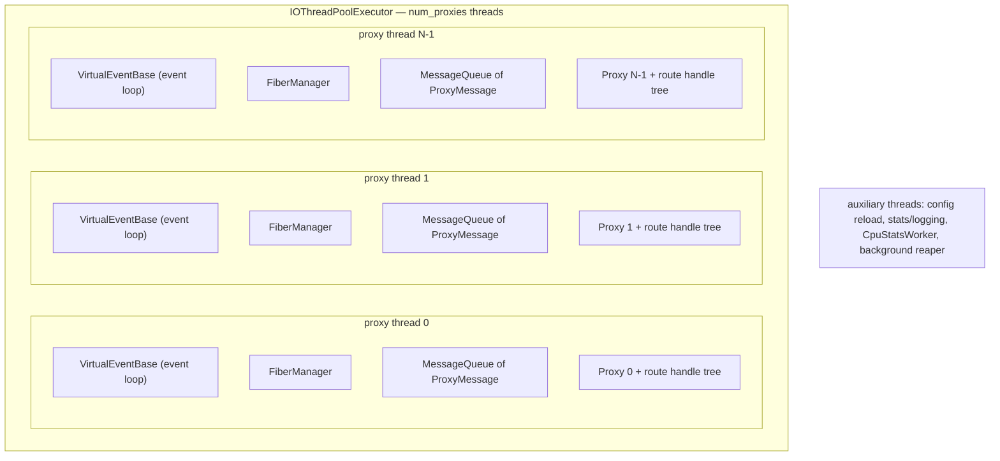
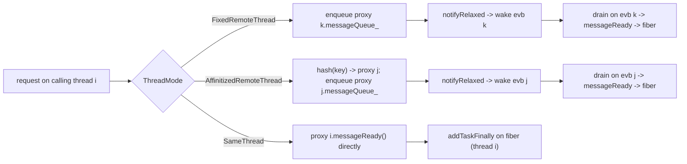
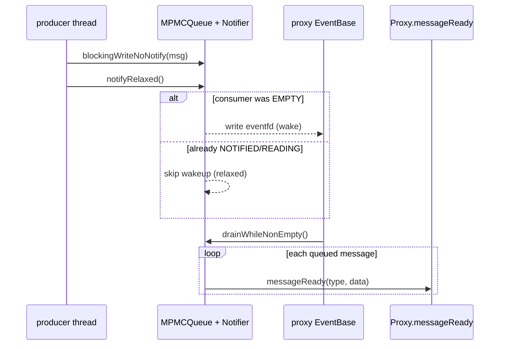
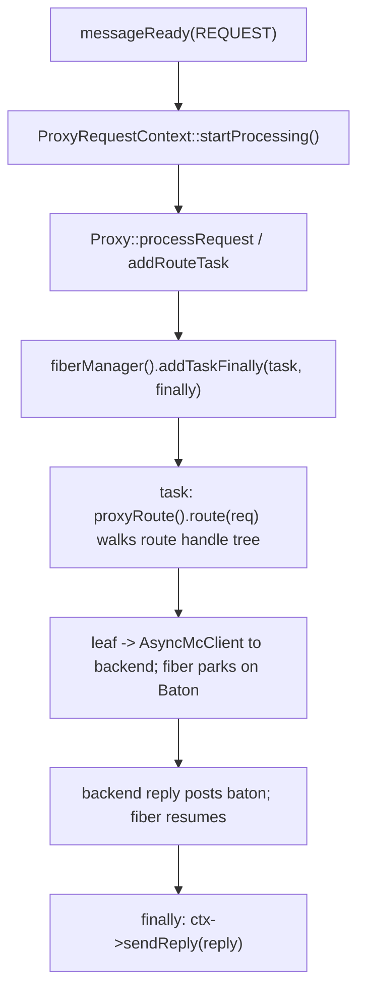

# mcrouter threading model

how Meta's mcrouter actually distributes work across threads: the proxy threads,
the per-proxy event loop + fiber manager, the message queue that makes each proxy
an actor, how a client picks which thread routes a request, and how the server
side accepts connections and feeds them in.

> Source pinned to `facebook/mcrouter` @ `42aa391189c7`. Citations are by symbol
> and file path (relative to the repo root); line numbers drift, symbols don't.
> This is reference-only — no rusty-mcrouter content. See `../design/` for what
> we copy and `../architecture/` for what we actually built.

---

## tl;dr

- mcrouter runs **`num_proxies` worker threads**. Each thread owns exactly one
  `Proxy`, one folly `VirtualEventBase` (the event loop), one
  `folly::fibers::FiberManager`, and one `MessageQueue<ProxyMessage>`.
- **A `Proxy` is an actor.** Almost nothing touches a proxy directly across
  threads; instead work is posted to its `messageQueue_` and drained on its own
  event loop (`Proxy::messageReady`).
- **Each request runs on a fiber.** Routing (`route handle tree` traversal +
  backend I/O) is scheduled with `fiberManager().addTaskFinally(...)`, so a
  request can "block" waiting on a backend without blocking the thread.
- **A `CarbonRouterClient` decides which proxy routes a request** via a
  `ThreadMode`: `SameThread`, `FixedRemoteThread`, or `AffinitizedRemoteThread`.
- **The standalone server reuses the proxy threads.** `AsyncMcServer` is given
  the proxies' event bases, so connection I/O and routing happen on the same
  `num_proxies` threads. By default the per-connection client is a
  *same-thread* client, so routing bypasses the queue entirely.

---

## folly primitives it's built on

mcrouter is a thin-ish orchestration layer over a few folly building blocks. You
need these to read the rest:

| Primitive | What it is | Rough analogue |
|---|---|---|
| `folly::EventBase` | A libevent-backed event loop bound to one thread. | a single-threaded async runtime |
| `folly::VirtualEventBase` | A keep-alive-counted handle to an `EventBase` with ordered teardown. | scoped runtime handle |
| `folly::fibers::FiberManager` | Runs stackful coroutines (fibers) on top of one `EventBase`. | green-thread scheduler |
| `folly::fibers::Baton` | One-shot await/post primitive a fiber blocks on. | oneshot / parking lot |
| `folly::MPMCQueue` | Bounded lock-light multi-producer multi-consumer queue. | bounded channel |
| `folly::IOThreadPoolExecutor` | N threads, each running its own `EventBase`. | worker-thread pool |

The important mental model: **`EventBase` = the thread's loop; `FiberManager` =
many cheap stacks multiplexed onto that loop.** A route handle can call a backend
and `baton.wait()` — the fiber parks, the `EventBase` keeps serving other fibers,
and the fiber resumes when the reply lands.

---

## thread inventory

The core worker threads are an `IOThreadPoolExecutor` sized to `num_proxies`
(`CarbonRouterInstance::spawnProxies` / `detail::createProxyThreadsExecutor`,
`mcrouter/CarbonRouterInstance-inl.h`). Each event base from that pool backs one
`Proxy`:



`CarbonRouterInstanceBase::getProxyBase(i)` returns the i-th proxy; an index
`>= num_proxies` is invalid. There are also a handful of **auxiliary threads**
that are not proxies: configuration reloading, the stats/logging writer, the
`CpuStatsWorker` (`mcrouter/CarbonRouterInstance-inl.h`), and background cleanup.
They never route requests.

Two ways the proxy threads get created (`CarbonRouterInstance::init`):

- **Embedded / standalone-default**: the caller hands in an
  `IOThreadPoolExecutor`; mcrouter binds proxies to those event bases and sets
  `embeddedMode_`.
- **Self-owned**: if no executor is supplied, mcrouter creates its own via
  `detail::createProxyThreadsExecutor(opts_)`.

Either way: `extractEvbs(*proxyThreads_).size() == opts_.num_proxies` is checked
explicitly.

---

## the proxy is an actor

Each `Proxy` owns its loop and fiber scheduler. From `mcrouter/ProxyBase.h`:

```cpp
folly::VirtualEventBase& eventBase() { /* ... */ }
folly::fibers::FiberManager& fiberManager() { return fiberManager_; }
// ...
folly::VirtualEventBase& eventBase_;
folly::fibers::FiberManager fiberManager_;
```

Cross-thread (and same-thread) work reaches the proxy as a `ProxyMessage`
(`mcrouter/Proxy.h`):

```cpp
struct ProxyMessage {
  enum class Type { REQUEST, OLD_CONFIG, REPLACE_AP, SHUTDOWN };

  Type type{Type::REQUEST};
  void* data{nullptr};
  // ...
};
```

The queue is constructed in the `Proxy` constructor and wired so that **draining
a message calls `messageReady`** (`mcrouter/Proxy-inl.h`):

```cpp
messageQueue_ = std::make_unique<MessageQueue<ProxyMessage>>(
    router().opts().client_queue_size,
    [this](ProxyMessage&& message) {
      this->messageReady(message.type, message.data);
    },
    router().opts().client_queue_no_notify_rate,
    router().opts().client_queue_wait_threshold_us,
    &nowUs,
    [this]() { stats().incrementSafe(client_queue_notifications_stat); },
    /* postDrainCallback: hint whether the loop can avoid blocking */ ...);
```

`messageReady` is the actor's mailbox handler. A `REQUEST` becomes
`ProxyRequestContext::startProcessing()`; the other message types are control
plane (config swap, access-point replace, shutdown wakeup):

```cpp
void Proxy<RouterInfo>::messageReady(ProxyMessage::Type t, void* data) {
  switch (t) {
    case ProxyMessage::Type::REQUEST: {
      auto preq = reinterpret_cast<ProxyRequestContext*>(data);
      preq->startProcessing();
    } break;
    case ProxyMessage::Type::OLD_CONFIG: { /* delete old config */ } break;
    case ProxyMessage::Type::REPLACE_AP: { /* swap access point */ } break;
    case ProxyMessage::Type::SHUTDOWN:
      // no-op; just wakes the event base so it can re-check shutdown state
      break;
  }
}
```

The crucial property: **every request, whatever thread originated it, is
processed on the proxy's own event-loop thread.** That is what makes per-proxy
state (route config, destination connections, stats) safe to touch without
locks.

---

## who decides which proxy routes: CarbonRouterClient + ThreadMode

A `CarbonRouterClient` is the producer-side handle. Its `ThreadMode`
(`mcrouter/CarbonRouterClient.h`) decides which proxy a request lands on:

```cpp
enum class ThreadMode {
  // Route on the same thread that is calling CarbonRouterClient.
  SameThread = 0,
  // Route on a dedicated mcrouter thread, chosen at client-creation time.
  FixedRemoteThread,
  // Route deterministically, chosen at routing time, to reduce the number
  // of client<->server connections.
  AffinitizedRemoteThread,
};
```

How the mode is chosen at client creation (`mcrouter/CarbonRouterInstance-inl.h`):

```cpp
return CarbonRouterClient<RouterInfo>::create(
    /* ... */,
    opts().thread_affinity
        ? CarbonRouterClient<RouterInfo>::ThreadMode::AffinitizedRemoteThread
        : CarbonRouterClient<RouterInfo>::ThreadMode::FixedRemoteThread);
```

`send()` funnels into `sendMultiImpl`, which branches on the mode
(`mcrouter/CarbonRouterClient-inl.h`):

```cpp
if (mode_ == ThreadMode::SameThread) {
  for (size_t i = 0; i < nreqs; ++i) {
    sendSameThread(makeNextPreq(/* inBatch */ false));
  }
} else {
  bool delayNotification = shouldDelayNotification(nreqs);
  for (size_t i = 0; i < nreqs; ++i) {
    sendRemoteThread(makeNextPreq(delayNotification), delayNotification);
  }
  if (delayNotification) {
    notify();   // notifyRelaxed() on each touched proxy's messageQueue_
  }
}
```

### SameThread — bypass the queue

When the caller is already on the proxy's thread, there is no queue hop at all —
it calls `messageReady` directly (`mcrouter/CarbonRouterClient-inl.h`):

```cpp
void CarbonRouterClient<RouterInfo>::sendSameThread(
    std::unique_ptr<ProxyRequestContextWithInfo<RouterInfo>> req) {
  // We are guaranteed to be in the thread that owns proxies_[proxyIdx_]
  proxies_[proxyIdx_]->messageReady(ProxyMessage::Type::REQUEST, req.release());
}
```

### FixedRemoteThread / AffinitizedRemoteThread — go through the queue

Remote sends write into the target proxy's `messageQueue_` and then notify it.
`FixedRemoteThread` always targets `proxyIdx_`; `AffinitizedRemoteThread` picks
the proxy per request from a key hash (`findAffinitizedProxyIdx`), so the same
key consistently routes through the same proxy and reuses the same backend
connections:

```cpp
auto notify = [this]() {
  assert(mode_ != ThreadMode::SameThread);
  if (mode_ == ThreadMode::FixedRemoteThread) {
    proxies_[proxyIdx_]->messageQueue_->notifyRelaxed();
  } else { // AffinitizedRemoteThread
    size_t i = 0;
    for (const auto& p : proxies_) {
      if (proxiesToNotify_[i]) {
        p->messageQueue_->notifyRelaxed();
        proxiesToNotify_[i] = false;
      }
      ++i;
    }
  }
};
```



Client-side admission control is separate from the queue: `maxOutstanding()`
gates in-flight requests via a counting semaphore, and `maxOutstandingError()`
decides whether overflow blocks or returns a local error.

---

## the message queue: bounded MPMC + relaxed eventfd notification

`MessageQueue<T>` (`mcrouter/lib/MessageQueue.h`) is not a plain channel. It is a
bounded `folly::MPMCQueue` plus a `Notifier` that integrates with the proxy's
`VirtualEventBase` through an `eventfd`. The design goal is to **amortize
cross-thread wakeups**: under load, you don't want one syscall per enqueued
request.

The `Notifier` doc spells out the two knobs:

```cpp
/**
 * Relaxed notification - slight increase of average (not p99) latency
 * for improved CPU time (fewer cross-thread notifications)
 */
class Notifier {
  // noNotifyRate:  request rate at which we stop per-request notifications;
  //                between 0 and noNotifyRate the notified fraction is scaled down.
  // waitThreshold: force a notification this many us after the last drain.
  // ...
  bool shouldNotify() noexcept {
    return state_.exchange(State::NOTIFIED, std::memory_order_acq_rel) ==
        State::EMPTY;
  }
  bool shouldNotifyRelaxed() noexcept;

  template <class F>
  void drainWhileNonEmpty(F&& drainFunc) { /* EMPTY/NOTIFIED/READING state machine */ }
};
```

So the queue runs a small `EMPTY -> NOTIFIED -> READING` state machine: a
producer only fires the `eventfd` when the consumer is `EMPTY` (idle), and once
the consumer wakes it **drains everything available in one loop turn**
(`drainWhileNonEmpty`) before going back to sleep. The `postDrainCallback` wired
in the `Proxy` ctor returns a hint about whether the event loop can avoid
blocking (it checks `fiberManager().runQueueSize()` and the flush list), which
lets the notifier skip redundant wakeups.



Relevant options: `client_queue_size` (capacity),
`client_queue_no_notify_rate`, and `client_queue_wait_threshold_us`.

---

## from queue to route: fibers do the routing

`messageReady(REQUEST)` calls `startProcessing()`, which ends up at
`Proxy::addRouteTask`. This is where a request becomes a **fiber task**
(`mcrouter/Proxy-inl.h`):

```cpp
fiberManager().addTaskFinally(
    [&req, ctx = std::move(funcCtx)]() FOLLY_NOINLINE_MUTABLE {
      try {
        auto& proute = ctx->proxyRoute();
        fiber_local<RouterInfo>::setSharedCtx(std::move(ctx));
        return proute.route(req);          // walk the route handle tree
      } catch (const std::exception& e) {
        ReplyT<Request> reply(carbon::Result::LOCAL_ERROR);
        carbon::setMessageIfPresent(reply, /* error text */);
        return reply;
      }
    },
    [ctx = std::move(sharedCtx)](folly::Try<ReplyT<Request>>&& reply) {
      ctx->sendReply(std::move(*reply));   // runs after the task finishes
    });
```

`addTaskFinally` takes two functions: the **task** (runs on a fresh fiber) and
the **finally** (runs on the same thread once the task completes, even if it
threw). The task walks the route handle tree via `proute.route(req)`; when a leaf
sends to a backend through `AsyncMcClient`, the fiber parks on a `Baton` and the
event base keeps serving other fibers. When the backend reply arrives the baton
is posted, the fiber resumes, the task returns a reply, and the finally calls
`ctx->sendReply(...)`.



Why fibers instead of callbacks: route handles are written as straight-line,
blocking-looking code (`auto reply = ch->route(req);`) even though every backend
hop is asynchronous. Fibers give you that synchronous style with async cost, and
because all fibers for a proxy share one thread, per-proxy state needs no locks.

---

## the server side: accepting connections

Client connections are handled by `AsyncMcServer`
(`mcrouter/lib/network/AsyncMcServer.cpp`), which owns a set of `McServerThread`
objects and a `McServerThreadSpawnController` parameterized by the number of
listening sockets. Each accepted connection becomes a `McServerSession`
(`mcrouter/lib/network/McServerSession.h`), driven by an `AsyncMcServerWorker`
bound to one `EventBase`.

Listening behavior is controlled by `numListeningSockets`. With more than one
socket, mcrouter relies on the kernel via `SO_REUSEPORT`
(`mcrouter/lib/network/AsyncMcServer.cpp`):

```cpp
socket_->setReusePortEnabled(reusePort_);
// ...
socket_->listen(server_.opts_.tcpListenBacklog);
```

`num_listening_sockets` must be `<= num_proxies`
(`mcrouter/standalone_options_list.h`), and `max_conns` /
`max_client_outstanding_reqs` bound connections and in-flight requests per
worker.

### standalone wiring: server threads *are* proxy threads

The standalone `serverInit`/`runServer` path (`mcrouter/Server-inl.h`) is the
clearest statement of the whole model. It creates **one** thread pool of
`num_proxies` threads and shares its event bases between the router and the
server:

```cpp
ioThreadPool = std::make_shared<folly::IOThreadPoolExecutor>(
    mcrouterOpts.num_proxies, mcrouterOpts.num_proxies, /* NamedThreadFactory */);

auto evbs = extractEvbs(*ioThreadPool);
CHECK_EQ(evbs.size(), mcrouterOpts.num_proxies);

// router built on the SAME thread pool
router = CarbonRouterInstance<RouterInfo>::init("standalone", mcrouterOpts, ioThreadPool);

// server built on the SAME event bases
asyncMcServer = std::make_shared<AsyncMcServer>(
    detail::createAsyncMcServerOptions(mcrouterOpts, standaloneOpts, &evbs));

// one client + one onRequest handler per worker thread
for (auto evb : evbs) {
  auto routerClient = standaloneOpts.remote_thread
      ? router->createClient(0)            // FixedRemote / Affinitized
      : router->createSameThreadClient(0); // SameThread (default)

  serverOnRequestMap.emplace(
      evb, std::make_shared<ServerOnRequest<RouterInfo>>(*routerClient, *evb, ...));
  carbonRouterClients.push_back(std::move(routerClient));
}
```

Also note `opts.numThreads = mcrouterOpts.num_proxies` in
`createAsyncMcServerOptions`. The consequences:

- Connection I/O and request routing run on the **same** `num_proxies` threads.
- By default (`remote_thread = false`) each connection's `CarbonRouterClient` is
  a *same-thread* client, so `ServerOnRequest` -> `send` -> `sendSameThread` ->
  `messageReady` with **no queue hop and no cross-thread wakeup**.
- Setting `remote_thread = true` (or `thread_affinity`) decouples them: the
  worker thread enqueues into a (possibly different) proxy's `messageQueue_`,
  trading a queue hop for connection-affinity benefits.

---

## end-to-end: a request in standalone mode (default SameThread)

```mermaid
sequenceDiagram
  participant C as client
  participant L as listening socket / accept
  participant S as McServerSession (proxy thread i)
  participant O as ServerOnRequest (thread i)
  participant RC as CarbonRouterClient (SameThread)
  participant PX as Proxy i
  participant FM as FiberManager i
  participant BK as backend via AsyncMcClient

  C->>L: TCP connect
  L->>S: accepted socket assigned to a worker evb
  C->>S: request bytes (parsed by ServerMcParser)
  S->>O: onRequest(request)
  O->>RC: send(req, callback)
  RC->>PX: messageReady(REQUEST) [same thread, no queue]
  PX->>FM: addTaskFinally(route task, sendReply finally)
  FM->>BK: route handle tree -> backend; fiber parks on baton
  BK-->>FM: reply -> baton posted -> fiber resumes
  FM-->>S: finally: sendReply(reply)
  S-->>C: serialized reply
```

In `remote_thread`/affinitized mode the single `RC->>PX: messageReady` step is
replaced by "enqueue into target proxy's `messageQueue_` + `notifyRelaxed`",
after which the target proxy's event base drains the queue and runs the same
`addTaskFinally` fiber flow shown above — possibly on a different thread than the
connection.

---

## the knobs that shape all of this

| Option | Effect |
|---|---|
| `num_proxies` | Number of proxy threads (and, standalone, server worker threads). |
| `num_listening_sockets` | How many listen sockets; `> 1` uses `SO_REUSEPORT`. Must be `<= num_proxies`. |
| `remote_thread` (standalone) | `false` -> same-thread clients (queue bypass); `true` -> route through proxy queues. |
| `thread_affinity` | Picks `AffinitizedRemoteThread` over `FixedRemoteThread` for created clients. |
| `client_queue_size` | Capacity of each proxy's `MessageQueue`. |
| `client_queue_no_notify_rate` | Request rate above which per-request notifications are throttled. |
| `client_queue_wait_threshold_us` | Forced-notification deadline after the last drain. |
| `max_conns` | Per-server connection ceiling (LRU-closes oldest beyond it). |
| `max_client_outstanding_reqs` | Per-worker in-flight request cap. |

---

## source map

| Concept | Symbol | File @ `42aa391189c7` |
|---|---|---|
| Proxy thread pool | `spawnProxies`, `createProxyThreadsExecutor`, `extractEvbs` | `mcrouter/CarbonRouterInstance-inl.h` |
| Per-proxy loop + fibers | `ProxyBase::eventBase`, `ProxyBase::fiberManager` | `mcrouter/ProxyBase.h` |
| Actor message type | `ProxyMessage` | `mcrouter/Proxy.h` |
| Queue construction | `Proxy::Proxy` (builds `MessageQueue`) | `mcrouter/Proxy-inl.h` |
| Mailbox handler | `Proxy::messageReady` | `mcrouter/Proxy-inl.h` |
| Route scheduling | `Proxy::addRouteTask` (`addTaskFinally`) | `mcrouter/Proxy-inl.h` |
| Thread modes | `CarbonRouterClient::ThreadMode` | `mcrouter/CarbonRouterClient.h` |
| Send dispatch | `CarbonRouterClient::sendMultiImpl`, `sendSameThread` | `mcrouter/CarbonRouterClient-inl.h` |
| Affinity hash | `CarbonRouterClient::findAffinitizedProxyIdx` | `mcrouter/CarbonRouterClient-inl.h` |
| Mode selection | `CarbonRouterInstance::createClient` / `createSameThreadClient` | `mcrouter/CarbonRouterInstance-inl.h` |
| Bounded queue + notifier | `MessageQueue`, `Notifier` | `mcrouter/lib/MessageQueue.h` |
| Accept / listen | `McServerThread`, `AcceptCallback`, `setReusePortEnabled` | `mcrouter/lib/network/AsyncMcServer.cpp` |
| Connection worker | `AsyncMcServerWorker`, `McServerSession` | `mcrouter/lib/network/AsyncMcServerWorker.h`, `McServerSession.h` |
| Standalone wiring | `serverInit` / `runServer` | `mcrouter/Server-inl.h` |
