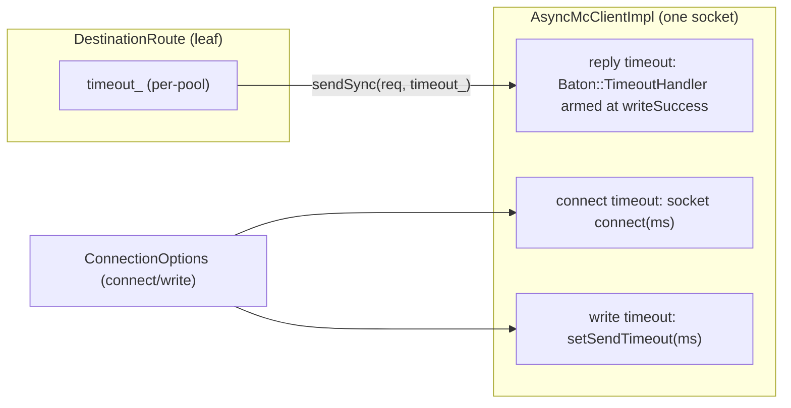
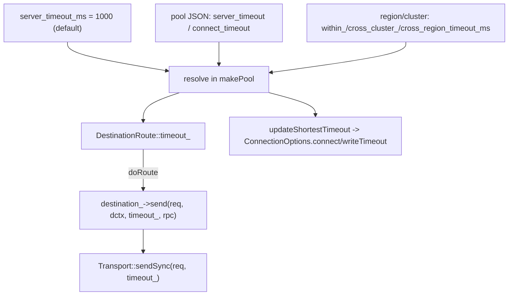
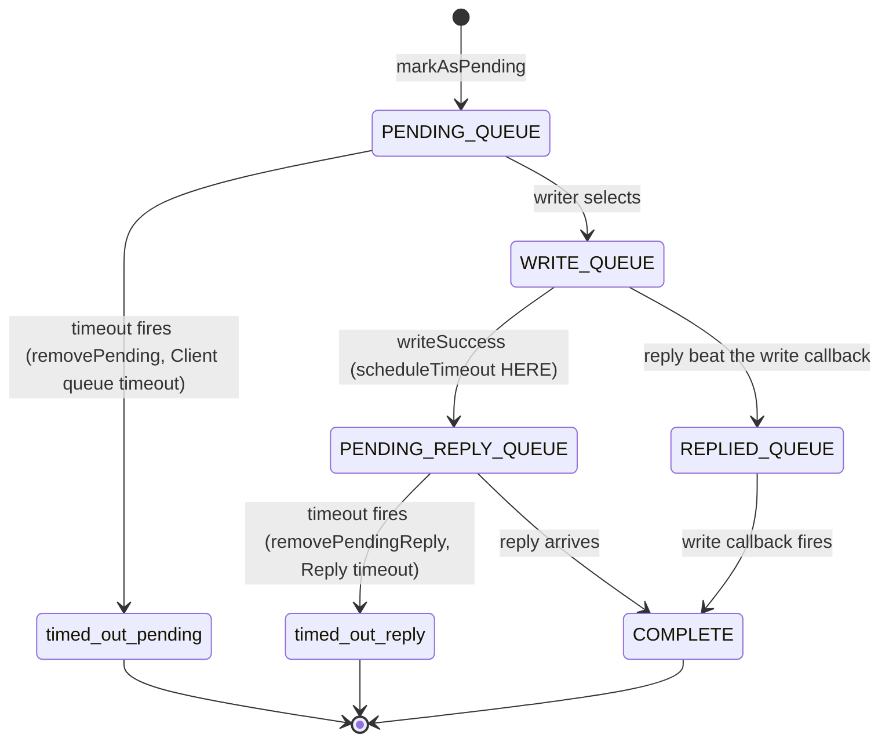
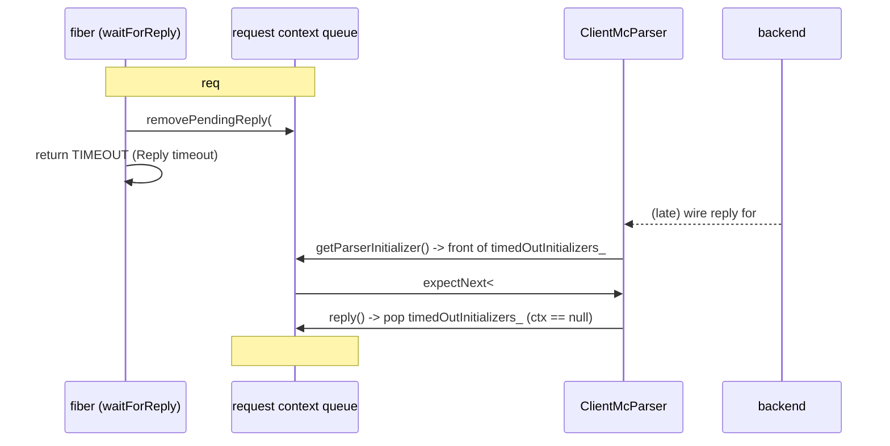
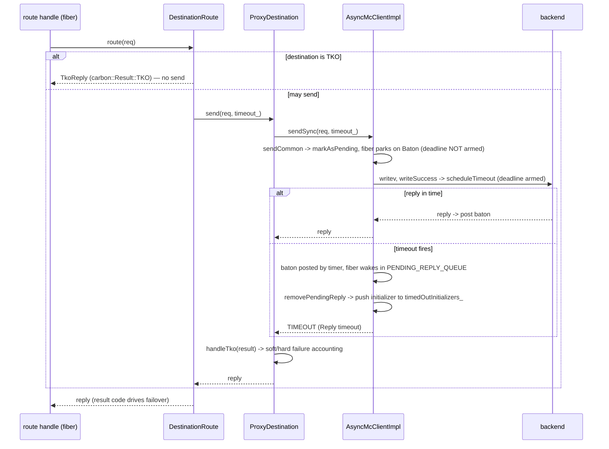

# mcrouter timeouts

how Meta's mcrouter bounds the time it spends on a backend: the per-request
**reply timeout** that wakes a parked fiber when a backend is too slow, the
socket-level **connect / write timeouts**, the way the in-order ASCII stream
stays aligned after a request gives up, and how repeated timeouts cascade into
**TKO** (dead-server detection) and **failover**. This is the piece a route
handle relies on to ever return when a server goes dark.

> Source pinned to `facebook/mcrouter` @ `42aa391189c7`. Citations are by symbol
> and file path (relative to the repo root); line numbers drift, symbols don't.
> Wiki citations are pinned to `facebook/mcrouter.wiki` @ `855a79c9f528`.
> Reference-only — no rusty-mcrouter content. See [`../design/timeouts.md`](../design/timeouts.md)
> for what we copy and why (it's the prerequisite for our `FailoverRoute`), and
> [`./backend-client.md`](./backend-client.md) for the `AsyncMcClient` request
> flow this builds on (the parked-fiber `Baton`, the write path, the request
> state machine). For the failover route that *consumes* a timeout, see the
> failover linkage in [§9](#9-how-a-timeout-becomes-a-failover).

---

## tl;dr

- **Two independent timeouts.** A **reply timeout** is passed per call to
  `AsyncMcClient::sendSync(req, timeout)`; the **connect** and **write** timeouts
  live in `ConnectionOptions` and are baked onto the socket. They are not the
  same mechanism and don't share a budget.
- **The reply deadline is armed *after* the write, not at enqueue.**
  `waitForReply(timeout)` parks the fiber on a `Baton` but only stores the
  duration; `scheduleTimeout()` is called from `writeSuccess()`. The source is
  explicit: *"we cannot timeout until the request wasn't completely sent."*
- **On fire, the woken fiber inspects its own state** and manufactures a
  `carbon::Result::TIMEOUT` reply — `"Client queue timeout"` if it never hit the
  wire (still `PENDING_QUEUE`), `"Reply timeout"` if it was sent and awaiting a
  reply (`PENDING_REPLY_QUEUE`).
- **There is no symbol called `tombstone`.** The thing prior docs call a
  tombstone is `timedOutInitializers_` — a `std::queue<InitializerFuncPtr>`. For
  the **in-order ASCII** protocol a timed-out request leaves behind only its
  *parser-initializer*, so the late wire reply is still parsed (and discarded) in
  FIFO order. Out-of-order (Caret) needs none of this — it matches by `reqId` and
  drops unknown late replies.
- **Connect/write timeouts default to 0 (= disabled/infinite).**
  `updateTimeoutsIfShorter` only ever *shrinks* them. A connect timeout retries
  up to `connect_timeout_retries` times before failing pending requests and
  marking the destination down.
- **Timeout values are config-time and leaf-local.** `server_timeout_ms`
  (default 1000) → optionally per-pool `server_timeout` / region-cluster override
  → baked into `DestinationRoute::timeout_` → handed to `sendSync`. It is *not* a
  propagated deadline (that's a separate, optional `deadlineMs` mechanism).
- **Repeated timeouts → TKO → failover.** A `TIMEOUT` is a *soft* failure; after
  `failures_until_tko` (default 3) in a row the destination is soft-TKO'd and
  short-circuits (returns `TKO` without sending). `CONNECT_TIMEOUT`/`CONNECT_ERROR`
  are *hard* failures (instant TKO). `FailoverRoute` treats all of these as
  failover-triggering, so the timeout must be **produced at the leaf before**
  failover can read the result code and advance to the next child.

---

## the two timeouts

mcrouter has exactly two timeout *kinds*, distinguished by what they bound:

| Timeout | Bounds | Where it lives | How it's set | Fires as |
|---|---|---|---|---|
| **reply timeout** | time from "request sent" to "reply received" | per-call argument | `sendSync(req, timeout)` | `carbon::Result::TIMEOUT` reply |
| **connect timeout** | time to establish the TCP/TLS connection | `ConnectionOptions.connectTimeout` | socket `connect(this, addr, ms, ...)` | `carbon::Result::CONNECT_TIMEOUT`, `onDown` |
| **write timeout** | time for an issued write to drain to the kernel | `ConnectionOptions.writeTimeout` | `socket_->setSendTimeout(ms)` | socket error → `processShutdown` |

The reply timeout is the interesting one (it's the one a route relies on to fail
over); the connect/write timeouts are socket plumbing. Both default to "off"
(`0`) at the `ConnectionOptions` level and are populated from config per
destination ([§4](#4-connect-and-write-timeouts)).



---

## 1. where a timeout value comes from

The reply timeout handed to `sendSync` is resolved **once, at config-build time**
and stored on the leaf route. It is not derived from elapsed time and does not
shrink hop-to-hop (the optional `deadlineMs` in [§7](#7-request-deadline-the-separate-end-to-end-budget)
is the only thing that does).

Resolution order, in `makePool` (`mcrouter/routes/McRouteHandleProvider-inl.h`):

```cpp
std::chrono::milliseconds timeout{opts.server_timeout_ms};          // global default (1000)
if (auto jTimeout = json.get_ptr("server_timeout")) {
  timeout = parseTimeout(*jTimeout, "server_timeout");              // per-pool JSON override
}
std::chrono::milliseconds connectTimeout = timeout;                 // connect defaults to request timeout
if (auto jConnectTimeout = json.get_ptr("connect_timeout")) {
  connectTimeout = parseTimeout(*jConnectTimeout, "connect_timeout");
}
// region/cluster overrides win when non-zero, applied AFTER the pool override:
if (region == route.getRegion() && cluster == route.getCluster()) {
  if (opts.within_cluster_timeout_ms != 0)
    timeout = std::chrono::milliseconds(opts.within_cluster_timeout_ms);
} else if (region == route.getRegion()) {
  if (opts.cross_cluster_timeout_ms != 0)
    timeout = std::chrono::milliseconds(opts.cross_cluster_timeout_ms);
} else {
  if (opts.cross_region_timeout_ms != 0)
    timeout = std::chrono::milliseconds(opts.cross_region_timeout_ms);
}
```

Two operator-facing gotchas worth pinning:

- The **pool JSON keys drop the `_ms` suffix**: it's `"server_timeout"` and
  `"connect_timeout"` inside a pool object, but `server_timeout_ms` (and the
  region/cluster variants) as the global startup option. `parseTimeout`
  validates the integer is in `[1, 1000000]` ms (`kMaxTimeout`,
  `mcrouter/lib/fbi/cpp/ParsingUtil.cpp`).
- `connect_timeout` **defaults to the request `timeout`** and is *not* touched by
  the region/cluster block — only the request `timeout` is.

The resolved `timeout` is then both baked into the leaf and used to seed the
destination's socket timeouts (`McRouteHandleProvider-inl.h`):

```cpp
auto pdstn = proxy_.destinationMap()->template emplace<Transport>(
    std::move(ap), timeout, qosClass, qosPath, poolTkoTracker, idx);
pdstn->updateShortestTimeout(connectTimeout, timeout);   // (connect, write)
...
makeDestinationRoute<RouterInfo, Transport>(
    std::move(pdstn), poolName, indexInPool, poolStatIndex,
    timeout,                                              // -> DestinationRoute::timeout_
    disableRequestDeadlineCheck, keepRoutingPrefix);
```

Because one `ProxyDestination` is shared by every route pointing at the same
host (keyed by access-point + timeout + index), the **socket** connect/write
timeouts converge to the *shortest* across all referencing pools
(`ProxyDestinationBase::updateShortestTimeout` only ever lowers
`shortestConnectTimeout_` / `shortestWriteTimeout_`). The **request** timeout
passed to `sendSync`, however, stays the route's own `timeout_`.



`DestinationRoute::doRoute` (`mcrouter/routes/DestinationRoute.h`) passes the
fixed member verbatim, and `ProxyDestination::send`
(`mcrouter/ProxyDestination-inl.h`) forwards it straight to the transport:

```cpp
// DestinationRoute::doRoute
auto reply = destination_->send(reqToSend, dctx, timeout_, rpcContext);

// ProxyDestination::send
auto reply = getTransport().sendSync(request, timeout, &rpcStatsContext);
```

---

## 2. the reply timeout: two-phase arming

`AsyncMcClient::sendSync(req, timeout)` is fiber-blocking (see
[`./backend-client.md`](./backend-client.md)). The timeout is a *second* thing
that can wake the parked fiber besides the reply. The arming is deliberately
split in two:

**Phase 1 — park, don't arm.** `McClientRequestContext::waitForReply(timeout)`
(`mcrouter/lib/network/McClientRequestContext-inl.h`) only *stores* the duration
and parks on the `Baton`. It does not start a clock yet:

```cpp
template <class Request>
typename McClientRequestContext<Request>::Reply
McClientRequestContext<Request>::waitForReply(std::chrono::milliseconds timeout) {
  batonWaitTimeout_ = timeout;
  baton_.wait(batonTimeoutHandler_);   // <-- parks; deadline not armed here

  switch (state()) {
    case ReqState::REPLIED_QUEUE:
      // reply landed but the socket write hasn't completed yet; wait again.
      baton_.reset();
      baton_.wait();
      assert(state() == ReqState::COMPLETE);
      return std::move(replyStorage_.value());
    case ReqState::PENDING_QUEUE:
      // never made it to the wire.
      queue_.removePending(*this);
      return createReply<Request>(ErrorReply, carbon::Result::TIMEOUT, "Client queue timeout");
    case ReqState::PENDING_REPLY_QUEUE:
      // sent, but no reply in time.
      queue_.removePendingReply(*this);
      return createReply<Request>(ErrorReply, carbon::Result::TIMEOUT, "Reply timeout");
    case ReqState::COMPLETE:
      return std::move(replyStorage_.value());
    case ReqState::WRITE_QUEUE:
    case ReqState::NONE:
      LOG_FAILURE(/* broken logic: a request mid-write has no armed deadline */);
  }
  return Reply(carbon::Result::LOCAL_ERROR);
}
```

**Phase 2 — arm on write-success.** The deadline is armed per request as the
writer loop confirms each was sent, in `AsyncMcClientImpl::writeSuccess()`
(`mcrouter/lib/network/AsyncMcClientImpl.cpp`):

```cpp
void AsyncMcClientImpl::writeSuccess() noexcept {
  ...
  bool last;
  do {
    auto& req = queue_.markNextAsSent();   // WRITE_QUEUE -> PENDING_REPLY_QUEUE
    last = req.isBatchTail;
    req.scheduleTimeout();                 // <-- the clock starts HERE
  } while (!last);
  ...
}

// McClientRequestContext.cpp
void McClientRequestContextBase::scheduleTimeout() {
  if (state() != ReqState::COMPLETE) {
    batonTimeoutHandler_.scheduleTimeout(batonWaitTimeout_);
  }
}
```

The consequence, stated verbatim by the test
`AsyncMcClient.asciiSendingTimeouts` (`mcrouter/lib/network/test/AsyncMcClientTestSync.cpp`):

> *"we cannot timeout until the request wasn't completely sent."*

So a request stuck mid-`writev` (`WRITE_QUEUE`) has **no** armed deadline — which
is exactly why `WRITE_QUEUE` is a "broken logic" branch in `waitForReply`. A
not-yet-written request (`PENDING_QUEUE`, e.g. throttled behind `maxInflight`)
*does* have its deadline armed and can fire as a `"Client queue timeout"`.

### the request state machine on timeout

The `ReqState` enum (`mcrouter/lib/network/McClientRequestContext.h`) and what a
fired timeout does to it:

```cpp
enum class ReqState {
  NONE,
  PENDING_QUEUE,        // accepted, not yet written
  WRITE_QUEUE,          // selected for the next writev
  PENDING_REPLY_QUEUE,  // written, awaiting backend reply
  REPLIED_QUEUE,        // reply parsed before write callback fired
  COMPLETE,
};
```



The fired timeout never builds the reply on the timer callback — the callback
just posts the `Baton`; the *woken fiber* removes itself from its queue and
manufactures the `TIMEOUT` reply synchronously. The destructor enforces a
request may only be destroyed in `NONE` or `COMPLETE`
(`assert(state() == ReqState::NONE || state() == ReqState::COMPLETE)`).

---

## 3. keeping the ASCII stream aligned: `timedOutInitializers_` (the "tombstone")

This is the subtle part, and the one prior docs gloss as a "tombstone." **There
is no symbol named `tombstone` in mcrouter** (grep confirms zero matches). The
real mechanism is a queue of *parser initializers*.

The problem: for the **in-order ASCII** protocol, replies carry no id and arrive
strictly FIFO. If request #2 of `[#1, #2, #3]` times out and mcrouter just
forgot about it, the backend's eventual reply for #2 would be mis-matched to #3.
So mcrouter must keep *just enough* to parse-and-discard #2's reply when it
finally lands, in order.

Storage (`mcrouter/lib/network/McClientRequestContext.h`):

```cpp
// Storage for parser initializers for timed out requests.
std::queue<McClientRequestContextBase::InitializerFuncPtr> timedOutInitializers_;
```

**Lay it down** — `removePendingReply` erases the context but keeps its
initializer, and only for the in-order protocol
(`mcrouter/lib/network/McClientRequestContext.cpp`):

```cpp
void McClientRequestContextQueue::removePendingReply(McClientRequestContextBase& req) {
  assert(req.state() == State::PENDING_REPLY_QUEUE);
  assert(&req == &pendingReplyQueue_.front() || outOfOrder_);   // in-order: head only
  removeFromSet(req);
  pendingReplyQueue_.erase(pendingReplyQueue_.iterator_to(req));
  req.setState(State::NONE);
  if (!outOfOrder_) {
    timedOutInitializers_.push(req.initializer_);               // the "tombstone"
  }
}
```

**Use it** — when the next reply's bytes arrive, the parser is initialized from
the front of the tombstone queue first (`getParserInitializer`):

```cpp
McClientRequestContextBase::InitializerFuncPtr
McClientRequestContextQueue::getParserInitializer(uint64_t reqId) {
  if (outOfOrder_) {
    auto it = getContextById(reqId);
    if (it != set_.end()) return it->initializer_;
  } else {
    // In inorder protocol we expect to receive timedout requests first.
    if (!timedOutInitializers_.empty())  return timedOutInitializers_.front();
    else if (!pendingReplyQueue_.empty()) return pendingReplyQueue_.front().initializer_;
    else if (!writeQueue_.empty())        return writeQueue_.front().initializer_;
  }
  return nullptr;
}
```

**Consume it** — the orphaned reply is parsed, then dropped because there's no
context behind the tombstone (`McClientRequestContext-inl.h`, in-order branch of
`reply()`):

```cpp
if (!timedOutInitializers_.empty()) {
  timedOutInitializers_.pop();          // ctx stays null -> reply parsed & discarded
} else if (!pendingReplyQueue_.empty()) {
  ctx = &pendingReplyQueue_.front();
  pendingReplyQueue_.pop_front();
} ...
if (ctx) { ctx->reply(std::move(r)); /* deliver to a live waiter */ }
```

Two invariants make this airtight:

- **In-order removal is head-only** (`assert(&req == &pendingReplyQueue_.front() || outOfOrder_)`),
  so the count and order of tombstones exactly matches the wire order of the
  replies still coming.
- **Out-of-order (Caret) needs no tombstone.** On timeout the context is erased
  from `set_`; a late reply's `getContextById(reqId)` misses,
  `getParserInitializer` returns `nullptr`, and `nextReplyAvailable` returns
  `false` — the reply is silently ignored. This is why every `timedOutInitializers_`
  touch is gated on `!outOfOrder_`.

On disconnect, `clearStoredInitializers` (called from `failAllSent`) drains the
queue — no replies will arrive on a dead socket.

> Why ASCII needs the *initializer* specifically (not just a placeholder):
> mcrouter's ASCII parser must be told the expected reply **type** for the next
> reply (`parser.expectNext<Request>()`), because an ASCII reply is shaped by the
> request that asked for it. The initializer *is* that "expect this type next"
> callback. A protocol whose replies are self-describing on the wire wouldn't
> need to store anything but a count — a point that matters a lot for the Rust
> port (see [`../design/timeouts.md`](../design/timeouts.md)).



---

## 4. connect and write timeouts

These are socket-level and live in `ConnectionOptions`
(`mcrouter/lib/network/ConnectionOptions.h`). **Every field defaults to `0`, and
`0` means disabled / infinite:**

```cpp
unsigned int numConnectTimeoutRetries{0};   // retries on connect timeout
std::chrono::milliseconds connectTimeout{0}; // connect timeout (ms)
std::chrono::milliseconds writeTimeout{0};   // write/send timeout (ms)
int tcpKeepAliveCount{0};                    // 0 disables TCP keepalive
int tcpKeepAliveIdle{0};
int tcpKeepAliveInterval{0};
```

**Connect timeout** is passed as the per-connect millisecond argument in
`AsyncMcClientImpl::attemptConnection` (`mcrouter/lib/network/AsyncMcClientImpl.cpp`):

```cpp
socket_->setSendTimeout(connectionOptions_.writeTimeout.count());   // write timeout armed first
...
asyncSock->connect(this, address, connectionOptions_.connectTimeout.count(), socketOptions);
```

`this` is the `ConnectCallback`, so a connect timeout invokes `connectErr` with
`AsyncSocketException::TIMED_OUT`. The retry logic is the operative bit:

```cpp
void AsyncMcClientImpl::connectErr(const folly::AsyncSocketException& ex) noexcept {
  carbon::Result error = carbon::Result::CONNECT_ERROR;
  ConnectionDownReason reason = ConnectionDownReason::CONNECT_ERROR;
  if (ex.getType() == folly::AsyncSocketException::TIMED_OUT) {
    error = carbon::Result::CONNECT_TIMEOUT;
    reason = ConnectionDownReason::CONNECT_TIMEOUT;
  }
  ...
  connectionState_ = ConnectionState::Down;
  socket_.reset();

  if (ex.getType() == folly::AsyncSocketException::TIMED_OUT &&
      numConnectTimeoutRetriesLeft_ > 0) {
    --numConnectTimeoutRetriesLeft_;
    attemptConnection();                    // silent retry; no request failed yet
  } else {
    queue_.failAllPending(error, errorMessage);
    if (connectionCallbacks_.onDown) {
      connectionCallbacks_.onDown(reason, getNumConnectRetries());   // marks destination down
    }
    numConnectTimeoutRetriesLeft_ = connectionOptions_.numConnectTimeoutRetries;  // reset budget
  }
}
```

So connect-timeout retries are **silent** (no request is failed) until the budget
is exhausted, after which all pending requests fail with `CONNECT_TIMEOUT` and
`onDown` fires. `connectSuccess` resets the budget the same way.

**Write timeout** is a socket send timeout, not a per-write deadline — applied
via `folly::AsyncSocket::setSendTimeout(writeTimeout.count())` at connect time
and re-applied after any TLS→plaintext / KTLS socket swap. A fired send timeout
drives the socket into the error path (`processShutdown`), failing sent requests
with a remote error.

`updateTimeoutsIfShorter` is the **only-ever-shrink** updater
(`mcrouter/lib/network/AsyncMcClient.h` doc: *"If the new value is larger than the
current value, it is ignored."*). The implementation isn't literally `std::min`
because `0` = infinite (`mcrouter/lib/network/AsyncMcClientImpl.cpp`):

```cpp
void AsyncMcClientImpl::updateTimeoutsIfShorter(
    std::chrono::milliseconds connectTimeout, std::chrono::milliseconds writeTimeout) {
  if (!connectTimeout.count() && !writeTimeout.count()) return;
  eventBase_.runInEventBaseThread([=]() {
    if (!self->connectionOptions_.connectTimeout.count() ||
        self->connectionOptions_.connectTimeout > connectTimeout) {
      self->connectionOptions_.connectTimeout = connectTimeout;     // replace only if current is 0 or larger
    }
    if (!self->connectionOptions_.writeTimeout.count() ||
        self->connectionOptions_.writeTimeout > writeTimeout) {
      self->connectionOptions_.writeTimeout = writeTimeout;
    }
    if (self->socket_) self->socket_->setSendTimeout(self->connectionOptions_.writeTimeout.count());
  });
}
```

> Edge case worth noting for any port: the early-return only fires when **both**
> args are 0. Passing `0` for a single field while the other is non-zero will
> overwrite a finite timeout with `0` (infinite) on that field, because
> `current > 0ms` is true. So "shrink-only" has a single-field-zero escape hatch.

There is **no** time-to-first-byte or "connection up" timeout. The only
keepalive-style mechanism is kernel TCP keepalive
(`SO_KEEPALIVE`/`TCP_KEEPCNT`/`TCP_KEEPIDLE`/`TCP_KEEPINTVL`) configured from the
`tcpKeepAlive*` fields via `createTCPKeepAliveOptions`
(`mcrouter/lib/network/SocketUtil.cpp`); `count == 0` disables it.

---

## 5. probes use the write timeout

When a destination is TKO ([§6](#6-tko-repeated-timeouts-knock-a-destination-out))
mcrouter periodically probes it with a `McVersionRequest`. The probe uses
`shortestWriteTimeout()` (`mcrouter/ProxyDestination-inl.h`):

```cpp
carbon::Result ProxyDestination<Transport>::sendProbe() {
  ...
  return getTransport().sendSync(McVersionRequest(), shortestWriteTimeout()).result_ref().value();
}
```

> Quirk to flag: the surrounding comment says it should use the *connect*
> timeout, but the code uses `shortestWriteTimeout()`. And recall from
> [§1](#1-where-a-timeout-value-comes-from) that `shortestWriteTimeout_` is seeded
> from the request `timeout`, while `shortestConnectTimeout_ = min(timeout, connectTimeout)`.

---

## 6. TKO: repeated timeouts knock a destination out

TKO ("technical knock-out") is how mcrouter stops hammering a backend that keeps
timing out. State lives per host in a `TkoTracker`, shared across proxy threads,
and is encoded into a single atomic `sumFailures_` (`mcrouter/TkoTracker.h`):

```cpp
bool isTko() const { return sumFailures_.load(std::memory_order_relaxed) > tkoThreshold_; }
```

The encoding is dense (and a deliberate lock-free design):

> `sumFailures_` ... For a destination that is not TKO, it tracks the number of
> consecutive soft failures. If a destination is soft TKO, it contains the
> numerical representation of the pointer to the proxy thread responsible for
> sending probes. If hard TKO, the same value with the LSB set to 1.

```cpp
bool TkoTracker::isHardTko() const {
  uintptr_t v = sumFailures_;
  return (v > tkoThreshold_ && v % 2 == 1);   // odd -> hard
}
bool TkoTracker::isSoftTko() const {
  uintptr_t v = sumFailures_;
  return (v > tkoThreshold_ && v % 2 == 0);   // even -> soft
}
```

**Soft vs hard is decided by the result code** (`mcrouter/lib/McResUtil.h`):

- **Soft** = `TIMEOUT` *only*. It takes `failures_until_tko` (default **3**)
  consecutive soft failures to soft-TKO a destination.
- **Hard** = `CONNECT_ERROR` / `CONNECT_TIMEOUT` / `SHUTDOWN`. A single one
  hard-TKOs instantly.

Classification + recording happens in `ProxyDestinationBase::handleTko`, called
from `onReply` after every reply:

```cpp
void ProxyDestinationBase::handleTko(const carbon::Result result, bool isProbeRequest) {
  if (proxy().router().opts().disable_tko_tracking) return;
  if (isErrorResult(result)) {
    if (isHardTkoErrorResult(result)) {
      if (tracker_->recordHardFailure(this, result)) { onTkoEvent(MarkHardTko, result); startSendingProbes(); }
    } else if (isSoftTkoErrorResult(result)) {
      if (tracker_->recordSoftFailure(this, result)) { onTkoEvent(MarkSoftTko, result); startSendingProbes(); }
    }
    return;
  }
  if (tracker_->isTko()) {
    if (isProbeRequest && tracker_->recordSuccess(this)) { onTkoEvent(UnMarkTko, result); stopSendingProbes(); }
    return;
  }
  tracker_->recordSuccess(this);   // any good reply on a live box resets the soft counter
}
```

Probes back off exponentially from `probe_delay_initial_ms` (**10000**) to
`probe_delay_max_ms` (**60000**) with jitter; a successful probe clears the TKO
and stops probing. Only the *responsible* proxy probes and clears.

**The short-circuit.** Once TKO, the leaf doesn't even send — it returns a `TKO`
reply immediately (`mcrouter/routes/DestinationRoute.h`, `checkAndRoute`):

```cpp
carbon::Result tkoReason;
if (!destination_->maySend(tkoReason)) {
  return constructAndLog(req, *ctx, TkoReply,
      folly::to<std::string>("Server unavailable. Reason: ", carbon::resultToString(tkoReason)));
}
```

`maySend` is just `!isTko()`. `DestinationRoute::traverse` also reports a TKO
destination as unusable, so failover policies skip it up front. A pool-level
`PoolTkoTracker` adds **fail-open**: once too many destinations in a pool are
TKO, it stops marking new ones, preventing a cascade from knocking out the whole
pool.

---

## 7. request deadline: the separate end-to-end budget

Distinct from the per-hop reply timeout, mcrouter supports an **optional absolute
deadline** carried in the request's `deadlineMs` field (gated by
`disable_request_deadline_check`). It does *not* shorten the socket wait; it's a
pre-send guard plus a downstream signal (`mcrouter/routes/DestinationRoute.h`):

```cpp
// pre-send: bail if the deadline is already blown
if (!isShadow && !disableRequestDeadlineCheck_ && isRequestDeadlineExceeded(req)) {
  return constructAndLog(req, *ctx, RemoteErrorReply, "Failed to send request - deadline exceeded");
}
...
// tighten + propagate: write min(existing, now + server_timeout + connect_timeout) downstream
if (totalDestTimeout < remainingDeadlineTime) {
  setRequestDeadline(*newReq, totalDestTimeout);
}
```

`setRequestDeadline` stores an absolute `now + deadlineMs` (`mcrouter/McReqUtil.h`),
so as wall-clock advances across hops/failovers the *remaining* budget shrinks
even though each hop's `sendSync` timeout is unchanged. `DEADLINE_EXCEEDED` is
itself a failover-triggering result. This is a **sum-cap across hops**, not a
per-attempt shortener — worth keeping conceptually separate from the reply
timeout.

---

## 8. how the pieces fit on one request



---

## 9. how a timeout becomes a failover

This is why the reply timeout is load-bearing, and the single most important
takeaway for the Rust port. `FailoverRoute` decides whether to advance to the
next child purely by reading the child reply's **result code**
(`mcrouter/routes/FailoverRoute.h`, `processReply` → `shouldFailover` →
`FailoverErrorsSettings::shouldFailover`). With no explicit `failover_errors`
list configured it falls through to the default classifier
(`mcrouter/lib/McResUtil.h`):

```cpp
inline bool isFailoverErrorResult(const carbon::Result result) {
  switch (result) {
    case carbon::Result::BUSY:
    case carbon::Result::SHUTDOWN:
    case carbon::Result::TKO:
    case carbon::Result::RES_TRY_AGAIN:
    case carbon::Result::LOCAL_ERROR:
    case carbon::Result::CONNECT_ERROR:
    case carbon::Result::CONNECT_TIMEOUT:
    case carbon::Result::TIMEOUT:            // <-- a reply timeout triggers failover
    case carbon::Result::REMOTE_ERROR:
    case carbon::Result::DEADLINE_EXCEEDED:
      return true;
    default:
      return false;
  }
}
```

`FailoverRoute::doRoute` tries the first child, and while `processReply` keeps
saying "this is a failover error," advances to the next child chosen by the
`FailoverPolicy` (in-order, least-failures, deterministic-hash, or rendezvous),
bounded by `maxErrorTries()`:

```cpp
auto normalReply = iter->route(req);
if (FOLLY_LIKELY(processReply(normalReply, ...))) return normalReply;  // not a failover error -> done
// else iterate failover children until a non-failover reply or out of tries
```

`TKO` is treated as a "free" failover — it doesn't consume a try and it pins the
failed failure-domain. The wiki states the operator-facing version of the same
chain (`facebook/mcrouter.wiki` @ `855a79c9f528`):

> *Error Handling* — `timeout`: "generated by mcrouter every time the underlying
> server fails to respond to a request in a given amount of time." `connect_timeout`:
> "Hard error that indicates a timeout while trying to establish connection."
>
> *Features* — "If we get a certain number of timeouts in a row, the destination
> is marked TKO ... In case failover route is set up, requests would be failed
> over to a backup destination immediately."
>
> *List of Route Handles* — `failover_errors` "(object or array, optional,
> default: all errors)"; example set `["connect_timeout", "timeout",
> "connect_error", "tko"]`, customizable per operation (`gets`/`updates`/`deletes`).

There is **no `TimeoutRoute`** and no route that mutates a request's timeout —
the only `setTimeout` in the tree is the Thrift transport's RPC deadline. The
timeout is a leaf-local property, *produced* at the leaf as a `TIMEOUT` result,
and *consumed* by the failover route above it.

> **The thesis for the port:** failover is just "read the result code and maybe
> retry the next child." A timeout only exists to turn a slow/dead backend into a
> result code the failover route can read. Therefore the per-request timeout must
> be enforced at (or below) the destination leaf, *before* failover inspects the
> result. Timeouts land first; failover is built on top.

---

## the knobs that shape all of this

| Option (startup) | Default | Effect |
|---|---|---|
| `server_timeout_ms` (`--server-timeout`, `-t`) | `1000` | Per-destination reply timeout; pool JSON `server_timeout` overrides. |
| `cross_region_timeout_ms` | `0` | If non-zero, request timeout for cross-region pools (takes precedence). |
| `cross_cluster_timeout_ms` | `0` | Same, cross-cluster within region. |
| `within_cluster_timeout_ms` | `0` | Same, within cluster. |
| `connect_timeout_retries` | `0` | Silent retries on a connect timeout before failing pending. |
| `failures_until_tko` (`--timeouts-until-tko`) | `3` | Consecutive soft failures (timeouts) before soft-TKO. |
| `probe_delay_initial_ms` (`--probe-timeout-initial`, `-r`) | `10000` | Initial TKO probe backoff. |
| `probe_delay_max_ms` (`--probe-timeout-max`) | `60000` | Max TKO probe backoff. |
| `waiting_request_timeout_ms` | `0` | Max queue wait before a request is discarded (if throttling on). |
| `disable_tko_tracking` | `false` | Turns off TKO entirely. |
| `disable_request_deadline_check` | `false` | Turns off the `deadlineMs` mechanism. |
| `client_timeout_ms` (standalone, `--client-timeout`) | `1000` | Server-side timeout for replying to *clients* (separate path). |

| Pool JSON key | Default | Effect |
|---|---|---|
| `server_timeout` | global `server_timeout_ms` | This pool's reply timeout (1..1000000 ms). |
| `connect_timeout` | this pool's `server_timeout` | This pool's connect timeout. |
| `disable_request_deadline_check` | global | Per-pool deadline-check override. |

> Doc/source drift to be aware of: the wiki says `--timeouts-until-tko` marks
> "soft TKO after this many timeouts," while the source comment says "Mark as TKO
> after this many failures." The source is authoritative — only `TIMEOUT` is a
> soft failure, so for timeouts specifically the two phrasings coincide.

---

## stats

Timeouts surface as **result-code counters** in `mcrouter/stat_list.h` — there is
**no** `request_timeout_count` or `cmd_*_timeout` symbol; the per-result families
*are* the timeout counters. Each result has two forms: a lifetime
`result_*_count` / `result_*_all_count` pair and a windowed-rate `result_*` /
`result_*_all` pair, where the `_all` member also counts occurrences that were
**not** returned to the client (e.g. failed over) while the plain member counts
those surfaced to the client.

| Stat (`mcrouter/stat_list.h` @ `42aa391189c7`) | Counts |
|---|---|
| `result_data_timeout_count` / `_all_count` (L242-243) | **reply** timeouts (`carbon::Result::TIMEOUT`) — the soft-TKO signal ([§6](#6-tko-repeated-timeouts-knock-a-destination-out)). |
| `result_connect_timeout_count` / `_all_count` (L240-241) | **connect** timeouts (`CONNECT_TIMEOUT`) — the hard-TKO signal. |
| `result_connect_error_count` / `_all_count` (L238-239) | connect errors (non-timeout). |
| `result_remote_error_count` / `_all_count` (L252-253) | remote errors — includes the **write-timeout** `REMOTE_ERROR` path ([§4](#4-connect-and-write-timeouts)). |
| `result_busy_count` / `_all_count` (L244-245) | server-busy replies. |
| `result_deadline_exceeded_error_count` / `_all_count` (L254-255) | `deadlineMs` budget exhausted ([§7](#7-request-deadline-the-separate-end-to-end-budget)). |

So a reply timeout and a connect timeout are distinguishable in stats
(`result_data_timeout_*` vs `result_connect_timeout_*`) — the same soft/hard line
[§6](#6-tko-repeated-timeouts-knock-a-destination-out) draws for TKO.
(`server_load`-based adaptive/dynamic timeouts were **not** found in this commit;
the only "adaptive" behavior is the shrink-only min in [§4](#4-connect-and-write-timeouts).)

---

## source map

| Concept | Symbol | File @ `42aa391189c7` |
|---|---|---|
| Reply-timeout wait | `McClientRequestContext::waitForReply` | `mcrouter/lib/network/McClientRequestContext-inl.h` |
| Arm the deadline | `McClientRequestContextBase::scheduleTimeout`, `AsyncMcClientImpl::writeSuccess` | `mcrouter/lib/network/McClientRequestContext.cpp`, `AsyncMcClientImpl.cpp` |
| Request states | `McClientRequestContextBase::ReqState` | `mcrouter/lib/network/McClientRequestContext.h` |
| ASCII alignment | `timedOutInitializers_`, `removePendingReply`, `getParserInitializer` | `mcrouter/lib/network/McClientRequestContext.{h,cpp}` |
| Late-reply discard | `McClientRequestContextQueue::reply` (in-order branch) | `mcrouter/lib/network/McClientRequestContext-inl.h` |
| Connect/write timeouts | `ConnectionOptions`, `attemptConnection`, `connectErr` | `mcrouter/lib/network/ConnectionOptions.h`, `AsyncMcClientImpl.cpp` |
| Shrink-only update | `AsyncMcClientImpl::updateTimeoutsIfShorter` | `mcrouter/lib/network/AsyncMcClientImpl.cpp` |
| TCP keepalive | `createTCPKeepAliveOptions` | `mcrouter/lib/network/SocketUtil.cpp` |
| Timeout config resolution | `makePool` (timeout block) | `mcrouter/routes/McRouteHandleProvider-inl.h` |
| Leaf send | `DestinationRoute::doRoute`, `ProxyDestination::send` | `mcrouter/routes/DestinationRoute.h`, `mcrouter/ProxyDestination-inl.h` |
| TKO state | `TkoTracker::isTko/isHardTko/isSoftTko`, `sumFailures_` | `mcrouter/TkoTracker.{h,cpp}` |
| TKO recording | `ProxyDestinationBase::handleTko`, `maySend` | `mcrouter/ProxyDestinationBase.cpp` |
| Soft/hard classification | `isSoftTkoErrorResult`, `isHardTkoErrorResult` | `mcrouter/lib/McResUtil.h` |
| Request deadline | `setRequestDeadline`, `isRequestDeadlineExceeded`, `getRemainingTime` | `mcrouter/McReqUtil.h` |
| Failover classification | `isFailoverErrorResult`, `FailoverErrorsSettings::shouldFailover` | `mcrouter/lib/McResUtil.h`, `mcrouter/lib/FailoverErrorsSettingsBase.cpp` |
| Failover loop | `FailoverRoute::doRoute`, `processReply` | `mcrouter/routes/FailoverRoute.h` |
| Timeout options | `server_timeout_ms`, `failures_until_tko`, `probe_delay_*` | `mcrouter/mcrouter_options_list.h` |
| Timeout stats | `result_data_timeout_*`, `result_connect_timeout_*`, `result_connect_error_*`, `result_remote_error_*` | `mcrouter/stat_list.h` (L238-255) |
