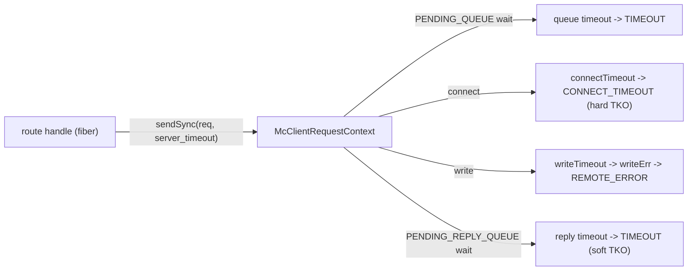
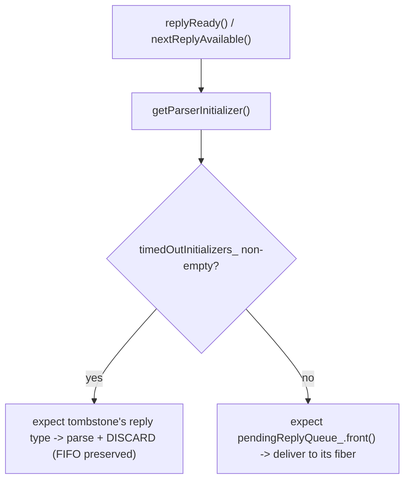
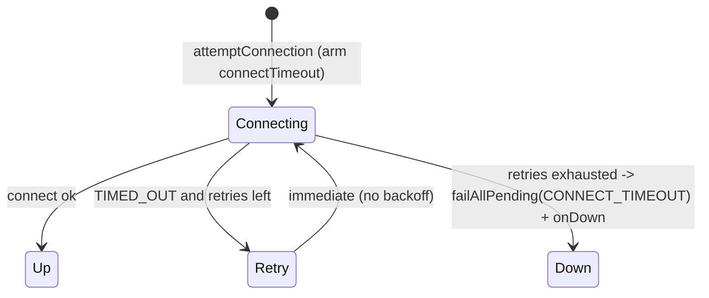
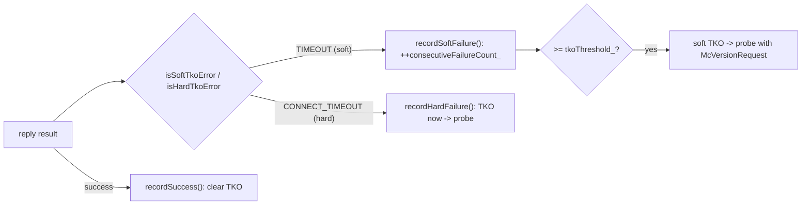

# mcrouter request & connection timeouts (AsyncMcClient)

how Meta's mcrouter bounds every way a backend can be slow: the per-request
**reply timeout** a fiber arms before it parks, the **connect** and **write**
timeouts on the socket, the **shrink-only** timeout negotiation across routes, and
— the subtle part — how a *timed-out* request is kept as a **tombstone** so the
late wire reply doesn't corrupt the in-order ASCII reply stream. It closes with
how a timeout feeds **TKO**.

> Source pinned to `facebook/mcrouter` @ `42aa391189c7`. Citations are by symbol
> and file path (relative to the repo root); line numbers drift, symbols don't.
> Reference-only — no rusty-mcrouter content. See
> [`../design/timeouts.md`](../design/timeouts.md) for what we copy and
> `../architecture/timeouts.md` for what we end up building. This is the timeout
> deep-dive companion to [`./backend-client.md`](./backend-client.md) (the
> `AsyncMcClientImpl` client, its `McClientRequestContext` state machine, and the
> FIFO/Caret reply matching this builds on); for the fiber/`EventBase` model the
> baton parks on, see [`threading-model.md`](./threading-model.md).

---

## tl;dr

- **The reply timeout is per request and fiber-scoped.**
  `AsyncMcClientImpl::sendSync(req, timeout)` builds a `McClientRequestContext`,
  sends it, then blocks in `ctx.waitForReply(timeout)`. The fiber arms a
  `folly::fibers::Baton::TimeoutHandler` (`batonTimeoutHandler_`,
  `scheduleTimeout`) and parks the baton — the *fiber* blocks, the *thread* keeps
  serving other requests.
- **A timeout is a result, and which result depends on where the request was.**
  `waitForReply` returns `carbon::Result::TIMEOUT` for both the *queue* wait
  (`PENDING_QUEUE` → "Client queue timeout") and the *reply* wait
  (`PENDING_REPLY_QUEUE` → "Reply timeout"). If the reply actually arrived first
  (`REPLIED_QUEUE`) it waits for write completion and returns the real reply.
- **The ASCII tombstone is the crux.** memcached ASCII replies are positional, so
  a timed-out request whose bytes were already written *will still get a reply
  later, in FIFO order*. mcrouter moves that request's parser initializer into a
  separate **`timedOutInitializers_`** queue; `getParserInitializer()` drains it
  **before** the live queues, so the late reply is parsed and **discarded** in the
  right shape and every later request stays aligned.
- **Connect and write timeouts live on the socket.** `attemptConnection()` passes
  `connectionOptions_.connectTimeout` to `AsyncSocket::connect`; `connectErr()`
  maps a timeout to `carbon::Result::CONNECT_TIMEOUT` and retries up to
  `numConnectTimeoutRetries` (immediately, no backoff). The write timeout is
  `socket_->setSendTimeout(writeTimeout)`; a stuck write surfaces via `writeErr()`
  → `processShutdown()`, failing in-flight sends as `REMOTE_ERROR`.
- **Timeouts only ever shrink.** `Transport::updateTimeoutsIfShorter()` and
  `ProxyDestinationBase::updateShortestTimeout()` mean that when several routes
  share a destination, the **most aggressive** timeout wins — a destination's
  effective timeout is the min over its referrers.
- **A timeout is a TKO signal.** `TIMEOUT` is a **soft** failure (N in a row →
  soft TKO); `CONNECT_TIMEOUT` is a **hard** failure (immediate TKO). The tracker
  then health-probes with `McVersionRequest` until the host recovers.

---

## where timeouts sit

Three independent clocks guard three phases of a backend request. They're armed in
different places and produce different results:



The reply timeout is the *request*'s deadline (per `sendSync`); connect/write are
the *connection*'s deadlines (per `ConnectionOptions`). Read
[`./backend-client.md`](./backend-client.md) for the `McClientRequestContext`
`ReqState` machine (`PENDING_QUEUE → WRITE_QUEUE → PENDING_REPLY_QUEUE →
REPLIED_QUEUE → COMPLETE`) these timeouts move a request through.

---

## 1. the reply timeout: a baton with a deadline

`AsyncMcClientImpl::sendSync` is the producer side
(`mcrouter/lib/network/AsyncMcClientImpl-inl.h`):

```cpp
template <class Request>
ReplyT<Request> AsyncMcClientImpl::sendSync(
    const Request& request, std::chrono::milliseconds timeout, ...) {
  assert(folly::fibers::onFiber());
  // ... maxPending admission (returns LOCAL_ERROR "Max pending requests", NOT Busy)
  McClientRequestContext<Request> ctx(request, nextMsgId_, ...);
  sendCommon(ctx);
  return ctx.waitForReply(timeout);   // <-- fiber parks on a baton with this deadline
}
```

The deadline itself is a fiber `Baton::TimeoutHandler` armed in
`McClientRequestContextBase::scheduleTimeout`
(`mcrouter/lib/network/McClientRequestContext.h`, `McClientRequestContext.cpp`):
`batonTimeoutHandler_` is scheduled for `batonWaitTimeout_`, then the fiber waits
on `baton_`. Either the reply posts the baton (`replyReady` → `queue_.reply`) or
the timeout handler does — whichever fires first.

What you get back is **state-dependent** (`McClientRequestContext-inl.h`,
`waitForReply`):

| State when the clock fires | Result | Message |
|---|---|---|
| `PENDING_QUEUE` (never written) | `carbon::Result::TIMEOUT` | "Client queue timeout" |
| `PENDING_REPLY_QUEUE` (written, awaiting reply) | `carbon::Result::TIMEOUT` | "Reply timeout" |
| `REPLIED_QUEUE` (reply already parsed) | the real reply | — waits for write completion first |

So mcrouter distinguishes "we never even sent it" from "we sent it and the server
was slow" — both are `TIMEOUT`, but the message (and the downstream meaning)
differs. The `timeout` value is **per request**, passed down from
`ProxyDestination::send` (`ProxyDestination-inl.h`), which gets it from route/pool
config (§the knobs).

```mermaid
sequenceDiagram
  participant F as route fiber
  participant CTX as McClientRequestContext
  participant Q as McClientRequestContextQueue
  participant BK as backend
  F->>CTX: waitForReply(timeout)
  CTX->>CTX: batonTimeoutHandler_.scheduleTimeout(timeout); baton_.wait()
  alt reply in time
    BK-->>Q: reply -> queue_.reply() -> baton_.post()
    Q-->>F: real reply
  else deadline first
    CTX-->>F: carbon::Result::TIMEOUT ("Reply timeout")
    Note over Q,BK: request stays as a tombstone (§2) — its reply is still coming
  end
```

---

## 2. the ASCII tombstone: `timedOutInitializers_`

This is the part a reimplementation has to get right. For the in-order ASCII
protocol there is **no request id** on a reply — reply *k* belongs to the *k*-th
outstanding request. So when a request times out *after it was written*, you can't
just forget it: its reply is still in flight and will arrive in FIFO order. Drop
the slot and every subsequent reply is matched to the wrong request.

mcrouter keeps the timed-out request as a **tombstone**
(`McClientRequestContext.h`, `McClientRequestContext.cpp`):

- `removePendingReply()` pulls the timed-out context out of `pendingReplyQueue_`
  **but pushes its parser initializer into a separate `timedOutInitializers_`
  queue.** The context is gone (its fiber already got `TIMEOUT`), but a *parser
  shape* remains.
- `getParserInitializer()` returns initializers in strict order:
  **`timedOutInitializers_.front()` first**, then `pendingReplyQueue_.front()`,
  then `writeQueue_.front()`. So the parser is told to expect exactly the reply
  type of the oldest still-outstanding request — tombstone or live.
- when the late reply arrives, `reply()` (in-order branch,
  `McClientRequestContext-inl.h`) pops `timedOutInitializers_` first; with no live
  context behind it, the reply is **parsed and discarded** — never delivered, but
  consumed so the byte stream stays framed. Live contexts behind it advance
  normally.



(Out-of-order Caret doesn't need this — it matches by `reqId` — so the tombstone
machinery is specifically the ASCII in-order tax.)

---

## 3. connect timeout

The socket connect deadline is `ConnectionOptions::connectTimeout`, applied in
`AsyncMcClientImpl::attemptConnection()`
(`mcrouter/lib/network/AsyncMcClientImpl.cpp`), which passes
`connectionOptions_.connectTimeout.count()` into `AsyncSocket::connect(...)` (and
the SSL/Fizz path). On expiry, `connectErr()`:

- maps the socket `TIMED_OUT` to `carbon::Result::CONNECT_TIMEOUT`;
- if `numConnectTimeoutRetries` remain, decrements and **re-enters
  `attemptConnection()` immediately** (no backoff delay);
- otherwise `failAllPending(CONNECT_TIMEOUT, ...)` and fires the `onDown` callback.

`CONNECT_TIMEOUT` is a **hard** TKO failure (§6) — a host you can't even connect to
is marked down immediately, not after N strikes.



---

## 4. write timeout

The write deadline is `ConnectionOptions::writeTimeout`, applied as
`socket_->setSendTimeout(writeTimeout)` right after connect and after any
TLS/plaintext transition (`AsyncMcClientImpl.cpp`). A write that can't make
progress trips the socket's send timeout and surfaces through `writeErr()`, which
marks the already-written requests as sent and then calls `processShutdown(...)`;
the outstanding sent requests are failed as **`carbon::Result::REMOTE_ERROR`**.

Worth noting for a faithful port: there is **no dedicated `TIMEOUT` result on the
low-level write-timeout path** — `TIMEOUT` is specifically the *request wait*
result from `waitForReply` (§1). A write that times out tears the connection down
(`processShutdown`) rather than returning a per-request timeout.

---

## 5. timeouts only shrink: `updateTimeoutsIfShorter`

A single destination can be referenced by many routes, each wanting its own
timeout. mcrouter resolves this by **taking the minimum**, never growing a
timeout:

- `Transport::updateTimeoutsIfShorter(connectTimeout, writeTimeout)`
  (`mcrouter/lib/network/Transport.h`, impl in `AsyncMcClientImpl.cpp`) lowers the
  stored connect/write timeouts and **ignores larger values**; if a socket already
  exists, the new (shorter) write timeout is re-applied via `setSendTimeout`.
- `ProxyDestinationBase::updateShortestTimeout()` does the same accounting at the
  destination level as routes are wired up.

Net: a destination's effective timeout is the **min over all routes** that target
it — the most aggressive referrer sets the bound. (The per-request *reply* timeout
in §1 is still passed per `sendSync`; this shrink-only rule governs the
*connection*'s connect/write timeouts.)

---

## 6. a timeout is a TKO signal

Timeouts don't just fail one request — they feed the destination health tracker so
mcrouter stops hammering a bad host. Classification is in `McResUtil.h`:

| Result | TKO class |
|---|---|
| `TIMEOUT` (reply timeout) | **soft** — N consecutive → soft TKO |
| `CONNECT_TIMEOUT`, `CONNECT_ERROR`, `SHUTDOWN` | **hard** — immediate TKO |

`ProxyDestinationBase::handleTko()` routes a soft failure to
`TkoTracker::recordSoftFailure()` (increments `consecutiveFailureCount_`, marks
soft TKO once `tkoThreshold_` is crossed) and a hard failure to
`recordHardFailure()` (marks TKO immediately); a good reply calls `recordSuccess()`
which can clear it (`TkoTracker.h`/`.cpp`). On entering TKO,
`startSendingProbes()` schedules health probes and `sendProbe()` sends an
`McVersionRequest()` using `shortestWriteTimeout()` until the host answers. The
soft threshold is the `failures_until_tko` option (CLI `--timeouts-until-tko`).



(The TKO tracker itself — soft/hard semantics, the single-probe gate per host, the
`tko`/`suspect_servers` stats — is its own subsystem; this doc only shows how a
timeout *enters* it.)

---

## the knobs that shape all of this

| Option | Effect |
|---|---|
| `server_timeout_ms` (`--server-timeout`) | default per-request reply timeout to a destination. |
| route JSON `server_timeout` / `connect_timeout` | per-route override of the destination's reply/connect timeout (then shrunk, §5). |
| `cross_region_timeout_ms` / `cross_cluster_timeout_ms` / `within_cluster_timeout_ms` | topology-scoped default timeouts. |
| `waiting_request_timeout_ms` | the *queue* wait timeout (the `PENDING_QUEUE` "Client queue timeout"), distinct from the reply timeout. |
| `connect_timeout_retries` (`ConnectionOptions::numConnectTimeoutRetries`) | immediate connect retries before failing `CONNECT_TIMEOUT`. |
| `failures_until_tko` (`--timeouts-until-tko`) | consecutive soft failures (incl. reply timeouts) before soft TKO. |

(`server_load`-based adaptive/dynamic timeouts were **not** found in this commit;
the only "adaptive" behavior is the shrink-only min in §5.)

---

## stats

The timeout/error result families are declared in `mcrouter/stat_list.h` (the
`result_*` `count`/`all` pairs, per [`./observability.md`](./observability.md)'s
count-vs-rate split):

| Stat | Counts |
|---|---|
| `result_connect_timeout_count` / `_all` | connect timeouts (`CONNECT_TIMEOUT`). |
| `result_data_timeout_count` / `_all` | reply timeouts (`TIMEOUT`). |
| `result_connect_error_count` / `_all` | connect errors (non-timeout). |
| `result_remote_error_count` / `_all` | remote errors (incl. the write-timeout `REMOTE_ERROR` path). |
| `result_busy_count` / `_all` | server-busy replies. |
| `result_deadline_exceeded_error_count` / `_all` | deadline-exceeded errors. |

(There is **no** `request_timeout_count` or `cmd_*_timeout` symbol in this commit;
the `result_data_timeout_*` / `result_connect_timeout_*` families are the timeout
counters.)

---

## source map

| Concept | Symbol | File @ `42aa391189c7` |
|---|---|---|
| Per-request send + wait | `AsyncMcClientImpl::sendSync`, `waitForReply` | `mcrouter/lib/network/AsyncMcClientImpl-inl.h` |
| Baton deadline | `McClientRequestContextBase::scheduleTimeout`, `batonTimeoutHandler_`, `batonWaitTimeout_` | `mcrouter/lib/network/McClientRequestContext.h`, `.cpp` |
| Timeout result by state | `McClientRequestContext::waitForReply` (`PENDING_QUEUE`/`PENDING_REPLY_QUEUE`/`REPLIED_QUEUE` → `TIMEOUT`) | `mcrouter/lib/network/McClientRequestContext-inl.h` |
| ASCII tombstone | `removePendingReply`, `timedOutInitializers_`, `getParserInitializer`, in-order `reply()` | `mcrouter/lib/network/McClientRequestContext.h`, `.cpp`, `-inl.h` |
| Parser hookup | `replyReady`, `nextReplyAvailable` | `mcrouter/lib/network/AsyncMcClientImpl-inl.h`, `.cpp` |
| Connect timeout | `attemptConnection` (`connectTimeout` → `AsyncSocket::connect`), `connectErr` (`CONNECT_TIMEOUT`, retries) | `mcrouter/lib/network/AsyncMcClientImpl.cpp` |
| Connect opts | `ConnectionOptions::connectTimeout`, `numConnectTimeoutRetries` | `mcrouter/lib/network/ConnectionOptions.h` |
| Write timeout | `setSendTimeout(writeTimeout)`, `writeErr` → `processShutdown` (`REMOTE_ERROR`) | `mcrouter/lib/network/AsyncMcClientImpl.cpp`, `ConnectionOptions.h` |
| Shrink-only | `Transport::updateTimeoutsIfShorter`, `ProxyDestinationBase::updateShortestTimeout` | `mcrouter/lib/network/Transport.h`, `mcrouter/ProxyDestinationBase.cpp` |
| Per-request timeout source | `ProxyDestination::send`, route timeout selection | `mcrouter/ProxyDestination-inl.h`, `mcrouter/routes/McRouteHandleProvider-inl.h` |
| Timeout → TKO class | `isSoftTkoError`/`isHardTkoError` (`TIMEOUT` soft, `CONNECT_TIMEOUT` hard) | `mcrouter/lib/network/McResUtil.h` |
| TKO handling | `handleTko`, `recordSoftFailure`, `recordHardFailure`, `recordSuccess`, `consecutiveFailureCount_`, `tkoThreshold_` | `mcrouter/ProxyDestinationBase.cpp`, `mcrouter/TkoTracker.h`, `.cpp` |
| Health probe | `startSendingProbes`, `sendProbe` (`McVersionRequest`, `shortestWriteTimeout`) | `mcrouter/ProxyDestinationBase.cpp`, `mcrouter/ProxyDestination-inl.h` |
| Knobs | `server_timeout_ms`, `cross_*_timeout_ms`, `within_cluster_timeout_ms`, `waiting_request_timeout_ms`, `connect_timeout_retries`, `failures_until_tko` | `mcrouter/mcrouter_options_list.h` |
| Stats | `result_data_timeout_*`, `result_connect_timeout_*`, `result_connect_error_*`, `result_remote_error_*`, `result_busy_*`, `result_deadline_exceeded_error_*` | `mcrouter/stat_list.h` |
