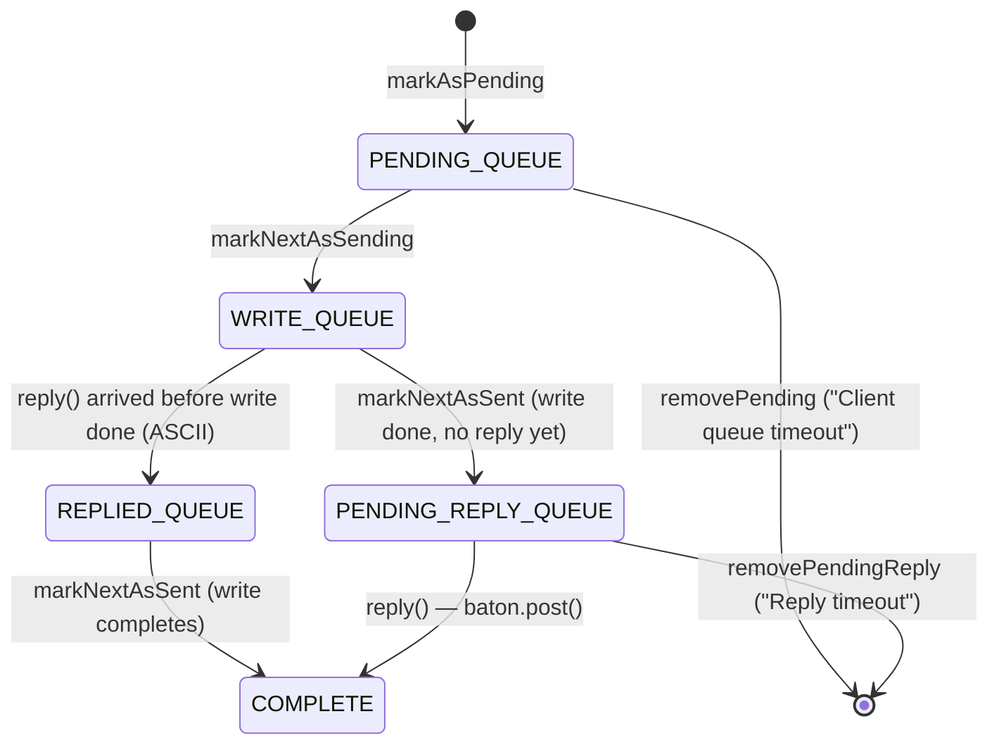

# mcrouter request timeouts

how mcrouter bounds the two ways a backend request can hang — establishing the
connection and waiting for a reply — what result a timeout produces, how a
timed-out request is cleaned up without corrupting the pipelined reply stream,
where the timeout *value* comes from, and how timeouts drive TKO (tracked
knockout).

> Source pinned to `facebook/mcrouter` @ `42aa391189c7`. Citations are by symbol
> and file path (relative to the repo root). Reference-only — no rusty-mcrouter
> content; see [`../design/timeouts.md`](../design/timeouts.md) for what we build
> and where we deliberately diverge. Companion to
> [`backend-client.md`](./backend-client.md) (the `AsyncMcClient` this lives in)
> and [`threading-model.md`](./threading-model.md) (the fibers that block on it).
> External `folly::fibers` citations are pinned to `facebook/folly @ eb2dc33f`.

---

## tl;dr

- mcrouter has **four** request-path timeouts plus a TKO-probe timeout:
  **connect** (establish the socket), **request/server** (await a reply — the
  one people mean by "timeout"), **write/send** (`setSendTimeout`), and a
  **waiting-request** timeout (time spent *queued* before being sent). Defaults:
  `server_timeout_ms = 1000`; connect/write inherit it; the rest default `0` (off).
- The per-request timeout **value is resolved once, at config-parse time, per
  pool** (`McRouteHandleProvider::makePool`): base `server_timeout_ms` → per-pool
  JSON `server_timeout` → a region/cluster **tier override** (`within_cluster` /
  `cross_cluster` / `cross_region`, each applied only if non-0). It is frozen into
  `DestinationRoute::timeout_` and handed verbatim to `AsyncMcClient::sendSync`.
- A request waits on a **per-request `folly::fibers::Baton` with a timeout
  handler**. On elapse the fiber resumes and `waitForReply` returns
  `carbon::Result::TIMEOUT` — `"Reply timeout"` if it was already sent,
  `"Client queue timeout"` if it never left the queue.
- A timed-out request is **removed** from its live queue. For the **in-order
  (ASCII)** protocol a *typed parser-initializer* is stashed in
  `timedOutInitializers_` so the still-incoming reply is **parsed-and-discarded
  in order** (a 3-step handshake). A single timeout does **not** tear the
  connection down.
- **Connect** timeout → `CONNECT_TIMEOUT` (only folly `TIMED_OUT`; everything
  else → `CONNECT_ERROR`). `connect_timeout_retries` retries **immediately, with
  no backoff**; all real backoff lives in the TKO probe layer.
- Timeouts **feed TKO**: a request `TIMEOUT` is a **soft** failure (knock out
  after `failures_until_tko` consecutive); `CONNECT_ERROR`/`CONNECT_TIMEOUT`/
  `SHUTDOWN` are **hard** (immediate). The owning proxy then probes with
  `McVersion` at 1.5× exponential backoff + jitter from 10 s → 60 s until one
  succeeds. A per-pool **fail-open** cap limits how many destinations may be TKO
  at once.

---

## the timeout taxonomy

`mcrouter/mcrouter_options_list.h`, group `"Timeouts"` (lines 638-684) and `"TKO
probes"` (606-694). Each tier option documents the precedence contract inline
("If specified (non 0) takes precedence over every other timeout"):

| option (CLI) | field | default | bounds |
|---|---|---|---|
| `server_timeout_ms` (`-t`, `--server-timeout`) | per-route `timeout_` | **1000** | awaiting a reply from a backend — the main request timeout |
| `cross_region_timeout_ms` | (tier override) | 0 | request timeout for a pool in a different region |
| `cross_cluster_timeout_ms` | (tier override) | 0 | request timeout for a pool in same region, different cluster |
| `within_cluster_timeout_ms` | (tier override) | 0 | request timeout for a pool in the same cluster |
| `waiting_request_timeout_ms` | queue admission | 0 | max time queued (unsent) before discard; only with queue throttling |
| (no `*_ms` option) | `ConnectionOptions.connectTimeout` | = server timeout | TCP connection establishment |
| (no `*_ms` option) | `ConnectionOptions.writeTimeout` | = server timeout | socket send timeout (`setSendTimeout`) |
| `connect_timeout_retries` (`--connect-timeout-retries`) | `numConnectTimeoutRetries` | 0 | how many times to retry a connect that timed out |
| `probe_delay_initial_ms` (`--probe-timeout-initial`) | probe backoff floor | 10000 | first TKO probe delay |
| `probe_delay_max_ms` (`--probe-timeout-max`) | probe backoff cap | 60000 | max TKO probe delay |
| `failures_until_tko` | `tkoThreshold_` | 3 | consecutive soft failures before soft TKO |

Note there is **no standalone connect-timeout-ms option**: connect and write
timeouts ride on `ConnectionOptions` and are seeded from the resolved request
timeout (then ratcheted down per shared connection — see below).

---

## where the timeout value comes from

Resolved **once at config-parse time, per pool**, in
`McRouteHandleProvider<RouterInfo>::makePool` (`mcrouter/routes/McRouteHandleProvider-inl.h:196-222`):

```cpp
std::chrono::milliseconds timeout{opts.server_timeout_ms};      // 1. global base
if (auto jTimeout = json.get_ptr("server_timeout")) {
  timeout = parseTimeout(*jTimeout, "server_timeout");          // 2. per-pool JSON override
}
std::chrono::milliseconds connectTimeout = timeout;             // connect snapshot (BEFORE tiers)
if (auto jConnectTimeout = json.get_ptr("connect_timeout")) {
  connectTimeout = parseTimeout(*jConnectTimeout, "connect_timeout");
}
if (!region.empty() && !cluster.empty()) {                      // 3. tier override (both required)
  auto& route = opts.default_route;
  if (region == route.getRegion() && cluster == route.getCluster()) {
    if (opts.within_cluster_timeout_ms != 0) timeout = ...within_cluster_timeout_ms;
  } else if (region == route.getRegion()) {
    if (opts.cross_cluster_timeout_ms != 0)  timeout = ...cross_cluster_timeout_ms;
  } else {
    if (opts.cross_region_timeout_ms != 0)   timeout = ...cross_region_timeout_ms;
  }
}
```

Precedence, exactly as coded:

1. base `server_timeout_ms` (1000), overridable by per-pool JSON `server_timeout`;
2. the tier override applies **only if the pool declares both `region` and
   `cluster`**, classified against the router's own `opts.default_route`
   (`mcrouter/RoutingPrefix.h:55-65`, `getRegion()`/`getCluster()`) into exactly
   one mutually-exclusive bucket;
3. the matched tier wins **only if non-0** (direct reassignment, not a min/sum);
   buckets are exclusive, so only the destination's tier is ever consulted.

Crucially `connectTimeout` is **snapshotted before** the tier block, so a tier
override changes only the *request/write* timeout, never the connect timeout.

The resolved value then flows to the leaf and is **never recomputed per request**:

```
makePool → createDestinationRoute (McRouteHandleProvider-inl.h:436-464)
  → DestinationRoute::timeout_           (DestinationRoute.h:84, member :139)
  → destination_->send(req, ctx, timeout_, ...)        (DestinationRoute.h:338)
  → ProxyDestination::send → getTransport().sendSync(request, timeout, ...)
                                          (ProxyDestination-inl.h:36-51)
  → AsyncMcClient::sendSync(request, timeout, rpcContext)   (AsyncMcClient.h:85-89)
```

**Request timeout vs socket timeout — do not conflate.** `createDestinationRoute`
produces two sinks: the per-route `timeout_` above (the request/reply deadline),
and the **socket** connect/write timeouts on the (AccessPoint-keyed, possibly
**shared**) `ProxyDestination`. The latter are seeded from `timeout` and only
ever ratcheted **down** to the minimum across every pool that targets the same
host (`ProxyDestinationBase::updateShortestTimeout`, `ProxyDestinationBase.cpp:102-117`),
then copied into `ConnectionOptions` in `ProxyDestination::initializeTransport`
(`ProxyDestination-inl.h:288-295`). So one shared connection uses the *shortest*
socket timeout, while each route keeps its own per-request `timeout_`.

---

## connect & write timeouts

`AsyncMcClientImpl::attemptConnection` (`mcrouter/lib/network/AsyncMcClientImpl.cpp:345-430`)
sets `socket_->setSendTimeout(writeTimeout.count())` (:370) then calls
`connect(this, address, connectionOptions_.connectTimeout.count(), options)` on
the plaintext / Fizz / SSL-offload path. `this` is folly's `ConnectCallback`.

On elapse, the result is decided **purely by the folly exception type** —
`connectErr` (`AsyncMcClientImpl.cpp:538-585`):

```cpp
carbon::Result error = carbon::Result::CONNECT_ERROR;            // default
if (ex.getType() == folly::AsyncSocketException::TIMED_OUT) {
  error = carbon::Result::CONNECT_TIMEOUT;                       // timeout
} else if (isAborting_) {
  error = carbon::Result::ABORTED;
}                                                                // else: CONNECT_ERROR
```

(`CONNECT_TIMEOUT = 14`, `CONNECT_ERROR = 15` — `lib/carbon/carbon_result.thrift:32-33`.)
Connection refused, SSL failure, and DNS failure all surface as `CONNECT_ERROR`.

`connect_timeout_retries` is a tail clause of `connectErr`
(`AsyncMcClientImpl.cpp:574-584`):

```cpp
if (ex.getType() == folly::AsyncSocketException::TIMED_OUT &&
    numConnectTimeoutRetriesLeft_ > 0) {
  --numConnectTimeoutRetriesLeft_;
  attemptConnection();                       // immediate retry — NO backoff
} else {
  queue_.failAllPending(error, errorMessage);
  if (connectionCallbacks_.onDown) connectionCallbacks_.onDown(reason, getNumConnectRetries());
  numConnectTimeoutRetriesLeft_ = connectionOptions_.numConnectTimeoutRetries;  // reset
}
```

Only `TIMED_OUT` retries; `CONNECT_ERROR` never does. Retries are **immediate with
no delay** — all real backoff lives in the TKO probe layer. `writeTimeout`
(`setSendTimeout`) is (re)applied at four sites: initial connect (:370), after a
`TLS_TO_PLAINTEXT` fallback (:458), after a `KTLS12` socket move (:469), and on
runtime tightening (`updateTimeoutsIfShorter`, :824).

> Note: `ConnectionTracker.{h,cpp}` is the **server-side** `McServerSession` LRU
> — it has no client connect/retry/backoff logic. Don't cite it here.

---

## the request lifecycle & the two request timeouts

The per-connection request set is `McClientRequestContextQueue`
(`mcrouter/lib/network/McClientRequestContext.{h,cpp,-inl.h}`). The discriminator
between **in-order (ASCII)** and **out-of-order (Caret)** is the `outOfOrder_`
flag (`McClientRequestContext.h:303`); ASCII uses FIFO queues +
`timedOutInitializers_`, Caret uses `set_` keyed by request id.

`ReqState` (`McClientRequestContext.h:78-86`) and the queues (`.h:301-320`):
`pendingQueue_` (queued to send) → `writeQueue_` (being written) →
`pendingReplyQueue_` (sent, awaiting reply) → `repliedQueue_` (replied before
write finished) → `COMPLETE`.



Both timeouts are dispatched by `waitForReply` (`McClientRequestContext-inl.h:75-113`),
which blocks the fiber then switches on `state()`:

```cpp
batonWaitTimeout_ = timeout;
baton_.wait(batonTimeoutHandler_);
switch (state()) {
  case ReqState::PENDING_QUEUE:        // never sent
    queue_.removePending(*this);
    return createReply(ErrorReply, carbon::Result::TIMEOUT, "Client queue timeout");
  case ReqState::PENDING_REPLY_QUEUE:  // sent, no reply
    queue_.removePendingReply(*this);
    return createReply(ErrorReply, carbon::Result::TIMEOUT, "Reply timeout");
  case ReqState::REPLIED_QUEUE:        // replied, waiting for write — wait again
    baton_.reset(); baton_.wait(); return std::move(replyStorage_.value());
  case ReqState::COMPLETE: return std::move(replyStorage_.value());
  ...
}
```

`removePending` (`.cpp:210-216`) just erases from `pendingQueue_` — nothing was
sent, so no reply will come. `removePendingReply` (`.cpp:218-229`) is the
interesting one (next section).

---

## the in-order timeout-discard handshake (`timedOutInitializers_`)

A request that times out *after* being sent has a reply still coming on the
ordered ASCII stream. mcrouter must consume those bytes to stay aligned, but
deliver them to no one. It does this with a **3-step handshake**, not by leaving
the request in place:

1. **Remove + stash** — `removePendingReply` (`McClientRequestContext.cpp:218-229`):
   ```cpp
   assert(&req == &pendingReplyQueue_.front() || outOfOrder_);   // in-order: only the head may time out
   pendingReplyQueue_.erase(pendingReplyQueue_.iterator_to(req));
   req.setState(State::NONE);
   if (!outOfOrder_) timedOutInitializers_.push(req.initializer_);  // typed parser stashed
   ```
2. **Parse** — when the late reply's header arrives, `getParserInitializer`
   (`.cpp:231-249`) returns the stashed initializer **first** ("in inorder
   protocol we expect to receive timedout requests first"), so the bytes parse
   with the right type.
3. **Discard** — the in-order branch of `reply()` (`McClientRequestContext-inl.h:171-176`)
   pops `timedOutInitializers_` before any live queue and drops the parsed reply
   (no context, no baton):
   ```cpp
   if (!timedOutInitializers_.empty()) {
     timedOutInitializers_.pop();              // discard the timed-out reply, demux stays aligned
   } else if (!pendingReplyQueue_.empty()) { ... }
   ```

Caret needs none of this: `reply(id, ...)` looks the request up in `set_` by id;
a discarded request simply isn't found. A single timeout never closes the
connection — `clearStoredInitializers` runs only on connection close
(`failAllSent`, `.cpp:104-109`).

---

## the fiber baton timeout (how the wait fires)

The wait is a `folly::fibers::Baton` armed with a per-request `TimeoutHandler`
(`McClientRequestContext.h:115-119`):

```cpp
folly::fibers::Baton baton_;
folly::fibers::Baton::TimeoutHandler batonTimeoutHandler_;
std::chrono::milliseconds batonWaitTimeout_{0};
```

`scheduleTimeout` (`McClientRequestContext.cpp:66-70`) arms it (unless already
`COMPLETE`); `waitForReply` blocks on `baton_.wait(batonTimeoutHandler_)`.

On the folly side (external, `facebook/folly @ eb2dc33f`): `Baton::wait(TimeoutHandler&)`
installs a timeout lambda `if (!try_wait()) postHelper(TIMEOUT);`, schedules it on
the fiber manager's `HHWheelTimer` (`folly/fibers/Baton.cpp:49-58,136-143`), and on
expiry `postHelper(TIMEOUT)` → `FiberWaiter::post()` → `fiber_->resume()`
(`folly/fibers/Baton-inl.h:24-35,61-72`) — i.e. the timeout posts the baton and
resumes the suspended fiber on the event-loop side, exactly as a real reply would.
So a "timeout" is just the baton being posted by a timer instead of by a reply;
`waitForReply` can't tell the difference except via `state()`.

---

## how timeouts feed TKO

A timeout result is the primary input to TKO (tracked knockout — stop routing to
a destination that's failing).

**Soft vs hard classification** (`mcrouter/lib/McResUtil.h`):

- `isSoftTkoErrorResult` (105-112): **only `TIMEOUT`** (the request/reply timeout).
- `isHardTkoErrorResult` (117-126): `CONNECT_ERROR`, `CONNECT_TIMEOUT`, `SHUTDOWN`.

**The decision point** — `ProxyDestinationBase::handleTko` (`ProxyDestinationBase.cpp:165-196`):

```cpp
if (proxy().router().opts().disable_tko_tracking) return;   // kill switch
if (isErrorResult(result)) {
  if (isHardTkoErrorResult(result)) {
    if (tracker_->recordHardFailure(this, result)) { onTkoEvent(MarkHardTko); startSendingProbes(); }
  } else if (isSoftTkoErrorResult(result)) {
    if (tracker_->recordSoftFailure(this, result)) { onTkoEvent(MarkSoftTko); startSendingProbes(); }
  }
} else { tracker_->recordSuccess(this); }                   // any clean reply resets the counter
```

Three callers feed it: a normal reply (request `TIMEOUT` → soft) via
`ProxyDestination::onReply` (`ProxyDestination-inl.h:156`); a connect-down
callback (→ hard, `CONNECT_TIMEOUT`/`CONNECT_ERROR`) at `ProxyDestination-inl.h:430-434`;
and a probe reply (un-TKO) at `ProxyDestinationBase.cpp:241`.

**Accounting** (`mcrouter/TkoTracker.{h,cpp}`): `recordSoftFailure` enters soft TKO
when the consecutive-failure run reaches `failures_until_tko` (default 3);
`recordHardFailure` enters hard TKO **immediately** (no threshold) and can convert
an existing soft TKO to hard in place. The `sumFailures_` field
(`TkoTracker.h:188-200`) doubles as the failure counter (`< tkoThreshold_`) and,
once TKO, the responsible-destination pointer (even = soft, `|1` = hard). Only the
**responsible** proxy may clear it; `recordSuccess` (on a successful probe) zeroes
the counters and un-TKOs.

**Probes / backoff** (`ProxyDestinationBase.cpp:198-248`): the owning proxy sends a
`McVersion` probe (`ProxyDestination-inl.h:140-148`) starting at
`probe_delay_initial_ms` (10 s), multiplying by `kProbeExponentialFactor = 1.5`
each time up to `probe_delay_max_ms` (60 s), plus 5–50 % jitter; on a successful
probe the destination is un-TKO'd.

**Fail-open cap** (the "don't TKO too many" guard): per-pool `PoolTkoTracker`
(`TkoTracker.h:31-54`, config `tko_tracker.num_tko_threshold_upper/lower` parsed in
`McRouteHandleProvider-inl.h:256-284`). Once too many destinations in a pool are
TKO, `incrementSoftTkoCount`/`incrementHardTkoCount` refuse to mark more — mcrouter
**fails open** rather than knocking out the whole pool. There is no router-wide CLI
cap; this per-pool latch is the only limit.

**Where TKO suppresses traffic**: `ProxyDestinationBase::maySend`
(`ProxyDestinationBase.cpp:119-128`) returns false when `tracker_->isTko()`, and
`DestinationRoute` (`DestinationRoute.h:171-180`) returns a synthetic `TkoReply`
("Server unavailable. Reason: …") instead of sending.

> `TIMEOUT` and the connect results are also **failover-worthy**
> (`isFailoverErrorResult`, `McResUtil.h:79-100`) — so a `FailoverRoute` above the
> destination retries the next child on the same signal that drives TKO.

---

## the waiting-request timeout (queued, never sent)

Distinct from the backend timeouts: a cap on time spent *queued* under
throttling. Armed in `Proxy::dispatchRequest` (`Proxy-inl.h:167-188`) only when
the request is rate-limited **and** `proxy_max_inflight_requests > 0` **and**
`proxy_max_throttled_requests > 0` **and** `waiting_request_timeout_ms > 0`
(otherwise `timePushedOnQueue_` stays `-1` = disabled). When dequeued,
`WaitingRequest::process` (`Proxy-inl.h:63-82`) drops it with `carbon::Result::BUSY`
if it waited longer than the budget — it never reaches a destination or `sendSync`.

---

## source map

| concept | symbol / file |
|---|---|
| timeout options | `mcrouter/mcrouter_options_list.h` (Timeouts 638-684; connect retries 686-694; TKO probes 606-628) |
| value resolution + precedence | `McRouteHandleProvider<...>::makePool` — `mcrouter/routes/McRouteHandleProvider-inl.h:196-222` |
| region/cluster classification | `RoutingPrefix::getRegion/getCluster` — `mcrouter/RoutingPrefix.h:55-65` |
| per-route timeout | `DestinationRoute::timeout_` / `send` — `mcrouter/routes/DestinationRoute.h:84,139,338` |
| send → sendSync | `ProxyDestination::send` — `mcrouter/ProxyDestination-inl.h:36-51`; `AsyncMcClient::sendSync` — `lib/network/AsyncMcClient.h:85-89` |
| socket timeouts (shared, min) | `ProxyDestinationBase::updateShortestTimeout` — `ProxyDestinationBase.cpp:102-117`; `initializeTransport` — `ProxyDestination-inl.h:288-295`; `ConnectionOptions` — `lib/network/ConnectionOptions.h:83-93` |
| connect timeout + retries | `AsyncMcClientImpl::attemptConnection/connectErr` — `lib/network/AsyncMcClientImpl.cpp:345-430,538-585` |
| connect result codes | `lib/carbon/carbon_result.thrift:32-33` (CONNECT_TIMEOUT=14, CONNECT_ERROR=15) |
| request queue + timeout discard | `McClientRequestContext.{h,cpp,-inl.h}` — `waitForReply` (-inl.h:75-113), `removePending`/`removePendingReply`/`getParserInitializer` (.cpp:210-249), `reply` (-inl.h:135-202), `timedOutInitializers_` (.h:318-320) |
| fiber baton timeout | `baton_`/`batonTimeoutHandler_` (.h:115-119), `scheduleTimeout` (.cpp:66-70); folly `Baton::wait(TimeoutHandler)` — `folly/fibers/Baton.{h,cpp,-inl.h}` |
| soft/hard/failover classification | `lib/McResUtil.h` — `isSoftTkoErrorResult` 105-112, `isHardTkoErrorResult` 117-126, `isFailoverErrorResult` 79-100 |
| TKO accounting + probes | `ProxyDestinationBase::handleTko/maySend/scheduleNextProbe` — `ProxyDestinationBase.cpp:119-128,165-248`; `TkoTracker.{h,cpp}` |
| waiting-request timeout | `Proxy::dispatchRequest` / `WaitingRequest::process` — `mcrouter/Proxy-inl.h:167-188,63-82` |
