# mcrouter warm-up route

how Meta's mcrouter lets you grow, shrink, or replace a cache pool without a
miss-rate spike hammering the backing store: a `WarmUpRoute` fronts a small/new
**cold** pool with a large/existing **warm** pool. A cold miss is served from
warm and the value is replayed back into cold, so the cold tier fills itself
from live traffic instead of from the database.

> Source pinned to `facebook/mcrouter` @ `42aa391189c7`. Citations are by symbol
> and file path (relative to the repo root); line numbers drift, symbols don't.
> Reference-only — no rusty-mcrouter content. See
> [`../design/warm-up-route.md`](../design/warm-up-route.md) for what we copy and
> `../architecture/warm-up-route.md` for what we end up building (**nothing
> exists yet** — see [`../architecture/overview.md`](../architecture/overview.md)).
> The route tree, traversal, and per-op dispatch this hangs off are the same ones
> in [`backend-client.md`](./backend-client.md) and
> [`hash-routing.md`](./hash-routing.md); the fibers that run the async write-back
> are in [`threading-model.md`](./threading-model.md).

---

## tl;dr

- **It's a read-through cache filler, not a replicator.** Only reads warm a cold
  pool. `get`/`gets`/`lease-get`/`gat`/`gats`/`metaget` consult warm on a cold
  miss; **`set`/`delete`/`incr`/all mutations go to cold only** — "the client is
  responsible for warm consistency" (`WarmUpRoute.h` class comment).
- **Two children, named by role.** A `warm` route handle (authoritative,
  populated) and a `cold` route handle (being filled). Order is always **cold
  first; on a cold miss, warm; on a warm hit, write back to cold.**
- **The write-back is an `add`, not a `set`** (so it never clobbers a value that
  appeared concurrently) — except `lease-get`, which writes back with a
  `lease-set` carrying the cold reply's lease token.
- **Sync vs async differs by op, and it's load-bearing.** `get` and `lease-get`
  do the cold write-back **fire-and-forget** (`folly::fibers::addTask`) and return
  the warm value immediately. `gets`/`gat`/`gats` do it **synchronously** and then
  **re-issue the original request to cold** — because they need a CAS token that
  only cold can mint.
- **The warm→cold TTL ("exptime") has a fallback chain.** Use the configured
  `exptime` if present (0 is allowed = never expire); else, if `enable_metaget`,
  fetch the remaining TTL from warm via a `metaget`. In OSS, `isMetagetAvailable()`
  is hard-coded false, so **omitting `exptime` means a write-back TTL of 0**.
- **No stats of its own.** WarmUpRoute bumps no counters; you observe it through
  the underlying warm/cold pool destination stats.
- **Don't confuse it with two neighbors.** `SlowWarmUpRoute` (`"slow-warmup"`) is
  an unrelated per-destination hit-rate failover; `StagingRoute` (`"staging"`) is
  a warm-authoritative mirror. Both covered in §5.

---

## the shape of it

`WarmUpRoute<RouteHandleIf>` (`mcrouter/routes/WarmUpRoute.h`, header-only — there
is no `-inl`) holds two child route handles and an optional TTL:

```cpp
WarmUpRoute(std::shared_ptr<RouteHandleIf> warm,
            std::shared_ptr<RouteHandleIf> cold,
            folly::Optional<uint32_t> exptime);
// members: warm_, cold_, exptime_ ;  routeName() == "warm-up"
```

Every warming op follows one spine — **cold, then (on miss) warm, then (on warm
hit) replay into cold** — but the write-back op, its sync/async-ness, and which
reply the client gets all vary by request type (§2–§3).

```mermaid
flowchart TB
  CL["client get/gets/lease-get/gat/gats"] --> WUR["WarmUpRoute.route"]
  WUR -->|"1. always cold first"| COLD["cold route handle"]
  COLD -->|"cold HIT"| DONE["return cold reply"]
  COLD -->|"cold MISS"| WARM["warm route handle (plain get)"]
  WARM -->|"warm MISS"| RET["return warm reply (the miss)"]
  WARM -->|"warm HIT"| WB{"write-back to cold"}
  WB -->|"get / lease-get: async addTask, return warm now"| ASYNC["fibers::addTask: cold.route(add / lease-set)"]
  WB -->|"gets / gat / gats: sync add, then re-get cold for CAS"| SYNC["cold.route(add); return cold.route(orig)"]
  WB -. exptime .-> TTL["config exptime (0 ok), else metaget remaining-TTL from warm"]
```



---

## 1. which requests warm, which pass through

There are six explicit `route()` overloads plus one generic template
(`WarmUpRoute.h`). The generic template is the catch-all and it is **cold-only**:

```cpp
template <class Request>
ReplyT<Request> route(const Request& req) const {
  // client is responsible for consistency of warm route, do not replicate
  // any update/delete operations
  return cold_->route(req);
}
```

| Request | warms? | what it does |
|---|---|---|
| `McGetRequest` | yes | cold → (miss) warm → **async** `add` to cold; returns **warm** reply |
| `McGetsRequest` | yes | cold → (miss) warm `get` → **sync** `add` to cold → **re-`gets` cold** (for CAS); returns the re-fetched **cold** reply |
| `McLeaseGetRequest` | yes | cold → (miss, **not** hot-miss) warm `get` → **async** `lease-set` to cold w/ cold's lease token; returns a reply synthesized from **warm** |
| `McMetagetRequest` | read-through | cold → (miss) warm; **no write-back** |
| `McGatRequest` / `McGatsRequest` | yes | cold → (miss) warm `get` → **sync** `add` (TTL = the request's own touch exptime) → re-issue to cold; returns **cold** |
| everything else (`set`, `delete`, `incr`, `decr`, `add`, `append`, `prepend`, `touch`, `lease-set`, `cas`, …) | no | **cold only**, warm untouched |

`traverse()` visits cold first, then warm — the order used by `route_handles`
introspection too.

---

## 2. the warming algorithm (the `get` case, in full)

`get` is the canonical path and the only one worth quoting whole; the others are
variations on it:

```cpp
McGetReply route(const McGetRequest& req) {
  auto coldReply = cold_->route(req);
  if (isHitResult(*coldReply.result_ref())) {
    return coldReply;                                   // cold hit: done
  }
  /* else */
  auto warmReply = warm_->route(req);
  uint32_t exptime = 0;
  if (isHitResult(*warmReply.result_ref()) &&
      getExptimeForCold(req, exptime)) {
    folly::fibers::addTask([cold = cold_,                // FIRE-AND-FORGET
        addReq = createRequestFromMessage<McAddRequest>(
            req.key()->fullKey(), warmReply, exptime)]() {
      cold->route(addReq);                               // cold write-back: ADD
    });
  }
  return warmReply;                                      // return WARM reply
}
```

Three things to internalize:

- **The write-back is an `add`** (`createRequestFromMessage<McAddRequest>`), so a
  value that another writer `set` into cold in the meantime is not overwritten.
- **It's fire-and-forget** via `folly::fibers::addTask` — the client gets
  `warmReply` immediately; the cold population happens on a detached fiber. The
  integration test asserts exactly this with a `time.sleep(1)` before checking
  cold (`test/test_warmup.py`).
- **On cold miss it returns the warm reply unconditionally** — even a warm miss
  is returned (the client sees the authoritative answer either way); the
  write-back just doesn't fire on a warm miss.

`createRequestFromMessage` (`mcrouter/routes/RoutingUtils.h`) builds the write
request from the warm reply: it clones the value, copies `flags_ref`, and sets
`exptime_ref`.

---

## 3. the variants (and why they differ)

**`gets` — synchronous, then re-read cold for a CAS token** (`WarmUpRoute.h`):

```cpp
McGetsReply route(const McGetsRequest& req) {
  auto coldReply = cold_->route(req);
  if (isHitResult(*coldReply.result_ref())) return coldReply;
  McGetRequest reqGet(req.key()->fullKey());        // plain get to warm
  auto warmReply = warm_->route(reqGet);
  uint32_t exptime = 0;
  if (isHitResult(*warmReply.result_ref()) && getExptimeForCold(req, exptime)) {
    auto addReq = createRequestFromMessage<McAddRequest>(
        req.key()->fullKey(), warmReply, exptime);
    cold_->route(addReq);                            // SYNCHRONOUS add
    return cold_->route(req);                         // re-issue gets -> fresh CAS token
  }
  return coldReply;
}
```

The CAS token (`gets`'s whole point) can only come from cold after the value is
present there — warm was queried with a plain `get` and has no token to give. So
`gets` can't be fire-and-forget; it must add then re-read. `gat`/`gats` are the
same shape but take the TTL from the request's own touch `exptime` (`*req.exptime()`)
rather than the fallback chain.

**`lease-get` — async lease-set, hot-miss short-circuit** (`WarmUpRoute.h`):

```cpp
auto coldReply = cold_->route(req);
if (isHitResult(*coldReply.result_ref()) ||
    isHotMissResult(*coldReply.result_ref())) {
  return coldReply;        // hot miss: someone else is already setting it
}
// real miss with a lease token: plain get to warm, then async lease-set to cold
auto setReq = createRequestFromMessage<McLeaseSetRequest>(key, warmReply, exptime);
setReq.leaseToken_ref() = *coldReply.leaseToken_ref();   // carry cold's token
folly::fibers::addTask([cold = cold_, req = std::move(setReq)]() { cold->route(req); });
```

The **hot-miss** check (`isHotMissResult`: `FOUNDSTALE`/`NOTFOUNDHOT`,
`mcrouter/lib/McResUtil.h`) is the lease optimization: if cold already handed *some
other* request the lease, this request just returns the hot miss and lets that
other request do the fill. The write-back is a **lease-set** carrying cold's lease
token, fired async.

**`metaget` — read-through only**: cold, then warm on miss, **no write-back**.

### the exptime fallback chain

`getExptimeForCold` (`WarmUpRoute.h`) decides the write-back TTL:

```cpp
template <class Request>
bool getExptimeForCold(const Request& req, uint32_t& exptime) {
  if (exptime_.hasValue()) { exptime = *exptime_; return true; }   // config wins (0 allowed)
  return getExptimeFromRoute<RouteHandleIf>(warm_, req.key_ref()->fullKey(), exptime);
}
```

`getExptimeFromRoute` (`mcrouter/routes/RoutingUtils.h`) does a `metaget` to warm,
reads `exptime_ref`, and returns the **remaining** TTL (`warmExptime - now`),
bailing (returns false → no write-back) if the warm metaget missed or the value
already expired. So the chain is: **configured `exptime` → else warm's
remaining-TTL via metaget → else don't warm.**

---

## 4. config schema + factory

`makeWarmUpRoute(RouteHandleFactory&, const folly::dynamic& json)`
(`mcrouter/routes/WarmUpRoute.cpp`), registered as `{"WarmUpRoute",
&makeWarmUpRoute}` in `McRouteHandleProvider::buildRouteMap`:

```cpp
checkLogic(json.count("cold"), "WarmUpRoute: no cold route");   // REQUIRED
checkLogic(json.count("warm"), "WarmUpRoute: no warm route");   // REQUIRED
bool enableMetaget = isMetagetAvailable();                       // OSS: false
if (auto j = json.get_ptr("enable_metaget")) enableMetaget = j->getBool();
folly::Optional<uint32_t> exptime;
if (auto j = json.get_ptr("exptime")) exptime = j->getInt();     // optional int
else if (!enableMetaget) exptime = 0;                            // <- the OSS default
```

| JSON key | Required? | Meaning / default |
|---|---|---|
| `cold` | **yes** | the pool/route being filled (queried first). |
| `warm` | **yes** | the authoritative pool/route (queried on cold miss). |
| `exptime` | no | write-back TTL in seconds; `0` allowed (= never expire). |
| `enable_metaget` | no | default `isMetagetAvailable()` (**false in OSS**). When true *and* `exptime` omitted, TTL is fetched from warm per write-back. When false *and* `exptime` omitted → `exptime` defaults to **0**. |

Both children are arbitrary route handles, built recursively by the factory
(`factory.create(json["warm"])`, `factory.create(json["cold"])`) — typically
`PoolRoute`s. Example (`test/test_warmup2.json`): `{"type":"WarmUpRoute","cold":"PoolRoute|A-cold","warm":"PoolRoute|A-warm"}`.

WarmUpRoute is often the `to` side of a **`MigrateRoute`** (`mcrouter/routes/MigrateRouteFactory.h`)
for a timed pool migration — see `test/test_warmup.json` (warmup with `"exptime":
20000` wrapped in a migrate).

---

## 5. related but distinct — don't conflate

| Route | `routeName()` | What it actually does |
|---|---|---|
| **`WarmUpRoute`** | `warm-up` | this doc: cold-miss read-through fill from warm. |
| **`SlowWarmUpRoute`** | `slow-warmup` | **unrelated.** Per-`ProxyDestination` hit-rate-gated failover: when a box's hit rate is low it probabilistically routes to a failover target instead, ramping traffic in by `start + hitRate*step` so a freshly-restarted box isn't stampeded. Settings: `enable_threshold` 0.7, `disable_threshold` 0.9, `start` 0.1, `step` 1.0, `min_requests` 100 (`SlowWarmUpRouteSettings.h`); wired via the pool-level `slow_warmup` key (`PoolRouteUtils.h`). This is the only `*Settings` struct — WarmUpRoute itself has none. |
| **`StagingRoute`** | `staging` | warm-**authoritative** sibling (`StagingRoute.h`): always returns the **warm** reply, mirrors writes into a `staging` side async, syncs LRU via `metaget`, and fans `delete` to both returning the worse result. Used to stage a new pool before promotion. |

---

## 6. stats and tests

- **Stats:** none specific to WarmUpRoute (grep of `stat_list.h` for warm/cold is
  empty; the route bumps no counters). Observe via warm/cold pool destination
  stats. (`SlowWarmUpRoute` keeps an in-memory `{hits, misses, enabled}` but
  exports nothing.)
- **C++ unit test** — `mcrouter/routes/test/WarmUpRouteTest.cpp`,
  `TEST(warmUpRouteTest, warmUp)`: builds `WarmUpRoute(warm, cold, 1)`; a
  cold-miss/warm-hit `get` returns warm's value, and the cold side then observes
  `sawOperations == {"get","add"}` with `sawExptimes == {0, 1}` (the `0` is the
  warm-side get, the `1` is the configured add TTL). A `delete` touches cold only.
- **Provider parse test** — `test/cpp_unit_tests/mc_route_handle_provider_test.cpp`:
  parses `{"type":"WarmUpRoute","cold":"ErrorRoute","warm":"NullRoute"}` and
  asserts `routeName() == "warm-up"`.
- **Integration** — `test/test_warmup.py` (`TestWarmup`: sanity + expiration,
  asserts the write-back is async via `time.sleep(1)` and TTL ≈ now+20000) is
  **enabled**; `test/test_warmup2.py` (get/lease-get/metaget/append/prepend/touch,
  and that sets/deletes hit cold only) is **disabled** (`Makefile.am`: `# TODO fix
  the test`).

---

## the knobs that shape this

| Knob | Effect |
|---|---|
| `cold` (config, required) | route filled by warm-up; always queried first. |
| `warm` (config, required) | authoritative route; queried on cold miss. |
| `exptime` (config, optional) | write-back TTL seconds; `0` = no expiry; absent → metaget or 0. |
| `enable_metaget` (config, optional) | fetch warm's remaining TTL per write-back when `exptime` is omitted; default `isMetagetAvailable()` (false in OSS). |

---

## source map

| Concept | Symbol | File @ `42aa391189c7` |
|---|---|---|
| The route (all logic inline) | `WarmUpRoute`, `routeName "warm-up"`, per-op `route()`, `getExptimeForCold` | `mcrouter/routes/WarmUpRoute.h` |
| Factory + config parse | `makeWarmUpRoute(factory, json)` | `mcrouter/routes/WarmUpRoute.cpp` |
| Write-back + TTL helpers | `createRequestFromMessage`, `getExptimeFromRoute` | `mcrouter/routes/RoutingUtils.h` |
| Hit / hot-miss predicates | `isHitResult`, `isHotMissResult` | `mcrouter/lib/McResUtil.h` |
| OSS metaget availability | `isMetagetAvailable` (false) | `mcrouter/mcrouter_config.h` |
| Registration | `{"WarmUpRoute", &makeWarmUpRoute}` | `mcrouter/routes/McRouteHandleProvider.cpp` |
| Async write-back machinery | `folly::fibers::addTask` | `mcrouter/routes/WarmUpRoute.h` (+ [threading-model](./threading-model.md)) |
| Sibling: hit-rate failover | `SlowWarmUpRoute`, `SlowWarmUpRouteSettings` | `mcrouter/routes/SlowWarmUpRoute.h`, `SlowWarmUpRouteSettings.{h,cpp}` |
| Sibling: warm-authoritative mirror | `StagingRoute` | `mcrouter/routes/StagingRoute.h` |
| Migration pairing | `MigrateRoute` | `mcrouter/routes/MigrateRouteFactory.h` |
| Tests | `WarmUpRouteTest.cpp`, `test_warmup.py`, `test_warmup2.py` (disabled) | `mcrouter/routes/test/`, `mcrouter/test/` |
