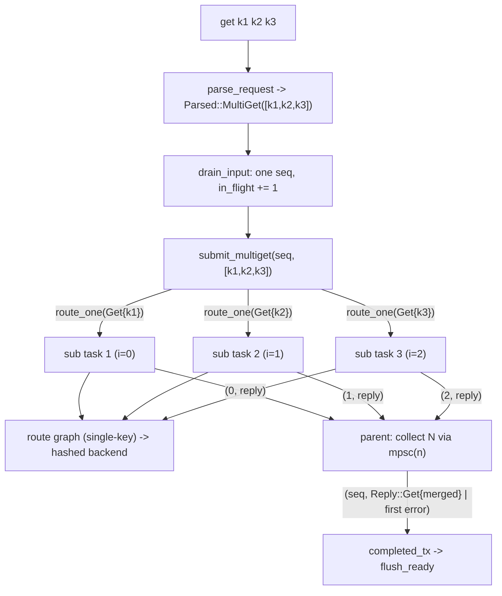

# rusty-mcrouter multiget (architecture)

> As-built — describes what the code does now.
> Future replacement: [`../design/stateful-parser.md`](../design/stateful-parser.md) + [`../design/request-frames.md`](../design/request-frames.md) replace `Parsed::MultiGet` with per-key parser events after the codec migration. This file remains authoritative until that implementation lands.
> Mirrors: [`../mcrouter/multiget.md`](../mcrouter/multiget.md) — the model we track (parser split + `MultiOpParent`)
> Designed in: [`../design/multiget.md`](../design/multiget.md) — the plan; this records what we actually built and where it diverged.
> Related: [`./hash-routing.md`](./hash-routing.md) — the routed `Get` is now single-key, so `PoolRoute` hashes the one key with no special-casing; and [`./backend-client.md`](./backend-client.md) — each sub-get pipelines onto a `DestinationRoute`'s `Client`.
> Citations are by file + symbol, relative to the repo root.

---

## tl;dr

- The **routed** `Request::Get` is **single-key by type** (`Get { key: Bytes }`,
  `rusty-mcrouter-protocol/src/request.rs`). No route handle below the connection
  can express a multi-key get — the invariant is compiler-enforced, not a
  convention.
- The wire's multi-key-ness lives only at the **parse boundary**, in a small
  result type `Parsed` (`request.rs`):

  ```rust
  pub enum Parsed {
      One(Request),          // common path incl. single-key get — no Vec
      MultiGet(Vec<Bytes>),  // only built when 2+ keys are present
  }
  ```

- `parse_request` returns `Result<Option<Parsed>>` (`parser/mod.rs`). `get.rs`
  special-cases arity: **1 key → `Parsed::One(Get { key })` (zero `Vec`)**, 2+ →
  `Parsed::MultiGet(keys)`, **0 keys → `ProtocolError::Malformed`**.
- The **connection** (`rusty-mcrouter/src/proxy/connection.rs`) turns a
  `Parsed::MultiGet` into **one output `seq`**, fans out **N single-key
  `route_one(Get { key })`** through the normal per-request path (so
  hashing/failover/thread-modes apply per key), and **reassembles** the N
  sub-replies into one `Reply::Get` (hits concatenated in request-key order) or
  the **first error seen** (completion order).
- `in_flight`/`seq`/`flush_ready` accounting is **unchanged**: a multiget is one
  output slot.
- `RouteError::EmptyGet` is **retired** and `routing_key` is now **infallible**
  (`routes/selection_route.rs`) — the single-key type makes an empty get
  unrepresentable below the parser.



---

## the shape: single-key routed request + a `Parsed` boundary

The routed request type is single-key, and the wire's multi-key get is the only
thing carried separately, only at the parse boundary
(`rusty-mcrouter-protocol/src/request.rs`):

```rust
pub enum Request {
    Get { key: Bytes },          // single-key — the whole point
    Set { key: Bytes, .. }, ..   // others already single-key
}

pub enum Parsed {
    One(Request),
    MultiGet(Vec<Bytes>),
}
```

`Parsed` lives in `request.rs` next to `Request` and is re-exported from the
crate root (`pub use crate::request::{Parsed, Request}`, `lib.rs`). The `Get`
serializer writes one key: `get <key>\r\n`.

### parser (`parser/get.rs`, `parser/mod.rs`)

`get::parse_request` reads the whole line and decides arity in one call (a `get`
is a single line — no streaming state):

```rust
let mut segments = rest.split(|&b| b == b' ').filter(|seg| !seg.is_empty());
let Some(first) = segments.next() else { return Err(Malformed("get requires at least one key")) };
validate_key(first)?;
let first = rest.slice_ref(first);
let Some(second) = segments.next() else {
    return Ok(Some(Parsed::One(Request::Get { key: first })));  // common path — no Vec
};
// 2+ keys: collect all into Parsed::MultiGet
```

The common single-key get allocates **no `Vec`**. `parse_request` (`mod.rs`)
returns the `get` arm directly and wraps every other command in `Parsed::One`:

```rust
b"get" => get::parse_request(buf, eol_idx),
b"set" => Ok(set::parse_request(buf, eol_idx, line_end)?.map(Parsed::One)),
// .. one .map(Parsed::One) per non-get command
```

Each per-command submodule parser is **unchanged** — it still returns
`Result<Option<Request>>`; only the top-level dispatch wraps. A **zero-key**
`get\r\n` / `get \r\n` is a `ProtocolError::Malformed` from the parser (see
*Divergences*: the design called this "CLIENT_ERROR"; the mechanism is the
existing protocol-error path, unchanged).

---

## where the split lives — co-located at the connection

mcrouter splits in the ASCII parser and reassembles at the session, bridged by a
`multiOpEnd` sentinel. rusty keeps the split and the reassembly **co-located at
the connection**:

- the parser only **classifies** (`One` vs `MultiGet`) — it does not fan out;
- the connection **fans out** and **reassembles** — it already owns the
  `seq`/reorder/`completed_tx` machinery the reassembly needs.

So grouping is never destroyed-then-rebuilt: it lives in one value (`MultiGet`)
and one layer (the connection). The protocol crate stays a pure, stateless
`bytes -> Parsed`.

---

## drain + dispatch (`connection.rs`)

```rust
fn drain_input(&mut self) -> Result<(), NetError> {
    while let Some(parsed) = parse_request(&mut self.buf)? {
        let seq = self.next_seq;
        self.next_seq = self.next_seq.wrapping_add(1);
        self.in_flight = self.in_flight.saturating_add(1);
        match parsed {
            Parsed::One(req)       => self.submit_single(seq, req),
            Parsed::MultiGet(keys) => self.submit_multiget(seq, keys),
        }
    }
    Ok(())
}
```

One frame → one `seq` → one `in_flight` increment, whether single or multiget.

### `route_target` + `route_one` — the reused per-request path

The old `submit` body split into two pieces shared by both paths. `route_target`
(a `&self` method) resolves the routing decision into an owned `RouteTarget`
{ `handle`, `same_thread`, `route: Rc<dyn DynRoute>` } that borrows nothing from
`&self`; the free `route_one(target, req)` function then performs the actual
route. Because `RouteTarget` is owned, the future a task spawns captures no `&self`
borrow and can be `spawn_local`'d freely:

```rust
fn route_target(&self, req: &Request) -> RouteTarget {
    let handle = self.proxies.choose(self.mode, self.current_id, req);
    let same_thread = handle.id() == self.current_id;
    RouteTarget { handle, same_thread, route: Rc::clone(&self.local_route) }
}

async fn route_one(target: RouteTarget, req: Request) -> Reply {
    let RouteTarget { handle, same_thread, route } = target;
    if same_thread {
        route.route_dyn(req).await
            .unwrap_or_else(|_| Reply::ServerError(Bytes::from_static(b"backend unavailable")))
    } else {
        handle.send_request(req).await
    }
}
```

`submit_single` computes one `route_target`, spawns `route_one(target, req)`, and
forwards `(seq, reply)` to `completed_tx` — the common path, no parent and no `Vec`.

### the multiget parent (`submit_multiget`)

One output `seq`, N internal sub-routes, dependency-free collection over an
internal `mpsc` (mirroring the existing `completed_tx` pattern; works on the
`!Send` `LocalSet`):

```rust
fn submit_multiget(&self, seq: usize, keys: Vec<Bytes>) {
    let n = keys.len();
    debug_assert!(n >= 2, "MultiGet carries >= 2 keys by parser invariant");
    let (sub_tx, mut sub_rx) = mpsc::channel::<(usize, Reply)>(n);

    for (i, key) in keys.into_iter().enumerate() {
        let req = Request::Get { key };                 // single-key by type
        let target = self.route_target(&req);
        let sub_tx = sub_tx.clone();
        tokio::task::spawn_local(async move {
            let reply = route_one(target, req).await;
            let _ = sub_tx.send((i, reply)).await;
        });
    }
    drop(sub_tx);

    let completed_tx = self.completed_tx.clone();
    tokio::task::spawn_local(async move {
        let mut slots: Vec<Option<Reply>> = (0..n).map(|_| None).collect();
        let mut first_error: Option<Reply> = None;
        while let Some((i, reply)) = sub_rx.recv().await {
            if let Reply::Get { .. } = &reply { slots[i] = Some(reply); }
            else { first_error.get_or_insert(reply); }  // first error by arrival wins
        }
        let merged = first_error.unwrap_or_else(|| merge_multiget(slots));
        let _ = completed_tx.send((seq, merged)).await;
    });
}
```

- The channel capacity is exactly `n`, and exactly `n` sends occur, so a sub-task
  never blocks on capacity; the parent's `recv` loop ends precisely when all `n`
  sub-`sub_tx` clones **and** the post-loop `drop(sub_tx)` are gone.
- Sub-routes run **concurrently** (each `spawn_local`'d), exploiting the backend
  `Client`'s pipelining; the parent waits for **all** N before replying
  (all-or-first-error — no partial flush).

### merge (`merge_multiget`)

```rust
fn merge_multiget(slots: Vec<Option<Reply>>) -> Reply {
    let mut hits = Vec::new();
    for slot in slots {
        match slot {
            Some(Reply::Get { hits: h }) => hits.extend(h),  // hit(s) or miss (empty)
            Some(other) => return other,                     // defensive (errors latched upstream)
            None => return Reply::ServerError(Bytes::from_static(b"multiget: lost subreply")),
        }
    }
    Reply::Get { hits }
}
```

- **Hits** concatenate in **request-key order** (`slots` indexed by position `i`),
  independent of completion order.
- **Misses** are `Reply::Get { hits: vec![] }` — absorbed.
- **First error** is whichever sub-route's error the parent saw first (latched in
  `first_error` before merge), matching `MultiOpParent`'s first-seen precedence.
- The `Some(other)` / `None` arms are **reply-drop safety**, not normal paths: the
  parent only ever stores `Reply::Get` into `slots`; a dropped sub-task leaves a
  `None` slot, which becomes a `ServerError` rather than a panic.

---

## accounting (unchanged)

`in_flight` counts **frames**, not keys: incremented once per parsed `Parsed` in
`drain_input`, decremented once per flushed `(seq, reply)` in `flush_ready`. A
multiget emits exactly one `(seq, merged)` to `completed_tx`, so the reorder
buffer (`pending: BTreeMap<seq, Reply>` keyed by `next_write`) and the
ordered writeback are untouched. A clean client close still drains an in-flight
multiget: `run` only returns once `input_closed && in_flight == 0`.

---

## how this maps to mcrouter (as-built)

| mcrouter | rusty |
|---|---|
| `McGetRequest` holds one key | `Request::Get { key: Bytes }` (single-key by type) |
| `McServerAsciiParser::consumeGetLike` emits per-key requests | `parse_request` returns `Parsed::One` / `Parsed::MultiGet`; connection fans out |
| `MultiOpParent` (block/end contexts) | the parent `spawn_local` task + internal `sub_rx` (`submit_multiget`) |
| each subreq routed independently | `route_one(target, Request::Get { key })` per key |
| per-subreq `VALUE`; parent suppresses sub-`END`, emits one `END` | `merge_multiget` folds `hits` into one `Reply::Get` (atomic `VALUE* + END`) |
| first non-FOUND/NOT_FOUND reply wins (first-seen) | parent latches first non-`Get` sub-reply by arrival; `merge_multiget` concatenates hits |
| reorder by request id in `McServerSession` | existing `pending`/`next_write` reorder buffer (unchanged) |
| split is ASCII-only | rusty is ASCII-only; same |

---

## divergences from the design

The design ([`../design/multiget.md`](../design/multiget.md)) is faithful overall;
these are the deliberate or forced differences:

1. **`routing_key` is now fully infallible.** The design said only "retire
   `RouteError::EmptyGet`". As-built, `routing_key(&Request) -> &[u8]` has **no
   `Result` at all** — every arm (including `Request::Get { key }`) yields a key,
   so `SelectionRoute::route` dropped its `?`. The `EmptyGet` variant, the
   empty-get branch, and the `routing_key_empty_get_is_error` test are gone.
2. **Zero-key get is a `ProtocolError::Malformed`, not a `CLIENT_ERROR` reply.**
   The design framed `get\r\n` as "a `CLIENT_ERROR` from `parse_request`". The
   mechanism as-built is the **pre-existing** protocol-error path: `get.rs`
   returns `Malformed("get requires at least one key")` (or `"missing arguments"`
   for a bare `get`), which `drain_input` propagates via `?`. Connection-level
   rendering of a malformed frame into a `CLIENT_ERROR\r\n` reply line was out of
   scope and **unchanged** — a malformed frame still ends the connection, as it
   did before. `Parsed` has no zero-key case, as designed.
3. **`Parsed` lives in `request.rs`**, not a dedicated module, and is re-exported
   from `lib.rs`.
4. **Wrapping is centralized in the dispatch.** Per-command submodule parsers keep
   returning `Result<Option<Request>>`; `parser/mod.rs` wraps non-`get` results
   with `.map(Parsed::One)`. Only `get.rs` returns `Parsed` directly. (The design
   sketched `parse_request` returning `Parsed`; this keeps the submodules
   untouched.)
5. **`debug_assert!(n >= 2)`** guards `submit_multiget`'s `mpsc::channel(n)`,
   documenting the parser invariant (an Oracle-review suggestion; `n` is always
   ≥ 2 for a `MultiGet`).
6. **Tests don't use a `net::testing` counting backend.** The design referenced a
   `counting_mock_backend` "in `pool_route.rs`" that never existed. As-built, the
   connection tests use an in-process recording `MockRoute` (fan-out / order /
   miss / error / duplicate / accounting) plus an **inline `keyed_echo_backend`**
   for the real two-backend spanning test — no new crate dependency.
7. **The spanning test drives `PoolRoute(Ch3)` through `build_route`, not
   `PoolRoute::new`.** `Ch3` and the `Selector` trait are `pub(crate)` in
   `rusty-mcrouter-core`, so the bin crate cannot name them. The test builds the
   real route from a `"PoolRoute|P"` config over two servers via the public
   `build_route(&ConfigDocument)` (Ch3 is the default hash) — the same path the
   binary uses in production.

---

## testing

**Parser** (`parser/get.rs`, `parser/mod.rs`): single-key `get` →
`Parsed::One(Get { key })` (no `Vec`); 2+ keys → `Parsed::MultiGet`; zero keys and
invalid/oversized keys → the expected `ProtocolError`s; every other command wraps
to `Parsed::One`.

**Merge** (`connection.rs`, pure unit tests): hits concatenate in request-key
order; misses absorbed; all-miss → empty `Get`; a lost (`None`) sub-reply →
`ServerError` (not a panic); a non-`Get` slot passes through (defensive).

**Connection end-to-end** (`connection.rs`, via a recording `MockRoute` driven over
a real `TcpStream` pair on a `LocalSet`):

- `get k1 k2` returns both hits in request-key order **and** the route received
  each key as a separate single-key get (fan-out / spanning at the connection).
- order preserved when the first key's sub-route is **slow** (out-of-order
  completion).
- mixed hit/miss → only the hits + one `END`; all-miss → just `END`.
- a key's backend error → that error replaces the whole reply (first-error-wins);
  a separate fast-error + slow-error case asserts the **first error by arrival**
  wins, deterministically.
- duplicate keys (`get dup dup`) → two `VALUE`s (no dedupe), and the route records
  the key twice.
- single-key `get` takes the common (`submit_single`) path → one `VALUE`, and the
  route is asked for exactly that one key.
- a multiget (with a slow key) and a following single get flush back in request
  order, proving the trailing single waits behind the multiget in the reorder
  buffer (a multiget occupies exactly one `seq` slot).

**Real backends** (`connection.rs`): `multiget_spans_two_real_backends_in_request_order`
builds a real `PoolRoute(Ch3)` over two inline `keyed_echo_backend`s — via
`build_route` on a `"PoolRoute|P"` config (see divergence 7) — and asserts a
ten-key multiget returns all hits in request-key order while the keys are split
across both backends (each backend serves ≥1; none lost or duplicated). It runs on
a `multi_thread` runtime so the real backend-`Client` driver tasks and the `!Send`
connection (driven on a `LocalSet`) make progress together. The Docker integration
test `get_multi_key_returns_only_hits` (`tests/integration.rs`, `#[ignore]`) also
exercises the split through the full router, but only over a **single-server**
pool — it covers miss absorption end-to-end, not cross-backend spanning.

---

## known gaps / deferred (confirmed by the Oracle review)

These are operational bounds, **not** correctness bugs (the merge/ordering/
accounting are correct):

- **No per-request/backend timeout.** The parent waits for **all** siblings, so a
  single hung sub-route stalls the whole multiget reply. Tracked with the
  backend-client/threading work.
- **Unbounded N.** `get k1 … kN` spawns N tasks + an N-slot channel; bounded today
  only by the request-line length. A cap pairs naturally with connection
  backpressure later.
- **Orphaned sub-tasks on abrupt disconnect.** If the `Connection` is dropped mid-
  multiget, its N+1 detached tasks run to completion (finishing now-pointless
  backend round-trips, holding `Rc<route>`); the parent's `completed_tx.send`
  no-ops. This is the existing single-request orphaning multiplied by N+1 — **not
  a leak**, but it occupies backend FIFO slots until those round-trips drain.
  Structured cancellation is the eventual fix (more machinery than the first cut
  needs).

---

## source map

| concept | symbol | file |
|---|---|---|
| single-key routed request | `Request::Get { key }` | `rusty-mcrouter-protocol/src/request.rs` |
| parse-boundary multi-key type | `Parsed` | `rusty-mcrouter-protocol/src/request.rs` |
| parser dispatch | `parse_request` | `rusty-mcrouter-protocol/src/parser/mod.rs` |
| get arity split | `get::parse_request` | `rusty-mcrouter-protocol/src/parser/get.rs` |
| drain + dispatch | `drain_input` | `rusty-mcrouter/src/proxy/connection.rs` |
| per-request routing | `route_target`, `route_one`, `submit_single` | `rusty-mcrouter/src/proxy/connection.rs` |
| multiget parent (fan-out + collect) | `submit_multiget` | `rusty-mcrouter/src/proxy/connection.rs` |
| reply reassembly | `merge_multiget` | `rusty-mcrouter/src/proxy/connection.rs` |
| ordered writeback | `flush_ready` | `rusty-mcrouter/src/proxy/connection.rs` |
| single-key routing key (infallible) | `routing_key` | `rusty-mcrouter-core/src/routes/selection_route.rs` |
| multiget tests (merge units + `MockRoute` e2e + real-backend spanning) | `mod tests` (`MockRoute`, `keyed_echo_backend`) | `rusty-mcrouter/src/proxy/connection.rs` |
