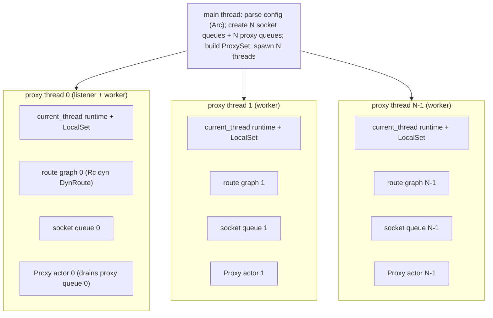
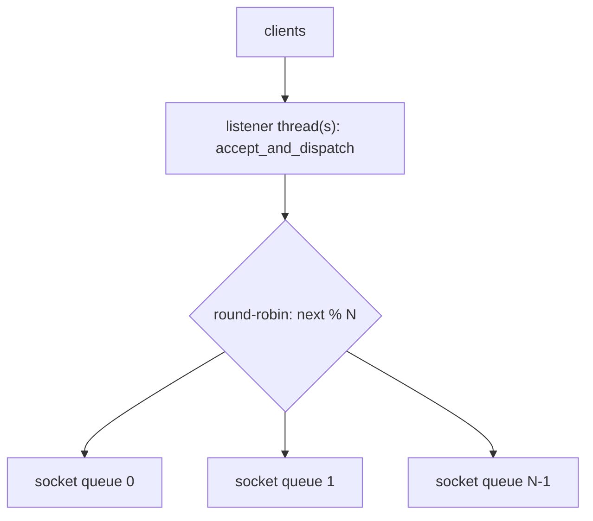
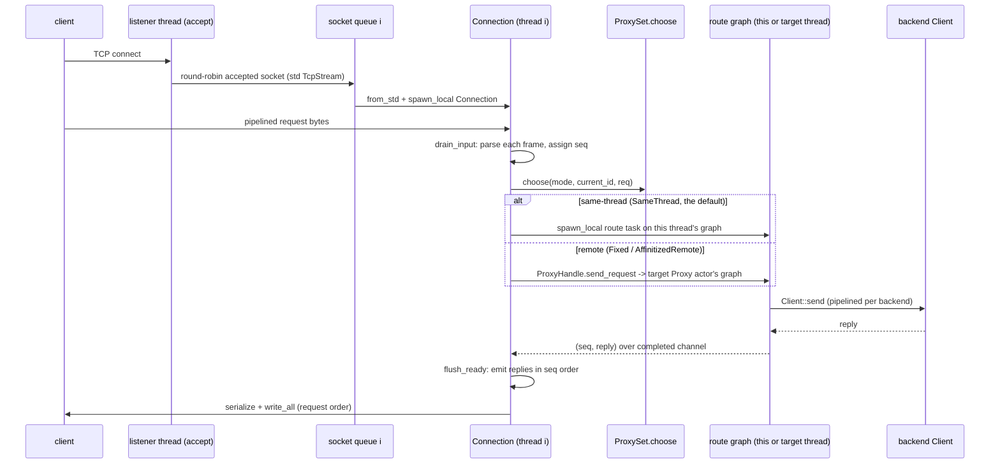

# rusty-mcrouter threading model (architecture)

> Historical MVP snapshot. The current tree consolidates per-proxy work under
> `ProxyRuntime`, owns OS-thread lifecycle through `ProxyThread`, and hosts
> observability under `ControlRuntime`/`ControlThread`. See
> [`../../architecture/README.md`](../../architecture/README.md) for the current
> ownership and shutdown model. The `Proxy` actor, `ConnectionWorker`, combined
> proxy message queue and "no graceful shutdown" statements below are retained
> only as implementation history.

how threading works in the current tree: `N` proxy OS threads, each a
single-threaded Tokio runtime with its own route graph, fed by round-robined
accepted sockets. Each connection parses pipelined requests, dispatches each one
through a `ProxySet` as its own route task, and writes the replies back **in
request order**. A per-proxy message queue + `Proxy` actor lets one thread route
on behalf of another, selected by `ThreadMode` — though `main` currently wires
`SameThread`, so today every request routes inline on its own connection thread.

> As-built — describes what the code does now.
> Mirrors [`../mcrouter/threading-model.md`](../mcrouter/threading-model.md) (the
> model we track).
> Remaining deltas (config-driven thread modes, request-hash affinity, graceful
> shutdown): [`../design/threading-model.md`](../design/threading-model.md).
> Sibling: [`./backend-client.md`](./backend-client.md) — the backend client the
> route graph calls into.
> Citations are by file + symbol, relative to the repo root.

---

## tl;dr

- `main` spawns **`num_proxies` OS threads**, each running its own Tokio
  **current-thread runtime + `LocalSet`** and building its **own route graph**
  (`Rc<dyn DynRoute>`). It also creates **one socket queue and one proxy message
  queue per thread**, and a **`ProxySet`** of `ProxyHandle`s.
- The first **`num_listening_sockets`** threads also listen (`M = 1`: one plain
  listener; `M > 1`: `SO_REUSEPORT` listeners). Accepted sockets are
  **round-robined** across the socket queues.
- Each thread drains its socket queue and spawns a **`Connection`** task per
  socket. A `Connection` parses pipelined requests and **submits each as its own
  route task** (`spawn_local`), then writes the replies back **in request
  order** — so a single connection's pipelined requests are routed concurrently,
  not serially.
- **`ProxySet` + `ThreadMode` decide where each request routes.** `SameThread`
  routes inline on the connection thread; `FixedRemote` / `AffinitizedRemote`
  hand the request to a **peer thread's `Proxy` actor** over its message queue.
- **Today `main` hardwires `ThreadMode::SameThread`.** The proxy actor, message
  queues, and remote modes are all built and spawned, but no request crosses a
  thread under the default config — the cross-thread path is reachable but
  dormant. That, plus graceful shutdown, is the gap the
  [design doc](../design/threading-model.md) closes.

---

## topology

`main` (`rusty-mcrouter/src/main.rs`) is a plain synchronous `fn` that parses the
config into an `Arc<ConfigDocument>`, creates one socket queue per proxy
(`mpsc::channel::<std::net::TcpStream>`, `WORK_CHANNEL_CAPACITY = 1024`) and one
proxy message queue per proxy (`mpsc::channel::<ProxyMessage>`,
`PROXY_CHANNEL_CAPACITY = 1024`), builds a `ProxySet` from one `ProxyHandle` per
proxy queue, and spawns the proxy threads:



Each thread (`proxy::proxy_thread_main`) builds a current-thread runtime
(`enable_io` + `enable_time`), a `LocalSet`, and **its own route graph** via
`build_route(&config).await` — so the `Rc<dyn DynRoute>` is thread-local and
never shared across threads. The config is shared read-only as an `Arc`.

One consequence worth stating — and it's **deliberate**, mirroring mcrouter's
shared-nothing model: because every thread builds its own graph, every thread
opens **its own backend connections**. With `N` proxy threads a backend sees `N`
`Client`s (and `N` TCP connections) — one per thread. That's the design, not an
accident: each proxy thread owns its destination connections, so connection
state, queues, and stats are touched by a single thread and need no locks —
mcrouter relies on the same property (see
[`../mcrouter/backend-client.md`](../mcrouter/backend-client.md), where "one
client = one connection = one backend… runs on the proxy thread"). It holds for
cross-thread routing too: a request handed to proxy `k`'s actor routes on
**thread `k`'s** graph, over thread `k`'s backend connections.

## startup

Threads are spawned **sequentially with a readiness handshake**
(`std::sync::mpsc::sync_channel`): `main` starts a thread, then blocks on
`ready_rx.recv()` until that thread reports either its bound address or a startup
error, before starting the next. Each thread moves a `ProxyThreadConfig` across
the spawn boundary (carrying its `proxy_id`, the shared config `Arc`, its
`work_rx`, its `proxy_rx`, a `ProxySet` clone, the `thread_mode`, and an optional
`ListenerConfig`) and unpacks it on arrival. Only listener threads report an
address; the first one becomes the `READY <addr>` line printed on stdout
(integration tests parse this).

`main` also installs a global panic hook that does `process::exit(1)`. That means
**a panic on any proxy thread tears down the whole process** — fail-fast, but
also no isolation between connections.

## accept and socket dispatch

Listening is decided by `num_listening_sockets` (`M`, default `1`,
`<= num_proxies`):

- `M = 1` — one plain `Server::bind` on proxy 0.
- `M > 1` — `Server::bind_reuseport` on proxies `0..M-1`; the kernel load-balances
  accepts across them via `SO_REUSEPORT` (`use_reuseport = M > 1`).

A listener thread runs `Server::accept_and_dispatch`
(`rusty-mcrouter-net/src/server.rs`), which round-robins every accepted socket
across **all** socket queues:



The handoff converts the Tokio stream to a `std::net::TcpStream`
(`tokio_stream.into_std()`) before sending it down the `mpsc`, because a stream
can't be moved between runtimes while registered. The receiving worker
re-registers it on its own runtime with `TcpStream::from_std`.

A listener thread is also a worker: `proxy_thread_main` runs
`accept_and_dispatch` and `ConnectionWorker::run` concurrently under
`tokio::select!`, so proxy 0 both accepts and serves.

## serving a connection (per-request dispatch + ordered writeback)

`ConnectionWorker` (`rusty-mcrouter/src/proxy/worker.rs`) drains the thread's
socket queue and spawns one `Connection` task per socket onto the `LocalSet`:

```rust
// rusty-mcrouter/src/proxy/worker.rs
while let Some(std_stream) = self.work_rx.recv().await {
    let tokio_stream = tokio::net::TcpStream::from_std(std_stream)?; // re-register
    let connection = Connection::new(
        tokio_stream, self.current_id, Rc::clone(&self.local_route),
        self.proxies.clone(), self.mode,
    );
    tokio::task::spawn_local(async move { connection.run().await });
}
```

`Connection::run` (`rusty-mcrouter/src/proxy/connection.rs`) is the per-connection
event loop. Unlike the old inline path, it **submits each parsed request as its
own task and writes replies back in request order**, so a pipelining client's
requests are routed concurrently:

```rust
// rusty-mcrouter/src/proxy/connection.rs
pub async fn run(mut self) -> Result<(), NetError> {
    loop {
        if !self.input_closed { self.drain_input()?; } // parse + submit all buffered frames
        self.flush_ready().await?;                      // write replies in request order
        if self.input_closed && self.in_flight == 0 { return Ok(()); }
        tokio::select! {
            read = self.reader.read_buf(&mut self.buf), if !self.input_closed => {
                if read? == 0 { self.input_closed = true; }
            }
            maybe = self.completed_rx.recv(), if self.in_flight > 0 => {
                match maybe {
                    Some((seq, reply)) => { self.pending.insert(seq, reply); }
                    None => return Ok(()),
                }
            }
        }
    }
}
```

`drain_input` parses every complete frame already buffered, stamps each with an
increasing `seq`, and submits it without awaiting the reply (pipelining).
`submit` is where routing is **chosen and dispatched**:

```rust
fn submit(&self, seq: usize, req: Request) {
    let handle = self.proxies.choose(self.mode, self.current_id, &req);
    let same_thread = handle.id() == self.current_id;
    let route = Rc::clone(&self.local_route);
    let completed_tx = self.completed_tx.clone();
    tokio::task::spawn_local(async move {
        let reply = if same_thread {
            route_or_error(&route, req).await   // route on THIS thread's graph
        } else {
            handle.send_request(req).await       // hand to the target Proxy actor
        };
        let _ = completed_tx.send((seq, reply)).await;
    });
}
```

Every completed route task — inline or remote — sends `(seq, reply)` back through
one `completed` channel. `flush_ready` reassembles request order with a
`BTreeMap<seq, Reply>` keyed by `next_write`, writing contiguous replies and
stopping at the first gap:

```rust
async fn flush_ready(&mut self) -> Result<(), NetError> {
    while let Some(reply) = self.pending.remove(&self.next_write) {
        let mut out = BytesMut::new();
        reply.serialize_into(&mut out);
        self.writer.write_all(&out).await?;
        self.next_write = self.next_write.wrapping_add(1);
        self.in_flight = self.in_flight.saturating_sub(1);
    }
    Ok(())
}
```

This gives concurrency in both directions:

- **Across connections: concurrent.** Many `Connection` tasks run cooperatively
  on one thread, so while one awaits a backend the others make progress. Their
  backend calls also pipeline, because `Client` is a shared pipelining handle
  (see [`./backend-client.md`](./backend-client.md)).
- **Within one connection: also concurrent.** A client that pipelines many
  requests has each one routed as a separate task; replies are buffered by `seq`
  and emitted in request order. This is the in-connection head-of-line block the
  old inline path had — now removed.

## cross-thread routing and thread modes

`ProxySet::choose` (`rusty-mcrouter/src/proxy/proxy_set.rs`) maps a `ThreadMode`
to a target `ProxyHandle`:

```rust
pub fn choose(&self, mode: ThreadMode, current_id: usize, _req: &Request) -> ProxyHandle {
    let idx = match mode {
        ThreadMode::SameThread => current_id,
        ThreadMode::FixedRemote { proxy_id } => proxy_id % self.proxies.len(),
        ThreadMode::AffinitizedRemote => current_id, // todo: hash on the request
    };
    self.proxies[idx].clone()
}
```

- **`SameThread`** picks the connection's own thread, so `submit` takes the inline
  branch and routes on the local graph — no message ever leaves the thread.
- **`FixedRemote` / `AffinitizedRemote`** pick a (possibly different) thread.
  When the chosen handle's `id()` differs from `current_id`, `submit` calls
  `ProxyHandle::send_request`, which puts a `ProxyMessage::Request` on the target
  thread's queue and awaits the reply over a `oneshot`:


The receiving `Proxy` actor (`rusty-mcrouter/src/proxy/proxy.rs`) is a mailbox
loop that spawns a route task per request on its own thread:

```rust
pub async fn run(mut self) {
    while let Some(msg) = self.rx.recv().await {
        match msg {
            ProxyMessage::Request(req) => Self::spawn_request(Rc::clone(&self.route), req),
            ProxyMessage::Shutdown => break,
        }
    }
}
```

This is the structural mirror of the backend client: `ProxyHandle` is to `Proxy`
what `Client` is to `ClientConnection` (see
[`./backend-client.md`](./backend-client.md)).

**What's wired vs. active.** `main` builds every `ProxyThreadConfig` with
`thread_mode: ThreadMode::SameThread`, so at runtime today `choose` always
returns the connection's own thread, `submit` always takes the inline branch, and
**every `Proxy` actor sits idle** — spawned, draining an empty queue. The remote
modes (`FixedRemote`, `AffinitizedRemote`), the `Proxy` actors, and the per-proxy
message queues are all in place and reachable; selecting them from config is the
remaining wiring.

## request lifecycle (current)



## what isn't here yet

These are the deltas to the [design](../design/threading-model.md):

- **Thread modes aren't config-driven.** `main` hardwires `ThreadMode::SameThread`;
  `FixedRemote` / `AffinitizedRemote` can't be selected yet, so cross-thread
  routing never fires under the default build.
- **`AffinitizedRemote` doesn't hash.** It falls back to `current_id` (`// todo`),
  so even if selected it wouldn't give per-request affinity.
- **No graceful shutdown.** `ProxyMessage::Shutdown` and `ProxyHandle::shutdown`
  exist but nothing sends them; `main` just `join`s the threads, and a panic
  anywhere still exits the process — no per-connection isolation.

The outer topology (N current-thread runtimes + `LocalSet`, per-thread route
graph, per-request route tasks with ordered writes, and the actor/queue
plumbing) is in place, so these changes are wiring and policy rather than a
rewrite.

## source map

| Concept | Symbol | File |
|---|---|---|
| Spawn threads, socket + proxy queues, `ProxySet`, startup handshake | `main` | `rusty-mcrouter/src/main.rs` |
| Per-thread runtime + LocalSet + route graph; spawn `Proxy` + `ConnectionWorker` | `proxy_thread_main` | `rusty-mcrouter/src/proxy/thread.rs` |
| Thread config moved across the spawn boundary | `ProxyThreadConfig`, `ListenerConfig`, `ThreadMode` | `rusty-mcrouter/src/proxy/config.rs` |
| Listener bind (plain / reuseport) | `Server::bind`, `Server::bind_reuseport` | `rusty-mcrouter-net/src/server.rs` |
| Accept + round-robin dispatch | `Server::accept_and_dispatch` | `rusty-mcrouter-net/src/server.rs` |
| Drain socket queue, spawn per connection | `ConnectionWorker::run` | `rusty-mcrouter/src/proxy/worker.rs` |
| Parse + per-request dispatch + ordered write | `Connection::{run, drain_input, submit, flush_ready}` | `rusty-mcrouter/src/proxy/connection.rs` |
| Thread-mode routing target selection | `ProxySet::choose` | `rusty-mcrouter/src/proxy/proxy_set.rs` |
| Cross-thread request handle | `ProxyHandle::{send_request, id}` | `rusty-mcrouter/src/proxy/handle.rs` |
| Per-thread routing actor (mailbox) | `Proxy::run` | `rusty-mcrouter/src/proxy/proxy.rs` |
| Cross-thread message type | `ProxyMessage`, `ProxyRequest` | `rusty-mcrouter/src/proxy/message.rs` |
| Route graph construction | `build_route` | `rusty-mcrouter-core/src/route_builder.rs` |
