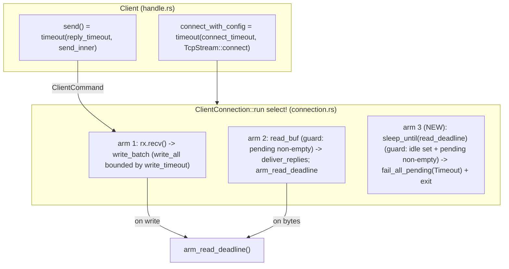

# rusty-mcrouter client timeouts (architecture)

how the backend client bounds its waits today: a per-request reply timeout at the
handle, connect/write timeouts in the actor, and a connection-level read-idle
deadline that reclaims a silently dead socket — each producing a classified
`NetError::Timeout { phase }`. This is the as-built description of the current tree.

> As-built — describes what the code does now, not a plan.
> Mirrors: [`../mcrouter/timeouts.md`](../mcrouter/timeouts.md) — the model we track (reply timeout via `sendSync`+`Baton`, `ConnectionOptions` connect/write, `timedOutInitializers_`, TKO).
> Designed in: [`../design/timeouts.md`](../design/timeouts.md) — the plan; this records what we built and where it diverged.
> Related: [`./backend-client.md`](./backend-client.md) — the `Client` handle + `ClientConnection` actor these deadlines arm (this struck its #1 "No timeouts" gap).
> Citations are by file + symbol, relative to the repo root.

---

## tl;dr

- **Four deadlines, three of them new actor/handle state, all configured by
  `ClientConfig`** (`rusty-mcrouter-net/src/client/config.rs`): `connect_timeout`,
  `write_timeout`, `reply_timeout`, `read_idle_timeout` — each `Option<Duration>`,
  defaulting to `Some` (1000ms / 1000ms / 1000ms / 2000ms), `None` = disabled.
- **Reply timeout is enforced at the handle, not the actor.** `Client::send` wraps
  `send_inner` in `tokio::time::timeout(reply_timeout, ..)`
  (`rusty-mcrouter-net/src/client/handle.rs`); on elapse it returns
  `Err(NetError::Timeout { phase: Reply })`. No per-request actor state.
- **The ASCII-FIFO alignment problem needs zero machinery.** A handle-side timeout
  drops the `oneshot::Receiver`; the matching `Sender` stays in the actor's
  `pending` deque as a **self-cleaning tombstone**. The late wire reply is still
  popped FIFO and `tx.send` to a dropped receiver is a no-op (`deliver_replies`,
  `rusty-mcrouter-net/src/client/connection.rs`). mcrouter's `timedOutInitializers_`
  degenerates to "do nothing" because our `parse_reply` is stateless.
- **One new actor arm reclaims a dead connection.** A third `select!` arm —
  `sleep_until(read_deadline)`, guarded by `read_idle_timeout.is_some() &&
  !pending.is_empty()`, reset on every write and every read via
  `arm_read_deadline` — fires on silence, `fail_all_pending(Timeout { Reply })`,
  and exits.
- **Connect and write timeouts wrap the existing I/O.**
  `connect_with_config` wraps `TcpStream::connect` (→ `Timeout { Connect }`);
  `write_batch` wraps its `write_all` (→ `Timeout { Write }`, flowing through the
  existing `fail_all_pending` + exit path).
- **One phased error, surfaced as a transport `Err`.** `NetError::Timeout { phase:
  TimeoutPhase }`, `phase ∈ {Connect, Write, Reply}` (`rusty-mcrouter-net/src/lib.rs`).
  It rides the existing `RouteError::Backend(#[from] NetError)` and, unrecovered,
  becomes `Reply::ServerError(..)` at the proxy boundary — the seam a future
  `FailoverRoute` classifies.
- **Two Cargo changes, not one** (design said one): `"time"` on the net crate's
  prod tokio features **and** `"test-util"` on its dev features (needed by
  `#[tokio::test(start_paused = true)]`; not part of `"full"`).



---

## the error: one phased transport variant

`TimeoutPhase` and the `Timeout` variant live next to `NetError`
(`rusty-mcrouter-net/src/lib.rs`); the hand-written `Clone` (which `fail_all_pending`
relies on) gained one trivial arm since `TimeoutPhase` is `Copy`:

```rust
#[derive(Clone, Copy, Debug, PartialEq, Eq)]
pub enum TimeoutPhase { Connect, Write, Reply }

pub enum NetError {
    // ... Io, Protocol, NoAddresses, WorkerClosed, ClientClosed ...
    #[error("{phase:?} timed out")]
    Timeout { phase: TimeoutPhase },
}

impl Clone for NetError {
    fn clone(&self) -> Self {
        match self {
            // ... existing arms ...
            NetError::Timeout { phase } => NetError::Timeout { phase: *phase },
        }
    }
}
```

The phase carries the operational meaning (Connect = unreachable, Write = stuck,
Reply = slow) and the future TKO severity input (Connect → hard, Reply → soft), so
the distinction is additive — no error-type refactor when TKO lands.

---

## 1. reply timeout — at the handle (`handle.rs`)

`Client` gained a `reply_timeout: Option<Duration>`, copied from config at connect
time. `send` wraps the (unchanged) body, now `send_inner`:

```rust
pub async fn send(&self, request: Request) -> Result<Reply> {
    match self.reply_timeout {
        Some(dur) => match tokio::time::timeout(dur, self.send_inner(request)).await {
            Ok(result) => result,
            Err(_elapsed) => Err(NetError::Timeout { phase: TimeoutPhase::Reply }),
        },
        None => self.send_inner(request).await,
    }
}
```

Wrapping the whole body folds queue-wait + write + reply-wait into one budget
(divergence from mcrouter, which arms at `writeSuccess`; documented in the design).
The elapse drops the inner future → drops `reply_rx` → see the tombstone below.

## 2. FIFO alignment — the self-cleaning tombstone (`connection.rs`)

Nothing in the actor changed for the reply timeout. When `reply_rx` is dropped, its
`Sender` stays in `pending`. The late reply is delivered and discarded in order:

```rust
fn deliver_replies(&mut self) -> Result<()> {
    while let Some(reply) = parse_reply(&mut self.read_buf)? {
        match self.pending.pop_front() {
            Some(tx) => { let _ = tx.send(Ok(reply)); }  // dropped rx -> no-op
            None => return Err(NetError::Protocol(/* unexpected reply */)),
        }
    }
    Ok(())
}
```

One wire reply consumes exactly one `pending` slot regardless of what its waiter
expected. The as-built `parse_reply(&mut BytesMut)` is stateless. The proposed
stateful codec preserves the same tombstone invariant by keeping decoder state
bound to `pending.front()` until a complete reply resets the decoder to `Idle`;
only then does the actor pop the sender. See
[`../design/stateful-parser.md`](../design/stateful-parser.md#reply-timeout-tombstone-under-a-stateful-decoder).
Neither shape needs mcrouter's request-type `timedOutInitializers_` machinery.

## 3. read-idle deadline — the third `select!` arm (`connection.rs`)

`ClientConnection` gained `read_idle_timeout: Option<Duration>` and a tracked
`read_deadline: tokio::time::Instant`. `arm_read_deadline` resets the deadline on
every completed write (`write_batch`) and every read of bytes (read arm):

```rust
fn arm_read_deadline(&mut self) {
    if let Some(dur) = self.read_idle_timeout {
        self.read_deadline = Instant::now() + dur;
    }
}
```

The new arm fires only while work is outstanding:

```rust
_ = sleep_until(self.read_deadline),
    if self.read_idle_timeout.is_some() && !self.pending.is_empty() =>
{
    self.fail_all_pending(NetError::Timeout { phase: TimeoutPhase::Reply });
    return;   // actor exits; later sends fail fast as ClientClosed
}
```

This is a **connection**-level deadline (not per-request): it reclaims the
dead-backend case the caller-side reply timeout can't, because a silent backend
never sends the late replies that would drain the orphaned tombstones. The default
`read_idle_timeout (2000ms) >= reply_timeout (1000ms)`, so a live caller sees its
own `Timeout { Reply }` before the connection is torn down under it.

## 4. connect & write timeouts (`handle.rs`, `connection.rs`)

`connect_with_config` wraps the bare connect; a stalled connect returns
`Timeout { Connect }`, an inner error stays `Io`, `None` keeps the bare connect:

```rust
let stream = match cfg.connect_timeout {
    Some(dur) => match tokio::time::timeout(dur, TcpStream::connect(addr)).await {
        Ok(Ok(stream)) => stream,
        Ok(Err(e))     => return Err(NetError::Io(e)),
        Err(_elapsed)  => return Err(NetError::Timeout { phase: TimeoutPhase::Connect }),
    },
    None => TcpStream::connect(addr).await?,
};
```

`write_batch` wraps its `write_all`; a stuck write trips `Timeout { Write }` and
flows through the **existing** `if let Err(err) = self.write_batch(cmd).await {
self.fail_all_pending(err); return; }` path — no new control flow:

```rust
let write = self.writer.write_all(&self.write_buf);
match write_timeout {
    Some(dur) => {
        tokio::time::timeout(dur, write).await
            .map_err(|_| NetError::Timeout { phase: TimeoutPhase::Write })??
    }
    None => write.await?,
}
self.arm_read_deadline();
```

The default `ClientFactory` connects via `Client::connect` (default config), so
the new `connect_timeout` default also makes `build_route`'s eager connect fail
fast instead of blocking on the OS default.

---

## the failover seam (what this unblocks)

The error flows with **zero new plumbing**:
`NetError::Timeout` → `RouteError::Backend` via the existing `#[from]`
(`rusty-mcrouter-core/src/routes/mod.rs`) → `DestinationRoute::route`'s `map_err`
(`rusty-mcrouter-core/src/routes/destination_route.rs`) → unrecovered at the proxy
boundary becomes `Reply::ServerError(..)` (`Proxy::spawn_request`,
`rusty-mcrouter/src/proxy/proxy.rs`; `route_one`,
`rusty-mcrouter/src/proxy/connection.rs`). Both ends are locked by tests (below). A
future `FailoverRoute` matches every `Timeout { phase }` identically.

---

## how it maps to mcrouter (as-built)

| mcrouter | rusty (as-built) |
|---|---|
| `sendSync(req, timeout)` + `Baton::TimeoutHandler` | `tokio::time::timeout(reply_timeout, send_inner)` in `Client::send` |
| deadline armed post-write only | one combined budget over enqueue+write+reply (documented divergence) |
| `timedOutInitializers_` (ASCII alignment) | **nothing** — as-built stateless `parse_reply` + dropped-receiver tombstone; future stateful decoder remains FIFO-front-bound |
| `carbon::Result::TIMEOUT` | `Err(NetError::Timeout { phase: Reply })` |
| `carbon::Result::CONNECT_TIMEOUT` | `Err(NetError::Timeout { phase: Connect })` |
| write timeout → `processShutdown` (`REMOTE_ERROR`) | `Timeout { Write }` → existing `fail_all_pending` + exit |
| `ConnectionOptions.connectTimeout` | `timeout` around `TcpStream::connect` |
| `ConnectionOptions.writeTimeout` (`setSendTimeout`) | `timeout` around `write_batch`'s `write_all` |
| (no per-connection idle timer; TKO probes dead hosts) | **read-idle deadline** — 3rd `select!` arm reclaims a silent connection |
| `server_timeout_ms` default 1000 / `0` = infinite | `reply_timeout` default `Some(1000ms)` / `None` = disabled |
| `isFailoverErrorResult` incl. `TIMEOUT`/`CONNECT_TIMEOUT` | future `is_failover_error` matches every `Timeout { phase }` |

---

## divergences from the design

The design ([`../design/timeouts.md`](../design/timeouts.md)) is faithful overall;
these are the deliberate or forced differences, most discovered while making the
tests deterministic:

1. **Two Cargo changes, not one.** The design called for a single prod change
   (`"time"` on the net crate). As-built also needs **`"test-util"` on the net
   crate's dev tokio features**: `#[tokio::test(start_paused = true)]` requires it
   and it is **not** included in tokio's `"full"`. Prod features are unchanged
   beyond `"time"`.
2. **The FIFO/tombstone test cannot use a shared `reply_timeout` under paused
   time.** This is the load-bearing correctness test, and the most important
   divergence. Under `#[tokio::test(start_paused = true)]`, the runtime
   auto-advances the clock whenever it idles, and **a pending deadline always beats
   real loopback I/O** — so any request that must *succeed* over a real socket
   cannot own a timer (the shared-`reply_timeout` shape failed deterministically,
   30/30). As-built, the alignment test runs the surviving requests with
   `reply_timeout = None` (timer-free, so their replies deliver via the blocking
   reactor) and orphans the timed-out request with an **explicit outer
   `tokio::time::timeout`**, which drops the receiver through the *identical* path
   the internal reply timeout uses. The actor-side tombstone alignment is therefore
   tested faithfully; only the trigger differs.
3. **Sequential A/B/C, not a pipelined "time out the middle".** The design sketched
   pipelining A, B, C and timing out B. With a single shared reply budget and FIFO
   wire replies you cannot time out only the middle of a pipelined batch. As-built:
   A is sent and answered (succeeds); B is sent and its reply withheld while the
   backend blocks reading for C (B times out); C is sent, unblocking the backend,
   which writes B's *late* reply (discarded via the orphaned slot) then C's reply.
   This still proves A and C get their own correct replies and B was discarded in
   FIFO order.
4. **`Step::Hang` added to the scripted-TCP harness** (`rusty-mcrouter-net/src/testing.rs`).
   The design assumed a "read N, reply 0" knob; the harness closes the socket at
   end-of-script, so an explicit hold-open step (`std::future::pending().await`)
   was needed to keep a backend silent-but-connected for the reply/write/idle tests.
5. **Proxy-boundary test exercises `Proxy::spawn_request`, not `route_one`.** Both
   map a `RouteError` to `Reply::ServerError` identically, but `route_one`
   (`connection.rs`) is private and needs a `RouteTarget`/`ProxyHandle`;
   `spawn_request` (`proxy.rs`) is `pub` and drives the boundary cleanly over a
   `LocalSet`.
6. **No end-to-end mock-memcached timeout test in this cut.** The design's planned
   `__rusty__.want_timeout(ms)` fault key was **not** built (it remains deferred,
   the fixture a future `FailoverRoute` test reuses). The end-to-end mapping is
   instead locked by two focused tests: the route leaf (`destination_route.rs`) and
   the proxy boundary (`proxy.rs`).

---

## testing

All client-level timeout tests are socket-backed and use `start_paused` for fast,
deterministic timing (see divergence 2 for why the alignment test is structured the
way it is). In `rusty-mcrouter-net/src/client/handle.rs::tests`:

- `reply_timeout_fires_when_backend_never_replies` — a `Hang` backend; `send`
  returns `Timeout { Reply }` (other knobs `None` to isolate it).
- `reply_timeout_none_leaves_send_pending` — with `reply_timeout = None`, the send
  stays pending; an outer test deadline is what elapses (regression guard that
  `None` truly disables).
- `connect_timeout_fires_on_black_holed_addr` — connect to `192.0.2.1` (RFC 5737
  TEST-NET-1, black-holed) returns `Timeout { Connect }` (asserts the phase is
  `Connect`, not `Reply`).
- `write_timeout_fires_when_backend_stops_reading` — a `Hang` backend that never
  reads; a payload larger than the socket buffers blocks `write_all`, the actor
  fails pending with `Timeout { Write }` and exits.
- `late_reply_to_timed_out_request_discarded_keeping_fifo_aligned` — the alignment
  test (rusty analogue of mcrouter's `asciiSentTimeouts`): A succeeds, B times out,
  C gets **C's** reply (not B's discarded late reply).
- `read_idle_deadline_reclaims_a_silent_connection` — a backend that reads then goes
  silent; the actor tears down within `read_idle_timeout`, the pending caller gets
  `Timeout { Reply }`, and a following send fails `ClientClosed` (proving the actor
  exited).

Route + boundary mapping:

- `rusty-mcrouter-core/.../destination_route.rs::propagates_backend_timeout_as_route_error`
  — `NetError::Timeout` → `RouteError::Backend(NetError::Timeout { phase })`.
- `rusty-mcrouter/src/proxy/proxy.rs::tests::unrecovered_timeout_becomes_server_error_at_boundary`
  — a `DestinationRoute` over a `MockBackend::failing(Timeout)` routed through the
  real `spawn_request` yields `Reply::ServerError`.

---

## known gaps / deferred

Each has a named home in the design; none is a correctness bug in this cut:

- **TKO / dead-server detection / reconnect** — needs cross-`Client` failure state;
  will classify on the `phase` (Connect → hard, Reply → soft).
- **Full actor-side per-request timeout** — moving each request's clock into the
  `select!` loop (needs a per-request timer + an explicit `PendingEntry::Tombstone`);
  the caller-side timeout + read-idle deadline cover this cut. Earns its keep only
  with `maxInflight` eager-reclaim or TKO request-counting.
- **`maxInflight`** — no cap on written-but-unanswered; the read-idle deadline
  bounds the dead-connection case, not a live-but-slow flood.
- **Absolute `deadlineMs` budget**, **per-request timeout from config**
  (`server_timeout_ms` per pool/route), and **connect retries**
  (`connect_timeout_retries`) — all additive follow-ons.
- **`FailoverRoute`** — consumes the `Timeout` error this cut produces; its own
  design.

---

## source map

| concept | symbol | file |
|---|---|---|
| phased error + Clone arm | `TimeoutPhase`, `NetError::Timeout` | `rusty-mcrouter-net/src/lib.rs` |
| config knobs | `ClientConfig` (4 `Option<Duration>` fields) | `rusty-mcrouter-net/src/client/config.rs` |
| reply timeout | `Client::send`, `send_inner`, `reply_timeout` | `rusty-mcrouter-net/src/client/handle.rs` |
| connect timeout | `connect_with_config` | `rusty-mcrouter-net/src/client/handle.rs` |
| write timeout | `ClientConnection::write_batch`, `write_timeout` | `rusty-mcrouter-net/src/client/connection.rs` |
| read-idle deadline | 3rd `select!` arm, `arm_read_deadline`, `read_deadline`, `read_idle_timeout` | `rusty-mcrouter-net/src/client/connection.rs` |
| FIFO tombstone | `deliver_replies` (unchanged) | `rusty-mcrouter-net/src/client/connection.rs` |
| test hold-open step | `Step::Hang` | `rusty-mcrouter-net/src/testing.rs` |
| route-leaf mapping | `DestinationRoute::route` (`#[from]`) | `rusty-mcrouter-core/src/routes/{destination_route,mod}.rs` |
| proxy boundary | `Proxy::spawn_request`, `route_one` | `rusty-mcrouter/src/proxy/{proxy,connection}.rs` |
| prod + dev tokio features | `"time"`, `"test-util"` | `rusty-mcrouter-net/Cargo.toml` |
