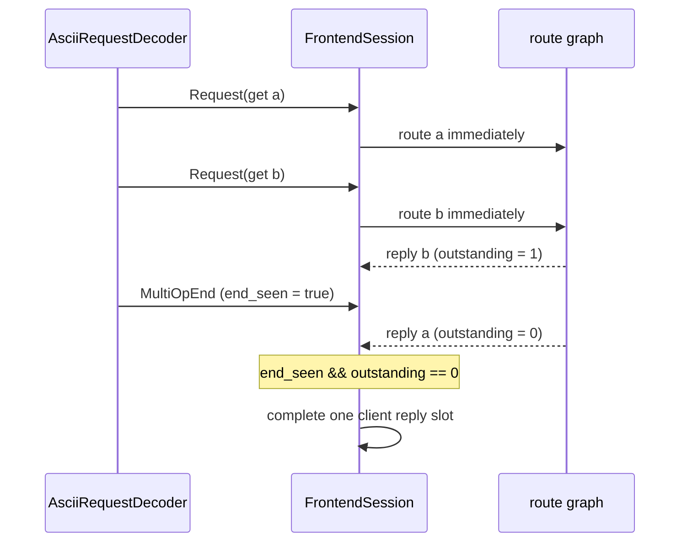
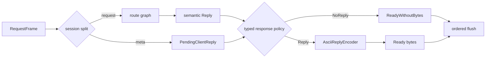
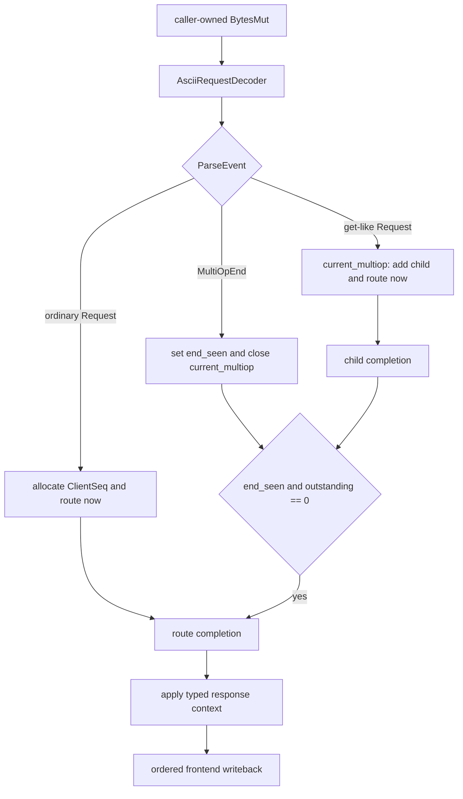

# rusty-mcrouter request frames and session metadata (design)

> Status: **Proposed**
> Mirrors: [`../mcrouter/protocol-parsing.md`](../mcrouter/protocol-parsing.md) — how mcrouter separates parser callbacks, `McServerRequestContext`, `currentMultiop_`, request ids, and reply serialization
> Implemented in: *(not yet)*
> Related: [`./stateful-parser.md`](./stateful-parser.md) — the incremental decoder that emits these frames and events; [`./multiget.md`](./multiget.md) — the current buffered multiget boundary this supersedes; [`./threading-model.md`](./threading-model.md) — connection ownership and ordered writeback

Define the boundary between bytes and routing without moving connection state into
the codec. A `RequestFrame` carries one semantic, single-key `Request` plus only
the response information observed on the wire. The client session assigns local
sequence numbers, owns multi-op groups, routes requests, and writes replies in
order. Read the [mcrouter reference](../mcrouter/protocol-parsing.md) first; this
document only describes our side.

---

## tl;dr

- **The parser emits facts, not session decisions.** `RequestFrame` contains a
  semantic `Request` and typed wire response metadata. It does not contain a
  session sequence number, group id, pending sender, or route handle.
- **Metadata is typed by command family.** The initial implementation has only
  `RequestMeta::BasicText`. Future Meta text and Caret metadata are separate
  variants rather than optional fields on one universal struct.
- **Meta is not a transport.** The connection-level wire protocol is text today;
  Meta is a future text command family with different response rules. Caret is a
  separate future framed protocol. Captain/protobuf is not upstream mcrouter.
- **Get-like parsing is an event stream.** Each completed key produces
  `ParseEvent::Request(RequestFrame)` immediately. The trailing newline produces
  `ParseEvent::MultiOpEnd`. A one-key get follows the same two-event shape.
- **`MultiOpEnd` has no group id.** Parser events are ordered and only one
  multi-op is being constructed at a time. The session owns the current group and
  may retain any number of previously closed groups while their replies finish.
- **Routing starts immediately.** The session submits every get-like child when
  its `Request` event arrives; it does not wait for `MultiOpEnd` or buffer all
  keys. `MultiOpEnd` only records that no more children will arrive.
- **Completion requires both facts:** `end_seen && outstanding == 0`. Replies may
  finish before the parser reaches the end of the command, or after it.
- **ASCII `noreply` still occupies an ordering slot.** The route executes, but
  the completed slot contains no bytes. Ordered writeback advances past it.
  Future Meta quiet semantics are different and get their own metadata type.
- **Wire correlation and local ordering are different namespaces.** `ClientSeq`
  and `GroupId` are session-only. A future Caret `reqId` or Meta opaque token is
  wire metadata and must never double as an internal sequence number.

---

## goal

Provide one precise handoff between the stateful codec and connection/session
code so that:

1. routes continue to receive only semantic, single-key `Request` values;
2. the frontend can encode the correct response after routing, including after
   future key rewriting;
3. multiget children can route as soon as they are parsed while still producing
   one ordered client response;
4. `noreply`, future Meta quiet, and future framed request ids cannot be confused;
5. parser implementation details do not leak into session state; and
6. session ordering and grouping do not leak into `rusty-mcrouter-codec`.

---

## scope / non-goals

**In scope:**

- `RequestFrame`, `RequestMeta`, `BasicTextReplyContext`,
  `BasicTextResponsePolicy`, and `BasicTextEncodeContext` in
  `rusty-mcrouter-codec`.
- `ParseEvent::Request` and `ParseEvent::MultiOpEnd`.
- frontend `FrontendSession` ownership of local sequence numbers, current multi-op,
  closed groups, pending replies, and ordered writes.
- immediate routing of get-like child requests.
- response-context preservation, including the original client key.
- ASCII `noreply` parsing and suppression without stalling ordered writeback.
- backend ASCII FIFO matching as a session responsibility.

**Out of scope / deferred:**

- Meta text commands, quiet responses, opaque tokens, requested response flags,
  and base64 keys. This document reserves a typed variant but does not implement
  it.
- Caret framing, Carbon serialization, wire `reqId` correlation, and compression.
- Captain/protobuf.
- raw reply passthrough.
- generic parser, encoder, frame, or session traits.
- moving socket I/O, route execution, or pending maps into the codec crate.

---

## starting point (current rusty)

The current parse boundary is `Parsed`:

```rust
pub enum Parsed {
    One(Request),
    MultiGet(Vec<Bytes>),
}
```

`rusty-mcrouter/src/proxy/connection.rs` owns the actual session behavior:

- `buf` and `write_buf`;
- `next_seq`, `next_write`, and the pending reply map;
- `submit_single` and `submit_multiget`;
- multiget fan-out and reply merging; and
- ordered serialization through `Reply::serialize_into`.

This already puts grouping and ordering in the right layer, but the parse boundary
has two limitations:

1. `Parsed::MultiGet(Vec<Bytes>)` buffers every key before the first child can be
   submitted; and
2. a bare `Request` cannot retain wire response rules without putting those rules
   into the semantic request enum.

The backend client in `rusty-mcrouter-net/src/client/connection.rs` separately
owns `pending: VecDeque<oneshot::Sender<_>>` and pops one sender per parsed ASCII
reply. That is already a session-level FIFO matcher; it should remain there.

---

## target design

### 1. semantic request plus typed wire metadata

`Request` remains the value sent through the route graph:

```rust
pub enum Request {
    Get { key: Key },
    Set { key: Key, flags: u32, exptime: i32, data: Bytes },
    Delete { key: Key },
    Incr { key: Key, delta: u64 },
    // ...the remaining single-key operations...
}
```

It contains no `noreply`, connection protocol, sequence number, or group id.

The decoder emits a frame at the codec/session boundary:

```rust
pub struct RequestFrame {
    pub request: Request,
    pub meta: RequestMeta,
}

pub enum RequestMeta {
    BasicText(BasicTextReplyContext),

    // Future, not implemented in this design:
    // MetaText(MetaTextReplyContext),
    // Caret(CaretReplyContext),
}
```

An enum is intentional. A struct containing `no_reply: bool`,
`request_id: Option<u64>`, `opaque: Option<Bytes>`, and `meta_flags: Vec<_>` would
permit combinations that cannot exist on the wire. Typed variants keep those
protocol-family rules separate.

### 2. basic text response context

Basic text has two response shapes:

```rust
pub enum BasicTextReplyContext {
    /// Storage, delete, arithmetic, touch, and other one-request commands.
    Standard {
        policy: BasicTextResponsePolicy,
    },

    /// Current get response. Preserve the client-visible key so
    /// VALUE lines remain correct if routing later strips or rewrites a prefix.
    GetLike {
        original_key: Key,
    },
}

pub enum BasicTextResponsePolicy {
    Reply,
    NoReply,
}

/// Context needed after session grouping has finished.
pub enum BasicTextEncodeContext {
    Standard,
    GetLike,
}
```

`NoReply` is only constructed for commands whose grammar accepts the ASCII
`noreply` token. Get-like commands always use `GetLike` and always produce the
command's final response framing.

The original key is a cheap `Bytes`-backed clone. It belongs in response context,
not in session grouping state and not in a raw-wire cache. The route receives the
semantic request key; the frontend encoder receives the original client key.

### 3. future metadata variants are separate seams

The future shapes are documented to protect today's API from an optional-field
bag. They are not implemented now:

```rust
// Future: Meta is a text command family, not a WireProtocol variant.
pub struct MetaTextReplyContext {
    pub policy: MetaResponsePolicy,       // Reply or QuietSuccess
    pub opaque: Option<Bytes>,
    pub requested_flags: MetaResponseFlags,
    pub original_key: Option<Key>,
}

// Future: Caret is a separate framed wire protocol.
pub struct CaretReplyContext {
    pub request_id: u64,
    pub type_id: u32,
}
```

Meta quiet is not ASCII `noreply`: quiet suppresses nominal responses while
errors may still be emitted, and opaque tokens can correlate a response. Caret
correlation is a wire `reqId`. Neither should be represented by
`BasicTextResponsePolicy::NoReply`.

If a connection-level protocol enum becomes necessary, its shape is:

```rust
pub enum WireProtocol {
    Text,
    Caret, // future
}
```

There is no `WireProtocol::Meta`.

### 4. parser events

```rust
pub enum ParseEvent {
    Request(RequestFrame),

    /// End of one get-like command's key stream. Emitted for get-like commands
    /// only, including a one-key get. Carries no session group id.
    MultiOpEnd,
}
```

Examples:

```text
set a 0 0 1\r\nx\r\n
  -> Request(Set(a), BasicText::Standard { Reply })

set a 0 0 1 noreply\r\nx\r\n
  -> Request(Set(a), BasicText::Standard { NoReply })

get a\r\n
  -> Request(Get(a), BasicText::GetLike { original_key: a })
  -> MultiOpEnd

get a b c\r\n
  -> Request(Get(a), BasicText::GetLike { original_key: a })
  -> Request(Get(b), BasicText::GetLike { original_key: b })
  -> Request(Get(c), BasicText::GetLike { original_key: c })
  -> MultiOpEnd
```

### 5. why `MultiOpEnd` has no group id

The decoder consumes one ordered byte stream. At most one get-like command is
being **constructed from parser events** at a time:

```text
current_multiop: the command whose Request events are arriving now
closed_multiops: earlier commands whose child replies are still outstanding
```

When `MultiOpEnd` arrives, it always closes `current_multiop`. The session then
sets `current_multiop = None`; the next get-like `Request` creates a new group.

This does not limit pipelining. Several groups can be closed and waiting for
backend replies concurrently. It only states that an ordered parser cannot
interleave the key tokens of two command lines.

Putting a `GroupId` in `ParseEvent` would make the codec invent session identity.
That is the departure from mcrouter we explicitly avoid: upstream emits
`onRequest` and `multiOpEnd`; `McServerSession` owns `currentMultiop_`.

### 6. session-only identities

```rust
#[derive(Clone, Copy, Debug, Eq, Hash, PartialEq)]
struct ClientSeq(u64);

#[derive(Clone, Copy, Debug, Eq, Hash, PartialEq)]
struct GroupId(u64);
```

These types live in the frontend session module, not in
`rusty-mcrouter-codec`. They are local bookkeeping:

- `ClientSeq` orders complete client-command responses on the frontend stream;
- `GroupId` indexes multi-op aggregation state; and
- child task ids, if needed, identify route completions within a group.

They are never serialized and never copied into `RequestMeta`. A future Caret
wire `request_id` remains inside `CaretReplyContext`; a future Meta opaque token
remains inside `MetaTextReplyContext`.

### 7. immediate routing and multi-op lifecycle

The session does not wait for `MultiOpEnd` before routing:

```rust
struct MultiOpState {
    id: GroupId,
    client_seq: ClientSeq,
    outstanding: usize,
    end_seen: bool,
    /// Per-child basic-text context, including each original client key.
    children: HashMap<ChildId, BasicTextReplyContext>,
    hits: Vec<Value>,
    first_error: Option<Reply>,
}
```

The decoder's `MAX_KEYS_PER_GET` limit bounds `children`, `outstanding`, route
tasks, and per-group reply memory before the session sees the events.

The session also enforces per-connection high-water marks:

| Limit | Proposed default | Action at limit |
|---|---:|---|
| `MAX_IN_FLIGHT_COMMANDS` | 1024 | stop polling the frontend socket until replies drain |
| `MAX_OPEN_MULTIOPS` | 64 | stop parsing new commands until a closed group completes |
| `MAX_BUFFERED_REPLY_BYTES` | 64 MiB | pause frontend reads; close on policy timeout |
| `MAX_PENDING_BACKEND_REQUESTS` | 1024 | apply backpressure before writing another backend request |

These are backpressure limits, not parse errors. The connection disables its read
arm while above a high-water mark and resumes below a lower watermark. This
bounds pipelined groups and pending replies across commands, not just within one
multiget.

The session stores all groups in `multiops: HashMap<GroupId, MultiOpState>`.
`current_multiop: Option<GroupId>` identifies only the group currently receiving
parser events. Keeping even the current group in the map lets a very fast child
reply find its state before `MultiOpEnd` arrives.

Event handling, in order:

```rust
match event {
    ParseEvent::Request(frame) if frame.request.is_get_like() => {
        let group_id = match current_multiop {
            Some(id) => id,
            None => {
                let id = next_group_id();
                multiops.insert(id, MultiOpState::new(id, next_client_seq()));
                current_multiop = Some(id);
                id
            }
        };
        let group = multiops.get_mut(&group_id).ok_or(SessionError::MissingGroup)?;
        let child_id = next_child_id();
        group.outstanding += 1;
        group.children.insert(child_id, frame.meta.basic_text_context()?);
        route_child_now(group.id, child_id, frame.request);
    }

    ParseEvent::MultiOpEnd => {
        let group_id = current_multiop.take().ok_or(SessionError::UnexpectedMultiOpEnd)?;
        let group = multiops.get_mut(&group_id).ok_or(SessionError::MissingGroup)?;
        group.end_seen = true;
        complete_if_ready(group_id); // ready iff end_seen && outstanding == 0
    }

    ParseEvent::Request(frame) => {
        let seq = next_client_seq();
        route_now(seq, frame.request, frame.meta);
    }
}
```

Child completion decrements `outstanding`, merges hits or records the first
error, and completes the group only when:

```rust
group.end_seen && group.outstanding == 0
```

This handles both races:

- every child can finish before `MultiOpEnd`; the end event completes the group;
- `MultiOpEnd` can arrive first; the last child completion completes the group.

Before a child hit is merged, the session uses that child's stored
`BasicTextReplyContext::GetLike { original_key }` to restore the client-visible
`Value.key`. The final merged semantic `Reply::Get` therefore contains the right
keys even if routing stripped a prefix or a backend replied with a rewritten key.



### 8. pending replies and response encoding

The pending frontend entry stores session identity separately from the
encoder-facing context derived by the session:

```rust
struct PendingClientReply {
    seq: ClientSeq,
    context: BasicTextEncodeContext,
    state: PendingState,
}

enum PendingState {
    Routing,
    Ready(Reply),
    ReadyWithoutBytes,
}
```

For an ordinary command, the session reads `BasicTextResponsePolicy` from the
frame. For a get-like group, it first restores each hit's original key from the
per-child metadata, then completes one pending entry with
`BasicTextEncodeContext::GetLike`.

When a route or group completes, the session applies that context:

```rust
match completion {
    Completion::Standard {
        policy: BasicTextResponsePolicy::NoReply,
        ..
    } => mark_ready_without_bytes(seq),

    Completion::Reply { context, reply } => {
        AsciiReplyEncoder::encode(&context, &reply, &mut write_buf)?;
        mark_ready(seq);
    }
}
```

`AsciiReplyEncoder` accepts `BasicTextEncodeContext` in addition to the semantic
`Reply`. The context distinguishes ordinary reply framing from get-like
`VALUE ... END` framing. Original keys have already been restored in each
semantic `Value` before encoding.

The ordered flush loop advances through `ReadyWithoutBytes` exactly as it does
through an encoded reply. A `noreply` request cannot block every later reply.



### 9. backend reply matching remains outside the codec

The backend connection has a different responsibility. For ASCII it writes
requests in order and stores expected completions in a FIFO queue:

```rust
struct BackendSession {
    decoder: AsciiReplyDecoder,
    pending_fifo: VecDeque<PendingBackendRequest>,
}
```

Each decoded semantic `Reply` pops the front entry. The decoder identifies frame
boundaries and values; the session decides which pending operation receives the
reply.

The reply-timeout tombstone remains valid with a stateful decoder. Decoder state
belongs to `pending_fifo.front()` until one complete reply is returned. A timed
out caller drops only its receiver; the sender remains at the FIFO front. After
the remaining reply bytes arrive, the decoder returns to `Idle`, the session pops
that sender, and `send` harmlessly fails because the receiver is gone. Only then
can decoding begin for the next FIFO entry. See the corresponding contract in
[`stateful-parser.md`](./stateful-parser.md#reply-timeout-tombstone-under-a-stateful-decoder).

A future correlated protocol can use a map:

```rust
pending_by_wire_id: HashMap<u64, PendingBackendRequest>
```

The wire id is parsed by the codec, but matching and sender delivery remain in
`BackendSession`. ASCII's local FIFO index must never be written into a future
Caret frame or exposed as `RequestMeta`.

### 10. frontend lifecycle



---

## how this maps to mcrouter

| mcrouter | rusty-mcrouter |
|---|---|
| `McServerAsciiParser::onRequest(req, noreply)` | `ParseEvent::Request(RequestFrame)` with typed `RequestMeta::BasicText` |
| `McServerAsciiParser::multiOpEnd()` | payload-free `ParseEvent::MultiOpEnd` |
| `McServerRequestContext` | split between `RequestFrame` wire response context and session-owned pending state |
| `McServerRequestContext::asciiKey()` | `BasicTextReplyContext::GetLike { original_key }` |
| `McServerRequestContext::noReply_` | `BasicTextResponsePolicy::NoReply` |
| `McServerSession::currentMultiop_` | `FrontendSession::current_multiop` |
| `MultiOpParent::recordRequest` | increment `MultiOpState::outstanding` before routing each child |
| `MultiOpParent::recordEnd` | `MultiOpEnd` sets `end_seen` |
| `MultiOpParent::reply` / `release` | child merge plus `end_seen && outstanding == 0` completion |
| `tailReqid_`, `headReqid_`, `blockedReplies_` | session-only `ClientSeq`, next-write cursor, pending map |
| ASCII internal reqids | never stored in `RequestMeta`; local ordering only |
| Caret `CaretMessageInfo::reqId` | future `CaretReplyContext::request_id` wire metadata |
| `AsciiSerializedReply::prepare(..., asciiKey, ...)` | per-child `BasicTextReplyContext` restores `Value.key`; `AsciiReplyEncoder::encode(&BasicTextEncodeContext, &Reply, ...)` formats the completed response |
| `ClientMcParser::expectNext` | no decoder pre-registration; backend FIFO retains expected-operation context for delivery/validation |

The Rust types are not intended to reproduce every C++ context object. They
preserve the same responsibility boundaries while using explicit data flow
instead of callbacks and context-owned reply methods.

---

## testing

### codec tests

- ordinary command emits one `Request` and no `MultiOpEnd`;
- one-key get emits `Request` then `MultiOpEnd`;
- multi-key get emits one `Request` per key as delimiters arrive, then one
  `MultiOpEnd`;
- basic text `noreply` is accepted only on commands whose grammar permits it;
- get-like frames preserve `original_key`;
- no frame contains a local sequence or group id;
- future metadata examples cannot be constructed through the current public API.

### frontend session tests

- the first multiget child is submitted before the parser sees the final newline;
- a child reply arriving before `MultiOpEnd` does not complete the group;
- `MultiOpEnd` arriving before child replies does not complete the group;
- completion occurs exactly once when `end_seen && outstanding == 0`;
- a one-key get uses the same group lifecycle;
- two pipelined multigets can both be closed and await replies concurrently;
- an ordinary request immediately following `MultiOpEnd` receives a distinct
  `ClientSeq` and preserves response order;
- a `noreply` request executes its route, emits zero bytes, advances the ordered
  write cursor, and does not block a later reply;
- a rewritten route key still encodes the original client key in `VALUE` output;
- internal `ClientSeq` and `GroupId` never appear in encoded bytes.
- `MAX_KEYS_PER_GET` prevents one client command from creating unbounded child
  tasks or group state.
- reaching an in-flight/open-group/buffered-byte high-water mark pauses the
  frontend read arm; draining below the low-water mark resumes it;

### backend session tests

- pipelined ASCII replies are delivered through `pending_fifo` in request order;
- a partial `VALUE` response does not pop the pending entry early;
- EOF or decoder error fails every pending entry;
- `MAX_PENDING_BACKEND_REQUESTS` applies backpressure before the FIFO grows past
  its configured bound;
- no codec type owns a oneshot sender or pending map.

---

## implementation order

### step 1: introduce frame and metadata types

Add `RequestFrame`, `RequestMeta`, `BasicTextReplyContext`,
`BasicTextResponsePolicy`, and `BasicTextEncodeContext` to
`rusty-mcrouter-codec`. Add compile-time and unit tests for valid metadata
combinations.

### step 2: make the decoder emit frames

Update `AsciiRequestDecoder` from the
[stateful parser design](./stateful-parser.md) to populate typed metadata and emit
`ParseEvent`. Ordinary commands emit one frame; get-like commands emit one frame
per key followed by `MultiOpEnd`.

### step 3: add explicit frontend session state

Refactor `rusty-mcrouter/src/proxy/connection.rs` into a clearly named
`FrontendSession` state machine, whether or not the file is renamed immediately.
Add `ClientSeq`, `GroupId`, `current_multiop`, closed multi-op storage, and typed
pending replies.

### step 4: route get-like children immediately

Replace `Parsed::MultiGet(Vec<_>)` handling with incremental event handling.
Submit each child as its `Request` event arrives. Make `MultiOpEnd` set
`end_seen`; do not use it as the trigger to begin routing.

### step 5: make reply encoding context-aware

Change `AsciiReplyEncoder` to accept `BasicTextEncodeContext`. Preserve original
keys while merging get-like child replies and implement `ReadyWithoutBytes` for
`noreply` slots.

### step 6: preserve backend FIFO ownership

Migrate `rusty-mcrouter-net` to `AsciiReplyDecoder` without moving
`pending_fifo`, deadlines, oneshot senders, or teardown behavior into the codec.

### step 7: remove the old boundary

Delete `Parsed`, switch every consumer to `ParseEvent` and `RequestFrame`, and
delete `rusty-mcrouter-protocol` as described by
[`stateful-parser.md`](./stateful-parser.md).

### step 8: document the as-built result

Write `../architecture/request-frames.md`, update this document to
**Implemented**, and record intentional divergences from the design.

---

## decisions / open questions

- **One frame type or separate protocol-specific frames? (decided: one
  `RequestFrame`, typed `RequestMeta` enum).** The outer handoff is stable while
  metadata variants prevent invalid cross-protocol combinations.
- **Does `RequestFrame` contain `ClientSeq` or `GroupId`? (decided: no).** Both
  are assigned by the consuming session and never exist on the wire.
- **Does `MultiOpEnd` carry a group id? (decided: no).** Ordered parsing plus one
  currently constructed multi-op makes the payload unnecessary. Closed groups
  remain independently addressable in session state.
- **When does multiget routing begin? (decided: per key, immediately).** Waiting
  for `MultiOpEnd` would preserve the old buffering behavior and waste the parser
  event stream.
- **Does one-key get use a group? (decided: yes).** It emits `Request` plus
  `MultiOpEnd` and follows the same completion rule as any other get-like command.
- **Where does `noreply` live? (decided: BasicText response policy).** It is not
  a semantic `Request` field and is not equivalent to Meta quiet.
- **How are get keys preserved? (decided: response context).** A cheap clone of
  the original `Key` travels in `BasicTextReplyContext::GetLike`; no raw reply
  bytes are retained.
- **Does the codec own frontend/backend matching? (decided: no).** It exposes
  parsed metadata; sessions own pending collections and sender delivery.
- **One client sequence per child or per original command? (decided: one per
  original command in rusty).** A multi-op group owns one `ClientSeq`; child
  completion is tracked inside the group. This differs mechanically from
  mcrouter's subrequest and sentinel reqids but preserves the same observable
  ordering and completion barrier.
- **What happens when `MultiOpEnd` arrives without `current_multiop`? (decided:
  terminal session invariant error).** It indicates a decoder/session contract
  violation; do not invent an empty group.
- **Meta and Caret metadata shapes (deferred).** Their sketches document the
  boundary only. Final fields are chosen when those protocols are implemented.

---

## done when

- `rusty-mcrouter-codec` exports `RequestFrame`, typed `RequestMeta`,
  `BasicTextReplyContext`, `BasicTextResponsePolicy`, and
  `BasicTextEncodeContext`.
- semantic `Request` contains no response suppression, protocol, sequence, group,
  opaque token, or request-id fields.
- ordinary commands emit one `ParseEvent::Request` and no `MultiOpEnd`.
- every get-like command, including one-key get, emits one frame per key followed
  by exactly one payload-free `MultiOpEnd`.
- get-like children are submitted for routing as their events arrive, before the
  command's final newline when possible.
- `FrontendSession` owns `ClientSeq`, `GroupId`, current group, closed groups,
  pending replies, and ordered writeback.
- group completion is exactly `end_seen && outstanding == 0` and is race-tested
  in both event/reply orders.
- ASCII `noreply` executes routing, writes zero bytes, and advances ordered
  response state.
- `AsciiReplyEncoder` accepts typed encode context; the session restores original
  keys before encoding a completed get-like reply.
- backend ASCII reply matching remains FIFO in `rusty-mcrouter-net`.
- internal ids never appear in `RequestMeta` or encoded bytes.
- per-connection high-water marks bound in-flight commands, open groups,
  buffered reply bytes, and pending backend requests; tests prove read-side
  backpressure resumes after draining.
- Meta, Caret, Captain/protobuf, generic traits, and raw passthrough remain
  unimplemented.
- all codec, frontend session, backend session, and workspace tests pass.
- `lsp_diagnostics` / clippy are clean, `../architecture/request-frames.md` is
  written, and this document is updated to **Implemented**.
