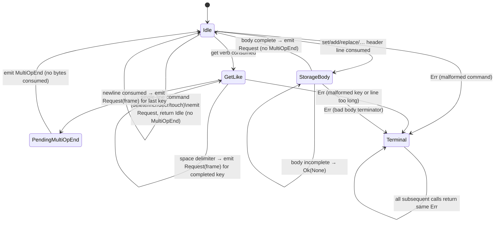

# rusty-mcrouter stateful parser (design)

> Status: **Proposed**
> Mirrors: [`../mcrouter/protocol-parsing.md`](../mcrouter/protocol-parsing.md) — how mcrouter does it (McParser first-byte selection, McAsciiParser.rl Ragel state machine, ServerMcParser/ClientMcParser, McServerSession sequencing)
> Implemented in: *(not yet)*
> Related: [`./request-frames.md`](./request-frames.md) — defines `RequestFrame`, typed `RequestMeta`, and basic-text response context emitted by the stateful decoder; [`./multiget.md`](./multiget.md) — the current stateless multiget split this supersedes at the parse boundary; [`./write-batching.md`](./write-batching.md) — the write path this sits above

Consolidate all protocol semantics, wire encoding, and incremental parsing into a
new **`rusty-mcrouter-codec`** crate, replace the current stateless free-function
parsers with **stateful incremental decoders**, and delete `rusty-mcrouter-protocol`
once all consumers have migrated. Read
[`../mcrouter/protocol-parsing.md`](../mcrouter/protocol-parsing.md) first — this
doc assumes it and only describes our side.

---

## tl;dr

- **`rusty-mcrouter-codec` replaces `rusty-mcrouter-protocol` entirely.** It owns
  `Key`, `Request`, `Reply`, `Value`, semantic validation, parse/encode errors,
  wire metadata, and all ASCII decoder/encoder implementations. There is no
  compatibility shim; the old crate is deleted once all consumers point at the new
  one.
- **`AsciiRequestDecoder` and `AsciiReplyDecoder` are the primary decode API;
  `AsciiRequestEncoder` and `AsciiReplyEncoder` are the primary encode API.** All
  four are concrete structs, not trait objects. Generic traits are not introduced
  until a second implementation (Caret) actually exists.
- **Storage commands become truly stateful.** Today `parse_request` re-reads the
  header on every partial-read call because it has no cross-call state. The new
  decoder holds a `ParseState` enum that records the parsed header and expected
  body length across calls, so a `set` with a large value body costs one header
  parse regardless of how many `read` syscalls it takes. Partial body bytes remain
  in the caller-owned `BytesMut`; the decoder does not copy them.
- **Get-like commands emit one `ParseEvent::Request(RequestFrame)` per key, then
  `ParseEvent::MultiOpEnd`** (matching mcrouter's `on_full_key` / `multiOpEnd`
  model). Each key is converted into a complete single-key `RequestFrame` before
  emission. A single-key `get` also emits `Request` then `MultiOpEnd` — the event
  shape is uniform. `RequestFrame`, `RequestMeta`, and the typed basic-text reply
  context are defined
  in [`./request-frames.md`](./request-frames.md).
- **`noreply` and other wire metadata belong to `RequestMeta` /
  `BasicTextResponsePolicy`,
  not to `Request`.** Semantic `Request` variants are free of wire-transport
  concerns. The decoder populates `RequestMeta` from the parsed command line and
  passes it alongside the `Request` inside a `RequestFrame`.
- **`Key` carries routing accessors** (`routing_prefix`, `key_without_route`,
  `routing_key`, `hash_stop`) in addition to validation. These are computed once
  at parse time and cached on the `Key`.
- **Meta (`mg`/`ms`/`md`) is an ASCII command family, not a separate transport.**
  It is out of scope for this effort but the crate layout preserves an extension
  seam (`ascii/request/meta.rs`) so it can be added without restructuring.
- **Caret is upstream mcrouter's binary protocol (GroupVarint/Carbon framing) and
  is deferred in rusty.** Captain/protobuf is not upstream mcrouter at all.
  The codec crate is structured so a `CaretRequestDecoder` can be added later
  without touching the ASCII path.
- **Malformed protocol errors are terminal for the connection.** An `Err` from
  `decode` means the byte stream is unrecoverable; the caller closes the
  connection. `Ok(None)` means incomplete data — more bytes needed.
- **Sockets, `BytesMut` ownership, frontend sequencing, multiget grouping,
  backend FIFO/correlation, and route execution stay outside the codec.** The
  codec is a pure bytes-in / typed-value-out library with no I/O, no async, and
  no connection state.

---

## goal

Replace the current mix of stateless free parsers, inherent `serialize_into`
methods, and scattered wire helpers in `rusty-mcrouter-protocol` with a single,
well-bounded `rusty-mcrouter-codec` crate that:

1. Is the **single source of truth** for all protocol semantics (key validation
   and routing accessors, value size limits, command grammar, reply shapes).
2. Provides **stateful incremental decoders** that hold parse state across
   `BytesMut` boundaries, so partial reads never re-parse already-seen bytes.
3. Emits **one `ParseEvent::Request(RequestFrame)` per key** for get-like
   commands, enabling the connection layer to fan out without building an
   intermediate `Vec`.
4. Separates **semantic types** (`Request`, `Reply`, `Key`) from **wire metadata**
   (`RequestMeta`, `BasicTextReplyContext` in `RequestFrame`) so route handles never
   see transport concerns.
5. Is **independently testable** with no I/O, no Tokio, and no route graph.

---

## scope / non-goals

**In scope:**

- New `rusty-mcrouter-codec` crate with `Key` (with routing accessors),
  `Request`, `Reply`, `Value`, `CodecError`, `RequestFrame`, typed
  `RequestMeta`, `ParseEvent`,
  `AsciiRequestDecoder`, `AsciiReplyDecoder`, `AsciiRequestEncoder`,
  `AsciiReplyEncoder`.
- Stateful `ParseState` for storage commands (header parsed once, body length
  recorded; body bytes stay in caller's `BytesMut` until complete).
- Stateful `ParseState::GetLike` with incremental key parsing across buffer
  boundaries and a `MAX_COMMAND_LINE` limit.
- `ParseEvent` enum (replacing `Parsed`) at the parse boundary, carrying
  `RequestFrame` as defined in [`./request-frames.md`](./request-frames.md).
- `noreply` parsed into `RequestMeta::BasicText` /
  `BasicTextResponsePolicy` inside `RequestFrame`,
  not into `Request` variants.
- Migration of `rusty-mcrouter-core`, `rusty-mcrouter-net`, and
  `rusty-mcrouter` from `rusty-mcrouter-protocol` to `rusty-mcrouter-codec`.
- Deletion of `rusty-mcrouter-protocol` from the workspace.

**Out of scope / deferred:**

- **Meta command family (`mg`/`ms`/`md`)** — ASCII commands with a different
  line grammar. Out of scope for this effort; an extension seam is preserved in
  the crate layout. See decisions section.
- **Caret binary protocol** — upstream mcrouter's GroupVarint/Carbon framing,
  deferred in rusty. The codec crate is structured to add a `CaretRequestDecoder`
  later without touching the ASCII path.
- **Captain / protobuf** — not upstream mcrouter. Deferred indefinitely.
- **Generic `Decoder`/`Encoder` traits** — not introduced until a second
  implementation (Caret) actually exists. Premature abstraction before that point.
- **`IoSlice`/`writev` zero-copy encoding** — tracked in
  [`./write-batching.md`](./write-batching.md) Tier 2. The encoders write into
  `&mut BytesMut` for now; Tier 2 can add segment-based emission later.
- **Session ordering, multiget grouping, backend FIFO correlation** — these stay
  in the connection layer. The codec emits `ParseEvent`s; the connection decides
  what to do with them.
- **Raw passthrough / IOBuf port** — we do not port mcrouter's `IOBuf` chain
  model. Caller-owned `BytesMut` is the buffer contract.

---

## starting point (current rusty)

`rusty-mcrouter-protocol` today contains:

| File | What it does |
|---|---|
| `lib.rs` | Re-exports `parse_reply`, `parse_request`, `Reply`, `Value`, `Parsed`, `Request`, `ProtocolError` |
| `request.rs` | `Request` enum + `serialize_into(&mut BytesMut)` inherent method |
| `reply.rs` | `Reply` enum + `Value` struct + `serialize_into(&mut BytesMut)` inherent method |
| `wire.rs` | `write_decimal`, `write_signed_decimal` helpers |
| `parser/mod.rs` | `parse_request` free function — **stateless**, re-parses header on every partial call |
| `parser/shared.rs` | `read_line`, `parse_storage_request`, `validate_key`, `MAX_KEY_LEN=250`, `MAX_VALUE_SIZE=1MiB` |
| `parser/get.rs` … | Per-command parsers returning `Option<Request>` |
| `parser/reply.rs` | `parse_reply` free function |

Key limitations of the current design:

1. **Stateless storage parsing.** `parse_request` calls `read_line` on every
   invocation. For a `set` with a large value body that arrives in multiple TCP
   segments, the header line is re-parsed on every call until the body is fully
   buffered. The `// TODO: parser is stateless` comment in `parser/mod.rs` names
   this explicitly.

2. **`Parsed::MultiGet(Vec<Bytes>)` builds a heap allocation.** The current
   multiget design (`multiget.md`) already avoids this for the single-key common
   case, but a 2+-key get still allocates a `Vec`. The `ParseEvent` model
   eliminates the `Vec` entirely.

3. **`noreply` is rejected.** `shared.rs` returns
   `ProtocolError::Malformed("noreply not yet supported")` for any command with a
   `noreply` token. This is a correctness gap for clients that use it.

4. **No `Key` type.** Key bytes are bare `Bytes` everywhere; validation is a
   free function called at parse time only. There is no type-level guarantee that
   a `Key` in a `Request` has been validated, and routing accessors are absent.

5. **Semantic enums, wire helpers, and parsers are co-located** with no clear
   boundary between "what a request means" and "how it is encoded on the wire."

6. **Encoding is coupled to semantic types.** `Request::serialize_into` and
   `Reply::serialize_into` are inherent methods, making `Request` and `Reply`
   aware of ASCII wire format. Semantic types should not own encoding.

Consumers of `rusty-mcrouter-protocol`:

- `rusty-mcrouter/src/proxy/connection.rs` — calls `parse_request`, matches
  `Parsed`, calls `reply.serialize_into(&mut self.write_buf)`.
- `rusty-mcrouter-net/src/client/connection.rs` — calls `parse_reply`, calls
  `request.serialize_into(&mut self.write_buf)`.
- `rusty-mcrouter-core` — holds `Request` and `Reply` in route handle signatures.
- Various test helpers and fixtures.

---

## target design

### 1. crate layout: `rusty-mcrouter-codec`

```
rusty-mcrouter-codec/
  Cargo.toml
  src/
    lib.rs          — pub re-exports; no logic
    key.rs          — Key newtype, validation, routing accessors
    request.rs      — semantic Request enum
    reply.rs        — Reply enum, Value struct
    frame.rs        — RequestFrame, typed RequestMeta, ParseEvent,
                      basic-text reply/encode contexts
    error.rs        — CodecError (Malformed | KeyTooLong | InvalidKey | ValueTooLarge | UnexpectedEof)
    wire.rs         — write_decimal, write_signed_decimal (internal)
    ascii/
      mod.rs        — AsciiRequestDecoder, AsciiReplyDecoder,
                      AsciiRequestEncoder, AsciiReplyEncoder
      request/
        mod.rs      — ParseState enum, decode dispatch
        get.rs      — get (future get-like commands extend this state)
        storage.rs  — set/add/replace/append/prepend/cas/lease-set
        delete.rs
        arithmetic.rs
        touch.rs
        meta.rs     — extension seam (unimplemented; returns Err on parse)
      reply/
        mod.rs      — reply decode dispatch
        get.rs
        storage.rs
        arithmetic.rs
        error.rs
```

`rusty-mcrouter-codec` depends only on `bytes` and `thiserror`. No Tokio, no
async, no I/O.

### 2. `Key`: a validated newtype with routing accessors

```rust
/// A validated memcached key: 1–250 bytes, no ASCII whitespace or control chars.
/// Constructed only via `Key::from_bytes`; never from raw Bytes directly.
/// Routing accessors are computed once at construction and cached.
///
/// Routing prefix: mcrouter uses a `/region/cluster/` prefix convention
/// (slash-delimited path segments) to steer a key to a specific pool or
/// cluster. Example: `/region1/cluster2/mykey` has routing prefix
/// `/region1/cluster2/` and key-without-route `mykey`.
///
/// Hash-stop: the marker `|#|` in a key causes consistent hashing to use only
/// the portion before the marker. Example: `mykey|#|shard42` hashes on
/// `mykey`; the suffix `|#|shard42` is preserved on the wire but ignored for
/// hash selection. `hash_stop_start` points to the `|` of `|#|`; the full
/// marker plus suffix is the `hash_stop_suffix`.
#[derive(Clone, Debug, Eq, PartialEq, Hash)]
pub struct Key {
    raw: Bytes,
    // Cached routing decomposition (computed once in from_bytes).
    // Indices into `raw`; no extra allocation.
    route_prefix_end: usize,   // 0 if no routing prefix present
    hash_stop_start: usize,    // raw.len() if no hash-stop marker present
}

impl Key {
    /// Validate and wrap. Returns `CodecError::InvalidKey` or `CodecError::KeyTooLong`.
    /// Computes and caches routing decomposition.
    pub fn from_bytes(b: Bytes) -> Result<Self, CodecError> { … }

    /// The full raw key bytes as received on the wire.
    pub fn as_bytes(&self) -> &[u8] { &self.raw }
    pub fn into_bytes(self) -> Bytes { self.raw }

    /// The routing prefix (e.g. `b"/region1/cluster2/"` in
    /// `b"/region1/cluster2/mykey"`). Empty slice if no routing prefix.
    pub fn routing_prefix(&self) -> &[u8] { &self.raw[..self.route_prefix_end] }

    /// The key with the routing prefix stripped.
    pub fn key_without_route(&self) -> &[u8] { &self.raw[self.route_prefix_end..] }

    /// The portion of the key used for consistent-hash selection:
    /// from after the routing prefix up to (but not including) the `|` of the
    /// hash-stop marker `|#|`, if present; otherwise the full key-without-route.
    pub fn routing_key(&self) -> &[u8] {
        &self.raw[self.route_prefix_end..self.hash_stop_start]
    }

    /// True if the key contains the hash-stop marker `|#|`.
    pub fn has_hash_stop(&self) -> bool { self.hash_stop_start < self.raw.len() }

    /// The hash-stop marker and suffix (`|#|…`), or empty slice if none.
    /// Includes the `|#|` marker itself.
    pub fn hash_stop_suffix(&self) -> &[u8] {
        if self.has_hash_stop() { &self.raw[self.hash_stop_start..] } else { b"" }
    }
}

impl AsRef<[u8]> for Key { fn as_ref(&self) -> &[u8] { self.as_bytes() } }
```

`Request` and `Reply` use `Key` instead of bare `Bytes` for key fields. The
type-level guarantee: if you hold a `Key`, it has been validated and its routing
decomposition is available without re-scanning. Validation constants
(`MAX_KEY_LEN = 250`, character rules) live in `key.rs` and are the single source
of truth.

`Key::from_bytes` parses the routing prefix first, then searches for `|#|` only
inside `key_without_route`. Construction guarantees
`route_prefix_end <= hash_stop_start <= raw.len()`, so every accessor slice is
valid. Tests cover a marker-like byte sequence inside the prefix and all boundary
orderings.

### 3. `Request`, `ParseEvent`, and `RequestFrame`

`Request` is the **semantic** request type — single-key, free of wire-transport
concerns. It does not carry `noreply` or other wire metadata:

```rust
#[derive(Clone, Debug, Eq, PartialEq)]
pub enum Request {
    Get    { key: Key },
    Set    { key: Key, flags: u32, exptime: i32, data: Bytes },
    Add    { key: Key, flags: u32, exptime: i32, data: Bytes },
    Replace{ key: Key, flags: u32, exptime: i32, data: Bytes },
    Append { key: Key, flags: u32, exptime: i32, data: Bytes },
    Prepend{ key: Key, flags: u32, exptime: i32, data: Bytes },
    Delete { key: Key },
    Incr   { key: Key, delta: u64 },
    Decr   { key: Key, delta: u64 },
    Touch  { key: Key, exptime: i32 },
    // Extension point: Meta command family (mg/ms/md) added here when in scope.
}
```

`noreply` and other wire-level modifiers belong to `RequestMeta` /
`BasicTextResponsePolicy` inside `RequestFrame`, which is defined in
[`./request-frames.md`](./request-frames.md). The decoder populates those fields
from the parsed command line. Route handles receive `Request` only; they never
see `noreply`.

`ParseEvent` is what `AsciiRequestDecoder::decode` returns — the **parse
boundary type**:

```rust
/// One event emitted by AsciiRequestDecoder per decode call.
///
/// The current get command emits one Request per key
/// as each key delimiter is parsed, then MultiOpEnd when the trailing newline
/// arrives. A single-key `get` emits Request then MultiOpEnd — two events.
///
/// All other commands (set/add/delete/incr/…) emit exactly one Request and
/// return to Idle. They do NOT emit MultiOpEnd. The connection routes the
/// single RequestFrame immediately without waiting for a sentinel.
#[derive(Clone, Debug, Eq, PartialEq)]
pub enum ParseEvent {
    /// A complete, routable single-key request with its wire metadata.
    /// For get-like commands, one event is emitted per key in parse order,
    /// as each key's trailing delimiter (space or newline) is consumed.
    /// For all other commands, exactly one event is emitted.
    Request(RequestFrame),
    /// Signals the end of a get-like command's key list.
    /// Emitted ONLY for get-like (multi-op) commands, never for ordinary
    /// commands. The connection uses this to close the in-flight group and
    /// mark the current session group as having no more children.
    MultiOpEnd,
}
```

`RequestFrame` bundles the semantic `Request` with its wire metadata:

```rust
/// A parsed request ready for routing, as defined in request-frames.md.
/// Shown here for reference; the authoritative definition is in that doc.
pub struct RequestFrame {
    pub request: Request,
    pub meta: RequestMeta,   // typed frontend response context
}
```

This mirrors mcrouter's model exactly:
- `McServerAsciiParser::consumeGetLike` fires `callback_->onRequest(message)` per
  key as each key's trailing delimiter is consumed → we emit
  `ParseEvent::Request(RequestFrame)` per key, streaming them as they arrive.
- `multi_op_end` fires `callback_->multiOpEnd()` at the trailing newline → we
  emit `ParseEvent::MultiOpEnd`.
- Write-like commands fire `callback_->onRequest(message, noreply_)` then
  `finishReq()` with **no** `multiOpEnd` → we emit one `ParseEvent::Request` and
  return to `Idle` with no `MultiOpEnd`.
- `McServerSession::asciiRequestReady` creates a `McServerRequestContext` with
  `noreply` from the parser → we carry `noreply` in `RequestMeta`.

A single-key `get foo\r\n` emits `Request(frame_for_foo)` then `MultiOpEnd` —
two events, no `Vec`. A three-key `get k1 k2 k3\r\n` emits three `Request`
events (one per key as each space/newline delimiter is parsed) then `MultiOpEnd`.
A `set foo 0 0 3\r\nbar\r\n` emits one `Request` and returns to `Idle` — no
`MultiOpEnd`. The connection routes ordinary commands immediately. It also routes
each get-like child as soon as its `Request` event arrives; `MultiOpEnd` only marks
that no more children belong to the current group.

### 4. `AsciiRequestDecoder`: stateful incremental decoder

```rust
pub struct AsciiRequestDecoder {
    state: ParseState,
}

impl AsciiRequestDecoder {
    pub fn new() -> Self { Self { state: ParseState::Idle } }

    /// Attempt to decode one ParseEvent from `buf`.
    ///
    /// Buffer contract:
    ///   - Caller owns `buf` and fills it from the socket.
    ///   - On `Ok(Some(event))`: the bytes that formed the event have been
    ///     removed from `buf` (via `buf.split_to`). The caller does not advance
    ///     manually.
    ///   - On `Ok(None)`: no complete event yet. For line-oriented commands,
    ///     `buf` is unchanged. For storage commands where the header line has
    ///     already been consumed (state is `StorageBody`), `buf` contains only
    ///     the body bytes received so far; the caller appends more data and calls
    ///     again.
    ///   - On `Err(_)`: the connection MUST be closed. The error is terminal;
    ///     the byte stream is unrecoverable. The decoder transitions to
    ///     `ParseState::Terminal` and all subsequent calls return the same error.
    ///   - EOF: caller detects `n == 0` from the socket read and calls
    ///     `decoder.eof(buf)` to check for a truncated command.
    pub fn decode(&mut self, buf: &mut BytesMut) -> Result<Option<ParseEvent>, CodecError>;

    /// Called when the socket signals EOF.
    /// Returns `Err(CodecError::UnexpectedEof)` if a command was partially
    /// received (state is not `Idle` OR `buf` is non-empty).
    /// Returns `Ok(())` only for `Idle` plus an empty buffer.
    pub fn eof(&self, buf: &BytesMut) -> Result<(), CodecError>;
}
```

#### `ParseState` enum

```rust
enum ParseState {
    /// No command in progress. Next byte starts a new command.
    Idle,
    /// Parsing a get command body: streaming keys as delimiters arrive.
    /// The verb has been consumed; partial key bytes and whitespace phase are
    /// held here. Each completed key is emitted immediately when its trailing
    /// space or newline is consumed — no whole-line buffering.
    GetLike {
        phase: GetParsePhase,
        /// Partial key bytes accumulated since the last emitted key or verb.
        /// Grows as buffer fills arrive; cleared when a key is emitted.
        key_buf: BytesMut,
        /// Running byte count of the full command line, including verb,
        /// separators, and terminator.
        line_bytes_seen: usize,
        /// Number of keys already emitted for this command.
        keys_emitted: usize,
    },
    /// All keys of a get-like command have been emitted; the trailing newline
    /// has been consumed. The next decode call emits MultiOpEnd and returns
    /// to Idle without consuming any bytes from buf.
    PendingMultiOpEnd,
    /// Header of a storage command has been parsed; waiting for the body.
    /// The header line has been consumed from the caller's buf; the body
    /// bytes remain in the caller's buf until complete.
    StorageBody {
        command: StorageCommand,
        key: Key,
        flags: u32,
        exptime: i32,
        noreply: bool,
        /// Total body byte count declared in the header.
        body_len: usize,
    },
    /// A terminal error has occurred; the connection must be closed.
    Terminal(CodecError),
}

enum GetParsePhase {
    BeforeFirstKey,
    InKey,
    BetweenKeys,
}
```



#### partial command-line contract

For storage commands, the full header line must be present before the decoder
transitions to `StorageBody`. If `\n` has not arrived, `buf` is unchanged and
`Ok(None)` is returned.

For `get`, the decoder does **not** wait for the full line before
emitting the first key. It transitions to `GetLike` as soon as the verb is
consumed, then streams completed keys as their trailing delimiters arrive:

- **Get**: the verb is consumed from `buf` and the decoder enters
  `ParseState::GetLike`. `GetParsePhase` distinguishes leading whitespace,
  bytes inside a key, and whitespace after a completed key. Repeated spaces are
  consumed rather than emitted as empty keys. A space after a non-empty key
  emits that key. A newline with a non-empty key emits the final key and enters
  `PendingMultiOpEnd`; a newline after trailing spaces emits `MultiOpEnd`
  directly. A newline before any key is a malformed keyless get.
- **Storage**: the full header line is consumed from `buf` via `buf.split_to`,
  the decoder enters `StorageBody`. The body bytes remain in the caller's `buf`.
- **Single-line commands** (delete, incr, decr, touch): the full line is
  consumed, one `Request` is emitted, and the decoder returns to `Idle`.
  **No `MultiOpEnd` is emitted.**

#### streaming key parsing across buffer boundaries

Get-like command lines can be long (up to `MAX_COMMAND_LINE` bytes). The decoder
streams keys as delimiters arrive, matching mcrouter's `keyPieceStart_` /
`appendKeyPiece` model (`McAsciiParserBase`, `McAsciiParser.rl`):

1. Initialize `line_bytes_seen` with the consumed verb length. In `GetLike`,
   count every key byte, separator, and CR/LF byte against `MAX_COMMAND_LINE`
   while tracking `GetParsePhase`.
2. If no delimiter is found in `buf`: append all of `buf` to `key_buf`,
   increment `line_bytes_seen`, clear `buf`, return `Ok(None)`. If
   `line_bytes_seen > MAX_COMMAND_LINE`, return `Err(Malformed("command line
   too long"))` — terminal.
3. If a **space** is found with a non-empty `key_buf`, validate and emit that
   key, increment `keys_emitted`, clear `key_buf`, and enter `BetweenKeys`.
   Spaces in `BeforeFirstKey` or `BetweenKeys` are consumed and skipped.
   Exceeding `MAX_KEYS_PER_GET` is terminal.
4. If a **newline** (`\r\n` or `\n`) is found with a non-empty `key_buf`, emit
   the final key and transition to `PendingMultiOpEnd`. If it follows trailing
   spaces after at least one key, emit `MultiOpEnd` and return to `Idle`
   directly. If no key has been emitted, return a terminal malformed error.
5. In `PendingMultiOpEnd` state: emit `ParseEvent::MultiOpEnd`, transition to
   `Idle`. No bytes are consumed from `buf`.

This means the first key of a `get k1 k2 k3\r\n` is emitted as soon as the
space after `k1` arrives — the decoder does not wait for `k2`, `k3`, or the
newline. Each key is emitted independently as its delimiter is parsed, exactly
as mcrouter's Ragel machine fires `on_full_key` per key token.

#### storage-body partial-read contract

Once the header line is parsed and `ParseState::StorageBody` is entered, the
header line bytes have been consumed from `buf` (via `buf.split_to`). The body
bytes remain in the caller's `buf`. On each subsequent `decode` call:

1. If `buf.len() < body_len + terminator_len`: return `Ok(None)`. The caller
   appends more data to `buf` and calls again. No bytes are consumed.
2. If `buf.len() >= body_len + terminator_len`: validate the `\r\n` terminator,
   split the body out of `buf` (zero-copy `Bytes` slice), emit
   `ParseEvent::Request(frame)`, transition to `Idle`. **No `MultiOpEnd` is
   emitted** — storage commands are not multi-op commands.

The decoder never copies body bytes into internal storage. The body is a
zero-copy `Bytes` slice of the caller's `buf`. This matches mcrouter's
`remainingIOBufLength_` model (`McAsciiParserBase`) where the body is read
directly into the message's `value_ref()` field without an intermediate copy.

#### size limits

| Limit | Value | Source |
|---|---|---|
| `MAX_KEY_LEN` | 250 bytes | `key.rs` (matches `MC_KEY_MAX_LEN_ASCII`) |
| `MAX_VALUE_SIZE` | 1 MiB | `ascii/request/storage.rs` (matches current `shared.rs`) |
| `MAX_COMMAND_LINE` | 32 KiB | every ASCII line/header parser (bounds caller `BytesMut` before newline) |
| `MAX_KEYS_PER_GET` | 128 | `ascii/request/get.rs` (bounds route-task and group-state amplification) |

`MAX_COMMAND_LINE` bounds the memory used by `ParseState::GetLike::key_buf`
across all keys in a single get-like command. A get line exceeding this limit
returns `Err(CodecError::Malformed("command line too long"))`, which is terminal
for the connection. `MAX_KEYS_PER_GET` independently bounds the number of route
children a short-key command can create.

The same `MAX_COMMAND_LINE` check runs while `Idle` waits for every ordinary or
storage header newline. A client cannot bypass the cap with an unterminated
`set`, `delete`, arithmetic, or unknown-command line.

#### malformed vs incomplete

| Condition | Return value | Connection action |
|---|---|---|
| No `\n` yet (line-oriented) | `Ok(None)` | read more data |
| Body bytes missing (storage) | `Ok(None)` | read more data |
| Unknown command | `Err(Malformed("unknown command"))` | **close connection** |
| Bad header field | `Err(Malformed(_))` | **close connection** |
| Key invalid/too long | `Err(InvalidKey \| KeyTooLong(_))` | **close connection** |
| Value too large | `Err(ValueTooLarge(n))` | **close connection** |
| Command line too long | `Err(Malformed("command line too long"))` | **close connection** |
| Too many get keys | `Err(Malformed("too many keys"))` | **close connection** |
| Bad body terminator | `Err(Malformed("missing CRLF after body"))` | **close connection** |
| EOF with non-`Idle` state or non-empty `buf` | `Err(UnexpectedEof)` from `eof(buf)` | **close connection** |
| EOF with `Idle` + empty `buf` | `Ok(())` from `eof(buf)` | clean close |

All `Err` variants are terminal. The decoder transitions to `ParseState::Terminal`
and returns the same error on all subsequent calls. The connection must close
after receiving any `Err`.

#### progress guarantee

Every `decode` call either:
- returns `Ok(Some(_))` and removes ≥1 byte from `buf` **or** emits a queued
  `MultiOpEnd` from `PendingMultiOpEnd` state without consuming bytes (this is
  the one permitted zero-byte-consumption success path — it is bounded because
  `PendingMultiOpEnd` immediately transitions to `Idle`), or
- returns `Ok(None)` (incomplete data — no bytes consumed from `buf`, or header
  already consumed and body still accumulating in `buf`), or
- returns `Err(_)` (terminal — connection must close).

No call can loop forever on the same bytes. The `PendingMultiOpEnd` → `Idle`
transition is the only case where `Ok(Some(_))` is returned without consuming
bytes, and it can happen at most once per get-like command.

### 5. `AsciiReplyDecoder`: stateful incremental decoder

```rust
pub struct AsciiReplyDecoder {
    state: ReplyParseState,
}

impl AsciiReplyDecoder {
    pub fn new() -> Self { … }

    /// Decode one Reply from `buf`.
    ///
    /// Buffer contract: same as AsciiRequestDecoder::decode.
    /// For VALUE replies, the decoder holds state across calls until the
    /// full value body (including CRLF terminator) is present in buf.
    /// Body bytes are not copied; they are zero-copy slices of buf.
    /// All Err variants are terminal; the connection must close.
    pub fn decode(&mut self, buf: &mut BytesMut) -> Result<Option<Reply>, CodecError>;

    pub fn eof(&self, buf: &BytesMut) -> Result<(), CodecError>;
}
```

`ReplyParseState` mirrors `ParseState` for the reply direction:

```rust
enum ReplyParseState {
    Idle,
    /// Accumulating VALUE blocks for a get reply.
    /// Body bytes remain in the caller's buf until each VALUE block is complete.
    GetBody {
        hits: Vec<Value>,
        /// Total body byte count for the current VALUE block.
        remaining: usize,
        current_key: Key,
        current_flags: u32,
    },
    Terminal(CodecError),
}
```

`AsciiReplyDecoder` enforces `MAX_REPLY_LINE`, `MAX_REPLY_VALUES`, and
`MAX_REPLY_BYTES` while collecting a get reply. Proposed defaults are 32 KiB,
128 values, and 16 MiB. Any violation is terminal and fails the backend
connection rather than allowing unbounded `hits` or buffer growth.

#### reply-timeout tombstone under a stateful decoder

Decoder state always belongs to `pending_fifo.front()`. A caller-side reply
timeout drops only the oneshot receiver; it does not remove the FIFO sender or
reset the decoder. If a partial `VALUE` body is in progress, later bytes finish
that same reply. Only after `decode` returns a complete reply and resets to
`Idle` does the backend session `pop_front()` and attempt `tx.send`. A dropped
receiver makes that send a no-op, and the next reply starts with both the decoder
and FIFO aligned. This preserves the timeout tombstone described in
[`./timeouts.md`](./timeouts.md) without mcrouter's request-type initializer
machinery.

This replaces the current `parse_reply` free function in
`rusty-mcrouter-protocol/src/parser/reply.rs`, which has the same stateless
limitation as `parse_request`.

### 6. ASCII encoders

Encoding is separated from semantic types into dedicated encoder structs.
`Request` and `Reply` do not own ASCII serialization:

```rust
/// Encodes Request values into ASCII wire format.
pub struct AsciiRequestEncoder;

impl AsciiRequestEncoder {
    /// Encode `request` into `out` in ASCII wire format.
    /// Appends to `out`; does not clear it first.
    /// `noreply`: if true, appends the `noreply` token where the grammar allows it.
    pub fn encode(&self, request: &Request, noreply: bool, out: &mut BytesMut);
}

/// Encodes Reply values into ASCII wire format.
pub struct AsciiReplyEncoder;

impl AsciiReplyEncoder {
    /// Encode `reply` into `out` using the original client response context.
    /// Appends to `out`; does not clear it first.
    pub fn encode(
        &self,
        context: &BasicTextEncodeContext,
        reply: &Reply,
        out: &mut BytesMut,
    );
}
```

The `noreply` flag is passed explicitly to `AsciiRequestEncoder::encode` rather
than stored on `Request`, because `noreply` is a wire-transport concern (it
suppresses the reply on the wire) that the route layer never needs to see.
The backend connection chooses the outbound `noreply` flag explicitly. On the
frontend reply path, the session uses each `BasicTextReplyContext` to restore
original keys while merging child replies, then passes `BasicTextEncodeContext`
to `AsciiReplyEncoder` for final framing.

`AsciiRequestEncoder` and `AsciiReplyEncoder` are zero-size structs (no state);
they can be constructed freely. The `wire.rs` helpers (`write_decimal`,
`write_signed_decimal`) remain internal to the crate.

### 7. `CodecError`

```rust
#[derive(Clone, Debug, Error)]
pub enum CodecError {
    #[error("malformed protocol: {0}")]
    Malformed(&'static str),

    #[error("key too long: {0} bytes (max 250)")]
    KeyTooLong(usize),

    #[error("invalid key")]
    InvalidKey,

    #[error("value too large: {0} bytes (max {MAX_VALUE_SIZE})")]
    ValueTooLarge(usize),

    #[error("unexpected EOF mid-command")]
    UnexpectedEof,
}
```

`CodecError` replaces `ProtocolError`. There is no `Incomplete` variant —
incomplete data is represented as `Ok(None)`, not an error. All `CodecError`
variants are terminal: the connection must close on any `Err` from a decoder.

### 8. what stays outside the codec

The codec is a pure bytes-in / typed-value-out library. The following stay in
their current layers:

| Concern | Layer | Why |
|---|---|---|
| Socket I/O, `read_buf` | `rusty-mcrouter-net`, `rusty-mcrouter/proxy` | I/O is not protocol |
| `BytesMut` ownership and growth | caller (connection) | codec borrows `&mut BytesMut` |
| Frontend sequencing (`seq`, `next_write`, `pending`) | `proxy/connection.rs` | ordering is session state |
| Multiget fan-out and reassembly | `proxy/connection.rs` | grouping is connection state |
| Backend FIFO correlation (`pending: VecDeque`) | `net/client/connection.rs` | ordering is session state |
| Route execution, `DynRoute` | `rusty-mcrouter-core` | routing is not protocol |
| `noreply` reply suppression | `proxy/connection.rs` | suppression is session state; `noreply` read from `RequestMeta` |

---

## how this maps to mcrouter

| mcrouter | rusty-mcrouter-codec |
|---|---|
| `McParser::readDataAvailable` / `determineProtocol` (first-byte `'^'` vs ASCII) | Not needed yet — rusty is ASCII-only. `AsciiRequestDecoder` is the only decoder. A `ProtocolDecoder` enum (not a trait) can dispatch to `AsciiRequestDecoder` or a future `CaretRequestDecoder` when Caret lands. |
| `McAsciiParserBase::State` (UNINIT/PARTIAL/ERROR/COMPLETE) | `ParseState` enum (Idle/GetLike/PendingMultiOpEnd/StorageBody/Terminal) |
| `McAsciiParserBase::savedCs_`, `remainingIOBufLength_` | `ParseState::StorageBody::body_len`; body bytes remain in caller's `buf` |
| `McAsciiParserBase::keyPieceStart_`, `appendKeyPiece` (cross-buffer key assembly) | `ParseState::GetLike::key_buf` + `line_bytes_seen` (partial key bytes accumulated across buffer fills; each key emitted immediately when its delimiter arrives — no whole-line buffering) |
| `McServerAsciiParser::consumeGetLike` `on_full_key` action | `AsciiRequestDecoder::decode` → `ParseEvent::Request(RequestFrame)` per key |
| `McServerAsciiParser` `multi_op_end` action | `AsciiRequestDecoder::decode` → `ParseEvent::MultiOpEnd` |
| `McServerAsciiParser::finishReq` → `State::UNINIT` | `ParseState` → `Idle` |
| `McServerAsciiParser::consumeSetLike` `noreply_` flag | `ParseState::StorageBody::noreply` → `RequestMeta::BasicText(BasicTextReplyContext::Standard { policy: NoReply })` |
| `McClientAsciiParser::initializeReplyParser<Request>` + `expectNext` | `AsciiReplyDecoder::decode` (stateful, no pre-registration needed) |
| `ServerMcParser` / `ClientMcParser` (protocol dispatch wrappers) | Not needed yet — single protocol. Add a `ProtocolDecoder` enum later if Caret lands. |
| `McServerSession::asciiRequestReady` (id assignment, multiop parent) | `proxy/connection.rs` drain loop — unchanged layer |
| `McServerSession::reply` (`headReqid_`, `blockedReplies_`) | `proxy/connection.rs` `pending` BTreeMap + `next_write` — unchanged layer |
| `AsciiSerializedReply::prepareImpl` | `AsciiReplyEncoder::encode(&BasicTextEncodeContext, &reply, out)` after the session restores client-visible keys |
| `AsciiSerializedRequest::prepareImpl` | `AsciiRequestEncoder::encode(&request, noreply, out)` |
| `MC_KEY_MAX_LEN_ASCII = 250` | `key.rs::MAX_KEY_LEN = 250` |
| `maxValueBytes = 1 GiB` (McAsciiParser.h) | `MAX_VALUE_SIZE = 1 MiB` (our existing cap; tighter than mcrouter) |
| Meta commands (`mg`/`ms`/`md`) as ASCII command family | Extension seam in `ascii/request/meta.rs`; not implemented in this effort |
| Caret (`'^'` magic byte, GroupVarint/Carbon body) — upstream mcrouter binary protocol | Deferred in rusty. Not Captain/protobuf. |

---

## testing

### unit tests (in `rusty-mcrouter-codec`)

- **`Key` validation.** Empty, 250-byte (ok), 251-byte (too long), whitespace,
  control chars, NUL — all variants of `CodecError::InvalidKey` /
  `CodecError::KeyTooLong`.
- **`Key` routing accessors.** Keys with routing prefix
  (`/region1/cluster2/mykey` → prefix `/region1/cluster2/`, key-without-route
  `mykey`), with hash-stop (`mykey|#|shard42` → routing_key `mykey`,
  hash_stop_suffix `|#|shard42`), with both, with neither. Assert
  `routing_prefix`, `key_without_route`, `routing_key`, `has_hash_stop`,
  `hash_stop_suffix`.
- **Single-line commands round-trip.** For each command: encode a `Request` via
  `AsciiRequestEncoder`, decode it back via `AsciiRequestDecoder`, assert the
  emitted `RequestFrame::request` equals the original. Covers `get`, `delete`,
  `incr`, `decr`, `touch`.
- **Storage commands round-trip.** `set`/`add`/`replace`/`append`/`prepend` with
  binary-safe bodies (NUL, embedded `\r\n`, bytes shaped like protocol keywords).
- **`noreply` round-trip.** `set k 0 0 3 noreply\r\nval\r\n` decodes to a
  `RequestFrame` with
  `RequestMeta::BasicText(BasicTextReplyContext::Standard { policy: NoReply })`
  and `request == Request::Set { key, flags: 0, exptime: 0, data: b"val" }`.
  Re-encoding with `noreply: true` produces the original wire bytes.
- **Partial reads — storage body.** Feed a `set` header in one call, body in
  the next; assert `Ok(None)` on the first call and `Ok(Some(Request(frame)))`
  on the second. Assert the header is parsed exactly once (no re-parse). Assert
  the body `Bytes` is a zero-copy slice of the original buffer (same pointer).
- **Partial reads — command line.** Feed `get fo` (no newline); assert `Ok(None)`
  and `buf` unchanged.
- **Partial reads — get line across two fills (streaming).** Feed `get k1 k`
  in one call (no newline, partial key `k` in progress); assert `Ok(Some(Request))`
  for `k1` (emitted when the space after `k1` was consumed) and `Ok(None)` for
  the partial `k`. Then feed `2 k3\r\n`; assert `Ok(Some(Request))` for `k2`
  (space after `k2`), `Ok(Some(Request))` for `k3` (newline), then
  `Ok(Some(MultiOpEnd))`. Total: three `Request` events then `MultiOpEnd`,
  with `k1` emitted in the first fill before the line is complete.
- **Multi-key get event sequence.** `get k1 k2 k3\r\n` → three
  `ParseEvent::Request` events then `ParseEvent::MultiOpEnd`. Assert no `Vec` is
  allocated on the single-key path.
- **Single-key get event sequence.** `get k\r\n` → one `ParseEvent::Request`
  then `ParseEvent::MultiOpEnd`. Same event shape as multi-key.
- **Get whitespace grammar.** `get  k`, `get k  `, and `get  k1   k2  ` accept
  leading, repeated, and trailing spaces without emitting empty keys; `get\r\n`
  remains a terminal malformed keyless request.
- **Current command scope.** `get` is the only implemented get-like command.
  `gets`, `gat`, `gats`, and lease-get remain deferred until their semantic
  request/reply and response-context fields are designed together.
- **`ValueTooLarge` is terminal.** A `set` with `bytes_count > MAX_VALUE_SIZE`
  returns `Err(ValueTooLarge)`. A subsequent `decode` call returns the same
  error. The connection must close.
- **`MAX_COMMAND_LINE` is terminal.** A get line exceeding 32 KiB returns
  `Err(Malformed("command line too long"))`. Repeat with unterminated storage,
  delete, and unknown-command lines to prove the cap applies before every
  newline, not only in `GetLike`. Terminal.
- **`MAX_KEYS_PER_GET` is terminal.** A get-like command with a 129th key
  returns `Err(Malformed("too many keys"))` before another route child is
  emitted.
- **Malformed is terminal.** An unknown command returns `Err(Malformed)`. A
  subsequent `decode` call returns the same error (not a new parse attempt).
- **EOF contracts.** `eof(buf)` returns `Ok(())` only for `Idle` plus an empty
  buffer. A non-empty partial line in `Idle`, or `StorageBody`/`GetLike` state,
  returns `Err(UnexpectedEof)`.
- **Reply decoder round-trip.** `VALUE k 0 3\r\nfoo\r\nEND\r\n` → `Reply::Get`.
  Multi-hit. Partial VALUE body across two calls (body zero-copy).
- **Reply resource limits.** Oversized reply line, 129th `VALUE`, or more than
  16 MiB accumulated reply bytes is terminal.
- **Progress guarantee.** No `decode` call returns `Ok(None)` on a buffer that
  already contains a complete frame (property test with arbitrary splits).

### integration tests (in `rusty-mcrouter` / `rusty-mcrouter-net`)

- **Existing test suite passes unchanged** after the migration (behavior lock
  from step 0).
- **`noreply` suppression.** A `set k 0 0 3 noreply\r\nval\r\n` from a client
  receives no reply on the wire. The connection reads the typed basic-text
  policy, completes the ordered slot without bytes, and does not block a later
  reply.
- **Multiget via `ParseEvent` stream.** `get k1 k2\r\n` routes each key
  independently and returns one merged reply (existing multiget tests, adapted to
  the new event model).
- **Large value.** A `set` with a 512 KiB body that arrives in multiple TCP
  segments is parsed correctly and the value is byte-identical to what was sent.
- **Terminal error closes connection.** A malformed command causes the connection
  to close; subsequent commands on the same connection are not processed.
- **Timed-out partial reply tombstone.** Receive half a `VALUE` body, let the
  caller-side reply timeout drop its receiver, then receive the remaining body
  and a second complete reply. The decoder finishes the first reply, the dropped
  sender consumes exactly one FIFO slot, and the second reply reaches the next
  caller without closing or misaligning the connection.

---

## implementation order

### step 0: lock behavior with regression tests

Before touching any code, add integration tests that capture the current
observable behavior of `parse_request` / `parse_reply` / `serialize_into` for
every command. These tests run against `rusty-mcrouter-protocol` and become the
green baseline. They are the migration's safety net.

Explicitly preserve the existing contracts from:

- `parser/mod.rs::parse_request_partial_reads_leave_buffer_untouched_for_each_command`;
- storage header/body partial-read tests in `parser/set.rs`;
- oversized declared-value rejection before body buffering;
- reply partial-read, CAS-ignored, and malformed-frame tests in
  `parser/reply.rs`;
- single-key and `Parsed::MultiGet` shape tests in `parser/get.rs`; and
- all request/reply round-trip matrices using `fixtures.rs`.

The existing noreply-**reject** assertions are intentionally replaced, not
preserved, by positive noreply parse/encode/suppression tests.

### step 1: create `rusty-mcrouter-codec`, move semantics and wire code

Create the new crate. Copy `Request`, `Reply`, `Value`, `wire.rs` into it.
Remove `serialize_into` from `Request` and `Reply` (encoding moves to
`AsciiRequestEncoder` / `AsciiReplyEncoder`). Add `Key` newtype with validation
and routing accessors. Change `Request` and `Reply` key fields from `Bytes` to
`Key`. Do **not** add `noreply` fields to `Request` variants. Add `CodecError`
(superset of `ProtocolError`). Add stub `AsciiRequestEncoder` and
`AsciiReplyEncoder` that replicate the current `serialize_into` behavior.

At this point `rusty-mcrouter-codec` has the same semantic content as
`rusty-mcrouter-protocol` but with improved types and separated encoding. No
stateful decoder yet.

Port `rusty-mcrouter-protocol/src/fixtures.rs` into the new crate in this step.
Make builders construct validated `Key` values, and change request round-trip
helpers to assert both the semantic request and expected `RequestMeta` emitted by
`ParseEvent::Request`.

### step 2: add stateful `AsciiRequestDecoder` and `AsciiReplyDecoder`

Implement `ParseState`, `AsciiRequestDecoder::decode`, and
`AsciiReplyDecoder::decode` in `rusty-mcrouter-codec`. Port the per-command
parsers from `parser/` into `ascii/request/` and `ascii/reply/`, adapting them
to the stateful model. Implement `noreply` parsing into `RequestMeta`.

Write the full unit test suite (§ testing above) against the new decoders.
The decoders must pass all tests before any consumer is migrated.

### step 3: atomically switch every workspace consumer

Switch `rusty-mcrouter-core`, `rusty-mcrouter-net`, and `rusty-mcrouter` in one
workspace-wide change. `Request` and `Reply` cross all three crate boundaries, so
there is no useful compile-clean checkpoint where core uses codec types while net
or the proxy still uses the old crate. Update Cargo dependencies, imports, route
signatures, mocks, and tests together.

In `rusty-mcrouter-net/src/client/connection.rs`, replace `parse_reply` with an
`AsciiReplyDecoder` field and replace `request.serialize_into` with
`AsciiRequestEncoder`. Keep `read_buf`, `pending_fifo`, deadlines, and sender
delivery in the connection.

In `rusty-mcrouter/src/proxy/connection.rs`, replace `parse_request` with an
`AsciiRequestDecoder` field and replace `reply.serialize_into` with
`AsciiReplyEncoder`.

Switch the drain loop from matching `Parsed::One` / `Parsed::MultiGet` to
matching `ParseEvent::Request(frame)` / `ParseEvent::MultiOpEnd`:

- **Ordinary commands** (set/add/delete/incr/…): the decoder emits one
  `ParseEvent::Request(frame)` and returns to `Idle`. The connection routes the
  frame immediately — no accumulation, no waiting for `MultiOpEnd`.
- **Get-like commands**: the decoder emits one `ParseEvent::Request(frame)` per
  key as each delimiter arrives, then `ParseEvent::MultiOpEnd` at the end. The
  connection attaches each frame to `current_multiop` and routes it immediately.
  `MultiOpEnd` sets `end_seen`; group completion requires both `end_seen` and no
  outstanding children.

Read `RequestMeta::BasicText` to choose the reply context. A `NoReply` slot still
advances ordered writeback after routing completes.

### step 4: replace SelectionRoute's free key helpers

Add `Request::key() -> &Key`. In `SelectionRoute::route`, replace
`self.selector.select(routing_key(&req))` with
`self.selector.select(req.key().routing_key())`. Delete the old `routing_key`
and `hash_stop` free functions and migrate their fixture cases to `Key` tests;
move the single `b"|#|"` marker definition into `key.rs`.

The `Selector` trait remains `fn select(&self, routing_key: &[u8]) -> usize`.
`Ch3`, `Crc32`, and `Salted` do not change. A behavior-preservation test asserts
that every existing `selection_route.rs` key fixture produces the same routing
slice through `Key::routing_key()`.

### step 5: delete `rusty-mcrouter-protocol`

Remove the crate from `Cargo.toml` `[workspace.members]`. Delete the directory.
Confirm `cargo build --workspace` and `cargo test --workspace` pass with no
reference to `rusty-mcrouter-protocol`.

---

## decisions / open questions

- **`ParseEvent::Request(RequestFrame)` + `MultiOpEnd` vs `Parsed::MultiGet(Vec)`
  (decided: events, get-like only).** The event model eliminates the `Vec` on the
  multi-key path and matches mcrouter's `on_full_key` / `multiOpEnd` model
  exactly. `MultiOpEnd` is emitted **only** for get-like commands, matching
  mcrouter's `multi_op_end` which fires only at the trailing newline of a get-like
  command — write-like commands call `finishReq()` directly with no `multiOpEnd`.
  For get-like commands, the connection routes every `Request` event immediately
  and uses `MultiOpEnd` only to set the group's `end_seen` barrier. For ordinary
  commands, the connection routes the single `Request` immediately. The `Parsed`
  type is retired.

- **Single-key get: two events or one? (decided: two — `Request` + `MultiOpEnd`).**
  Uniform event shape for all get-like commands regardless of key count. The
  connection detects the single-key fast path by checking whether `MultiOpEnd`
  immediately follows the first `Request` with no intervening `Request` events.
  No special case in the decoder. Ordinary commands (set/delete/incr/…) emit
  exactly one `Request` with no `MultiOpEnd` — the connection routes them
  immediately without waiting for a sentinel.

- **Initial get-like command scope (decided: `get` only).** The state and event
  names follow upstream's broader get-like family, but rusty currently implements
  only `get`. `gets`, `gat`, `gats`, and lease-get are added later with explicit
  CAS/exptime/lease response context rather than being implied by this API.

- **`noreply` in `Request` vs `RequestMeta` (decided: `RequestMeta`).** `noreply`
  is a wire-transport modifier, not a semantic property of the request. Route
  handles never need to know whether the client wants a reply. `noreply` lives in
  `RequestMeta::BasicText` inside `RequestFrame`, populated by the decoder from
  the parsed command line. The connection stores that typed response context and
  completes a `NoReply` slot without bytes. `AsciiRequestEncoder::encode` accepts
  `noreply: bool` explicitly for an outbound basic-text request.

- **`Key` in `Reply::Get { hits }` (decided: yes, `Value::key: Key`).** The
  `Value` struct's `key` field becomes `Key`. The reply decoder validates keys
  from `VALUE` lines. Minor churn; ensures the type invariant holds throughout.

- **`MAX_VALUE_SIZE` (decided: keep 1 MiB for this migration).** The current cap
  is 1 MiB (`shared.rs`); mcrouter's `maxValueBytes` is 1 GiB. Changing the
  production limit is independent of parser ownership and gets a separate
  decision after measurement.

- **`MAX_COMMAND_LINE` value (open).** 32 KiB is proposed. A get with 250-byte
  keys and spaces: `250 * N + N - 1 + 4 + 2` bytes. At 32 KiB that is ~128
  keys. Adjust if real workloads need more. The limit is in one place in
  `ascii/request/get.rs`.

- **`MAX_KEYS_PER_GET` value (open).** 128 is proposed independently of line
  length so very short keys cannot create thousands of route tasks and pending
  child records. Tune both limits from workload evidence, but keep both checks.

- **Generic `Decoder`/`Encoder` traits (decided: not yet).** No trait is
  introduced until a second implementation (Caret) actually exists. The concrete
  `AsciiRequestDecoder` / `AsciiReplyDecoder` / `AsciiRequestEncoder` /
  `AsciiReplyEncoder` structs are the API. If Caret lands, a `ProtocolDecoder`
  enum (not a trait) is the likely shape — matching mcrouter's `ServerMcParser`
  which dispatches to either the ASCII or Caret path via a `protocol_` field,
  not a vtable.

- **Meta command family scope (decided: out of scope, extension seam only).**
  `mg`/`ms`/`md` are ASCII commands with a different line grammar. They are not
  a separate transport. This effort does not implement them; `ascii/request/meta.rs`
  exists as an extension seam so they can be added without restructuring. When
  in scope, `Request::MetaGet`, `Request::MetaSet`, `Request::MetaDelete` variants
  are added and the decoder handles their grammar. Until then, any `mg`, `ms`, or
  `md` command line returns `Err(Malformed("meta commands not yet supported"))`
  — terminal.

- **Caret vs Captain/protobuf (clarified).** Caret is upstream mcrouter's own
  binary protocol (GroupVarint-framed header + Carbon-serialized body, magic byte
  `'^'`). It is a real upstream protocol that rusty defers. Captain/protobuf is
  not upstream mcrouter at all. The distinction matters for future planning: Caret
  is a known target; Captain is not.

- **Storage body zero-copy (decided: zero-copy, body stays in caller's buf).**
  The decoder records `body_len` in `ParseState::StorageBody` and waits for the
  caller's `buf` to contain the full body before emitting. The body is a
  zero-copy `Bytes` slice of `buf` via `buf.split_to`. No intermediate copy.
  This is simpler and faster than the draft's `accumulated: BytesMut` approach.

---

## done when

- `rusty-mcrouter-codec` exists in the workspace with `Key` (with routing
  accessors), `Request`, `Reply`, `Value`, `CodecError`, `ParseEvent`,
  `AsciiRequestDecoder`, `AsciiReplyDecoder`, `AsciiRequestEncoder`,
  `AsciiReplyEncoder`.
- `AsciiRequestDecoder` is stateful: a `set` with a body split across two
  `decode` calls parses the header exactly once; body bytes are zero-copy slices
  of the caller's `BytesMut`.
- `AsciiRequestDecoder` emits `ParseEvent::Request(RequestFrame)` per key for
  get-like commands, followed by `ParseEvent::MultiOpEnd`; ordinary commands emit
  exactly one `ParseEvent::Request` with no `MultiOpEnd`. No `Vec<Bytes>` is
  allocated on any path.
- `get` keys are parsed incrementally across buffer boundaries;
  `MAX_COMMAND_LINE` applies to every ASCII line/header and
  `MAX_KEYS_PER_GET` bounds one get command.
- `noreply` is parsed into
  `RequestMeta::BasicText(BasicTextReplyContext::Standard { policy: NoReply })`;
  `Request` variants carry no `noreply` field; the connection completes that
  ordered response slot without bytes.
- All `CodecError` variants are terminal; the connection closes on any `Err`.
- `eof(buf)` rejects any non-empty buffered fragment even when parser state is
  otherwise `Idle`.
- `AsciiReplyDecoder` bounds reply line length, value count, and total bytes; a
  timed-out partial reply consumes exactly one FIFO tombstone before the next
  reply is decoded.
- `Key` exposes `routing_prefix`, `key_without_route`, `routing_key`,
  `has_hash_stop`, `hash_stop_suffix`.
- `rusty-mcrouter-core`, `rusty-mcrouter-net`, and `rusty-mcrouter` all depend
  on `rusty-mcrouter-codec`, not `rusty-mcrouter-protocol`.
- `rusty-mcrouter-protocol` is deleted from the workspace.
- All existing tests pass (behavior lock from step 0 holds).
- New unit tests cover: `Key` validation and routing accessors, all command
  round-trips, partial-read contracts (storage body zero-copy, get line across
  fills), `noreply` in `RequestMeta`, multi-key event sequence, single-key event
  sequence (same shape), `ValueTooLarge` terminal, `MAX_COMMAND_LINE` terminal,
  `MAX_KEYS_PER_GET` terminal, malformed terminal, EOF contracts, reply decoder
  partial reads and limits, timeout tombstone alignment, progress guarantee.
- `lsp_diagnostics` / `clippy` clean across the workspace.
- This doc is updated to **Implemented** and
  [`./request-frames.md`](./request-frames.md) is updated to reference
  `ParseEvent` and `RequestFrame` as the parse boundary types.
