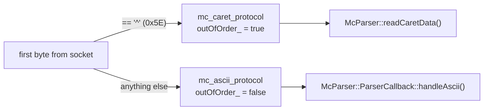
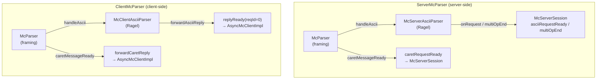
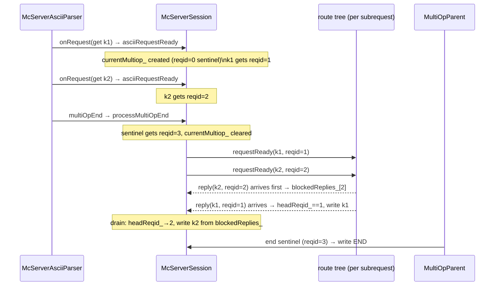
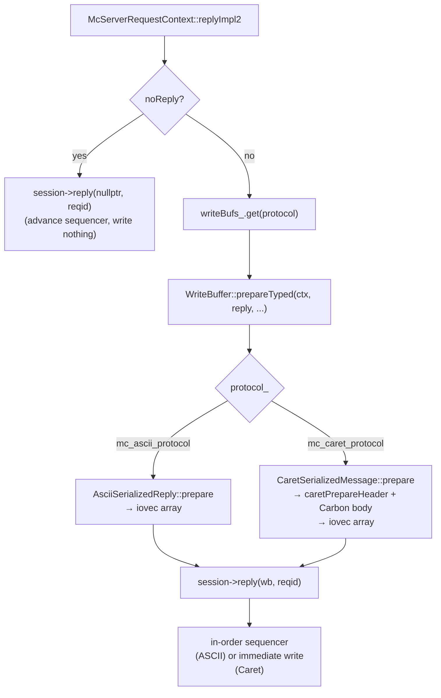

# mcrouter protocol parsing

how Meta's mcrouter reads bytes off a client connection, decides which protocol
is in use, drives a stateful parser to completion, dispatches one request per
key, reorders replies back to wire order, and serializes the response — covering
both the ASCII and Caret paths end to end.

> Source pinned to `facebook/mcrouter` @ `42aa391189c7`. Citations are by symbol
> and file path (relative to the repo root); line numbers drift, symbols don't.
> Reference-only — no rusty-mcrouter content. See
> [`../design/stateful-parser.md`](../design/stateful-parser.md) and
> [`../design/request-frames.md`](../design/request-frames.md) for the designs
> we derive from this. For the multi-op split specifically, see
> [`multiget.md`](./multiget.md). For the threading context that surrounds
> parsing, see [`threading-model.md`](./threading-model.md).

---

## tl;dr

- **Protocol is determined by the first byte.** `'^'` (`0x5E`, `kCaretMagicByte`)
  means Caret/binary; anything else means ASCII. This is a one-time, irreversible
  decision per connection (`McParser::readDataAvailable` /
  `determineProtocol`).
- **ASCII uses a Ragel-generated stateful parser** (`McAsciiParser.rl`). The
  server side is `McServerAsciiParser`; the client side is `McClientAsciiParser`.
  Both share `McAsciiParserBase` state (`UNINIT`, `PARTIAL`, `ERROR`,
  `COMPLETE`). Keys and values are parsed incrementally across buffer boundaries
  without copying.
- **Caret uses a fixed-layout binary header** (magic byte `'^'`, then a
  GroupVarint-encoded block of four uint32 fields: body size, typeId, reqId, and
  additional-field count, followed by varint key/value pairs for optional fields
  like traceId and compression codec). The body is a Carbon-serialized struct.
  Caret is **not** protobuf and is **not** Captain; it is mcrouter's own binary
  framing built on Carbon/GroupVarint.
- **`ServerMcParser` and `ClientMcParser`** are thin protocol-dispatch wrappers
  over `McParser`. They implement `McParser::ParserCallback` and route incoming
  bytes to either `McAsciiParser::consume` or `McParser::readCaretData`.
- **ASCII dispatches one `onRequest` per key** (multi-key commands are split at
  parse time), then a `multiOpEnd`. Caret dispatches one `caretMessageReady` per
  message.
- **`McServerSession`** owns the in-order reply sequencer (`headReqid_`,
  `tailReqid_`, `blockedReplies_`) and the current multi-op parent
  (`currentMultiop_`). ASCII replies must be emitted in parse order; Caret
  replies are out-of-order by `reqId`.
- **noreply** is a parser-level flag on write commands. The session suppresses
  the write buffer for those requests; multi-op subrequests suppress their
  individual `END` via `McServerRequestContext::noReply`.
- **Serialization** is protocol-specific: `AsciiSerializedReply` for ASCII,
  `CaretSerializedMessage` for Caret. Both produce `iovec` arrays; no value
  bytes are copied.

---

## first-byte protocol selection

Every connection starts with `protocol_ == mc_unknown_protocol`. The first call
to `McParser::readDataAvailable` that delivers at least one byte triggers
protocol detection:

```cpp
// mcrouter/lib/network/McParser.cpp
if (FOLLY_UNLIKELY(!seenFirstByte_)) {
  seenFirstByte_ = true;
  protocol_ = determineProtocol(*readBuffer_.data());
  if (protocol_ == mc_ascii_protocol) {
    outOfOrder_ = false;
  } else {
    assert(protocol_ == mc_caret_protocol);
    outOfOrder_ = true;
  }
}
```

`determineProtocol` is a one-liner in `McParser.h`:

```cpp
inline mc_protocol_t determineProtocol(uint8_t firstByte) {
  switch (firstByte) {
    case kCaretMagicByte:   // '^' == 0x5E
      return mc_caret_protocol;
    default:
      return mc_ascii_protocol;
  }
}
```

After detection the parser never re-checks: `outOfOrder_` is set once and
drives all subsequent reply-matching logic in `ClientMcParser`.



---

## McParser: the framing layer

`McParser` (`mcrouter/lib/network/McParser.h`) owns the read buffer and drives
the two paths. It is not instantiated directly by application code; instead
`ServerMcParser<Callback>` and `ClientMcParser<Callback>` each embed one as a
private member and implement `McParser::ParserCallback`.

The three callbacks `McParser` calls into are:

| Callback | When called |
|---|---|
| `caretMessageReady(headerInfo, buffer)` | Full Caret header + body are in the buffer |
| `handleAscii(readBuffer)` | Any ASCII data is available (called repeatedly) |
| `parseError(result, reason)` | Unrecoverable framing error |

### ASCII buffer management

For ASCII, `McParser` simply hands the raw `IOBuf` to `handleAscii` on every
`readDataAvailable` call. The ASCII parser is responsible for advancing the
buffer pointer as it consumes bytes. `ServerMcParser::handleAscii` calls
`asciiParser_.consume(readBuffer)` and checks the returned `State`.

There is a subtle optimization: when `McAsciiParserBase::hasReadBuffer()` is
true (the parser is mid-value and has its own internal buffer for the value
bytes), `ServerMcParser::getReadBuffer()` returns the ASCII parser's buffer
directly, bypassing `McParser`'s buffer entirely. This avoids a copy for large
values.

### Caret framing loop

`McParser::readCaretData()` loops over the read buffer, calling
`caretParseHeader` to extract `CaretMessageInfo` (header size, body size,
typeId, reqId, additional fields). Three cases:

1. **Full message in buffer** — call `caretMessageReady`, trim `messageSize`
   bytes, continue the loop.
2. **Partial header** — return and wait for more data.
3. **Full header, partial body** — reallocate the buffer to fit the full message
   (up to `kMaxBodySize` = 1 GiB), return and wait.

The buffer is a single flat `IOBuf` (never chained), so `caretMessageReady`
always receives a coalesced buffer containing the complete header and body.

---

## Caret header format

The Caret header is defined in `mcrouter/lib/network/CaretHeader.h`. It is
**not** protobuf and **not** Captain. It is mcrouter's own binary framing:

```
+--------+------------------+------------------------------------------+
| 1 byte | GroupVarint block| varint key/value pairs (additional fields)|
| magic  | (4 × uint32)     | up to kMaxAdditionalFields = 6 pairs      |
| '^'    | body_size        |                                           |
|        | typeId           | traceId, codec ids, server load, etc.     |
|        | reqId            |                                           |
|        | num_add_fields   |                                           |
+--------+------------------+------------------------------------------+
| body: Carbon-serialized struct (CarbonProtocolReader)                 |
+-----------------------------------------------------------------------+
```

The GroupVarint encoding packs four uint32 values with a one-byte length
descriptor, making the fixed portion of the header compact. Additional fields
are varint-encoded key/value pairs appended after the fixed block.

`kMaxHeaderLength` is computed statically:

```cpp
constexpr size_t kMaxHeaderLength =
    1 /* magic */ +
    1 /* GroupVarint header byte */ +
    4 * sizeof(uint32_t) /* body_size, typeId, reqId, num_add_fields */ +
    2 * kMaxAdditionalFields * folly::kMaxVarintLength64;
```

`kCaretConnectionControlReqId = 0` is reserved for connection-control messages
(GoAway, GoAwayAcknowledgement). Normal requests use `reqId >= 1`.

`caretParseHeader` / `caretPrepareHeader` in `CaretProtocol.h` are the only
functions that touch the wire format; everything else works through
`CaretMessageInfo`.

---

## ServerMcParser vs ClientMcParser

Both are template classes parameterized on a `Callback` type. They implement
`McParser::ParserCallback` and forward parsed messages to the callback.

### ServerMcParser

```
ServerMcParser<Callback>
  McParser parser_           — owns the read buffer, drives framing
  McServerAsciiParser asciiParser_  — Ragel server-side parser
  Callback& callback_        — McServerSession
```

ASCII path: `handleAscii` → `asciiParser_.consume(readBuffer)`. On `State::ERROR`
the callback's `parseError` is called with `CLIENT_ERROR "malformed request"`.

Caret path: `caretMessageReady` → `callback_.caretRequestReady(headerInfo, buffer)`.
On exception, `callback_.parseError` is called with `REMOTE_ERROR`.

The two parser callbacks the `McServerAsciiParser` fires back into
`ServerMcParser` are:

```cpp
template <class Request>
void ServerMcParser<Callback>::onRequest(Request&& req, bool noreply) {
  callback_.onRequest(std::move(req), noreply);
}

void ServerMcParser<Callback>::multiOpEnd() {
  callback_.multiOpEnd();
}
```

### ClientMcParser

```
ClientMcParser<Callback>
  McParser parser_           — owns the read buffer, drives framing
  McClientAsciiParser asciiParser_  — Ragel client-side parser
  asciiReplyForwarder_       — function pointer, set by expectNext<Request>()
  caretForwarder_            — function pointer, set by expectNext<Request>()
  Callback& callback_        — AsyncMcClientImpl
```

**ASCII (in-order):** before each reply, the client calls
`expectNext<Request>()`, which calls `asciiParser_.initializeReplyParser<Request>()`
and sets `asciiReplyForwarder_` to `forwardAsciiReply<Request>`. When the parser
completes, `forwardAsciiReply` calls `callback_.replyReady(reply, 0, stats)` —
`reqId = 0` because ASCII has no wire id; the client matches by FIFO order.

**Caret (out-of-order):** `expectNext<Request>()` sets `caretForwarder_` to
`forwardCaretReply<Request>`. When `caretMessageReady` fires, it checks
`reqId == kCaretConnectionControlReqId` for GoAway, then calls
`callback_.nextReplyAvailable(reqId)` to confirm the client is expecting a reply
for that id, then dispatches through `caretForwarder_`. The body is deserialized
with `carbon::CarbonProtocolReader`.



---

## McAsciiParserBase: stateful incremental parsing

`McAsciiParserBase` (`mcrouter/lib/network/McAsciiParser.h`) is the shared base
for both server and client parsers. Its state machine has four states:

```cpp
enum class State {
  UNINIT,    // not initialized for any message
  PARTIAL,   // have partial message, need more data
  ERROR,     // protocol-level error
  COMPLETE,  // full message parsed, ready to return
};
```

Key fields:

| Field | Purpose |
|---|---|
| `savedCs_` / `errorCs_` | Ragel current-state and error-state integers |
| `p_` / `pe_` | Ragel position pointer and end pointer |
| `currentUInt_` | Accumulator for integer fields (flags, exptime, value_bytes, etc.) |
| `currentIOBuf_` / `remainingIOBufLength_` | Tracks partial value reads across buffer boundaries |
| `keyPieceStart_` | Start of current key token in the buffer (for zero-copy key assembly) |
| `currentKey_` | Assembled key `IOBuf` (pieces appended across buffer boundaries) |
| `noreply_` | Set by the `noreply` token in write commands |

### partial key and value handling

Keys can span buffer boundaries. The server parser tracks `keyPieceStart_` and
calls `appendKeyPiece(buffer, currentKey_, keyPieceStart_, p_)` at the end of
each buffer pass. Values are read via `readValue(buffer, to)`, which uses
`remainingIOBufLength_` to know how many bytes remain and returns `false` (break
out of Ragel) when the buffer is exhausted mid-value. On the next
`readDataAvailable` call the parser resumes from `savedCs_` with the remaining
byte count intact.

This means **neither keys nor values are copied** during normal parsing: key
pieces are chained `IOBuf` slices into `currentKey_`, and values are read
directly into the message's `value_ref()` field.

---

## McServerAsciiParser: request dispatch

`McServerAsciiParser::consume` (`McAsciiParser.rl`) drives a two-level Ragel
machine:

1. **`opTypeConsumer` / `mc_ascii_req_type`** — matches the command keyword
   (`get`, `set`, `delete`, etc.) and sets `consumer_` to the appropriate
   per-command function, then `fbreak`s.
2. **Per-command consumer** — parses the rest of the command line and fires
   callbacks.

The outer loop in `consume`:

```cpp
while (p_ != pe_) {
  if (state_ == State::UNINIT) {
    // reset all fields, set consumer_ = opTypeConsumer
    state_ = State::PARTIAL;
    consumer_ = &McServerAsciiParser::opTypeConsumer;
  }
  (this->*consumer_)(buffer);
  // append any partial key piece
  if (keyPieceStart_ != nullptr) {
    appendKeyPiece(buffer, currentKey_, keyPieceStart_, p_);
  }
  if (savedCs_ == errorCs_) { handleError(buffer); break; }
  buffer.trimStart(p_ - buffer.data());
}
```

After each command completes, `finishReq()` resets `state_` to `UNINIT` so the
next command starts fresh.

### get-like: one onRequest per key

The get-like grammar in `McAsciiParser.rl` is the heart of the multi-op split:

```ragel
%%{
machine mc_ascii_get_like_req_body;

action on_full_key {
  callback_->onRequest(std::move(message));
}

req_body := ' '* key %on_full_key (' '+ key %on_full_key)* ' '* multi_op_end;
}%%
```

Each `%on_full_key` action fires `callback_->onRequest(std::move(message))` for
that single key. The `multi_op_end` rule fires on the trailing newline:

```ragel
multi_op_end = new_line @{
  callback_->multiOpEnd();
  finishReq();
  fbreak;
};
```

So `get k1 k2 k3\r\n` produces three `onRequest` calls followed by one
`multiOpEnd`. The gat/gats grammar (`mc_ascii_gat_like_req_body`) is identical
except it also parses an `exptime_req` field before the keys.

### write-like: one onRequest with noreply flag

Set-like commands parse the full header line, then the value bytes, then fire:

```ragel
req_body := ' '* key ' '+ flags ' '+ exptime_req ' '+ value_bytes
            (' '+ noreply)? ' '* new_line @req_value_data new_line @{
              callback_->onRequest(std::move(message), noreply_);
              finishReq();
              fbreak;
            };
```

The `noreply` token sets `noreply_ = true` in the parser; this is passed
directly to `McServerSession::onRequest` and stored in
`McServerRequestContext::noReply_`.

---

## McServerSession: request ids and reply ordering

`McServerSession` (`mcrouter/lib/network/McServerSession.h`) owns the in-order
sequencer for ASCII:

```cpp
uint64_t headReqid_{0};  // id of next reply we're allowed to send
uint64_t tailReqid_{0};  // id to assign to the next incoming request
std::unordered_map<uint64_t, std::unique_ptr<WriteBuffer>> blockedReplies_;
std::shared_ptr<MultiOpParent> currentMultiop_;
```

### asciiRequestReady: id assignment and multi-op parent creation

`McServerSession::asciiRequestReady` (in `McServerSession-inl.h`) is called for
every `onRequest` callback from the ASCII parser:

```cpp
template <class Request>
void McServerSession::asciiRequestReady(
    Request&& req, carbon::Result result, bool noreply) {

  if (carbon::GetLike<Request>::value && !currentMultiop_) {
    currentMultiop_ = std::make_shared<MultiOpParent>(*this, tailReqid_++);
  }
  uint64_t reqid = tailReqid_++;

  McServerRequestContext ctx(*this, reqid, noreply, currentMultiop_);
  ctx.asciiKey().emplace(req.key_ref()->raw().cloneOneAsValue());

  if (result == carbon::Result::BAD_KEY) {
    McServerRequestContext::reply(std::move(ctx), Reply(carbon::Result::BAD_KEY));
  } else {
    onRequest_->requestReady(std::move(ctx), std::move(req));
  }
}
```

For a get-like command, the first subrequest creates `currentMultiop_` and
consumes one `tailReqid_` for the parent's sentinel slot, then each subrequest
gets its own `tailReqid_`. For non-get-like commands, `currentMultiop_` is null.

### multiOpEnd: closing the sentinel

`McServerSession::multiOpEnd` calls `processMultiOpEnd`:

```cpp
void McServerSession::processMultiOpEnd() {
  currentMultiop_->recordEnd(tailReqid_++);
  currentMultiop_.reset();
}
```

This assigns the end sentinel its own `tailReqid_` slot and clears
`currentMultiop_` so the next command starts fresh.

### reply: in-order sequencing

`McServerSession::reply` enforces ASCII's in-order constraint:

```cpp
void McServerSession::reply(std::unique_ptr<WriteBuffer> wb, uint64_t reqid) {
  if (parser_.outOfOrder()) {
    queueWrite(std::move(wb));   // Caret: no ordering needed
  } else {
    if (reqid == headReqid_) {
      queueWrite(std::move(wb));
      auto it = blockedReplies_.find(++headReqid_);
      while (it != blockedReplies_.end()) {
        queueWrite(std::move(it->second));
        blockedReplies_.erase(it);
        it = blockedReplies_.find(++headReqid_);
      }
    } else {
      blockedReplies_.emplace(reqid, std::move(wb));
    }
  }
}
```

A reply that arrives out of order is stashed in `blockedReplies_` by its
`reqid`. When the head-of-line reply arrives, it is written immediately, then
the map is drained for any contiguous run of now-unblocked replies.

For Caret (`outOfOrder_ = true`) replies are written immediately in arrival
order; the wire `reqId` in the Caret header lets the client match them.



---

## Caret request path

`McServerSession::caretRequestReady` is called by `ServerMcParser` when a full
Caret message is available:

```cpp
void McServerSession::caretRequestReady(
    const CaretMessageInfo& headerInfo,
    const folly::IOBuf& reqBody) {

  assert(parser_.protocol() == mc_caret_protocol);
  assert(parser_.outOfOrder());

  updateCompressionCodecIdRange(headerInfo);

  if (headerInfo.reqId == kCaretConnectionControlReqId) {
    processConnectionControlMessage(headerInfo);
    return;
  }

  McServerRequestContext ctx(*this, headerInfo.reqId);
  // ... version shortcut ...
  onRequest_->caretRequestReady(headerInfo, reqBody, std::move(ctx));
}
```

The context is constructed with `headerInfo.reqId` directly from the wire. There
is no internal id assignment for Caret: the wire `reqId` is the id. Because
`outOfOrder_ = true`, `McServerSession::reply` writes Caret replies immediately
without consulting `headReqid_` / `blockedReplies_`.

This means **ASCII and Caret use completely separate id spaces**: ASCII ids are
internal monotonic counters assigned by `tailReqid_++`; Caret ids come from the
client and are echoed back in the reply header.

---

## noreply and suppression

noreply operates at two levels:

**Parser level (write commands):** the `noreply` token in the ASCII grammar sets
`noreply_ = true` in `McServerAsciiParser`. This is passed to
`McServerSession::onRequest` and stored as `McServerRequestContext::noReply_`.

**Multi-op subrequest level (get-like):** `McServerRequestContext::noReply`
returns `true` for a subrequest if:

```cpp
template <class Reply>
bool McServerRequestContext::noReply(const Reply& r) const {
  if (noReply_) { return true; }
  if (!hasParent()) { return false; }
  return isParentError() || *r.result_ref() != carbon::Result::FOUND;
}
```

So a get subrequest suppresses its write buffer if:
- the parent has already seen an error (`isParentError()`), or
- the result is not `FOUND` (misses produce no `VALUE` line).

`McLeaseGetReply` has a separate overload that only suppresses on parent error
(lease-get misses still produce an `LVALUE` reply with the token).

When `noReply` is true, `McServerRequestContext::replyImpl2` calls
`session->reply(nullptr, ctx.reqid_)` — passing a null write buffer. The
sequencer still advances `headReqid_` for that slot, preserving ordering, but
nothing is written to the socket.

---

## reply serialization

### ASCII: AsciiSerializedReply

`AsciiSerializedReply` (`mcrouter/lib/network/AsciiSerialized.h`) serializes a
reply into a stack-allocated `iovec` array (up to 16 entries) and a small
`printBuffer_` (100 bytes) for formatted integers. No heap allocation for the
common case.

For get-like replies, `prepare` takes the key from `McServerRequestContext`'s
`asciiKey()`:

```cpp
template <class Reply>
bool prepare(
    Reply&& reply,
    folly::Optional<folly::IOBuf>& key,
    const struct iovec*& iovOut,
    size_t& niovOut,
    carbon::GetLikeT<...> = nullptr) {
  if (key.hasValue()) { key->coalesce(); }
  prepareImpl(std::move(reply),
              key.hasValue() ? folly::StringPiece(key->data(), key->length())
                             : folly::StringPiece());
  iovOut = iovs_; niovOut = iovsCount_;
  return true;
}
```

An empty key (the end-context created by `MultiOpParent`) produces `END\r\n`.
A non-empty key on a `FOUND` result produces `VALUE <key> <flags> <bytes>\r\n<data>\r\n`.

### Caret: CaretSerializedMessage

`CaretSerializedMessage` (`mcrouter/lib/network/CaretSerializedMessage.h`)
serializes a Carbon struct into a `CarbonQueueAppenderStorage`, then prepends
the Caret header via `caretPrepareHeader`. The result is again an `iovec` array.
Optional compression is applied via `maybeCompress` if a codec is negotiated.
The wire `reqId` echoed in the reply header comes from the context's `reqid_`,
which for Caret is the client-supplied wire id.

### WriteBuffer: the dispatch point

`WriteBuffer::prepareTyped` (`mcrouter/lib/network/WriteBuffer.h`) is the single
dispatch point that chooses between the two serializers based on `protocol_`:

```cpp
union {
  AsciiSerializedReply asciiReply_;
  CaretSerializedMessage caretReply_;
};
```

The union means each `WriteBuffer` is protocol-specific at construction time.
`WriteBufferQueue` maintains a thread-local free stack of reusable buffers.



---

## knobs and constraints

| Knob / constraint | Where | Effect |
|---|---|---|
| `kCaretMagicByte = '^'` | `CaretHeader.h` | First-byte protocol selector; any other byte means ASCII |
| `kCaretConnectionControlReqId = 0` | `CaretHeader.h` | Reserved reqId for GoAway and connection-control messages |
| `kMaxAdditionalFields = 6` | `CaretHeader.h` | Max varint key/value pairs in a Caret header |
| `kMaxHeaderLength` | `CaretHeader.h` | Static upper bound on Caret header size |
| `kMaxBodySize = 1 GiB` | `McParser.cpp` | Caret body size limit; larger messages cause a parse error |
| `maxValueBytes = 1 GiB` | `McAsciiParser.h` | ASCII value size limit; parser clamps `remainingIOBufLength_` |
| `MC_KEY_MAX_LEN_ASCII` | `McServerSession.h` | Max ASCII key length; exceeded keys get `BAD_KEY` before dispatch |
| `minBufferSize` / `maxBufferSize` | `McParser` ctor | Read buffer sizing; buffer shrinks back to `maxBufferSize` after ~2B CPU cycles |
| `outOfOrder_` | `McParser` | Set once at first byte; drives reply-matching in `ClientMcParser` and write ordering in `McServerSession` |

---

## source map

| Concept | Symbol | File @ `42aa391189c7` |
|---|---|---|
| First-byte protocol detection | `McParser::readDataAvailable`, `determineProtocol` | `mcrouter/lib/network/McParser.cpp`, `McParser.h` |
| Caret framing loop | `McParser::readCaretData` | `mcrouter/lib/network/McParser.cpp` |
| Caret header struct | `CaretMessageInfo`, `kCaretMagicByte`, `kCaretConnectionControlReqId` | `mcrouter/lib/network/CaretHeader.h` |
| Caret header parse/prepare | `caretParseHeader`, `caretPrepareHeader` | `mcrouter/lib/network/CaretProtocol.h`, `.cpp` |
| Server parser dispatch | `ServerMcParser::handleAscii`, `caretMessageReady`, `onRequest`, `multiOpEnd` | `mcrouter/lib/network/ServerMcParser.h`, `ServerMcParser-inl.h` |
| Client parser dispatch | `ClientMcParser::handleAscii`, `caretMessageReady`, `expectNext`, `forwardAsciiReply`, `forwardCaretReply` | `mcrouter/lib/network/ClientMcParser.h`, `ClientMcParser-inl.h` |
| ASCII parser state | `McAsciiParserBase::State` (UNINIT/PARTIAL/ERROR/COMPLETE) | `mcrouter/lib/network/McAsciiParser.h` |
| Server ASCII parser | `McServerAsciiParser`, `consume`, `opTypeConsumer`, `finishReq` | `mcrouter/lib/network/McAsciiParser.h`, `McAsciiParser.rl` |
| Client ASCII parser | `McClientAsciiParser`, `initializeReplyParser`, `consume` | `mcrouter/lib/network/McAsciiParser.h`, `McAsciiParser.rl` |
| Get-like grammar (per-key split) | `mc_ascii_get_like_req_body`, `on_full_key`, `multi_op_end` | `mcrouter/lib/network/McAsciiParser.rl` |
| Write-like grammar (noreply) | `mc_ascii_set_like_req_body`, `noreply` token | `mcrouter/lib/network/McAsciiParser.rl` |
| Partial key assembly | `McAsciiParserBase::appendKeyPiece`, `keyPieceStart_` | `mcrouter/lib/network/McAsciiParser.h`, `McAsciiParser.rl` |
| Partial value reads | `McAsciiParserBase::readValue`, `remainingIOBufLength_` | `mcrouter/lib/network/McAsciiParser.h`, `McAsciiParser.rl` |
| Request id assignment + multi-op parent | `McServerSession::asciiRequestReady`, `tailReqid_`, `currentMultiop_` | `mcrouter/lib/network/McServerSession-inl.h` |
| Multi-op end sentinel | `McServerSession::processMultiOpEnd`, `MultiOpParent::recordEnd` | `mcrouter/lib/network/McServerSession.cpp`, `MultiOpParent.h` |
| In-order reply sequencer | `McServerSession::reply`, `headReqid_`, `blockedReplies_` | `mcrouter/lib/network/McServerSession.cpp` |
| Caret request dispatch | `McServerSession::caretRequestReady` | `mcrouter/lib/network/McServerSession.cpp` |
| noreply suppression | `McServerRequestContext::noReply`, `noReply_` | `mcrouter/lib/network/McServerRequestContext-inl.h` |
| Multi-op error suppression | `McServerRequestContext::moveReplyToParent`, `isParentError` | `mcrouter/lib/network/McServerRequestContext-inl.h`, `McServerRequestContext.h` |
| ASCII reply serialization | `AsciiSerializedReply::prepare`, `prepareImpl` | `mcrouter/lib/network/AsciiSerialized.h`, `AsciiSerialized.cpp` |
| Caret reply serialization | `CaretSerializedMessage::prepare`, `fill`, `fillImpl` | `mcrouter/lib/network/CaretSerializedMessage.h`, `CaretSerializedMessage-inl.h` |
| Serialization dispatch | `WriteBuffer::prepareTyped` | `mcrouter/lib/network/WriteBuffer.h`, `WriteBuffer-inl.h` |
| McServerRequestContext | `McServerRequestContext` (reqid_, noReply_, asciiState_) | `mcrouter/lib/network/McServerRequestContext.h` |
| MultiOpParent | `MultiOpParent` (recordRequest, recordEnd, reply, release) | `mcrouter/lib/network/MultiOpParent.h`, `MultiOpParent.cpp` |
