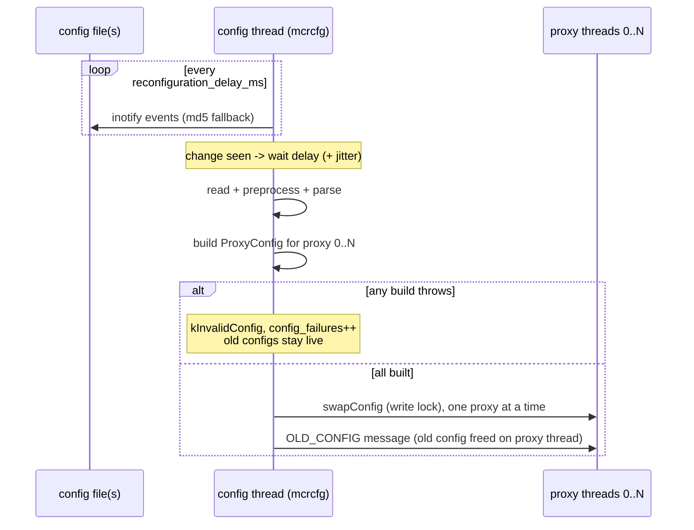

# mcrouter: config reload

> reference doc: describes upstream mcrouter only. our design lives in
> `../design/0002-config-reload.md`.
> sources: ConfigApi.cpp, FileDataProvider.cpp, CarbonRouterInstance-inl.h,
> Proxy{.h,-inl.h}, ProxyDestinationMap-inl.h, ProxyDestinationKey.h,
> ProxyDestinationBase.cpp, TkoTracker.{h,cpp}, stat_list.h, stats.cpp,
> mcrouter_options_list.h @ the checkout at ~/mc/mcrouter. line numbers
> are relative to `mcrouter/`.

## the shape of the system

a dedicated config thread (`mcrcfg`) watches the config files. when they
change, it builds a complete `ProxyConfig` for every proxy, then swaps
them in. proxies never parse config or build route handles themselves.

## options

| option | default | line | meaning |
|---|---|---|---|
| `config` | `""` | `mcrouter_options_list.h:477` | `file:<path>` or an inline JSON string; supersedes the deprecated `config_file` (`:503`) and `config_str` (`:518`) |
| `disable_reload_configs` | false | `:470` | do not start the config thread at all (`ConfigApi.cpp:145-150`) |
| `constantly_reload_configs` | false | `:463` | test/debug mode: reconfigure every 10ms whether or not anything changed (`ConfigApi.cpp:194-206`) |
| `reconfiguration_delay_ms` | 1000 | `:565` | wait between a detected change and the reconfigure |
| `reconfiguration_jitter_ms` | 0 | `:573` | extra random delay before reconfiguring, to de-synchronize a fleet |
| `post_reconfiguration_delay_ms` | 0 | `:582` | wait after a reconfigure before checking again |
| `config_dump_root` | build-defined | `:486` | where the last valid config is saved |
| `max_dumped_config_age` | 12h | `:495` | oldest dumped backup config mcrouter may start from |
| `default_route` (`--route-prefix`) | `/././` | `:527` | a router option, not config; fixed for the process |
| `send_invalid_route_to_default` | false | `:543` | a router option; fixed for the process |

everything that shapes the process — `num_proxies`, listen ports, the
default route, TKO thresholds — is an option. options are not reloaded.
only the routing config (pools + routes) is reloaded.

## change detection

`FileDataProvider` watches each tracked file with inotify, using the mask
`IN_MODIFY | IN_MOVE_SELF | IN_DELETE_SELF | IN_DONT_FOLLOW`
(`FileDataProvider.cpp:40-41`). it also walks and watches every symlink in
the chain, because "mcrouter configs are a symlink to the actual config
file" (`FileDataProvider.cpp:58-80`). this handles atomic
symlink-swap deploys.

the config thread loop (`ConfigApi.cpp:208-268`):

1. `checkFileUpdate()` polls every tracked file's provider
   (`ConfigApi.cpp:167-190`). if a provider throws, it is discarded.
   from then on, the file falls back to an md5-of-contents comparison at most
   once every `kConfigReloadInterval = 60` seconds (`ConfigApi.cpp:37`,
   `:184-186`).
2. it waits `reconfiguration_delay_ms` on **every** iteration, whether or not
   anything changed (`ConfigApi.cpp:234-240`). the comment at `:224-232`
   explains why. `IN_MODIFY` can fire before a write is complete, which
   produces malformed JSON. also, editors shuffle files around, e.g. vim's
   `.swp` handling. the fixed wait is "jankiness" that covers both races.
3. if something changed: apply the optional jitter (`:243-252`), notify
   subscribers (`:253`), then apply the optional post-reconfigure delay
   (`:256`, `:270-278`).

tracked files include the main config and every `@import`ed file.
`config_sources_info` reports them with their md5 hashes
(`ConfigApi.cpp:446-459`). the tracked set changes only when a
reconfigure succeeds. a failed attempt abandons the newly tracked
sources (`CarbonRouterInstance-inl.h:506-509`).

## the reconfigure

the subscriber is installed in `spawnAuxiliaryThreads`
(`CarbonRouterInstance-inl.h:454-462`). its callback runs on the config
thread, under `configReconfigLock_` (`:433-451`):

1. **`createConfigBuilder`** (`:551-587`) first records
   `lastConfigAttempt_` and increments `configFullAttempt_`. this happens
   before any work, "so that successful config is always >= last config
   attempt" (`:554-559`). it then reads the file and constructs a
   `ProxyConfigBuilder`, which preprocesses and parses the config.
   - a read failure logs `kBadEnvironment` "Can not read config from"
     (`:578-582`)
   - a parse failure logs `kInvalidConfig` "Failed to reconfigure"
     (`:569-575`)
   - both increment `configFailures_`
2. **`configure`** (`:515-548`) builds one `ProxyConfig` per proxy **on the
   config thread** (`:520-523`). only after all of them are built does it
   swap each proxy (`:531-533`).
   - **all-or-nothing:** if any build throws, the function returns before any
     swap (`:524-529`). the failure is counted by `reconfigure`
     (`:502-506`).
3. on success it logs "reconfigured N proxies with P pools, C clients
   <md5>" at VLOG(1) (`:535-539`) and dumps the preprocessed config to
   disk (`:541-545`). back in the callback, it clears
   `configuredFromDisk_` and notifies `onReconfigureSuccess_` subscribers
   (`:444-447`). on failure it logs "Error while reconfiguring mcrouter
   after config change" (`:448`).

the comment at `:566-567` states the assumption that the default
route/region/cluster are the same for every proxy. they come from options,
so a config change cannot move them.

## swap mechanics

- `Proxy::swapConfig` exchanges the proxy's `shared_ptr<ProxyConfig>`
  under a unique lock on a `folly::SharedMutex` (`Proxy-inl.h:278-284`).
  readers use `getConfigLocked` (shared lock, `:270-275`) or
  `getConfigUnsafe` (`Proxy.h:116`).
- **requests pin their config.** a request captures the current
  `shared_ptr<ProxyConfig>` when processing starts (`Proxy-inl.h:370-371`).
  in-flight requests finish on the config they started with. the old
  config dies with its last request.
- `proxy_config_swap` (`Proxy-inl.h:398-408`) sets `config_last_success`
  on the proxy's stats (`:402`). it then sends the old config to the proxy
  as an `OLD_CONFIG` message. the proxy thread deletes it (`:320-323`),
  so the swap's reference to the old config is released on the proxy
  thread, not the config thread.
- there is no generation or epoch number. the proxies are swapped one after
  another, so for a moment some run the new config and some the old.

## state continuity

a reconfigure rebuilds every route handle. state that should survive lives
outside the route graph, keyed by stable identity. it is picked up again
because the new config is built **while the old one is still alive**.

| state | keyed by | across a reconfigure |
|---|---|---|
| destinations (connections) | `ProxyDestinationKey{accessPoint, timeout, idx}` (`ProxyDestinationKey.h:22-25`) | reused if the key matches (`ProxyDestinationMap-inl.h:59-65`); the connection survives |
| destination TKO tracker | `host:port` (`TkoTracker.cpp:304`) | reused while alive; `tkoThreshold` applies only when a tracker is created (`:313-321`) |
| pool TKO tracker (fail-open gate) | **pool name** (`TkoTracker.cpp:281-298`) | returned if still alive; enter/exit thresholds are fixed at creation |
| route-handle state (e.g. failover policy) | the handle | rebuilt from scratch |

details:

- the destination map is guarded by `destinationsLock_`
  (`ProxyDestinationMap-inl.h:58`) because builds run on the config thread
  while the proxy uses the map.
  - a reused destination keeps its own parameters. only the key
    distinguishes destinations.
  - `updateTracker` re-attaches the shared TKO tracker and the pool's gate
    (`:74-75`).
- `TkoTracker::setPoolTracker` simply replaces the pointer
  (`TkoTracker.h:175-177`). marks and unmarks both go through whatever gate
  is attached at that moment (`TkoTracker.cpp:69-70`, `:88-89`, `:97-98`,
  `:116-117`). we found no code that moves an outstanding mark between
  gates. suppose a destination is marked while counted in gate A, and a
  reconfigure then attaches gate B. the eventual unmark decrements B.
- a destination that is dropped from config is destroyed once its last
  reference goes. if it was responsible for a TKO, its destructor clears
  the TKO state, logs `TkoLogEvent::RemoveFromConfig` and stops probing
  (`ProxyDestinationBase.cpp:95-100`, `TkoTracker.cpp:269-275`).

## observability

config stats live in the `ods_stats | detailed_stats` group
(`stat_list.h:369-378`):

| stat | meaning | source |
|---|---|---|
| `config_last_success` | unix time of the last swap; per proxy, max across proxies at read time | `Proxy-inl.h:402`, `stats.cpp:380-398` |
| `config_age` | `now - config_last_success`, computed at read time | `stats.cpp:515` |
| `config_last_attempt` | set before every attempt | `CarbonRouterInstance-inl.h:556` |
| `config_full_attempt` | attempts, including startup | `CarbonRouterInstance-inl.h:557-559` |
| `config_failures` | read, parse and build failures | `CarbonRouterInstance-inl.h:503-505`, `:583-585` |
| `configs_from_disk` | running from a dumped backup config | `stats.cpp:543` |

admin reads (`__mcrouter__.config_age`, `config_file`,
`config_md5_digest`, `config_sources_info`, ...) are covered in
`stats.md` §admin surface.

## takeaways for a port

1. **validate everything, then swap everything.** a bad config never
   touches a proxy. upstream gets this for free by building every proxy's
   config on one thread.
2. **build the new config while the old one is alive.** that is the whole
   continuity mechanism. weak/dedup maps keyed by stable identity
   (`host:port`, pool name, destination key) hand the new graph the live
   state. nothing is copied.
3. **pin per request, free late.** each request holds its config.
   dropping the last reference to the old config is what releases removed
   destinations, and that fires `RemoveFromConfig`.
4. **options are not config.** process shape, the default route and TKO
   thresholds are fixed at startup. only pools and routes reload.
5. **debounce is a fixed delay, not cleverness.** upstream waits about one
   second after a change and re-reads. a failed parse of a half-written
   file is simply retried on the next change.
6. **gates can mis-attribute marks.** a destination that changes pool while
   TKO'd is unmarked against the wrong gate. upstream tolerates this; the
   case is narrow, and a fix touches the TKO compare-and-swap paths.
