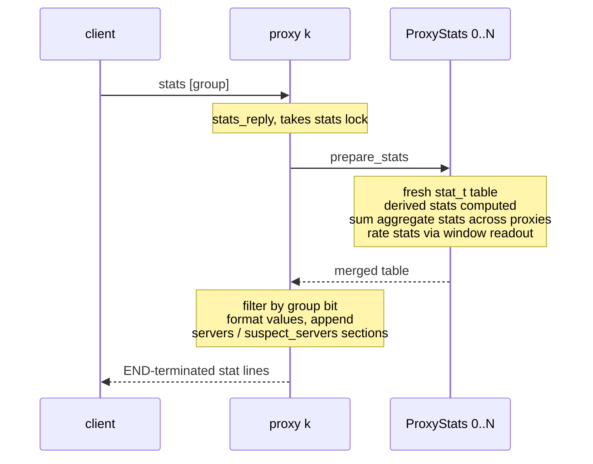

# mcrouter: stats and observability

> reference doc: describes upstream mcrouter only. our design lives in
> `../design/0001-observability.md`.
> sources: mcrouter/stats.{h,cpp}, stat_list.h, ProxyStats.{h,cpp},
> CarbonRouterInstanceBase.cpp, McrouterLogger.cpp, PoolStats.h,
> ServiceInfo-inl.h @ the checkout at ~/mc/mcrouter

## the shape of the system

three kinds of threads touch stats, with strictly separated roles:

```mermaid
flowchart TB
    subgraph proxy threads, one per proxy
        P1[proxy 0<br/>ProxyStats: stats_ array<br/>statsBin_ 240 bins<br/>carbon request stats]
        P2[proxy N<br/>ProxyStats ...]
    end
    subgraph background scheduler thread
        U[updateStats tick, 1s<br/>rotate rate bins]
        L[McrouterLogger tick<br/>stats_logging_interval<br/>JSON dump to stats_root]
    end
    subgraph read path, on whichever proxy got the request
        S[stats_reply<br/>prepare_stats]
    end
    P1 -- "relaxed store, no lock" --> P1
    P2 -- "relaxed store, no lock" --> P2
    U -- "locks ALL proxy mutexes together" --> P1
    U -- " " --> P2
    S -- "locks, reads every proxy" --> P1
    S -- " " --> P2
    L -- "prepare_stats over all proxies" --> P1
    L -- " " --> P2
    L --> F[(prefix.stats JSON<br/>atomic rename)]
    F --> O[fb collectors tail files<br/>= the ods pipeline]
```

| actor | when | writes | locks |
|-------|------|--------|-------|
| proxy thread | every request | its own `ProxyStats` arrays only | none |
| updater tick | every 1s | rotates every proxy's rate bins | all proxy stats mutexes, together |
| `stats` reply / logger | on request / on interval | nothing (reads + fresh temp table) | proxy stats mutex(es) |

the invariant that makes it work: **each counter array has exactly one
writer thread** (its proxy). everything cross-thread is either the
coarse background tick or read-time merging.

## the registry

all named stats are defined in one x-macro file, `stat_list.h` (~232
entries), expanded twice: once into `enum stat_name_t { ... num_stats }`
and once into an init function that fills a `stat_t` table:

```c
struct stat_t {
  folly::StringPiece name;
  int group;            // bitmask, see below
  stat_type_t type;     // stat_string | stat_uint64 | stat_int64 | stat_double
  int aggregate;        // 1 = sum across proxies at read time
  union { char* string; uint64_t uint64; int64_t int64; double dbl; } data;
};
```

groups are a bitmask, and *the group is the semantics* — there is no
explicit gauge/counter flag:

| group bit             | meaning |
|-----------------------|---------|
| `basic_stats`         | in the default `stats` reply |
| `detailed_stats`      | `stats detailed` |
| `ods_stats`           | exported to the periodic JSON dump (fb's ods pipeline) |
| `rate_stats`          | windowed: reported as per-second rate over the window |
| `count_stats`         | cumulative counter |
| `max_stats` / `max_max_stats` | per-bin max (across / within proxies) |
| `avg_stats`           | `ExponentialSmoothData`-backed averages |
| `server_stats` / `suspect_server_stats` | generated sections, not table entries |
| `external_stats`      | `EXTERNAL_STAT(...)` names reserved for an external handler (prefix_acl_*) |

one bitmask therefore answers three different questions at once —
which reply group shows a stat, how its value is computed, and whether
it's exported — a conflation a port can undo.

naming conventions: `num_*` gauges, `result_<error>` (rate) paired with
`result_<error>_all_count` (cumulative), `duration_us`, process stats
(`ps_rss`, `rusage_user`), config stats (`config_age`,
`config_last_success`).

per-command stats (`cmd_get_count`, `cmd_get_out_all`, ...) are **not**
in `stat_list.h` — they're carbon codegen (`carbon::Stats`, names from
`MemcacheRouterStats.h`, 19 commands × 4 variants = 76 names), bumped
per request with `RouterStatTypes::{Incoming, Outgoing, AllOutgoing}`,
with their own bins rotated by the same updater tick
(`advanceRequestStatsBin`), merged into the same replies and dumps.

there is also an optional global `StatsApi` hook (stats.h): when
installed, every `stat_incr`/`stat_set` additionally calls
`addSample`/`setValue` on it — a side-channel for embedding
applications; must be thread-safe.

## hot-path discipline (the part worth copying)

counters are **per-proxy plain arrays**, `ProxyStats::stats_[num_stats]`,
one instance per proxy thread. an increment is:

```c
// stats.h — detail::stat_incr_internal
ref.store(ref.load(relaxed) + amount, relaxed);   // folly::atomic_ref
```

not an atomic RMW — a relaxed load+store, safe only because each array
has a single writer thread; readers may see slightly-stale values,
never torn ones. no locks, no allocation on increment. the few
genuinely cross-thread counters use a real `fetch_add`
(`incrementSafe`). the per-proxy mutex exists but is taken only by the
background updater and by `stats` reply generation, never by request
processing. the one lazy allocation: a destination's per-result-code
array is heap-allocated on first reply.

## rate windows

rate/max stats are windowed over **240 one-second bins** (4 minutes):

```c
#define MOVING_AVERAGE_WINDOW_SIZE_IN_SECOND (60 * 4)
#define MOVING_AVERAGE_BIN_SIZE_IN_SECOND (1)
// ProxyStats: uint64_t statsBin_[num_stats][240]; circular
```

life of one rate stat (say `result_timeout`), per proxy:

```
proxy thread                     updater tick (1s)              reader
────────────                     ─────────────────              ──────
stats_[i]++  (live counter)
stats_[i]++
                                 bin[t] = stats_[i]
                                 stats_[i] = 0
                                 window_sum += bin[t] - bin[t-240]
                                 t = (t+1) % 240   (shared index,
                                  advanced once for ALL proxies)
                                                                rate = Σ proxies window_sum
                                                                       / (bins_used × 1s)
```

the tick (`registerForStatsUpdates` on the global `FunctionScheduler`)
locks **all** proxies' stats mutexes together — "to avoid inconsistence
among proxies" — so every proxy's bins rotate as one atomic step and
per-bin cross-proxy sums are coherent. that coherence is what makes
`max_stats` meaningful:

- rate    = sum of bins across proxies / (bins_used × bin_size) → per-second
- max     = max over bins of the cross-proxy per-bin sum
- max_max = max over bins and proxies

`max_stats`/`max_max_stats` snapshot-and-zero each tick instead of
summing a window.

## read path: aggregation happens at request time



`prepare_stats` allocates a fresh `vector<stat_t>(num_stats)` per
request (the read path is *not* allocation-free — only the write path
is), computes derived stats (averages, rusage, per-proxy
`ExponentialSmoothData` durations divided by proxy count), then sums
every stat with `aggregate && !rate_stats` across proxies.

group strings: empty → basic, `all`, `detailed`, `cmd-error`, `ods`,
`servers`, `suspect_servers`, `count`, `external`; unknown →
`CLIENT_ERROR bad stats command`.

- **`stats servers`** — one line per destination:
  `avg_latency_us:… pending_reqs:… inflight_reqs:… [hard_tko|soft_tko;]
  up:… ; ok:N remote_error:N …` (per-result counters, states
  up/new/closed/down).
- **`stats suspect_servers`** — from the tko tracker map's suspect
  scan: `status:{tko|down} num_failures:{n}` per server.

## admin surface: the magic key prefix

admin commands ride on ordinary gets:

```c
constexpr folly::StringPiece kInternalGetPrefix("__mcrouter__.");
```

`processGetServiceInfoRequest` strips the prefix and dispatches to
`ServiceInfo` commands: `version`, `config_age`, `config_file`,
`config_md5_digest`, `options`, `route_handles`,
`preprocessed_config`, `config_sources_info`, `hostid`, `verbosity`,
`pools`, `failure_domains`, and `route(...)` (dry-run routing: which
server would this key hit). `version` as a bare command is answered
directly with `MCROUTER_PACKAGE_STRING`.

## per-pool and per-destination

- **`PoolStats`** (opt-in per pool): `<pool>.requests.sum`,
  `<pool>.final_result_error.sum`, `<pool>.connections`,
  `<pool>.duration_us.avg`, `<pool>.total_duration_us.avg` — durations
  are `ExponentialSmoothData<64>`; merged across proxies at read time
  (`getAggregatedPoolStatsMap`).
- **per-destination**: `ExponentialSmoothData<16> avgLatency`, lazy
  per-result-code counters, retransmits-per-kb; tko state read from
  the shared `TkoTracker`. surfaces only through `stats servers` /
  `suspect_servers`, never the flat table.
- `ExponentialSmoothData<W>` is one atomic double:
  `value = (sample + (W-1)·value) / W`, relaxed.

## background dump (the ods bridge)

if `stats_logging_interval != 0`, `McrouterLogger` runs on the same
scheduler: `prepare_stats` + pool stats + request stats, rates
converted to doubles, then **atomic-rename JSON files** under
`stats_root`:

```
<prefix>.stats                only ods_stats-group entries,
                              keys prefixed getStatPrefix(opts)+"."
<prefix>.startup_options      once, includes pid
<prefix>.config_sources_info  each cycle
```

fb-internal collectors tail these files — this file dump *is*
mcrouter's metrics exporter; there is no listening endpoint. (quirk:
`max_max_stats` are dumped using the `max` aggregation, an apparent
upstream bug.)

## takeaways for a port

1. write path: single-writer per-thread fixed arrays, relaxed stores,
   zero locks/allocation. all merging deferred to a 1s background tick
   and to read time (which does allocate — per stats request upstream,
   per scrape for us).
2. the group bitmask conflates export-target, reply-group, and
   value-semantics; a port can separate those into label/registry
   concerns.
3. rate windowing exists because the export format is point-in-time
   JSON; a scrape-based system with native rate() may not need the
   240-bin machinery at all.
4. the all-proxies-locked-together rotation is only needed for
   cross-proxy-coherent per-bin maxima — if you drop max_stats (or
   accept promql max_over_time), you don't need a coordinated tick.
5. admin surface = `stats [group]` + `__mcrouter__.` get prefix — two
   protocol-level features, separable from the metrics export.
